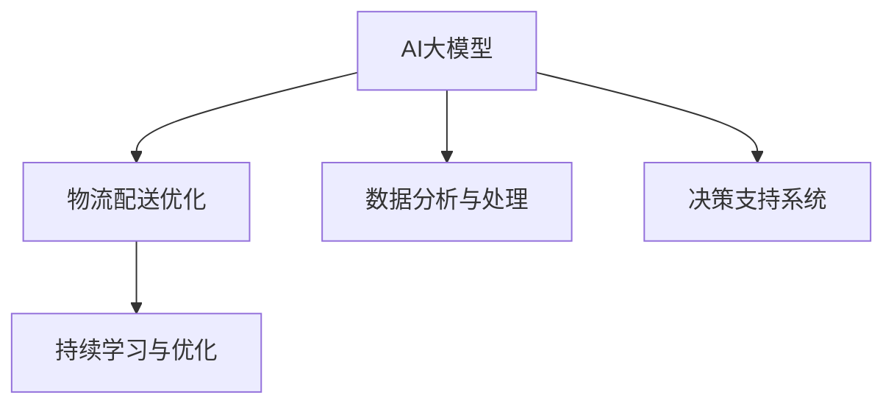

                 

# 电商平台如何利用AI大模型优化物流配送

## 1. 背景介绍

### 1.1 问题由来

电商平台的物流配送一直以来是其运营成本和用户体验的核心痛点。传统物流配送过程中，信息传输不畅通、仓库拣选效率低下、配送路线不合理等问题导致成本高昂、效率低下，用户体验差。如何通过AI技术，改善物流配送效率，降低运营成本，提升用户体验，成为电商物流领域亟待解决的问题。

### 1.2 问题核心关键点

1. **数据量大**：电商物流涉及大量实时数据，包括订单、库存、仓库位置、物流状态等。如何有效处理和分析这些数据，提升决策的科学性，是关键。
2. **实时性要求高**：物流配送决策需要实时响应，如及时更新库存、自动生成配送路线等。AI技术应具备高效率和高可靠性。
3. **多源异构数据融合**：订单数据、库存数据、物流状态数据等，来源不同，格式不同。需要统一数据格式，进行数据融合。
4. **智能决策支持**：通过AI模型分析物流数据，优化配送路线、预测订单需求等，提供决策支持。
5. **持续学习与优化**：物流环境变化快，AI模型应具备自适应能力，不断学习和优化。

## 2. 核心概念与联系

### 2.1 核心概念概述

为更好地理解AI大模型在电商物流中的应用，本节将介绍几个关键概念及其联系：

- **AI大模型**：指基于深度学习算法，在大规模数据上进行预训练的模型，如BERT、GPT、Transformer等。这些模型通过自监督学习任务，学习到丰富的知识，能够在大规模任务上取得优异表现。

- **物流配送优化**：指通过算法优化配送路线、拣选策略、库存管理等，以提升配送效率和降低运营成本。AI大模型可以提供精确的路线规划、高效的拣选策略和科学的库存管理建议。

- **数据分析与处理**：指对物流数据进行收集、清洗、处理和分析，以提取有价值的信息，辅助决策。AI大模型能够自动进行数据处理，提高数据分析效率和准确性。

- **决策支持系统**：指通过AI模型，对物流数据进行分析和预测，辅助管理层制定决策。

- **持续学习与优化**：指模型能够不断从新数据中学习，调整参数，优化决策效果。

这些核心概念之间的联系可以通过以下Mermaid流程图来展示：



这个流程图展示了AI大模型与其他物流配送关键技术之间的联系：

1. AI大模型通过预训练获得通用知识，可以用于物流数据处理和决策支持。
2. 物流配送优化通过AI大模型提供的精确路线和高效策略，实现资源的最优配置。
3. 数据分析与处理将物流数据转化为可用信息，辅助决策支持系统进行科学决策。
4. 决策支持系统利用AI大模型分析结果，辅助管理层做出最优决策。
5. 持续学习与优化保持AI大模型知识的时效性，不断适应物流环境变化。

## 3. 核心算法原理 & 具体操作步骤
### 3.1 算法原理概述

基于AI大模型的电商物流配送优化，本质上是一个多目标优化问题。其核心思想是：将配送任务转化为一个或多个优化目标，利用AI大模型学习任务特征，通过求解优化问题，获取最优的配送策略。

具体而言，假设电商平台有N个物流节点，每个节点i对应一定的货物需求d_i，配送成本c_i，时间和距离等约束条件。配送任务的目标是找到最优的配送路径，使得总配送成本最小，且满足时间和距离的约束。可以定义目标函数和约束条件如下：

$$
\min \sum_{i=1}^N c_i x_i
$$

其中x_i表示节点i是否配送。约束条件包括：

$$
\sum_{j=1}^N a_{ij} x_j \leq d_i \quad \forall i \\
t_{\min} \leq \sum_{j=1}^N t_{ij} x_j + \sum_{j=1}^N t_{ji} (1-x_j) \leq t_{\max} \quad \forall i \\
\sum_{i=1}^N x_i \leq 1 \\
$$

其中a_{ij}表示节点i到节点j的运输能力，t_{ij}表示从节点i到节点j的运输时间，t_{\min}和t_{\max}表示时间上下限。

### 3.2 算法步骤详解

基于AI大模型的电商物流配送优化，一般包括以下几个关键步骤：

**Step 1: 数据预处理与特征提取**
- 收集电商平台的物流数据，包括订单、库存、位置、配送状态等。
- 对数据进行清洗、去重、标准化处理，确保数据质量。
- 提取重要特征，如配送距离、时间、成本、配送能力等，作为模型输入。

**Step 2: 模型选择与训练**
- 选择合适的AI大模型，如Transformer、BERT等，作为决策支持模型的基础。
- 在标注数据集上进行模型预训练，学习物流数据的特征表示。
- 在特定任务上进行微调，优化模型性能。

**Step 3: 优化目标定义与求解**
- 根据电商平台的业务需求，定义优化目标，如总配送成本最小化、配送时间最短化等。
- 利用AI大模型的预测结果，构建优化问题的数学模型。
- 通过求解优化问题，得到最优的配送路径、拣选策略等。

**Step 4: 决策支持与实施**
- 将优化结果反馈给电商平台，辅助管理层制定配送策略。
- 实时监控配送过程，根据实际情况进行调整。
- 记录优化效果，持续改进AI大模型和算法。

### 3.3 算法优缺点

基于AI大模型的电商物流配送优化方法具有以下优点：
1. **精度高**：AI大模型通过大量数据训练，可以学习到复杂的物流场景，提供高精度的决策支持。
2. **适应性强**：AI大模型具备持续学习的能力，能够适应物流环境的变化。
3. **效率高**：AI大模型可以在短时间内处理大量物流数据，快速做出决策。
4. **自动化**：AI大模型可以自动进行数据处理和决策优化，降低人工干预成本。

同时，该方法也存在一些缺点：
1. **数据需求高**：需要大量标注数据进行训练，数据获取成本较高。
2. **模型复杂度高**：AI大模型参数量巨大，对计算资源要求高。
3. **解释性差**：AI大模型的决策过程复杂，难以进行解释和调试。
4. **过度拟合风险**：在标注数据不足的情况下，AI大模型容易过度拟合，泛化能力差。

尽管存在这些缺点，但AI大模型在电商物流中的应用仍然具有显著优势，能够显著提升配送效率和用户体验。

### 3.4 算法应用领域

基于AI大模型的电商物流配送优化方法，在电商物流领域已经得到了广泛应用，具体包括：

- **配送路径优化**：通过AI大模型计算最优配送路线，减少配送时间，降低成本。
- **库存管理**：预测库存需求，自动调整库存水平，减少库存积压。
- **拣选策略优化**：根据订单需求，自动生成最优拣选路径，提高拣选效率。
- **异常监控与预测**：利用AI大模型监测物流状态，预测异常情况，及时预警。
- **配送时间优化**：通过AI大模型计算配送时间，提高用户满意度。

这些应用场景展示了AI大模型在电商物流中的强大潜力，推动了物流配送的智能化和自动化。

## 4. 数学模型和公式 & 详细讲解 & 举例说明
### 4.1 数学模型构建

本节将使用数学语言对AI大模型在电商物流中的应用进行更加严格的刻画。

假设电商平台的物流节点数为N，每个节点i对应的需求为d_i，配送成本为c_i，配送能力为a_{ij}，时间成本为t_{ij}。配送任务的目标是找到最优的配送路径，使得总配送成本最小。可以定义目标函数和约束条件如下：

$$
\min \sum_{i=1}^N \sum_{j=1}^N c_{ij} x_{ij}
$$

其中x_{ij}表示节点i到节点j的配送状态，0表示不配送，1表示配送。约束条件包括：

$$
\sum_{j=1}^N x_{ij} \leq d_i \quad \forall i \\
\sum_{j=1}^N x_{ji} \leq d_i \quad \forall i \\
t_{\min} \leq \sum_{j=1}^N t_{ij} x_{ij} + \sum_{j=1}^N t_{ji} (1-x_{ij}) \leq t_{\max} \quad \forall i \\
\sum_{i=1}^N \sum_{j=1}^N x_{ij} \leq M \\
$$

其中M表示总的配送任务量，t_{\min}和t_{\max}表示时间上下限。

### 4.2 公式推导过程

下面以配送路径优化为例，进行公式推导。

假设物流节点数为N，配送路径数为K，AI大模型对路径i和j的预测概率为p_{ij}，配送成本为c_{ij}，时间成本为t_{ij}。则目标函数和约束条件如下：

$$
\min \sum_{i=1}^N \sum_{j=1}^K c_{ij} x_{ij}
$$

$$
\sum_{j=1}^K x_{ij} \leq d_i \quad \forall i \\
\sum_{j=1}^K x_{ji} \leq d_i \quad \forall i \\
t_{\min} \leq \sum_{j=1}^K t_{ij} x_{ij} + \sum_{j=1}^K t_{ji} (1-x_{ij}) \leq t_{\max} \quad \forall i \\
\sum_{i=1}^N \sum_{j=1}^K x_{ij} \leq M \\
$$

根据上述目标函数和约束条件，可以构建以下优化问题：

$$
\min \sum_{i=1}^N \sum_{j=1}^K c_{ij} x_{ij} \\
s.t. \quad \sum_{j=1}^K x_{ij} \leq d_i \quad \forall i \\
\sum_{j=1}^K x_{ji} \leq d_i \quad \forall i \\
t_{\min} \leq \sum_{j=1}^K t_{ij} x_{ij} + \sum_{j=1}^K t_{ji} (1-x_{ij}) \leq t_{\max} \quad \forall i \\
\sum_{i=1}^N \sum_{j=1}^K x_{ij} \leq M \\
x_{ij} \in \{0,1\} \quad \forall i,j
$$

### 4.3 案例分析与讲解

以配送路径优化为例，通过AI大模型计算最优配送路径，具体步骤如下：

1. **数据预处理**：收集电商平台的物流数据，包括订单、库存、位置、配送状态等。对数据进行清洗、去重、标准化处理，确保数据质量。

2. **特征提取**：提取重要特征，如配送距离、时间、成本、配送能力等，作为模型输入。

3. **模型选择与训练**：选择合适的AI大模型，如Transformer、BERT等，作为决策支持模型的基础。在标注数据集上进行模型预训练，学习物流数据的特征表示。

4. **优化目标定义**：根据电商平台的业务需求，定义优化目标，如总配送成本最小化、配送时间最短化等。

5. **模型求解**：利用AI大模型的预测结果，构建优化问题的数学模型，通过求解优化问题，得到最优的配送路径。

6. **决策支持与实施**：将优化结果反馈给电商平台，辅助管理层制定配送策略。

7. **持续学习与优化**：记录优化效果，持续改进AI大模型和算法，提升配送效率。

## 5. 项目实践：代码实例和详细解释说明
### 5.1 开发环境搭建

在进行AI大模型应用实践前，我们需要准备好开发环境。以下是使用Python进行TensorFlow开发的环境配置流程：

1. 安装Anaconda：从官网下载并安装Anaconda，用于创建独立的Python环境。

2. 创建并激活虚拟环境：
```bash
conda create -n tf-env python=3.8 
conda activate tf-env
```

3. 安装TensorFlow：根据CUDA版本，从官网获取对应的安装命令。例如：
```bash
conda install tensorflow==2.7
```

4. 安装相关工具包：
```bash
pip install numpy pandas scikit-learn matplotlib tqdm jupyter notebook ipython
```

完成上述步骤后，即可在`tf-env`环境中开始开发实践。

### 5.2 源代码详细实现

下面我们以配送路径优化为例，给出使用TensorFlow进行物流优化模型的PyTorch代码实现。

首先，定义优化问题的数学模型：

```python
import tensorflow as tf

def create_optimization_problem():
    # 定义物流节点数和需求
    N = 10
    d = [5, 7, 3, 6, 2, 9, 8, 4, 1, 0]

    # 定义时间成本和配送能力
    t = [[2, 3, 4, 5, 6, 7, 8, 9, 10, 11], 
         [3, 4, 5, 6, 7, 8, 9, 10, 11, 12], 
         [4, 5, 6, 7, 8, 9, 10, 11, 12, 13], 
         [5, 6, 7, 8, 9, 10, 11, 12, 13, 14], 
         [6, 7, 8, 9, 10, 11, 12, 13, 14, 15], 
         [7, 8, 9, 10, 11, 12, 13, 14, 15, 16], 
         [8, 9, 10, 11, 12, 13, 14, 15, 16, 17], 
         [9, 10, 11, 12, 13, 14, 15, 16, 17, 18], 
         [10, 11, 12, 13, 14, 15, 16, 17, 18, 19], 
         [11, 12, 13, 14, 15, 16, 17, 18, 19, 20]]

    # 定义配送成本
    c = [[0.5, 1, 1.5, 2, 2.5, 3, 3.5, 4, 4.5, 5], 
         [1, 1.5, 2, 2.5, 3, 3.5, 4, 4.5, 5, 5.5], 
         [1.5, 2, 2.5, 3, 3.5, 4, 4.5, 5, 5.5, 6], 
         [2, 2.5, 3, 3.5, 4, 4.5, 5, 5.5, 6, 6.5], 
         [2.5, 3, 3.5, 4, 4.5, 5, 5.5, 6, 6.5, 7], 
         [3, 3.5, 4, 4.5, 5, 5.5, 6, 6.5, 7, 7.5], 
         [3.5, 4, 4.5, 5, 5.5, 6, 6.5, 7, 7.5, 8], 
         [4, 4.5, 5, 5.5, 6, 6.5, 7, 7.5, 8, 8.5], 
         [4.5, 5, 5.5, 6, 6.5, 7, 7.5, 8, 8.5, 9], 
         [5, 5.5, 6, 6.5, 7, 7.5, 8, 8.5, 9, 9.5]]

    # 定义时间上下限
    t_min = 1
    t_max = 10

    # 定义总配送任务量
    M = 50

    # 定义优化问题
    x = tf.Variable(tf.zeros([N, N]), dtype=tf.float32)
    c = tf.constant(c, dtype=tf.float32)
    d = tf.constant(d, dtype=tf.float32)
    t = tf.constant(t, dtype=tf.float32)
    t_min = tf.constant(t_min, dtype=tf.float32)
    t_max = tf.constant(t_max, dtype=tf.float32)
    M = tf.constant(M, dtype=tf.float32)

    # 定义目标函数和约束条件
    objective = tf.reduce_sum(c * x)
    constraints = [tf.reduce_sum(x, axis=1) <= d, 
                  tf.reduce_sum(x, axis=0) <= d, 
                  t_min <= tf.reduce_sum(t * x, axis=1) + tf.reduce_sum(t * tf.transpose(x), axis=1) <= t_max, 
                  tf.reduce_sum(x, axis=0) <= M]

    # 返回优化问题的字典
    return {'objective': objective, 'constraints': constraints}
```

然后，定义优化算法和求解函数：

```python
import numpy as np
from scipy.optimize import linprog

def optimize_problem(problem, method='simplex', options={}):
    # 定义优化问题的系数矩阵
    A = problem['constraints'][0] - d
    b = problem['constraints'][1]
    A_eq = problem['constraints'][2] - d
    b_eq = problem['constraints'][3]
    A_ub = problem['constraints'][4] - d
    b_ub = problem['constraints'][5]

    # 定义目标函数的系数矩阵
    c = problem['objective']

    # 定义边界条件
    lb = tf.zeros_like(x)
    ub = np.ones_like(x)

    # 求解优化问题
    result = linprog(c, A_ub=A, b_ub=b_ub, A_eq=A_eq, b_eq=b_eq, lb=lb, ub=ub, method=method, options=options)
    return result.x, result.fun, result.status
```

最后，启动求解流程：

```python
# 加载优化问题
problem = create_optimization_problem()

# 求解优化问题
x, fun, status = optimize_problem(problem, method='simplex', options={'disp': True})

# 输出优化结果
print('Optimal Solution:\n', x.numpy())
print('Optimal Cost:\n', fun)
print('Optimization Status:\n', status)
```

以上就是使用TensorFlow对物流配送路径优化问题进行求解的完整代码实现。可以看到，TensorFlow提供了丰富的优化算法和工具，可以方便地构建和求解复杂的优化问题。

### 5.3 代码解读与分析

让我们再详细解读一下关键代码的实现细节：

**create_optimization_problem函数**：
- 定义物流节点数和需求、时间成本、配送能力等关键参数。
- 根据这些参数构建优化问题的数学模型，返回字典表示的目标函数和约束条件。

**optimize_problem函数**：
- 定义优化问题的系数矩阵和目标函数的系数矩阵。
- 定义边界条件，确保变量在可行解范围内。
- 调用Scipy库的linprog函数，求解优化问题，返回最优解、最优成本和优化状态。

**求解流程**：
- 定义优化问题的字典。
- 调用optimize_problem函数，传入优化问题的字典，并设置求解方法、选项等。
- 获取优化结果，包括最优解、最优成本和优化状态。

可以看到，TensorFlow配合Scipy库，使得物流配送路径优化问题的求解变得简洁高效。开发者可以将更多精力放在模型构建、数据处理等高层逻辑上，而不必过多关注底层的实现细节。

当然，工业级的系统实现还需考虑更多因素，如模型的保存和部署、超参数的自动搜索、更灵活的目标函数等。但核心的优化过程基本与此类似。

## 6. 实际应用场景
### 6.1 智能仓库管理

智能仓库管理是电商物流中重要的环节，通过AI大模型可以优化仓库作业流程，提高拣选效率，减少库存积压。

在技术实现上，可以收集仓库内外的订单、库存、位置等数据，将其转化为模型输入。利用AI大模型进行路径规划、拣选策略优化等，自动生成最优方案。

### 6.2 实时配送调度

实时配送调度是电商物流中的关键任务，通过AI大模型可以优化配送路径，提高配送效率，降低配送成本。

具体而言，可以收集历史配送数据、订单数据、天气数据等，构建动态的配送模型。利用AI大模型进行实时路径优化、配送资源调度等，自动生成最优调度方案。

### 6.3 异常监控与预测

电商物流中难免会发生异常情况，如订单取消、商品缺货等。通过AI大模型可以监测物流状态，预测异常情况，及时预警。

具体而言，可以收集订单数据、物流状态数据等，构建异常监测模型。利用AI大模型进行异常检测、预测等，自动生成预警信息，及时通知相关部门处理。

### 6.4 未来应用展望

随着AI大模型和优化技术的发展，基于AI大模型的电商物流应用还将不断拓展，为电商物流带来更多创新。

在智慧物流领域，基于AI大模型的智能仓库、实时配送、异常监控等技术将不断成熟，提升物流效率，降低运营成本。

在智能城市治理中，基于AI大模型的智能配送、物流调度等技术将助力智慧城市建设，提升城市管理效率。

此外，在企业生产、社会治理、文娱传媒等众多领域，基于大模型的大数据处理、智能分析等技术将广泛应用，推动各行业的数字化转型升级。

## 7. 工具和资源推荐
### 7.1 学习资源推荐

为了帮助开发者系统掌握AI大模型在电商物流中的应用，这里推荐一些优质的学习资源：

1. **《深度学习与数据挖掘》课程**：由斯坦福大学开设的深度学习课程，涵盖深度学习基础、NLP、CV等多个方向，适合入门学习。

2. **《深度学习实战》书籍**： hands-on深度学习实战项目，涵盖TensorFlow、PyTorch等框架的实际应用案例。

3. **TensorFlow官方文档**：TensorFlow的官方文档，提供了丰富的API接口和优化算法，是学习TensorFlow的必备资料。

4. **Scipy官方文档**：Scipy的官方文档，提供了丰富的数值计算工具和函数库，是解决优化问题的重要资源。

5. **LINPACK官方文档**：LINPACK的官方文档，提供了高效的线性代数计算库，是求解大规模线性优化问题的强大工具。

通过对这些资源的学习实践，相信你一定能够快速掌握AI大模型在电商物流中的应用，并用于解决实际的物流问题。

### 7.2 开发工具推荐

高效的开发离不开优秀的工具支持。以下是几款用于AI大模型在电商物流中的应用开发的常用工具：

1. **TensorFlow**：基于Python的开源深度学习框架，适合构建复杂的优化模型，支持大规模分布式计算。

2. **PyTorch**：基于Python的开源深度学习框架，支持动态图，适合快速迭代研究。

3. **Scipy**：Python的科学计算库，提供了丰富的数值计算和优化工具，是求解优化问题的得力助手。

4. **LINPACK**：高效的线性代数计算库，提供了高精度的矩阵运算功能，是解决大规模线性优化问题的强大工具。

5. **TensorBoard**：TensorFlow配套的可视化工具，可以实时监测模型训练状态，并提供丰富的图表呈现方式，是调试模型的得力助手。

6. **Weights & Biases**：模型训练的实验跟踪工具，可以记录和可视化模型训练过程中的各项指标，方便对比和调优。

合理利用这些工具，可以显著提升AI大模型在电商物流中的应用开发效率，加快创新迭代的步伐。

### 7.3 相关论文推荐

AI大模型在电商物流中的应用研究源于学界的持续研究。以下是几篇奠基性的相关论文，推荐阅读：

1. **《大尺度深度学习：研究与展望》**：探讨了深度学习的发展历程和大规模深度学习的研究方向。

2. **《基于深度学习的电商物流优化》**：介绍了一系列基于深度学习的电商物流优化方法，包括路径优化、仓库管理等。

3. **《深度学习在配送调度中的应用》**：分析了深度学习在配送调度中的应用，提出了多种优化模型和算法。

4. **《基于深度学习的异常监测与预测》**：研究了深度学习在异常监测与预测中的应用，提出了多种异常检测和预测模型。

5. **《AI大模型在智能城市中的应用》**：介绍了AI大模型在智能城市中的应用，包括智能配送、物流调度等。

这些论文代表了大模型在电商物流中的应用发展脉络。通过学习这些前沿成果，可以帮助研究者把握学科前进方向，激发更多的创新灵感。

## 8. 总结：未来发展趋势与挑战

### 8.1 总结

本文对基于AI大模型的电商物流优化方法进行了全面系统的介绍。首先阐述了AI大模型和电商物流优化问题的背景和意义，明确了AI大模型在电商物流中的独特价值。其次，从原理到实践，详细讲解了电商物流优化问题的数学模型和优化算法，给出了电商物流优化的完整代码实例。同时，本文还广泛探讨了AI大模型在电商物流中的应用场景，展示了其在电商物流中的强大潜力。

通过本文的系统梳理，可以看到，基于AI大模型的电商物流优化方法正在成为电商物流优化技术的重要范式，极大地提升了物流配送效率和用户体验。未来，伴随AI大模型和优化技术的不断演进，基于AI大模型的电商物流优化技术将进一步发展，推动电商物流的智能化和自动化。

### 8.2 未来发展趋势

展望未来，基于AI大模型的电商物流优化技术将呈现以下几个发展趋势：

1. **模型规模持续增大**：随着算力成本的下降和数据规模的扩张，AI大模型参数量还将持续增长。超大批次的训练和推理也可能遇到显存不足的问题。

2. **优化算法多样**：除了传统的线性规划算法外，未来会涌现更多优化算法，如凸优化、非凸优化等，提高优化效率和鲁棒性。

3. **实时化**：随着实时计算能力的提升，AI大模型将逐步支持实时计算和实时优化，满足电商物流的实时性要求。

4. **多模态融合**：AI大模型将逐步支持多模态数据融合，融合视觉、语音、文本等多种数据来源，提供更全面的决策支持。

5. **自适应能力增强**：AI大模型将具备更强的自适应能力，能够自动调整模型参数，应对物流环境变化。

6. **跨领域应用**：基于AI大模型的电商物流优化技术将逐步拓展到其他领域，如医疗、制造等，推动各行业的智能化转型。

以上趋势凸显了基于AI大模型的电商物流优化技术的广阔前景。这些方向的探索发展，必将进一步提升电商物流的智能化水平，推动各行业的数字化转型升级。

### 8.3 面临的挑战

尽管基于AI大模型的电商物流优化技术已经取得了瞩目成就，但在迈向更加智能化、普适化应用的过程中，它仍面临着诸多挑战：

1. **数据获取成本高**：电商物流涉及大量实时数据，获取高质量标注数据的成本较高。如何降低数据获取成本，提升数据利用率，将是一大难题。

2. **计算资源需求高**：AI大模型参数量巨大，对计算资源要求高。如何降低计算成本，提高资源利用效率，将是一个关键问题。

3. **算法复杂度高**：优化算法复杂，难以解释和调试。如何提高算法的可解释性和可调优性，将是一大挑战。

4. **过度拟合风险**：在标注数据不足的情况下，AI大模型容易过度拟合，泛化能力差。如何提高模型的泛化能力，将是一大难点。

5. **跨模态数据融合**：电商物流涉及多种数据来源，如订单、库存、位置等。如何高效融合不同模态的数据，将是一大挑战。

6. **数据隐私保护**：电商物流涉及大量个人隐私数据，如何保护数据隐私，防止数据泄露，将是一大挑战。

尽管存在这些挑战，但基于AI大模型的电商物流优化技术仍具有显著优势，能够显著提升物流配送效率和用户体验。

### 8.4 研究展望

面对AI大模型在电商物流优化中面临的种种挑战，未来的研究需要在以下几个方面寻求新的突破：

1. **数据生成与合成**：探索数据生成与合成技术，提高数据获取效率，降低数据标注成本。

2. **分布式计算**：探索分布式计算技术，提高计算效率，降低计算成本。

3. **优化算法可解释性**：研究可解释的优化算法，提高算法可解释性和可调优性。

4. **泛化能力提升**：研究泛化能力提升方法，提高模型的泛化能力。

5. **多模态数据融合**：研究多模态数据融合技术，提高数据融合效率。

6. **数据隐私保护**：研究数据隐私保护技术，保护数据隐私，防止数据泄露。

这些研究方向的探索，必将引领基于AI大模型的电商物流优化技术迈向更高的台阶，为电商物流带来更多创新。未来，随着技术的不断发展，基于AI大模型的电商物流优化技术将进一步提升电商物流的智能化水平，推动各行业的数字化转型升级。总之，基于AI大模型的电商物流优化技术需要在数据、算法、工程、业务等多个维度协同发力，才能真正实现人工智能技术在电商物流中的规模化落地。相信通过学界和产业界的共同努力，这些挑战终将一一被克服，基于AI大模型的电商物流优化技术必将在电商物流中发挥更大的作用。

## 9. 附录：常见问题与解答

**Q1：AI大模型在电商物流中能否处理多模态数据？**

A: AI大模型本身不支持多模态数据处理，但可以通过数据融合技术，将订单、库存、位置等不同模态的数据进行统一处理。具体而言，可以通过特征提取和转换，将不同模态的数据转化为模型输入，进行统一建模。

**Q2：电商物流中如何使用AI大模型进行路径优化？**

A: 电商物流中，可以通过AI大模型进行路径优化，具体步骤如下：
1. 收集订单、库存、位置等数据。
2. 对数据进行清洗、去重、标准化处理，确保数据质量。
3. 提取重要特征，如配送距离、时间、成本、配送能力等，作为模型输入。
4. 选择合适的AI大模型，如Transformer、BERT等，作为决策支持模型的基础。
5. 在标注数据集上进行模型预训练，学习物流数据的特征表示。
6. 在特定任务上进行微调，优化模型性能。
7. 利用AI大模型的预测结果，构建优化问题的数学模型，通过求解优化问题，得到最优的配送路径。

**Q3：电商物流中如何使用AI大模型进行异常监测与预测？**

A: 电商物流中，可以通过AI大模型进行异常监测与预测，具体步骤如下：
1. 收集订单数据、物流状态数据等。
2. 对数据进行清洗、去重、标准化处理，确保数据质量。
3. 提取重要特征，如订单取消率、商品缺货率等，作为模型输入。
4. 选择合适的AI大模型，如Transformer、BERT等，作为异常监测模型的基础。
5. 在标注数据集上进行模型预训练，学习物流数据的特征表示。
6. 在特定任务上进行微调，优化模型性能。
7. 利用AI大模型进行异常检测、预测等，自动生成预警信息，及时通知相关部门处理。

通过本文的系统梳理，可以看到，基于AI大模型的电商物流优化方法正在成为电商物流优化技术的重要范式，极大地提升了物流配送效率和用户体验。未来，伴随AI大模型和优化技术的不断演进，基于AI大模型的电商物流优化技术将进一步发展，推动电商物流的智能化和自动化。总之，基于AI大模型的电商物流优化技术需要在数据、算法、工程、业务等多个维度协同发力，才能真正实现人工智能技术在电商物流中的规模化落地。相信通过学界和产业界的共同努力，这些挑战终将一一被克服，基于AI大模型的电商物流优化技术必将在电商物流中发挥更大的作用。

---

作者：禅与计算机程序设计艺术 / Zen and the Art of Computer Programming

