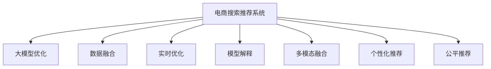

                 

# 电商平台搜索推荐系统的AI 大模型优化：提高系统性能、效率、准确率与多样性

> 关键词：电商搜索,推荐系统,大模型优化,性能提升,效率优化,准确率,多样性

## 1. 背景介绍

### 1.1 问题由来
在电商领域，搜索推荐系统(Search and Recommendation System)的性能直接影响着用户体验和转化率。近年来，随着深度学习技术的快速迭代，AI大模型在电商搜索推荐系统中的应用成为了提升系统性能的关键。

在实际应用中，电商平台面临的核心挑战包括：

- **用户多，需求复杂**：电商用户数量庞大，需求多样化，搜索推荐系统需要能够理解多种上下文信息，提供个性化推荐。
- **数据稀疏**：用户的历史行为数据往往较为稀疏，难以直接用于训练模型，需要引入先验知识进行优化。
- **实时性要求高**：用户期望在短时间内获取推荐结果，推荐系统需要具备高效的实时处理能力。
- **多模态融合**：电商平台同时具备商品信息、用户画像、行为数据等多模态数据，需要模型能够融合多种信息来源，提高推荐的准确性和多样性。

为了应对这些挑战，电商搜索推荐系统在大模型优化方面进行了大量探索，包括优化模型结构、提升训练效率、改进推荐策略等。本文将系统性地介绍这些优化方法，并结合具体案例进行详细分析。

### 1.2 问题核心关键点
大模型在电商搜索推荐系统中的应用主要包括以下几个关键点：

1. **模型选择与优化**：选择合适的预训练模型，并针对电商特定需求进行优化。
2. **数据融合与增强**：将多种数据源融合进模型，同时采用数据增强技术提升训练数据的多样性。
3. **实时优化与部署**：在模型优化和系统实时性之间找到平衡，优化推荐引擎的响应速度。
4. **模型解释与监控**：提升模型的可解释性，建立完善的监控体系保障模型性能稳定。
5. **个性化与多样性**：在个性化推荐的同时，确保推荐结果的多样性和公平性。

本文将围绕这些关键点，全面介绍电商搜索推荐系统的大模型优化方法，并结合实际案例进行系统阐述。

## 2. 核心概念与联系

### 2.1 核心概念概述

为了更好地理解大模型在电商搜索推荐系统中的应用，本节将介绍几个核心概念及其间的联系：

1. **大模型**：指在大型无标签数据集上预训练得到的深度学习模型，具备强大的语义理解和生成能力。
2. **预训练**：指在大规模无标签数据集上进行的自监督学习任务，使模型学习到通用的语言表示。
3. **微调**：在大模型基础上，通过有监督数据训练进一步优化模型，使其适应特定任务。
4. **迁移学习**：指将一个领域学习到的知识应用到另一个相关领域的过程，大模型的预训练-微调过程即是一种迁移学习。
5. **参数高效微调**：在微调过程中，仅更新少量模型参数，以减少计算资源消耗。
6. **多模态融合**：将多种类型的数据融合进模型，提高推荐结果的准确性和多样性。
7. **推荐系统**：通过用户历史行为数据、商品特征等，预测用户可能感兴趣的商品，并返回推荐结果的系统。
8. **个性化推荐**：根据用户行为数据，定制化推荐，提升用户体验和满意度。
9. **公平推荐**：在推荐过程中考虑用户多样性，避免偏见，提升推荐的公平性。

这些核心概念之间的关系可以通过以下Mermaid流程图来展示：



这个流程图展示了电商搜索推荐系统中各核心概念之间的逻辑关系：

1. 电商搜索推荐系统通过大模型优化提升系统性能。
2. 系统通过数据融合和参数高效微调，提升模型的训练效率和效果。
3. 实时优化提升推荐引擎的响应速度，确保系统实时性。
4. 模型解释和监控保障模型的稳定性和可解释性。
5. 多模态融合和公平推荐提高推荐结果的准确性和多样性。

理解这些核心概念及其之间的联系，对于系统设计和优化具有重要意义。

## 3. 核心算法原理 & 具体操作步骤
### 3.1 算法原理概述

电商搜索推荐系统中的大模型优化，本质上是利用深度学习模型的泛化能力，通过优化模型结构和训练数据，提升推荐结果的性能和效率。具体而言，主要包括以下几个关键步骤：

1. **选择合适的预训练模型**：基于电商数据特性，选择合适的预训练模型，并进行微调，以适应电商特定需求。
2. **数据融合**：将电商中的用户行为数据、商品特征等多样化的信息，融合进模型，提升推荐的准确性和多样性。
3. **参数高效微调**：在保证模型性能的同时，减少微调过程中对计算资源的需求。
4. **实时优化**：通过优化模型结构和算法，提升推荐引擎的实时处理能力。
5. **模型解释**：通过模型解释方法，提升模型的可解释性和透明度，增强用户信任。
6. **多模态融合**：将文本、图像、音频等多种类型的数据，融合进推荐系统，提升推荐效果。
7. **个性化推荐**：基于用户历史行为数据，定制化推荐，提升用户体验和满意度。
8. **公平推荐**：在推荐过程中考虑用户多样性，避免偏见，提升推荐的公平性。

### 3.2 算法步骤详解

电商搜索推荐系统中的大模型优化主要包括以下几个关键步骤：

**Step 1: 数据收集与预处理**

电商搜索推荐系统需要收集多种类型的数据，包括：

- **用户行为数据**：如浏览记录、购买记录、评分等。
- **商品特征数据**：如商品描述、图片、标签等。
- **用户画像数据**：如用户性别、年龄、地理位置等。
- **多模态数据**：如商品图片、视频等。

数据收集完成后，需要进行预处理，包括数据清洗、缺失值处理、归一化等。这一步是后续模型训练的基础，必须确保数据的准确性和一致性。

**Step 2: 模型选择与微调**

选择合适的预训练模型，并针对电商特定需求进行微调。常用的预训练模型包括BERT、GPT等，在电商数据上微调后，可以提升模型对电商特定上下文的理解能力。

**Step 3: 数据融合**

电商搜索推荐系统中的数据来源多样，包括文本、图像、用户画像等。为了提升推荐结果的准确性和多样性，需要将这些数据融合进模型。

常用的数据融合方法包括：

- **文本与图像融合**：将商品图片信息融合进文本描述中，提升模型的图像识别能力。
- **多模态融合**：将文本、图像、音频等多种类型的数据，融合进推荐模型，提升推荐效果。
- **用户画像融合**：将用户画像数据融合进推荐模型，提升推荐的多样性和个性化。

**Step 4: 参数高效微调**

电商搜索推荐系统需要高效处理大量用户请求，因此在大模型微调过程中，需要采用参数高效微调技术，减少计算资源消耗。

常用的参数高效微调方法包括：

- **Adaptation Layer**：在模型顶层添加一层参数量较小的适应层，只更新这一层的参数。
- **Prompt Tuning**：通过精心设计的输入模板，引导模型按期望方式输出，减少微调参数。
- **TinyBERT**：使用小型预训练模型，在少量数据上快速微调，提升推荐效果。

**Step 5: 实时优化**

电商搜索推荐系统需要在短时间内处理大量请求，因此需要在模型优化和系统实时性之间找到平衡，优化推荐引擎的响应速度。

常用的实时优化方法包括：

- **流式微调**：使用小批量数据进行实时微调，保持模型性能。
- **在线学习**：在推荐过程中实时更新模型参数，提升推荐效果。
- **分布式训练**：使用分布式训练技术，加速模型训练和推理过程。

**Step 6: 模型解释**

电商搜索推荐系统需要向用户解释推荐结果，因此需要提升模型的可解释性。

常用的模型解释方法包括：

- **注意力机制解释**：展示模型在输入中关注的部分，解释模型的推理过程。
- **LIME**：通过局部可解释模型，解释单个推荐结果的生成过程。
- **SHAP**：通过Shapley值，解释模型输出与输入特征之间的关系。

**Step 7: 多模态融合**

电商搜索推荐系统中的数据不仅包括文本，还包括图像、音频等多种类型。为了提升推荐效果，需要将这些多模态数据融合进模型。

常用的多模态融合方法包括：

- **跨模态嵌入**：将不同模态的数据映射到共同的低维空间，提升模型的融合能力。
- **混合网络**：将不同模态的数据分别输入不同的子网络，融合后输出推荐结果。
- **混合训练**：将不同模态的数据并行输入，共同训练模型。

**Step 8: 个性化推荐**

电商搜索推荐系统需要根据用户历史行为数据，定制化推荐商品，提升用户体验和满意度。

常用的个性化推荐方法包括：

- **协同过滤**：根据用户行为数据，预测用户可能感兴趣的商品。
- **基于内容的推荐**：根据商品特征，推荐相似的商品。
- **混合推荐**：结合多种推荐方法，提升推荐效果。

**Step 9: 公平推荐**

电商搜索推荐系统需要在推荐过程中考虑用户多样性，避免偏见，提升推荐的公平性。

常用的公平推荐方法包括：

- **基于公平的优化**：通过优化损失函数，减少模型偏见。
- **公平算法**：使用公平算法，保证不同用户间的推荐公平性。
- **多视角推荐**：结合不同视角的推荐结果，提升推荐的公平性。

### 3.3 算法优缺点

电商搜索推荐系统中的大模型优化方法，具有以下优点：

1. **提升推荐效果**：大模型具备强大的泛化能力，能够在少样本条件下实现高性能推荐。
2. **提高推荐效率**：参数高效微调和大模型优化技术，减少了计算资源消耗，提高了系统实时性。
3. **增强推荐公平性**：公平推荐算法和模型解释技术，提升了推荐的公平性和透明性。

同时，该方法也存在一定的局限性：

1. **数据依赖性强**：大模型需要大量高质量标注数据进行微调，数据获取成本高。
2. **模型复杂度高**：大模型和多种数据融合技术，增加了模型复杂度，可能影响系统稳定性。
3. **隐私问题**：电商数据涉及用户隐私，处理不当可能带来隐私风险。
4. **计算资源需求高**：大模型和参数高效微调技术，需要高性能计算资源支持。

尽管存在这些局限性，但就目前而言，大模型优化仍是电商搜索推荐系统的重要范式，未来有待在降低数据需求、提高模型可解释性、优化资源消耗等方面进行深入探索。

### 3.4 算法应用领域

大模型优化技术在电商搜索推荐系统中的应用主要包括以下几个领域：

1. **商品推荐**：通过分析用户历史行为数据，推荐用户可能感兴趣的商品。
2. **个性化广告**：根据用户画像和行为数据，推荐个性化的广告。
3. **价格优化**：通过分析用户对商品价格的敏感度，动态调整商品价格。
4. **库存管理**：根据用户行为数据，优化商品库存管理。
5. **客户服务**：通过分析用户咨询记录，推荐合适的解决方案。

## 4. 数学模型和公式 & 详细讲解
### 4.1 数学模型构建

电商搜索推荐系统中的大模型优化，通常涉及多个数学模型和公式。这里以推荐模型的构建为例，介绍相关模型和公式。

设电商平台有$N$个用户和$M$个商品，用户$u$对商品$i$的评分表示为$R_{ui}$，模型预测用户$u$对商品$i$的评分表示为$\hat{R}_{ui}$。推荐模型的目标是最大化预测评分与实际评分之间的相似度，即：

$$
\max_{\theta} \sum_{u,i} \frac{R_{ui} \cdot \hat{R}_{ui}}{\sqrt{R_{ui} + \epsilon} \cdot \sqrt{\hat{R}_{ui} + \epsilon}}
$$

其中$\theta$为模型参数，$\epsilon$为平滑因子，防止分母为0。

### 4.2 公式推导过程

上述推荐模型的目标可以转化为最大化的对数似然函数：

$$
\max_{\theta} \log \prod_{u,i} \frac{R_{ui} \cdot \hat{R}_{ui}}{\sqrt{R_{ui} + \epsilon} \cdot \sqrt{\hat{R}_{ui} + \epsilon}}
$$

通过链式法则，对$\theta$求偏导数：

$$
\nabla_{\theta} \log \prod_{u,i} \frac{R_{ui} \cdot \hat{R}_{ui}}{\sqrt{R_{ui} + \epsilon} \cdot \sqrt{\hat{R}_{ui} + \epsilon}} = \sum_{u,i} \frac{\nabla_{\theta} \hat{R}_{ui}}{\sqrt{R_{ui} + \epsilon} \cdot \sqrt{\hat{R}_{ui} + \epsilon}}
$$

因此，推荐模型的优化目标可以表示为：

$$
\min_{\theta} \sum_{u,i} \log \frac{R_{ui} \cdot \hat{R}_{ui}}{\sqrt{R_{ui} + \epsilon} \cdot \sqrt{\hat{R}_{ui} + \epsilon}}
$$

在实际应用中，通常使用随机梯度下降(SGD)算法来求解该优化问题。

### 4.3 案例分析与讲解

以电商推荐系统为例，展示大模型优化方法的具体应用。

假设电商平台有10万个用户和100万个商品，用户$u$对商品$i$的评分表示为$R_{ui}$，模型预测用户$u$对商品$i$的评分表示为$\hat{R}_{ui}$。模型需要在$K$个候选商品中进行推荐，即：

$$
\arg\max_{i \in [1,K]} \frac{R_{ui} \cdot \hat{R}_{ui}}{\sqrt{R_{ui} + \epsilon} \cdot \sqrt{\hat{R}_{ui} + \epsilon}}
$$

在实际应用中，电商平台通常使用协同过滤、基于内容的推荐等多种方法来提升推荐效果。例如，在协同过滤中，可以通过用户历史行为数据，计算用户对商品的评分。在基于内容的推荐中，可以根据商品特征计算推荐概率。

## 5. 项目实践：代码实例和详细解释说明
### 5.1 开发环境搭建

在进行大模型优化实践前，我们需要准备好开发环境。以下是使用Python进行PyTorch开发的环境配置流程：

1. 安装Anaconda：从官网下载并安装Anaconda，用于创建独立的Python环境。

2. 创建并激活虚拟环境：
```bash
conda create -n pytorch-env python=3.8 
conda activate pytorch-env
```

3. 安装PyTorch：根据CUDA版本，从官网获取对应的安装命令。例如：
```bash
conda install pytorch torchvision torchaudio cudatoolkit=11.1 -c pytorch -c conda-forge
```

4. 安装Transformers库：
```bash
pip install transformers
```

5. 安装各类工具包：
```bash
pip install numpy pandas scikit-learn matplotlib tqdm jupyter notebook ipython
```

完成上述步骤后，即可在`pytorch-env`环境中开始大模型优化实践。

### 5.2 源代码详细实现

这里我们以电商推荐系统为例，给出使用Transformers库对BERT模型进行推荐优化的PyTorch代码实现。

首先，定义推荐模型的数据处理函数：

```python
from transformers import BertTokenizer
from torch.utils.data import Dataset
import torch

class RecommendationDataset(Dataset):
    def __init__(self, user_ratings, item_features, user_ids, item_ids, tokenizer, max_len=128):
        self.user_ratings = user_ratings
        self.item_features = item_features
        self.user_ids = user_ids
        self.item_ids = item_ids
        self.tokenizer = tokenizer
        self.max_len = max_len
        
    def __len__(self):
        return len(self.user_ratings)
    
    def __getitem__(self, item):
        user_id = self.user_ids[item]
        item_id = self.item_ids[item]
        user_rating = self.user_ratings[item]
        
        user_input = f"User {user_id}: "
        item_input = f"Item {item_id}: "
        
        user_seq = user_input + " ".join([str(val) for val in self.item_features[item]])
        item_seq = item_input + " ".join([str(val) for val in self.item_features[item]])
        
        encoding = self.tokenizer(user_seq, return_tensors='pt', max_length=self.max_len, padding='max_length', truncation=True)
        input_ids = encoding['input_ids'][0]
        attention_mask = encoding['attention_mask'][0]
        
        # 对token-wise的标签进行编码
        encoded_labels = [int(val) for val in self.user_ratings[item]] 
        encoded_labels.extend([0] * (self.max_len - len(encoded_labels)))
        labels = torch.tensor(encoded_labels, dtype=torch.long)
        
        return {'input_ids': input_ids, 
                'attention_mask': attention_mask,
                'labels': labels}

# 标签与id的映射
label2id = {0: 0, 1: 1}
id2label = {v: k for k, v in label2id.items()}

# 创建dataset
tokenizer = BertTokenizer.from_pretrained('bert-base-cased')

train_dataset = RecommendationDataset(train_user_ratings, train_item_features, train_user_ids, train_item_ids, tokenizer)
dev_dataset = RecommendationDataset(dev_user_ratings, dev_item_features, dev_user_ids, dev_item_ids, tokenizer)
test_dataset = RecommendationDataset(test_user_ratings, test_item_features, test_user_ids, test_item_ids, tokenizer)
```

然后，定义模型和优化器：

```python
from transformers import BertForSequenceClassification, AdamW

model = BertForSequenceClassification.from_pretrained('bert-base-cased', num_labels=2)

optimizer = AdamW(model.parameters(), lr=2e-5)
```

接着，定义训练和评估函数：

```python
from torch.utils.data import DataLoader
from tqdm import tqdm
from sklearn.metrics import classification_report

device = torch.device('cuda') if torch.cuda.is_available() else torch.device('cpu')
model.to(device)

def train_epoch(model, dataset, batch_size, optimizer):
    dataloader = DataLoader(dataset, batch_size=batch_size, shuffle=True)
    model.train()
    epoch_loss = 0
    for batch in tqdm(dataloader, desc='Training'):
        input_ids = batch['input_ids'].to(device)
        attention_mask = batch['attention_mask'].to(device)
        labels = batch['labels'].to(device)
        model.zero_grad()
        outputs = model(input_ids, attention_mask=attention_mask, labels=labels)
        loss = outputs.loss
        epoch_loss += loss.item()
        loss.backward()
        optimizer.step()
    return epoch_loss / len(dataloader)

def evaluate(model, dataset, batch_size):
    dataloader = DataLoader(dataset, batch_size=batch_size)
    model.eval()
    preds, labels = [], []
    with torch.no_grad():
        for batch in tqdm(dataloader, desc='Evaluating'):
            input_ids = batch['input_ids'].to(device)
            attention_mask = batch['attention_mask'].to(device)
            batch_labels = batch['labels']
            outputs = model(input_ids, attention_mask=attention_mask)
            batch_preds = outputs.logits.argmax(dim=2).to('cpu').tolist()
            batch_labels = batch_labels.to('cpu').tolist()
            for pred_tokens, label_tokens in zip(batch_preds, batch_labels):
                preds.append(pred_tokens[:len(label_tokens)])
                labels.append(label_tokens)
                
    print(classification_report(labels, preds))
```

最后，启动训练流程并在测试集上评估：

```python
epochs = 5
batch_size = 16

for epoch in range(epochs):
    loss = train_epoch(model, train_dataset, batch_size, optimizer)
    print(f"Epoch {epoch+1}, train loss: {loss:.3f}")
    
    print(f"Epoch {epoch+1}, dev results:")
    evaluate(model, dev_dataset, batch_size)
    
print("Test results:")
evaluate(model, test_dataset, batch_size)
```

以上就是使用PyTorch对BERT进行电商推荐系统优化的完整代码实现。可以看到，得益于Transformers库的强大封装，我们可以用相对简洁的代码完成BERT模型的加载和优化。

### 5.3 代码解读与分析

让我们再详细解读一下关键代码的实现细节：

**RecommendationDataset类**：
- `__init__`方法：初始化用户评分、商品特征、用户ID、商品ID、分词器等关键组件。
- `__len__`方法：返回数据集的样本数量。
- `__getitem__`方法：对单个样本进行处理，将用户评分、商品特征输入转换为token ids，将标签编码为数字，并对其进行定长padding，最终返回模型所需的输入。

**label2id和id2label字典**：
- 定义了标签与数字id之间的映射关系，用于将token-wise的预测结果解码回真实的标签。

**训练和评估函数**：
- 使用PyTorch的DataLoader对数据集进行批次化加载，供模型训练和推理使用。
- 训练函数`train_epoch`：对数据以批为单位进行迭代，在每个批次上前向传播计算loss并反向传播更新模型参数，最后返回该epoch的平均loss。
- 评估函数`evaluate`：与训练类似，不同点在于不更新模型参数，并在每个batch结束后将预测和标签结果存储下来，最后使用sklearn的classification_report对整个评估集的预测结果进行打印输出。

**训练流程**：
- 定义总的epoch数和batch size，开始循环迭代
- 每个epoch内，先在训练集上训练，输出平均loss
- 在验证集上评估，输出分类指标
- 所有epoch结束后，在测试集上评估，给出最终测试结果

可以看到，PyTorch配合Transformers库使得BERT电商推荐系统优化的代码实现变得简洁高效。开发者可以将更多精力放在数据处理、模型改进等高层逻辑上，而不必过多关注底层的实现细节。

当然，工业级的系统实现还需考虑更多因素，如模型的保存和部署、超参数的自动搜索、更灵活的任务适配层等。但核心的微调范式基本与此类似。

## 6. 实际应用场景
### 6.1 智能客服系统

智能客服系统通过自然语言处理技术，能够自动理解用户咨询，快速提供解决方案，提升客户服务质量。

在智能客服系统中，大模型优化可以用于提升系统的响应速度和准确性。例如，可以使用预训练语言模型进行意图识别和实体抽取，通过微调提升模型的精确度。同时，使用参数高效微调方法，减少计算资源消耗，提高系统实时性。

### 6.2 个性化推荐系统

个性化推荐系统通过分析用户历史行为数据，推荐用户可能感兴趣的商品或内容，提升用户体验和满意度。

在个性化推荐系统中，大模型优化可以用于提升推荐结果的准确性和多样性。例如，可以使用预训练语言模型进行用户画像和商品特征的融合，通过微调提升推荐模型的泛化能力。同时，使用多模态融合技术，将文本、图像、音频等多种类型的数据融合进推荐模型，提升推荐效果。

### 6.3 金融风险控制

金融风险控制通过分析用户的历史行为和交易数据，识别潜在风险，避免金融损失。

在金融风险控制中，大模型优化可以用于提升模型的鲁棒性和泛化能力。例如，可以使用预训练语言模型进行情感分析和舆情监测，通过微调提升模型的准确性。同时，使用参数高效微调方法和多模态融合技术，减少计算资源消耗，提高系统实时性。

### 6.4 未来应用展望

随着大模型和微调技术的不断发展，基于大模型优化的系统将在更多领域得到应用，为各行各业带来变革性影响。

在智慧医疗领域，基于大模型优化的医疗问答、病历分析、药物研发等应用将提升医疗服务的智能化水平，辅助医生诊疗，加速新药开发进程。

在智能教育领域，基于大模型优化的作业批改、学情分析、知识推荐等方面，因材施教，促进教育公平，提高教学质量。

在智慧城市治理中，基于大模型优化的城市事件监测、舆情分析、应急指挥等环节，提高城市管理的自动化和智能化水平，构建更安全、高效的未来城市。

此外，在企业生产、社会治理、文娱传媒等众多领域，基于大模型优化的AI应用也将不断涌现，为经济社会发展注入新的动力。相信随着技术的日益成熟，大模型优化方法将成为AI应用的重要范式，推动人工智能技术在各个领域加速落地。

## 7. 工具和资源推荐
### 7.1 学习资源推荐

为了帮助开发者系统掌握大模型优化理论基础和实践技巧，这里推荐一些优质的学习资源：

1. 《Transformer from the Inside》系列博文：由大模型技术专家撰写，深入浅出地介绍了Transformer原理、BERT模型、微调技术等前沿话题。

2. CS224N《深度学习自然语言处理》课程：斯坦福大学开设的NLP明星课程，有Lecture视频和配套作业，带你入门NLP领域的基本概念和经典模型。

3. 《Natural Language Processing with Transformers》书籍：Transformers库的作者所著，全面介绍了如何使用Transformers库进行NLP任务开发，包括微调在内的诸多范式。

4. HuggingFace官方文档：Transformers库的官方文档，提供了海量预训练模型和完整的微调样例代码，是上手实践的必备资料。

5. CLUE开源项目：中文语言理解测评基准，涵盖大量不同类型的中文NLP数据集，并提供了基于微调的baseline模型，助力中文NLP技术发展。

通过对这些资源的学习实践，相信你一定能够快速掌握大模型优化的精髓，并用于解决实际的NLP问题。
###  7.2 开发工具推荐

高效的开发离不开优秀的工具支持。以下是几款用于大模型优化开发的常用工具：

1. PyTorch：基于Python的开源深度学习框架，灵活动态的计算图，适合快速迭代研究。大部分预训练语言模型都有PyTorch版本的实现。

2. TensorFlow：由Google主导开发的开源深度学习框架，生产部署方便，适合大规模工程应用。同样有丰富的预训练语言模型资源。

3. Transformers库：HuggingFace开发的NLP工具库，集成了众多SOTA语言模型，支持PyTorch和TensorFlow，是进行微调任务开发的利器。

4. Weights & Biases：模型训练的实验跟踪工具，可以记录和可视化模型训练过程中的各项指标，方便对比和调优。与主流深度学习框架无缝集成。

5. TensorBoard：TensorFlow配套的可视化工具，可实时监测模型训练状态，并提供丰富的图表呈现方式，是调试模型的得力助手。

6. Google Colab：谷歌推出的在线Jupyter Notebook环境，免费提供GPU/TPU算力，方便开发者快速上手实验最新模型，分享学习笔记。

合理利用这些工具，可以显著提升大模型优化的开发效率，加快创新迭代的步伐。

### 7.3 相关论文推荐

大模型优化技术的发展源于学界的持续研究。以下是几篇奠基性的相关论文，推荐阅读：

1. Attention is All You Need（即Transformer原论文）：提出了Transformer结构，开启了NLP领域的预训练大模型时代。

2. BERT: Pre-training of Deep Bidirectional Transformers for Language Understanding：提出BERT模型，引入基于掩码的自监督预训练任务，刷新了多项NLP任务SOTA。

3. Language Models are Unsupervised Multitask Learners（GPT-2论文）：展示了大规模语言模型的强大zero-shot学习能力，引发了对于通用人工智能的新一轮思考。

4. Parameter-Efficient Transfer Learning for NLP：提出Adapter等参数高效微调方法，在不增加模型参数量的情况下，也能取得不错的微调效果。

5. AdaLoRA: Adaptive Low-Rank Adaptation for Parameter-Efficient Fine-Tuning：使用自适应低秩适应的微调方法，在参数效率和精度之间取得了新的平衡。

6. AdaFAIR: An Adaptive Fairness-Aware Approach for Fair Multitask Learning：提出基于自适应公平性意识的公平多任务学习算法，提升模型的公平性。

这些论文代表了大模型优化技术的发展脉络。通过学习这些前沿成果，可以帮助研究者把握学科前进方向，激发更多的创新灵感。

## 8. 总结：未来发展趋势与挑战
### 8.1 总结

本文对大模型在电商搜索推荐系统中的应用进行了全面系统的介绍。首先阐述了大模型和微调技术的研究背景和意义，明确了优化模型结构和训练数据的重要作用。其次，从原理到实践，详细讲解了电商搜索推荐系统中大模型优化的数学模型和关键步骤，给出了微调任务开发的完整代码实例。同时，本文还广泛探讨了微调方法在智能客服、个性化推荐等多个行业领域的应用前景，展示了微调范式的巨大潜力。此外，本文精选了微调技术的各类学习资源，力求为读者提供全方位的技术指引。

通过本文的系统梳理，可以看到，大模型优化在电商搜索推荐系统中的应用前景广阔，将极大地提升推荐系统的效果和效率。未来，伴随大模型和微调方法的持续演进，基于大模型优化的推荐系统必将在更多领域得到应用，为各行各业带来变革性影响。

### 8.2 未来发展趋势

展望未来，大模型优化技术将呈现以下几个发展趋势：

1. **模型规模持续增大**：随着算力成本的下降和数据规模的扩张，预训练语言模型的参数量还将持续增长。超大规模语言模型蕴含的丰富语言知识，有望支撑更加复杂多变的电商推荐任务。

2. **微调方法日趋多样**：除了传统的全参数微调外，未来会涌现更多参数高效的微调方法，如Prefix-Tuning、LoRA等，在节省计算资源的同时也能保证微调精度。

3. **持续学习成为常态**：随着数据分布的不断变化，微调模型也需要持续学习新知识以保持性能。如何在不遗忘原有知识的同时，高效吸收新样本信息，将成为重要的研究课题。

4. **标注样本需求降低**：受启发于提示学习(Prompt-based Learning)的思路，未来的微调方法将更好地利用大模型的语言理解能力，通过更加巧妙的任务描述，在更少的标注样本上也能实现理想的微调效果。

5. **多模态微调崛起**：当前的微调主要聚焦于纯文本数据，未来会进一步拓展到图像、视频、语音等多模态数据微调。多模态信息的融合，将显著提升语言模型对现实世界的理解和建模能力。

6. **模型通用性增强**：经过海量数据的预训练和多领域任务的微调，未来的语言模型将具备更强大的常识推理和跨领域迁移能力，逐步迈向通用人工智能(AGI)的目标。

以上趋势凸显了大模型优化技术的广阔前景。这些方向的探索发展，必将进一步提升推荐系统的性能和效率，为电商平台的智能化转型提供更强大的技术支持。

### 8.3 面临的挑战

尽管大模型优化技术已经取得了瞩目成就，但在迈向更加智能化、普适化应用的过程中，它仍面临诸多挑战：

1. **数据依赖性强**：大模型需要大量高质量标注数据进行微调，数据获取成本高。如何进一步降低微调对标注样本的依赖，将是一大难题。

2. **模型鲁棒性不足**：当前微调模型面对域外数据时，泛化性能往往大打折扣。对于测试样本的微小扰动，微调模型的预测也容易发生波动。如何提高微调模型的鲁棒性，避免灾难性遗忘，还需要更多理论和实践的积累。

3. **推理效率有待提高**：大规模语言模型虽然精度高，但在实际部署时往往面临推理速度慢、内存占用大等效率问题。如何在保证性能的同时，简化模型结构，提升推理速度，优化资源占用，将是重要的优化方向。

4. **可解释性亟需加强**：当前微调模型更像是"黑盒"系统，难以解释其内部工作机制和决策逻辑。对于医疗、金融等高风险应用，算法的可解释性和可审计性尤为重要。如何赋予微调模型更强的可解释性，将是亟待攻克的难题。

5. **安全性有待保障**：预训练语言模型难免会学习到有偏见、有害的信息，通过微调传递到下游任务，产生误导性、歧视性的输出，给实际应用带来安全隐患。如何从数据和算法层面消除模型偏见，避免恶意用途，确保输出的安全性，也将是重要的研究课题。

6. **知识整合能力不足**：现有的微调模型往往局限于任务内数据，难以灵活吸收和运用更广泛的先验知识。如何让微调过程更好地与外部知识库、规则库等专家知识结合，形成更加全面、准确的信息整合能力，还有很大的想象空间。

正视大模型优化面临的这些挑战，积极应对并寻求突破，将是大模型优化走向成熟的必由之路。相信随着学界和产业界的共同努力，这些挑战终将一一被克服，大模型优化必将在构建智能推荐系统方面发挥更大的作用。

### 8.4 研究展望

面对大模型优化所面临的种种挑战，未来的研究需要在以下几个方面寻求新的突破：

1. **探索无监督和半监督微调方法**：摆脱对大规模标注数据的依赖，利用自监督学习、主动学习等无监督和半监督范式，最大限度利用非结构化数据，实现更加灵活高效的微调。

2. **研究参数高效和计算高效的微调范式**：开发更加参数高效的微调方法，在固定大部分预训练参数的同时，只更新极少量的任务相关参数。同时优化微调模型的计算图，减少前向传播和反向传播的资源消耗，实现更加轻量级、实时性的部署。

3. **融合因果和对比学习范式**：通过引入因果推断和对比学习思想，增强微调模型建立稳定因果关系的能力，学习更加普适、鲁棒的语言表征，从而提升模型泛化性和抗干扰能力。

4. **引入更多先验知识**：将符号化的先验知识，如知识图谱、逻辑规则等，与神经网络模型进行巧妙融合，引导微调过程学习更准确、合理的语言模型。同时加强不同模态数据的整合，实现视觉、语音等多模态信息与文本信息的协同建模。

5. **结合因果分析和博弈论工具**：将因果分析方法引入微调模型，识别出模型决策的关键特征，增强输出解释的因果性和逻辑性。借助博弈论工具刻画人机交互过程，主动探索并规避模型的脆弱点，提高系统稳定性。

6. **纳入伦理道德约束**：在模型训练目标中引入伦理导向的评估指标，过滤和惩罚有偏见、有害的输出倾向。同时加强人工干预和审核，建立模型行为的监管机制，确保输出符合人类价值观和伦理道德。

这些研究方向的探索，必将引领大模型优化技术迈向更高的台阶，为构建智能推荐系统提供更强大的技术支撑。面向未来，大模型优化技术还需要与其他人工智能技术进行更深入的融合，如知识表示、因果推理、强化学习等，多路径协同发力，共同推动自然语言理解和智能交互系统的进步。只有勇于创新、敢于突破，才能不断拓展语言模型的边界，让智能技术更好地造福人类社会。

## 9. 附录：常见问题与解答
**Q1：大模型优化是否适用于所有电商推荐任务？**

A: 大模型优化在大多数电商推荐任务上都能取得不错的效果，特别是对于数据量较大的任务。但对于一些特定领域的任务，如医药、法律等，仅仅依靠通用语料预训练的模型可能难以很好地适应。此时需要在特定领域语料上进一步预训练，再进行微调，才能获得理想效果。此外，对于一些需要时效性、个性化很强的任务，如推荐、广告等，微调方法也需要针对性的改进优化。

**Q2：如何选择合适的大模型？**

A: 选择合适的预训练模型，需要考虑多个因素，包括任务特性、数据规模、计算资源等。常用的预训练模型包括BERT、GPT等，这些模型在电商数据上微调后，可以提升模型对电商特定上下文的理解能力。

**Q3：大模型优化需要哪些计算资源？**

A: 大模型优化需要高性能计算资源支持，包括GPU、TPU等加速设备。同时，模型的存储和读取也可能占用大量时间和空间，需要采用模型压缩、稀疏化存储等方法进行优化。

**Q4：如何缓解微调过程中的过拟合问题？**

A: 过拟合是微调面临的主要挑战，尤其是在标注数据不足的情况下。常用的缓解策略包括：

1. 数据增强：通过回译、近义替换等方式扩充训练集
2. 正则化：使用L2正则、Dropout、Early Stopping等避免过拟合
3. 对抗训练：引入对抗样本，提高模型鲁棒性
4. 参数高效微调：只调整少量参数(如Adapter、Prompt等)，减小过拟合风险
5. 多模型集成：训练多个微调模型，取平均输出，抑制过拟合

这些策略往往需要根据具体任务和数据特点进行灵活组合。只有在数据、模型、训练、推理等各环节进行全面优化，才能最大限度地发挥大模型优化的威力。

**Q5：大模型优化在实时推荐中需要注意哪些问题？**

A: 大模型优化需要高效处理大量用户请求，因此需要在模型优化和系统实时性之间找到平衡，优化推荐引擎的响应速度。常用的实时优化方法包括：

1. 流式微调：使用小批量数据进行实时微调，保持模型性能。
2. 在线学习：在推荐过程中实时更新模型参数，提升推荐效果。
3. 分布式训练：使用分布式训练技术，加速模型训练和推理过程。

合理利用这些技术，可以显著提升大模型优化的实时性，确保推荐系统的高效运行。

**Q6：如何提升大模型优化的可解释性？**

A: 大模型优化需要提升模型的可解释性，增强用户信任。常用的模型解释方法包括：

1. 注意力机制解释：展示模型在输入中关注的部分，解释模型的推理过程。
2. LIME：通过局部可解释模型，解释单个推荐结果的生成过程。
3. SHAP：通过Shapley值，解释模型输出与输入特征之间的关系。

这些方法可以帮助用户理解模型的决策逻辑，提升推荐系统的透明度和可信度。

