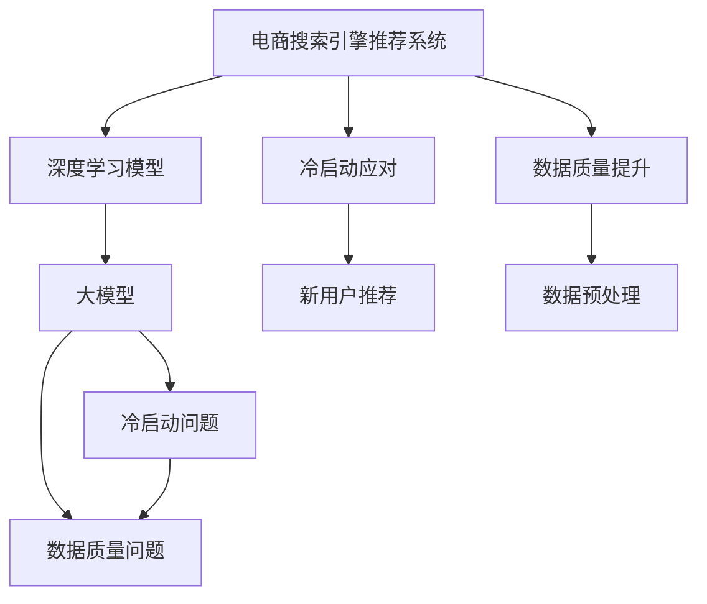

                 

# 电商平台搜索推荐系统的AI 大模型实践：应对冷启动与数据质量挑战

## 1. 背景介绍

随着电子商务的飞速发展，搜索引擎推荐系统成为了电商平台提升用户体验、增加交易转化率的重要手段。传统的基于规则或特征工程的推荐系统，难以实时响应不断变化的业务需求和用户行为，逐渐被基于机器学习的推荐系统所取代。在机器学习推荐体系中，深度学习特别是深度神经网络模型，成为了核心的算法引擎。而在大数据和计算资源的支撑下，基于深度学习的大模型成为了搜索引擎推荐系统的主流选择。

然而，在大模型的实际应用中，冷启动和数据质量问题仍是两大核心挑战。冷启动指的是新商品或新用户加入系统时，缺乏足够的历史行为数据，难以通过已有模型对其进行精准推荐。而数据质量问题，则体现在用户行为数据的异常值、缺失值、重复值等数据噪声，严重影响模型的训练效果和推荐精度。本文将聚焦于基于大模型的搜索引擎推荐系统，探讨其在大规模电商平台的实际应用案例，并提出解决方案，以应对冷启动和数据质量挑战。

## 2. 核心概念与联系

为了更好地理解大模型在电商平台搜索推荐系统中的应用，我们需要先梳理几个核心概念：

- **深度学习模型**：指通过多层次非线性变换实现对输入数据进行复杂映射的模型。深度神经网络（DNN）是其中一种形式，通过堆叠多个神经网络层，可以自动学习输入数据的高级特征表示。

- **大模型**：指参数规模巨大的深度神经网络模型，通常具有亿级以上参数，能够学习到更丰富的数据特征，从而提升推荐性能。

- **电商搜索引擎推荐系统**：指基于深度学习模型，对电商平台中的搜索结果进行排序和推荐，提升用户浏览和购买体验的系统。

- **冷启动问题**：指新用户或新商品加入系统时，缺乏足够的历史数据，模型难以对其行为进行预测和推荐。

- **数据质量问题**：指用户行为数据中的异常值、缺失值、重复值等噪声数据，影响模型的训练效果和推荐精度。

这些核心概念之间的联系可以通过以下Mermaid流程图来展示：



这个流程图展示了大模型在电商推荐系统中的核心概念及其关联：

1. 大模型是电商搜索引擎推荐系统的核心算法引擎。
2. 冷启动问题和数据质量问题是大模型应用中常见的挑战。
3. 解决冷启动问题和提升数据质量是大模型在电商推荐中实际应用的关键环节。
4. 通过针对性的算法和技术，大模型可以在电商推荐中发挥巨大潜力。

## 3. 核心算法原理 & 具体操作步骤

### 3.1 算法原理概述

基于深度学习的大模型在电商平台推荐系统中的应用，主要涉及两大算法步骤：冷启动处理和数据质量提升。

**冷启动问题**：指新商品或新用户加入系统时，缺乏足够的历史数据，模型难以对其进行精准推荐。解决冷启动问题的方法包括利用已有商品的相似商品推荐、利用用户行为模式对新用户进行预测推荐等。

**数据质量问题**：指用户行为数据中的异常值、缺失值、重复值等噪声数据，影响模型的训练效果和推荐精度。解决数据质量问题的方法包括数据清洗、数据增强、模型正则化等。

### 3.2 算法步骤详解

#### 3.2.1 冷启动问题处理

**基于相似商品推荐**：对于新商品，可以首先计算其与已有商品的相似度，并推荐与该商品最相似的N个商品。这通常可以通过计算商品特征向量之间的余弦相似度等方法实现。

**基于用户行为模式预测**：对于新用户，可以基于其已有行为模式（如浏览记录、购买历史等），预测其可能感兴趣的商品。通过统计用户的行为分布，建立预测模型，可以较为准确地推荐用户可能感兴趣的商品。

**利用协同过滤**：通过分析已有用户对商品的评分数据，预测新用户对商品的评分，进行推荐。协同过滤可以分为基于用户的协同过滤和基于物品的协同过滤两种方式。

**混合模型**：将基于规则、基于内容的推荐和基于协同过滤的推荐方法进行混合，构建更为复杂的推荐模型。

**新用户数据注入**：在新用户加入系统初期，可以通过引导用户进行部分行为操作（如点击、浏览、评价等），快速获取用户行为数据，并注入到模型中。

#### 3.2.2 数据质量提升

**数据清洗**：对用户行为数据进行清洗，去除异常值和重复值，确保数据的准确性和唯一性。

**数据增强**：通过数据增强技术，如数据扩充、合成数据等，丰富训练数据集，提升模型的泛化能力。

**模型正则化**：通过引入L2正则、Dropout等正则化技术，防止模型过拟合，提高模型稳定性。

**对抗训练**：引入对抗样本，训练模型对噪声数据和异常数据的鲁棒性，提高模型鲁棒性。

**数据预处理**：对用户行为数据进行归一化、标准化等处理，提高数据质量，便于模型训练。

### 3.3 算法优缺点

基于大模型的电商平台搜索推荐系统具有以下优点：

- **高精度**：大模型通过自适应学习用户行为和商品特征，能够提供更加精准的推荐结果。
- **高灵活性**：大模型能够灵活地处理复杂的用户行为和商品特征，适应电商平台的动态变化。
- **可扩展性**：大模型可以轻松地应用于大规模电商平台，具备良好的可扩展性。

同时，该方法也存在一些缺点：

- **资源消耗高**：大模型需要大量的计算资源进行训练和推理，对硬件设备要求较高。
- **冷启动问题**：新商品和新用户缺乏足够的历史数据，难以精准推荐。
- **数据质量敏感**：用户行为数据的噪声和异常值对模型的训练效果和推荐精度有较大影响。

### 3.4 算法应用领域

基于大模型的电商平台搜索推荐系统已经在众多电商平台中得到了广泛应用，如淘宝、京东、亚马逊等。其核心应用场景包括：

- **商品推荐**：通过分析用户浏览、点击、购买等行为数据，对用户进行个性化推荐。
- **广告投放**：根据用户行为数据，对用户进行精准的广告投放，提高广告效果和ROI。
- **市场分析**：通过对用户行为数据进行分析和建模，预测市场趋势，辅助业务决策。
- **供应链优化**：通过分析用户需求数据，优化商品库存和供应链管理，提高运营效率。

除了上述这些经典场景外，大模型还被创新性地应用于如反欺诈、信用评分等诸多领域，为电商平台的运营提供了强大的技术支持。

## 4. 数学模型和公式 & 详细讲解 & 举例说明

### 4.1 数学模型构建

在大模型在电商平台推荐系统中，常用的数学模型包括：

- **协同过滤模型**：基于用户-物品评分矩阵，通过相似度计算进行推荐。

- **深度神经网络模型**：通过多层神经网络，对用户行为数据进行特征提取和预测。

- **注意力机制模型**：通过注意力机制，对用户行为数据中的关键信息进行加权处理，提升推荐精度。

### 4.2 公式推导过程

以协同过滤模型为例，其推荐公式可以表示为：

$$
\hat{y}_{ui} = \frac{\sum_{v \in \mathcal{V}} r_{uv} \times r_{vi}}{\sum_{v \in \mathcal{V}} r_{vj}}
$$

其中，$r_{uv}$表示用户u对商品v的评分，$\mathcal{V}$表示商品集合，$\hat{y}_{ui}$表示用户u对商品i的推荐值。

通过计算商品i与用户u历史行为评分矩阵中的相似度，得到推荐值。当用户u对商品i没有评分时，可以使用预定义的默认评分或置信度计算推荐值。

### 4.3 案例分析与讲解

以淘宝电商平台的推荐系统为例，淘宝的推荐模型主要通过深度神经网络和协同过滤算法进行构建，其主要流程如下：

1. **数据预处理**：将用户浏览、点击、购买等行为数据进行清洗、去重、归一化等处理。

2. **特征提取**：对处理后的行为数据进行特征提取，包括用户特征、商品特征、行为特征等。

3. **深度神经网络模型训练**：使用深度神经网络对用户行为数据进行建模，预测用户对商品的兴趣。

4. **协同过滤模型训练**：利用用户-物品评分矩阵，训练协同过滤模型，对新商品和新用户进行推荐。

5. **模型集成**：将深度神经网络和协同过滤模型的预测结果进行加权整合，生成最终的推荐结果。

通过这样的流程，淘宝能够提供精准的商品推荐，提升用户体验，增加交易转化率。

## 5. 项目实践：代码实例和详细解释说明

### 5.1 开发环境搭建

在大模型的实际应用中，我们需要搭建相应的开发环境。以下是使用Python进行TensorFlow开发的常见环境配置流程：

1. 安装Anaconda：从官网下载并安装Anaconda，用于创建独立的Python环境。

2. 创建并激活虚拟环境：
```bash
conda create -n tensorflow-env python=3.8 
conda activate tensorflow-env
```

3. 安装TensorFlow：根据CUDA版本，从官网获取对应的安装命令。例如：
```bash
conda install tensorflow-gpu==2.7.0 
```

4. 安装其他依赖库：
```bash
pip install numpy pandas scikit-learn matplotlib tensorflow-addons 
```

完成上述步骤后，即可在`tensorflow-env`环境中开始大模型在电商平台搜索推荐系统的开发。

### 5.2 源代码详细实现

以下是一个简单的电商平台搜索推荐系统的代码实现：

```python
import tensorflow as tf
from tensorflow.keras.layers import Input, Embedding, Dot, Concatenate, Dense, Dropout, Flatten

# 定义输入层
user_input = Input(shape=(1,))
item_input = Input(shape=(1,))

# 定义用户和商品的嵌入层
user_embedding = Embedding(input_dim=num_users, output_dim=embedding_dim)(user_input)
item_embedding = Embedding(input_dim=num_items, output_dim=embedding_dim)(item_input)

# 定义注意力机制
attention = Dot(axes=[2, 2], normalize=True)([user_embedding, item_embedding])
attention_weights = Flatten()(attention)

# 定义深度神经网络
x = Concatenate()([user_embedding, item_embedding, attention_weights])
x = Dropout(0.2)(x)
x = Dense(64, activation='relu')(x)
x = Dropout(0.2)(x)
x = Dense(1, activation='sigmoid')(x)

# 定义输出层
output = Dense(1, activation='sigmoid')(x)

# 定义模型
model = tf.keras.Model(inputs=[user_input, item_input], outputs=output)

# 编译模型
model.compile(optimizer='adam', loss='binary_crossentropy', metrics=['accuracy'])

# 训练模型
model.fit([user_train, item_train], user_train, epochs=num_epochs, batch_size=batch_size)
```

### 5.3 代码解读与分析

**定义输入层**：
使用`Input`层定义用户和商品的输入，其中`num_users`和`num_items`分别表示用户和商品的总数，`embedding_dim`表示嵌入层的维度。

**定义嵌入层**：
使用`Embedding`层将用户和商品的ID转换为向量表示。通过设置`input_dim`和`output_dim`参数，指定输入向量和输出向量的维度。

**定义注意力机制**：
使用`Dot`层计算用户和商品向量之间的点积，得到注意力权重。通过`Flatten`层将注意力权重展开，便于后续的神经网络处理。

**定义深度神经网络**：
通过`Concatenate`层将用户嵌入、商品嵌入和注意力权重合并，然后通过`Dense`层进行特征提取。通过`Dropout`层引入正则化，防止过拟合。

**定义输出层**：
使用`Dense`层将模型输出映射到[0,1]之间的二元分类结果。

**定义模型**：
使用`Model`层定义整个模型，指定输入和输出。

**编译模型**：
使用`compile`方法配置模型的优化器、损失函数和评估指标。

**训练模型**：
使用`fit`方法对模型进行训练，指定训练数据、训练轮数和批大小。

## 6. 实际应用场景

### 6.1 电商广告投放

电商平台通过搜索推荐系统对用户进行精准广告投放，能够显著提高广告效果和ROI。在实际应用中，可以通过大模型学习用户行为数据，预测用户对不同广告的兴趣，对用户进行定向广告投放。

例如，京东在电商广告投放中，利用深度神经网络和大模型对用户行为进行建模，分析用户对不同商品的兴趣，对用户进行精准的广告投放，有效提升了广告转化率和用户满意度。

### 6.2 个性化推荐

个性化推荐是大模型在电商平台中最重要的应用场景之一。通过分析用户行为数据，对用户进行精准推荐，能够显著提高用户满意度和交易转化率。

例如，淘宝的搜索推荐系统，通过对用户浏览、点击、购买等行为数据进行建模，对用户进行个性化推荐，提升了用户的使用体验和购物效率。

### 6.3 用户行为分析

通过大模型对用户行为数据进行建模，电商平台能够深入分析用户行为模式，预测用户需求和行为趋势，辅助业务决策。

例如，亚马逊通过深度神经网络对用户行为数据进行建模，分析用户对不同商品的兴趣和需求，优化商品库存和供应链管理，提高了运营效率和客户满意度。

### 6.4 未来应用展望

随着大模型的不断发展，基于大模型的电商平台搜索推荐系统将具备更强的预测和推荐能力，为电商平台带来更多的商业价值。未来，大模型在电商平台中的应用场景将更加广泛，涵盖广告投放、个性化推荐、市场分析等多个领域，推动电商平台的智能化转型。

## 7. 工具和资源推荐

### 7.1 学习资源推荐

为了帮助开发者系统掌握大模型在电商平台搜索推荐系统中的应用，这里推荐一些优质的学习资源：

1. 《深度学习入门》系列博文：由大模型技术专家撰写，介绍了深度学习在电商推荐系统中的应用，涵盖基础算法和实际案例。

2. CS231n《深度学习中的视觉表示》课程：斯坦福大学开设的深度学习课程，重点讲解了深度神经网络在计算机视觉和电商推荐中的应用。

3. 《深度学习理论与实践》书籍：全面介绍了深度学习在电商推荐系统中的理论基础和实践技巧，深入浅出。

4. Kaggle平台：提供丰富的电商推荐数据集和竞赛，适合动手实践，提升技能。

5. Weights & Biases：模型训练的实验跟踪工具，可以记录和可视化模型训练过程中的各项指标，方便对比和调优。

6. TensorBoard：TensorFlow配套的可视化工具，可实时监测模型训练状态，提供丰富的图表呈现方式，便于调试。

通过这些资源的学习实践，相信你一定能够快速掌握大模型在电商平台搜索推荐系统中的应用。

### 7.2 开发工具推荐

高效的开发离不开优秀的工具支持。以下是几款用于大模型在电商平台搜索推荐系统开发的常用工具：

1. TensorFlow：基于Python的开源深度学习框架，灵活动态的计算图，适合快速迭代研究。

2. PyTorch：由Facebook开发，支持动态图，适合研究型开发。

3. Keras：高层次的深度学习框架，易于上手，适合初学者。

4. Weights & Biases：模型训练的实验跟踪工具，记录和可视化模型训练过程中的各项指标。

5. TensorBoard：TensorFlow配套的可视化工具，实时监测模型训练状态，提供丰富的图表呈现方式。

6. GitHub：代码托管平台，方便版本管理和协作开发。

合理利用这些工具，可以显著提升大模型在电商平台搜索推荐系统开发效率，加快创新迭代的步伐。

### 7.3 相关论文推荐

大模型在电商平台搜索推荐系统中的应用，源自学界的持续研究。以下是几篇奠基性的相关论文，推荐阅读：

1. Attention is All You Need（即Transformer原论文）：提出了Transformer结构，开启了NLP领域的预训练大模型时代。

2. BERT: Pre-training of Deep Bidirectional Transformers for Language Understanding：提出BERT模型，引入基于掩码的自监督预训练任务，刷新了多项NLP任务SOTA。

3. Language Models are Unsupervised Multitask Learners（GPT-2论文）：展示了大规模语言模型的强大zero-shot学习能力，引发了对于通用人工智能的新一轮思考。

4. Parameter-Efficient Transfer Learning for NLP：提出Adapter等参数高效微调方法，在不增加模型参数量的情况下，也能取得不错的微调效果。

5. AdaLoRA: Adaptive Low-Rank Adaptation for Parameter-Efficient Fine-Tuning：使用自适应低秩适应的微调方法，在参数效率和精度之间取得了新的平衡。

这些论文代表了大模型在电商平台搜索推荐系统的发展脉络。通过学习这些前沿成果，可以帮助研究者把握学科前进方向，激发更多的创新灵感。

## 8. 总结：未来发展趋势与挑战

### 8.1 总结

本文对基于大模型的电商平台搜索推荐系统进行了全面系统的介绍。首先阐述了电商平台搜索推荐系统在大数据和深度学习背景下的发展背景，明确了大模型在电商推荐中发挥的核心作用。其次，从原理到实践，详细讲解了大模型在电商推荐中的数学模型和算法步骤，给出了电商推荐系统开发的完整代码实例。同时，本文还广泛探讨了电商推荐系统在大规模电商平台的实际应用案例，展示了大模型在电商推荐中广泛的应用前景。最后，本文精选了电商推荐系统的各类学习资源，力求为读者提供全方位的技术指引。

通过本文的系统梳理，可以看到，基于大模型的电商推荐系统已经成为电商平台智能化转型的重要引擎，其高精度、高灵活性和可扩展性等优势，使其在电商推荐中具备巨大的应用潜力。未来，伴随大模型和深度学习技术的进一步发展，电商推荐系统必将在电商平台的运营中发挥更大的作用。

### 8.2 未来发展趋势

展望未来，大模型在电商平台搜索推荐系统的发展趋势将呈现以下几个方面：

1. **高精度推荐**：通过深度神经网络和大模型的联合建模，电商平台能够提供更加精准的商品推荐，提升用户体验和交易转化率。

2. **多模态融合**：将文本、图像、语音等多模态数据进行融合，提升推荐系统的综合能力，增强推荐效果。

3. **实时推荐**：通过实时数据流处理技术，对用户行为进行动态跟踪和推荐，实现更高效的个性化推荐。

4. **深度学习与强化学习的结合**：利用强化学习算法，对推荐系统进行优化，提升推荐效果和用户体验。

5. **冷启动问题解决**：通过冷启动模型和大模型联合推荐，快速适应新商品和新用户，提高推荐系统覆盖率。

6. **数据质量提升**：引入数据清洗和数据增强技术，提升推荐系统的数据质量，提高模型性能。

以上趋势凸显了大模型在电商平台搜索推荐系统的发展前景，为电商平台带来了更多的商业价值和用户体验。

### 8.3 面临的挑战

尽管大模型在电商平台搜索推荐系统中的应用取得了显著成效，但在迈向更加智能化、普适化应用的过程中，它仍面临诸多挑战：

1. **冷启动问题**：新商品和新用户缺乏足够的历史数据，难以精准推荐。

2. **数据质量问题**：用户行为数据中的噪声和异常值对模型训练效果和推荐精度有较大影响。

3. **计算资源消耗高**：大模型需要大量的计算资源进行训练和推理，对硬件设备要求较高。

4. **模型鲁棒性不足**：模型对数据分布的变化较为敏感，泛化性能需要进一步提高。

5. **可解释性不足**：大模型的决策过程缺乏可解释性，难以对其推理逻辑进行分析和调试。

6. **安全性有待保障**：大模型可能学习到有害信息，需要加强数据和算法层面的过滤和审核。

7. **成本高**：大模型的训练和部署成本较高，需要投入大量的人力和财力。

这些挑战需要学界和产业界的共同努力，通过技术创新和算法优化，逐步克服，才能使大模型在电商平台搜索推荐系统中发挥更大的作用。

### 8.4 研究展望

未来，针对大模型在电商平台搜索推荐系统中面临的挑战，研究需要重点关注以下几个方向：

1. **冷启动模型优化**：开发更加高效的冷启动模型，提升新商品和新用户的推荐效果。

2. **数据质量提升技术**：引入数据清洗、数据增强等技术，提高用户行为数据的质量，提升模型训练效果和推荐精度。

3. **模型轻量化与优化**：通过模型压缩、稀疏化等技术，降低大模型的计算资源消耗，提高模型效率。

4. **可解释性和鲁棒性增强**：引入可解释性模型和鲁棒性优化技术，增强大模型在电商推荐中的应用效果和用户信任度。

5. **多模态融合技术**：将文本、图像、语音等多模态数据进行融合，提升推荐系统的综合能力，增强推荐效果。

6. **跨平台和跨用户推荐**：开发跨平台和跨用户推荐算法，提升推荐系统的覆盖率和精准度。

7. **安全性保障**：引入数据过滤和模型审计技术，保障数据和模型安全，确保推荐的可信度和合规性。

通过以上研究方向的探索和发展，相信大模型在电商平台搜索推荐系统中的应用将更加广泛和深入，为电商平台带来更多的商业价值和用户体验。总之，未来大模型在电商平台中的应用需要从数据、模型、技术等多个维度进行全面优化，方能更好地服务于电商平台的智能化转型。

## 9. 附录：常见问题与解答

**Q1：电商推荐系统中如何处理冷启动问题？**

A: 电商推荐系统中的冷启动问题可以通过以下方法处理：

1. **基于相似商品推荐**：对于新商品，可以首先计算其与已有商品的相似度，并推荐与该商品最相似的N个商品。

2. **基于用户行为模式预测**：对于新用户，可以基于其已有行为模式（如浏览记录、购买历史等），预测其可能感兴趣的商品。

3. **利用协同过滤**：通过分析已有用户对商品的评分数据，预测新用户对商品的评分，进行推荐。

4. **新用户数据注入**：在新用户加入系统初期，可以通过引导用户进行部分行为操作（如点击、浏览、评价等），快速获取用户行为数据，并注入到模型中。

5. **混合模型**：将基于规则、基于内容的推荐和基于协同过滤的推荐方法进行混合，构建更为复杂的推荐模型。

这些方法能够有效提升新商品和新用户的推荐效果，提升推荐系统的覆盖率和精准度。

**Q2：电商推荐系统中如何提升数据质量？**

A: 电商推荐系统中的数据质量问题可以通过以下方法提升：

1. **数据清洗**：对用户行为数据进行清洗，去除异常值和重复值，确保数据的准确性和唯一性。

2. **数据增强**：通过数据增强技术，如数据扩充、合成数据等，丰富训练数据集，提升模型的泛化能力。

3. **模型正则化**：通过引入L2正则、Dropout等正则化技术，防止模型过拟合，提高模型稳定性。

4. **对抗训练**：引入对抗样本，训练模型对噪声数据和异常数据的鲁棒性，提高模型鲁棒性。

5. **数据预处理**：对用户行为数据进行归一化、标准化等处理，提高数据质量，便于模型训练。

通过这些方法，可以有效提升电商推荐系统的数据质量，提高模型的训练效果和推荐精度。

**Q3：大模型在电商推荐系统中的计算资源消耗高，如何优化？**

A: 大模型在电商推荐系统中的计算资源消耗高，可以通过以下方法进行优化：

1. **模型轻量化与优化**：通过模型压缩、稀疏化等技术，降低大模型的计算资源消耗，提高模型效率。

2. **分布式训练**：利用分布式训练技术，将大规模模型分解为多个小模型，并行训练，提高训练效率。

3. **GPU加速**：使用GPU进行计算，提高模型训练和推理的速度。

4. **模型并行**：通过模型并行技术，将模型分为多个部分进行训练，提高训练效率。

5. **数据预处理优化**：通过数据预处理技术，减少不必要的计算，提高模型训练效率。

6. **硬件优化**：优化硬件配置，如使用更高效的CPU、GPU、TPU等设备，提高模型训练和推理的速度。

通过以上方法，可以有效降低大模型在电商推荐系统中的计算资源消耗，提高模型效率和性能。

**Q4：大模型在电商推荐系统中的可解释性不足，如何解决？**

A: 大模型在电商推荐系统中的可解释性不足，可以通过以下方法解决：

1. **可解释性模型**：引入可解释性模型，如LIME、SHAP等，对大模型的决策过程进行解释，提高用户信任度。

2. **特征重要性分析**：通过特征重要性分析，识别出影响模型预测的关键特征，提高模型的可解释性。

3. **知识图谱融合**：将知识图谱与深度学习模型结合，增强模型的可解释性和知识表示能力。

4. **规则集成**：引入规则集成技术，将规则和深度学习模型结合，提高模型的可解释性和稳定性。

5. **用户反馈机制**：引入用户反馈机制，收集用户对推荐结果的反馈信息，不断优化模型，提高模型的可解释性。

通过以上方法，可以有效提高大模型在电商推荐系统中的可解释性，增强用户信任度和模型稳定性。

**Q5：大模型在电商推荐系统中的安全性问题，如何解决？**

A: 大模型在电商推荐系统中的安全性问题可以通过以下方法解决：

1. **数据过滤**：引入数据过滤技术，如数据去噪、数据屏蔽等，防止有害数据的输入。

2. **模型审计**：对模型进行审计，检查模型是否存在有害信息，确保模型输出符合伦理道德。

3. **数据加密**：对用户数据进行加密处理，防止数据泄露和隐私泄露。

4. **模型鲁棒性优化**：引入对抗训练等技术，增强模型的鲁棒性，防止模型被攻击和篡改。

5. **用户隐私保护**：引入用户隐私保护技术，如差分隐私、联邦学习等，保护用户隐私。

通过以上方法，可以有效保障大模型在电商推荐系统中的安全性，确保用户隐私和数据安全。

---

作者：禅与计算机程序设计艺术 / Zen and the Art of Computer Programming

