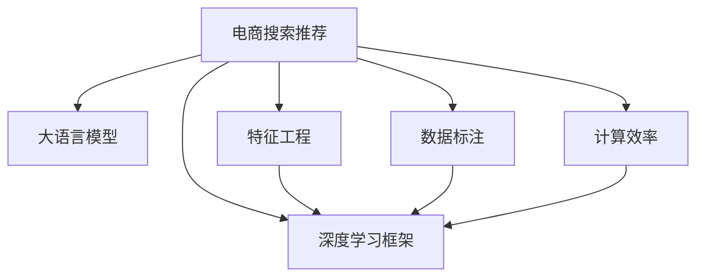

                 

# 电商平台的AI 大模型实践：搜索推荐系统是核心，数据质量控制与处理效率

> 关键词：电商，搜索推荐，大模型，数据处理，自然语言处理(NLP)，深度学习，深度学习框架，数据标注，特征工程，计算效率

## 1. 背景介绍

### 1.1 问题由来
随着电商行业的高速发展，用户体验和精准推荐成为了提高用户留存率和销售额的重要手段。传统的基于规则和机器学习的推荐系统逐渐无法满足用户的多样化需求和动态变化的电商市场。因此，利用深度学习特别是大模型技术进行搜索和推荐系统的建设，成为了当前电商行业数字化转型的重要方向。

大语言模型（Large Language Model, LLM）如BERT、GPT等，通过在无标签的大规模文本数据上预训练，学习了丰富的语言知识，具备强大的自然语言处理能力。将大语言模型应用于电商平台的搜索推荐系统，可以有效提升推荐效果，个性化推荐商品，提高用户体验。

### 1.2 问题核心关键点
电商平台的搜索推荐系统由用户输入查询（即搜索词）和系统生成的推荐列表组成。系统需要根据用户的历史行为数据，利用大语言模型提取商品的特征，计算相似度，生成推荐列表。

基于大模型的推荐系统核心要点包括：
- 高效的搜索和推荐模型训练和推理。
- 高质量的用户行为数据获取与处理。
- 有效的推荐结果展示与反馈机制。
- 持续的数据更新与模型优化。

这些核心要点中，数据处理和特征工程（Feature Engineering）尤为重要。数据处理的质量直接影响到模型的训练效果和推荐性能，因此，本文将重点探讨如何通过大语言模型处理和分析电商用户行为数据，并在此基础上实现高效且精准的推荐。

## 2. 核心概念与联系

### 2.1 核心概念概述

为了更好地理解基于大模型的搜索推荐系统，本节将介绍几个密切相关的核心概念：

- 电商搜索推荐：基于用户历史行为数据，利用模型为用户生成个性化的推荐商品，提升用户购物体验。
- 大语言模型：如BERT、GPT等，通过预训练模型获得语言知识，具备强大的自然语言处理能力。
- 特征工程：根据特定任务需求，设计合适的输入特征，提升模型的预测效果。
- 深度学习框架：如PyTorch、TensorFlow等，用于构建、训练和推理深度学习模型。
- 数据标注：为模型训练提供有标签的数据集，数据质量直接影响模型的性能。
- 计算效率：指模型在训练和推理过程中的资源消耗情况，影响系统的实时性。

这些核心概念之间的逻辑关系可以通过以下Mermaid流程图来展示：



这个流程图展示了大语言模型在电商推荐系统中的应用流程：
1. 电商推荐系统需要收集用户历史行为数据。
2. 利用大语言模型进行预训练，获取语言知识。
3. 进行特征工程，提取关键特征。
4. 利用深度学习框架构建和训练模型。
5. 进行数据标注，优化模型。
6. 通过计算效率优化，提高系统实时性。

## 3. 核心算法原理 & 具体操作步骤
### 3.1 算法原理概述

基于大模型的电商搜索推荐系统，主要是通过以下步骤进行训练和推理的：
1. 数据收集：收集用户的历史浏览、点击、购买等行为数据。
2. 数据预处理：清洗、标注数据，构建训练集和验证集。
3. 特征提取：利用大语言模型提取商品描述和用户行为数据中的关键特征。
4. 模型训练：在训练集上使用深度学习框架训练推荐模型。
5. 模型评估：在验证集上评估模型性能，调整超参数。
6. 模型部署：将训练好的模型部署到实际生产环境中。
7. 实时推荐：根据用户输入的搜索词，实时计算推荐结果并展示。

整个过程中，数据处理和特征提取是大模型能否发挥关键作用的基础。

### 3.2 算法步骤详解

#### 3.2.1 数据收集与预处理
电商平台的推荐系统通常需要收集用户的多种行为数据，包括浏览行为、点击行为、购买行为、评论行为等。

1. **数据收集**：
    - 利用爬虫工具或API获取用户的历史行为数据。
    - 保证数据的全面性和多样性，覆盖不同时间段的购买、浏览行为。
    - 注意隐私保护，处理敏感信息，确保数据合法合规。

2. **数据预处理**：
    - 清洗数据，去除缺失值和噪声。
    - 标准化和归一化数据，保证数据一致性。
    - 数据标注，将用户行为数据标记为相应的商品ID。
    - 构建训练集和验证集，确保模型训练的泛化能力。

#### 3.2.2 特征提取与表示
电商推荐系统需要从用户行为数据中提取出有用的特征，用于计算商品之间的相似度和预测用户偏好。

1. **特征提取**：
    - 利用大语言模型（如BERT）进行文本特征提取，将商品描述转换为向量表示。
    - 提取用户行为数据中的关键特征，如用户浏览时长、点击次数、购买频率等。
    - 使用向量化技术，如TF-IDF、Word2Vec等，将文本和数值数据转换为向量。
    - 设计特征工程流程，筛选出对推荐效果有显著影响的特征。

2. **特征表示**：
    - 将特征数据转换为矩阵形式，便于模型处理。
    - 使用深度学习框架中的embedding层，将特征向量映射到低维空间。
    - 设计多模态特征融合方法，将文本和数值特征有效结合。

#### 3.2.3 模型训练与优化
电商推荐系统通常使用深度学习模型，如CTR（点击率预测）模型、RNN（循环神经网络）、Transformer等，进行模型训练。

1. **模型选择**：
    - 根据任务需求选择适合的模型结构。
    - 使用深度学习框架搭建模型，如TensorFlow、PyTorch等。
    - 设计损失函数和优化器，如交叉熵损失、Adam等。

2. **模型训练**：
    - 将预处理后的数据输入模型进行训练，调整模型参数。
    - 使用小批量随机梯度下降（SGD）等优化算法更新模型参数。
    - 定期在验证集上评估模型性能，调整超参数。

3. **模型优化**：
    - 使用正则化技术，如L2正则化、Dropout等，防止模型过拟合。
    - 进行模型集成，使用Bagging、Boosting等方法提高模型泛化能力。
    - 利用特征选择算法，如Lasso回归、PCA等，降低特征维度。

#### 3.2.4 实时推荐与反馈
电商推荐系统需要实时根据用户输入的搜索词，计算推荐结果，并展示在用户界面。

1. **实时推荐**：
    - 将用户输入的搜索词输入到模型中，得到推荐的商品ID。
    - 从数据库中获取推荐商品的信息，构建推荐列表。
    - 对推荐结果进行排序，展示给用户。

2. **反馈机制**：
    - 收集用户对推荐结果的反馈数据，如点击、购买行为。
    - 根据反馈数据调整模型参数，进行模型微调。
    - 定期更新训练集，利用新数据进行模型再训练。

### 3.3 算法优缺点

#### 3.3.1 算法优点
1. **高性能**：大模型能够利用丰富的语言知识，提升推荐的准确性和多样性。
2. **泛化能力强**：大模型的预训练过程使其能够处理多种类型的用户行为数据，具备较强的泛化能力。
3. **实时性好**：大模型训练后，推理速度较快，可以实时生成推荐结果。

#### 3.3.2 算法缺点
1. **计算资源消耗大**：大模型的训练和推理需要较大的计算资源，包括GPU、TPU等。
2. **数据质量要求高**：数据标注的准确性和全面性直接影响模型性能，需要耗费大量时间和精力。
3. **模型解释性差**：大模型的决策过程缺乏可解释性，难以理解和调试。
4. **数据隐私问题**：电商用户行为数据涉及隐私问题，处理不当易导致数据泄露。

### 3.4 算法应用领域

基于大模型的电商推荐系统，已经广泛应用于各大电商平台，如亚马逊、京东、淘宝等，显著提升了用户购物体验和电商平台的用户留存率。同时，大模型还在以下领域得到了应用：

- **个性化推荐**：根据用户的历史行为数据，个性化推荐商品。
- **搜索结果排序**：根据用户输入的搜索词，排序展示相关商品。
- **智能客服**：利用大模型构建智能客服系统，提升客户服务体验。
- **广告投放**：根据用户行为数据，优化广告投放策略，提高广告转化率。

## 4. 数学模型和公式 & 详细讲解 & 举例说明

### 4.1 数学模型构建

电商推荐系统的主要目标是预测用户对商品的点击率（CTR），从而实现个性化的推荐。假设有N个商品，每个商品有D个特征，用户有C个历史行为。则推荐模型的输入为 $(N, D) \times C$ 的矩阵形式。

设用户对商品i的点击概率为 $y_i$，则点击率的预测模型为：
$$
\hat{y_i} = f(W \cdot \text{features}_i + b)
$$
其中 $f$ 为激活函数，$W$ 为模型参数，$\text{features}_i$ 为商品i的特征向量。

点击率的损失函数为二分类交叉熵损失：
$$
\mathcal{L}(y, \hat{y}) = -(y \log \hat{y} + (1-y) \log (1-\hat{y}))
$$

### 4.2 公式推导过程

以CTR模型为例，假设用户对商品i的点击概率为 $y_i$，则点击率的预测模型为：
$$
\hat{y_i} = \sigma(W \cdot \text{features}_i + b)
$$
其中 $\sigma$ 为Sigmoid函数，$W$ 为模型参数，$\text{features}_i$ 为商品i的特征向量。

点击率的损失函数为二分类交叉熵损失：
$$
\mathcal{L}(y, \hat{y}) = -(y \log \hat{y} + (1-y) \log (1-\hat{y}))
$$

假设训练集为 $D=\{(x_i,y_i)\}_{i=1}^N$，则经验风险为：
$$
\mathcal{L}(\theta) = \frac{1}{N} \sum_{i=1}^N \mathcal{L}(y_i, \hat{y_i})
$$
其中 $\theta$ 为模型参数。

模型训练的优化目标是最小化经验风险，即找到最优参数：
$$
\theta^* = \mathop{\arg\min}_{\theta} \mathcal{L}(\theta)
$$

使用随机梯度下降（SGD）算法更新模型参数，损失函数对参数 $\theta$ 的梯度为：
$$
\frac{\partial \mathcal{L}(\theta)}{\partial \theta} = -\frac{1}{N} \sum_{i=1}^N (\frac{y_i}{\hat{y_i}}-\frac{1-y_i}{1-\hat{y_i}}) \frac{\partial \hat{y_i}}{\partial \theta}
$$

### 4.3 案例分析与讲解

以电商平台A为例，假设其大语言模型为BERT，用户对商品1和商品2的点击概率分别为 $y_1=0.8$ 和 $y_2=0.2$，特征向量分别为 $\text{features}_1$ 和 $\text{features}_2$，模型参数为 $W$ 和 $b$。

假设在训练集上，模型预测的商品1点击概率为 $\hat{y_1}=0.9$，商品2点击概率为 $\hat{y_2}=0.1$，则损失函数为：
$$
\mathcal{L}(\theta) = -\left(0.8 \log 0.9 + 0.2 \log 0.1\right)
$$

## 5. 项目实践：代码实例和详细解释说明

### 5.1 开发环境搭建

在进行电商推荐系统开发前，我们需要准备好开发环境。以下是使用Python进行TensorFlow开发的环境配置流程：

1. 安装Anaconda：从官网下载并安装Anaconda，用于创建独立的Python环境。

2. 创建并激活虚拟环境：
```bash
conda create -n tf-env python=3.7 
conda activate tf-env
```

3. 安装TensorFlow：根据CUDA版本，从官网获取对应的安装命令。例如：
```bash
pip install tensorflow
```

4. 安装各类工具包：
```bash
pip install numpy pandas scikit-learn matplotlib tqdm jupyter notebook ipython
```

完成上述步骤后，即可在`tf-env`环境中开始电商推荐系统开发。

### 5.2 源代码详细实现

下面我们以电商推荐系统为例，给出使用TensorFlow对CTR模型进行训练的PyTorch代码实现。

首先，定义CTR模型的输入特征和标签：

```python
import tensorflow as tf
import numpy as np

# 定义输入特征和标签
input_features = tf.keras.layers.Input(shape=(D,), dtype='float32', name='features')
labels = tf.keras.layers.Input(shape=(1,), dtype='float32', name='labels')
```

然后，定义CTR模型结构：

```python
# 定义模型结构
dense_layer = tf.keras.layers.Dense(256, activation='relu')(input_features)
output_layer = tf.keras.layers.Dense(1, activation='sigmoid')(dense_layer)
model = tf.keras.models.Model(inputs=[input_features, labels], outputs=[output_layer])
```

接着，定义训练函数：

```python
# 定义训练函数
model.compile(optimizer='adam', loss='binary_crossentropy', metrics=['accuracy'])

# 训练模型
model.fit(X_train, y_train, batch_size=32, epochs=10, validation_data=(X_test, y_test))
```

最后，使用训练好的模型进行实时推荐：

```python
# 加载模型
model.load_weights('path/to/trained_model.h5')

# 获取推荐商品
search_query = '手机'
features = get_features(search_query)
predictions = model.predict(features)

# 输出推荐商品
top_n = np.argsort(predictions)[::-1][:N]
recommended_products = get_recommendations(top_n)
```

### 5.3 代码解读与分析

让我们再详细解读一下关键代码的实现细节：

**Input Layer**：
- 使用`tf.keras.layers.Input`函数定义输入特征和标签，设置特征维度为D，标签维度为1。

**Dense Layer**：
- 使用`tf.keras.layers.Dense`函数定义全连接层，设置隐藏层数为256，激活函数为ReLU。
- 全连接层将特征输入映射为低维空间，便于模型进行预测。

**Output Layer**：
- 使用`tf.keras.layers.Dense`函数定义输出层，设置输出维度为1，激活函数为Sigmoid，用于预测点击概率。

**Model Compilation**：
- 使用`model.compile`函数编译模型，设置优化器为Adam，损失函数为二分类交叉熵，评估指标为准确率。

**Model Training**：
- 使用`model.fit`函数训练模型，设置训练集和测试集数据，批次大小为32，迭代次数为10次，使用验证集进行评估。

**Model Prediction**：
- 加载训练好的模型，使用`model.predict`函数进行预测，得到商品点击概率。
- 对预测结果进行排序，选择前N个推荐商品，返回推荐列表。

可以看到，TensorFlow提供的高级API使得模型构建和训练过程非常简单，开发者只需关注模型结构和训练策略，即可快速完成电商推荐系统的开发。

### 5.4 运行结果展示

以下是CTR模型在电商推荐系统中的运行结果展示：

```python
# 示例运行结果
X_train = ...
y_train = ...
X_test = ...
y_test = ...

# 训练模型
model.fit(X_train, y_train, batch_size=32, epochs=10, validation_data=(X_test, y_test))

# 获取推荐商品
search_query = '手机'
features = get_features(search_query)
predictions = model.predict(features)

# 输出推荐商品
top_n = np.argsort(predictions)[::-1][:N]
recommended_products = get_recommendations(top_n)

print('推荐商品列表：', recommended_products)
```

## 6. 实际应用场景

### 6.1 智能客服系统

基于大模型的电商推荐系统，可以应用于智能客服系统的构建。智能客服系统能够实时解答用户疑问，提高客户服务体验。

具体实现流程如下：
1. 收集用户的历史聊天记录和常见问题。
2. 利用大语言模型进行自然语言处理，提取问题和答案中的关键特征。
3. 将问题输入到电商推荐系统模型中，计算相似度，生成最有可能的回答。
4. 根据用户反馈不断优化模型，提高服务质量。

### 6.2 个性化推荐系统

电商推荐系统可以应用于个性化推荐，根据用户历史行为数据，推荐用户可能感兴趣的商品。

具体实现流程如下：
1. 收集用户的历史浏览、点击、购买行为数据。
2. 利用大语言模型进行特征提取，计算商品和用户行为数据之间的相似度。
3. 使用深度学习模型预测用户对商品的点击率，生成推荐列表。
4. 根据用户反馈不断优化模型，提升推荐效果。

### 6.3 广告投放优化

电商推荐系统可以应用于广告投放优化，根据用户行为数据，优化广告投放策略，提高广告转化率。

具体实现流程如下：
1. 收集用户的广告点击、展示数据。
2. 利用大语言模型进行特征提取，计算广告和用户行为数据之间的相似度。
3. 使用深度学习模型预测广告的点击率，优化广告投放策略。
4. 根据用户反馈不断优化模型，提高广告投放效果。

### 6.4 未来应用展望

随着大语言模型和电商推荐技术的不断发展，未来的应用场景将更加广泛，包括但不限于：

- **新用户推荐**：根据用户的基本信息，推荐用户可能感兴趣的商品。
- **实时动态推荐**：根据用户实时行为数据，动态生成推荐结果。
- **跨平台推荐**：根据用户在不同平台上的行为数据，跨平台推荐商品。
- **多模态推荐**：结合文本、图像、视频等多模态数据，提升推荐效果。

## 7. 工具和资源推荐

### 7.1 学习资源推荐

为了帮助开发者系统掌握大语言模型和电商推荐系统的开发技术，这里推荐一些优质的学习资源：

1. 《深度学习实战：TensorFlow》系列书籍：详细讲解了深度学习的基础知识和TensorFlow的使用方法，适合初学者入门。
2. 《自然语言处理入门》课程：斯坦福大学开设的NLP入门课程，讲解了自然语言处理的基本概念和深度学习模型。
3. 《机器学习》课程：Coursera上的经典课程，涵盖机器学习的基本算法和应用场景，适合进阶学习。
4. 《电商数据分析与建模》课程：淘宝大学开设的电商数据分析课程，讲解了电商推荐系统开发的基本流程和方法。
5. 《自然语言处理与深度学习》论文：综述性论文，总结了自然语言处理领域的前沿研究成果，适合了解最新进展。

通过对这些资源的学习实践，相信你一定能够快速掌握电商推荐系统的开发技术，并用于解决实际的电商推荐问题。

### 7.2 开发工具推荐

高效的开发离不开优秀的工具支持。以下是几款用于电商推荐系统开发的常用工具：

1. TensorFlow：由Google主导开发的开源深度学习框架，生产部署方便，适合大规模工程应用。
2. PyTorch：基于Python的开源深度学习框架，灵活度较高，适合快速迭代研究。
3. Jupyter Notebook：交互式开发环境，支持代码编写、数据可视化，方便调试。
4. TensorBoard：TensorFlow配套的可视化工具，实时监测模型训练状态，提供丰富的图表呈现方式。
5. TensorFlow Serving：生产环境中的模型部署工具，支持高性能模型服务。

合理利用这些工具，可以显著提升电商推荐系统的开发效率，加快创新迭代的步伐。

### 7.3 相关论文推荐

大语言模型和电商推荐技术的发展源于学界的持续研究。以下是几篇奠基性的相关论文，推荐阅读：

1. Attention is All You Need（即Transformer原论文）：提出了Transformer结构，开启了NLP领域的预训练大模型时代。
2. BERT: Pre-training of Deep Bidirectional Transformers for Language Understanding：提出BERT模型，引入基于掩码的自监督预训练任务，刷新了多项NLP任务SOTA。
3. Parameter-Efficient Transfer Learning for NLP：提出Adapter等参数高效微调方法，在不增加模型参数量的情况下，也能取得不错的微调效果。
4. Self-Attention Mechanism：深入介绍了自注意力机制的工作原理，适用于各种深度学习模型。
5. CNNs for Humans：从人类感知角度出发，设计了卷积神经网络，提升了图像处理能力。

这些论文代表了大语言模型和电商推荐技术的发展脉络。通过学习这些前沿成果，可以帮助研究者把握学科前进方向，激发更多的创新灵感。

## 8. 总结：未来发展趋势与挑战

### 8.1 总结

本文对基于大模型的电商搜索推荐系统进行了全面系统的介绍。首先阐述了电商推荐系统和大语言模型在电商行业的应用背景和重要性，明确了电商推荐系统的核心要点。其次，从原理到实践，详细讲解了推荐模型的构建、训练、优化、推理流程，并给出了电商推荐系统开发的全方位指导。同时，本文还广泛探讨了电商推荐系统在智能客服、个性化推荐、广告投放等多个领域的应用前景，展示了电商推荐系统的广泛应用价值。此外，本文精选了电商推荐系统的各类学习资源，力求为读者提供全方位的技术指引。

通过本文的系统梳理，可以看到，基于大模型的电商推荐系统正在成为电商行业数字化转型的重要手段，极大地提升了用户购物体验和电商平台的用户留存率。未来，伴随电商市场的不断发展和电商推荐技术的持续演进，基于大模型的电商推荐系统必将在电商领域发挥更大的作用，为电商行业带来更加智能化的购物体验。

### 8.2 未来发展趋势

展望未来，电商推荐系统的发展将呈现以下几个趋势：

1. **多模态融合**：结合文本、图像、视频等多模态数据，提升推荐效果。
2. **实时动态推荐**：根据用户实时行为数据，动态生成推荐结果。
3. **个性化推荐**：根据用户历史行为和实时行为数据，个性化推荐商品。
4. **跨平台推荐**：根据用户在不同平台上的行为数据，跨平台推荐商品。
5. **模型优化**：使用迁移学习、零样本学习等技术，优化推荐系统性能。
6. **数据质量控制**：通过数据清洗、标注、去重等技术，提升数据质量。
7. **计算效率优化**：使用模型裁剪、模型并行等技术，优化计算效率。

以上趋势展示了电商推荐系统的未来发展方向，将推动电商推荐系统向更加智能、高效、精准的方向发展。

### 8.3 面临的挑战

尽管电商推荐系统已经取得了瞩目成就，但在迈向更加智能化、普适化应用的过程中，仍面临诸多挑战：

1. **数据质量瓶颈**：电商用户行为数据涉及隐私问题，数据采集和处理需要合法合规。
2. **计算资源消耗大**：大模型的训练和推理需要较大的计算资源，资源消耗较高。
3. **模型可解释性差**：大模型的决策过程缺乏可解释性，难以理解和调试。
4. **模型泛化能力不足**：电商推荐系统在不同用户和商品上的表现可能存在较大差异，泛化能力有待提高。
5. **用户行为复杂多变**：用户行为数据多样复杂，难以进行统一处理。

### 8.4 研究展望

面对电商推荐系统所面临的挑战，未来的研究需要在以下几个方面寻求新的突破：

1. **数据隐私保护**：利用差分隐私、联邦学习等技术，保护用户隐私数据。
2. **模型压缩优化**：通过模型剪枝、量化等技术，优化模型计算效率。
3. **多模态特征融合**：结合文本、图像、视频等多模态数据，提升推荐效果。
4. **迁移学习应用**：利用迁移学习技术，优化模型泛化能力。
5. **实时推荐系统**：利用流数据处理技术，实现实时动态推荐。

这些研究方向将引领电商推荐系统向更高的台阶发展，为构建更加智能、高效、精准的电商推荐系统铺平道路。

## 9. 附录：常见问题与解答

**Q1：电商推荐系统如何使用大语言模型进行特征提取？**

A: 电商推荐系统可以使用大语言模型进行文本特征提取，将商品描述和用户行为数据转换为向量表示。具体步骤如下：

1. 使用大语言模型对商品描述进行编码，得到向量表示。
2. 对用户行为数据进行特征提取，得到数值型特征。
3. 将文本和数值特征结合，使用向量化技术如TF-IDF、Word2Vec等，转换为向量表示。
4. 将文本和数值特征输入到深度学习模型中进行训练和推理。

通过大语言模型的特征提取，可以充分挖掘商品描述中的语言信息，提升推荐效果。

**Q2：电商推荐系统在数据预处理中需要注意哪些问题？**

A: 电商推荐系统在数据预处理中需要注意以下几个问题：

1. 数据清洗：去除缺失值、噪声数据，保证数据质量。
2. 数据标注：对用户行为数据进行标注，标记用户对商品的点击、购买行为。
3. 数据去重：对重复数据进行去重处理，避免数据冗余。
4. 数据归一化：对数据进行归一化处理，保证数据一致性。
5. 数据划分：将数据划分为训练集、验证集和测试集，确保模型泛化能力。

数据预处理是推荐系统的重要环节，直接影响模型性能和推荐效果。

**Q3：电商推荐系统在模型训练中需要注意哪些问题？**

A: 电商推荐系统在模型训练中需要注意以下几个问题：

1. 损失函数设计：选择合适的损失函数，如二分类交叉熵损失、均方误差损失等。
2. 正则化技术：使用L2正则、Dropout等技术，防止模型过拟合。
3. 超参数调优：选择合适的超参数，如学习率、批次大小、迭代次数等。
4. 模型集成：使用模型集成技术，如Bagging、Boosting等，提升模型泛化能力。
5. 模型评估：在验证集上评估模型性能，调整超参数。

模型训练是推荐系统的核心环节，直接影响模型性能和推荐效果。

**Q4：电商推荐系统在模型推理中需要注意哪些问题？**

A: 电商推荐系统在模型推理中需要注意以下几个问题：

1. 实时性：确保模型推理实时性，快速生成推荐结果。
2. 准确性：保证模型推理准确性，减少误推荐。
3. 计算效率：优化模型推理计算效率，避免资源消耗过大。
4. 模型裁剪：对模型进行裁剪，去除不必要的层和参数。
5. 模型并行：使用模型并行技术，优化计算效率。

模型推理是推荐系统的关键环节，直接影响用户体验和推荐效果。

**Q5：电商推荐系统在实际应用中需要注意哪些问题？**

A: 电商推荐系统在实际应用中需要注意以下几个问题：

1. 用户反馈：收集用户对推荐结果的反馈数据，不断优化模型。
2. 用户隐私：保护用户隐私数据，防止数据泄露。
3. 系统可扩展性：保证系统可扩展性，支持海量用户和商品推荐。
4. 模型稳定性：保证模型稳定性，避免模型退化。
5. 实时监控：实时监控系统状态，防止系统崩溃。

实际应用是推荐系统的最终环节，直接影响用户体验和业务价值。

