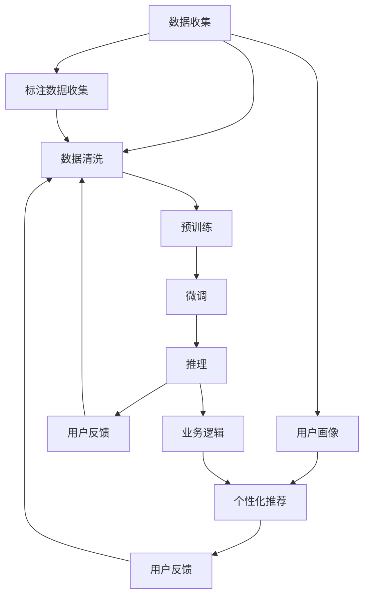

                 

# 电商平台的AI 大模型实践：搜索推荐系统是核心，数据质量是关键，用户体验是重点

## 1. 背景介绍

在电商领域，AI技术正迅速成为重要的创新驱动力。传统的电商推荐系统大多基于规则和浅层机器学习模型，已无法满足不断变化的消费者需求和复杂的业务场景。近年来，深度学习尤其是预训练大模型在电商推荐系统中的应用，带来了革命性的突破。

电商平台的AI大模型实践，以搜索推荐系统为核心，通过高效的数据驱动、强大的模型能力和丰富的用户体验设计，大幅提升了平台的运营效率、用户满意度和转化率。本文将系统探讨AI大模型在电商平台中的应用策略，并深入分析其中的关键问题。

## 2. 核心概念与联系

### 2.1 核心概念概述

- **AI 大模型**：指通过大规模无监督预训练（如BERT、GPT等），学习通用语言表示的深度学习模型。其在电商推荐中的应用，可大大提升模型的泛化能力和推理能力。

- **推荐系统**：利用用户历史行为、商品属性、用户画像等信息，通过算法推荐用户可能感兴趣的商品，从而提升用户体验和平台销售。

- **数据质量**：推荐系统的准确性高度依赖于数据质量，包括数据的时效性、多样性、完整性和准确性。

- **用户体验**：推荐系统需要考虑用户体验，如推荐的及时性、个性化、多样性等。

- **深度学习**：推荐系统的核心算法，通过复杂神经网络结构和大规模数据训练，自动学习复杂的模式和特征。

- **模型优化**：通过调整模型结构、超参数、损失函数等手段，提升模型的精度、速度和泛化能力。

这些概念通过数据收集、预训练、微调、推理等环节紧密联系，构成一个高效、智能的推荐系统。

### 2.2 核心概念原理和架构的 Mermaid 流程图



这个图展示了从数据收集到推荐输出的整个流程，从中可以看到：

- 数据收集和清洗是推荐系统的基础。
- 预训练和微调是大模型推荐的核心步骤。
- 推理和用户反馈用于调整和优化模型。
- 个性化推荐是用户满意度的关键。

## 3. 核心算法原理 & 具体操作步骤

### 3.1 算法原理概述

电商平台的AI大模型推荐系统，核心在于通过大模型学习用户和商品之间的语义关联，并在此基础上进行推荐。具体流程包括：

1. **数据收集与预处理**：收集用户行为数据、商品属性、用户画像等信息，并进行清洗和标注。
2. **预训练大模型**：使用无监督预训练大模型（如BERT）学习通用的语言表示。
3. **微调**：在大模型上微调推荐任务，调整模型的分类器，使其能够精准预测用户的购买意图。
4. **推理**：将新用户和商品的描述输入模型，得到推荐结果。
5. **反馈循环**：根据用户反馈和业务逻辑，调整模型和推荐算法，提升推荐质量。

### 3.2 算法步骤详解

**Step 1: 数据收集与预处理**

- **用户行为数据**：收集用户的点击、浏览、购买记录等行为数据。
- **商品属性**：提取商品的标题、描述、标签等信息，形成结构化的特征向量。
- **用户画像**：收集用户的人口统计信息、兴趣偏好、社交网络等数据，建立用户画像。
- **数据清洗**：删除噪声数据，处理缺失值，标准化数据格式。

**Step 2: 预训练大模型**

- **选择合适的预训练模型**：选择适合电商场景的预训练大模型，如BERT、GPT等。
- **加载预训练模型**：使用Hugging Face等库加载预训练模型。
- **微调任务适配层**：根据电商推荐任务，设计合适的输出层和损失函数。

**Step 3: 微调**

- **设定超参数**：学习率、批量大小、迭代次数等。
- **训练**：在大模型上微调，最小化推荐任务损失函数。
- **评估**：在验证集上评估模型性能，使用准确率、召回率、F1值等指标。

**Step 4: 推理**

- **输入处理**：将用户和商品描述转换成模型的输入格式。
- **预测**：将输入数据输入微调后的模型，得到推荐结果。
- **输出优化**：根据业务逻辑和用户反馈，对推荐结果进行优化排序。

**Step 5: 反馈循环**

- **收集反馈**：收集用户对推荐结果的反馈，包括点击、购买、评分等。
- **模型调整**：根据反馈调整模型，使用在线学习等方法更新模型参数。
- **业务调整**：根据反馈调整推荐算法，如权重调整、模型融合等。

### 3.3 算法优缺点

**优点**：

- **精度高**：大模型通过预训练学习到丰富的语义知识，微调后推荐精度更高。
- **泛化能力强**：大模型具备较强的泛化能力，对新商品和用户能够快速适应。
- **实时性好**：大模型推理速度快，推荐结果实时更新。

**缺点**：

- **资源消耗大**：大模型参数多，训练和推理资源消耗大。
- **数据依赖性强**：推荐系统依赖高质量的数据，数据质量差会影响效果。
- **解释性差**：大模型是黑盒模型，用户难以理解推荐理由。

### 3.4 算法应用领域

大语言模型在电商平台的推荐系统中的应用主要集中在以下几个方面：

- **商品推荐**：根据用户行为、商品属性、用户画像等信息，推荐用户可能感兴趣的商品。
- **个性化推荐**：结合用户画像和历史行为，提供个性化的推荐结果。
- **搜索排序**：通过搜索查询词，推荐最相关的商品。
- **广告推荐**：推荐适合用户兴趣的广告内容。
- **动态定价**：根据用户行为和市场行情，动态调整商品价格。

这些应用场景不仅提升了用户的购物体验，还优化了平台的运营效率和盈利能力。

## 4. 数学模型和公式 & 详细讲解 & 举例说明

### 4.1 数学模型构建

电商平台的推荐系统通常是一个多分类任务，目标是将用户输入的查询词或商品描述映射到不同的商品类别。数学模型可以表示为：

$$
P(y|x) = \frac{exp(\text{logit}(y|x))}{\sum_{y \in Y}exp(\text{logit}(y|x))}
$$

其中 $x$ 是用户输入的查询词或商品描述，$y$ 是商品类别，$\text{logit}(y|x)$ 是模型对商品类别的概率预测。

### 4.2 公式推导过程

对于电商平台的推荐任务，可以采用分类交叉熵损失函数：

$$
\mathcal{L} = -\frac{1}{N}\sum_{i=1}^N \sum_{y \in Y}y_i\log P(y_i|x_i) + (1-y_i)\log (1-P(y_i|x_i))
$$

其中 $N$ 是训练样本数，$y_i$ 是样本 $i$ 的真实标签。

为了优化分类交叉熵损失函数，通常使用随机梯度下降（SGD）算法：

$$
\theta \leftarrow \theta - \eta \nabla_{\theta}\mathcal{L}
$$

其中 $\theta$ 是模型参数，$\eta$ 是学习率。

### 4.3 案例分析与讲解

以电商平台的商品推荐为例，假设用户输入的商品描述为 "优质无糖饮料"，模型通过预测概率向量 $P(y|x)$，得到推荐的商品类别。例如：

| 商品类别 | 预测概率 |
| --- | --- |
| 饮料 | 0.9 |
| 食品 | 0.1 |
| 书籍 | 0.0 |

模型最终推荐 "饮料" 类商品。

## 5. 项目实践：代码实例和详细解释说明

### 5.1 开发环境搭建

- **Python 环境**：安装 Python 3.7 或更高版本，推荐使用虚拟环境。
- **深度学习框架**：安装 PyTorch 或 TensorFlow，建议使用 GPU 设备。
- **预训练模型库**：安装 Hugging Face 的 Transformers 库，用于加载和使用预训练大模型。
- **数据处理工具**：安装 Pandas、NumPy、Scikit-learn 等库，用于数据清洗、特征提取等。

### 5.2 源代码详细实现

以下是一个使用 PyTorch 实现商品推荐的示例代码：

```python
import torch
import torch.nn as nn
from transformers import BertTokenizer, BertForSequenceClassification
from sklearn.model_selection import train_test_split

# 加载预训练模型和 tokenizer
tokenizer = BertTokenizer.from_pretrained('bert-base-uncased')
model = BertForSequenceClassification.from_pretrained('bert-base-uncased', num_labels=2)

# 加载数据集
train_data, test_data = train_test_split(train_dataset, test_size=0.2)
train_encodings = tokenizer(train_data, truncation=True, padding=True)
test_encodings = tokenizer(test_data, truncation=True, padding=True)

# 定义模型结构
class BertRecommender(nn.Module):
    def __init__(self):
        super(BertRecommender, self).__init__()
        self.bert = BertForSequenceClassification.from_pretrained('bert-base-uncased', num_labels=2)
    
    def forward(self, input_ids, attention_mask):
        return self.bert(input_ids, attention_mask=attention_mask)

# 定义优化器和损失函数
optimizer = torch.optim.Adam(model.parameters(), lr=1e-5)
loss_fn = nn.CrossEntropyLoss()

# 定义训练函数
def train_model(model, train_encodings, train_labels, num_epochs, batch_size):
    device = torch.device('cuda' if torch.cuda.is_available() else 'cpu')
    model.to(device)
    
    for epoch in range(num_epochs):
        total_loss = 0
        for batch in range(0, len(train_encodings), batch_size):
            input_ids = torch.tensor(train_encodings['input_ids'][batch]).to(device)
            attention_mask = torch.tensor(train_encodings['attention_mask'][batch]).to(device)
            labels = torch.tensor(train_labels[batch]).to(device)
            output = model(input_ids, attention_mask=attention_mask)
            loss = loss_fn(output, labels)
            optimizer.zero_grad()
            loss.backward()
            optimizer.step()
            total_loss += loss.item()
        print(f'Epoch {epoch+1}, train loss: {total_loss/len(train_encodings)}')

# 训练模型
train_model(model, train_encodings, train_labels, num_epochs=5, batch_size=16)

# 预测测试集
test_encodings = tokenizer(test_data, truncation=True, padding=True)
test_input_ids = torch.tensor(test_encodings['input_ids']).to(device)
test_attention_mask = torch.tensor(test_encodings['attention_mask']).to(device)
test_labels = torch.tensor(test_labels).to(device)
predictions = model(test_input_ids, attention_mask=test_attention_mask)
print(f'Test loss: {loss_fn(predictions, test_labels).item()}')
```

### 5.3 代码解读与分析

**代码详细解读**：

- **数据加载**：使用 Hugging Face 的 Transformers 库加载预训练模型和 tokenizer，对训练集和测试集进行编码和分词。
- **模型定义**：定义一个自定义的 BertRecommender 类，继承自 nn.Module，用于定义模型结构。
- **优化器和损失函数**：使用 PyTorch 的 Adam 优化器和交叉熵损失函数。
- **训练函数**：定义一个 train_model 函数，进行模型训练和评估。
- **模型训练**：在训练函数中使用模型、优化器和损失函数，进行模型训练。
- **模型预测**：在训练完成后，对测试集进行预测，输出损失函数值。

**代码分析**：

- **数据预处理**：代码中使用了 Transformers 库的 tokenizer，对数据进行预处理，确保模型能够正确处理输入。
- **模型定义**：模型结构简单明了，只有一个 BertForSequenceClassification 层。
- **训练过程**：训练函数中使用了 mini-batch 的 SGD 算法，有效地利用了 GPU 设备加速训练。
- **预测过程**：测试集输入经过模型处理后，使用损失函数计算预测值和真实标签的差异，输出损失值。

## 6. 实际应用场景

### 6.1 智能推荐系统

智能推荐系统是电商平台的核心应用之一，通过大语言模型推荐系统可以大大提升用户的购物体验和满意度。例如，亚马逊的推荐系统使用基于大模型的推荐引擎，能够根据用户的浏览和购买历史，精准推荐用户感兴趣的商品。

### 6.2 个性化搜索

个性化搜索是电商平台的另一个关键应用，通过大语言模型推荐系统可以优化搜索结果，使用户更快找到心仪的商品。例如，淘宝的搜索排序系统通过大语言模型推荐引擎，根据用户的查询词和历史行为，提供更加个性化的搜索结果。

### 6.3 动态定价

动态定价是电商平台的高级应用，通过大语言模型推荐系统可以实时调整商品价格，提高平台的销售额和利润率。例如，京东的动态定价系统使用大语言模型推荐引擎，根据用户的行为和市场行情，动态调整商品价格，实现更精准的定价策略。

### 6.4 未来应用展望

未来，大语言模型推荐系统将在电商平台上得到更广泛的应用，具体趋势如下：

- **多模态推荐**：结合视觉、听觉等多模态信息，提供更加丰富和准确的推荐结果。
- **跨领域推荐**：将推荐系统应用于多个领域，如医疗、金融等，实现跨领域的智能推荐。
- **实时推荐**：通过实时分析和用户行为数据，实现动态调整和个性化推荐。
- **个性化推荐**：根据用户画像和行为数据，提供更加精准和个性化的推荐结果。
- **社交推荐**：结合社交网络数据，推荐用户的朋友和关注者感兴趣的商品。

## 7. 工具和资源推荐

### 7.1 学习资源推荐

- **Hugging Face Transformers 文档**：官方文档提供了丰富的 API 和样例代码，是学习大语言模型的绝佳资源。
- **《深度学习与自然语言处理》**：斯坦福大学 CS224N 课程，涵盖 NLP 和推荐系统的基础知识，值得深入学习。
- **Coursera 的 Machine Learning 课程**：涵盖深度学习算法和推荐系统，是入门深度学习的良好起点。
- **Kaggle**：数据科学竞赛平台，提供大量的推荐系统竞赛数据集和模型。

### 7.2 开发工具推荐

- **PyTorch**：深度学习框架，支持动态计算图和 GPU 加速，是推荐系统的常用工具。
- **TensorFlow**：深度学习框架，支持分布式训练和生产部署，适合大规模工程应用。
- **Hugging Face Transformers**：NLP 工具库，提供了丰富的预训练模型和微调接口。
- **Weights & Biases**：模型训练跟踪工具，可以实时监控和可视化训练过程。
- **TensorBoard**：可视化工具，可以实时展示训练指标和模型结构。

### 7.3 相关论文推荐

- **《Transformer from Attention is All You Need》**：原始 Transformer 论文，介绍了 Transformer 的架构和训练方法。
- **《Attention is All You Need》**：BERT 论文，介绍了无监督预训练和微调方法。
- **《Fine-Tuning BERT for Recommendation System》**：细化了 BERT 在推荐系统中的应用，提供了详细实现和效果分析。
- **《A Survey on Deep Learning Techniques for Recommendation Systems》**：综述了深度学习在推荐系统中的应用和最新进展。

## 8. 总结：未来发展趋势与挑战

### 8.1 研究成果总结

大语言模型在电商平台的推荐系统中，已经取得了显著的成果，大幅提升了推荐精度和用户体验。未来，随着模型的不断优化和数据的持续积累，将有更大的发展潜力。

### 8.2 未来发展趋势

未来，大语言模型推荐系统将呈现以下几个发展趋势：

- **多模态融合**：结合视觉、听觉等多模态信息，提升推荐结果的丰富度和准确度。
- **跨领域推荐**：将推荐系统应用于更多领域，如医疗、金融等，实现跨领域的智能推荐。
- **实时推荐**：通过实时分析和用户行为数据，实现动态调整和个性化推荐。
- **个性化推荐**：根据用户画像和行为数据，提供更加精准和个性化的推荐结果。
- **社交推荐**：结合社交网络数据，推荐用户的朋友和关注者感兴趣的商品。

### 8.3 面临的挑战

尽管大语言模型在推荐系统中的应用取得了显著成效，但仍面临一些挑战：

- **数据质量**：推荐系统高度依赖数据质量，数据的不完整性和噪声将影响模型的效果。
- **模型泛化**：在大规模数据上训练的模型，如何在新场景下保持泛化能力，是当前的研究热点。
- **模型压缩**：大模型的参数量巨大，如何减少模型体积，提升推理速度，是实现实时推荐的关键。
- **模型解释性**：大模型的黑盒特性，导致用户难以理解推荐理由，如何增强模型的可解释性，是提升用户信任的重要手段。

### 8.4 研究展望

未来，大语言模型推荐系统的研究需要在以下几个方面取得突破：

- **数据增强**：通过数据增强技术，提升数据质量和多样性，减少模型的过拟合风险。
- **模型优化**：通过模型压缩、剪枝等技术，减少模型参数量，提升模型的实时性和泛化能力。
- **跨领域迁移**：通过迁移学习技术，将模型的知识迁移到其他领域，提升跨领域推荐能力。
- **多模态融合**：结合多模态数据，提升推荐结果的丰富度和准确度，实现更加智能的推荐系统。
- **可解释性增强**：通过可解释性技术，增强模型的透明度，提升用户信任和满意度。

总之，大语言模型推荐系统在电商领域的应用前景广阔，但同时也面临着诸多挑战。未来的研究需要在这几个方面不断探索和突破，才能实现更加智能和高效的推荐系统。

## 9. 附录：常见问题与解答

**Q1: 推荐系统的准确性和召回率如何优化？**

A: 推荐系统的准确性和召回率可以通过以下方法优化：

- **特征工程**：通过提取更多的用户和商品特征，提升模型的特征表示能力。
- **模型优化**：使用更先进的深度学习模型和优化算法，提升模型的准确性和泛化能力。
- **多模型融合**：通过组合多个推荐模型的预测结果，提升推荐的准确性和多样性。
- **数据增强**：通过生成更多的正样本和负样本，提升模型的鲁棒性和泛化能力。

**Q2: 推荐系统的实时性和稳定性如何保障？**

A: 推荐系统的实时性和稳定性可以通过以下方法保障：

- **分布式计算**：使用分布式计算框架，实现大规模数据的并行处理。
- **缓存机制**：使用缓存机制，提升查询和推荐的响应速度。
- **模型压缩**：通过模型压缩技术，减少模型体积，提升推理速度。
- **异常检测**：通过异常检测机制，及时发现和处理推荐系统中的异常情况。

**Q3: 推荐系统的用户隐私如何保护？**

A: 推荐系统的用户隐私可以通过以下方法保护：

- **匿名化处理**：使用数据匿名化技术，保护用户的隐私信息。
- **差分隐私**：使用差分隐私技术，限制模型的隐私泄露风险。
- **访问控制**：通过访问控制机制，限制模型的访问权限，防止恶意攻击。
- **隐私计算**：使用隐私计算技术，实现数据隐私保护和模型合作。

总之，推荐系统在电商平台的应用，需要结合数据、模型、算法等多个方面进行综合优化，才能实现高效、智能和安全的推荐效果。未来，随着技术的发展和应用的深入，推荐系统将不断提升用户满意度和平台运营效率，成为电商平台的重要竞争力。

