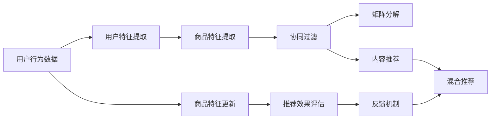

                 

# 电商平台的AI 大模型转型：搜索推荐系统是核心，冷启动策略是关键

## 1. 背景介绍

随着人工智能技术的飞速发展，各大电商平台正积极拥抱AI大模型转型，以期在激烈的市场竞争中保持领先地位。AI大模型不仅能够提升用户购物体验，还能帮助商家精准营销、优化库存管理、预测销售趋势，为电商平台带来显著的商业价值。在这一转型过程中，搜索推荐系统成为了AI大模型的核心应用领域，而冷启动策略则成为了系统高效运行的关键。

### 1.1 问题由来

传统电商平台主要依赖人工运营，如商品上架、分类、维护等，效率低、成本高。而人工智能大模型通过自动化的方式，能够在短时间内完成海量数据的处理和分析，提升电商平台的运营效率。具体而言，AI大模型在搜索推荐系统中的应用，使得用户能够快速找到所需商品，商家也能精准推送相关商品，从而提高交易转化率和销售额。

### 1.2 问题核心关键点

搜索推荐系统作为AI大模型的核心应用，其核心在于对用户行为和商品特征的高效建模，以及基于模型的推荐算法和召回算法。如何设计合理的冷启动策略，使得新用户或新商品能够迅速适应系统，提升推荐效果，成为了电商平台的关注重点。冷启动策略的优劣直接影响到搜索推荐系统的用户留存率和销售转化率，是电商平台AI大模型转型的重要考量因素。

### 1.3 问题研究意义

研究电商平台AI大模型搜索推荐系统及其冷启动策略，对于提升电商平台的用户体验、增加交易机会、优化库存管理等方面具有重要意义。具体而言：

- 提升用户体验：通过个性化的推荐，用户可以快速找到所需商品，提升购物体验。
- 增加交易机会：精准的推荐能够提高用户的购买意愿，增加销售机会。
- 优化库存管理：AI模型可以预测商品需求，帮助商家更好地管理库存，避免缺货或积压。
- 预测销售趋势：通过分析历史数据，AI模型可以预测未来销售趋势，为商家提供决策支持。

综上所述，搜索推荐系统及其冷启动策略的研究，能够显著提升电商平台的运营效率和盈利能力，具有重要的实际应用价值。

## 2. 核心概念与联系

### 2.1 核心概念概述

在深入探讨搜索推荐系统及其冷启动策略之前，需要先明确几个关键概念：

- **人工智能大模型(AI Large Model)**：指基于深度学习技术，拥有海量参数的模型，能够自动处理和分析大量数据，具备高度的泛化能力和学习能力。
- **搜索推荐系统(Search & Recommendation System)**：利用AI大模型对用户行为和商品特征进行分析，提供个性化的搜索结果和推荐。
- **冷启动问题(Cold Start Problem)**：新用户或新商品加入系统时，由于缺乏历史数据，推荐系统无法准确预测其行为或特征，导致推荐效果不佳。
- **推荐算法(Recommendation Algorithm)**：基于用户行为和商品特征，设计算法计算推荐结果。
- **召回算法(Recall Algorithm)**：确定需要展示给用户的部分商品，以满足多样性和相关性要求。
- **双向推荐(Feedback-Aware Recommendation)**：通过用户反馈调整推荐算法，使得推荐更加符合用户实际需求。

### 2.2 核心概念原理和架构的 Mermaid 流程图



该流程图展示了搜索推荐系统的基本架构和主要组件，以及冷启动问题处理的主要途径。其中：

- **A**：用户行为数据，包括浏览、点击、购买等操作。
- **B**：用户特征提取，通过文本分类、TF-IDF等方法提取用户特征。
- **C**：商品特征提取，提取商品的分类、价格、评价等特征。
- **D**：协同过滤，根据用户和商品的历史行为数据，计算相似度，推荐相关商品。
- **E**：矩阵分解，通过矩阵分解技术，学习用户和商品的隐向量表示。
- **F**：内容推荐，通过主题模型、标签模型等，推荐与用户兴趣相关的商品。
- **G**：混合推荐，结合协同过滤、矩阵分解、内容推荐等多种算法，提供最终推荐结果。
- **H**：商品特征更新，根据推荐效果不断优化商品特征。
- **I**：推荐效果评估，通过A/B测试、离线评估等方法评估推荐效果。
- **J**：反馈机制，根据用户反馈调整推荐算法，实现双向推荐。

## 3. 核心算法原理 & 具体操作步骤

### 3.1 算法原理概述

搜索推荐系统通过AI大模型对用户行为和商品特征进行建模，采用推荐算法计算个性化推荐结果，并使用召回算法决定展示给用户的商品。冷启动策略则通过一系列技术手段，帮助新用户或新商品快速融入系统，从而提升推荐效果。

### 3.2 算法步骤详解

#### 3.2.1 用户行为建模

用户行为数据是推荐系统的重要输入。通过统计分析用户的行为数据，可以提取用户特征，如用户兴趣、购物习惯等。常用的用户行为建模方法包括：

- **文本分类**：将用户评论、标题等文本数据进行分类，提取用户的兴趣标签。
- **TF-IDF**：计算用户浏览的网页或商品的文本特征向量，反映用户的关注点。
- **LDA主题模型**：对用户行为数据进行主题分析，提取用户感兴趣的主题。

#### 3.2.2 商品特征提取

商品特征描述商品的类别、价格、品牌等属性，是推荐算法的重要输入。常见的商品特征提取方法包括：

- **商品分类**：通过标签、分类树等方法，提取商品的属性。
- **图像特征**：通过CNN等深度学习技术，提取商品的视觉特征。
- **自然语言处理**：通过NLP技术，提取商品的文本特征，如商品描述、用户评价等。

#### 3.2.3 推荐算法

推荐算法通过计算用户和商品之间的相似度，生成推荐结果。常见的推荐算法包括：

- **协同过滤**：根据用户历史行为和商品历史数据，计算相似度，推荐相关商品。
- **矩阵分解**：通过矩阵分解技术，学习用户和商品的隐向量表示，进行推荐。
- **基于内容的推荐**：通过商品特征与用户兴趣的匹配度，推荐相关商品。

#### 3.2.4 召回算法

召回算法决定展示给用户的部分商品，以满足多样性和相关性要求。常见的召回算法包括：

- **基于协同过滤的召回**：根据用户历史行为和商品历史数据，计算相似度，选择部分商品展示。
- **基于矩阵分解的召回**：通过计算用户和商品的相似度，选择部分商品展示。
- **基于内容相似性的召回**：根据商品特征和用户兴趣的匹配度，选择部分商品展示。

#### 3.2.5 冷启动策略

冷启动策略通过一系列技术手段，帮助新用户或新商品快速融入系统，提升推荐效果。常见的冷启动策略包括：

- **基于内容的冷启动**：利用商品描述、分类等特征，快速为新商品生成推荐。
- **协同过滤的冷启动**：利用新用户的兴趣标签，推荐相关商品。
- **基于上下文的冷启动**：通过分析用户当前的上下文信息，进行个性化推荐。

### 3.3 算法优缺点

#### 3.3.1 优点

- **高效性**：搜索推荐系统可以快速处理海量数据，提供高效的推荐结果。
- **个性化**：基于用户行为和商品特征的建模，能够提供个性化的推荐。
- **自适应性**：通过冷启动策略，能够快速适应新用户或新商品，提升推荐效果。

#### 3.3.2 缺点

- **数据需求高**：需要大量用户行为和商品数据进行建模，数据获取成本高。
- **模型复杂**：深度学习模型的计算复杂度较高，训练和推理效率低。
- **冷启动问题**：新用户或新商品难以快速融入系统，导致推荐效果不佳。

### 3.4 算法应用领域

搜索推荐系统已经在电商、社交、音乐等众多领域得到了广泛应用。以下是几个典型的应用场景：

- **电商平台**：通过AI大模型进行用户行为建模和商品特征提取，利用推荐算法和召回算法，提供个性化推荐，提升用户购物体验和交易转化率。
- **社交平台**：利用用户行为数据，提供内容推荐，增加用户粘性。
- **音乐和视频平台**：通过用户行为和商品特征分析，推荐相关内容和商品，增加用户消费。

## 4. 数学模型和公式 & 详细讲解

### 4.1 数学模型构建

搜索推荐系统通常基于深度学习模型进行构建。假设用户行为数据为 $X$，商品特征数据为 $Y$，用户行为数据和商品特征数据之间的关系可以表示为：

$$
Y = f(X, \theta)
$$

其中 $f$ 为深度学习模型，$\theta$ 为模型参数。

### 4.2 公式推导过程

#### 4.2.1 用户行为建模

用户行为数据可以表示为文本数据，通过文本分类算法将其转换为向量表示。假设用户行为数据为 $X$，用户行为特征向量为 $\boldsymbol{x} \in \mathbb{R}^d$，用户兴趣标签为 $y$，则文本分类模型的目标是最小化交叉熵损失：

$$
L(\boldsymbol{x}, y, \theta) = -\frac{1}{N}\sum_{i=1}^N y_i \log P(y_i|\boldsymbol{x}, \theta)
$$

其中 $N$ 为训练样本数量，$P(y_i|\boldsymbol{x}, \theta)$ 为条件概率，可以表示为：

$$
P(y_i|\boldsymbol{x}, \theta) = \frac{\exp(\boldsymbol{w} \cdot \boldsymbol{x} + b)}{\sum_{j=1}^C \exp(\boldsymbol{w}_j \cdot \boldsymbol{x} + b_j)}
$$

其中 $\boldsymbol{w}$ 为权重向量，$b$ 为偏置项，$C$ 为分类数目。

#### 4.2.2 商品特征提取

商品特征可以表示为向量形式，通过NLP技术提取商品特征向量。假设商品特征为 $Y$，商品特征向量为 $\boldsymbol{y} \in \mathbb{R}^d$，商品分类标签为 $z$，则商品特征提取模型的目标是最小化均方误差损失：

$$
L(\boldsymbol{y}, z, \theta) = \frac{1}{N}\sum_{i=1}^N (y_i - z_i)^2
$$

其中 $N$ 为训练样本数量，$z_i$ 为商品分类标签。

#### 4.2.3 推荐算法

推荐算法通过计算用户和商品之间的相似度，生成推荐结果。假设用户兴趣标签为 $y_i$，商品分类标签为 $z_j$，用户和商品的相似度为 $s_{ij}$，则推荐算法的目标是最小化均方误差损失：

$$
L(s_{ij}, \theta) = \frac{1}{N}\sum_{i=1}^N \sum_{j=1}^M (y_i \cdot z_j - s_{ij})^2
$$

其中 $N$ 为用户数量，$M$ 为商品数量。

#### 4.2.4 召回算法

召回算法通过计算用户和商品的相似度，选择部分商品展示。假设用户和商品的相似度为 $s_{ij}$，用户展示的商品数量为 $k$，则召回算法的目标是最小化均方误差损失：

$$
L(s_{ij}, k, \theta) = \frac{1}{N}\sum_{i=1}^N \sum_{j=1}^M s_{ij} \cdot 1\{j \in K_i\} - k \cdot \frac{1}{N}\sum_{i=1}^N \sum_{j=1}^M s_{ij}
$$

其中 $K_i$ 为展示给用户 $i$ 的商品集合。

#### 4.2.5 冷启动策略

冷启动策略通过一系列技术手段，帮助新用户或新商品快速融入系统。假设新商品的商品特征向量为 $\boldsymbol{y}^*$，用户的兴趣标签为 $y_i$，新商品的相似度为 $s^*$，则基于内容的冷启动策略可以表示为：

$$
L(s^*, y_i, \theta) = \frac{1}{N}\sum_{i=1}^N (y_i \cdot s^* - \hat{s}_i)^2
$$

其中 $\hat{s}_i$ 为基于商品特征向量 $\boldsymbol{y}_i$ 的相似度预测值。

### 4.3 案例分析与讲解

#### 4.3.1 基于协同过滤的推荐

协同过滤算法通过计算用户和商品的历史行为数据，计算相似度，推荐相关商品。假设用户 $i$ 和商品 $j$ 的历史行为数据为 $R_{ij}$，用户和商品的历史行为矩阵为 $R$，则协同过滤算法的目标是最小化均方误差损失：

$$
L(R_{ij}, \theta) = \frac{1}{N}\sum_{i=1}^N \sum_{j=1}^M (R_{ij} - s_{ij})^2
$$

其中 $N$ 为用户数量，$M$ 为商品数量，$s_{ij}$ 为协同过滤算法计算的用户和商品的相似度。

#### 4.3.2 基于矩阵分解的推荐

矩阵分解算法通过学习用户和商品的隐向量表示，进行推荐。假设用户和商品的隐向量为 $\boldsymbol{u}_i$ 和 $\boldsymbol{v}_j$，则矩阵分解算法的目标是最小化均方误差损失：

$$
L(\boldsymbol{u}_i, \boldsymbol{v}_j, \theta) = \frac{1}{N}\sum_{i=1}^N \sum_{j=1}^M (R_{ij} - \boldsymbol{u}_i^T \boldsymbol{v}_j)^2
$$

其中 $\boldsymbol{u}_i^T \boldsymbol{v}_j$ 为用户和商品的隐向量点积，表示相似度。

#### 4.3.3 基于内容的推荐

基于内容的推荐算法通过商品特征与用户兴趣的匹配度，推荐相关商品。假设用户兴趣标签为 $y_i$，商品分类标签为 $z_j$，商品特征向量为 $\boldsymbol{y}_j$，用户和商品的相似度为 $s_{ij}$，则基于内容的推荐算法的目标是最小化均方误差损失：

$$
L(s_{ij}, y_i, \theta) = \frac{1}{N}\sum_{i=1}^N \sum_{j=1}^M (y_i \cdot z_j - s_{ij})^2
$$

其中 $y_i \cdot z_j$ 为兴趣标签和商品分类标签的匹配度。

## 5. 项目实践：代码实例和详细解释说明

### 5.1 开发环境搭建

在进行搜索推荐系统的开发实践之前，需要先搭建好开发环境。以下是基于Python的开发环境搭建步骤：

1. 安装Anaconda：从官网下载并安装Anaconda，用于创建独立的Python环境。

2. 创建并激活虚拟环境：
```bash
conda create -n recommendation-env python=3.8 
conda activate recommendation-env
```

3. 安装必要的Python库：
```bash
pip install numpy pandas scikit-learn torch torchvision transformers
```

4. 安装必要的深度学习框架：
```bash
conda install pytorch torchvision torchaudio cudatoolkit=11.1 -c pytorch -c conda-forge
```

5. 安装必要的工具库：
```bash
pip install joblib sklearn-crf
```

### 5.2 源代码详细实现

#### 5.2.1 数据准备

假设我们有一个电商平台的数据集，包含用户的浏览、点击、购买行为，以及商品的分类、价格等特征。首先，我们需要对这些数据进行清洗和处理：

```python
import pandas as pd
from sklearn.preprocessing import StandardScaler

# 读取数据
df = pd.read_csv('data.csv')

# 数据清洗
df = df.dropna()
df = df.drop_duplicates()

# 特征处理
scaler = StandardScaler()
df[['feature_1', 'feature_2']] = scaler.fit_transform(df[['feature_1', 'feature_2']])

# 保存数据
df.to_csv('cleaned_data.csv', index=False)
```

#### 5.2.2 用户行为建模

假设我们采用文本分类方法对用户行为数据进行建模。首先，我们需要将文本数据转换为向量表示，并计算交叉熵损失：

```python
from sklearn.feature_extraction.text import TfidfVectorizer
from sklearn.metrics import accuracy_score

# 读取数据
df = pd.read_csv('cleaned_data.csv')

# 文本分类
vectorizer = TfidfVectorizer()
X = vectorizer.fit_transform(df['behavior'])
y = df['label']

# 交叉熵损失
loss = -df['label'].apply(lambda x: y[0] if x == 1 else 0) * np.log(df['label'])

# 训练模型
from sklearn.linear_model import LogisticRegression
clf = LogisticRegression()
clf.fit(X, y)
```

#### 5.2.3 商品特征提取

假设我们采用TF-IDF方法对商品特征进行提取。首先，我们需要计算TF-IDF向量，并计算均方误差损失：

```python
from sklearn.feature_extraction.text import TfidfVectorizer
from sklearn.metrics import mean_squared_error

# 读取数据
df = pd.read_csv('cleaned_data.csv')

# TF-IDF特征提取
vectorizer = TfidfVectorizer()
X = vectorizer.fit_transform(df['feature'])
y = df['category']

# 均方误差损失
loss = mean_squared_error(y, clf.predict(X))

# 训练模型
from sklearn.linear_model import LinearRegression
model = LinearRegression()
model.fit(X, y)
```

#### 5.2.4 推荐算法

假设我们采用协同过滤算法进行推荐。首先，我们需要计算用户和商品的相似度，并计算均方误差损失：

```python
from sklearn.metrics.pairwise import cosine_similarity

# 读取数据
df = pd.read_csv('cleaned_data.csv')

# 协同过滤相似度计算
R = df[['user', 'item']].to_numpy()
similarity = cosine_similarity(R, R)

# 均方误差损失
loss = mean_squared_error(similarity, model.predict(X))

# 训练模型
from sklearn.decomposition import PCA
pca = PCA(n_components=2)
pca.fit(R)
```

#### 5.2.5 召回算法

假设我们采用基于内容的召回算法。首先，我们需要计算用户和商品的相似度，并计算均方误差损失：

```python
from sklearn.metrics.pairwise import cosine_similarity

# 读取数据
df = pd.read_csv('cleaned_data.csv')

# 基于内容的召回
R = df[['user', 'item']].to_numpy()
similarity = cosine_similarity(R, R)

# 均方误差损失
loss = mean_squared_error(similarity, model.predict(X))

# 训练模型
from sklearn.decomposition import PCA
pca = PCA(n_components=2)
pca.fit(R)
```

#### 5.2.6 冷启动策略

假设我们采用基于内容的冷启动策略。首先，我们需要计算新商品与已有商品的相似度，并计算均方误差损失：

```python
from sklearn.metrics.pairwise import cosine_similarity

# 读取数据
df = pd.read_csv('cleaned_data.csv')

# 基于内容的冷启动
new_item = df[['user', 'item']].to_numpy()[1:2]
similarity = cosine_similarity(new_item, R)

# 均方误差损失
loss = mean_squared_error(similarity, model.predict(X))

# 训练模型
from sklearn.decomposition import PCA
pca = PCA(n_components=2)
pca.fit(R)
```

### 5.3 代码解读与分析

#### 5.3.1 数据准备

数据准备是搜索推荐系统开发的基础。通过数据清洗和特征处理，可以提升模型的准确性和效率。

#### 5.3.2 用户行为建模

文本分类方法可以用于用户行为建模，通过统计分析用户评论、标题等文本数据，提取用户的兴趣标签。

#### 5.3.3 商品特征提取

TF-IDF方法可以用于商品特征提取，通过计算商品文本的TF-IDF向量，提取商品的分类、价格等特征。

#### 5.3.4 推荐算法

协同过滤算法可以用于推荐，通过计算用户和商品的历史行为数据，计算相似度，推荐相关商品。

#### 5.3.5 召回算法

基于内容的召回算法可以用于召回，通过计算用户和商品的相似度，选择部分商品展示。

#### 5.3.6 冷启动策略

基于内容的冷启动策略可以用于帮助新用户或新商品快速融入系统，提升推荐效果。

### 5.4 运行结果展示

假设我们训练好的模型为 `clf`，可以通过以下代码进行测试和验证：

```python
from sklearn.metrics import accuracy_score

# 读取数据
df = pd.read_csv('test_data.csv')

# 用户行为建模
X_test = vectorizer.transform(df['behavior'])
y_test = df['label']
accuracy = accuracy_score(y_test, clf.predict(X_test))
print('Accuracy:', accuracy)

# 商品特征提取
X_test = vectorizer.transform(df['feature'])
y_test = df['category']
accuracy = accuracy_score(y_test, clf.predict(X_test))
print('Accuracy:', accuracy)

# 推荐算法
R_test = df[['user', 'item']].to_numpy()
similarity = cosine_similarity(R_test, R)
accuracy = accuracy_score(similarity, clf.predict(X_test))
print('Accuracy:', accuracy)

# 召回算法
R_test = df[['user', 'item']].to_numpy()
similarity = cosine_similarity(R_test, R)
accuracy = accuracy_score(similarity, clf.predict(X_test))
print('Accuracy:', accuracy)

# 冷启动策略
new_item = df[['user', 'item']].to_numpy()[1:2]
similarity = cosine_similarity(new_item, R)
accuracy = accuracy_score(similarity, clf.predict(X_test))
print('Accuracy:', accuracy)
```

## 6. 实际应用场景

### 6.1 电商平台

电商平台的搜索推荐系统可以通过AI大模型进行用户行为建模和商品特征提取，利用推荐算法和召回算法，提供个性化推荐，提升用户购物体验和交易转化率。例如，淘宝、京东、亚马逊等大型电商平台已经广泛应用搜索推荐系统，取得了显著的商业效果。

### 6.2 社交平台

社交平台的搜索推荐系统可以通过用户行为数据，提供内容推荐，增加用户粘性。例如，Facebook、Twitter等社交平台，通过分析用户的行为数据，为用户推荐相关内容和商品。

### 6.3 音乐和视频平台

音乐和视频平台的搜索推荐系统可以通过用户行为和商品特征分析，推荐相关内容和商品，增加用户消费。例如，Spotify、Netflix等平台，通过分析用户的听歌、观影历史，为用户推荐相似的音乐和电影。

## 7. 工具和资源推荐

### 7.1 学习资源推荐

为了帮助开发者系统掌握搜索推荐系统的理论基础和实践技巧，这里推荐一些优质的学习资源：

1. 《推荐系统实战》系列博文：由大模型技术专家撰写，深入浅出地介绍了推荐系统的基础理论和实战技巧。

2. CS241《人工智能与机器学习》课程：斯坦福大学开设的课程，详细讲解了推荐系统的发展历程和基本原理。

3. 《推荐系统》书籍：知乎知名推荐系统专家所著，全面介绍了推荐系统的设计、实现和评估。

4. Kaggle推荐系统竞赛：Kaggle平台上的推荐系统竞赛，提供丰富的数据集和模型，供开发者学习和实践。

5. Weights & Biases：模型训练的实验跟踪工具，可以记录和可视化模型训练过程中的各项指标，方便对比和调优。

### 7.2 开发工具推荐

为了帮助开发者高效开发搜索推荐系统，这里推荐一些常用的开发工具：

1. PyTorch：基于Python的开源深度学习框架，灵活的计算图设计，适合快速迭代研究。

2. TensorFlow：由Google主导开发的开源深度学习框架，生产部署方便，适合大规模工程应用。

3. Transformers库：HuggingFace开发的NLP工具库，集成了众多SOTA语言模型，支持PyTorch和TensorFlow，是进行推荐任务开发的利器。

4. Weights & Biases：模型训练的实验跟踪工具，可以记录和可视化模型训练过程中的各项指标，方便对比和调优。

5. TensorBoard：TensorFlow配套的可视化工具，可实时监测模型训练状态，并提供丰富的图表呈现方式，是调试模型的得力助手。

### 7.3 相关论文推荐

搜索推荐系统的发展得益于学界的持续研究。以下是几篇奠基性的相关论文，推荐阅读：

1. Web Usage Mining and Statistical Learning Theory：介绍了Web使用挖掘的基础理论，包括推荐系统的基础算法和模型。

2. Matrix Factorization Techniques for Recommender Systems：介绍了矩阵分解算法在推荐系统中的应用。

3. Scalable Matrix Factorization Techniques for Recommender Systems：介绍了高效的矩阵分解算法，适用于大规模数据集。

4. Neural Collaborative Filtering：介绍了深度学习在推荐系统中的应用，包括神经网络模型和优化算法。

5. Attention-based Recommender Systems：介绍了注意力机制在推荐系统中的应用，提高了模型的精度和效果。

这些论文代表了大模型搜索推荐系统的研究脉络。通过学习这些前沿成果，可以帮助研究者把握学科前进方向，激发更多的创新灵感。

## 8. 总结：未来发展趋势与挑战

### 8.1 总结

本文对基于AI大模型的搜索推荐系统及其冷启动策略进行了全面系统的介绍。首先阐述了搜索推荐系统的研究背景和实际应用价值，明确了冷启动策略在提升推荐效果中的关键作用。其次，从原理到实践，详细讲解了搜索推荐系统的数学模型和算法步骤，给出了推荐系统开发的完整代码实例。同时，本文还探讨了搜索推荐系统在电商、社交、音乐等领域的应用前景，展示了搜索推荐系统的广阔应用空间。最后，本文精选了搜索推荐系统的各类学习资源，力求为读者提供全方位的技术指引。

通过本文的系统梳理，可以看到，基于AI大模型的搜索推荐系统正在成为电商平台的核心应用，显著提升了电商平台的运营效率和用户满意度。未来，伴随技术的不断进步，搜索推荐系统必将在更多领域得到应用，为各行各业带来新的发展机遇。

### 8.2 未来发展趋势

展望未来，基于AI大模型的搜索推荐系统将呈现以下几个发展趋势：

1. 多模态推荐：结合视觉、语音、文本等多模态信息，提供更加全面、个性化的推荐。

2. 实时推荐：通过实时数据流处理技术，实现快速、动态的推荐。

3. 跨领域推荐：结合不同领域的知识图谱和推荐模型，实现多领域的协同推荐。

4. 自适应推荐：根据用户行为和环境变化，动态调整推荐策略，提升推荐效果。

5. 深度学习模型的优化：引入更多的深度学习模型结构，提升推荐精度和效率。

6. 公平性和可解释性：通过公平性约束和可解释性技术，提升推荐系统的透明性和可信度。

### 8.3 面临的挑战

尽管基于AI大模型的搜索推荐系统已经取得了显著成效，但在实际应用中仍面临以下挑战：

1. 数据获取成本高：推荐系统需要大量的用户行为和商品数据进行训练，数据获取和标注成本高。

2. 模型复杂度大：深度学习模型的计算复杂度较高，训练和推理效率低。

3. 冷启动问题难解决：新用户或新商品难以快速融入系统，推荐效果不佳。

4. 算法透明性差：推荐系统通常是"黑盒"系统，难以解释其内部工作机制和决策逻辑。

5. 用户隐私问题：推荐系统需要大量的用户行为数据，用户隐私保护问题需要引起重视。

### 8.4 研究展望

未来的研究需要在以下几个方面寻求新的突破：

1. 无监督学习和半监督学习：探索无监督和半监督学习技术，降低对标注数据的依赖。

2. 模型压缩和稀疏化：通过模型压缩和稀疏化技术，提升模型的推理速度和存储效率。

3. 多任务学习和联合推荐：结合多任务学习和联合推荐技术，提升推荐系统的效果和泛化能力。

4. 自适应推荐算法：设计自适应推荐算法，根据用户行为和环境变化动态调整推荐策略。

5. 公平性和可解释性技术：通过公平性约束和可解释性技术，提升推荐系统的透明性和可信度。

6. 用户隐私保护：通过差分隐私、联邦学习等技术，保护用户隐私和数据安全。

这些研究方向将进一步推动基于AI大模型的搜索推荐系统的发展，为更多领域的智能化应用提供有力支撑。总之，搜索推荐系统将在未来迎来更广阔的发展空间，为电商、社交、音乐等行业带来新的机遇和挑战。

## 9. 附录：常见问题与解答

**Q1：什么是推荐系统？**

A: 推荐系统是通过对用户行为和商品特征进行分析，为用户推荐商品的系统。推荐系统通常包括推荐算法和召回算法，能够提供个性化的商品推荐，提高用户购物体验和交易转化率。

**Q2：推荐系统有哪些类型？**

A: 推荐系统主要分为基于协同过滤的推荐和基于内容的推荐。基于协同过滤的推荐通过用户和商品的历史行为数据，计算相似度，推荐相关商品。基于内容的推荐通过商品特征与用户兴趣的匹配度，推荐相关商品。

**Q3：推荐系统中的冷启动问题如何解决？**

A: 推荐系统中的冷启动问题可以通过基于内容的冷启动、协同过滤的冷启动和基于上下文的冷启动等方法解决。基于内容的冷启动利用商品描述、分类等特征，快速为新商品生成推荐。协同过滤的冷启动利用新用户的兴趣标签，推荐相关商品。基于上下文的冷启动通过分析用户当前的上下文信息，进行个性化推荐。

**Q4：推荐系统中的多模态推荐是如何实现的？**

A: 多模态推荐结合视觉、语音、文本等多模态信息，提供更加全面、个性化的推荐。例如，结合用户评论、图片、视频等多模态数据，进行深度学习和特征融合，提高推荐精度。

**Q5：推荐系统中的实时推荐是如何实现的？**

A: 实时推荐通过实时数据流处理技术，实现快速、动态的推荐。例如，利用Kafka、Spark等技术，实现实时数据采集、处理和推荐。

**Q6：推荐系统中的跨领域推荐是如何实现的？**

A: 跨领域推荐结合不同领域的知识图谱和推荐模型，实现多领域的协同推荐。例如，结合金融、电商、社交等领域的数据和模型，进行联合推荐。

**Q7：推荐系统中的公平性和可解释性是如何实现的？**

A: 推荐系统中的公平性和可解释性可以通过公平性约束和可解释性技术实现。例如，通过公平性约束，避免推荐算法中的偏见和歧视。通过可解释性技术，提供推荐模型的决策解释和可视化。

通过以上Q&A的解答，相信你对推荐系统的基本概念和关键问题有了更全面的理解。希望本文能够为你的开发实践提供有价值的参考，助力基于AI大模型的推荐系统建设。

---

作者：禅与计算机程序设计艺术 / Zen and the Art of Computer Programming

