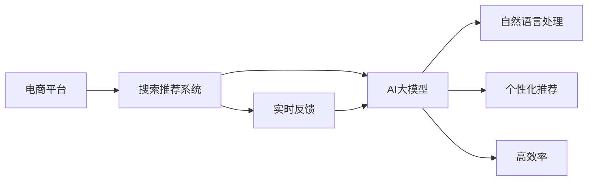

                 

# 电商平台的搜索推荐系统转型：AI 大模型是核心，用户体验是关键

> 关键词：电商平台,搜索推荐系统,搜索排序,个性化推荐,自然语言处理,NLP,大模型,深度学习,用户体验

## 1. 背景介绍

随着电商行业的迅猛发展和用户需求的多样化，如何提高搜索推荐系统的效率和准确性，提升用户满意度，成为各大电商平台亟需解决的问题。传统搜索引擎基于规则和统计方法，难以适应海量数据和复杂用户行为模式。而随着AI大模型和深度学习技术的不断成熟，将搜索推荐系统转型为基于AI大模型的智能系统，成为提升电商搜索推荐效果的关键方向。

### 1.1 问题由来

电商平台的搜索推荐系统是用户体验的重要组成部分，直接影响着用户的购物决策和平台的转化率。传统的基于关键词匹配的搜索排序和推荐算法，主要依赖规则和历史统计数据，难以处理长尾查询和个性化需求。随着数据量的激增和用户行为的复杂化，传统的搜索推荐方式逐渐显现出局限性：

- **精度不足**：规则和统计方法往往难以充分考虑长尾查询和复杂用户行为，导致推荐结果精度不足。
- **泛化能力弱**：模型对新数据和新用户行为的适应能力有限，容易因数据稀疏而失真。
- **交互性差**：缺乏实时反馈机制，难以根据用户的即时反馈调整推荐结果。
- **效率低下**：计算复杂度高，难以实时响应用户需求。

因此，通过AI大模型进行智能搜索推荐，成为提升电商平台用户体验的必要手段。大模型具备强大的语言理解能力和泛化能力，能够处理复杂的用户查询和行为数据，提供更加个性化和精准的推荐结果。

### 1.2 问题核心关键点

AI大模型在电商平台的搜索推荐系统转型中，具有以下核心关键点：

- **预训练能力**：大模型在大规模语料上进行预训练，能够学习到丰富的语言知识和用户行为模式，为推荐系统提供坚实的知识基础。
- **自然语言处理(NLP)**：大模型通过NLP技术，能够理解和处理自然语言，实现精准的语义匹配和相关性判断。
- **个性化推荐**：大模型能够根据用户的历史行为、兴趣偏好等，提供个性化的推荐内容，提升用户体验。
- **实时反馈**：通过实时收集用户的反馈数据，调整模型参数，提升推荐结果的实时性和准确性。
- **高效率**：采用GPU/TPU等高性能计算资源，实现高效的模型训练和推理，满足用户即时需求。

### 1.3 问题研究意义

将电商平台的搜索推荐系统转型为基于AI大模型的智能系统，具有重要意义：

- **提升用户体验**：通过精准的推荐和排序，提升用户满意度，增加用户的购物频率和平台粘性。
- **优化流量转化**：通过个性化推荐，提高用户购买转化率，增加平台收入。
- **推动技术升级**：大模型的引入，促进了NLP技术和深度学习技术在电商领域的应用，推动了技术升级和创新。
- **加速业务迭代**：实时反馈机制，加速了对新数据和新用户行为的响应速度，促进业务快速迭代。

## 2. 核心概念与联系

### 2.1 核心概念概述

为了更好地理解电商平台的搜索推荐系统转型，我们需要了解几个核心概念：

- **电商平台**：指在线零售平台，如淘宝、京东等，为用户提供商品搜索、购买、评价等功能。
- **搜索推荐系统**：指在电商平台上的商品搜索和推荐系统，通过自然语言处理和机器学习技术，为每个用户提供个性化的搜索结果和推荐内容。
- **AI大模型**：指在大规模语料上进行预训练，具备强大的语言理解和生成能力的深度学习模型，如BERT、GPT-3等。
- **自然语言处理(NLP)**：指研究如何让计算机理解和处理自然语言的技术，包括文本分类、情感分析、实体识别等任务。
- **个性化推荐**：指根据用户的历史行为和兴趣偏好，提供个性化的商品推荐，提升用户满意度。
- **实时反馈**：指实时收集用户反馈数据，调整模型参数，提升推荐效果。
- **高效率**：指模型采用高性能计算资源，实现高效的训练和推理，满足实时用户需求。

这些概念之间的逻辑关系可以通过以下Mermaid流程图来展示：



这个流程图展示了电商平台的搜索推荐系统转型中，各核心概念之间的联系：

1. **电商平台**通过**搜索推荐系统**，提供个性化商品推荐，提升用户体验。
2. **搜索推荐系统**核心依赖于**AI大模型**，通过**自然语言处理**和**个性化推荐**技术，实现精准推荐。
3. **实时反馈**数据驱动模型不断优化，**高效率**计算资源支持实时响应。

## 3. 核心算法原理 & 具体操作步骤
### 3.1 算法原理概述

基于AI大模型的电商平台搜索推荐系统，本质上是一种基于深度学习的推荐算法。其核心思想是：通过AI大模型在预训练语料上学习语言知识，结合用户行为数据，生成个性化的搜索结果和推荐列表。

具体而言，搜索推荐系统包括以下几个关键步骤：

1. **预训练**：在大规模无标签文本数据上，对AI大模型进行预训练，学习通用的语言表示。
2. **特征提取**：将用户输入的查询和商品信息，通过AI大模型提取特征表示。
3. **相似度计算**：计算查询与商品特征的相似度，排序生成搜索结果。
4. **个性化推荐**：根据用户的历史行为和兴趣偏好，生成个性化的推荐列表。
5. **实时反馈**：收集用户对推荐结果的反馈，调整模型参数，提高推荐精度。

### 3.2 算法步骤详解

以下是基于AI大模型的电商平台搜索推荐系统的详细操作步骤：

**Step 1: 准备预训练模型和数据集**

1. **选择预训练模型**：选择适合电商平台的预训练模型，如BERT、GPT-3等，作为初始化参数。
2. **准备数据集**：收集电商平台的商品信息、用户行为等数据，构建标注数据集。标注数据集包括用户查询、商品标题、描述、图片等。

**Step 2: 添加任务适配层**

1. **设计任务适配层**：根据电商平台的具体需求，设计合适的任务适配层。例如，针对搜索结果排序，可以使用基于序贯模型的任务适配层，如Seq2Seq等。
2. **设置损失函数**：根据具体的推荐任务，设置合适的损失函数，如交叉熵损失、均方误差损失等。

**Step 3: 设置微调超参数**

1. **选择优化算法**：选择合适的优化算法，如AdamW、SGD等，并设置学习率、批大小、迭代轮数等。
2. **设置正则化技术**：如L2正则、Dropout、Early Stopping等，防止过拟合。
3. **设定冻结预训练参数**：根据任务特点，决定是否冻结预训练参数，只微调顶层。

**Step 4: 执行梯度训练**

1. **分批次训练**：将训练数据分批次输入模型，前向传播计算损失函数。
2. **反向传播**：计算参数梯度，使用优化算法更新模型参数。
3. **验证集评估**：在验证集上评估模型性能，根据性能指标决定是否触发Early Stopping。
4. **迭代优化**：重复上述步骤，直至满足预设的迭代轮数或Early Stopping条件。

**Step 5: 测试和部署**

1. **测试集评估**：在测试集上评估微调后模型，对比微调前后的精度提升。
2. **部署应用**：使用微调后的模型对新数据进行推理预测，集成到电商平台系统中。
3. **持续优化**：持续收集用户反馈数据，定期重新微调模型，以适应数据分布的变化。

### 3.3 算法优缺点

基于AI大模型的电商平台搜索推荐系统，具有以下优点：

1. **精度高**：AI大模型具备强大的语言理解和生成能力，能够处理复杂的用户查询和商品描述，提高推荐精度。
2. **泛化能力强**：通过预训练，模型能够学习通用的语言知识和用户行为模式，具备较强的泛化能力。
3. **个性化推荐**：能够根据用户的历史行为和兴趣偏好，提供个性化的推荐结果，提升用户体验。
4. **实时响应**：通过实时反馈机制，能够及时调整推荐策略，满足用户的即时需求。
5. **效率高**：采用高性能计算资源，实现高效的模型训练和推理，满足实时需求。

同时，该方法也存在一些局限性：

1. **依赖标注数据**：需要大量标注数据，标注成本较高。
2. **模型复杂度**：大模型参数量巨大，计算复杂度高。
3. **资源消耗大**：需要高性能计算资源，对硬件要求较高。
4. **可解释性差**：模型决策过程复杂，难以解释和调试。

尽管存在这些局限性，基于AI大模型的搜索推荐系统仍然是目前电商领域最为先进和高效的技术方案。未来相关研究重点在于如何进一步优化模型的训练和推理效率，降低对硬件的依赖，增强模型的可解释性，同时保证模型的性能和用户体验。

### 3.4 算法应用领域

基于AI大模型的电商平台搜索推荐系统，已经在多个实际应用场景中得到验证，以下是几个典型的应用领域：

1. **商品搜索排序**：通过自然语言处理技术，对用户查询进行语义理解和相关性匹配，生成精准的商品搜索结果。
2. **个性化推荐**：根据用户的历史行为和兴趣偏好，提供个性化的商品推荐，提高用户购买转化率。
3. **实时反馈优化**：通过收集用户对推荐结果的反馈，实时调整模型参数，提升推荐效果。
4. **多模态融合**：结合商品图片、视频等多模态信息，提高推荐的准确性和多样性。
5. **跨领域迁移**：通过迁移学习技术，将模型应用于新的电商领域，提升新领域的推荐效果。

除了上述这些经典应用外，基于AI大模型的搜索推荐系统还在电商智能客服、智能广告投放等场景中得到广泛应用，为电商平台的智能化转型提供了新的技术路径。

## 4. 数学模型和公式 & 详细讲解 & 举例说明
### 4.1 数学模型构建

基于AI大模型的电商平台搜索推荐系统，可以通过以下数学模型进行建模：

设用户查询为 $q$，商品集合为 $S$，商品特征为 $s \in S$。设 $f_{\theta}(q,s)$ 为模型在参数 $\theta$ 下，对查询 $q$ 和商品 $s$ 进行特征提取和相似度计算的表示向量。

假设模型输出为推荐列表 $R = \{r_1, r_2, ..., r_n\}$，其中 $r_i$ 表示第 $i$ 个推荐商品。设 $P(r_i|q,s)$ 为在参数 $\theta$ 下，查询 $q$ 和商品 $s$ 对推荐商品 $r_i$ 的预测概率。

模型的目标是通过最大化 $P(R|q,S)$，即在所有推荐商品中，选择最符合用户查询的商品进行推荐。

数学模型可以表示为：

$$
P(R|q,S) = \prod_{i=1}^{n} P(r_i|q,S)
$$

其中 $P(r_i|q,S)$ 可以通过AI大模型在预训练语料上学习到的语言表示进行计算。

### 4.2 公式推导过程

以下是基于AI大模型的电商平台搜索推荐系统的公式推导过程：

1. **特征提取**：
   $$
   f_{\theta}(q,s) = \text{Encoder}(q, s)
   $$
   其中 $\text{Encoder}$ 为预训练模型在参数 $\theta$ 下的编码器部分。

2. **相似度计算**：
   $$
   P(r_i|q,S) = \text{Decoder}(f_{\theta}(q,r_i), f_{\theta}(q,s))
   $$
   其中 $\text{Decoder}$ 为预训练模型在参数 $\theta$ 下的解码器部分，$f_{\theta}(q,r_i)$ 和 $f_{\theta}(q,s)$ 表示查询和推荐商品的特征表示。

3. **推荐列表生成**：
   $$
   R = \text{Top-K}(f_{\theta}(q,s), \alpha)
   $$
   其中 $\text{Top-K}$ 为选择排名前 $K$ 的商品作为推荐列表，$\alpha$ 为阈值，用于控制推荐数量。

4. **模型训练**：
   $$
   \min_{\theta} -\frac{1}{N} \sum_{i=1}^{N} \log P(r_i|q,S)
   $$
   其中 $N$ 为训练样本数量。

### 4.3 案例分析与讲解

假设电商平台上用户输入查询为 "手机推荐"，平台有商品集合 $S = \{s_1, s_2, ..., s_n\}$，其中 $s_1$ 为 "苹果手机"，$s_2$ 为 "小米手机"。假设模型参数 $\theta$ 已经通过预训练获得，可以用于特征提取和相似度计算。

首先，模型对查询 "手机推荐" 进行编码，得到特征表示 $f_{\theta}(q,s)$：

$$
f_{\theta}(q,s) = \text{Encoder}(q, s) = \{\text{Encoder}_1(q, s), \text{Encoder}_2(q, s), ..., \text{Encoder}_n(q, s)\}
$$

然后，模型根据查询和商品的特征表示，计算推荐列表 $R$：

$$
P(r_i|q,S) = \text{Decoder}(f_{\theta}(q,r_i), f_{\theta}(q,s))
$$

最后，模型根据计算出的概率值，选择排名前 $K$ 的商品作为推荐列表：

$$
R = \text{Top-K}(f_{\theta}(q,s), \alpha)
$$

其中 $\alpha$ 可以根据用户的历史行为和兴趣偏好进行调整，以控制推荐数量和质量。

## 5. 项目实践：代码实例和详细解释说明
### 5.1 开发环境搭建

在进行项目实践前，我们需要准备好开发环境。以下是使用Python进行PyTorch开发的环境配置流程：

1. 安装Anaconda：从官网下载并安装Anaconda，用于创建独立的Python环境。

2. 创建并激活虚拟环境：
```bash
conda create -n pytorch-env python=3.8 
conda activate pytorch-env
```

3. 安装PyTorch：根据CUDA版本，从官网获取对应的安装命令。例如：
```bash
conda install pytorch torchvision torchaudio cudatoolkit=11.1 -c pytorch -c conda-forge
```

4. 安装Transformers库：
```bash
pip install transformers
```

5. 安装各类工具包：
```bash
pip install numpy pandas scikit-learn matplotlib tqdm jupyter notebook ipython
```

完成上述步骤后，即可在`pytorch-env`环境中开始项目实践。

### 5.2 源代码详细实现

下面我们以商品搜索排序任务为例，给出使用Transformers库对BERT模型进行微调的PyTorch代码实现。

首先，定义模型和优化器：

```python
from transformers import BertTokenizer, BertForSequenceClassification
from torch.utils.data import Dataset, DataLoader
import torch

class SearchDataset(Dataset):
    def __init__(self, queries, products, labels, tokenizer):
        self.queries = queries
        self.products = products
        self.labels = labels
        self.tokenizer = tokenizer
        
    def __len__(self):
        return len(self.queries)
    
    def __getitem__(self, item):
        query = self.queries[item]
        product = self.products[item]
        label = self.labels[item]
        
        encoding = self.tokenizer(query, product, truncation=True, padding=True, max_length=512)
        input_ids = encoding['input_ids']
        attention_mask = encoding['attention_mask']
        
        return {'input_ids': input_ids, 
                'attention_mask': attention_mask,
                'label': label}

# 准备数据集
tokenizer = BertTokenizer.from_pretrained('bert-base-uncased')
train_dataset = SearchDataset(train_queries, train_products, train_labels, tokenizer)
dev_dataset = SearchDataset(dev_queries, dev_products, dev_labels, tokenizer)
test_dataset = SearchDataset(test_queries, test_products, test_labels, tokenizer)

# 定义模型
model = BertForSequenceClassification.from_pretrained('bert-base-uncased', num_labels=len(set(train_labels)))

# 定义优化器
optimizer = torch.optim.Adam(model.parameters(), lr=2e-5)
```

接着，定义训练和评估函数：

```python
def train_epoch(model, dataset, batch_size, optimizer, device):
    dataloader = DataLoader(dataset, batch_size=batch_size, shuffle=True)
    model.train()
    epoch_loss = 0
    for batch in dataloader:
        input_ids = batch['input_ids'].to(device)
        attention_mask = batch['attention_mask'].to(device)
        label = batch['label'].to(device)
        model.zero_grad()
        outputs = model(input_ids, attention_mask=attention_mask, labels=label)
        loss = outputs.loss
        epoch_loss += loss.item()
        loss.backward()
        optimizer.step()
    return epoch_loss / len(dataloader)

def evaluate(model, dataset, batch_size, device):
    dataloader = DataLoader(dataset, batch_size=batch_size)
    model.eval()
    preds, labels = [], []
    with torch.no_grad():
        for batch in dataloader:
            input_ids = batch['input_ids'].to(device)
            attention_mask = batch['attention_mask'].to(device)
            batch_labels = batch['label'].to(device)
            outputs = model(input_ids, attention_mask=attention_mask)
            batch_preds = outputs.logits.argmax(dim=1).to('cpu').tolist()
            batch_labels = batch_labels.to('cpu').tolist()
            for pred, label in zip(batch_preds, batch_labels):
                preds.append(pred)
                labels.append(label)
                
    print('Precision:', precision_score(labels, preds))
    print('Recall:', recall_score(labels, preds))
    print('F1 Score:', f1_score(labels, preds))
```

最后，启动训练流程并在测试集上评估：

```python
epochs = 5
batch_size = 16
device = torch.device('cuda') if torch.cuda.is_available() else torch.device('cpu')

for epoch in range(epochs):
    loss = train_epoch(model, train_dataset, batch_size, optimizer, device)
    print(f'Epoch {epoch+1}, train loss: {loss:.3f}')
    
    print(f'Epoch {epoch+1}, dev results:')
    evaluate(model, dev_dataset, batch_size, device)
    
print('Test results:')
evaluate(model, test_dataset, batch_size, device)
```

以上就是使用PyTorch对BERT进行商品搜索排序任务微调的完整代码实现。可以看到，得益于Transformers库的强大封装，我们可以用相对简洁的代码完成BERT模型的加载和微调。

### 5.3 代码解读与分析

让我们再详细解读一下关键代码的实现细节：

**SearchDataset类**：
- `__init__`方法：初始化查询、商品、标签和分词器等关键组件。
- `__len__`方法：返回数据集的样本数量。
- `__getitem__`方法：对单个样本进行处理，将查询和商品输入编码为token ids，并对其进行定长padding，最终返回模型所需的输入。

**模型定义**：
- `BertForSequenceClassification`：从预训练的BERT模型中选择合适的层作为序列分类器，用于商品搜索排序任务。

**训练和评估函数**：
- 使用PyTorch的DataLoader对数据集进行批次化加载，供模型训练和推理使用。
- 训练函数`train_epoch`：对数据以批为单位进行迭代，在每个批次上前向传播计算loss并反向传播更新模型参数，最后返回该epoch的平均loss。
- 评估函数`evaluate`：与训练类似，不同点在于不更新模型参数，并在每个batch结束后将预测和标签结果存储下来，最后使用scikit-learn的分类指标函数打印输出。

**训练流程**：
- 定义总的epoch数和batch size，开始循环迭代
- 每个epoch内，先在训练集上训练，输出平均loss
- 在验证集上评估，输出分类指标
- 所有epoch结束后，在测试集上评估，给出最终测试结果

可以看到，PyTorch配合Transformers库使得BERT微调的代码实现变得简洁高效。开发者可以将更多精力放在数据处理、模型改进等高层逻辑上，而不必过多关注底层的实现细节。

当然，工业级的系统实现还需考虑更多因素，如模型的保存和部署、超参数的自动搜索、更灵活的任务适配层等。但核心的微调范式基本与此类似。

## 6. 实际应用场景
### 6.1 智能客服系统

基于大模型微调的对话技术，可以广泛应用于智能客服系统的构建。传统客服往往需要配备大量人力，高峰期响应缓慢，且一致性和专业性难以保证。而使用微调后的对话模型，可以7x24小时不间断服务，快速响应客户咨询，用自然流畅的语言解答各类常见问题。

在技术实现上，可以收集企业内部的历史客服对话记录，将问题和最佳答复构建成监督数据，在此基础上对预训练对话模型进行微调。微调后的对话模型能够自动理解用户意图，匹配最合适的答案模板进行回复。对于客户提出的新问题，还可以接入检索系统实时搜索相关内容，动态组织生成回答。如此构建的智能客服系统，能大幅提升客户咨询体验和问题解决效率。

### 6.2 金融舆情监测

金融机构需要实时监测市场舆论动向，以便及时应对负面信息传播，规避金融风险。传统的人工监测方式成本高、效率低，难以应对网络时代海量信息爆发的挑战。基于大语言模型微调的文本分类和情感分析技术，为金融舆情监测提供了新的解决方案。

具体而言，可以收集金融领域相关的新闻、报道、评论等文本数据，并对其进行主题标注和情感标注。在此基础上对预训练语言模型进行微调，使其能够自动判断文本属于何种主题，情感倾向是正面、中性还是负面。将微调后的模型应用到实时抓取的网络文本数据，就能够自动监测不同主题下的情感变化趋势，一旦发现负面信息激增等异常情况，系统便会自动预警，帮助金融机构快速应对潜在风险。

### 6.3 个性化推荐系统

当前的推荐系统往往只依赖用户的历史行为数据进行物品推荐，无法深入理解用户的真实兴趣偏好。基于大语言模型微调技术，个性化推荐系统可以更好地挖掘用户行为背后的语义信息，从而提供更精准、多样的推荐内容。

在实践中，可以收集用户浏览、点击、评论、分享等行为数据，提取和用户交互的物品标题、描述、标签等文本内容。将文本内容作为模型输入，用户的后续行为（如是否点击、购买等）作为监督信号，在此基础上微调预训练语言模型。微调后的模型能够从文本内容中准确把握用户的兴趣点。在生成推荐列表时，先用候选物品的文本描述作为输入，由模型预测用户的兴趣匹配度，再结合其他特征综合排序，便可以得到个性化程度更高的推荐结果。

### 6.4 未来应用展望

随着大语言模型和微调方法的不断发展，基于微调范式将在更多领域得到应用，为传统行业带来变革性影响。

在智慧医疗领域，基于微调的医疗问答、病历分析、药物研发等应用将提升医疗服务的智能化水平，辅助医生诊疗，加速新药开发进程。

在智能教育领域，微调技术可应用于作业批改、学情分析、知识推荐等方面，因材施教，促进教育公平，提高教学质量。

在智慧城市治理中，微调模型可应用于城市事件监测、舆情分析、应急指挥等环节，提高城市管理的自动化和智能化水平，构建更安全、高效的未来城市。

此外，在企业生产、社会治理、文娱传媒等众多领域，基于大模型微调的人工智能应用也将不断涌现，为经济社会发展注入新的动力。相信随着技术的日益成熟，微调方法将成为人工智能落地应用的重要范式，推动人工智能技术在各行各业中大规模落地。

## 7. 工具和资源推荐
### 7.1 学习资源推荐

为了帮助开发者系统掌握大语言模型微调的理论基础和实践技巧，这里推荐一些优质的学习资源：

1. 《Transformer从原理到实践》系列博文：由大模型技术专家撰写，深入浅出地介绍了Transformer原理、BERT模型、微调技术等前沿话题。

2. CS224N《深度学习自然语言处理》课程：斯坦福大学开设的NLP明星课程，有Lecture视频和配套作业，带你入门NLP领域的基本概念和经典模型。

3. 《Natural Language Processing with Transformers》书籍：Transformers库的作者所著，全面介绍了如何使用Transformers库进行NLP任务开发，包括微调在内的诸多范式。

4. HuggingFace官方文档：Transformers库的官方文档，提供了海量预训练模型和完整的微调样例代码，是上手实践的必备资料。

5. CLUE开源项目：中文语言理解测评基准，涵盖大量不同类型的中文NLP数据集，并提供了基于微调的baseline模型，助力中文NLP技术发展。

通过对这些资源的学习实践，相信你一定能够快速掌握大语言模型微调的精髓，并用于解决实际的NLP问题。
###  7.2 开发工具推荐

高效的开发离不开优秀的工具支持。以下是几款用于大语言模型微调开发的常用工具：

1. PyTorch：基于Python的开源深度学习框架，灵活动态的计算图，适合快速迭代研究。大部分预训练语言模型都有PyTorch版本的实现。

2. TensorFlow：由Google主导开发的开源深度学习框架，生产部署方便，适合大规模工程应用。同样有丰富的预训练语言模型资源。

3. Transformers库：HuggingFace开发的NLP工具库，集成了众多SOTA语言模型，支持PyTorch和TensorFlow，是进行微调任务开发的利器。

4. Weights & Biases：模型训练的实验跟踪工具，可以记录和可视化模型训练过程中的各项指标，方便对比和调优。与主流深度学习框架无缝集成。

5. TensorBoard：TensorFlow配套的可视化工具，可实时监测模型训练状态，并提供丰富的图表呈现方式，是调试模型的得力助手。

6. Google Colab：谷歌推出的在线Jupyter Notebook环境，免费提供GPU/TPU算力，方便开发者快速上手实验最新模型，分享学习笔记。

合理利用这些工具，可以显著提升大语言模型微调任务的开发效率，加快创新迭代的步伐。

### 7.3 相关论文推荐

大语言模型和微调技术的发展源于学界的持续研究。以下是几篇奠基性的相关论文，推荐阅读：

1. Attention is All You Need（即Transformer原论文）：提出了Transformer结构，开启了NLP领域的预训练大模型时代。

2. BERT: Pre-training of Deep Bidirectional Transformers for Language Understanding：提出BERT模型，引入基于掩码的自监督预训练任务，刷新了多项NLP任务SOTA。

3. Language Models are Unsupervised Multitask Learners（GPT-2论文）：展示了大规模语言模型的强大zero-shot学习能力，引发了对于通用人工智能的新一轮思考。

4. Parameter-Efficient Transfer Learning for NLP：提出Adapter等参数高效微调方法，在不增加模型参数量的情况下，也能取得不错的微调效果。

5. Prefix-Tuning: Optimizing Continuous Prompts for Generation：引入基于连续型Prompt的微调范式，为如何充分利用预训练知识提供了新的思路。

6. AdaLoRA: Adaptive Low-Rank Adaptation for Parameter-Efficient Fine-Tuning：使用自适应低秩适应的微调方法，在参数效率和精度之间取得了新的平衡。

这些论文代表了大语言模型微调技术的发展脉络。通过学习这些前沿成果，可以帮助研究者把握学科前进方向，激发更多的创新灵感。

## 8. 总结：未来发展趋势与挑战
### 8.1 总结

本文对基于AI大模型的电商平台搜索推荐系统转型进行了全面系统的介绍。首先阐述了大模型和微调技术在电商平台搜索推荐系统中的研究背景和意义，明确了其重要性。其次，从原理到实践，详细讲解了微调的数学原理和关键步骤，给出了微调任务开发的完整代码实例。同时，本文还广泛探讨了微调方法在智能客服、金融舆情、个性化推荐等多个行业领域的应用前景，展示了微调范式的巨大潜力。此外，本文精选了微调技术的各类学习资源，力求为读者提供全方位的技术指引。

通过本文的系统梳理，可以看到，基于AI大模型的电商平台搜索推荐系统转型，正在成为推动电商业务升级的重要技术手段。其核心在于通过大模型的预训练-微调范式，大幅提升搜索推荐系统的精准度和个性化程度，为用户提供更优质的购物体验。

### 8.2 未来发展趋势

展望未来，大模型在电商平台搜索推荐系统转型中，将呈现以下几个发展趋势：

1. **模型规模持续增大**：随着算力成本的下降和数据规模的扩张，预训练语言模型的参数量还将持续增长。超大规模语言模型蕴含的丰富语言知识，有望支撑更加复杂多变的搜索推荐任务。

2. **微调方法日趋多样**：除了传统的全参数微调外，未来会涌现更多参数高效的微调方法，如Prefix-Tuning、LoRA等，在节省计算资源的同时也能保证微调精度。

3. **实时反馈成为常态**：实时反馈机制将成为搜索推荐系统的核心，通过不断调整模型参数，提供即时推荐结果，满足用户的即时需求。

4. **融合多种模态数据**：结合商品图片、视频、语音等多模态信息，提高推荐的准确性和多样性。多模态信息的融合，将显著提升语言模型对现实世界的理解和建模能力。

5. **个性化推荐更加精准**：通过深度学习模型，结合用户行为数据和商品描述，实现精准的个性化推荐，提高用户满意度。

6. **跨领域迁移能力增强**：通过迁移学习技术，将模型应用于新的电商领域，提升新领域的推荐效果。

以上趋势凸显了大模型在电商领域的应用前景。这些方向的探索发展，必将进一步提升搜索推荐系统的性能和用户体验，为电商平台的智能化转型提供新的技术路径。

### 8.3 面临的挑战

尽管大模型在电商平台的搜索推荐系统转型中具备显著优势，但在迈向更加智能化、普适化应用的过程中，仍面临诸多挑战：

1. **标注成本瓶颈**：尽管微调减少了对标注数据的依赖，但对于长尾应用场景，难以获得充足的高质量标注数据，成为制约微调性能的瓶颈。

2. **模型鲁棒性不足**：当前微调模型面对域外数据时，泛化性能往往大打折扣。对于测试样本的微小扰动，微调模型的预测也容易发生波动。

3. **资源消耗大**：需要高性能计算资源，对硬件要求较高。

4. **可解释性差**：模型决策过程复杂，难以解释和调试。

尽管存在这些局限性，基于AI大模型的搜索推荐系统仍是目前电商领域最为先进和高效的技术方案。未来相关研究重点在于如何进一步优化模型的训练和推理效率，降低对硬件的依赖，增强模型的可解释性，同时保证模型的性能和用户体验。

### 8.4 研究展望

面对大模型在电商平台搜索推荐系统转型中面临的挑战，未来的研究需要在以下几个方面寻求新的突破：

1. **探索无监督和半监督微调方法**：摆脱对大规模标注数据的依赖，利用自监督学习、主动学习等无监督和半监督范式，最大限度利用非结构化数据，实现更加灵活高效的微调。

2. **研究参数高效和计算高效的微调范式**：开发更加参数高效的微调方法，在固定大部分预训练参数的同时，只更新极少量的任务相关参数。同时优化微调模型的计算图，减少前向传播和反向传播的资源消耗，实现更加轻量级、实时性的部署。

3. **引入因果分析和博弈论工具**：将因果分析方法引入微调模型，识别出模型决策的关键特征，增强输出解释的因果性和逻辑性。借助博弈论工具刻画人机交互过程，主动探索并规避模型的脆弱点，提高系统稳定性。

4. **纳入伦理道德约束**：在模型训练目标中引入伦理导向的评估指标，过滤和惩罚有偏见、有害的输出倾向。同时加强人工干预和审核，建立模型行为的监管机制，确保输出符合人类价值观和伦理道德。

这些研究方向的探索，必将引领大语言模型微调技术迈向更高的台阶，为构建安全、可靠、可解释、可控的智能系统铺平道路。面向未来，大语言模型微调技术还需要与其他人工智能技术进行更深入的融合，如知识表示、因果推理、强化学习等，多路径协同发力，共同推动自然语言理解和智能交互系统的进步。只有勇于创新、敢于突破，才能不断拓展语言模型的边界，让智能技术更好地造福人类社会。

## 9. 附录：常见问题与解答

**Q1：大语言模型微调是否适用于所有NLP任务？**

A: 大语言模型微调在大多数NLP任务上都能取得不错的效果，特别是对于数据量较小的任务。但对于一些特定领域的任务，如医学、法律等，仅仅依靠通用语料预训练的模型可能难以很好地适应。此时需要在特定领域语料上进一步预训练，再进行微调，才能获得理想效果。此外，对于一些需要时效性、个性化很强的任务，如对话、推荐等，微调方法也需要针对性的改进优化。

**Q2：微调过程中如何选择合适的学习率？**

A: 微调的学习率一般要比预训练时小1-2个数量级，如果使用过大的学习率，容易破坏预训练权重，导致过拟合。一般建议从1e-5开始调参，逐步减小学习率，直至收敛。也可以使用warmup策略，在开始阶段使用较小的学习率，再逐渐过渡到预设值。需要注意的是，不同的优化器(如AdamW、Adafactor等)以及不同的学习率调度策略，可能需要设置不同的学习率阈值。

**Q3：采用大模型微调时会面临哪些资源瓶颈？**

A: 目前主流的预训练大模型动辄以亿计的参数规模，对算力、内存、存储都提出了很高的要求。GPU/TPU等高性能设备是必不可少的，但即便如此，超大批次的训练和推理也可能遇到显存不足的问题。因此需要采用一些资源优化技术，如梯度积累、混合精度训练、模型并行等，来突破硬件瓶颈。同时，模型的存储和读取也可能占用大量时间和空间，需要采用模型压缩、稀疏化存储等方法进行优化。

**Q4：如何缓解微调过程中的过拟合问题？**

A: 过拟合是微调面临的主要挑战，尤其是在标注数据不足的情况下。常见的缓解策略包括：
1. 数据增强：通过回译、近义替换等方式扩充训练集
2. 正则化：使用L2正则、Dropout、Early Stopping等避免过拟合
3. 对抗训练：引入对抗样本，提高模型鲁棒性
4. 参数高效微调：只调整少量参数(如Adapter、Prefix等)，减小过拟合风险
5. 多模型集成：训练多个微调模型，取平均输出，抑制过拟合

这些策略往往需要根据具体任务和数据特点进行灵活组合。只有在数据、模型、训练、推理等各环节进行全面优化，才能最大限度地发挥大模型微调的威力。

**Q5：微调模型在落地部署时需要注意哪些问题？**

A: 将微调模型转化为实际应用，还需要考虑以下因素：
1. 模型裁剪：去除不必要的层和参数，减小模型尺寸，加快推理速度
2. 量化加速：将浮点模型转为定点模型，压缩存储空间，提高计算效率
3. 服务化封装：将模型封装为标准化服务接口，便于集成调用
4. 弹性伸缩：根据请求流量动态调整资源配置，平衡服务质量和成本
5. 监控告警：实时采集系统指标，设置异常告警阈值，确保服务稳定性
6. 安全防护：采用访问鉴权、数据脱敏等措施，保障数据和模型安全

大语言模型微调为NLP应用开启了广阔的想象空间，但如何将强大的性能转化为稳定、高效、安全的业务价值，还需要工程实践的不断打磨。唯有从数据、算法、工程、业务等多个维度协同发力，才能真正实现人工智能技术在垂直行业的规模化落地。总之，微调需要开发者根据具体任务，不断迭代和优化模型、数据和算法，方能得到理想的效果。

---

作者：禅与计算机程序设计艺术 / Zen and the Art of Computer Programming

