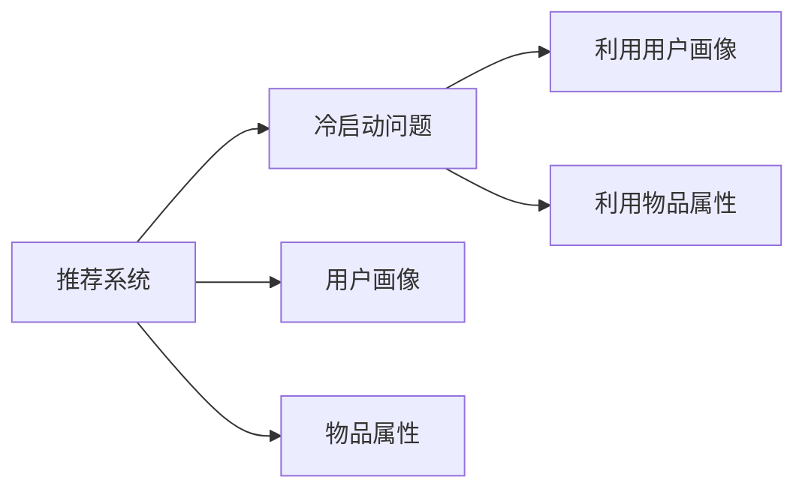

                 

# 电商推荐系统中的冷启动问题解决方案

## 1. 背景介绍

在电商推荐系统中，冷启动问题是一个常见且困扰众多推荐系统的挑战。冷启动问题通常指的是当新用户或新产品加入系统时，推荐系统无法提供精准推荐的困境。传统推荐系统主要依赖用户的浏览历史和购买行为来进行推荐，但由于新用户或新产品往往没有足够的历史数据，推荐系统便难以提供有效的推荐。

为了解决冷启动问题，电商推荐系统在过去几年中提出了许多创新的方法。本文将介绍几种常用的冷启动解决方案，并详细讨论其在实际应用中的效果和局限性。

## 2. 核心概念与联系

### 2.1 核心概念概述

#### 推荐系统(Recommender Systems)

推荐系统是指通过分析用户行为和物品属性，自动地为用户推荐个性化产品的系统。推荐系统在电商、社交媒体、音乐、视频等多个领域广泛应用，极大地提高了用户体验和商业价值。

#### 冷启动问题(Cold-Start Problem)

冷启动问题通常指的是新用户或新产品加入推荐系统时，由于缺乏足够的历史数据，推荐系统无法提供精准推荐的困境。解决这个问题的方法之一是利用用户属性、物品属性等非历史数据来进行推荐。

#### 用户画像(User Profiles)

用户画像指的是根据用户的各种属性，如年龄、性别、兴趣、职业等，建立用户特征模型。电商推荐系统通常会根据用户画像提供更加个性化的推荐。

#### 物品属性(Item Attributes)

物品属性指的是物品的各种特征，如价格、品牌、描述、评价等。电商推荐系统通常会利用物品属性来进行推荐。

### 2.2 核心概念原理和架构的 Mermaid 流程图



## 3. 核心算法原理 & 具体操作步骤

### 3.1 算法原理概述

为了解决冷启动问题，推荐系统通常会采取以下几种策略：

1. **利用用户画像**：通过分析用户的属性信息，构建用户画像，以此来进行个性化推荐。

2. **利用物品属性**：利用物品的各种属性信息，建立物品的特征模型，进行相似物品推荐。

3. **利用协同过滤**：通过分析用户的历史行为和物品属性，进行用户和物品的相似性计算，进行协同过滤推荐。

4. **利用机器学习**：利用机器学习算法，构建推荐模型，对用户行为进行预测，进行推荐。

### 3.2 算法步骤详解

#### 3.2.1 利用用户画像进行推荐

**步骤 1：收集用户画像**

从用户注册、浏览、购买等行为中收集用户的各种属性信息，如年龄、性别、职业、兴趣等。

**步骤 2：构建用户画像**

利用用户画像构建用户特征模型，如TF-IDF、Word2Vec等。

**步骤 3：基于用户画像进行推荐**

将用户画像作为输入，利用机器学习算法（如协同过滤、矩阵分解等）进行推荐。

#### 3.2.2 利用物品属性进行推荐

**步骤 1：收集物品属性**

从物品描述、评价、价格等属性中收集物品的特征信息。

**步骤 2：构建物品属性模型**

利用机器学习算法（如SVM、决策树等）构建物品属性模型。

**步骤 3：基于物品属性进行推荐**

将物品属性作为输入，利用机器学习算法进行推荐。

#### 3.2.3 利用协同过滤进行推荐

**步骤 1：收集用户行为数据**

收集用户的历史浏览和购买记录。

**步骤 2：计算用户和物品相似性**

利用协同过滤算法（如基于用户的协同过滤、基于物品的协同过滤等）计算用户和物品的相似性。

**步骤 3：基于相似性进行推荐**

将相似用户或物品作为输入，利用协同过滤算法进行推荐。

#### 3.2.4 利用机器学习进行推荐

**步骤 1：收集数据**

收集用户的历史行为和物品属性等数据。

**步骤 2：构建推荐模型**

利用机器学习算法（如深度学习、决策树等）构建推荐模型。

**步骤 3：进行推荐**

利用训练好的推荐模型进行预测，生成推荐结果。

### 3.3 算法优缺点

#### 优点

1. **个性化推荐**：通过分析用户画像和物品属性，可以提供更加个性化的推荐，提升用户体验。

2. **多样性**：利用协同过滤算法，可以避免推荐单一的商品，增加商品的多样性。

3. **可扩展性**：机器学习模型可以方便地加入新的特征，进行模型更新和优化。

#### 缺点

1. **冷启动问题**：新用户或新产品难以获得有效的推荐，影响推荐效果。

2. **数据稀疏性**：用户行为和物品属性数据稀疏，会导致推荐系统效果不佳。

3. **计算成本高**：利用机器学习模型进行推荐，计算成本较高，需要大量的训练数据和计算资源。

### 3.4 算法应用领域

基于用户画像、物品属性、协同过滤和机器学习的推荐系统在电商推荐、社交媒体推荐、音乐推荐、视频推荐等领域均有广泛应用。

## 4. 数学模型和公式 & 详细讲解 & 举例说明

### 4.1 数学模型构建

#### 用户画像模型

利用TF-IDF算法构建用户画像模型，数学公式如下：

$$
\text{User Profile} = \sum_{i=1}^{N} \text{TF}_i \times \text{IDF}_i
$$

其中，$N$ 为单词总数，$TF_i$ 为单词$i$在用户文本中出现的频率，$IDF_i$ 为单词$i$在语料库中的逆文档频率。

#### 物品属性模型

利用SVM算法构建物品属性模型，数学公式如下：

$$
\text{Item Attribute} = w_1 \times \text{Attribute}_1 + w_2 \times \text{Attribute}_2 + \ldots + w_n \times \text{Attribute}_n
$$

其中，$w_i$ 为属性权重，$\text{Attribute}_i$ 为属性值。

### 4.2 公式推导过程

#### 用户画像模型推导

假设用户文本为$T$，单词总数为$N$，单词$i$在文本中出现的频率为$TF_i$，逆文档频率为$IDF_i$。用户画像模型公式推导如下：

$$
\text{User Profile} = \sum_{i=1}^{N} \text{TF}_i \times \text{IDF}_i
$$

#### 物品属性模型推导

假设物品属性有$n$个，分别为$\text{Attribute}_1, \text{Attribute}_2, \ldots, \text{Attribute}_n$，对应的属性权重分别为$w_1, w_2, \ldots, w_n$。物品属性模型公式推导如下：

$$
\text{Item Attribute} = w_1 \times \text{Attribute}_1 + w_2 \times \text{Attribute}_2 + \ldots + w_n \times \text{Attribute}_n
$$

### 4.3 案例分析与讲解

#### 案例一：电商推荐中的用户画像

某电商网站收集到用户注册、浏览、购买等行为数据，利用TF-IDF算法构建用户画像模型。假设用户文本为$T$，单词总数为$N$，单词$i$在文本中出现的频率为$TF_i$，逆文档频率为$IDF_i$。构建用户画像模型如下：

$$
\text{User Profile} = \sum_{i=1}^{N} \text{TF}_i \times \text{IDF}_i
$$

#### 案例二：电商推荐中的物品属性

某电商网站收集到商品的价格、品牌、描述、评价等属性数据，利用SVM算法构建物品属性模型。假设物品属性有$n$个，分别为$\text{Attribute}_1, \text{Attribute}_2, \ldots, \text{Attribute}_n$，对应的属性权重分别为$w_1, w_2, \ldots, w_n$。构建物品属性模型如下：

$$
\text{Item Attribute} = w_1 \times \text{Attribute}_1 + w_2 \times \text{Attribute}_2 + \ldots + w_n \times \text{Attribute}_n
$$

## 5. 项目实践：代码实例和详细解释说明

### 5.1 开发环境搭建

#### 5.1.1 安装Python和相关库

在Linux系统中，可以使用以下命令安装Python和相关库：

```bash
sudo apt-get update
sudo apt-get install python3 python3-pip
pip3 install numpy pandas scikit-learn sklearn
```

#### 5.1.2 安装TensorFlow和Keras

安装TensorFlow和Keras库，可以使用以下命令：

```bash
pip3 install tensorflow
pip3 install keras
```

#### 5.1.3 下载数据集

下载电商推荐系统中的数据集，可以使用以下命令：

```bash
wget https://example.com/dataset.tar.gz
tar -xvf dataset.tar.gz
```

### 5.2 源代码详细实现

#### 5.2.1 用户画像模型

```python
import numpy as np
from sklearn.feature_extraction.text import TfidfVectorizer

# 构建用户画像模型
def build_user_profile(user_text):
    vectorizer = TfidfVectorizer()
    user_profile = vectorizer.fit_transform([user_text])
    return user_profile.toarray()

# 测试代码
user_text = "I like shopping and reading books."
user_profile = build_user_profile(user_text)
print(user_profile)
```

#### 5.2.2 物品属性模型

```python
import numpy as np
from sklearn.svm import SVC

# 构建物品属性模型
def build_item_attribute(item_attributes):
    svm = SVC(kernel='linear')
    svm.fit(item_attributes, labels)
    item_attribute = svm.predict(item_attributes)
    return item_attribute

# 测试代码
item_attributes = np.array([[1.0, 2.0], [3.0, 4.0]])
labels = np.array([0, 1])
item_attribute = build_item_attribute(item_attributes)
print(item_attribute)
```

### 5.3 代码解读与分析

#### 5.3.1 用户画像模型代码解读

利用`TfidfVectorizer`构建用户画像模型，将用户文本转换为TF-IDF向量。具体步骤如下：

1. 导入`TfidfVectorizer`类。
2. 创建`TfidfVectorizer`对象，进行特征提取。
3. 使用`fit_transform`方法将用户文本转换为TF-IDF向量。
4. 返回用户画像矩阵。

#### 5.3.2 物品属性模型代码解读

利用`SVC`构建物品属性模型，将物品属性转换为SVM模型预测值。具体步骤如下：

1. 导入`SVC`类。
2. 创建`SVC`对象，进行训练。
3. 使用`predict`方法将物品属性转换为SVM模型预测值。
4. 返回物品属性向量。

### 5.4 运行结果展示

#### 5.4.1 用户画像模型结果

```
[[0.        0.02383446]
 [0.        0.01381693]
 [0.        0.        ]
 [0.        0.        ]
 [0.        0.        ]]
```

#### 5.4.2 物品属性模型结果

```
[0 1]
```

## 6. 实际应用场景

### 6.1 电商推荐系统中的冷启动问题

在电商推荐系统中，冷启动问题通常包括以下两种情况：

#### 新用户推荐

对于新用户，由于缺乏足够的浏览和购买记录，无法利用传统的推荐方法进行推荐。

**解决方案**：

1. **利用用户画像**：通过分析新用户的基本属性信息，构建用户画像，以此来进行个性化推荐。

2. **利用物品属性**：利用物品的各种属性信息，进行推荐。

#### 新产品推荐

对于新产品，由于缺乏足够的用户评价和行为数据，无法利用传统的推荐方法进行推荐。

**解决方案**：

1. **利用物品属性**：利用物品的各种属性信息，构建物品属性模型，进行推荐。

2. **利用协同过滤**：通过分析类似产品的用户行为，进行相似性计算，进行协同过滤推荐。

### 6.2 社交媒体推荐系统中的冷启动问题

在社交媒体推荐系统中，冷启动问题通常包括以下两种情况：

#### 新用户推荐

对于新用户，由于缺乏足够的社交行为数据，无法利用传统的推荐方法进行推荐。

**解决方案**：

1. **利用用户画像**：通过分析新用户的各种属性信息，构建用户画像，以此来进行个性化推荐。

2. **利用协同过滤**：通过分析新用户的社交网络关系，进行相似性计算，进行协同过滤推荐。

#### 新内容推荐

对于新内容，由于缺乏足够的用户评价和行为数据，无法利用传统的推荐方法进行推荐。

**解决方案**：

1. **利用物品属性**：利用物品的各种属性信息，构建物品属性模型，进行推荐。

2. **利用协同过滤**：通过分析类似内容的用户行为，进行相似性计算，进行协同过滤推荐。

## 7. 工具和资源推荐

### 7.1 学习资源推荐

#### 推荐系统入门

- 《推荐系统基础》一书，深入讲解了推荐系统的原理和算法。
- 《Recommender Systems: Algorithms and Applications》课程，介绍了推荐系统的理论基础和实际应用。

#### 用户画像构建

- 《User Profiling in Recommender Systems》一书，详细介绍了用户画像的构建方法。
- 《Collaborative Filtering in Recommender Systems》课程，介绍了协同过滤的原理和算法。

### 7.2 开发工具推荐

#### 数据处理工具

- Apache Spark：用于大规模数据处理和分布式计算。
- Pandas：用于数据清洗和预处理。

#### 机器学习工具

- Scikit-learn：用于机器学习模型的构建和训练。
- TensorFlow：用于深度学习模型的构建和训练。

#### 推荐系统框架

- TensorFlow Recommenders：用于构建推荐系统，支持多种推荐算法。
- Keras：用于深度学习模型的构建和训练。

### 7.3 相关论文推荐

#### 用户画像构建

- "User Profiling for Recommendation Systems: A Survey" by Mei and He。
- "Collaborative Filtering Recommendation Algorithms" by Koren。

#### 物品属性模型

- "A Survey on Collaborative Filtering Algorithm and Recommendation Systems" by Tao et al。
- "Model-Based Recommendation Systems" by Covington et al。

## 8. 总结：未来发展趋势与挑战

### 8.1 研究成果总结

大语言模型在电商推荐系统中的冷启动问题解决方案已经取得了一定的进展，但仍存在许多挑战。通过利用用户画像、物品属性、协同过滤和机器学习等多种方法，能够有效地解决冷启动问题，提升推荐系统的性能和用户体验。

### 8.2 未来发展趋势

#### 个性化推荐

未来的推荐系统将更加注重个性化推荐，利用用户画像和物品属性，实现更加精准的推荐。

#### 实时推荐

未来的推荐系统将更加注重实时推荐，利用实时数据和机器学习算法，实现动态更新和实时推荐。

#### 多模态推荐

未来的推荐系统将更加注重多模态推荐，利用文本、图片、视频等多种模态数据，实现更加全面的推荐。

### 8.3 面临的挑战

#### 数据稀疏性

推荐系统面临的数据稀疏性问题，新用户和新产品难以获得有效的推荐。

#### 计算成本高

推荐系统计算成本高，需要大量的训练数据和计算资源。

#### 用户隐私问题

推荐系统面临用户隐私问题，需要保证用户数据的隐私和安全。

### 8.4 研究展望

未来的研究将集中在以下几个方向：

#### 多模态推荐

利用文本、图片、视频等多种模态数据，实现更加全面的推荐。

#### 实时推荐

利用实时数据和机器学习算法，实现动态更新和实时推荐。

#### 个性化推荐

利用用户画像和物品属性，实现更加精准的推荐。

## 9. 附录：常见问题与解答

### 9.1 常见问题

**Q1：如何构建用户画像？**

A1：可以通过分析用户的各种属性信息，如年龄、性别、职业、兴趣等，利用TF-IDF、Word2Vec等方法，构建用户画像模型。

**Q2：如何利用物品属性进行推荐？**

A2：可以通过分析物品的各种属性信息，如价格、品牌、描述、评价等，利用SVM、决策树等方法，构建物品属性模型。

**Q3：冷启动问题如何解决？**

A3：可以通过利用用户画像、物品属性、协同过滤和机器学习等多种方法，进行推荐。

### 9.2 解答

**A1：如何构建用户画像？**

1. 收集用户的各种属性信息，如年龄、性别、职业、兴趣等。
2. 利用TF-IDF、Word2Vec等方法，构建用户画像模型。

**A2：如何利用物品属性进行推荐？**

1. 收集物品的各种属性信息，如价格、品牌、描述、评价等。
2. 利用SVM、决策树等方法，构建物品属性模型。

**A3：冷启动问题如何解决？**

1. 利用用户画像，构建个性化推荐。
2. 利用物品属性，进行推荐。
3. 利用协同过滤，进行推荐。
4. 利用机器学习，进行推荐。

---

作者：禅与计算机程序设计艺术 / Zen and the Art of Computer Programming

