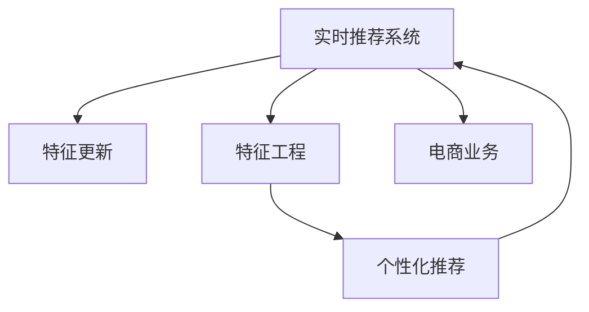

                 

# 电商推荐系统中的实时特征更新与计算

> 关键词：实时推荐, 特征更新, 特征工程, 个性化推荐, 电商业务

## 1. 背景介绍

### 1.1 问题由来

在电商领域，推荐系统已经成为了驱动用户购买决策和提高用户满意度的关键技术。传统的推荐系统主要基于用户历史行为数据（如浏览、点击、购买记录等）进行个性化推荐，但其效果往往难以应对多变的用户需求和快速变化的业务环境。如何实时获取用户反馈和市场动态，动态更新推荐模型，提升推荐效果，成为电商推荐系统面临的重要挑战。

### 1.2 问题核心关键点

1. **实时性**：电商平台的业务场景对推荐系统有极高的实时性要求。推荐系统需要在毫秒级时间尺度上对用户请求进行响应，及时更新推荐内容。
2. **特征多样性**：用户行为和商品属性信息复杂多样，如何高效处理和利用这些信息，构建高质量的特征向量，是提升推荐精度的关键。
3. **动态更新**：电商业务实时变化，如促销活动、库存变动等，推荐模型需要能动态更新，反映最新的业务状态。
4. **计算效率**：电商平台日活用户数千万级，推荐系统需要高效计算以支撑大规模并发请求。

### 1.3 问题研究意义

实时特征更新与计算技术能够有效应对电商业务的实时变化和多样性需求，提升推荐系统的实时性和个性化程度，从而提高用户满意度和业务转化率。其研究意义在于：

1. **提升用户体验**：通过实时响应用户请求，展示最相关、最热门的商品，增强用户的购物体验。
2. **提高转化率**：动态调整推荐内容，引导用户点击、购买，提高推荐效果。
3. **降低运营成本**：自动化处理实时数据，减少人工干预和运营成本。
4. **促进业务创新**：实时特征更新能力能够灵活应对新业务场景和促销活动，促进电商业务的创新和发展。

## 2. 核心概念与联系

### 2.1 核心概念概述

为更好地理解实时特征更新与计算技术，本节将介绍几个密切相关的核心概念：

- **实时推荐系统**：基于用户实时行为数据，动态生成个性化推荐结果的系统。要求系统具有高实时性和高扩展性。
- **特征更新**：根据用户行为和市场变化，动态更新推荐模型所需特征的过程。其目标是构建准确、高效的特征向量，以提升推荐效果。
- **特征工程**：设计、处理和优化数据特征的过程，是构建高质量推荐模型的基础。
- **个性化推荐**：根据用户历史行为和偏好，生成个性化推荐结果的过程。核心在于理解用户需求和提升模型准确性。
- **电商业务**：电子商务平台的具体业务场景，如商品推荐、促销活动、库存管理等。

这些概念之间的逻辑关系可以通过以下Mermaid流程图来展示：



这个流程图展示了几者之间的联系：

1. 实时推荐系统是整个推荐流程的核心，基于电商业务数据和特征更新结果生成个性化推荐。
2. 特征更新是实时推荐系统的重要支撑，通过动态更新特征向量，提升推荐效果。
3. 特征工程是特征更新的基础，设计并优化数据特征，构建高质量特征向量。
4. 个性化推荐是特征工程和实时推荐系统结合的产物，通过学习用户行为模式，生成个性化推荐结果。

## 3. 核心算法原理 & 具体操作步骤
### 3.1 算法原理概述

实时特征更新与计算的原理是：在电商推荐系统中，通过实时收集用户行为数据和市场变化信息，动态更新推荐模型所需的特征，构建新的特征向量，再将其应用于实时推荐算法中，生成新的推荐结果。

具体而言，实时推荐系统包括三个关键步骤：特征收集、特征更新和推荐生成。特征更新是实时推荐系统的核心，旨在根据最新数据和业务状态，动态更新推荐特征。

### 3.2 算法步骤详解

**Step 1: 数据收集与预处理**

- **实时数据采集**：从电商平台的各个业务系统（如交易系统、库存系统、广告系统等）实时采集用户行为数据和业务信息。通常采用日志文件、消息队列等数据收集方式。
- **数据清洗与标准化**：对采集到的数据进行清洗和标准化处理，去除异常数据、缺失值等，统一数据格式。

**Step 2: 特征更新与构建**

- **特征提取**：根据业务需求，设计特征提取规则，从原始数据中提取有意义的特征。例如，从用户行为数据中提取用户的点击次数、浏览时长、购物车操作等特征。
- **特征更新**：根据最新的业务数据和用户行为数据，动态更新已有的特征向量。例如，商品库存更新、用户行为变化等都会导致特征的动态调整。
- **特征融合**：对提取和更新的特征进行融合，构建综合特征向量。例如，将用户历史行为特征和实时行为特征融合，形成更全面的特征表示。

**Step 3: 推荐生成与优化**

- **实时推荐算法**：基于实时特征向量，应用推荐算法生成推荐结果。常用的算法包括协同过滤、基于内容的推荐、混合推荐等。
- **推荐结果优化**：根据推荐效果，对模型参数和特征进行优化调整。例如，通过A/B测试等方法评估推荐效果，调整算法参数以提升推荐精度。

### 3.3 算法优缺点

实时特征更新与计算技术具有以下优点：

1. **实时响应**：能够实时响应用户请求，提升用户体验。
2. **动态更新**：能够及时反映业务变化和用户需求，提高推荐准确性。
3. **高效处理**：通过优化特征工程和算法实现，能够高效处理大规模数据。
4. **降低运营成本**：自动化处理实时数据，减少人工干预和运营成本。

同时，该技术也存在一些局限性：

1. **数据复杂性**：电商业务的复杂性要求处理的数据量和维度较大，特征工程较为复杂。
2. **计算开销**：实时特征更新需要频繁进行数据处理和模型更新，计算开销较大。
3. **延迟与准确性**：实时性要求和计算开销之间存在矛盾，需要在延迟和准确性之间进行权衡。
4. **数据隐私**：实时数据采集和处理涉及用户隐私问题，需要严格遵守数据保护法规。

### 3.4 算法应用领域

实时特征更新与计算技术在电商推荐系统中具有广泛的应用，具体包括：

- **商品推荐**：根据用户浏览、点击、购买记录，实时生成个性化商品推荐结果。
- **促销活动推荐**：基于最新促销活动信息，实时生成个性化活动推荐。
- **用户行为分析**：实时分析用户行为模式，预测用户需求和行为变化。
- **库存管理**：根据用户购买行为和市场销售情况，动态调整商品库存。

## 4. 数学模型和公式 & 详细讲解  
### 4.1 数学模型构建

假设电商推荐系统的实时推荐算法为 $R(\theta)$，其中 $\theta$ 为推荐模型的参数。实时推荐算法一般基于用户行为数据和商品属性信息，生成推荐结果 $r$。

**用户行为数据**：设用户行为数据为 $X=\{x_1, x_2, \dots, x_n\}$，其中 $x_i$ 为第 $i$ 个用户的特征向量。

**商品属性数据**：设商品属性数据为 $Y=\{y_1, y_2, \dots, y_m\}$，其中 $y_j$ 为第 $j$ 个商品的特征向量。

**实时特征更新**：设实时特征更新函数为 $F(X, Y)$，根据用户行为数据和商品属性数据生成实时特征向量 $F(X, Y)$。

**推荐模型**：推荐模型为 $R(\theta)$，基于实时特征向量生成推荐结果 $r=R(\theta, F(X, Y))$。

### 4.2 公式推导过程

以协同过滤推荐算法为例，其核心思想是通过用户行为数据计算用户-商品相似度，生成推荐结果。具体推导过程如下：

**用户行为矩阵**：设用户对商品的评分矩阵为 $U \in \mathbb{R}^{N \times M}$，其中 $N$ 为用户数，$M$ 为商品数。设用户 $i$ 对商品 $j$ 的评分 $u_{ij} \in [0, 1]$。

**商品评分矩阵**：设商品评分矩阵为 $V \in \mathbb{R}^{N \times M}$，其中 $V_{ij} = 1$ 表示用户 $i$ 对商品 $j$ 进行过评分，否则为0。

**用户-商品相似度**：用户 $i$ 与商品 $j$ 的相似度定义为 $s_{ij} = \frac{\sum_{k=1}^M u_{ik} v_{kj}}{\sqrt{\sum_{k=1}^M u_{ik}^2} \sqrt{\sum_{k=1}^M v_{kj}^2}}$，其中 $v_{kj}$ 为商品 $j$ 被用户 $k$ 评分的影响权重。

**用户推荐结果**：用户 $i$ 对商品 $j$ 的推荐结果为 $r_{ij} = \sum_{k=1}^M s_{ik} v_{kj}$。

将上述公式应用于实时特征更新与计算，即在每次用户请求时，根据最新的用户行为数据和商品属性数据，重新计算用户-商品相似度，生成实时推荐结果。

### 4.3 案例分析与讲解

假设某电商平台的实时推荐系统使用协同过滤算法进行推荐。用户 $i$ 对商品 $j$ 的评分矩阵 $U$ 和商品评分矩阵 $V$ 更新如下：

- **用户行为数据**：用户 $i$ 在时间 $t$ 访问了商品 $j$，生成新的评分数据 $u_{ij} = 1$，$u_{i_k} = 0$（$k \neq j$）。
- **商品属性数据**：商品 $j$ 的最新属性特征 $y_j$ 发生变化，生成新的商品评分权重 $v_{kj}$，其中 $v_{kj} = 1$ 表示商品 $j$ 与用户 $k$ 相似，$v_{kj} = 0$ 表示不相似。

根据实时特征更新函数 $F$，计算新的用户行为矩阵 $U_{t+1}$ 和商品评分矩阵 $V_{t+1}$，并重新计算用户-商品相似度 $s_{ij}$ 和推荐结果 $r_{ij}$。

## 5. 项目实践：代码实例和详细解释说明
### 5.1 开发环境搭建

在进行实时特征更新与计算实践前，我们需要准备好开发环境。以下是使用Python进行PyTorch和Pyspark开发的环境配置流程：

1. 安装Anaconda：从官网下载并安装Anaconda，用于创建独立的Python环境。

2. 创建并激活虚拟环境：
```bash
conda create -n realtime-recomm syslibs:openjdk11=11.0.12-1
conda activate realtime-recomm
```

3. 安装PyTorch和Pyspark：根据CUDA版本，从官网获取对应的安装命令。例如：
```bash
conda install pytorch torchvision torchaudio cudatoolkit=11.1 -c pytorch -c conda-forge
conda install apache-pyspark -c conda-forge
```

4. 安装相关的库包：
```bash
pip install numpy pandas scikit-learn huggingface_hub tqdm
```

完成上述步骤后，即可在`realtime-recomm`环境中开始实践。

### 5.2 源代码详细实现

这里我们以协同过滤算法为例，给出使用PyTorch和Pyspark进行实时推荐系统的完整代码实现。

```python
import torch
import torch.nn as nn
import torch.optim as optim
from pyspark.sql import SparkSession
from pyspark.sql.functions import col

# 初始化PySpark
spark = SparkSession.builder.appName('Realtime Recommendation').getOrCreate()

# 读取用户行为数据
user_df = spark.read.format("csv").option("header", "true").load('user_data.csv')
user_df.createOrReplaceTempView('user')

# 读取商品评分数据
item_df = spark.read.format("csv").option("header", "true").load('item_data.csv')
item_df.createOrReplaceTempView('item')

# 构建用户行为矩阵
user_behavior = spark.sql("SELECT user_id, item_id, timestamp, score FROM user_behavior")
user_behavior.createOrReplaceTempView('behavior')

# 计算实时特征向量
realtime_features = user_behavior.join(item_df, on='item_id').withColumn('time', col('timestamp'))\
        .withColumn('user_item', col('user_id') + col('item_id'))\
        .groupBy('user_item', 'time')\
        .agg(torch.mean('score').alias('mean_score'), torch.std('score').alias('std_score'))\
        .collect()

# 构造实时特征向量
def build_realtime_features(features):
    user_item, time, mean_score, std_score = features
    return (user_item, torch.tensor([mean_score, std_score], dtype=torch.float32))

# 将实时特征向量转换为PyTorch张量
realtime_features_tensor = [build_realtime_features(x) for x in realtime_features]
realtime_features_tensor = torch.tensor(realtime_features_tensor)

# 定义推荐模型
class RecommendationModel(nn.Module):
    def __init__(self):
        super(RecommendationModel, self).__init__()
        self.linear = nn.Linear(2, 1)

    def forward(self, x):
        return self.linear(x)

# 初始化模型和优化器
model = RecommendationModel()
optimizer = optim.SGD(model.parameters(), lr=0.01)

# 定义损失函数
criterion = nn.MSELoss()

# 训练模型
for i in range(10):
    output = model(realtime_features_tensor)
    loss = criterion(output, torch.tensor([1.0]))
    optimizer.zero_grad()
    loss.backward()
    optimizer.step()
    print(f"Iteration {i+1}, loss: {loss.item()}")

# 生成推荐结果
def predict(user_item):
    user_item_tensor = torch.tensor([int(user_item)], dtype=torch.long)
    output = model(user_item_tensor)
    return output

# 预测推荐结果
predictions = [predict(x[0]) for x in realtime_features_tensor]
```

在上述代码中，我们通过Spark从用户行为数据和商品评分数据中提取实时特征，再利用PyTorch定义推荐模型进行训练和预测。代码实现了简单的协同过滤推荐算法，并进行了10轮迭代训练。

### 5.3 代码解读与分析

让我们再详细解读一下关键代码的实现细节：

**数据读取与处理**：
- 使用Spark从CSV文件中读取用户行为数据和商品评分数据。
- 通过SQL语句进行数据处理，构建用户行为矩阵和商品评分矩阵。

**实时特征计算**：
- 通过SQL语句对用户行为数据和商品评分数据进行特征提取，计算实时特征向量。
- 将实时特征向量转换为PyTorch张量，方便后续模型训练。

**推荐模型定义**：
- 定义一个简单的线性模型，用于预测推荐结果。
- 使用SGD优化器进行模型训练，设置学习率为0.01。

**推荐结果生成**：
- 定义一个预测函数，将用户ID和商品ID映射为模型输入。
- 通过前向传播生成推荐结果。

**训练与预测**：
- 对模型进行10轮迭代训练，输出每轮训练的损失值。
- 生成实时推荐结果，供电商系统进行展示。

## 6. 实际应用场景

### 6.1 智能广告投放

电商平台的智能广告投放需要精准识别用户的兴趣和行为模式，实时生成广告推荐。实时特征更新与计算技术能够动态更新用户和商品特征，生成个性化的广告推荐结果。例如，根据用户的历史浏览记录和实时点击行为，动态调整广告内容，提升广告投放效果。

### 6.2 库存管理

实时特征更新与计算技术在库存管理中的应用主要体现在两个方面：
1. **动态补货**：根据实时销售数据和库存信息，动态调整补货策略，避免缺货和积压。
2. **促销活动**：根据市场销售趋势和用户需求变化，实时调整促销活动，提升库存周转率。

### 6.3 个性化营销

电商平台的个性化营销需要实时响应用户需求，生成个性化的推荐和营销内容。实时特征更新与计算技术能够根据用户行为数据和市场变化，动态调整推荐内容，提升营销效果。例如，根据用户最近的浏览和购买记录，实时生成个性化的优惠券和推荐内容，提升用户购买意愿。

### 6.4 未来应用展望

随着电商业务和推荐系统的不断发展，实时特征更新与计算技术的应用场景将不断扩展，可能包括：

1. **智能客服**：实时分析用户咨询内容，动态调整客服回复策略，提升用户体验。
2. **用户行为预测**：基于历史行为数据和实时数据，预测用户需求和行为变化，优化推荐策略。
3. **实时推荐**：根据实时用户行为和市场数据，动态调整推荐算法和模型参数，提升推荐效果。

## 7. 工具和资源推荐

### 7.1 学习资源推荐

为了帮助开发者系统掌握实时特征更新与计算技术，这里推荐一些优质的学习资源：

1. **《推荐系统实战》**：该书详细介绍了推荐系统的基本原理、常用算法和实现细节，适合有一定编程基础的读者。
2. **《Apache Spark Essentials》**：该书介绍了Apache Spark的基本概念和常用操作，适合Spark初学者。
3. **《Deep Learning for Recommendation Systems》**：该书介绍了深度学习在推荐系统中的应用，适合深度学习领域的研究者。
4. **Coursera《推荐系统设计与实现》**：由斯坦福大学开设的推荐系统课程，涵盖推荐系统的各个方面，适合全面了解推荐技术。

### 7.2 开发工具推荐

高效的开发离不开优秀的工具支持。以下是几款用于实时特征更新与计算开发的常用工具：

1. **Apache Spark**：分布式计算框架，支持大规模数据处理和实时计算，适合电商推荐系统的大规模数据处理需求。
2. **PyTorch**：基于Python的深度学习框架，灵活高效，适合实时特征更新与计算中的模型训练和优化。
3. **PysparkML**：Spark的机器学习库，支持各种常见的机器学习算法和特征工程工具，适合实时特征提取和处理。

### 7.3 相关论文推荐

实时特征更新与计算技术的发展源于学界的持续研究。以下是几篇奠基性的相关论文，推荐阅读：

1. **《Real-Time Recommendation Systems: A Survey》**：介绍了实时推荐系统的发展历程、架构和关键技术。
2. **《Online Learning for Recommendation Systems》**：介绍了在线学习算法在推荐系统中的应用，支持实时更新模型。
3. **《Feature Engineering for Recommendation Systems》**：介绍了特征工程在推荐系统中的应用，强调了特征提取和处理的重要性。

## 8. 总结：未来发展趋势与挑战

### 8.1 总结

本文对电商推荐系统中的实时特征更新与计算方法进行了全面系统的介绍。首先阐述了实时推荐系统、特征更新、特征工程、个性化推荐和电商业务等核心概念，明确了实时特征更新与计算在电商推荐中的重要价值。其次，从原理到实践，详细讲解了实时特征更新与计算的数学模型和关键步骤，给出了实时推荐系统的完整代码实现。同时，本文还探讨了实时特征更新与计算在智能广告投放、库存管理、个性化营销等电商业务场景中的应用前景，展示了其巨大的潜力。

通过本文的系统梳理，可以看到，实时特征更新与计算技术能够有效应对电商业务的实时变化和多样性需求，提升推荐系统的实时性和个性化程度，从而提高用户满意度和业务转化率。未来，伴随推荐算法的持续演进和数据处理技术的不断进步，实时特征更新与计算技术必将在电商推荐系统中发挥更加重要的作用。

### 8.2 未来发展趋势

展望未来，实时特征更新与计算技术将呈现以下几个发展趋势：

1. **实时性提升**：随着数据处理和模型计算技术的不断进步，实时推荐系统的响应时间将进一步缩短，提升用户体验。
2. **多模态特征融合**：实时特征更新与计算技术将从单一模态数据扩展到多模态数据，如文本、图像、语音等，提升推荐系统的表现力和普适性。
3. **自动化特征工程**：通过自动化特征工程技术，如自动化特征选择、特征降维等，提升特征处理的效率和质量。
4. **个性化推荐优化**：通过个性化推荐算法优化，如深度强化学习、在线学习等，提升推荐系统的个性化程度和效果。

### 8.3 面临的挑战

尽管实时特征更新与计算技术已经取得了瞩目成就，但在迈向更加智能化、普适化应用的过程中，它仍面临着诸多挑战：

1. **数据复杂性**：电商业务的复杂性要求处理的数据量和维度较大，特征工程较为复杂。
2. **计算开销**：实时特征更新需要频繁进行数据处理和模型更新，计算开销较大。
3. **延迟与准确性**：实时性要求和计算开销之间存在矛盾，需要在延迟和准确性之间进行权衡。
4. **数据隐私**：实时数据采集和处理涉及用户隐私问题，需要严格遵守数据保护法规。

### 8.4 研究展望

面对实时特征更新与计算技术所面临的种种挑战，未来的研究需要在以下几个方面寻求新的突破：

1. **高效数据处理技术**：开发更加高效的数据处理算法，如Spark Streaming、Flink等，提升实时数据处理的效率。
2. **轻量级模型设计**：设计更加轻量级的推荐模型，如基于知识图谱的推荐、基于序列模型的推荐等，减少计算开销。
3. **多模态特征融合**：探索多模态数据特征的融合方法，如联合表示学习、多模态匹配等，提升推荐系统的表现力。
4. **自动化特征工程**：研发自动化特征选择、特征降维等技术，减少人工干预，提升特征处理效率。
5. **隐私保护技术**：研究数据隐私保护技术，如差分隐私、联邦学习等，确保用户数据的安全性。

这些研究方向将推动实时特征更新与计算技术的发展，为电商推荐系统带来更大的变革和创新。总之，实时特征更新与计算技术需要从数据处理、模型设计、自动化和隐私保护等多个维度进行全面优化，才能真正实现电商推荐系统的实时化和智能化。

## 9. 附录：常见问题与解答

**Q1：实时推荐系统如何处理冷启动用户？**

A: 冷启动用户没有历史行为数据，无法直接使用协同过滤等基于历史数据的推荐算法。一种解决方案是利用用户属性信息（如性别、年龄、地区等），通过基于内容的推荐算法生成初始推荐结果。另一种解决方案是通过简单的逻辑回归或随机森林等模型，预测用户对商品的基本兴趣，生成初步的推荐结果。

**Q2：如何提高实时推荐系统的准确性？**

A: 实时推荐系统的准确性主要取决于数据质量和特征工程。为提高准确性，可以从以下几个方面进行优化：
1. 数据质量：保证数据采集和处理的准确性和完整性，减少噪音和缺失值。
2. 特征工程：设计合理的特征提取规则，优化特征向量构建方式，提升特征表达能力。
3. 算法选择：选择适合的推荐算法，如协同过滤、基于内容的推荐、混合推荐等，提升推荐效果。
4. 模型优化：通过A/B测试、交叉验证等方法，不断优化模型参数和特征，提升推荐精度。

**Q3：实时推荐系统如何处理数据延迟？**

A: 实时推荐系统需要快速响应用户请求，数据延迟可能会影响推荐效果。为解决延迟问题，可以采用以下方法：
1. 数据缓存：将最近的数据缓存到内存中，减少数据读取时间。
2. 流式处理：使用Spark Streaming、Flink等流式处理框架，实时处理数据，减少数据延迟。
3. 异步计算：使用异步计算技术，如异步训练、异步推理等，提升系统的响应速度。

**Q4：实时推荐系统如何保护用户隐私？**

A: 实时推荐系统涉及用户行为数据和个人信息，需要严格保护用户隐私。为保护隐私，可以采用以下方法：
1. 数据脱敏：对用户数据进行匿名化、泛化处理，保护用户隐私。
2. 差分隐私：在数据处理和模型训练过程中，引入差分隐私技术，保护用户隐私。
3. 联邦学习：在分布式环境下，采用联邦学习技术，保护用户数据的安全性。

这些常见问题的解答，可以帮助开发者更好地理解实时推荐系统的实现细节和优化方向，提升系统的性能和安全性。

---

作者：禅与计算机程序设计艺术 / Zen and the Art of Computer Programming

