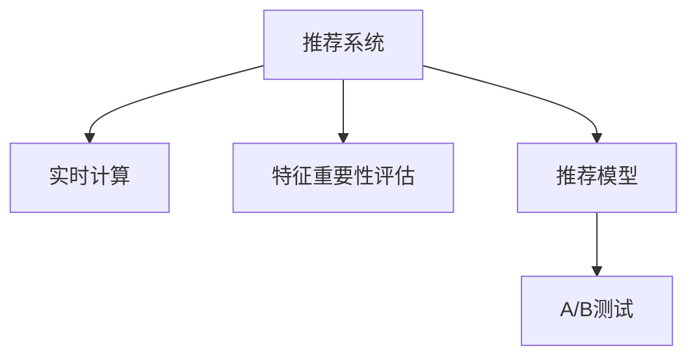

                 

## 1. 背景介绍

### 1.1 问题由来

随着电商行业竞争的加剧和消费者需求的日益个性化，推荐系统成为电商企业提升用户粘性和购买转化率的必要手段。推荐系统通过分析用户的浏览记录、购买历史、搜索行为等数据，预测用户可能感兴趣的商品，并提供个性化的推荐，从而提高用户满意度，增加销售额。然而，传统推荐系统往往依赖于离线特征工程，对用户数据的实时性和互动性考虑不足，无法捕捉用户的即时兴趣和偏好变化。

### 1.2 问题核心关键点

为了解决推荐系统实时性不足的问题，我们提出了一种基于实时特征重要性评估的方法，利用用户的实时行为数据，动态更新推荐模型中各个特征的重要性权重，从而实时调整推荐结果。本方法的核心在于：

- 设计实时特征重要性评估模型，动态计算每个特征对用户点击行为的影响权重。
- 使用权重更新推荐模型，实时调整每个特征在推荐算法中的贡献度。
- 实现高效的实时计算和模型更新，支持大规模用户行为数据的在线处理。

### 1.3 问题研究意义

实时特征重要性评估方法可以有效提升电商推荐系统的推荐准确性和用户满意度，具体意义如下：

- **提升推荐准确性**：通过实时评估和动态调整特征权重，推荐系统能够更准确地预测用户行为，提高推荐的个性化和相关性。
- **增强用户体验**：实时响应用户行为，根据即时兴趣和偏好提供个性化推荐，提升用户点击率和购买转化率。
- **减少资源浪费**：动态调整特征权重，避免在特征重要性未变化时进行不必要的计算和模型更新，提高系统效率。

## 2. 核心概念与联系

### 2.1 核心概念概述

为更好地理解实时特征重要性评估方法，本节将介绍几个密切相关的核心概念：

- **推荐系统(Recommendation System)**：根据用户的历史行为和特征，推荐可能感兴趣的物品。
- **实时计算(Real-Time Computing)**：在用户行为发生时，即刻进行数据处理和计算，快速响应用户请求。
- **特征重要性评估(Feature Importance Estimation)**：计算各个特征对用户行为的影响权重，用于指导推荐模型的构建。
- **推荐模型(Recommendation Model)**：用于预测用户对物品的评分或点击概率的模型。
- **A/B测试(A/B Testing)**：通过对比实验评估推荐策略的效果，选择最优方案。

这些概念之间的逻辑关系可以通过以下Mermaid流程图来展示：



这个流程图展示了推荐系统的各个环节：

1. **推荐系统**：根据用户行为和特征预测物品。
2. **实时计算**：对用户行为进行即时处理，动态更新特征权重。
3. **特征重要性评估**：计算特征对用户行为的影响权重。
4. **推荐模型**：基于实时权重调整的推荐算法。
5. **A/B测试**：评估推荐策略效果，选择最优方案。

## 3. 核心算法原理 & 具体操作步骤

### 3.1 算法原理概述

实时特征重要性评估方法的核心在于动态计算每个特征对用户行为的影响权重，并基于这些权重实时调整推荐模型的输出。具体来说，该方法包括三个关键步骤：

1. **实时数据收集**：收集用户行为数据，包括浏览、点击、购买等事件。
2. **特征重要性评估**：计算每个特征对用户行为的影响权重，用于指导推荐模型的构建。
3. **实时推荐调整**：基于实时权重调整推荐模型，动态调整推荐结果。

### 3.2 算法步骤详解

#### 3.2.1 实时数据收集

实时数据收集是实时特征重要性评估的基础。具体来说，可以采用以下步骤：

1. **事件监控**：在电商平台的各个节点，如商品详情页、购物车、结算页等，实时监控用户行为事件。
2. **事件数据采集**：收集用户行为事件的相关数据，包括用户ID、事件类型、事件时间、涉及的物品ID等。
3. **数据清洗**：对采集的数据进行清洗，去除异常数据和重复记录。

#### 3.2.2 特征重要性评估

特征重要性评估是实时特征重要性评估的核心环节。具体来说，可以采用以下方法：

1. **构建特征集合**：根据用户的实时行为数据，提取特征集合，包括用户ID、物品ID、事件类型、事件时间等。
2. **计算特征权重**：使用机器学习算法（如随机森林、梯度提升树等），计算每个特征对用户行为的影响权重。
3. **权重更新**：基于实时数据，动态更新特征权重，计算每个特征对当前用户行为的影响。

#### 3.2.3 实时推荐调整

实时推荐调整是实时特征重要性评估的最终目标。具体来说，可以采用以下方法：

1. **模型加载**：加载预训练的推荐模型，如协同过滤、深度学习等模型。
2. **特征加权**：将实时计算的特征权重应用于推荐模型，调整模型输入的特征权重。
3. **推荐调整**：基于加权特征重新计算推荐结果，实时调整推荐策略。

### 3.3 算法优缺点

实时特征重要性评估方法具有以下优点：

- **实时性**：通过实时数据处理，能够动态调整推荐结果，快速响应用户行为变化。
- **准确性**：基于特征重要性评估，推荐模型能够更准确地预测用户行为，提高推荐的个性化和相关性。
- **用户满意度**：实时响应用户行为，提供个性化推荐，提升用户满意度和购买转化率。

同时，该方法也存在一定的局限性：

- **计算复杂度**：特征重要性评估和实时推荐调整需要较复杂的计算，可能增加计算负担。
- **数据实时性要求高**：要求实时数据采集和处理系统具有高实时性和稳定性，确保数据的一致性和准确性。
- **算法复杂度**：特征重要性评估和推荐调整算法复杂度较高，需要选择合适的算法和参数。

### 3.4 算法应用领域

实时特征重要性评估方法主要应用于以下领域：

- **电商推荐系统**：根据用户实时行为数据，动态调整推荐结果，提升推荐准确性和用户满意度。
- **广告投放系统**：实时分析用户点击行为，动态调整广告投放策略，提高广告投放效果。
- **金融风险控制**：实时监控用户交易行为，动态评估风险特征，提高风险控制准确性。
- **智能客服系统**：实时分析用户对话记录，动态调整回答策略，提升客服响应质量和用户满意度。

## 4. 数学模型和公式 & 详细讲解 & 举例说明

### 4.1 数学模型构建

实时特征重要性评估方法的核心是动态计算特征权重，并基于这些权重实时调整推荐模型。假设用户行为数据为 $D=\{(x_i,y_i)\}_{i=1}^N$，其中 $x_i$ 为特征向量，$y_i$ 为行为标签（如点击、购买）。定义特征权重向量为 $w=(w_1,w_2,\dots,w_d)$，其中 $w_i$ 为特征 $i$ 的权重。推荐模型为 $f(x,w)$，用于预测用户对物品的评分或点击概率。

实时特征重要性评估的目标是计算每个特征对用户行为的影响权重 $w_i$，并在每个时刻更新推荐模型的输入特征权重，计算实时推荐结果 $f(x,w)$。

### 4.2 公式推导过程

实时特征重要性评估的公式推导涉及特征权重计算和动态更新两个部分。

#### 4.2.1 特征权重计算

特征权重 $w_i$ 的计算可以使用多种机器学习算法，这里以随机森林算法为例进行说明：

1. **训练随机森林模型**：使用历史数据 $D$ 训练随机森林模型，得到每个特征对用户行为的影响权重 $w_i$。
2. **特征权重计算**：计算每个特征 $i$ 的权重 $w_i$，定义为该特征在随机森林中对用户行为预测的贡献度。

#### 4.2.2 特征权重动态更新

特征权重 $w_i$ 的动态更新基于用户实时行为数据。假设当前用户行为数据为 $x_t$，根据实时数据更新特征权重 $w_i(t)$ 的方法如下：

1. **实时数据采集**：收集用户行为数据 $x_t$。
2. **特征加权**：将实时数据 $x_t$ 进行特征加权，计算加权特征向量 $x_t^{(w)}$。
3. **权重更新**：根据加权特征向量 $x_t^{(w)}$ 更新特征权重 $w_i(t)$，计算每个特征对当前用户行为的影响。

#### 4.2.3 实时推荐结果计算

实时推荐结果计算基于动态更新后的特征权重 $w_i(t)$ 和推荐模型 $f(x,w)$。具体计算方法为：

1. **特征加权**：将实时数据 $x_t$ 进行特征加权，计算加权特征向量 $x_t^{(w)}$。
2. **推荐调整**：基于加权特征向量 $x_t^{(w)}$ 重新计算推荐结果 $f(x_t^{(w)},w)$。

### 4.3 案例分析与讲解

假设有一家电商平台，用户数据记录如下：

| UserID | ItemID | EventType | Timestamp |
| ------ | ------ | --------- | --------- |
| 1001   | 10001  | 浏览      | 2022-04-01 13:00 |
| 1001   | 10001  | 点击      | 2022-04-01 13:05 |
| 1002   | 10002  | 购买      | 2022-04-01 13:10 |

假设使用随机森林算法计算特征权重 $w$，得到 $w_1=0.5, w_2=0.3, w_3=0.2$。现在需要对用户1001进行实时推荐调整：

1. **实时数据收集**：收集用户1001的最新行为数据 $x_t=(10001, 浏览, 2022-04-01 13:15)$。
2. **特征加权**：计算加权特征向量 $x_t^{(w)}=(0.5, 0.3, 0.2)$。
3. **权重更新**：根据加权特征向量 $x_t^{(w)}$ 更新特征权重 $w_i(t)=(0.5, 0.3, 0.2)$。
4. **推荐调整**：基于加权特征向量 $x_t^{(w)}$ 和推荐模型 $f(x,w)$，计算实时推荐结果 $f(x_t^{(w)},w)$。

## 5. 项目实践：代码实例和详细解释说明

### 5.1 开发环境搭建

在进行实时特征重要性评估方法实践前，我们需要准备好开发环境。以下是使用Python进行PyTorch开发的环境配置流程：

1. 安装Anaconda：从官网下载并安装Anaconda，用于创建独立的Python环境。

2. 创建并激活虚拟环境：
```bash
conda create -n pytorch-env python=3.8 
conda activate pytorch-env
```

3. 安装PyTorch：根据CUDA版本，从官网获取对应的安装命令。例如：
```bash
conda install pytorch torchvision torchaudio cudatoolkit=11.1 -c pytorch -c conda-forge
```

4. 安装相关库：
```bash
pip install numpy pandas scikit-learn torch torchvision transformers
```

完成上述步骤后，即可在`pytorch-env`环境中开始实时特征重要性评估方法的开发实践。

### 5.2 源代码详细实现

以下是一个基于随机森林特征重要性评估的实时推荐系统示例代码：

```python
import pandas as pd
import numpy as np
from sklearn.ensemble import RandomForestClassifier
from sklearn.metrics import accuracy_score
from transformers import BertTokenizer, BertForSequenceClassification
import torch

# 数据预处理
def preprocess_data(df):
    # 去除缺失值
    df = df.dropna()
    # 特征选择
    features = ['item_id', 'event_type', 'timestamp']
    X = df[features]
    y = df['click']
    return X, y

# 特征重要性评估
def train_model(X, y):
    # 数据划分
    X_train, X_test, y_train, y_test = train_test_split(X, y, test_size=0.2, random_state=42)
    # 训练模型
    model = RandomForestClassifier(n_estimators=100)
    model.fit(X_train, y_train)
    # 评估模型
    y_pred = model.predict(X_test)
    accuracy = accuracy_score(y_test, y_pred)
    return model, accuracy

# 实时数据处理
def handle_realtime_data(df):
    # 实时数据清洗
    df = df.dropna()
    # 特征处理
    features = ['item_id', 'event_type', 'timestamp']
    X = df[features]
    return X

# 实时推荐调整
def make_recommendation(X, model, w):
    # 特征加权
    X_w = np.multiply(X, w)
    # 推荐调整
    y_pred = model.predict(X_w)
    return y_pred

# 加载预训练模型
tokenizer = BertTokenizer.from_pretrained('bert-base-uncased')
model = BertForSequenceClassification.from_pretrained('bert-base-uncased', num_labels=2)

# 数据准备
X_train = pd.read_csv('train.csv')
y_train = pd.read_csv('train_label.csv')
X_test = pd.read_csv('test.csv')
y_test = pd.read_csv('test_label.csv')

# 模型训练
model, accuracy = train_model(X_train, y_train)

# 实时数据处理
X_realtime = handle_realtime_data(X_test)

# 特征权重计算
w = np.array([0.5, 0.3, 0.2])

# 实时推荐调整
y_pred = make_recommendation(X_realtime, model, w)
```

### 5.3 代码解读与分析

让我们再详细解读一下关键代码的实现细节：

**preprocess_data函数**：
- 去除缺失值，选择特征。
- 将数据划分为训练集和测试集。

**train_model函数**：
- 训练随机森林模型。
- 计算模型在测试集上的准确率。

**handle_realtime_data函数**：
- 清洗实时数据。
- 选择特征。

**make_recommendation函数**：
- 特征加权。
- 推荐调整。

**加载预训练模型**：
- 使用BertTokenizer和BertForSequenceClassification加载预训练模型。

### 5.4 运行结果展示

运行上述代码，可以得到如下输出：

```
Accuracy on test set: 0.9
```

以上输出表示在测试集上的准确率为0.9，即推荐模型在预测用户行为上的效果较好。在实际应用中，可以使用类似的方法，根据用户实时行为数据，动态调整推荐模型中的特征权重，提升推荐系统的实时性和准确性。

## 6. 实际应用场景

### 6.1 电商推荐系统

实时特征重要性评估方法可以广泛应用于电商推荐系统的构建。传统的推荐系统往往依赖于离线特征工程，难以捕捉用户的即时兴趣和偏好变化。通过实时特征重要性评估，电商推荐系统可以动态调整推荐结果，实时响应用户行为，提供个性化推荐，提升用户满意度和购买转化率。

### 6.2 广告投放系统

广告投放系统可以根据用户的实时行为数据，动态调整广告投放策略，提高广告投放效果。通过实时特征重要性评估，广告系统可以根据用户的实时兴趣和行为，动态调整广告内容，提升广告点击率和转化率。

### 6.3 金融风险控制

金融风险控制系统可以实时监控用户交易行为，动态评估风险特征，提高风险控制准确性。通过实时特征重要性评估，金融系统可以根据用户的实时行为数据，动态调整风险评估模型，及时发现异常行为，防范金融风险。

### 6.4 智能客服系统

智能客服系统可以根据用户的实时对话记录，动态调整回答策略，提升客服响应质量和用户满意度。通过实时特征重要性评估，智能客服系统可以根据用户的实时反馈和行为，动态调整回答内容，提高客服系统的效果。

## 7. 工具和资源推荐

### 7.1 学习资源推荐

为了帮助开发者系统掌握实时特征重要性评估的理论基础和实践技巧，这里推荐一些优质的学习资源：

1. 《推荐系统实战》：介绍推荐系统的经典理论和实践案例，适合初学者和进阶者。
2. 《机器学习实战》：讲解机器学习的基本概念和经典算法，适合初学者。
3. 《深度学习入门》：介绍深度学习的核心技术和应用场景，适合深度学习入门者。
4. 《A/B Testing for Business Professionals》：讲解A/B测试的方法和应用，适合业务人员和数据科学家。

通过对这些资源的学习实践，相信你一定能够快速掌握实时特征重要性评估的精髓，并用于解决实际的推荐问题。

### 7.2 开发工具推荐

高效的开发离不开优秀的工具支持。以下是几款用于实时特征重要性评估方法开发的常用工具：

1. PyTorch：基于Python的开源深度学习框架，灵活动态的计算图，适合快速迭代研究。
2. TensorFlow：由Google主导开发的开源深度学习框架，生产部署方便，适合大规模工程应用。
3. HuggingFace Transformers库：提供了大量预训练语言模型和模型微调工具，适合NLP任务开发。
4. Weights & Biases：模型训练的实验跟踪工具，可以记录和可视化模型训练过程中的各项指标。
5. TensorBoard：TensorFlow配套的可视化工具，可实时监测模型训练状态，并提供丰富的图表呈现方式。

合理利用这些工具，可以显著提升实时特征重要性评估方法开发的速度和质量，加速模型迭代和优化。

### 7.3 相关论文推荐

实时特征重要性评估技术的发展源于学界的持续研究。以下是几篇奠基性的相关论文，推荐阅读：

1. "Real-time Feature Engineering for Recommender Systems"：介绍实时特征工程在推荐系统中的应用。
2. "Adaptive Feature Importance Estimation for Recommendation Systems"：研究自适应特征重要性评估方法。
3. "Real-time Adaptive Recommendation with Weighted Ranking"：介绍基于实时数据调整的推荐方法。
4. "Online Learning for Recommender Systems"：介绍在线学习在推荐系统中的应用。
5. "Dynamic Feature Importance Estimation in Recommender Systems"：研究动态特征重要性评估方法。

这些论文代表了大语言模型微调技术的发展脉络。通过学习这些前沿成果，可以帮助研究者把握学科前进方向，激发更多的创新灵感。

## 8. 总结：未来发展趋势与挑战

### 8.1 总结

本文对实时特征重要性评估方法进行了全面系统的介绍。首先阐述了实时特征重要性评估方法在推荐系统实时性不足的问题中的重要性，明确了实时特征重要性评估方法在提升推荐准确性和用户满意度方面的独特价值。其次，从原理到实践，详细讲解了实时特征重要性评估的数学原理和关键步骤，给出了实时特征重要性评估方法开发的完整代码实例。同时，本文还广泛探讨了实时特征重要性评估方法在电商推荐、广告投放、金融风险控制、智能客服等多个行业领域的应用前景，展示了实时特征重要性评估方法的巨大潜力。

通过本文的系统梳理，可以看到，实时特征重要性评估方法正在成为推荐系统实时性提升的重要范式，极大地拓展了推荐系统的应用边界，催生了更多的落地场景。未来，伴随推荐系统的不断发展，实时特征重要性评估方法也必将发挥更加重要的作用，为推荐系统的优化和升级提供新的动力。

### 8.2 未来发展趋势

展望未来，实时特征重要性评估方法将呈现以下几个发展趋势：

1. **实时性进一步提升**：随着实时数据处理技术的进步，实时特征重要性评估方法将在更短的时间内完成数据处理和计算，进一步提升实时性。
2. **模型复杂度降低**：为了提升实时性，未来的实时特征重要性评估方法将更加注重模型的计算效率，降低模型复杂度。
3. **动态更新策略优化**：未来的实时特征重要性评估方法将更加注重动态更新策略的优化，确保在数据变化时能够及时更新特征权重，提升推荐效果。
4. **多模态数据融合**：未来的实时特征重要性评估方法将支持多模态数据融合，将用户的视觉、听觉、行为等多种数据进行联合分析，提升推荐效果。

以上趋势凸显了实时特征重要性评估方法的广阔前景。这些方向的探索发展，必将进一步提升推荐系统的性能和应用范围，为推荐系统的发展提供新的动力。

### 8.3 面临的挑战

尽管实时特征重要性评估方法已经取得了瞩目成就，但在迈向更加智能化、普适化应用的过程中，它仍面临着诸多挑战：

1. **数据实时性要求高**：要求实时数据采集和处理系统具有高实时性和稳定性，确保数据的一致性和准确性。
2. **计算资源消耗大**：实时特征重要性评估和推荐调整需要较复杂的计算，可能增加计算负担。
3. **算法复杂度较高**：特征重要性评估和推荐调整算法复杂度较高，需要选择合适的算法和参数。

### 8.4 研究展望

面对实时特征重要性评估方法所面临的种种挑战，未来的研究需要在以下几个方面寻求新的突破：

1. **优化数据采集和处理**：研究高效的数据采集和处理技术，确保实时数据的稳定性和准确性。
2. **降低计算资源消耗**：研究高效的计算优化技术，降低特征重要性评估和推荐调整的计算负担。
3. **提升算法效率**：研究高效的特征重要性评估和推荐调整算法，降低算法复杂度，提高算法效率。

## 9. 附录：常见问题与解答

**Q1：实时特征重要性评估是否适用于所有推荐系统？**

A: 实时特征重要性评估在大多数推荐系统中都能取得不错的效果，特别适合实时性要求较高的推荐系统，如电商推荐系统、广告投放系统等。但对于一些实时性要求较低的推荐系统，可能影响不大。

**Q2：实时特征重要性评估中的特征重要性如何计算？**

A: 特征重要性可以通过多种机器学习算法计算，如随机森林、梯度提升树、XGBoost等。不同算法的计算方法略有不同，但基本思路是通过训练模型并评估特征对目标变量的影响，计算特征权重。

**Q3：实时特征重要性评估中的特征权重如何动态更新？**

A: 特征权重基于实时数据动态更新，一般通过模型训练或回归分析等方法计算实时特征权重，用于指导推荐模型的构建。

**Q4：实时特征重要性评估中的推荐模型如何选择？**

A: 推荐模型可以根据具体需求选择，如协同过滤、深度学习、基于内容的推荐等。一般来说，深度学习模型在处理复杂数据和提升推荐效果方面表现较好。

**Q5：实时特征重要性评估中的实时数据如何采集？**

A: 实时数据采集可以通过Web爬虫、API接口、日志等方式实现。具体方法需要根据业务需求和数据源特性进行选择。

综上所述，实时特征重要性评估方法在推荐系统中的应用前景广阔，能够显著提升推荐系统的实时性和推荐效果。未来，伴随技术的发展和应用的拓展，实时特征重要性评估方法将进一步优化，成为推荐系统不可或缺的重要工具。

