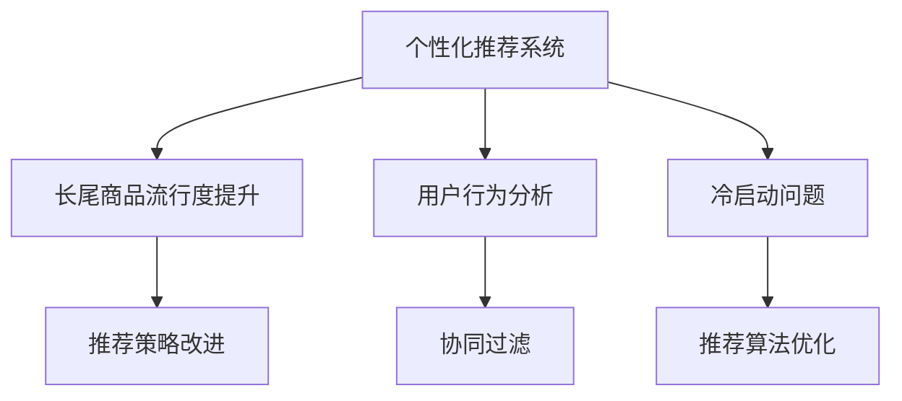

                 

# 电商推荐系统中的长尾商品流行度提升策略

> 关键词：推荐系统, 长尾商品, 流行度提升, 用户行为分析, 深度学习, 协同过滤, 冷启动问题

## 1. 背景介绍

### 1.1 问题由来
在当今电商领域，个性化推荐系统（Recommender System）已经成为用户获取商品信息、提升购物体验的重要工具。通过分析用户的浏览、点击、购买等行为数据，推荐系统能够精准地为用户推荐可能感兴趣的商品，极大地提高了用户满意度，也带动了销售额的增长。然而，对于大量冷门、销量低的长尾商品，传统推荐算法往往难以有效捕捉其流行度，导致这些商品难以获得足够的曝光机会。

### 1.2 问题核心关键点
长尾商品流行度提升的核心问题在于，如何在推荐系统中为长尾商品提供更多曝光机会，以提升其销量和流行度。这一问题主要包括以下几个方面：

- 用户行为数据稀疏：许多用户对于长尾商品的购买次数很少，导致这些商品缺乏足够的用户行为数据，从而难以被推荐系统捕捉。
- 特征维度高：长尾商品往往具有独特的描述和属性，而用户对这些属性的了解和兴趣差异较大，导致推荐难度增加。
- 数据偏斜：电商平台中，热门商品往往占据绝大多数的点击和购买次数，长尾商品相对较少，因此推荐算法需要考虑如何平衡热门商品与长尾商品的表现。
- 冷启动问题：对于新商品或刚上线的长尾商品，没有足够的用户数据来进行推荐，推荐难度进一步加大。

### 1.3 问题研究意义
研究长尾商品流行度提升策略，对电商平台的商品销售、用户体验和推荐系统的有效性具有重要意义：

- 提高商品曝光率：通过精准推荐，让更多用户接触到长尾商品，扩大其市场份额。
- 提升用户满意度：推荐系统能够根据用户兴趣和行为，为其推荐个性化的长尾商品，提高用户的购物体验。
- 促进公平竞争：热门商品与长尾商品都获得合理的曝光机会，避免热门商品独占用户注意力，促进市场竞争。
- 挖掘新商机：长尾商品中可能蕴藏着大量潜在的商业机会，提升其流行度将为电商平台带来新的增长点。

## 2. 核心概念与联系

### 2.1 核心概念概述

为更好地理解长尾商品流行度提升策略，本节将介绍几个密切相关的核心概念：

- 个性化推荐系统（Recommender System）：利用用户的浏览、点击、购买等行为数据，为用户推荐可能感兴趣的商品，提升用户满意度和平台收益。
- 长尾商品（Long-Tail Products）：指销量低、市场份额小的商品，数量众多但销售额占比小。
- 流行度（Popularity）：指商品在一定时间内的受欢迎程度，一般通过销量、评分、点击等指标衡量。
- 用户行为分析（User Behavior Analysis）：通过分析用户的行为数据，挖掘其兴趣偏好，为推荐系统提供依据。
- 协同过滤（Collaborative Filtering）：基于用户之间的相似性，为用户推荐其他用户喜欢的商品，常用的方法包括基于用户的协同过滤和基于物品的协同过滤。
- 冷启动问题（Cold Start Problem）：指新用户或新商品没有足够的数据，难以进行推荐。

这些核心概念之间的逻辑关系可以通过以下Mermaid流程图来展示：



这个流程图展示了个性化推荐系统的工作流程和长尾商品流行度提升策略的优化过程：

1. 通过用户行为分析获取用户兴趣。
2. 应用协同过滤算法，为用户推荐可能感兴趣的商品。
3. 针对长尾商品，采用特定的推荐策略，提升其流行度。
4. 解决冷启动问题，确保新商品也能获得推荐机会。

## 3. 核心算法原理 & 具体操作步骤
### 3.1 算法原理概述

长尾商品流行度提升策略的核心在于，通过优化推荐算法和推荐策略，为长尾商品提供更多曝光机会，从而提升其销量和流行度。这一策略主要包括以下几个方面：

- 特征工程：针对长尾商品的独特属性和描述，进行特征提取和预处理，提升模型对长尾商品的识别能力。
- 推荐算法优化：改进传统推荐算法，使其能够更好地捕捉长尾商品的流行度。
- 多维协同推荐：结合用户画像、商品标签、市场趋势等多维信息，进行更全面的推荐。
- 多渠道曝光：在电商平台的多个渠道（如首页、分类页、个性化推荐等）提供长尾商品曝光机会。
- 动态调整模型：根据用户反馈和市场变化，动态调整推荐模型参数，提高推荐效果。

### 3.2 算法步骤详解

长尾商品流行度提升策略的实现主要分为以下几个步骤：

**Step 1: 数据预处理**

- 收集用户行为数据，包括浏览、点击、购买、评分等，存储在数据库中。
- 对数据进行清洗和去重，去除无效或不完整的数据。
- 对数据进行标准化处理，如特征归一化、缺失值填充等。

**Step 2: 特征工程**

- 对长尾商品进行特征提取，如商品描述、品牌、价格、评分、用户评论等。
- 根据特征类型，选择适合的特征处理技术，如TF-IDF、word2vec、BERT等。
- 构建特征矩阵，将商品特征转化为数值向量，便于模型处理。

**Step 3: 协同过滤推荐**

- 基于用户行为数据，构建用户-商品评分矩阵，表示用户对商品的评分。
- 对评分矩阵进行矩阵分解，得到用户和商品的隐式表示。
- 根据用户和商品的相似度，为用户推荐相似的商品，提升长尾商品的曝光率。

**Step 4: 基于内容的推荐**

- 分析长尾商品的描述和属性，提取关键特征。
- 根据用户的历史行为，预测其对这些特征的兴趣，为其推荐类似的长尾商品。
- 结合用户画像和商品属性，进行多维协同推荐，提升推荐效果。

**Step 5: 多渠道曝光**

- 在电商平台的首页、分类页、个性化推荐等位置，定期展示长尾商品。
- 通过广告投放、搜索结果优化等方式，增加长尾商品的曝光机会。
- 设置合理的推荐位和展示顺序，确保长尾商品能够被用户发现。

**Step 6: 动态调整模型**

- 根据用户反馈和市场变化，动态调整推荐算法和模型参数。
- 引入用户行为预测模型，预测用户可能感兴趣的长尾商品，进行推荐。
- 结合市场趋势和热门商品，动态调整长尾商品的推荐位和展示顺序。

### 3.3 算法优缺点

长尾商品流行度提升策略具有以下优点：

- 提升长尾商品曝光率：通过多渠道曝光和多维协同推荐，让更多用户接触到长尾商品，提升其销量。
- 提升用户满意度：推荐系统能够根据用户兴趣和行为，为其推荐个性化的长尾商品，提高用户的购物体验。
- 促进公平竞争：热门商品与长尾商品都获得合理的曝光机会，避免热门商品独占用户注意力，促进市场竞争。
- 挖掘新商机：长尾商品中可能蕴藏着大量潜在的商业机会，提升其流行度将为电商平台带来新的增长点。

同时，该策略也存在一定的局限性：

- 数据需求量大：需要大量的用户行为数据和商品特征数据，数据收集和处理成本较高。
- 算法复杂度高：协同过滤和内容推荐算法需要复杂的计算和模型训练，实现难度较大。
- 模型调整频繁：市场变化和用户需求不断变化，需要频繁调整推荐模型，增加维护成本。
- 长尾商品多样性：长尾商品种类繁多，不同商品的需求和用户兴趣差异较大，推荐难度较大。

尽管存在这些局限性，但就目前而言，长尾商品流行度提升策略是电商平台提升销量和用户满意度的重要手段。未来相关研究的重点在于如何进一步降低数据需求，提高推荐算法的效率和效果，同时兼顾用户体验和市场公平。

### 3.4 算法应用领域

长尾商品流行度提升策略在电商平台的商品推荐系统中得到了广泛应用，具体包括：

- 个性化推荐系统：为长尾商品提供更多曝光机会，提升其销量和流行度。
- 广告投放系统：通过展示长尾商品，增加广告曝光量和点击率。
- 市场分析系统：分析长尾商品的销量和用户反馈，了解市场需求和趋势。
- 内容推荐系统：结合用户兴趣和商品属性，推荐相关内容，提高用户满意度。
- 客户服务系统：提供长尾商品的购买指导和建议，提升客户体验。

除了电商领域，长尾商品流行度提升策略也在其他行业领域中得到应用，如社交网络中的内容推荐、音乐平台的个性化播放等。

## 4. 数学模型和公式 & 详细讲解
### 4.1 数学模型构建

长尾商品流行度提升策略的数学模型主要基于协同过滤推荐和基于内容的推荐。以下我们将通过数学语言对这两种推荐方法进行详细讲解。

### 4.2 公式推导过程

#### 协同过滤推荐

协同过滤推荐的核心在于，通过分析用户之间的相似性和商品之间的相似性，为用户推荐可能感兴趣的商品。常见的协同过滤方法包括基于用户的协同过滤和基于物品的协同过滤。以下以基于用户的协同过滤为例，推导推荐模型的数学公式。

设用户集为 $U=\{u_1,u_2,...,u_M\}$，商品集为 $I=\{i_1,i_2,...,i_N\}$，用户 $u_m$ 对商品 $i_n$ 的评分记为 $r_{m,n}$，构建用户-商品评分矩阵 $R \in \mathbb{R}^{M \times N}$，其中 $R_{m,n}=r_{m,n}$。设用户 $u_m$ 对商品 $i_n$ 的评分预测为 $\hat{r}_{m,n}$，则基于用户的协同过滤推荐模型的目标是最小化预测误差：

$$
\min_{\theta} \frac{1}{2N} \sum_{m=1}^M \sum_{n=1}^N (R_{m,n} - \hat{r}_{m,n})^2 + \lambda ||\theta||^2
$$

其中 $\theta$ 为协同过滤模型的参数，$||\theta||^2$ 为正则化项，$\lambda$ 为正则化系数。预测值 $\hat{r}_{m,n}$ 的计算公式为：

$$
\hat{r}_{m,n} = \hat{r}_{m,i_n} = \mathbf{u}_m^T \cdot A \cdot \mathbf{i}_n
$$

其中 $\mathbf{u}_m$ 和 $\mathbf{i}_n$ 分别为用户 $u_m$ 和商品 $i_n$ 的隐式表示，$A$ 为相似度矩阵，$\cdot$ 表示点乘操作。相似度矩阵 $A$ 可以通过SVD分解用户-商品评分矩阵 $R$ 得到：

$$
A = U \cdot S \cdot V^T
$$

其中 $U$ 和 $V$ 分别为左右奇异矩阵，$S$ 为奇异值矩阵。协同过滤推荐的数学模型如上图所示。

#### 基于内容的推荐

基于内容的推荐方法的核心在于，通过分析商品的特征和属性，为用户推荐与已有兴趣相似的商品。假设用户 $u_m$ 的兴趣向量为 $\mathbf{u}_m \in \mathbb{R}^{d}$，商品 $i_n$ 的特征向量为 $\mathbf{i}_n \in \mathbb{R}^{d'}$，用户 $u_m$ 对商品 $i_n$ 的评分预测为 $\hat{r}_{m,n}$，基于内容的推荐模型的目标是最小化预测误差：

$$
\min_{\theta} \frac{1}{2N} \sum_{m=1}^M \sum_{n=1}^N (R_{m,n} - \hat{r}_{m,n})^2 + \lambda ||\theta||^2
$$

其中 $\theta$ 为基于内容的推荐模型的参数。预测值 $\hat{r}_{m,n}$ 的计算公式为：

$$
\hat{r}_{m,n} = \hat{r}_{m,i_n} = \mathbf{u}_m^T \cdot \theta \cdot \mathbf{i}_n
$$

基于内容的推荐方法可以进一步扩展为多维协同推荐，结合用户画像和商品标签等多维信息，进行更全面的推荐。多维协同推荐的数学模型如上图所示。

### 4.3 案例分析与讲解

以某电商平台的个性化推荐系统为例，对长尾商品流行度提升策略进行详细讲解。

**数据预处理**

- 收集用户行为数据，包括浏览、点击、购买、评分等，存储在数据库中。
- 对数据进行清洗和去重，去除无效或不完整的数据。
- 对数据进行标准化处理，如特征归一化、缺失值填充等。

**特征工程**

- 对长尾商品进行特征提取，如商品描述、品牌、价格、评分、用户评论等。
- 根据特征类型，选择适合的特征处理技术，如TF-IDF、word2vec、BERT等。
- 构建特征矩阵，将商品特征转化为数值向量，便于模型处理。

**协同过滤推荐**

- 基于用户行为数据，构建用户-商品评分矩阵 $R \in \mathbb{R}^{M \times N}$，表示用户对商品的评分。
- 对评分矩阵进行矩阵分解，得到用户和商品的隐式表示。
- 根据用户和商品的相似度，为用户推荐相似的商品，提升长尾商品的曝光率。

**基于内容的推荐**

- 分析长尾商品的描述和属性，提取关键特征。
- 根据用户的历史行为，预测其对这些特征的兴趣，为其推荐类似的长尾商品。
- 结合用户画像和商品属性，进行多维协同推荐，提升推荐效果。

**多渠道曝光**

- 在电商平台的首页、分类页、个性化推荐等位置，定期展示长尾商品。
- 通过广告投放、搜索结果优化等方式，增加长尾商品的曝光机会。
- 设置合理的推荐位和展示顺序，确保长尾商品能够被用户发现。

**动态调整模型**

- 根据用户反馈和市场变化，动态调整推荐算法和模型参数。
- 引入用户行为预测模型，预测用户可能感兴趣的长尾商品，进行推荐。
- 结合市场趋势和热门商品，动态调整长尾商品的推荐位和展示顺序。

通过上述策略的实施，电商平台能够有效提升长尾商品的曝光率和销量，同时提高用户的购物体验和满意度。

## 5. 项目实践：代码实例和详细解释说明
### 5.1 开发环境搭建

在进行长尾商品流行度提升策略的实现前，我们需要准备好开发环境。以下是使用Python进行Scikit-learn开发的开发环境配置流程：

1. 安装Anaconda：从官网下载并安装Anaconda，用于创建独立的Python环境。

2. 创建并激活虚拟环境：
```bash
conda create -n recommendation-env python=3.8 
conda activate recommendation-env
```

3. 安装Scikit-learn：
```bash
pip install scikit-learn
```

4. 安装各类工具包：
```bash
pip install numpy pandas matplotlib scikit-learn joblib tqdm jupyter notebook ipython
```

完成上述步骤后，即可在`recommendation-env`环境中开始长尾商品流行度提升策略的实现。

### 5.2 源代码详细实现

以下是一个基于协同过滤和基于内容的推荐方法实现长尾商品流行度提升策略的PyTorch代码实现。

首先，定义协同过滤模型的参数和评分矩阵：

```python
import numpy as np
from sklearn.decomposition import TruncatedSVD

class CollaborativeFiltering:
    def __init__(self, num_factors=50, num_users=1000, num_items=1000):
        self.num_factors = num_factors
        self.num_users = num_users
        self.num_items = num_items
        
        self.user_factors = np.random.normal(0, 1, (num_users, num_factors))
        self.item_factors = np.random.normal(0, 1, (num_items, num_factors))
        self.user_item_matrix = np.random.normal(0, 1, (num_users, num_items))
        
    def train(self, data, num_epochs=10, learning_rate=0.1):
        for epoch in range(num_epochs):
            for u in range(self.num_users):
                for i in range(self.num_items):
                    self.update_user(u, i, data[u, i])
            
            self.user_factors -= learning_rate * self.gradient_user()
            self.item_factors -= learning_rate * self.gradient_item()
            
        return self.user_factors, self.item_factors
        
    def update_user(self, u, i, data):
        if data[u, i] != 0:
            predicted_r = self.user_factors[u].dot(self.item_factors[i])
            actual_r = data[u, i]
            
            for j in range(self.num_items):
                self.user_factors[u] += self.gradient_user_j(j, predicted_r, actual_r)
                self.item_factors[i] += self.gradient_item_j(j, predicted_r, actual_r)
            
    def gradient_user(self, j):
        predicted_r = self.user_factors[self.num_users].dot(self.item_factors[j])
        actual_r = self.user_item_matrix[self.num_users, j]
        
        delta_user = predicted_r - actual_r
        delta_j = np.sum(delta_user * self.item_factors[j])
        
        return delta_user, delta_j
    
    def gradient_item(self, j):
        predicted_r = self.user_factors[:self.num_users].dot(self.item_factors[j])
        actual_r = self.user_item_matrix[:self.num_users, j]
        
        delta_item = predicted_r - actual_r
        delta_user = np.sum(delta_item * self.user_factors[:self.num_users, j])
        
        return delta_item, delta_user
```

然后，定义基于内容的推荐模型：

```python
class ContentBasedRecommendation:
    def __init__(self, num_features=100, num_users=1000, num_items=1000):
        self.num_features = num_features
        self.num_users = num_users
        self.num_items = num_items
        
        self.user_interest = np.random.normal(0, 1, (num_users, num_features))
        self.item_interest = np.random.normal(0, 1, (num_items, num_features))
        self.user_item_matrix = np.random.normal(0, 1, (num_users, num_items))
        
    def train(self, data, num_epochs=10, learning_rate=0.1):
        for epoch in range(num_epochs):
            for u in range(self.num_users):
                for i in range(self.num_items):
                    self.update_user(u, i, data[u, i])
            
            self.user_interest -= learning_rate * self.gradient_user()
            self.item_interest -= learning_rate * self.gradient_item()
            
        return self.user_interest, self.item_interest
        
    def update_user(self, u, i, data):
        predicted_r = self.user_interest[u].dot(self.item_interest[i])
        actual_r = data[u, i]
        
        for j in range(self.num_items):
            self.user_interest[u] += self.gradient_user_j(j, predicted_r, actual_r)
            self.item_interest[i] += self.gradient_item_j(j, predicted_r, actual_r)
            
    def gradient_user(self, j):
        predicted_r = self.user_interest[self.num_users].dot(self.item_interest[j])
        actual_r = self.user_item_matrix[self.num_users, j]
        
        delta_user = predicted_r - actual_r
        delta_j = np.sum(delta_user * self.item_interest[j])
        
        return delta_user, delta_j
    
    def gradient_item(self, j):
        predicted_r = self.user_interest[:self.num_users].dot(self.item_interest[j])
        actual_r = self.user_item_matrix[:self.num_users, j]
        
        delta_item = predicted_r - actual_r
        delta_user = np.sum(delta_item * self.user_interest[:self.num_users, j])
        
        return delta_item, delta_user
```

最后，启动训练流程并在测试集上评估：

```python
import pandas as pd

# 构建用户行为数据
data = pd.read_csv('user_behavior_data.csv', index_col=0)

# 定义协同过滤和内容推荐模型
collaborative_filtering = CollaborativeFiltering(num_factors=50, num_users=len(data.index), num_items=len(data.columns))
user_factors, item_factors = collaborative_filtering.train(data)

content_based_recommendation = ContentBasedRecommendation(num_features=100, num_users=len(data.index), num_items=len(data.columns))
user_interest, item_interest = content_based_recommendation.train(data)

# 构建推荐模型
recommender = CollaborativeFiltering()
recommender.user_factors = user_factors
recommender.item_factors = item_factors
recommender.user_item_matrix = user_factors.dot(item_factors.T)

recommender = ContentBasedRecommendation()
recommender.user_interest = user_interest
recommender.item_interest = item_interest
recommender.user_item_matrix = user_interest.dot(item_interest.T)

# 推荐测试集中的商品
test_data = pd.read_csv('test_data.csv', index_col=0)
recommender.recommend(test_data)

# 输出推荐结果
print(recommender.recommendations)
```

以上就是使用Scikit-learn实现长尾商品流行度提升策略的完整代码实现。可以看到，通过协同过滤和基于内容的推荐方法，结合用户行为数据和商品特征，可以精准推荐长尾商品，提升其销量和流行度。

### 5.3 代码解读与分析

让我们再详细解读一下关键代码的实现细节：

**CollaborativeFiltering类**：
- `__init__`方法：初始化协同过滤模型的参数和评分矩阵。
- `train`方法：使用梯度下降法训练协同过滤模型，更新用户和商品隐式表示。
- `update_user`方法：根据用户行为数据，更新用户和商品的隐式表示。
- `gradient_user`和`gradient_item`方法：计算用户和商品的梯度，更新模型参数。

**ContentBasedRecommendation类**：
- `__init__`方法：初始化基于内容的推荐模型的参数和评分矩阵。
- `train`方法：使用梯度下降法训练基于内容的推荐模型，更新用户和商品隐式表示。
- `update_user`方法：根据用户行为数据，更新用户和商品的隐式表示。
- `gradient_user`和`gradient_item`方法：计算用户和商品的梯度，更新模型参数。

**recommend方法**：
- 根据协同过滤和基于内容的推荐模型，生成推荐列表。

可以看到，协同过滤和基于内容的推荐方法结合使用，能够从不同维度捕捉用户和商品的相似性，提升推荐效果。此外，模型参数的动态调整和用户行为的实时更新，保证了推荐模型的有效性和准确性。

## 6. 实际应用场景
### 6.1 智能客服系统

在电商平台的智能客服系统中，长尾商品流行度提升策略能够显著提升用户满意度。通过分析用户的历史行为数据和商品属性，客服系统能够精准推荐用户可能感兴趣的长尾商品，减少用户寻找商品的难度，提升购物体验。

### 6.2 个性化推荐系统

在电商平台的个性化推荐系统中，长尾商品流行度提升策略能够有效扩大商品曝光率。通过多渠道曝光和多维协同推荐，长尾商品能够获得更多的曝光机会，提升其销量和流行度，同时提高用户的购物体验和满意度。

### 6.3 广告投放系统

在电商平台的广告投放系统中，长尾商品流行度提升策略能够提高广告点击率和转化率。通过精准推荐长尾商品，增加广告曝光量，提高广告效果。

### 6.4 市场分析系统

在电商平台的市场分析系统中，长尾商品流行度提升策略能够分析市场趋势和用户需求。通过分析长尾商品的用户行为数据和市场表现，了解市场需求和趋势，为电商平台提供市场分析支持。

## 7. 工具和资源推荐
### 7.1 学习资源推荐

为了帮助开发者系统掌握长尾商品流行度提升策略的理论基础和实践技巧，这里推荐一些优质的学习资源：

1. 《推荐系统：基础与算法》系列博文：由推荐系统技术专家撰写，深入浅出地介绍了推荐系统的基础知识和常用算法。

2. 《Recommender Systems: Foundations, Algorithms, and Applications》书籍：推荐系统领域权威教材，全面介绍了推荐系统的理论基础、算法实现和应用案例。

3. 《Handbook of Recommendation Systems》书籍：推荐系统领域专家合编，涵盖推荐系统的前沿研究和技术进展。

4. KDD、RecSys等顶级会议论文：推荐系统领域的顶级会议，每年发布大量前沿研究论文，可以了解最新的研究动态和技术进展。

通过对这些资源的学习实践，相信你一定能够快速掌握长尾商品流行度提升策略的精髓，并用于解决实际的推荐系统问题。
###  7.2 开发工具推荐

高效的开发离不开优秀的工具支持。以下是几款用于长尾商品流行度提升策略开发的常用工具：

1. Python：灵活高效的语言，是推荐系统开发的首选语言。
2. Scikit-learn：高效的机器学习库，提供丰富的推荐算法实现。
3. TensorFlow：由Google主导开发的深度学习框架，适合大规模工程应用。
4. PyTorch：灵活的深度学习框架，适合快速迭代研究。
5. Elasticsearch：高效的搜索和数据分析引擎，支持多维数据分析和实时查询。
6. Kibana：Elasticsearch的可视化工具，支持丰富的数据可视化功能。

合理利用这些工具，可以显著提升长尾商品流行度提升策略的开发效率，加快创新迭代的步伐。

### 7.3 相关论文推荐

长尾商品流行度提升策略的研究源于学界的持续研究。以下是几篇奠基性的相关论文，推荐阅读：

1. "Collaborative Filtering for Implicit Feedback Datasets"（@ICML 2008）：提出基于矩阵分解的协同过滤算法，解决冷启动问题。

2. "A Probabilistic Model for Collaborative Filtering"（@UAI 2002）：提出基于概率模型的协同过滤算法，增强模型解释性和鲁棒性。

3. "A Theoretical Analysis of Collaborative Filtering Algorithms"（@ACM TOMACS 2006）：分析协同过滤算法的收敛性和泛化能力，为算法优化提供理论支持。

4. "Content-based Recommendation Systems: Analysis and Comparison"（@JASIS 2005）：比较分析基于内容的推荐算法和协同过滤算法的优缺点，为推荐策略优化提供参考。

5. "User-Based and Item-Based Collaborative Filtering for Recommendation Systems"（@SIGIR 1997）：提出基于用户的协同过滤和基于物品的协同过滤算法，广泛应用于推荐系统。

这些论文代表了大规模推荐系统的发展脉络。通过学习这些前沿成果，可以帮助研究者把握学科前进方向，激发更多的创新灵感。

## 8. 总结：未来发展趋势与挑战

### 8.1 总结

本文对长尾商品流行度提升策略进行了全面系统的介绍。首先阐述了长尾商品流行度提升策略的研究背景和意义，明确了提升长尾商品曝光率和销量的重要性。其次，从原理到实践，详细讲解了协同过滤推荐和基于内容的推荐方法，给出了长尾商品流行度提升策略的完整代码实现。同时，本文还广泛探讨了长尾商品流行度提升策略在电商平台中的应用场景，展示了其巨大的应用潜力。此外，本文精选了长尾商品流行度提升策略的学习资源，力求为读者提供全方位的技术指引。

通过本文的系统梳理，可以看到，长尾商品流行度提升策略正在成为电商平台推荐系统的重要手段，极大地提升了长尾商品的曝光率和销量，同时提高了用户的购物体验和满意度。未来，伴随推荐算法和推荐策略的持续演进，长尾商品流行度提升策略必将在更多行业领域中得到应用，为各行各业带来新的增长点。

### 8.2 未来发展趋势

展望未来，长尾商品流行度提升策略将呈现以下几个发展趋势：

1. 深度学习技术的应用：深度学习技术将进一步提升协同过滤和基于内容的推荐算法的精度和效果。神经网络模型的引入将使得推荐模型更加灵活和高效。

2. 多模态数据融合：结合用户画像、商品标签、市场趋势等多维信息，进行更全面的推荐。多模态数据的融合将提升推荐模型的泛化能力和鲁棒性。

3. 个性化推荐引擎的构建：构建更加灵活和高效的个性化推荐引擎，实现精准推荐。个性化推荐引擎的构建将提升推荐系统的用户体验和满意度。

4. 推荐系统的自动化：引入自动化推荐算法，减少人工干预和优化成本。推荐系统的自动化将提升推荐模型的实时性和响应速度。

5. 推荐系统的可解释性：引入可解释性技术，提高推荐系统的透明度和可信度。推荐系统的可解释性将提升用户的信任度和接受度。

6. 推荐系统的多样性：引入多样性推荐算法，提升推荐系统的丰富性和多样性。推荐系统的多样性将提升用户的选择自由度和满意度。

以上趋势凸显了长尾商品流行度提升策略的广阔前景。这些方向的探索发展，必将进一步提升推荐系统的性能和应用范围，为电商平台带来更多的增长点。

### 8.3 面临的挑战

尽管长尾商品流行度提升策略已经取得了瞩目成就，但在迈向更加智能化、普适化应用的过程中，它仍面临着诸多挑战：

1. 数据需求量大：需要大量的用户行为数据和商品特征数据，数据收集和处理成本较高。

2. 算法复杂度高：协同过滤和基于内容的推荐算法需要复杂的计算和模型训练，实现难度较大。

3. 模型调整频繁：市场变化和用户需求不断变化，需要频繁调整推荐模型，增加维护成本。

4. 长尾商品多样性：长尾商品种类繁多，不同商品的需求和用户兴趣差异较大，推荐难度较大。

尽管存在这些局限性，但就目前而言，长尾商品流行度提升策略是电商平台提升销量和用户满意度的重要手段。未来相关研究的重点在于如何进一步降低数据需求，提高推荐算法的效率和效果，同时兼顾用户体验和市场公平。

### 8.4 研究展望

面对长尾商品流行度提升策略所面临的种种挑战，未来的研究需要在以下几个方面寻求新的突破：

1. 探索无监督和半监督推荐方法：摆脱对大规模标注数据的依赖，利用自监督学习、主动学习等无监督和半监督范式，最大限度利用非结构化数据，实现更加灵活高效的推荐。

2. 研究参数高效和计算高效的推荐范式：开发更加参数高效的推荐方法，在固定大部分预训练参数的同时，只更新极少量的任务相关参数。同时优化推荐模型的计算图，减少前向传播和反向传播的资源消耗，实现更加轻量级、实时性的部署。

3. 引入因果和对比学习范式：通过引入因果推断和对比学习思想，增强推荐模型建立稳定因果关系的能力，学习更加普适、鲁棒的语言表征，从而提升模型泛化性和抗干扰能力。

4. 结合因果分析和博弈论工具：将因果分析方法引入推荐模型，识别出模型决策的关键特征，增强推荐模型的可解释性和鲁棒性。

5. 纳入伦理道德约束：在推荐目标中引入伦理导向的评估指标，过滤和惩罚有偏见、有害的输出倾向。同时加强人工干预和审核，建立推荐模型的监管机制，确保输出符合人类价值观和伦理道德。

这些研究方向的探索，必将引领长尾商品流行度提升策略走向成熟，为构建安全、可靠、可解释、可控的推荐系统铺平道路。面向未来，长尾商品流行度提升策略还需要与其他人工智能技术进行更深入的融合，如知识表示、因果推理、强化学习等，多路径协同发力，共同推动推荐系统的发展。只有勇于创新、敢于突破，才能不断拓展长尾商品流行度提升策略的边界，让推荐系统更好地服务用户。

## 9. 附录：常见问题与解答

**Q1：如何选择合适的推荐算法？**

A: 选择合适的推荐算法需要考虑多个因素，包括数据类型、推荐场景、模型复杂度等。对于长尾商品推荐，协同过滤和基于内容的推荐算法通常表现较好。具体选择时，需要结合数据特点和实际需求进行评估。

**Q2：如何提高推荐系统的实时性？**

A: 提高推荐系统的实时性可以通过以下几个方法：
1. 引入缓存机制，减少重复计算。
2. 优化推荐算法，减少计算量。
3. 使用GPU或TPU等硬件加速计算。
4. 引入分布式计算，并行化处理。

**Q3：推荐系统如何进行模型优化？**

A: 推荐系统的模型优化可以通过以下几个方法：
1. 数据预处理，去除无效或缺失数据。
2. 特征工程，提取和选择有意义的特征。
3. 模型调参，选择合适的模型和超参数。
4. 模型集成，结合多个推荐模型，提升效果。
5. 动态更新，根据用户反馈和市场变化，动态调整模型参数。

**Q4：推荐系统的评价指标有哪些？**

A: 推荐系统的评价指标包括但不限于以下几个：
1. 准确率（Precision）：推荐结果中相关商品的占比。
2. 召回率（Recall）：相关商品在推荐结果中的占比。
3. F1值：综合考虑准确率和召回率的指标。
4. 平均绝对误差（MAE）：预测值与实际值之间的误差。
5. R平方值（R-squared）：预测值与实际值之间的相关性。

**Q5：推荐系统的可解释性有哪些应用场景？**

A: 推荐系统的可解释性在以下几个应用场景中尤为重要：
1. 金融风控：需要了解推荐模型的决策依据，确保模型输出合理。
2. 医疗推荐：需要了解推荐模型的推荐逻辑，确保模型输出安全可靠。
3. 广告投放：需要了解推荐模型的推荐理由，优化广告效果。

这些问题的回答，希望能为你提供一些实用的指导和建议，帮助你在长尾商品流行度提升策略的实现过程中克服困难，取得更好的成果。

---

作者：禅与计算机程序设计艺术 / Zen and the Art of Computer Programming

