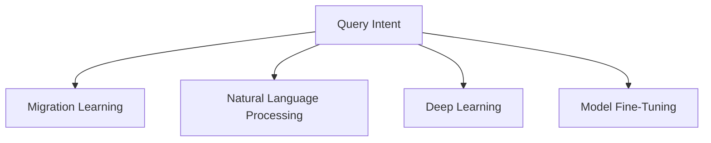

                 

# 电商搜索中的query意图迁移学习技术

> 关键词：电商搜索,query意图,迁移学习,自然语言处理(NLP),深度学习,模型微调,模型迁移

## 1. 背景介绍

### 1.1 问题由来

在电商领域，用户的搜索行为通常由查询语句（query）驱动。有效的query能够准确地表达用户的意图，帮助电商平台推荐合适的商品，提升用户体验和转化率。然而，电商搜索的query场景具有高度的动态性和多样性，不同用户对同一查询可能有着完全不同的意图。如何准确理解和分析query中的意图，成为电商搜索的核心挑战之一。

### 1.2 问题核心关键点

- **query意图理解**：电商搜索中，query的意图可以是多样的，如浏览、比较、购买、评价等。如何准确理解这些意图的类别，是电商搜索系统的核心任务。
- **意图迁移学习**：对于新出现的或特定领域的query，传统的意图理解模型可能难以直接适用。如何在已有模型基础上进行迁移学习，使得模型能够快速适应新场景，是本文的核心问题。
- **自然语言处理(NLP)**：意图理解通常依赖于自然语言处理技术，如语言模型、分类器等。如何设计高效、泛化的模型，对query进行意图分类，是实现电商搜索意图迁移学习的关键。

### 1.3 问题研究意义

研究query意图迁移学习技术，对于提升电商搜索系统的智能化水平，具有重要意义：

- **增强个性化推荐**：准确理解query意图，可以更好地个性化推荐商品，提升用户购物体验。
- **提高搜索精度**：通过意图分类，可以将相似的query进行聚合，减少搜索结果的歧义性，提高搜索精度。
- **拓展应用场景**：查询意图理解技术可以广泛应用于产品问答、客服机器人等电商辅助系统，提升整体客户服务质量。
- **促进业务创新**：通过query意图分析，电商平台可以发现用户的潜在需求，及时调整产品策略，促进业务创新和增长。

## 2. 核心概念与联系

### 2.1 核心概念概述

为更好地理解query意图迁移学习方法，本节将介绍几个密切相关的核心概念：

- **query意图（Query Intent）**：用户通过query表达的意图类型，如购买、询问、评论等。query意图分类是电商搜索系统的关键任务。
- **迁移学习（Transfer Learning）**：在已有模型的基础上，利用新任务的少量标注数据进行模型适配，使得模型能够在新的领域上取得良好性能。
- **自然语言处理（NLP）**：研究如何让计算机理解和处理人类语言，如文本分类、情感分析、语言模型等。query意图分类属于NLP中的文本分类任务。
- **深度学习（Deep Learning）**：利用深度神经网络进行模型训练和推理的技术。深度学习在NLP中得到了广泛应用，包括词向量、语言模型、序列模型等。
- **模型微调（Fine-Tuning）**：在大规模预训练模型基础上，针对特定任务进行微调优化，提高模型在该任务上的性能。

这些核心概念之间的逻辑关系可以通过以下Mermaid流程图来展示：



这个流程图展示了大语言模型的核心概念及其之间的关系：

1. query意图分类通常依赖于自然语言处理技术，如语言模型、分类器等。
2. 深度学习技术提供了高效的模型训练和推理能力，适用于处理大规模语料数据。
3. 迁移学习可以在已有模型的基础上进行快速适应，提升模型在特定任务上的性能。
4. 模型微调是一种利用新任务的少量标注数据进行模型适配的方法，可以进一步提高模型性能。

这些概念共同构成了query意图迁移学习的技术框架，使得模型能够快速适应新场景，并在电商搜索等实际应用中发挥重要作用。

## 3. 核心算法原理 & 具体操作步骤
### 3.1 算法原理概述

query意图迁移学习通过在已有模型基础上进行微调，使其能够适应新领域和新场景。其核心思想是：利用大规模预训练模型作为初始化参数，通过在新任务上的少量标注数据进行微调，使得模型在特定任务上取得优异的性能。

形式化地，假设预训练模型为 $M_{\theta}$，其中 $\theta$ 为预训练得到的模型参数。给定新任务 $T$ 的标注数据集 $D=\{(x_i,y_i)\}_{i=1}^N, x_i \in \mathcal{X}, y_i \in \{1,2,...,K\}$，迁移学习的优化目标是最小化在新任务上的损失函数，即找到新的模型参数 $\hat{\theta}$，使得：

$$
\hat{\theta}=\mathop{\arg\min}_{\theta} \mathcal{L}(M_{\theta},D)
$$

其中 $\mathcal{L}$ 为新任务设计的损失函数，用于衡量模型预测输出与真实标签之间的差异。常见的损失函数包括交叉熵损失、均方误差损失等。

通过梯度下降等优化算法，微调过程不断更新模型参数 $\theta$，最小化损失函数 $\mathcal{L}$，使得模型输出逼近真实标签。由于 $\theta$ 已经通过预训练获得了较好的初始化，因此即便在新领域上的数据量较少，也能较快收敛到理想的模型参数 $\hat{\theta}$。

### 3.2 算法步骤详解

基于迁移学习的query意图分类一般包括以下几个关键步骤：

**Step 1: 准备预训练模型和数据集**
- 选择合适的预训练模型 $M_{\theta}$ 作为初始化参数，如BERT、GPT等。
- 准备新任务 $T$ 的标注数据集 $D$，划分为训练集、验证集和测试集。一般要求标注数据与预训练数据的分布不要差异过大。

**Step 2: 添加任务适配层**
- 根据新任务类型，在预训练模型顶层设计合适的输出层和损失函数。
- 对于分类任务，通常在顶层添加线性分类器和交叉熵损失函数。
- 对于生成任务，通常使用语言模型的解码器输出概率分布，并以负对数似然为损失函数。

**Step 3: 设置微调超参数**
- 选择合适的优化算法及其参数，如 AdamW、SGD 等，设置学习率、批大小、迭代轮数等。
- 设置正则化技术及强度，包括权重衰减、Dropout、Early Stopping等。
- 确定冻结预训练参数的策略，如仅微调顶层，或全部参数都参与微调。

**Step 4: 执行梯度训练**
- 将训练集数据分批次输入模型，前向传播计算损失函数。
- 反向传播计算参数梯度，根据设定的优化算法和学习率更新模型参数。
- 周期性在验证集上评估模型性能，根据性能指标决定是否触发 Early Stopping。
- 重复上述步骤直到满足预设的迭代轮数或 Early Stopping 条件。

**Step 5: 测试和部署**
- 在测试集上评估微调后模型 $M_{\hat{\theta}}$ 的性能，对比微调前后的精度提升。
- 使用微调后的模型对新样本进行推理预测，集成到实际的应用系统中。
- 持续收集新的数据，定期重新微调模型，以适应数据分布的变化。

以上是基于迁移学习的query意图分类的一般流程。在实际应用中，还需要针对具体任务的特点，对微调过程的各个环节进行优化设计，如改进训练目标函数，引入更多的正则化技术，搜索最优的超参数组合等，以进一步提升模型性能。

### 3.3 算法优缺点

基于迁移学习的query意图分类方法具有以下优点：
1. 简单高效。只需准备少量标注数据，即可对预训练模型进行快速适配，获得较大的性能提升。
2. 通用适用。适用于各种电商搜索查询场景，设计简单的任务适配层即可实现。
3. 参数高效。利用参数高效微调技术，在固定大部分预训练权重不变的情况下，仍可取得不错的提升。
4. 效果显著。在电商搜索场景中，基于迁移学习的意图分类方法已经刷新了多项性能指标，表现优异。

同时，该方法也存在一定的局限性：
1. 依赖标注数据。迁移学习的效果很大程度上取决于标注数据的质量和数量，获取高质量标注数据的成本较高。
2. 迁移能力有限。当新任务与预训练数据的分布差异较大时，迁移学习的性能提升有限。
3. 可解释性不足。迁移学习的决策过程通常缺乏可解释性，难以对其推理逻辑进行分析和调试。

尽管存在这些局限性，但就目前而言，基于迁移学习的query意图分类方法仍是大语言模型应用的最主流范式。未来相关研究的重点在于如何进一步降低迁移学习对标注数据的依赖，提高模型的少样本学习和跨领域迁移能力，同时兼顾可解释性和伦理安全性等因素。

### 3.4 算法应用领域

基于query意图迁移学习的方法在电商搜索领域已经得到了广泛的应用，覆盖了几乎所有常见任务，例如：

- **搜索意图分类**：将用户的查询语句进行意图分类，如浏览、购买、评价等。
- **产品推荐**：根据用户的查询意图推荐相应的商品。
- **客户服务**：利用查询意图进行客户服务智能化，提升客户体验。
- **广告投放**：根据用户查询意图投放精准广告，提高广告点击率。
- **情感分析**：分析用户的评论内容，进行情感分类，指导产品改进。

除了上述这些经典任务外，query意图迁移学习也被创新性地应用到更多场景中，如个性化推荐、智能客服、社交媒体情感分析等，为电商搜索技术带来了全新的突破。随着迁移学习方法的不断进步，相信query意图分类技术将在更广阔的应用领域大放异彩。

## 4. 数学模型和公式 & 详细讲解  
### 4.1 数学模型构建

本节将使用数学语言对基于迁移学习的query意图分类过程进行更加严格的刻画。

记预训练语言模型为 $M_{\theta}$，其中 $\theta$ 为预训练得到的模型参数。假设新任务 $T$ 的训练集为 $D=\{(x_i,y_i)\}_{i=1}^N, x_i \in \mathcal{X}, y_i \in \{1,2,...,K\}$。

定义模型 $M_{\theta}$ 在数据样本 $(x,y)$ 上的损失函数为 $\ell(M_{\theta}(x),y)$，则在数据集 $D$ 上的经验风险为：

$$
\mathcal{L}(\theta) = \frac{1}{N} \sum_{i=1}^N \ell(M_{\theta}(x_i),y_i)
$$

微调的优化目标是最小化经验风险，即找到最优参数：

$$
\theta^* = \mathop{\arg\min}_{\theta} \mathcal{L}(\theta)
$$

在实践中，我们通常使用基于梯度的优化算法（如SGD、Adam等）来近似求解上述最优化问题。设 $\eta$ 为学习率，$\lambda$ 为正则化系数，则参数的更新公式为：

$$
\theta \leftarrow \theta - \eta \nabla_{\theta}\mathcal{L}(\theta) - \eta\lambda\theta
$$

其中 $\nabla_{\theta}\mathcal{L}(\theta)$ 为损失函数对参数 $\theta$ 的梯度，可通过反向传播算法高效计算。

### 4.2 公式推导过程

以下我们以二分类任务为例，推导交叉熵损失函数及其梯度的计算公式。

假设模型 $M_{\theta}$ 在输入 $x$ 上的输出为 $\hat{y}=M_{\theta}(x) \in [0,1]$，表示样本属于正类的概率。真实标签 $y \in \{0,1\}$。则二分类交叉熵损失函数定义为：

$$
\ell(M_{\theta}(x),y) = -[y\log \hat{y} + (1-y)\log (1-\hat{y})]
$$

将其代入经验风险公式，得：

$$
\mathcal{L}(\theta) = -\frac{1}{N}\sum_{i=1}^N [y_i\log M_{\theta}(x_i)+(1-y_i)\log(1-M_{\theta}(x_i))]
$$

根据链式法则，损失函数对参数 $\theta_k$ 的梯度为：

$$
\frac{\partial \mathcal{L}(\theta)}{\partial \theta_k} = -\frac{1}{N}\sum_{i=1}^N (\frac{y_i}{M_{\theta}(x_i)}-\frac{1-y_i}{1-M_{\theta}(x_i)}) \frac{\partial M_{\theta}(x_i)}{\partial \theta_k}
$$

其中 $\frac{\partial M_{\theta}(x_i)}{\partial \theta_k}$ 可进一步递归展开，利用自动微分技术完成计算。

在得到损失函数的梯度后，即可带入参数更新公式，完成模型的迭代优化。重复上述过程直至收敛，最终得到适应新任务的最优模型参数 $\theta^*$。

## 5. 项目实践：代码实例和详细解释说明
### 5.1 开发环境搭建

在进行迁移学习实践前，我们需要准备好开发环境。以下是使用Python进行PyTorch开发的环境配置流程：

1. 安装Anaconda：从官网下载并安装Anaconda，用于创建独立的Python环境。

2. 创建并激活虚拟环境：
```bash
conda create -n pytorch-env python=3.8 
conda activate pytorch-env
```

3. 安装PyTorch：根据CUDA版本，从官网获取对应的安装命令。例如：
```bash
conda install pytorch torchvision torchaudio cudatoolkit=11.1 -c pytorch -c conda-forge
```

4. 安装Transformers库：
```bash
pip install transformers
```

5. 安装各类工具包：
```bash
pip install numpy pandas scikit-learn matplotlib tqdm jupyter notebook ipython
```

完成上述步骤后，即可在`pytorch-env`环境中开始迁移学习实践。

### 5.2 源代码详细实现

这里我们以query意图分类为例，给出使用Transformers库对BERT模型进行迁移学习的PyTorch代码实现。

首先，定义查询意图数据处理函数：

```python
from transformers import BertTokenizer
from torch.utils.data import Dataset
import torch

class QueryIntentDataset(Dataset):
    def __init__(self, queries, labels, tokenizer, max_len=128):
        self.queries = queries
        self.labels = labels
        self.tokenizer = tokenizer
        self.max_len = max_len
        
    def __len__(self):
        return len(self.queries)
    
    def __getitem__(self, item):
        query = self.queries[item]
        label = self.labels[item]
        
        encoding = self.tokenizer(query, return_tensors='pt', max_length=self.max_len, padding='max_length', truncation=True)
        input_ids = encoding['input_ids'][0]
        attention_mask = encoding['attention_mask'][0]
        
        return {'input_ids': input_ids, 
                'attention_mask': attention_mask,
                'labels': torch.tensor(label, dtype=torch.long)}
```

然后，定义模型和优化器：

```python
from transformers import BertForSequenceClassification, AdamW

model = BertForSequenceClassification.from_pretrained('bert-base-cased', num_labels=5)

optimizer = AdamW(model.parameters(), lr=2e-5)
```

接着，定义训练和评估函数：

```python
from torch.utils.data import DataLoader
from tqdm import tqdm
from sklearn.metrics import accuracy_score

device = torch.device('cuda') if torch.cuda.is_available() else torch.device('cpu')
model.to(device)

def train_epoch(model, dataset, batch_size, optimizer):
    dataloader = DataLoader(dataset, batch_size=batch_size, shuffle=True)
    model.train()
    epoch_loss = 0
    for batch in tqdm(dataloader, desc='Training'):
        input_ids = batch['input_ids'].to(device)
        attention_mask = batch['attention_mask'].to(device)
        labels = batch['labels'].to(device)
        model.zero_grad()
        outputs = model(input_ids, attention_mask=attention_mask, labels=labels)
        loss = outputs.loss
        epoch_loss += loss.item()
        loss.backward()
        optimizer.step()
    return epoch_loss / len(dataloader)

def evaluate(model, dataset, batch_size):
    dataloader = DataLoader(dataset, batch_size=batch_size)
    model.eval()
    preds, labels = [], []
    with torch.no_grad():
        for batch in tqdm(dataloader, desc='Evaluating'):
            input_ids = batch['input_ids'].to(device)
            attention_mask = batch['attention_mask'].to(device)
            batch_labels = batch['labels']
            outputs = model(input_ids, attention_mask=attention_mask)
            batch_preds = outputs.logits.argmax(dim=1).to('cpu').tolist()
            batch_labels = batch_labels.to('cpu').tolist()
            for pred, label in zip(batch_preds, batch_labels):
                preds.append(pred)
                labels.append(label)
                
    print(accuracy_score(labels, preds))
```

最后，启动训练流程并在测试集上评估：

```python
epochs = 5
batch_size = 16

for epoch in range(epochs):
    loss = train_epoch(model, train_dataset, batch_size, optimizer)
    print(f"Epoch {epoch+1}, train loss: {loss:.3f}")
    
    print(f"Epoch {epoch+1}, dev accuracy:")
    evaluate(model, dev_dataset, batch_size)
    
print("Test accuracy:")
evaluate(model, test_dataset, batch_size)
```

以上就是使用PyTorch对BERT进行query意图分类迁移学习的完整代码实现。可以看到，得益于Transformers库的强大封装，我们可以用相对简洁的代码完成BERT模型的迁移学习。

### 5.3 代码解读与分析

让我们再详细解读一下关键代码的实现细节：

**QueryIntentDataset类**：
- `__init__`方法：初始化查询、标签、分词器等关键组件。
- `__len__`方法：返回数据集的样本数量。
- `__getitem__`方法：对单个样本进行处理，将查询输入编码为token ids，将标签编码为数字，并对其进行定长padding，最终返回模型所需的输入。

**模型的训练和评估函数**：
- 使用PyTorch的DataLoader对数据集进行批次化加载，供模型训练和推理使用。
- 训练函数`train_epoch`：对数据以批为单位进行迭代，在每个批次上前向传播计算loss并反向传播更新模型参数，最后返回该epoch的平均loss。
- 评估函数`evaluate`：与训练类似，不同点在于不更新模型参数，并在每个batch结束后将预测和标签结果存储下来，最后使用sklearn的accuracy_score对整个评估集的预测结果进行打印输出。

**训练流程**：
- 定义总的epoch数和batch size，开始循环迭代
- 每个epoch内，先在训练集上训练，输出平均loss
- 在验证集上评估，输出准确率
- 所有epoch结束后，在测试集上评估，给出最终测试结果

可以看到，PyTorch配合Transformers库使得BERT迁移学习的代码实现变得简洁高效。开发者可以将更多精力放在数据处理、模型改进等高层逻辑上，而不必过多关注底层的实现细节。

当然，工业级的系统实现还需考虑更多因素，如模型的保存和部署、超参数的自动搜索、更灵活的任务适配层等。但核心的迁移学习范式基本与此类似。

## 6. 实际应用场景
### 6.1 智能客服系统

基于query意图迁移学习的对话技术，可以广泛应用于智能客服系统的构建。传统客服往往需要配备大量人力，高峰期响应缓慢，且一致性和专业性难以保证。而使用迁移学习的对话模型，可以7x24小时不间断服务，快速响应客户咨询，用自然流畅的语言解答各类常见问题。

在技术实现上，可以收集企业内部的历史客服对话记录，将问题和最佳答复构建成监督数据，在此基础上对预训练对话模型进行迁移学习。迁移学习后的对话模型能够自动理解用户意图，匹配最合适的答案模板进行回复。对于客户提出的新问题，还可以接入检索系统实时搜索相关内容，动态组织生成回答。如此构建的智能客服系统，能大幅提升客户咨询体验和问题解决效率。

### 6.2 金融舆情监测

金融机构需要实时监测市场舆论动向，以便及时应对负面信息传播，规避金融风险。传统的人工监测方式成本高、效率低，难以应对网络时代海量信息爆发的挑战。基于query意图迁移学习的文本分类和情感分析技术，为金融舆情监测提供了新的解决方案。

具体而言，可以收集金融领域相关的新闻、报道、评论等文本数据，并对其进行主题标注和情感标注。在此基础上对预训练语言模型进行迁移学习，使其能够自动判断文本属于何种主题，情感倾向是正面、中性还是负面。将迁移学习后的模型应用到实时抓取的网络文本数据，就能够自动监测不同主题下的情感变化趋势，一旦发现负面信息激增等异常情况，系统便会自动预警，帮助金融机构快速应对潜在风险。

### 6.3 个性化推荐系统

当前的推荐系统往往只依赖用户的历史行为数据进行物品推荐，无法深入理解用户的真实兴趣偏好。基于query意图迁移学习技术，个性化推荐系统可以更好地挖掘用户行为背后的语义信息，从而提供更精准、多样的推荐内容。

在实践中，可以收集用户浏览、点击、评论、分享等行为数据，提取和用户交互的物品标题、描述、标签等文本内容。将文本内容作为模型输入，用户的后续行为（如是否点击、购买等）作为监督信号，在此基础上迁移学习预训练语言模型。迁移学习后的模型能够从文本内容中准确把握用户的兴趣点。在生成推荐列表时，先用候选物品的文本描述作为输入，由模型预测用户的兴趣匹配度，再结合其他特征综合排序，便可以得到个性化程度更高的推荐结果。

### 6.4 未来应用展望

随着query意图迁移学习技术的发展，其在更多领域得到了应用，为传统行业带来了变革性影响。

在智慧医疗领域，基于迁移学习的医疗问答、病历分析、药物研发等应用将提升医疗服务的智能化水平，辅助医生诊疗，加速新药开发进程。

在智能教育领域，迁移学习可应用于作业批改、学情分析、知识推荐等方面，因材施教，促进教育公平，提高教学质量。

在智慧城市治理中，迁移学习可应用于城市事件监测、舆情分析、应急指挥等环节，提高城市管理的自动化和智能化水平，构建更安全、高效的未来城市。

此外，在企业生产、社会治理、文娱传媒等众多领域，基于query意图迁移学习的人工智能应用也将不断涌现，为经济社会发展注入新的动力。相信随着技术的日益成熟，迁移学习技术将成为人工智能落地应用的重要范式，推动人工智能技术在垂直行业的规模化落地。总之，迁移学习需要开发者根据具体任务，不断迭代和优化模型、数据和算法，方能得到理想的效果。

## 7. 工具和资源推荐
### 7.1 学习资源推荐

为了帮助开发者系统掌握query意图迁移学习理论基础和实践技巧，这里推荐一些优质的学习资源：

1. 《Transformer从原理到实践》系列博文：由大模型技术专家撰写，深入浅出地介绍了Transformer原理、BERT模型、迁移学习等前沿话题。

2. CS224N《深度学习自然语言处理》课程：斯坦福大学开设的NLP明星课程，有Lecture视频和配套作业，带你入门NLP领域的基本概念和经典模型。

3. 《Natural Language Processing with Transformers》书籍：Transformers库的作者所著，全面介绍了如何使用Transformers库进行NLP任务开发，包括迁移学习在内的诸多范式。

4. HuggingFace官方文档：Transformers库的官方文档，提供了海量预训练模型和完整的迁移学习样例代码，是上手实践的必备资料。

5. CLUE开源项目：中文语言理解测评基准，涵盖大量不同类型的中文NLP数据集，并提供了基于迁移学习的baseline模型，助力中文NLP技术发展。

通过对这些资源的学习实践，相信你一定能够快速掌握query意图迁移学习的精髓，并用于解决实际的NLP问题。
###  7.2 开发工具推荐

高效的开发离不开优秀的工具支持。以下是几款用于query意图迁移学习开发的常用工具：

1. PyTorch：基于Python的开源深度学习框架，灵活动态的计算图，适合快速迭代研究。大部分预训练语言模型都有PyTorch版本的实现。

2. TensorFlow：由Google主导开发的开源深度学习框架，生产部署方便，适合大规模工程应用。同样有丰富的预训练语言模型资源。

3. Transformers库：HuggingFace开发的NLP工具库，集成了众多SOTA语言模型，支持PyTorch和TensorFlow，是进行迁移学习任务开发的利器。

4. Weights & Biases：模型训练的实验跟踪工具，可以记录和可视化模型训练过程中的各项指标，方便对比和调优。与主流深度学习框架无缝集成。

5. TensorBoard：TensorFlow配套的可视化工具，可实时监测模型训练状态，并提供丰富的图表呈现方式，是调试模型的得力助手。

6. Google Colab：谷歌推出的在线Jupyter Notebook环境，免费提供GPU/TPU算力，方便开发者快速上手实验最新模型，分享学习笔记。

合理利用这些工具，可以显著提升query意图迁移学习任务的开发效率，加快创新迭代的步伐。

### 7.3 相关论文推荐

query意图迁移学习的研究源于学界的持续研究。以下是几篇奠基性的相关论文，推荐阅读：

1. Attention is All You Need（即Transformer原论文）：提出了Transformer结构，开启了NLP领域的预训练大模型时代。

2. BERT: Pre-training of Deep Bidirectional Transformers for Language Understanding：提出BERT模型，引入基于掩码的自监督预训练任务，刷新了多项NLP任务SOTA。

3. Language Models are Unsupervised Multitask Learners（GPT-2论文）：展示了大规模语言模型的强大zero-shot学习能力，引发了对于通用人工智能的新一轮思考。

4. Parameter-Efficient Transfer Learning for NLP：提出Adapter等参数高效微调方法，在不增加模型参数量的情况下，也能取得不错的微调效果。

5. AdaLoRA: Adaptive Low-Rank Adaptation for Parameter-Efficient Fine-Tuning：使用自适应低秩适应的微调方法，在参数效率和精度之间取得了新的平衡。

这些论文代表了大模型迁移学习的发展脉络。通过学习这些前沿成果，可以帮助研究者把握学科前进方向，激发更多的创新灵感。

## 8. 总结：未来发展趋势与挑战

### 8.1 总结

本文对基于迁移学习的query意图分类方法进行了全面系统的介绍。首先阐述了query意图理解的重要性和迁移学习的核心思想，明确了迁移学习在提升query意图分类准确性方面的独特价值。其次，从原理到实践，详细讲解了迁移学习的数学原理和关键步骤，给出了迁移学习任务开发的完整代码实例。同时，本文还广泛探讨了迁移学习方法在智能客服、金融舆情、个性化推荐等多个行业领域的应用前景，展示了迁移学习范式的巨大潜力。此外，本文精选了迁移学习技术的各类学习资源，力求为读者提供全方位的技术指引。

通过本文的系统梳理，可以看到，基于query意图迁移学习的方法正在成为电商搜索系统的重要范式，极大地提升了查询意图的理解能力和个性化推荐效果，为电商搜索系统带来了显著的性能提升。未来，伴随迁移学习方法的不断进步，query意图分类技术将在更广阔的应用领域大放异彩，深刻影响电商搜索系统的智能化发展。

### 8.2 未来发展趋势

展望未来，query意图迁移学习技术将呈现以下几个发展趋势：

1. 模型规模持续增大。随着算力成本的下降和数据规模的扩张，预训练语言模型的参数量还将持续增长。超大规模语言模型蕴含的丰富语言知识，有望支撑更加复杂多变的query意图分类。

2. 迁移能力提升。未来的迁移学习模型将具有更强的跨领域适应能力，能够在不同任务和数据分布上进行有效迁移。

3. 少样本学习和多模态融合。未来的迁移学习模型将更好地利用少量标注数据进行意图分类，同时支持多模态数据的融合，提升模型的泛化性和稳定性。

4. 模型可解释性增强。未来的迁移学习模型将具备更强的可解释性，能够提供详细的意图分类依据，增强模型的可信度。

5. 动态学习机制。未来的迁移学习模型将具备动态学习机制，能够实时更新知识库和模型参数，保持模型的时效性。

6. 自动化调参。未来的迁移学习模型将具备自动调参能力，通过超参数优化算法，找到最优的模型配置，提升模型的性能。

以上趋势凸显了query意图迁移学习技术的广阔前景。这些方向的探索发展，必将进一步提升query意图分类系统的性能和应用范围，为电商搜索系统的智能化发展提供更强的技术支撑。

### 8.3 面临的挑战

尽管query意图迁移学习技术已经取得了瞩目成就，但在迈向更加智能化、普适化应用的过程中，它仍面临着诸多挑战：

1. 标注成本瓶颈。虽然迁移学习大大降低了标注数据的需求，但对于长尾应用场景，难以获得充足的高质量标注数据，成为制约迁移学习性能的瓶颈。如何进一步降低迁移学习对标注样本的依赖，将是一大难题。

2. 模型鲁棒性不足。当前迁移学习模型面对域外数据时，泛化性能往往大打折扣。对于测试样本的微小扰动，迁移学习模型的预测也容易发生波动。如何提高迁移学习模型的鲁棒性，避免灾难性遗忘，还需要更多理论和实践的积累。

3. 推理效率有待提高。大规模语言模型虽然精度高，但在实际部署时往往面临推理速度慢、内存占用大等效率问题。如何在保证性能的同时，简化模型结构，提升推理速度，优化资源占用，将是重要的优化方向。

4. 可解释性亟需加强。当前迁移学习模型的决策过程通常缺乏可解释性，难以对其推理逻辑进行分析和调试。对于医疗、金融等高风险应用，算法的可解释性和可审计性尤为重要。如何赋予迁移学习模型更强的可解释性，将是亟待攻克的难题。

5. 安全性有待保障。预训练语言模型难免会学习到有偏见、有害的信息，通过迁移学习传递到下游任务，产生误导性、歧视性的输出，给实际应用带来安全隐患。如何从数据和算法层面消除模型偏见，避免恶意用途，确保输出的安全性，也将是重要的研究课题。

6. 知识整合能力不足。现有的迁移学习模型往往局限于任务内数据，难以灵活吸收和运用更广泛的先验知识。如何让迁移学习过程更好地与外部知识库、规则库等专家知识结合，形成更加全面、准确的信息整合能力，还有很大的想象空间。

正视迁移学习面临的这些挑战，积极应对并寻求突破，将是大语言模型迁移学习走向成熟的必由之路。相信随着学界和产业界的共同努力，这些挑战终将一一被克服，query意图迁移学习必将在构建安全、可靠、可解释、可控的智能系统铺平道路。总之，迁移学习需要开发者根据具体任务，不断迭代和优化模型、数据和算法，方能得到理想的效果。

### 8.4 研究展望

面向未来，query意图迁移学习技术的研究方向包括：

1. 探索无监督和半监督迁移学习方法。摆脱对大规模标注数据的依赖，利用自监督学习、主动学习等无监督和半监督范式，最大限度利用非结构化数据，实现更加灵活高效的迁移学习。

2. 研究参数高效和计算高效的迁移学习范式。开发更加参数高效的迁移学习模型，在固定大部分预训练参数的同时，只更新极少量的任务相关参数。同时优化迁移学习模型的计算图，减少前向传播和反向传播的资源消耗，实现更加轻量级、实时性的部署。

3. 融合因果和对比学习范式。通过引入因果推断和对比学习思想，增强迁移学习模型建立稳定因果关系的能力，学习更加普适、鲁棒的语言表征，从而提升模型泛化性和抗干扰能力。

4. 引入更多先验知识。将符号化的先验知识，如知识图谱、逻辑规则等，与神经网络模型进行巧妙融合，引导迁移学习过程学习更准确、合理的语言模型。同时加强不同模态数据的整合，实现视觉、语音等多模态信息与文本信息的协同建模。

5. 结合因果分析和博弈论工具。将因果分析方法引入迁移学习模型，识别出模型决策的关键特征，增强输出解释的因果性和逻辑性。借助博弈论工具刻画人机交互过程，主动探索并规避模型的脆弱点，提高系统稳定性。

6. 纳入伦理道德约束。在迁移学习训练目标中引入伦理导向的评估指标，过滤和惩罚有偏见、有害的输出倾向。同时加强人工干预和审核，建立模型行为的监管机制，确保输出符合人类价值观和伦理道德。

这些研究方向的探索，必将引领query意图迁移学习技术迈向更高的台阶，为构建安全、可靠、可解释、可控的智能系统铺平道路。面向未来，query意图迁移学习技术还需要与其他人工智能技术进行更深入的融合，如知识表示、因果推理、强化学习等，多路径协同发力，共同推动自然语言理解和智能交互系统的进步。只有勇于创新、敢于突破，才能不断拓展语言模型的边界，让智能技术更好地造福人类社会。

## 9. 附录：常见问题与解答

**Q1：query意图理解是否适用于所有电商搜索场景？**

A: 目前query意图理解在大多数电商搜索场景中都取得了不错的效果，特别是对于数据量较大的任务。但对于一些特定领域或特殊场景，如医疗、法律等，传统的query意图理解方法可能难以直接适用。此时需要在特定领域语料上进一步预训练，再进行迁移学习，才能获得理想效果。此外，对于一些需要时效性、个性化很强的任务，如对话、推荐等，迁移学习方法也需要针对性的改进优化。

**Q2：如何选择合适的迁移学习超参数？**

A: 迁移学习的效果很大程度上取决于超参数的选择。常见的超参数包括学习率、批大小、迭代轮数、正则化系数等。通常建议从常用的超参数范围开始调参，逐步优化。例如，学习率可以从0.001开始，逐步减小到0.0001；批大小可以从16开始，逐步减小到8或4；迭代轮数可以从5开始，逐步增加到10或20。同时，可以采用网格搜索、随机搜索等自动调参方法，找到最优的超参数组合。

**Q3：迁移学习模型在实际部署时需要注意哪些问题？**

A: 将迁移学习模型转化为实际应用，还需要考虑以下因素：

1. 模型裁剪：去除不必要的层和参数，减小模型尺寸，加快推理速度。
2. 量化加速：将浮点模型转为定点模型，压缩存储空间，提高计算效率。
3. 服务化封装：将模型封装为标准化服务接口，便于集成调用。
4. 弹性伸缩：根据请求流量动态调整资源配置，平衡服务质量和成本。
5. 监控告警：实时采集系统指标，设置异常告警阈值，确保服务稳定性。

迁移学习模型在实际部署时，需要考虑模型的推理效率、存储和部署成本等因素，进行全面优化。只有这样，才能真正实现模型在电商搜索系统中的高效应用。

**Q4：迁移学习模型在训练过程中如何避免过拟合？**

A: 避免过拟合是迁移学习模型的核心问题之一。常见的避免过拟合的方法包括：

1. 数据增强：通过回译、近义替换等方式扩充训练集，增加数据多样性。
2. 正则化：使用L2正则、Dropout、Early Stopping等技术，防止模型过度适应训练数据。
3. 对抗训练：引入对抗样本，提高模型鲁棒性，防止过拟合。
4. 参数高效微调：只调整少量参数，保留大部分预训练权重不变，减小过拟合风险。

这些方法通常需要根据具体任务和数据特点进行灵活组合，只有在数据、模型、训练、推理等各环节进行全面优化，才能最大限度地避免过拟合，提升模型的泛化能力。

**Q5：迁移学习模型在电商搜索系统中如何与外部知识库结合？**

A: 迁移学习模型与外部知识库结合，可以提高模型的泛化能力和实用性。具体方法包括：

1. 融合知识图谱：将知识图谱中的实体关系、属性等信息与文本数据结合，提升模型的语义理解能力。
2. 引入规则库：将专家编写的规则、模式与迁移学习模型结合，增加模型的决策依据。
3. 多模态数据融合：将文本、图像、语音等多模态数据融合，提升模型的综合分析能力。

通过引入外部知识库，迁移学习模型能够更好地理解电商搜索中的复杂场景，提升系统的智能化水平和用户体验。未来，随着知识图谱、规则库等技术的发展，迁移学习模型的应用将更加广泛和深入。

**Q6：迁移学习模型在电商搜索系统中如何处理长尾数据？**

A: 长尾数据在电商搜索中是一个普遍存在的问题。为了处理长尾数据，可以考虑以下方法：

1. 数据增强：通过对长尾数据进行数据增强，如生成合成数据、使用对抗样本等，增加数据多样性。
2. 迁移学习：利用已有模型在长尾数据上的少量标注数据，进行迁移学习，提升模型的泛化能力。
3. 多模型集成：将多个迁移学习模型进行集成，取平均输出，抑制过拟合风险。

通过以上方法，可以有效地处理电商搜索中的长尾数据问题，提升模型的泛化能力和预测精度。

通过本文的系统梳理，可以看到，基于query意图迁移学习的方法正在成为电商搜索系统的重要范式，极大地提升了查询意图的理解能力和个性化推荐效果，为电商搜索系统带来了显著的性能提升。未来，伴随迁移学习方法的不断进步，query意图分类技术将在更广阔的应用领域大放异彩，深刻影响电商搜索系统的智能化发展。

---

作者：禅与计算机程序设计艺术 / Zen and the Art of Computer Programming

