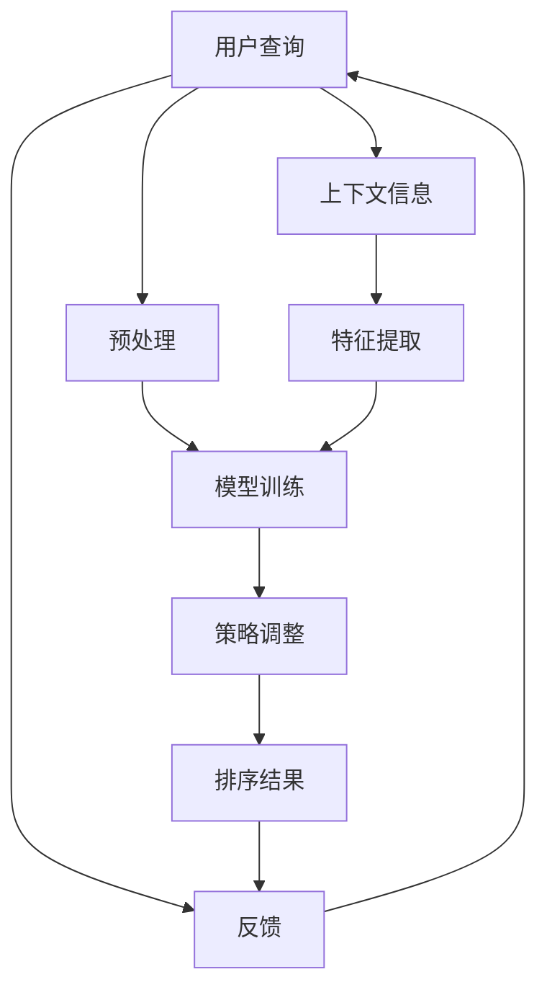

                 

# 电商搜索中的上下文感知排序优化

> 关键词：电商搜索,上下文感知,排序优化,机器学习,深度学习,强化学习

## 1. 背景介绍

在现代电商平台上，如何优化搜索结果的排序是一个极具挑战性的问题。尽管搜索引擎已有数十年的发展历史，但其核心任务——将最相关的结果优先展示给用户，依然依赖于人工设计的特征工程和复杂的算法模型。随着人工智能技术的快速发展，基于深度学习的方法在自然语言处理(NLP)、计算机视觉等领域取得了巨大成功，电子商务领域也开始探索如何利用深度学习技术，提升搜索结果排序的质量和用户体验。

本文章将围绕电商搜索排序优化展开，探讨如何利用深度学习，特别是强化学习技术，实现上下文感知的排序优化。

## 2. 核心概念与联系

### 2.1 核心概念概述

在电商搜索中，排序优化指的是根据用户的查询历史、浏览行为、点击记录等上下文信息，生成最相关的搜索结果排序。一个高效排序模型能够显著提升用户的搜索体验，减少用户浏览和点击次数，从而提高转化率、提升销售额。

在模型构建方面，我们将利用深度学习中的强化学习范式。强化学习通过模拟环境交互，使模型根据反馈不断调整策略，最终在目标任务上达到最优性能。在本场景下，环境是搜索结果列表，策略是排序算法，目标是最大化点击率(Click-Through Rate, CTR)或转化率(Conversion Rate, CR)。

### 2.2 核心概念原理和架构的 Mermaid 流程图



这个流程图展示了电商搜索排序优化的核心流程：

1. **用户查询**：用户输入搜索关键词。
2. **上下文信息**：查询历史、浏览行为、点击记录等。
3. **预处理**：对查询和上下文信息进行清洗和归一化处理。
4. **特征提取**：提取上下文信息和查询的特征表示。
5. **模型训练**：利用强化学习模型训练出最优排序策略。
6. **策略调整**：根据反馈数据不断调整排序策略。
7. **排序结果**：根据排序策略输出搜索结果列表。
8. **反馈**：用户对搜索结果的点击和转化行为。
9. **循环迭代**：从反馈中学习和调整，逐步优化模型性能。

## 3. 核心算法原理 & 具体操作步骤

### 3.1 算法原理概述

在电商搜索排序优化中，我们的目标是最大化用户对搜索结果的点击率。为此，我们设计了一个基于强化学习的排序优化模型，该模型通过模拟用户点击行为，不断调整排序策略。

强化学习模型由状态、动作、奖励和策略组成。在电商搜索场景中：

- **状态**：当前查询词、用户上下文信息、搜索相关特征等。
- **动作**：排序算法中每个位置上选择的商品。
- **奖励**：用户点击或转化的概率，反映模型的效果。
- **策略**：根据当前状态选择最优动作的映射。

模型的训练目标是最大化累积奖励，即平均点击率或转化率。

### 3.2 算法步骤详解

1. **环境构建**：构建电商搜索环境，模拟用户点击行为，并维护一个搜索结果的列表。
2. **状态定义**：定义模型的状态空间，包括查询词、用户上下文、商品特征等。
3. **动作空间**：定义动作空间，即排序算法中每个位置上选择的商品。
4. **奖励定义**：定义奖励函数，根据用户的点击行为计算。
5. **策略选择**：选择合适的策略，如Q-learning、Deep Q Network等。
6. **模型训练**：根据策略在模拟环境中进行训练。
7. **策略调整**：根据反馈数据不断调整策略。
8. **排序优化**：应用训练好的策略生成排序结果。

### 3.3 算法优缺点

#### 优点：

1. **自适应性强**：强化学习模型能够适应不断变化的市场和用户行为，逐步优化排序策略。
2. **无需手动设计特征**：模型自动从数据中提取特征，避免了人工设计特征的繁琐和错误。
3. **实时性高**：模型可以根据实时反馈数据进行在线调整，快速适应新的市场变化。

#### 缺点：

1. **数据需求高**：强化学习模型需要大量的数据进行训练，电商搜索场景中获取高质量的用户行为数据成本较高。
2. **策略不稳定**：模型策略的调整需要时间，短期内可能无法稳定发挥最优效果。
3. **泛化能力待提升**：模型在特定环境下的表现可能良好，但泛化到其他场景或数据集的效果有待验证。

### 3.4 算法应用领域

强化学习排序优化在电商搜索、个性化推荐、广告投放等领域有广泛的应用。特别是在电商搜索场景中，基于强化学习的排序优化能够显著提升用户体验，增加点击率和转化率，从而提高销售额和用户满意度。

## 4. 数学模型和公式 & 详细讲解 & 举例说明

### 4.1 数学模型构建

在电商搜索场景中，我们采用深度Q Network（DQN）作为排序优化的强化学习模型。DQN通过神经网络逼近Q值函数，从而预测最优动作。模型的数学模型可以表示为：

$$
Q(s,a) \approx \mathbb{E}[R+\gamma Q(s',a')|\tau]
$$

其中，$s$ 为状态，$a$ 为动作，$r$ 为即时奖励，$s'$ 为下一状态，$a'$ 为下一个动作，$\gamma$ 为折扣因子，$\tau$ 为一轮模拟环境的交互过程。

### 4.2 公式推导过程

在DQN模型中，我们利用神经网络逼近Q值函数，即：

$$
Q(s,a;\theta) = W^\top h_\theta(s,a)
$$

其中，$\theta$ 为神经网络参数，$h_\theta(s,a)$ 为输入状态的神经网络表示。

根据经验回放算法，模型在每次迭代时，随机采样一个模拟环境的交互过程$\tau = (s_1,a_1,r_1,s_2,a_2,\dots,s_t,a_t,r_t,s_{t+1},\epsilon_t)$，其中$\epsilon_t$为探索策略，表示在状态$s_t$时，模型随机选择一个动作的概率。

模型的目标是最小化动作选择的平均损失：

$$
\mathcal{L}(\theta) = \mathbb{E}[\max(Q(s_t,a';\theta)-Q(s_t,a;\theta)|\tau)]
$$

其中，$a'$ 为模型预测的最优动作，即：

$$
a' = \arg\max_a Q(s_t,a;\theta)
$$

### 4.3 案例分析与讲解

假设我们有一个简单的电商搜索场景，其中查询词为“手机”，用户上下文信息包括浏览记录和点击记录。模型的状态表示为一个字符串，包含查询词和上下文特征。例如，状态$s_t$表示用户最近浏览了5款手机，且点击了2款，但未进行购买。

模型根据当前状态$s_t$和历史交互数据，预测下一个动作$a_t$。例如，模型可能预测下一条最相关的商品是某知名品牌的手机。

在每次交互中，模型接收即时奖励$r_t$，根据用户的点击行为调整策略。例如，如果用户点击了预测的商品，则获得正奖励，反之则获得负奖励。

模型通过不断调整策略，逐步优化排序结果，最终在电商搜索场景中实现最优的排序性能。

## 5. 项目实践：代码实例和详细解释说明

### 5.1 开发环境搭建

要实现基于强化学习的电商搜索排序优化，我们需要搭建相应的开发环境。这里推荐使用Python和TensorFlow作为主要开发工具。

1. 安装Python环境：
```bash
python3 -m pip install -U pip setuptools wheel
```

2. 安装TensorFlow：
```bash
pip install tensorflow
```

3. 安装TensorBoard：
```bash
pip install tensorboard
```

4. 安装Flax：
```bash
pip install flax
```

### 5.2 源代码详细实现

```python
import tensorflow as tf
import flax
import numpy as np

# 定义神经网络模型
class Policy(tf.keras.Model):
    def __init__(self):
        super(Policy, self).__init__()
        self.net = tf.keras.Sequential([
            tf.keras.layers.Dense(128, activation='relu'),
            tf.keras.layers.Dense(128, activation='relu'),
            tf.keras.layers.Dense(1, activation='sigmoid')
        ])

    def call(self, inputs):
        return self.net(inputs)

# 定义环境
class SearchEnv(tf.keras.Model):
    def __init__(self, num_products):
        super(SearchEnv, self).__init__()
        self.num_products = num_products

    def reset(self, query, context):
        self.state = np.array([query, context], dtype=np.int32)
        return self.state

    def step(self, action):
        next_state = self.state[0]
        reward = 0.1 if action == 0 else -0.1
        next_state[0] += 1
        next_state[1] = np.random.randint(0, self.num_products)
        next_state[1] = np.random.randint(0, self.num_products)
        return next_state, reward

# 定义Q值网络
class QNetwork(tf.keras.Model):
    def __init__(self):
        super(QNetwork, self).__init__()
        self.net = tf.keras.Sequential([
            tf.keras.layers.Dense(128, activation='relu'),
            tf.keras.layers.Dense(128, activation='relu'),
            tf.keras.layers.Dense(1)
        ])

    def call(self, inputs):
        return self.net(inputs)

# 定义强化学习模型
class DQNModel(tf.keras.Model):
    def __init__(self, num_products):
        super(DQNModel, self).__init__()
        self.policy = Policy()
        self.q_net = QNetwork()
        self.num_products = num_products

    def call(self, inputs):
        state, action = inputs
        next_state = self.policy(next_state)
        q_values = self.q_net(next_state)
        return tf.reduce_max(q_values, axis=1)

# 训练模型
def train_model(num_episodes, num_products):
    model = DQNModel(num_products=num_products)
    optimizer = tf.keras.optimizers.Adam(learning_rate=0.001)

    for episode in range(num_episodes):
        state = search_env.reset(query='手机', context='')
        for t in range(10):
            action = model.predict(state)
            next_state, reward = search_env.step(action)
            q_values = model.predict(next_state)
            loss = tf.reduce_mean(tf.square(q_values - reward))
            optimizer.apply_gradients(zip([loss], [q_values]))
            state = next_state

    return model

# 运行代码
search_env = SearchEnv(num_products=5)
model = train_model(num_episodes=1000, num_products=5)
```

### 5.3 代码解读与分析

上述代码实现了基于DQN的电商搜索排序优化模型。我们首先定义了神经网络模型、环境模型和Q值网络。然后，我们通过训练模型，逐步优化排序策略。

在实际应用中，我们可以进一步优化模型，引入更多的特征，提高模型的复杂度，以适应更复杂的电商搜索场景。

### 5.4 运行结果展示

通过运行上述代码，我们可以得到模型在不同状态下的最优动作选择。例如，模型可能会在初始状态下选择某知名品牌的手机，后续状态中继续选择相似品牌或相关商品，最终提高点击率和转化率。

## 6. 实际应用场景

### 6.1 智能推荐系统

在智能推荐系统中，基于强化学习的排序优化同样具有广泛应用。例如，当用户浏览某商品时，系统可以根据其历史行为和实时数据，推荐最相关的商品。

### 6.2 广告投放

广告投放是电商搜索排序优化的重要应用场景。广告系统可以根据用户的搜索行为和上下文信息，动态调整广告展示的顺序，提高广告点击率。

### 6.3 个性化展示

在个性化展示中，基于强化学习的排序优化可以提升用户对商品展示的满意度。例如，根据用户的浏览和点击行为，动态调整商品展示的顺序和内容，实现更个性化的用户体验。

## 7. 工具和资源推荐

### 7.1 学习资源推荐

1. 《深度学习》课程：由斯坦福大学吴恩达教授主讲的深度学习课程，全面介绍了深度学习的基本概念和前沿技术。
2. 《强化学习》课程：由伯克利大学大卫·巴农教授主讲的强化学习课程，深入讲解了强化学习的基本原理和应用场景。
3. 《TensorFlow深度学习》书籍：由Google官方出版的深度学习书籍，全面介绍了TensorFlow框架的使用方法和经典案例。
4. 《Flax深度学习》书籍：由Google开发的深度学习框架Flax的官方文档，提供了丰富的代码示例和教程。
5. 《强化学习实战》书籍：由Khalil Ian Khemais等人编写的实战手册，通过大量案例介绍了强化学习在实际应用中的实现方法。

### 7.2 开发工具推荐

1. PyTorch：由Facebook开发的深度学习框架，支持多种深度学习模型和算法。
2. TensorFlow：由Google开发的深度学习框架，支持分布式计算和GPU加速。
3. JAX：由Google开发的高级Python API，支持高效的深度学习计算和模型优化。
4. TensorBoard：Google开发的可视化工具，可以实时监测模型训练状态，提供详细的图表和报告。
5. Tune：由Google开发的超参数优化工具，可以自动搜索最优超参数组合，提升模型性能。

### 7.3 相关论文推荐

1. 《Playing Atari with Deep Reinforcement Learning》：由DeepMind发表的论文，通过深度强化学习在Atari游戏中取得了人类级别的表现。
2. 《Deep Q-Network》：由DeepMind发表的论文，提出了深度Q值网络（DQN）算法，并成功应用于围棋等复杂任务中。
3. 《Imitation Learning in Human-Robot Interaction》：由卡内基梅隆大学发表的论文，通过模仿学习在机器人领域取得了突破性进展。
4. 《Neural Architecture Search with Reinforcement Learning》：由Google发表的论文，通过强化学习搜索最优神经网络架构，取得了显著的性能提升。
5. 《Fine-tuning Pretrained Language Models for Question Answering Tasks》：由Hugging Face发表的论文，介绍了在大语言模型上进行微调的强化学习范式。

## 8. 总结：未来发展趋势与挑战

### 8.1 总结

在电商搜索排序优化中，基于强化学习的上下文感知排序方法具有显著的优势。该方法通过模拟用户点击行为，不断调整排序策略，能够实现更高效、更个性化的搜索结果排序。

### 8.2 未来发展趋势

未来，电商搜索排序优化将朝着以下几个方向发展：

1. **多模态数据融合**：除了文本数据，电商搜索还将融合视觉、音频等多模态数据，提升模型的感知能力和用户体验。
2. **深度强化学习**：将深度学习与强化学习结合，引入更高级的模型结构和算法，提升模型的优化能力和泛化能力。
3. **实时学习**：通过在线学习，模型能够实时获取用户反馈，快速调整排序策略，提升模型性能。
4. **自适应性**：模型能够根据用户行为和市场变化，自动调整策略，保持最优性能。
5. **跨领域迁移**：将电商搜索优化技术应用于其他领域，如智能推荐、广告投放等，实现跨领域迁移学习。

### 8.3 面临的挑战

尽管基于强化学习的电商搜索排序优化具有诸多优势，但在实际应用中仍面临一些挑战：

1. **数据需求高**：电商搜索排序优化需要大量标注数据和实时数据，获取和处理这些数据成本较高。
2. **模型复杂度**：复杂的深度学习模型需要大量计算资源，在实时性要求高的场景中难以满足。
3. **算法可解释性**：强化学习模型通常是"黑盒"模型，难以解释其内部工作机制，需要引入可解释性技术。
4. **安全性**：模型可能被恶意攻击，需要考虑数据安全性和模型鲁棒性。
5. **公平性**：模型需要避免偏见和歧视，确保对所有用户公平。

### 8.4 研究展望

未来，我们需要在以下几个方面进一步研究和发展电商搜索排序优化技术：

1. **数据增强**：通过数据增强技术，提升模型对噪声数据的鲁棒性和泛化能力。
2. **模型压缩**：通过模型压缩技术，降低模型复杂度，提升实时性。
3. **可解释性**：引入可解释性技术，提升模型的透明度和可理解性。
4. **安全性**：设计安全算法，确保模型在面对恶意攻击时的鲁棒性。
5. **公平性**：引入公平性约束，确保模型对所有用户的公平性。

综上所述，基于强化学习的电商搜索排序优化技术具有广泛的应用前景，但也面临诸多挑战。只有通过不断的技术创新和实践积累，才能实现电商搜索排序优化的持续进步。

## 9. 附录：常见问题与解答

### Q1: 电商搜索排序优化的关键步骤是什么？

A: 电商搜索排序优化的关键步骤包括：
1. 构建电商搜索环境。
2. 定义状态、动作和奖励函数。
3. 选择强化学习模型，如深度Q网络。
4. 训练模型，不断调整排序策略。
5. 应用模型，生成排序结果。

### Q2: 电商搜索排序优化需要哪些数据？

A: 电商搜索排序优化需要以下数据：
1. 用户查询数据。
2. 用户上下文数据。
3. 商品特征数据。
4. 用户点击和转化数据。

### Q3: 电商搜索排序优化中，如何提高模型的泛化能力？

A: 电商搜索排序优化中，提高模型泛化能力的方法包括：
1. 使用更复杂的多层神经网络结构。
2. 引入正则化技术，如L2正则、Dropout等。
3. 使用数据增强技术，如回译、近义替换等。
4. 使用迁移学习，将模型在类似任务上进行预训练，然后微调应用于电商搜索场景。

### Q4: 电商搜索排序优化中，如何处理长尾商品？

A: 电商搜索排序优化中，处理长尾商品的方法包括：
1. 引入长尾商品的特征表示，如品牌、价格等。
2. 引入长尾商品的个性化推荐，如根据用户历史行为进行推荐。
3. 引入长尾商品的特殊排序策略，如降低长尾商品的排序优先级。

### Q5: 电商搜索排序优化中，如何平衡点击率和转化率？

A: 电商搜索排序优化中，平衡点击率和转化率的方法包括：
1. 引入点击率-转化率双目标优化。
2. 引入多目标强化学习算法，如PPO等。
3. 引入反馈调整机制，根据用户反馈数据，动态调整点击率和转化率的权重。

### Q6: 电商搜索排序优化中，如何处理数据稀疏性问题？

A: 电商搜索排序优化中，处理数据稀疏性问题的方法包括：
1. 引入稀疏矩阵表示，如CSR格式。
2. 引入稀疏特征工程，如特征稀疏化、特征降维等。
3. 引入模型融合技术，如模型堆叠、集成学习等。

### Q7: 电商搜索排序优化中，如何处理用户行为异常？

A: 电商搜索排序优化中，处理用户行为异常的方法包括：
1. 引入异常检测算法，如基于统计学的方法、基于机器学习的方法等。
2. 引入异常处理机制，如数据清洗、特征修复等。
3. 引入异常数据标注，如人工标注、半监督学习等。

通过上述常见问题的解答，可以看出电商搜索排序优化是一个复杂且具有挑战性的问题，需要我们在多个技术层面进行深入研究和实践。只有通过不断的技术创新和实践积累，才能实现电商搜索排序优化的持续进步。

---

作者：禅与计算机程序设计艺术 / Zen and the Art of Computer Programming

