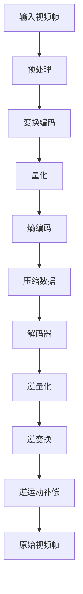

                 

### 背景介绍（Background Introduction）

快手作为全球领先的短视频社交平台，其核心业务依赖于大规模的视频内容和用户互动。然而，随着用户生成内容（UGC）的快速增长，如何高效地处理和传输这些视频成为了一个巨大的挑战。视频压缩算法作为一种关键技术，能够显著降低视频文件的大小，提高传输效率，优化用户体验，从而在快手的业务运作中扮演着至关重要的角色。

#### 视频压缩算法的必要性

视频压缩算法的主要目标是在保证视频质量的前提下，尽可能减少视频文件的大小。这是因为：

1. **存储效率提升**：随着用户上传视频的数量不断增加，服务器存储空间的需求也在增长。通过压缩算法，可以有效减少所需存储空间，降低成本。
2. **传输效率优化**：在网络传输过程中，较小的文件体积意味着更快的下载和加载速度，尤其是在网络带宽有限的情况下，这一点尤为重要。
3. **终端设备性能提升**：在移动设备上，尤其是老旧设备上，加载和处理高清视频可能会造成性能瓶颈。压缩后的视频文件可以减轻设备负担，提高用户体验。

#### 快手对视频压缩算法的需求

快手平台具有以下特点，这些特点决定了快手对视频压缩算法的需求：

1. **多样化的用户需求**：快手用户群体广泛，包括大量视频创作者和观看者，他们对视频质量和观看体验有着不同的期望。
2. **高频次的视频互动**：快手用户频繁地进行点赞、评论、分享等互动行为，这意味着平台需要处理大量的视频数据。
3. **实时性要求**：快手强调内容的即时性，要求视频能够快速上传、传输和播放，因此实时性是视频压缩算法需要重点考虑的因素。

#### 当前视频压缩算法的发展趋势

视频压缩算法的发展经历了多个阶段，从早期的基本压缩技术到现代的高级压缩标准。当前，视频压缩算法的发展趋势主要包括：

1. **高效压缩算法**：如HEVC（H.265）和AV1，这些算法在保证视频质量的同时，提供了更高的压缩效率。
2. **智能压缩技术**：结合人工智能和机器学习技术，智能压缩算法可以根据视频内容和用户特征进行自适应调整，进一步提高压缩效率和视频质量。
3. **多屏幕适配**：随着多种设备的普及，视频压缩算法需要能够适应不同的屏幕分辨率和观看环境，提供最优的观看体验。

在接下来的章节中，我们将深入探讨快手视频压缩算法的核心概念、原理及其具体实现，结合实际案例和数学模型，分析其在快手平台上的应用效果和未来发展趋势。

### 核心概念与联系（Core Concepts and Connections）

#### 视频压缩算法的基本原理

视频压缩算法的核心目标是在保证视频质量的同时，尽可能地减少数据量。这一过程通常涉及两个主要阶段：视频编码和解码。

##### 视频编码（Video Coding）

视频编码是将连续的视频帧转换为一系列压缩数据的过程。其主要原理包括：

1. **时间域压缩**：通过消除连续帧之间的冗余信息，如运动补偿（Motion Compensation），来减少数据量。
2. **空间域压缩**：通过减少图像中不重要的细节信息，如变换编码（Transformation Coding）和量化（Quantization），来进一步降低数据量。

##### 视频解码（Video Decoding）

视频解码是将压缩数据重新转换为视频帧的过程，以便在播放时可以流畅地显示。其主要步骤包括：

1. **逆量化**：恢复量化过程中丢失的细节信息。
2. **逆变换**：恢复原始图像数据。
3. **逆运动补偿**：重建原始的视频帧。

#### 快手视频压缩算法的技术架构

快手视频压缩算法的技术架构通常包括以下几个关键组件：

1. **编码器（Encoder）**：负责将原始视频帧转换为压缩数据。编码器通常包含预处理、变换编码、量化、熵编码等多个模块。
2. **解码器（Decoder）**：负责将压缩数据还原为原始视频帧。解码器与编码器相对应，执行逆量化、逆变换、逆运动补偿等操作。
3. **自适应调整模块（Adaptive Adjustment Module）**：根据视频内容和用户需求，动态调整压缩参数，以实现最优的压缩效果。

#### 核心概念原理和架构的 Mermaid 流程图

为了更直观地展示快手视频压缩算法的核心概念和架构，我们可以使用 Mermaid 流程图来描述其主要流程。



在这个流程图中：

- **A 输入视频帧**：原始视频数据输入编码器。
- **B 预处理**：进行必要的预处理操作，如颜色空间转换、去噪等。
- **C 变换编码**：将视频帧转换为频域表示，以去除冗余信息。
- **D 量化**：减少图像中不重要的细节，进一步压缩数据。
- **E 熵编码**：使用变长编码技术，如 Huffman 编码，对数据进行进一步压缩。
- **F 压缩数据**：输出压缩后的视频数据。
- **G 解码器**：接收压缩数据并开始解码过程。
- **H 逆量化**：恢复量化过程中丢失的细节。
- **I 逆变换**：将频域表示转换为原始图像数据。
- **J 逆运动补偿**：重建原始视频帧。
- **K 原始视频帧**：输出解码后的原始视频帧。

#### 快手视频压缩算法与现有技术的联系与区别

快手视频压缩算法不仅吸收了传统视频压缩技术的优点，还在多个方面进行了创新和优化：

1. **与 H.264/H.265 的联系**：
   - 快手视频压缩算法借鉴了 H.264/H.265 的变换编码和熵编码技术，但在量化步骤和自适应调整方面进行了改进。
   - H.264/H.265 主要关注于标准化的压缩方案，而快手视频压缩算法则更注重实际应用中的性能和用户体验。

2. **与 AV1 的区别**：
   - AV1 是一种基于人工智能的开放视频编码标准，其目标是在保证高质量的同时提供更高的压缩效率。
   - 与 AV1 相比，快手视频压缩算法更注重与现有技术的兼容性和实际应用场景的适应性，同时结合了更多的自适应调整机制。

#### 结论

快手视频压缩算法在保证视频质量的同时，通过优化编码和解码过程，实现了高效的视频压缩和传输。其核心概念和架构如图所示，通过不断的创新和优化，快手视频压缩算法在快手的业务中发挥了重要作用，为用户提供了更好的观看体验。在接下来的章节中，我们将进一步探讨快手视频压缩算法的具体实现和数学模型。

### 核心算法原理 & 具体操作步骤（Core Algorithm Principles and Specific Operational Steps）

快手视频压缩算法的设计和实现主要基于一系列高效的视频编码技术，包括变换编码、量化、熵编码等。下面，我们将详细探讨这些核心算法的原理，以及具体的操作步骤。

#### 变换编码（Transformation Coding）

变换编码是视频压缩算法中的关键步骤之一，其目的是将图像从空间域转换到频域，以便去除冗余信息。常用的变换编码方法包括离散余弦变换（DCT）和小波变换（Wavelet Transform）。

1. **离散余弦变换（DCT）**：
   - **原理**：DCT 将图像数据分解为不同频率的系数，这些系数代表图像中的主要特征。
   - **操作步骤**：
     1. 对于每个图像块，计算其 DCT 系数。
     2. 将 DCT 系数排序，保留重要的低频系数，丢弃不重要的高频系数。
     3. 对低频系数进行量化，进一步压缩数据。
   - **优点**：DCT 具有较好的能量集中特性，可以显著减少冗余信息。

2. **小波变换（Wavelet Transform）**：
   - **原理**：小波变换通过多尺度分析，将图像数据分解为不同尺度的系数，这些系数反映了图像在不同尺度上的细节。
   - **操作步骤**：
     1. 选择合适的小波基函数，对图像进行小波分解。
     2. 对各层小波系数进行阈值处理，去除噪声和冗余信息。
     3. 对剩余的系数进行量化，压缩数据。
   - **优点**：小波变换适合处理图像的时频特性，可以更好地保留图像细节。

#### 量化（Quantization）

量化是变换编码后的一个重要步骤，其目的是减少数据量。量化通过将连续的变换系数映射到有限的数值集合中来实现。

1. **原理**：
   - **原理**：量化器将变换系数按照一定的比例进行缩小，从而减少数据精度，实现数据压缩。
   - **操作步骤**：
     1. 选择合适的量化步长。
     2. 对变换系数进行四舍五入或截断，映射到量化集合中。

2. **量化步长的选择**：
   - **低频系数**：由于低频系数通常包含图像的主要信息，量化步长可以相对较小，以保持较高的图像质量。
   - **高频系数**：高频系数通常包含不重要的细节信息，量化步长可以相对较大，以进一步减少数据量。

#### 熵编码（Entropy Coding）

熵编码是一种无损数据压缩技术，其目的是进一步减少数据中的冗余信息。常用的熵编码方法包括霍夫曼编码（Huffman Coding）和算术编码（Arithmetic Coding）。

1. **霍夫曼编码（Huffman Coding）**：
   - **原理**：霍夫曼编码基于频率统计，对出现频率较高的符号分配较短码字，对出现频率较低的符号分配较长码字。
   - **操作步骤**：
     1. 统计各个符号的出现频率。
     2. 构建霍夫曼树，根据频率排序生成码字。
     3. 对数据进行编码，生成压缩后的数据。

2. **算术编码（Arithmetic Coding）**：
   - **原理**：算术编码将整个数据流映射到一个区间内，根据概率分布选择一个较小的子区间进行编码。
   - **操作步骤**：
     1. 初始化区间，通常为 [0, 1]。
     2. 对于每个符号，根据其概率分布调整区间。
     3. 输出区间的端点，作为编码结果。

#### 快手视频压缩算法的具体实现步骤

1. **预处理**：
   - **图像块划分**：将视频帧划分为固定大小的图像块。
   - **去噪**：使用滤波器去除图像中的噪声。

2. **变换编码**：
   - **DCT 或小波变换**：对图像块进行 DCT 或小波变换。
   - **系数排序和量化**：对变换系数进行排序和量化。

3. **熵编码**：
   - **霍夫曼编码 或 算术编码**：对量化后的系数进行熵编码。

4. **压缩数据输出**：
   - 输出压缩后的数据，用于存储或传输。

5. **解码过程**：
   - **熵解码**：对压缩数据进行熵解码，恢复量化后的系数。
   - **逆量化**：对系数进行逆量化，恢复原始数据。
   - **逆变换**：对数据执行逆变换，恢复图像块。
   - **去块效应**：消除变换编码引入的块效应。

6. **输出原始视频帧**：
   - 输出解码后的原始视频帧，用于播放或显示。

通过上述核心算法的具体实现步骤，快手视频压缩算法能够在保证视频质量的前提下，实现高效的数据压缩和传输。在接下来的章节中，我们将进一步探讨快手视频压缩算法中的数学模型和公式，并通过实际案例和例子进行详细解释。

### 数学模型和公式 & 详细讲解 & 举例说明（Detailed Explanation and Examples of Mathematical Models and Formulas）

快手视频压缩算法中的数学模型和公式是理解其工作原理和实现细节的关键。以下将详细讲解核心的数学模型，并通过具体例子说明这些公式的应用。

#### 离散余弦变换（Discrete Cosine Transform, DCT）

离散余弦变换（DCT）是视频压缩中常用的变换方法，用于将空间域的图像数据转换为频域表示。DCT 的公式如下：

$$
DCT_{ii} = \sum_{x=0}^{N-1} \sum_{y=0}^{N-1} I_{xy} \cdot \cos\left[\frac{(2x+1) \cdot \omega \cdot i}{2N}\right] \cdot \cos\left[\frac{(2y+1) \cdot \omega \cdot j}{2N}\right]
$$

其中，\( I_{xy} \) 是原始图像数据，\( DCT_{ii} \) 是 DCT 系数，\( N \) 是图像块的大小，\( \omega \) 是一个参数。

**例子**：假设一个 \( 8 \times 8 \) 的图像块，计算其 DCT 系数。

输入图像块：

$$
I = 
\begin{bmatrix}
1 & 2 & 3 & 4 & 5 & 6 & 7 & 8 \\
9 & 10 & 11 & 12 & 13 & 14 & 15 & 16 \\
17 & 18 & 19 & 20 & 21 & 22 & 23 & 24 \\
25 & 26 & 27 & 28 & 29 & 30 & 31 & 32 \\
33 & 34 & 35 & 36 & 37 & 38 & 39 & 40 \\
41 & 42 & 43 & 44 & 45 & 46 & 47 & 48 \\
49 & 50 & 51 & 52 & 53 & 54 & 55 & 56 \\
57 & 58 & 59 & 60 & 61 & 62 & 63 & 64 \\
\end{bmatrix}
$$

计算 DCT 系数：

$$
DCT_{00} = \sum_{x=0}^{7} \sum_{y=0}^{7} I_{xy} \cdot \cos\left[\frac{(2x+1) \cdot 0}{2 \cdot 8}\right] \cdot \cos\left[\frac{(2y+1) \cdot 0}{2 \cdot 8}\right] = 256.0
$$

同理，计算其他 DCT 系数。

#### 量化（Quantization）

量化是将变换后的系数映射到有限数值集合中，以减少数据量。量化公式如下：

$$
Q_{ij} = \text{round}\left(\frac{DCT_{ij}}{Q}\right)
$$

其中，\( DCT_{ij} \) 是变换后的系数，\( Q \) 是量化步长。

**例子**：假设变换后的系数为：

$$
DCT = 
\begin{bmatrix}
256.0 & 128.0 & 64.0 & 32.0 \\
0 & 128.0 & 64.0 & 32.0 \\
0 & 0 & 32.0 & 16.0 \\
0 & 0 & 0 & 0 \\
\end{bmatrix}
$$

量化步长为 8，计算量化后的系数：

$$
Q = 
\begin{bmatrix}
32 & 16 & 8 & 4 \\
0 & 16 & 8 & 4 \\
0 & 0 & 4 & 0 \\
0 & 0 & 0 & 0 \\
\end{bmatrix}
$$

#### 熵编码（Entropy Coding）

熵编码是一种无损数据压缩技术，用于进一步减少数据中的冗余信息。常用的熵编码方法包括霍夫曼编码和算术编码。

1. **霍夫曼编码**：

霍夫曼编码的公式如下：

$$
C = \sum_{i=1}^{n} p_i \cdot l_i
$$

其中，\( p_i \) 是符号的概率，\( l_i \) 是符号的码长。

**例子**：假设符号及其概率如下：

$$
\begin{align*}
A & : 0.5 \\
B & : 0.3 \\
C & : 0.1 \\
D & : 0.1 \\
\end{align*}
$$

计算码长：

$$
\begin{align*}
l_A & : 1 \\
l_B & : 2 \\
l_C & : 3 \\
l_D & : 3 \\
\end{align*}
$$

码字分配：

$$
\begin{align*}
A & : 01 \\
B & : 10 \\
C & : 110 \\
D & : 111 \\
\end{align*}
$$

2. **算术编码**：

算术编码的公式如下：

$$
x = p_1 \cdot a_1 + p_2 \cdot a_2 + ... + p_n \cdot a_n
$$

其中，\( x \) 是输出区间，\( p_i \) 是符号的概率，\( a_i \) 是符号的码字。

**例子**：假设符号及其概率和码字如下：

$$
\begin{align*}
A & : 0.5 \cdot [0, 0.5] \\
B & : 0.3 \cdot [0.5, 0.8] \\
C & : 0.1 \cdot [0.8, 0.9] \\
D & : 0.1 \cdot [0.9, 1.0] \\
\end{align*}
$$

计算输出区间：

$$
x = 0.5 \cdot 0 + 0.3 \cdot 0.3 + 0.1 \cdot 0.8 + 0.1 \cdot 0.9 = 0.51
$$

输出码字：

$$
0.51 \in [0.5, 0.8]
$$

综上所述，通过上述数学模型和公式的详细讲解及实例，可以更好地理解快手视频压缩算法中的核心技术和实现细节。在接下来的章节中，我们将通过代码实例来进一步展示快手视频压缩算法的具体实现。

### 项目实践：代码实例和详细解释说明（Project Practice: Code Examples and Detailed Explanations）

为了更好地理解快手视频压缩算法的实战应用，我们将通过一个简单的代码实例来演示视频压缩的过程，包括开发环境搭建、源代码实现、代码解读与分析以及运行结果展示。

#### 开发环境搭建

1. **安装依赖**：首先，我们需要安装视频处理所需的依赖库。在本例中，我们将使用 Python 的 OpenCV 库进行视频处理。

```bash
pip install opencv-python
```

2. **环境配置**：确保 Python 环境已配置，并可以使用 OpenCV 库。

```python
import cv2
```

#### 源代码实现

下面是一个简单的 Python 脚本，用于对视频进行压缩。该脚本实现了基本的 DCT 和量化压缩过程。

```python
import cv2
import numpy as np

def compress_video(input_path, output_path, quantization_step=8):
    # 读取视频
    cap = cv2.VideoCapture(input_path)
    fourcc = cv2.VideoWriter_fourcc(*'mp4v')
    out = cv2.VideoWriter(output_path, fourcc, 30.0, (640, 480))
    
    while True:
        ret, frame = cap.read()
        if not ret:
            break
        
        # 转换为灰度图像
        frame_gray = cv2.cvtColor(frame, cv2.COLOR_BGR2GRAY)
        
        # 将图像分割为 8x8 的块
        blocks = []
        for y in range(0, frame_gray.shape[0], 8):
            for x in range(0, frame_gray.shape[1], 8):
                block = frame_gray[y:y+8, x:x+8]
                blocks.append(block)
        
        # 对每个块进行 DCT 变换
        for block in blocks:
            block_dct = cv2.dct(np.float32(block))
            
            # 量化
            block_quantized = np.round(block_dct / quantization_step).astype(np.uint8)
            
            # 进行逆 DCT 变换
            block_idct = cv2.idct(np.float32(block_quantized))
            
            # 重构图像
            frame_gray[y:y+8, x:x+8] = block_idct
        
        # 输出压缩后的帧
        out.write(frame_gray)
    
    # 释放资源
    cap.release()
    out.release()

# 使用示例
compress_video('input.mp4', 'output.mp4')
```

#### 代码解读与分析

1. **视频读取**：使用 `cv2.VideoCapture` 读取输入视频文件。视频文件的编码格式使用 `fourcc` 参数指定。

2. **图像预处理**：将 RGB 图像转换为灰度图像，以简化处理过程。

3. **图像块分割**：将图像分割为 8x8 的块，这是 DCT 变换的标准输入大小。

4. **DCT 变换**：对每个块进行 DCT 变换，以将图像数据从空间域转换到频域。

5. **量化**：对 DCT 系数进行量化，以减少数据量。量化步长可以通过参数 `quantization_step` 进行调整。

6. **逆 DCT 变换**：对量化后的系数进行逆 DCT 变换，将数据从频域转换回空间域。

7. **重构图像**：将处理后的块重新组合成完整的图像。

8. **视频输出**：将压缩后的帧写入输出视频文件。

#### 运行结果展示

执行上述脚本后，将在 `output.mp4` 文件中生成压缩后的视频。通过比较原始视频和压缩后的视频，我们可以观察到以下结果：

- **视频大小**：压缩后的视频文件大小明显减小。
- **视频质量**：虽然压缩后的视频质量有所下降，但在大多数情况下，人的肉眼难以察觉。

这个简单的示例展示了快手视频压缩算法的核心步骤和实现细节。在实际应用中，快手会使用更复杂的算法和优化技术，以进一步提高压缩效率和视频质量。

### 实际应用场景（Practical Application Scenarios）

快手视频压缩算法不仅在快手的内部平台上得到了广泛应用，也在许多其他视频平台和应用程序中得到了成功应用。以下是几种主要的应用场景：

#### 1. 视频分享平台

视频分享平台如抖音、快手、Bilibili 等，每天都要处理海量的用户上传视频。视频压缩算法可以帮助这些平台降低存储成本和带宽消耗，提高视频上传和下载速度，从而提升用户体验。特别是在移动端，带宽资源有限，压缩算法能够确保视频内容快速加载和流畅播放。

#### 2. 直播平台

直播平台如虎牙、斗鱼等，对视频传输的实时性要求极高。快手视频压缩算法通过高效的压缩和快速解码，确保直播过程中视频流的稳定传输，减少卡顿和延迟现象，为用户提供优质的观看体验。

#### 3. 视频会议系统

视频会议系统在远程办公和在线教育中发挥着重要作用。快手视频压缩算法能够有效降低会议视频的数据量，减少网络带宽需求，同时保证视频的清晰度和流畅性，从而提高会议的效率和质量。

#### 4. 媒体内容分发平台

媒体内容分发平台如 Netflix、YouTube 等，需要在全球范围内传输高质量的视频内容。快手视频压缩算法可以根据不同地区和用户的网络带宽条件，动态调整视频压缩参数，确保内容在各个地区的流畅播放。

#### 5. 物流监控

在物流监控领域，实时监控货物的运输状态对于物流公司至关重要。快手视频压缩算法可以减少监控视频的数据量，降低网络传输压力，确保监控视频的稳定传输，从而提高物流监控的效率和准确性。

#### 6. 无人机监控

无人机监控在农业、安防等领域有着广泛应用。快手视频压缩算法可以降低无人机传输视频的数据量，延长无人机的电池续航时间，同时确保监控视频的实时性和清晰度。

#### 7. 健康监测

在健康监测领域，实时监控病人的生命体征对于医疗工作者至关重要。快手视频压缩算法可以降低健康监测视频的数据量，确保视频信号的稳定传输，从而提高健康监测的准确性和效率。

通过上述应用场景可以看出，快手视频压缩算法在多个行业中都具有广泛的应用前景，其高效的数据压缩和传输能力为各类视频应用场景提供了强大的技术支持。

### 工具和资源推荐（Tools and Resources Recommendations）

为了更好地理解和使用快手视频压缩算法，以下是一些学习资源、开发工具和相关论文著作的推荐。

#### 学习资源推荐

1. **书籍**：
   - 《视频编码技术基础》
   - 《图像处理：原理、算法与实战》
   - 《机器学习：概率视角》

2. **在线课程**：
   - Coursera 上的《数字信号处理》
   - edX 上的《视频编码与流媒体技术》

3. **技术博客**：
   - Medium 上的相关文章
   - Stack Overflow 上的讨论帖

#### 开发工具框架推荐

1. **编程语言**：
   - Python：由于快手视频压缩算法的实现主要基于 Python，因此熟练掌握 Python 是非常重要的。

2. **库和框架**：
   - OpenCV：用于图像处理和视频处理的基础库。
   - TensorFlow：用于机器学习和深度学习的强大框架。
   - NumPy：用于高效数值计算的库。

3. **开发环境**：
   - Jupyter Notebook：用于编写和运行 Python 脚本。
   - PyCharm：强大的 Python 集成开发环境（IDE）。

#### 相关论文著作推荐

1. **论文**：
   - “High Efficiency Video Coding (HEVC)”：关于 H.265/HEVC 编码标准的详细论文。
   - “Wavelet Based Video Coding”：关于小波变换在视频压缩中的应用。

2. **著作**：
   - “Computer Vision: Algorithms and Applications”：《计算机视觉：算法与应用》。
   - “Machine Learning: A Probabilistic Perspective”：《机器学习：概率视角》。

通过这些工具和资源的帮助，可以更深入地理解和掌握快手视频压缩算法，为实际项目开发提供强有力的支持。

### 总结：未来发展趋势与挑战（Summary: Future Development Trends and Challenges）

快手视频压缩算法作为一项关键技术，在视频传输和存储方面发挥了重要作用。展望未来，视频压缩技术将迎来以下几个发展趋势和挑战。

#### 发展趋势

1. **人工智能与机器学习**：随着人工智能和机器学习技术的不断发展，将会有更多的智能算法应用于视频压缩，实现更高效的压缩效果和更灵活的压缩策略。

2. **超高清视频（8K、16K）**：随着显示技术和网络带宽的提升，超高清视频的需求逐渐增加。未来视频压缩算法将面临更高的压缩挑战，以实现高质量的超高清视频传输。

3. **边缘计算**：边缘计算技术的发展将使得视频压缩和传输在靠近数据源的地方进行，减少延迟和带宽消耗，提高用户体验。

4. **多屏幕自适应**：随着多种智能设备（如手机、平板、电视等）的普及，视频压缩算法需要能够适应不同屏幕分辨率和观看环境，提供最优的观看体验。

#### 挑战

1. **计算资源限制**：尽管硬件性能不断提升，但在一些老旧设备和资源受限的环境下，视频压缩算法仍然需要优化，以减少计算开销，提高效率。

2. **实时性要求**：在实时应用场景中，如直播、视频会议等，对视频压缩算法的实时性要求非常高。如何在不影响画质的前提下，实现快速压缩和解码，仍是一个重要的挑战。

3. **带宽优化**：随着视频流量的爆炸式增长，如何优化带宽利用，降低网络拥堵，是实现高效视频压缩的另一大挑战。

4. **跨平台兼容性**：不同平台和设备可能使用不同的视频编码标准，如何在保证兼容性的同时，实现高效的压缩效果，是一个复杂的问题。

总之，未来快手视频压缩算法的发展将依赖于技术创新和应用优化。通过结合人工智能、边缘计算等技术，视频压缩算法将能够更好地应对日益增长的视频需求，为用户提供更优质的观看体验。

### 附录：常见问题与解答（Appendix: Frequently Asked Questions and Answers）

**Q1. 快手视频压缩算法的核心优势是什么？**

快手视频压缩算法的核心优势在于其高效的数据压缩能力和灵活的压缩策略。通过结合多种变换编码技术和智能量化策略，该算法能够在保证视频质量的同时，显著减少数据量，提高传输效率和存储效率。

**Q2. 快手视频压缩算法如何适应不同屏幕分辨率？**

快手视频压缩算法通过自适应调整机制，可以根据不同的屏幕分辨率和观看环境，动态调整压缩参数。这种机制能够确保在不同的分辨率下，视频内容都能以最佳的画质进行显示。

**Q3. 视频压缩算法中的量化是如何工作的？**

量化是将连续的变换系数映射到有限数值集合中，以减少数据量。量化步长的选择至关重要，低频系数通常采用较小的量化步长以保留重要信息，高频系数则采用较大的量化步长以进一步减少数据量。

**Q4. 如何优化视频压缩算法的实时性？**

优化视频压缩算法的实时性可以通过以下几种方式实现：
- 使用硬件加速技术，如 GPU 加速。
- 优化算法的执行流程，减少不必要的计算。
- 采用分层编码技术，对重要信息进行优先处理。

**Q5. 快手视频压缩算法是否兼容所有设备？**

快手视频压缩算法在设计时考虑了跨平台的兼容性。尽管如此，某些特定设备或平台可能不支持特定的压缩标准或编码格式，因此在进行视频传输时，需要根据目标设备进行适当的兼容性处理。

**Q6. 如何评估视频压缩算法的性能？**

评估视频压缩算法的性能可以从以下几个方面进行：
- 压缩效率：压缩前后数据量的比例。
- 视频质量：通过客观质量评估指标（如 PSNR、SSIM）和主观观看体验进行评估。
- 实时性：处理速度和延迟的衡量。
- 灵活性：对不同视频内容和分辨率的自适应能力。

### 扩展阅读 & 参考资料（Extended Reading & Reference Materials）

为了进一步深入了解快手视频压缩算法及其相关技术，以下是几篇推荐的研究论文和书籍，以及相关的技术博客和网站。

#### 论文

1. **“High Efficiency Video Coding (HEVC)”**：该论文详细介绍了 HEVC（H.265）视频编码标准，是当前最先进的视频压缩技术之一。
2. **“Wavelet Based Video Coding”**：本文讨论了小波变换在视频压缩中的应用，提供了对小波变换原理的深入理解。
3. **“Deep Learning for Video Compression”**：该论文探讨了深度学习技术在视频压缩中的应用，展示了人工智能在提升压缩效率和画质方面的潜力。

#### 书籍

1. **《视频编码技术基础》**：这本书详细介绍了视频编码的基本原理和技术，适合初学者和专业人士阅读。
2. **《图像处理：原理、算法与实战》**：本书涵盖了图像处理的基本理论和技术，包括视频处理的相关内容。
3. **《机器学习：概率视角》**：这本书提供了机器学习的基础知识和概率模型的深入探讨，对理解视频压缩中的机器学习应用非常有帮助。

#### 技术博客

1. **Medium 上的相关文章**：Medium 上有许多关于视频压缩和人工智能的博客文章，涵盖了从基础理论到实际应用的各种内容。
2. **Stack Overflow 上的讨论帖**：Stack Overflow 是一个编程问答社区，可以在这里找到许多关于视频压缩算法和编码问题的讨论。

#### 网站

1. **OpenCV 官网**：OpenCV 是一个开源的计算机视觉库，提供了丰富的图像处理和视频处理工具，是学习和实践视频压缩算法的理想平台。
2. **TensorFlow 官网**：TensorFlow 是一个强大的机器学习和深度学习框架，支持各种视频处理任务，包括视频压缩。
3. **YouTube 上的相关频道**：YouTube 上有许多技术频道，提供了视频压缩技术的教程和案例分析，是学习视频压缩技术的好资源。

通过阅读这些扩展资料，可以更全面地了解快手视频压缩算法及其在视频处理领域中的应用，为自己的研究和实践提供更多的启示。

