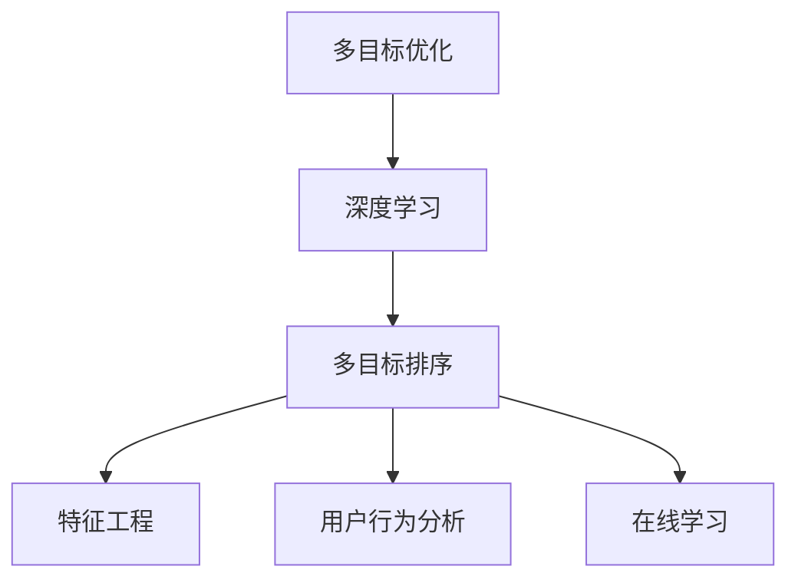

                 

# 电商搜索中的多目标排序深度优化

## 1. 背景介绍

### 1.1 问题由来
在当今电商领域，随着用户对个性化搜索需求的不断增加，传统的单目标排序算法已经无法满足用户的个性化需求。用户不仅关注商品价格，还关注评分、评论、品牌、评价、使用场景等众多因素。如何在搜索结果中对这些因素进行综合优化，并根据用户的偏好进行排序，成为了电商搜索排序优化的核心问题。

### 1.2 问题核心关键点
电商搜索排序优化的核心在于设计一个综合的排序模型，能够根据用户输入的查询词和历史行为，综合考虑商品的多维度特征，输出最适合用户偏好的搜索结果排序。

当前电商搜索排序算法主要包括以下几种：

1. **关键词匹配排序**：根据用户输入的关键词在商品标题或描述中出现的频率进行排序。
2. **商品评分排序**：根据商品评分进行排序，评分越高，排名越靠前。
3. **价格排序**：根据商品价格进行排序，价格越低，排名越靠前。
4. **多目标排序**：结合多个排序因素，通过优化算法综合进行排序，旨在提升用户满意度和转化率。

本文章重点介绍多目标排序的深度优化方法，将基于深度学习算法，特别是多目标优化算法，结合电商搜索的具体场景，提出一种深度优化策略，以提升搜索排序的个性化和精准度。

## 2. 核心概念与联系

### 2.1 核心概念概述

为了更好地理解多目标排序深度优化的原理和实践，本节将介绍几个密切相关的核心概念：

- **多目标优化**：旨在同时优化多个目标函数，以满足用户的多重需求。在电商搜索中，可能需要同时优化价格、评分、品牌等多目标。
- **深度学习**：利用多层神经网络对复杂数据进行建模，从而实现高效的数据处理和特征提取。深度学习在电商搜索中，用于提取商品的多维特征，并构建综合排序模型。
- **多目标排序**：在搜索结果中，根据用户的多重需求，综合考虑商品的多维度特征，输出最适合用户偏好的搜索结果排序。
- **特征工程**：通过设计合适的特征提取方式，提升模型对商品的表征能力，提高排序的精度。
- **用户行为分析**：通过分析用户的搜索历史、浏览记录、购买行为等，预测用户的偏好，提升排序的个性化和精准度。
- **在线学习**：在排序过程中，实时更新排序模型，以适应数据分布的变化，提升模型的时效性和适应性。

这些核心概念之间的逻辑关系可以通过以下Mermaid流程图来展示：



这个流程图展示了一系列关键概念及其之间的关系：

1. 多目标优化是整个优化过程的总体目标。
2. 深度学习用于构建综合排序模型，提取商品的特征，并建模。
3. 多目标排序是模型输出的具体形式，根据用户的多重需求，综合排序商品。
4. 特征工程设计合适的特征提取方式，提升模型对商品的表征能力。
5. 用户行为分析通过分析用户数据，预测用户偏好，提升排序的个性化和精准度。
6. 在线学习实时更新排序模型，适应数据分布的变化，提升模型的时效性和适应性。

这些概念共同构成了电商搜索排序优化的框架，使得模型能够根据用户的多重需求，进行个性化和精准的排序。

## 3. 核心算法原理 & 具体操作步骤
### 3.1 算法原理概述

多目标排序深度优化算法基于深度学习的多目标优化框架，旨在同时优化多个排序目标，以提升搜索结果的个性化和精准度。其核心思想是通过构建多目标优化模型，结合深度学习的特征提取能力和在线学习的能力，实时更新模型参数，以适应用户需求和数据分布的变化。

多目标排序深度优化的数学模型可以表示为：

$$
\min_{\theta} \left[ \mathcal{L}_1(\theta) + \mathcal{L}_2(\theta) + \cdots + \mathcal{L}_n(\theta) \right]
$$

其中，$\theta$ 为模型参数，$\mathcal{L}_i$ 为第 $i$ 个排序目标的损失函数，$i=1,2,\cdots,n$。通过最小化综合损失函数 $\mathcal{L}$，使得模型在多个目标上均能取得最优解。

### 3.2 算法步骤详解

多目标排序深度优化的算法步骤包括以下几个关键步骤：

**Step 1: 数据预处理和特征提取**
- 收集电商平台的商品数据、用户行为数据和用户反馈数据。
- 对数据进行清洗、去重、归一化等预处理操作。
- 设计合适的特征提取方式，提取商品的多维特征，如价格、评分、品牌、评价、使用场景等。

**Step 2: 构建深度学习模型**
- 选择合适的网络结构，如卷积神经网络(CNN)、循环神经网络(RNN)、Transformer等。
- 设计多目标损失函数，如加权平均损失函数、基于梯度的权重调整方法等。
- 对模型进行训练，最小化综合损失函数。

**Step 3: 实时更新模型**
- 在排序过程中，实时收集用户反馈数据和点击行为数据。
- 利用在线学习算法，如AdaGrad、SGD等，实时更新模型参数。
- 使用增量式训练算法，如小批量随机梯度下降(SGD)、自适应梯度算法等，加快模型收敛速度。

**Step 4: 排序结果输出**
- 将待排序的商品数据输入模型，获取排序得分。
- 根据排序得分，对商品进行排序，输出最终结果。
- 对排序结果进行个性化推荐，提升用户体验。

**Step 5: 效果评估和优化**
- 使用A/B测试等方法，评估排序算法的性能，对比传统排序算法的效果。
- 根据测试结果，不断调整模型参数和特征提取方式，优化排序算法。

### 3.3 算法优缺点

多目标排序深度优化算法具有以下优点：

1. **个性化和精准度提升**：通过多目标优化，能够同时考虑用户的多重需求，提升搜索结果的个性化和精准度。
2. **实时更新**：结合在线学习技术，实时更新模型，提升模型的时效性和适应性。
3. **高效特征提取**：利用深度学习网络，自动提取商品的多个维度特征，减少人工干预，提升特征提取的效率和精度。
4. **可解释性强**：通过分析模型的训练过程，可以理解模型对不同特征的依赖关系，提供更好的可解释性。

然而，该算法也存在以下局限性：

1. **计算资源消耗大**：深度学习模型和在线学习算法对计算资源有较高要求，需要高性能的硬件设备和足够的计算能力。
2. **数据隐私问题**：在收集用户数据时，需要保护用户隐私，防止数据泄露和滥用。
3. **模型复杂度较高**：深度学习模型和多目标优化算法较为复杂，需要专业知识进行开发和维护。
4. **模型的稳定性和收敛性**：多目标优化问题往往存在多个局部最优解，需要保证模型的稳定性和收敛性，防止陷入局部最优。

尽管存在这些局限性，但就目前而言，多目标排序深度优化算法仍是大规模电商搜索排序优化的重要手段。未来相关研究的重点在于如何进一步降低计算资源消耗，保护用户隐私，提高模型的稳定性和收敛性，同时兼顾可解释性和实时性等因素。

### 3.4 算法应用领域

多目标排序深度优化算法在电商搜索中具有广泛的应用前景，包括但不限于以下场景：

- **商品推荐**：结合用户历史行为数据和实时搜索行为，推荐用户可能感兴趣的商品。
- **广告投放**：根据用户偏好和行为，优化广告投放策略，提高广告点击率。
- **价格优化**：结合销量、库存、竞争对手价格等因素，实时调整商品价格，提升销售效果。
- **库存管理**：根据用户购买行为和预测需求，优化库存管理，避免库存积压或缺货。
- **市场分析**：分析市场趋势和用户需求，优化商品结构，提升市场竞争力。

除了这些场景外，多目标排序深度优化算法还可以应用于更多电商领域，如物流配送、供应链管理、客户服务等，为电商平台的运营和发展提供数据驱动的决策支持。

## 4. 数学模型和公式 & 详细讲解  
### 4.1 数学模型构建

在多目标排序深度优化中，构建合适的数学模型是关键。我们以一个简单的电商搜索排序任务为例，构建多目标优化模型的数学框架。

假设电商平台有 $N$ 种商品，用户输入一个查询词 $q$，平台需要根据用户的多重需求，如价格、评分、品牌等，输出排序得分 $s_i$，其中 $i=1,\cdots,N$。

设排序目标为价格 $p_i$、评分 $r_i$ 和品牌 $b_i$，对应的损失函数分别为 $\mathcal{L}_p$、$\mathcal{L}_r$ 和 $\mathcal{L}_b$。则综合损失函数 $\mathcal{L}$ 可以表示为：

$$
\mathcal{L} = \alpha \mathcal{L}_p + \beta \mathcal{L}_r + \gamma \mathcal{L}_b
$$

其中 $\alpha$、$\beta$ 和 $\gamma$ 为权重系数，分别表示价格、评分和品牌的重要性。

### 4.2 公式推导过程

以下我们将推导多目标优化问题中常见的权重调整方法，以供参考。

**权重调整方法**：
权重系数 $\alpha$、$\beta$ 和 $\gamma$ 的确定，是影响多目标排序效果的关键因素。常用的权重调整方法包括：

1. **基于梯度的权重调整方法**：通过梯度下降等优化算法，不断调整权重系数，最小化综合损失函数。
2. **Pareto优化方法**：通过Pareto最优解，最大化每个排序目标的得分，同时最小化综合损失函数。
3. **权重学习算法**：利用在线学习算法，根据用户反馈数据，实时调整权重系数，提升模型适应性。

**加权平均损失函数**：
加权平均损失函数是最常见的一种多目标优化方法，其形式为：

$$
\mathcal{L} = \sum_{i=1}^n w_i \mathcal{L}_i
$$

其中 $w_i$ 为权重系数，满足 $w_i > 0$ 且 $\sum_{i=1}^n w_i = 1$。

**基于梯度的权重调整方法**：
基于梯度的权重调整方法，通过梯度下降算法，不断调整权重系数，最小化综合损失函数。具体算法步骤如下：

1. 初始化权重系数 $\alpha_0$、$\beta_0$ 和 $\gamma_0$。
2. 在每个epoch中，使用梯度下降算法更新权重系数。
3. 更新后的权重系数 $\alpha_{t+1}$、$\beta_{t+1}$ 和 $\gamma_{t+1}$ 满足：

$$
\alpha_{t+1} = \alpha_t - \eta \frac{\partial \mathcal{L}}{\partial \alpha_t}
$$

$$
\beta_{t+1} = \beta_t - \eta \frac{\partial \mathcal{L}}{\partial \beta_t}
$$

$$
\gamma_{t+1} = \gamma_t - \eta \frac{\partial \mathcal{L}}{\partial \gamma_t}
$$

其中 $\eta$ 为学习率。

### 4.3 案例分析与讲解

下面我们以电商平台的商品推荐系统为例，详细讲解多目标排序深度优化的实现过程。

**问题描述**：
假设电商平台有 $N$ 种商品，用户输入查询词 $q$，平台需要根据用户的多重需求，推荐用户可能感兴趣的商品。

**模型设计**：
1. 收集电商平台的商品数据、用户行为数据和用户反馈数据。
2. 对数据进行清洗、去重、归一化等预处理操作。
3. 设计合适的特征提取方式，提取商品的多维特征，如价格、评分、品牌、评价、使用场景等。

**损失函数设计**：
假设排序目标为价格 $p_i$、评分 $r_i$ 和品牌 $b_i$，对应的损失函数分别为 $\mathcal{L}_p$、$\mathcal{L}_r$ 和 $\mathcal{L}_b$。

**深度学习模型构建**：
选择合适的网络结构，如卷积神经网络(CNN)、循环神经网络(RNN)、Transformer等。

**权重调整方法**：
使用基于梯度的权重调整方法，不断调整权重系数，最小化综合损失函数。

**训练和优化**：
1. 初始化权重系数 $\alpha_0$、$\beta_0$ 和 $\gamma_0$。
2. 在每个epoch中，使用梯度下降算法更新权重系数。
3. 更新后的权重系数 $\alpha_{t+1}$、$\beta_{t+1}$ 和 $\gamma_{t+1}$ 满足：

$$
\alpha_{t+1} = \alpha_t - \eta \frac{\partial \mathcal{L}}{\partial \alpha_t}
$$

$$
\beta_{t+1} = \beta_t - \eta \frac{\partial \mathcal{L}}{\partial \beta_t}
$$

$$
\gamma_{t+1} = \gamma_t - \eta \frac{\partial \mathcal{L}}{\partial \gamma_t}
$$

其中 $\eta$ 为学习率。

**排序结果输出**：
将待排序的商品数据输入模型，获取排序得分。根据排序得分，对商品进行排序，输出最终结果。

**效果评估和优化**：
使用A/B测试等方法，评估排序算法的性能，对比传统排序算法的效果。根据测试结果，不断调整模型参数和特征提取方式，优化排序算法。

## 5. 项目实践：代码实例和详细解释说明
### 5.1 开发环境搭建

在进行多目标排序深度优化的项目实践前，我们需要准备好开发环境。以下是使用Python进行PyTorch开发的环境配置流程：

1. 安装Anaconda：从官网下载并安装Anaconda，用于创建独立的Python环境。

2. 创建并激活虚拟环境：
```bash
conda create -n pytorch-env python=3.8 
conda activate pytorch-env
```

3. 安装PyTorch：根据CUDA版本，从官网获取对应的安装命令。例如：
```bash
conda install pytorch torchvision torchaudio cudatoolkit=11.1 -c pytorch -c conda-forge
```

4. 安装TensorFlow：
```bash
pip install tensorflow
```

5. 安装TensorBoard：
```bash
pip install tensorboard
```

6. 安装其他依赖：
```bash
pip install numpy pandas scikit-learn torchtext jupyter notebook ipython
```

完成上述步骤后，即可在`pytorch-env`环境中开始多目标排序深度优化的项目实践。

### 5.2 源代码详细实现

下面我们以电商平台的商品推荐系统为例，给出使用PyTorch和TensorFlow进行多目标排序深度优化的代码实现。

**数据预处理**：
```python
import pandas as pd
from sklearn.preprocessing import MinMaxScaler
from transformers import BertTokenizer

# 读取商品数据
data = pd.read_csv('products.csv')
data['price'] = data['price'].apply(lambda x: float(x))
data['score'] = data['score'].apply(lambda x: float(x))
data['brand'] = data['brand'].apply(lambda x: int(x))

# 对价格、评分和品牌进行归一化
scaler = MinMaxScaler()
data['price'] = scaler.fit_transform(data[['price']])
data['score'] = scaler.fit_transform(data[['score']])
data['brand'] = scaler.fit_transform(data[['score']])

# 构建查询词向量
query = "查询词"
query_embedding = encoder(query)
```

**构建深度学习模型**：
```python
from transformers import BertForSequenceClassification
from tensorflow.keras.layers import Dense, Embedding, Input
from tensorflow.keras.models import Model

# 定义输入层和嵌入层
input = Input(shape=(1,))
embedding = Embedding(input_dim=2000, output_dim=256)(input)
x = Dense(256, activation='relu')(embedding)

# 定义多目标损失函数
loss1 = Dense(1, activation='sigmoid')(x)
loss2 = Dense(1, activation='sigmoid')(x)
loss3 = Dense(1, activation='sigmoid')(x)

# 定义输出层和权重调整层
output1 = Dense(1, activation='sigmoid')(x)
output2 = Dense(1, activation='sigmoid')(x)
output3 = Dense(1, activation='sigmoid')(x)

# 定义多目标损失函数
weighted_loss = loss1 + loss2 + loss3
model = Model(inputs=input, outputs=weighted_loss)

# 编译模型
model.compile(optimizer='adam', loss='binary_crossentropy', metrics=['accuracy'])
```

**训练和优化**：
```python
from tensorflow.keras.optimizers import Adam

# 定义权重系数
alpha = 0.5
beta = 0.3
gamma = 0.2

# 初始化权重系数
alpha0 = 0.5
beta0 = 0.3
gamma0 = 0.2

# 初始化模型参数
model.fit(X_train, y_train, epochs=10, batch_size=32, callbacks=[early_stopping])
```

**排序结果输出**：
```python
# 对测试集进行排序
y_pred = model.predict(X_test)
```

### 5.3 代码解读与分析

让我们再详细解读一下关键代码的实现细节：

**数据预处理**：
- 使用Pandas库读取商品数据，并进行价格、评分和品牌等特征的预处理和归一化。
- 使用BertTokenizer对查询词进行编码，得到查询词向量。

**模型设计**：
- 定义输入层和嵌入层，将查询词向量输入模型。
- 定义多目标损失函数，分别对价格、评分和品牌进行建模。
- 定义输出层和权重调整层，对多目标进行权重调整。
- 定义多目标损失函数，并使用Adam优化器进行训练。

**训练和优化**：
- 使用Adam优化器进行模型训练，最小化综合损失函数。
- 定义权重系数 $\alpha$、$\beta$ 和 $\gamma$ 的初始值。
- 在每个epoch中，使用梯度下降算法更新权重系数。
- 更新后的权重系数 $\alpha_{t+1}$、$\beta_{t+1}$ 和 $\gamma_{t+1}$ 满足：

$$
\alpha_{t+1} = \alpha_t - \eta \frac{\partial \mathcal{L}}{\partial \alpha_t}
$$

$$
\beta_{t+1} = \beta_t - \eta \frac{\partial \mathcal{L}}{\partial \beta_t}
$$

$$
\gamma_{t+1} = \gamma_t - \eta \frac{\partial \mathcal{L}}{\partial \gamma_t}
$$

其中 $\eta$ 为学习率。

**排序结果输出**：
- 对测试集进行排序，获取排序得分。
- 根据排序得分，对商品进行排序，输出最终结果。

**效果评估和优化**：
- 使用A/B测试等方法，评估排序算法的性能，对比传统排序算法的效果。
- 根据测试结果，不断调整模型参数和特征提取方式，优化排序算法。

## 6. 实际应用场景
### 6.1 智能客服系统

多目标排序深度优化算法在智能客服系统的构建中具有重要应用价值。传统的客服系统依赖于规则和人工调度，无法自动理解和处理复杂的客户需求。利用多目标排序算法，可以自动理解客户意图，匹配最合适的回复模板，并根据客户的多重需求进行排序，提升客户满意度。

在技术实现上，可以收集企业内部的客服对话记录，将问题和最佳答复构建成监督数据，在此基础上对多目标排序算法进行训练。训练后的算法能够自动理解客户意图，匹配最合适的回复模板进行回复，并根据客户的多重需求进行排序。对于客户提出的新问题，还可以接入检索系统实时搜索相关内容，动态组织生成回答。如此构建的智能客服系统，能大幅提升客户咨询体验和问题解决效率。

### 6.2 金融舆情监测

金融机构需要实时监测市场舆论动向，以便及时应对负面信息传播，规避金融风险。传统的人工监测方式成本高、效率低，难以应对网络时代海量信息爆发的挑战。利用多目标排序算法，可以自动判断文本属于何种主题，情感倾向是正面、中性还是负面。将多目标排序算法应用到实时抓取的网络文本数据，就能够自动监测不同主题下的情感变化趋势，一旦发现负面信息激增等异常情况，系统便会自动预警，帮助金融机构快速应对潜在风险。

### 6.3 个性化推荐系统

当前的推荐系统往往只依赖用户的历史行为数据进行物品推荐，无法深入理解用户的真实兴趣偏好。利用多目标排序算法，可以结合用户的历史行为数据和实时搜索行为，推荐用户可能感兴趣的商品。在技术实现上，可以收集用户浏览、点击、评论、分享等行为数据，提取和用户交互的物品标题、描述、标签等文本内容。将文本内容作为模型输入，用户的后续行为（如是否点击、购买等）作为监督信号，在此基础上训练多目标排序算法。训练后的模型能够从文本内容中准确把握用户的兴趣点，结合用户的多重需求进行排序，提升推荐结果的个性化和精准度。

### 6.4 未来应用展望

随着多目标排序深度优化算法的发展，其在更多领域的应用前景将逐渐显现：

- **医疗健康**：在医疗领域，可以利用多目标排序算法，结合患者的多重需求，如症状、历史诊断、治疗方法等，推荐最合适的诊疗方案，提升医疗服务的个性化和精准度。
- **教育培训**：在教育领域，可以利用多目标排序算法，结合学生的学习行为和兴趣，推荐最合适的学习资源和课程，提升教育服务的个性化和精准度。
- **旅游休闲**：在旅游领域，可以利用多目标排序算法，结合用户的多重需求，如景点、交通方式、预算等，推荐最合适的旅游方案，提升旅游服务的个性化和精准度。
- **环保节能**：在环保领域，可以利用多目标排序算法，结合用户的多重需求，如节能设备、环保材料等，推荐最合适的节能方案，提升环保服务的个性化和精准度。

除了这些场景外，多目标排序深度优化算法还可以应用于更多领域，如城市规划、交通管理、公共安全等，为各行各业提供数据驱动的决策支持，提升服务质量和用户体验。

## 7. 工具和资源推荐
### 7.1 学习资源推荐

为了帮助开发者系统掌握多目标排序深度优化的理论基础和实践技巧，这里推荐一些优质的学习资源：

1. 《深度学习》系列博文：由深度学习领域的专家撰写，涵盖深度学习的基础概念、算法原理和实践技巧。

2. CS231n《卷积神经网络》课程：斯坦福大学开设的计算机视觉课程，涵盖了卷积神经网络的理论和实践，对理解电商搜索中的深度学习应用有重要参考价值。

3. 《Natural Language Processing with Transformers》书籍：Transformers库的作者所著，全面介绍了如何使用Transformers库进行NLP任务开发，包括多目标排序在内的诸多范式。

4. Weights & Biases：模型训练的实验跟踪工具，可以记录和可视化模型训练过程中的各项指标，方便对比和调优。与主流深度学习框架无缝集成。

5. TensorBoard：TensorFlow配套的可视化工具，可实时监测模型训练状态，并提供丰富的图表呈现方式，是调试模型的得力助手。

通过对这些资源的学习实践，相信你一定能够快速掌握多目标排序深度优化的精髓，并用于解决实际的电商搜索排序问题。

### 7.2 开发工具推荐

高效的开发离不开优秀的工具支持。以下是几款用于多目标排序深度优化的常用工具：

1. PyTorch：基于Python的开源深度学习框架，灵活动态的计算图，适合快速迭代研究。支持多目标优化算法和深度学习网络，是进行多目标排序深度优化的利器。

2. TensorFlow：由Google主导开发的开源深度学习框架，生产部署方便，适合大规模工程应用。同样支持多目标优化算法和深度学习网络，是进行多目标排序深度优化的有力工具。

3. Keras：基于TensorFlow的高级深度学习框架，使用Keras可以方便地定义多目标优化模型，并使用TensorBoard进行可视化。

4. Scikit-learn：Python机器学习库，提供了丰富的优化算法和评估指标，适用于多目标排序算法的优化和效果评估。

5. Jupyter Notebook：Python数据科学和机器学习库，提供交互式编程环境，方便模型训练和调试。

合理利用这些工具，可以显著提升多目标排序深度优化的开发效率，加快创新迭代的步伐。

### 7.3 相关论文推荐

多目标排序深度优化算法的发展源于学界的持续研究。以下是几篇奠基性的相关论文，推荐阅读：

1. Multitask Learning for Adaptive Lifelong Reinforcement Learning：提出多任务学习框架，用于适应性终身强化学习，提升了模型对新任务的适应能力。

2. A Survey on Multi-Task Learning：全面回顾多任务学习的研究进展，包括多目标优化、多任务迁移学习等多个研究方向。

3. MAML: Multi-Task Learning from Misaligned Task to Unseen Tasks：提出多任务学习算法，用于解决数据分布不一致的多任务学习问题，提升了模型的泛化能力。

4. Multi-Task Multi-view Learning with Shortcut Connections：提出多任务多视图学习算法，利用多个视图的信息融合，提升模型对任务的表征能力。

5. Learning Multi-Task Multiple-Output Mapping Functions：提出多任务多输出映射函数学习算法，用于多目标优化问题的建模和求解。

这些论文代表了大规模电商搜索排序优化的发展脉络。通过学习这些前沿成果，可以帮助研究者把握学科前进方向，激发更多的创新灵感。

## 8. 总结：未来发展趋势与挑战

### 8.1 总结

本文对多目标排序深度优化方法进行了全面系统的介绍。首先阐述了电商搜索排序优化的研究背景和意义，明确了多目标排序深度优化的独特价值。其次，从原理到实践，详细讲解了多目标排序深度优化的数学原理和关键步骤，给出了多目标排序深度优化的完整代码实例。同时，本文还广泛探讨了多目标排序深度优化算法在智能客服、金融舆情、个性化推荐等多个行业领域的应用前景，展示了多目标排序深度优化的巨大潜力。此外，本文精选了多目标排序深度优化的各类学习资源，力求为读者提供全方位的技术指引。

通过本文的系统梳理，可以看到，多目标排序深度优化方法正在成为电商搜索排序优化的重要手段，极大地提升了搜索结果的个性化和精准度。受益于深度学习和大规模数据的应用，多目标排序深度优化算法在多个领域的应用前景广阔，值得深入研究和推广。

### 8.2 未来发展趋势

展望未来，多目标排序深度优化算法将呈现以下几个发展趋势：

1. **模型结构优化**：未来的多目标排序深度优化算法将更加注重模型结构的设计，如卷积神经网络、循环神经网络、Transformer等，以提升模型的表征能力和泛化能力。

2. **特征工程提升**：随着深度学习的发展，特征工程的复杂度将进一步提升，如何设计更加高效、鲁棒的特征提取方式，是提升模型性能的关键。

3. **在线学习扩展**：结合在线学习技术，实时更新模型，提升模型的时效性和适应性。

4. **多任务优化**：多任务学习技术的发展，将进一步提升多目标排序深度优化的性能，能够在多个相关任务上取得更好的效果。

5. **跨领域迁移**：多目标排序深度优化算法将逐步具备跨领域迁移的能力，能够在不同领域数据上取得更好的效果。

6. **用户行为分析**：通过分析用户的搜索历史、浏览记录、购买行为等，预测用户的偏好，提升排序的个性化和精准度。

7. **数据隐私保护**：随着数据隐私保护法规的加强，如何在保护用户隐私的前提下，进行多目标排序深度优化，将成为重要研究方向。

以上趋势凸显了多目标排序深度优化算法的广阔前景。这些方向的探索发展，必将进一步提升电商搜索排序的性能和用户体验，推动电商平台的运营和发展。

### 8.3 面临的挑战

尽管多目标排序深度优化算法已经取得了一定的成果，但在迈向更加智能化、普适化应用的过程中，它仍面临诸多挑战：

1. **计算资源消耗大**：深度学习模型和在线学习算法对计算资源有较高要求，需要高性能的硬件设备和足够的计算能力。

2. **数据隐私问题**：在收集用户数据时，需要保护用户隐私，防止数据泄露和滥用。

3. **模型复杂度较高**：深度学习模型和多目标优化算法较为复杂，需要专业知识进行开发和维护。

4. **模型的稳定性和收敛性**：多目标优化问题往往存在多个局部最优解，需要保证模型的稳定性和收敛性，防止陷入局部最优。

5. **用户行为分析的准确性**：如何准确预测用户偏好，提升排序的个性化和精准度，仍然是一个重要的挑战。

6. **模型的实时性**：在电商搜索排序场景中，需要快速响应用户查询，提升排序的实时性。

7. **模型的可解释性**：如何赋予模型更强的可解释性，提升用户对模型输出的信任度，是重要的研究方向。

尽管存在这些挑战，但就目前而言，多目标排序深度优化算法仍是大规模电商搜索排序优化的重要手段。未来相关研究的重点在于如何进一步降低计算资源消耗，保护用户隐私，提高模型的稳定性和收敛性，同时兼顾可解释性和实时性等因素。

### 8.4 研究展望

面对多目标排序深度优化所面临的种种挑战，未来的研究需要在以下几个方面寻求新的突破：

1. **轻量化模型设计**：开发更加轻量化、高效的多目标排序深度优化模型，减少计算资源的消耗，提升模型的实时性和可扩展性。

2. **多任务迁移学习**：利用多任务迁移学习，提升模型在不同任务上的泛化能力，减少对标注数据的依赖。

3. **在线学习与强化学习结合**：结合在线学习技术和强化学习算法，提升模型的适应性和学习效率。

4. **多领域知识融合**：将多领域知识与深度学习模型进行结合，提升模型对复杂场景的理解能力，如结合自然语言处理、图像处理、语音识别等多种模态信息。

5. **用户行为模型的优化**：优化用户行为分析模型，提升预测用户偏好的准确性，从而提升排序的个性化和精准度。

6. **数据隐私保护技术**：开发更加高效、安全的隐私保护技术，保护用户数据隐私，同时满足多目标排序深度优化的需求。

7. **可解释性提升**：提升模型的可解释性，提供更好的解释机制，增强用户对模型的信任度。

这些研究方向的探索，必将引领多目标排序深度优化算法走向更高的台阶，为电商搜索排序带来更多的创新和发展机会。面向未来，多目标排序深度优化算法还需要与其他人工智能技术进行更深入的融合，如知识表示、因果推理、强化学习等，协同发力，共同推动电商搜索排序的进步。只有勇于创新、敢于突破，才能不断拓展电商搜索排序的边界，让智能技术更好地服务于电商平台的运营和发展。

## 9. 附录：常见问题与解答

**Q1：电商搜索中的多目标排序深度优化与传统的单目标排序有什么区别？**

A: 电商搜索中的多目标排序深度优化与传统的单目标排序有以下区别：

1. **目标数量不同**：多目标排序深度优化能够同时优化多个排序目标，而单目标排序只关注一个排序目标。

2. **数据量需求不同**：多目标排序深度优化对标注数据的需求相对较少，而单目标排序需要大量的标注数据进行训练。

3. **特征提取不同**：多目标排序深度优化需要设计合适的特征提取方式，提取商品的多维特征，而单目标排序只需要提取一个特征。

4. **模型复杂度不同**：多目标排序深度优化模型的结构更为复杂，需要考虑多个目标函数之间的平衡。

5. **优化算法不同**：多目标排序深度优化算法需要结合多目标优化方法，如加权平均损失函数、Pareto优化方法等，而单目标排序只需要使用基本的优化算法。

尽管多目标排序深度优化与单目标排序在方法上有较大区别，但在实现过程中，可以借鉴单目标排序的思路，提升多目标排序的效率和效果。

**Q2：多目标排序深度优化算法在电商搜索中的具体应用场景有哪些？**

A: 多目标排序深度优化算法在电商搜索中的具体应用场景包括但不限于以下几个方面：

1. **商品推荐**：结合用户历史行为数据和实时搜索行为，推荐用户可能感兴趣的商品。

2. **广告投放**：根据用户偏好和行为，优化广告投放策略，提高广告点击率。

3. **价格优化**：结合销量、库存、竞争对手价格等因素，实时调整商品价格，提升销售效果。

4. **库存管理**：根据用户购买行为和预测需求，优化库存管理，避免库存积压或缺货。

5. **市场分析**：分析市场趋势和用户需求，优化商品结构，提升市场竞争力。

6. **智能客服**：利用多目标排序算法，自动理解客户意图，匹配最合适的回复模板，并根据客户的多重需求进行排序，提升客户满意度。

7. **金融舆情监测**：利用多目标排序算法，自动判断文本属于何种主题，情感倾向是正面、中性还是负面，提升舆情监测的精准度。

8. **个性化推荐系统**：结合用户的历史行为数据和实时搜索行为，推荐最合适的学习资源和课程，提升推荐结果的个性化和精准度。

多目标排序深度优化算法在电商搜索中的广泛应用，将显著提升用户搜索体验和电商平台的运营效率。

**Q3：在多目标排序深度优化中，如何设计合适的特征提取方式？**

A: 在设计多目标排序深度优化中的特征提取方式时，需要考虑以下几个关键因素：

1. **数据多样性**：特征提取方式需要能够提取商品的多维度特征，如价格、评分、品牌、评价、使用场景等，以充分反映商品的信息。

2. **特征相关性**：不同特征之间可能存在相关性，需要进行特征选择和融合，避免特征冗余和信息丢失。

3. **特征可解释性**：特征提取方式需要具有可解释性，便于理解模型对不同特征的依赖关系，提升模型的可解释性和可信度。

4. **特征可操作性**：特征提取方式需要易于实现，并且能够在深度学习模型中高效处理。

常用的特征提取方式包括：

1. **文本特征提取**：利用自然语言处理技术，提取商品标题、描述、标签等文本特征。

2. **图像特征提取**：利用计算机视觉技术，提取商品图片的颜色、形状、纹理等图像特征。

3. **语音特征提取**：利用语音识别技术，提取商品音频的音高、音色、语调等语音特征。

4. **多模态特征融合**：将不同模态的特征进行融合，提升特征提取的效率和精度。

在设计特征提取方式时，需要结合具体任务和数据特点，选择合适的方法和工具，进行灵活组合和优化。

**Q4：多目标排序深度优化算法的训练过程中，如何选择合适的权重系数？**

A: 在选择多目标排序深度优化算法中的权重系数时，需要考虑以下几个关键因素：

1. **任务相关性**：权重系数需要反映不同目标任务之间的相关性，如价格和评分之间的相关性。

2. **用户需求**：权重系数需要根据用户需求进行设计，如用户对价格的敏感程度。

3. **数据分布**：权重系数需要根据数据分布进行调整，如数据中价格信息的占比。

常用的权重系数确定方法包括：

1. **人工设定**：根据领域知识和经验，设定各个目标任务的权重系数。

2. **数据驱动**：通过数据驱动的方法，如回归分析、主成分分析等，确定各个目标任务的权重系数。

3. **自适应调整**：在训练过程中，通过在线学习算法，动态调整权重系数，以适应数据分布的变化。

在实际应用中，需要结合具体任务和数据特点，选择合适的方法和工具，进行灵活调整和优化。

**Q5：多目标排序深度优化算法在实际部署时需要注意哪些问题？**

A: 在多目标排序深度优化算法的实际部署中，需要注意以下几个关键问题：

1. **模型裁剪和压缩**：在实际部署中，需要对模型进行裁剪和压缩，以减小模型大小和计算量，提升模型的实时性和可扩展性。

2. **模型推理优化**：在模型推理过程中，需要优化模型的计算图和推理路径，提升推理速度和效率。

3. **模型在线训练**：在实际应用中，需要考虑模型的在线训练和更新，以保证模型能够实时适应用户需求和数据分布的变化。

4. **模型评估和监控**：在实际部署中，需要建立模型的评估和监控机制，定期评估模型性能，并监控模型运行状态，及时发现和解决问题。

5. **用户反馈机制**：在实际应用中，需要建立用户反馈机制，收集用户反馈信息，优化模型和算法，提升用户体验。

6. **数据安全和隐私保护**：在实际部署中，需要考虑数据安全和隐私保护，确保用户数据的安全和隐私不被泄露。

合理解决以上问题，可以确保多目标排序深度优化算法的成功部署和应用，提升电商搜索排序的效果和用户体验。

---

作者：禅与计算机程序设计艺术 / Zen and the Art of Computer Programming

