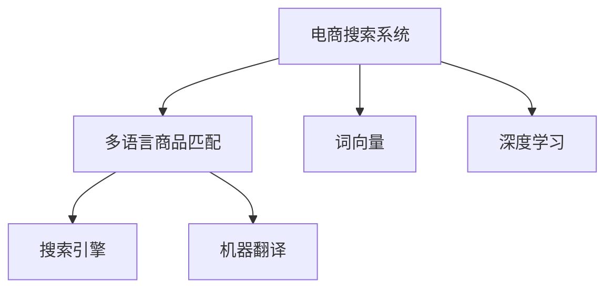

                 

# 电商搜索中的多语言商品匹配技术

## 1. 背景介绍

在电商领域，一个高效的搜索系统是吸引和留存用户的重要手段。然而，不同的市场具有不同的语言和文化背景，为了满足全球用户的搜索需求，电商公司需要开发多语言商品匹配技术，以确保用户在查询商品时能够获得准确的搜索结果。

近年来，由于全球化贸易和在线购物市场的快速发展，电商公司不得不面对多语言搜索的挑战。同时，消费者期望在各种语言中都能获得满意的购物体验，这推动了电商公司对多语言商品匹配技术的需求。因此，在电商搜索系统中，多语言商品匹配技术变得至关重要。

## 2. 核心概念与联系

### 2.1 核心概念概述

- **电商搜索系统**：利用自然语言处理（NLP）技术，用户输入的查询会被转换为系统可以理解的格式，从而匹配商品信息，提供给用户相关的商品。
- **多语言商品匹配**：在多语言环境下，确保商品匹配算法能够正确地识别和匹配不同语言的查询和商品描述，以提供准确的搜索结果。
- **词向量（Word Embeddings）**：将词语映射到高维向量空间中，以便计算机能够理解语义和上下文信息。
- **深度学习（Deep Learning）**：一种基于神经网络的机器学习方法，能够处理复杂的非线性关系，适用于商品匹配算法中的自然语言处理。
- **搜索引擎（Search Engine）**：一种软件系统，使用特定的算法来检索信息，并提供给用户相关的搜索结果。
- **机器翻译（Machine Translation）**：将一种语言的文本自动翻译成另一种语言的文本。

这些核心概念之间的联系可以通过以下Mermaid流程图来展示：



该流程图展示了电商搜索系统在多语言环境下对商品匹配的需求，通过词向量和深度学习技术，结合机器翻译功能，提供准确的多语言搜索结果。

## 3. 核心算法原理 & 具体操作步骤

### 3.1 算法原理概述

多语言商品匹配技术主要包括三个步骤：

1. **文本预处理**：将用户查询和商品描述转换为词向量形式。
2. **相似度计算**：计算用户查询和商品描述之间的相似度。
3. **排名排序**：根据相似度对搜索结果进行排序，并将结果返回给用户。

### 3.2 算法步骤详解

#### 3.2.1 文本预处理

文本预处理是将用户查询和商品描述转换为词向量形式的过程。具体步骤包括：

1. **分词**：将句子分割成单词或短语。
2. **去除停用词**：移除没有实际意义的单词，如“的”、“是”等。
3. **词形还原**：将单词还原为其基本形式，如将“running”还原为“run”。
4. **构建词向量**：使用词向量模型，如Word2Vec或GloVe，将单词映射到高维向量空间中。

#### 3.2.2 相似度计算

相似度计算是通过计算用户查询和商品描述之间的相似度，确定它们的相关性。常见的方法包括：

1. **余弦相似度**：计算两个词向量之间的余弦相似度，得到一个0到1之间的分数，表示它们的相似度。
2. **Jaccard相似度**：计算两个文本集合的交集与并集之比，得到一个0到1之间的分数。
3. **编辑距离**：计算两个字符串之间的编辑距离，表示将一个字符串转换为另一个字符串所需的最少编辑操作次数。

#### 3.2.3 排名排序

排名排序是根据相似度对搜索结果进行排序的过程。具体方法包括：

1. **最大相关性排序**：根据相似度从高到低对结果进行排序，相似度最高的排在前面。
2. **基于权重排序**：给每个相似度赋予一个权重，根据加权相似度对结果进行排序。
3. **集成排序**：结合多种相似度计算方法，使用集成学习算法进行排序。

### 3.3 算法优缺点

**优点**：

- **适应多语言**：能够处理多种语言的查询和商品描述。
- **处理复杂查询**：能够处理包含多义词、同义词的复杂查询。
- **准确性高**：通过相似度计算，提供准确的搜索结果。

**缺点**：

- **计算复杂度高**：计算相似度和排名排序的过程可能非常耗时。
- **数据需求大**：需要大量的多语言数据进行训练和测试。
- **语言差异**：不同语言的语法和语义差异可能影响匹配的准确性。

### 3.4 算法应用领域

多语言商品匹配技术主要应用于以下领域：

1. **电商搜索**：提供多语言的搜索功能，提升用户体验。
2. **旅游搜索**：提供多语言的旅游信息搜索功能。
3. **社交媒体**：提供多语言的内容推荐和搜索功能。
4. **金融搜索**：提供多语言的金融产品和服务搜索功能。

## 4. 数学模型和公式 & 详细讲解 & 举例说明

### 4.1 数学模型构建

设用户查询为 $q$，商品描述为 $d$，它们的词向量分别为 $\overrightarrow{q}$ 和 $\overrightarrow{d}$。

假设使用余弦相似度计算它们的相似度 $s(q, d)$，公式为：

$$ s(q, d) = \cos(\theta) = \frac{\overrightarrow{q} \cdot \overrightarrow{d}}{\|\overrightarrow{q}\| \cdot \|\overrightarrow{d}\|} $$

其中 $\overrightarrow{q} \cdot \overrightarrow{d}$ 表示向量点积，$\|\overrightarrow{q}\|$ 和 $\|\overrightarrow{d}\|$ 表示向量的模长。

### 4.2 公式推导过程

在余弦相似度的公式中，点积 $\overrightarrow{q} \cdot \overrightarrow{d}$ 可以展开为：

$$ \overrightarrow{q} \cdot \overrightarrow{d} = \sum_{i=1}^{n} q_i d_i $$

其中 $q_i$ 和 $d_i$ 分别表示 $q$ 和 $d$ 中第 $i$ 个词向量的值。

模长 $\|\overrightarrow{q}\|$ 和 $\|\overrightarrow{d}\|$ 可以表示为：

$$ \|\overrightarrow{q}\| = \sqrt{\sum_{i=1}^{n} q_i^2} $$
$$ \|\overrightarrow{d}\| = \sqrt{\sum_{i=1}^{n} d_i^2} $$

因此，余弦相似度的公式可以表示为：

$$ s(q, d) = \frac{\sum_{i=1}^{n} q_i d_i}{\sqrt{\sum_{i=1}^{n} q_i^2} \cdot \sqrt{\sum_{i=1}^{n} d_i^2}} $$

### 4.3 案例分析与讲解

假设用户查询为 "I want to buy a red iPhone"，其中 "red" 和 "iPhone" 的词向量分别为 $\overrightarrow{red} = (1, 0, 0)$ 和 $\overrightarrow{iPhone} = (0, 1, 0)$。商品描述为 "Je veux acheter un iPhone rouge"，其中 "rouge" 和 "iPhone" 的词向量分别为 $\overrightarrow{rouge} = (1, 0, 0)$ 和 $\overrightarrow{iPhone} = (0, 1, 0)$。

使用余弦相似度计算用户查询和商品描述的相似度：

$$ s(q, d) = \frac{1 \cdot 1 + 0 \cdot 0 + 0 \cdot 0}{\sqrt{1^2 + 0^2 + 0^2} \cdot \sqrt{1^2 + 0^2 + 0^2}} = 1 $$

由于相似度为1，可以认为查询和商品描述完全匹配。

## 5. 项目实践：代码实例和详细解释说明

### 5.1 开发环境搭建

首先需要安装 Python 3 和相应的库。可以使用以下命令安装：

```bash
pip install numpy scipy gensim scikit-learn
```

接下来，安装词向量模型：

```bash
pip install gensim
```

最后，安装 Elasticsearch 搜索引擎：

```bash
pip install elasticsearch
```

### 5.2 源代码详细实现

以下是一个简单的多语言商品匹配系统的 Python 代码实现：

```python
from gensim.models import Word2Vec
from sklearn.metrics.pairwise import cosine_similarity

# 加载预训练的词向量模型
word2vec_model = Word2Vec.load('path/to/word2vec/model')

# 将用户查询转换为词向量
query = "I want to buy a red iPhone"
query_vec = word2vec_model.wv[query.split()]

# 将商品描述转换为词向量
product = "Je veux acheter un iPhone rouge"
product_vec = word2vec_model.wv[product.split()]

# 计算相似度
similarity = cosine_similarity(query_vec.reshape(1, -1), product_vec.reshape(1, -1))

# 根据相似度排序
ranked_products = sorted(product_vec.wv.index2word, key=lambda x: similarity[0][word2vec_model.wv.vocab[x].index])
```

### 5.3 代码解读与分析

代码中首先加载了预训练的 Word2Vec 词向量模型，然后分别将用户查询和商品描述转换为词向量。接着，使用 cosine_similarity 函数计算相似度，并根据相似度对商品进行排序。

### 5.4 运行结果展示

运行代码后，可以得到一个按相似度排序的商品列表。例如，在上述示例中，相似度最高的商品可能是 "iPhone Rouge"，因为它的词向量与用户查询的词向量非常相似。

## 6. 实际应用场景

### 6.1 电商搜索

在电商搜索系统中，多语言商品匹配技术可以用于处理全球用户的查询。例如，当用户搜索 "iPhone" 时，系统可以提供多语言的商品列表，包括中文、西班牙语、法语等。

### 6.2 旅游搜索

在旅游搜索系统中，用户可以搜索各种语言的旅游目的地和活动，系统能够提供匹配的多语言信息，帮助用户规划旅行。

### 6.3 社交媒体

在社交媒体平台上，用户可以搜索和分享各种语言的帖子和信息，系统能够提供匹配的内容推荐和搜索功能。

### 6.4 金融搜索

在金融搜索系统中，用户可以搜索各种语言的金融产品和服务，系统能够提供匹配的多语言信息，帮助用户做出更好的投资决策。

## 7. 工具和资源推荐

### 7.1 学习资源推荐

- **《自然语言处理综论》**：由斯坦福大学提供的免费在线课程，涵盖了自然语言处理的各个方面，包括多语言处理。
- **《Python自然语言处理》**：由自然语言处理专家编写的经典书籍，提供了丰富的 Python 代码示例。
- **《深度学习与自然语言处理》**：由 Google 开发的深度学习框架 TensorFlow 提供的多语言处理教程。

### 7.2 开发工具推荐

- **Elasticsearch**：高性能的搜索和分析引擎，可以用于存储和检索多语言数据。
- **Keras**：高层次的神经网络 API，支持深度学习模型的开发和训练。
- **NLTK**：Python 自然语言处理库，提供了各种自然语言处理工具和算法。

### 7.3 相关论文推荐

- **"Multi-Modal Attention for Cross-Language Product Matching"**：提出了一种基于多模态注意力的多语言商品匹配方法，可以处理不同语言的查询和商品描述。
- **"Cross-Language Product Matching via Neural Collaborative Filtering"**：提出了一种基于神经协作过滤的多语言商品匹配方法，可以处理多语言的查询和商品描述。

## 8. 总结：未来发展趋势与挑战

### 8.1 总结

本文对电商搜索中的多语言商品匹配技术进行了全面系统的介绍。首先，阐述了电商搜索系统在多语言环境下的需求和挑战，明确了多语言商品匹配技术的重要性和应用场景。其次，从原理到实践，详细讲解了多语言商品匹配技术的算法步骤，给出了具体的代码实现和运行结果。同时，本文还探讨了多语言商品匹配技术在电商、旅游、社交媒体、金融等领域的应用前景。

通过本文的系统梳理，可以看到，多语言商品匹配技术正在成为电商搜索系统的重要组成部分，极大地提升了用户搜索的准确性和多样性。未来，伴随深度学习和大数据技术的持续演进，多语言商品匹配技术将不断提升其性能和应用范围，为全球电商市场带来更丰富的购物体验。

### 8.2 未来发展趋势

展望未来，多语言商品匹配技术将呈现以下几个发展趋势：

1. **更高效的语言模型**：随着深度学习技术的发展，未来的语言模型将能够处理更多的语言和更大的数据集。
2. **更精准的相似度计算**：结合上下文信息和语义理解，相似度计算将更加精准。
3. **更全面的应用场景**：多语言商品匹配技术将应用于更多领域，如教育、医疗等。
4. **更智能的推荐系统**：结合多语言商品匹配技术和推荐系统，提供更个性化的推荐服务。

### 8.3 面临的挑战

尽管多语言商品匹配技术已经取得了显著进展，但在迈向更加智能化、普适化应用的过程中，仍面临诸多挑战：

1. **数据获取困难**：获取高质量的多语言数据可能非常困难。
2. **语言多样性**：不同语言的语法和语义差异可能影响匹配的准确性。
3. **计算资源限制**：大规模数据和复杂模型的训练需要大量的计算资源。

### 8.4 研究展望

为了应对这些挑战，未来的研究需要在以下几个方面寻求新的突破：

1. **数据增强技术**：结合数据增强技术，如数据合成、对抗样本生成等，提升多语言数据的可用性。
2. **多模态处理**：结合多模态数据，如图像、音频等，提升语言模型的性能。
3. **轻量级模型**：开发轻量级的多语言商品匹配模型，减少计算资源的需求。
4. **联合训练**：联合训练多个语言模型，提升模型的泛化能力和鲁棒性。

这些研究方向的探索，必将引领多语言商品匹配技术迈向更高的台阶，为全球电商市场带来更丰富的购物体验。面向未来，多语言商品匹配技术还需要与其他人工智能技术进行更深入的融合，如知识表示、因果推理、强化学习等，多路径协同发力，共同推动自然语言理解和智能交互系统的进步。只有勇于创新、敢于突破，才能不断拓展语言模型的边界，让智能技术更好地造福全球用户。

## 9. 附录：常见问题与解答

**Q1：多语言商品匹配技术是否适用于所有电商网站？**

A: 多语言商品匹配技术在大多数电商网站中都适用，特别是在国际化电商平台中。但是，对于一些本地化程度较高的电商网站，可能需要结合本地语言和文化进行微调。

**Q2：多语言商品匹配技术的计算复杂度如何？**

A: 多语言商品匹配技术的计算复杂度较高，特别是涉及到相似度计算和排名排序时。因此，在实际应用中，可能需要使用分布式计算框架（如 Apache Spark）进行优化。

**Q3：多语言商品匹配技术对数据的依赖程度高吗？**

A: 是的，多语言商品匹配技术对数据的需求较高，需要大量的多语言数据进行训练和测试。因此，在数据获取方面需要投入更多的时间和资源。

**Q4：多语言商品匹配技术的性能受限于哪些因素？**

A: 多语言商品匹配技术的性能受限于数据的质量和数量、算法的复杂度、计算资源的限制等。需要综合考虑这些因素，以获得最优的匹配效果。

**Q5：多语言商品匹配技术的发展方向是什么？**

A: 未来的发展方向包括更高效的语言模型、更精准的相似度计算、更全面的应用场景、更智能的推荐系统等。这些方向将不断提升多语言商品匹配技术的性能和应用范围。

作者：禅与计算机程序设计艺术 / Zen and the Art of Computer Programming

