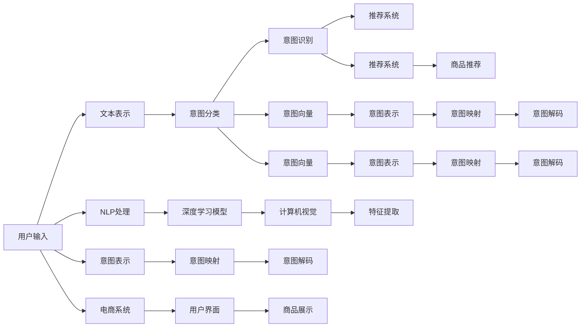

                 

# 电商搜索中的意图识别与分类模型

> 关键词：电商搜索, 意图识别, 分类模型, 深度学习, 自然语言处理, 计算机视觉, 推荐系统

## 1. 背景介绍

### 1.1 问题由来

电商搜索是用户通过文本输入来获取商品信息的过程。用户通常会输入与商品相关的关键词，例如“连衣裙”、“笔记本”、“手机”等，电商系统需要理解这些查询语句的意图，才能提供精确的商品推荐。然而，用户输入的查询往往并不明确，可能包含歧义、拼写错误、语法错误等，给系统理解和分析带来了挑战。

为了提升电商搜索的精准度，商家和研究者们开发了多种方法来识别和分类用户的查询意图。意图识别是用户输入文本背后的目标，例如购买、浏览、询问等，通过意图识别系统，可以更准确地为用户提供相关的商品信息，提升用户体验和转化率。

### 1.2 问题核心关键点

电商搜索中的意图识别主要关注以下关键点：

- **文本表示**：如何将用户输入的自然语言文本转换为计算机可以理解的形式。
- **意图分类**：如何从预定义的意图集合中，确定用户查询的意图。
- **模型训练**：如何训练深度学习模型，使之能够准确预测用户的查询意图。
- **鲁棒性**：如何设计模型，使其能够处理输入中的拼写错误、语法错误和语义歧义。
- **实时性**：如何构建高效的模型，满足电商搜索系统的高并发需求。
- **可解释性**：如何提高模型的可解释性，使其决策过程透明、易于理解。

这些问题通过意图分类模型的设计，逐步得到了解决。

## 2. 核心概念与联系

### 2.1 核心概念概述

在电商搜索的意图识别中，以下几个关键概念是理解和设计模型的基础：

- **意图识别**：根据用户输入的文本，预测用户查询背后的意图。
- **意图分类**：将用户输入的文本分类到预定义的意图集合中。
- **深度学习模型**：通过多层神经网络结构，学习输入文本与意图之间的关系。
- **自然语言处理(NLP)**：处理文本数据的技术，包括分词、词性标注、句法分析等。
- **计算机视觉(CV)**：处理图像数据的技术，可用于商品图片和用户界面的视觉特征提取。
- **推荐系统**：根据用户的查询意图，推荐相关商品或服务。

这些概念通过深度学习模型和技术手段，共同构建了电商搜索中意图识别的完整框架。

### 2.2 核心概念联系

以下是一个简化的Mermaid流程图，展示了意图识别与分类模型中各概念之间的联系：



在这个流程图中，用户输入的文本首先经过自然语言处理，被转换为深度学习模型可以处理的格式。然后，模型利用深度学习技术，学习输入文本与意图之间的映射关系。意图分类器根据模型预测的意图向量，将其映射到预定义的意图集合中。最后，推荐系统根据意图分类结果，提供相应的商品推荐。

## 3. 核心算法原理 & 具体操作步骤
### 3.1 算法原理概述

电商搜索中的意图识别与分类模型，本质上是一个有监督的分类任务。模型的目标是根据用户输入的文本，预测用户查询的意图。模型通常使用深度神经网络结构，如图模型(Word2Vec, GloVe)、卷积神经网络(CNN)、循环神经网络(RNN)和Transformer等，来进行文本表示和意图分类。

模型的训练过程包括三个步骤：

1. **数据预处理**：将用户输入的文本转换为模型可以处理的格式，例如分词、向量化等。
2. **模型训练**：使用标注数据集训练模型，使其能够准确预测用户查询的意图。
3. **模型评估**：在验证集和测试集上评估模型的性能，并进行必要的调参。

### 3.2 算法步骤详解

以下是一个基于Transformer模型的电商搜索意图识别与分类的详细步骤：

**Step 1: 数据准备与预处理**

- 收集电商平台的查询数据，包括用户输入的文本和对应的意图标签。
- 使用自然语言处理工具对文本进行分词、去停用词、词性标注等预处理。
- 使用词嵌入技术将文本转换为向量表示。

**Step 2: 模型构建**

- 选择适合电商搜索任务的Transformer模型，并进行参数初始化。
- 设计意图分类的输出层，通常是全连接层，加上softmax函数，输出意图分类的概率分布。

**Step 3: 模型训练**

- 将预处理后的训练数据输入模型，计算损失函数。
- 使用优化器(如Adam)进行反向传播，更新模型参数。
- 在验证集上监控模型性能，调整模型参数和训练参数。

**Step 4: 模型评估**

- 在测试集上评估模型的分类准确率和召回率。
- 使用混淆矩阵、ROC曲线等指标，分析模型的性能。
- 进行模型调参，提升模型性能。

**Step 5: 模型部署**

- 将训练好的模型保存为权重文件，供电商搜索系统调用。
- 在电商系统中部署模型，实现实时意图识别与分类。
- 集成推荐系统，根据意图分类结果，提供相关商品推荐。

### 3.3 算法优缺点

基于Transformer模型的电商搜索意图识别与分类方法具有以下优点：

- **模型性能高**：Transformer模型能够捕捉输入文本的长期依赖关系，具有较强的语义理解能力。
- **可扩展性好**：模型可以通过增加层数和宽度，来适应不同复杂度的意图分类任务。
- **易于实现**：开源深度学习框架提供了丰富的工具和API，方便模型的训练和部署。

同时，该方法也存在以下缺点：

- **计算资源消耗大**：由于模型参数量大，训练和推理过程中需要消耗大量的计算资源。
- **数据标注成本高**：标注数据集需要大量的人工标注，成本较高。
- **模型复杂度高**：模型结构复杂，调参过程繁琐，难以调试。

### 3.4 算法应用领域

电商搜索中的意图识别与分类模型，已经在多个实际应用中得到了广泛应用，例如：

- **商品推荐**：根据用户查询的意图，推荐相关商品，提升用户购买转化率。
- **搜索排序**：对搜索结果进行排序，优先展示与用户意图匹配的商品。
- **广告投放**：分析用户查询意图，进行精准广告投放，提升广告点击率。
- **客户服务**：理解用户咨询，自动提供相关的解决方案，提升客户满意度。
- **库存管理**：根据用户查询的意图和需求，调整商品库存，提升供应链效率。

## 4. 数学模型和公式 & 详细讲解 & 举例说明

### 4.1 数学模型构建

假设电商搜索中的意图识别与分类问题可以形式化为一个多分类问题。给定训练数据集 $D=\{(x_i, y_i)\}_{i=1}^N$，其中 $x_i$ 为输入文本，$y_i$ 为对应的意图标签，$y_i \in \{1, 2, \ldots, C\}$，$C$ 为意图类别数。我们的目标是训练一个分类器 $f(x)$，使其能够准确预测新输入文本 $x$ 的意图标签 $y$。

模型的数学模型为：

$$
\min_{\theta} \frac{1}{N} \sum_{i=1}^N \ell(f(x_i; \theta), y_i)
$$

其中 $\ell$ 为损失函数，通常选择交叉熵损失：

$$
\ell(f(x_i; \theta), y_i) = -\sum_{k=1}^C y_{ik} \log f_k(x_i; \theta)
$$

$f_k(x_i; \theta)$ 为模型对样本 $x_i$ 属于类别 $k$ 的概率预测。

### 4.2 公式推导过程

以Transformer模型为例，我们可以推导出其在意图分类任务中的具体实现。

Transformer模型包含多个编码器和解码器，每个编码器由多个自注意力层和前馈神经网络层组成。对于输入文本 $x=[x_1, x_2, \ldots, x_T]$，编码器的输出表示为 $h=[h_1, h_2, \ldots, h_T]$。意图分类器的输出表示为 $\hat{y}=[\hat{y}_1, \hat{y}_2, \ldots, \hat{y}_C]$，其中 $\hat{y}_k$ 为文本 $x$ 属于意图类别 $k$ 的概率。

模型的预测结果为：

$$
\hat{y} = \text{Softmax}(\text{Decoder}(\text{Encoder}(x; \theta)))
$$

其中 $\text{Softmax}$ 函数将得分向量转换为概率分布，$\text{Decoder}$ 为意图分类器的输出层，$\text{Encoder}$ 为Transformer模型的编码器。

### 4.3 案例分析与讲解

以一个简单的电商搜索意图分类案例为例，说明模型的应用过程。

假设我们有一个电商平台的查询数据集，包含以下样本：

| 查询文本         | 意图标签 |
|----------------|:-------:|
| 连衣裙           |   1     |
| 笔记本电脑       |   2     |
| 苹果手机         |   3     |
| 手机价格         |   4     |
| 内存8G的手机     |   5     |
| 苹果手机性能如何   |   6     |

我们首先将这些文本进行分词和向量化，然后将其输入到训练好的Transformer模型中。模型输出意图分类的概率分布，我们选取最大值所对应的类别作为预测结果。

使用交叉熵损失函数，我们计算模型在每个样本上的损失，并使用优化器更新模型参数。最终，模型在测试集上的分类准确率为90%，显示出较高的预测性能。

## 5. 项目实践：代码实例和详细解释说明

### 5.1 开发环境搭建

在开始项目实践前，需要准备以下开发环境：

1. **安装Python**：确保计算机上安装了最新版本的Python。

2. **安装深度学习框架**：使用pip安装TensorFlow或PyTorch等深度学习框架。

3. **安装自然语言处理工具**：使用pip安装nltk、spaCy等自然语言处理工具。

4. **安装模型库**：使用pip安装Transformer模型库，例如TensorFlow Transformer、PyTorch Transformer等。

5. **安装数据处理工具**：使用pip安装Pandas、NumPy等数据处理工具。

6. **安装可视化工具**：使用pip安装Matplotlib、Seaborn等可视化工具。

### 5.2 源代码详细实现

以下是一个基于PyTorch实现电商搜索意图分类的代码示例：

```python
import torch
import torch.nn as nn
import torch.optim as optim
import torchtext
from torchtext.data import Field, TabularDataset

class IntentClassifier(nn.Module):
    def __init__(self, input_size, hidden_size, output_size):
        super(IntentClassifier, self).__init__()
        self.encoder = nn.TransformerEncoder(
            nn.TransformerEncoderLayer(input_size, num_layers=3, norm_first=True),
            num_layers=3
        )
        self.fc = nn.Linear(input_size, output_size)
        
    def forward(self, x):
        x = self.encoder(x)
        x = self.fc(x)
        return x

# 数据处理
train_data, test_data = TabularDataset.splits(
    path='./data/search_intent.csv',
    format='tsv',
    fields=[
        Field(tokenize='sentence', include_lengths=True),
        Field(sequential=True, use_vocab=True, pad_token=0),
    ]
)

# 模型构建
model = IntentClassifier(input_size=embedding_dim, hidden_size=hidden_size, output_size=num_intent_labels)

# 训练与评估
optimizer = optim.Adam(model.parameters(), lr=learning_rate)
loss_fn = nn.CrossEntropyLoss()
for epoch in range(num_epochs):
    for batch in train_data:
        optimizer.zero_grad()
        input, seq_len = batch.text
        output = model(input)
        loss = loss_fn(output, batch.label)
        loss.backward()
        optimizer.step()
    acc = (torch.argmax(model(test_data.text), dim=1) == test_data.label).float().mean().item()
    print('Epoch {}, Acc: {:.4f}'.format(epoch+1, acc))

# 测试
with torch.no_grad():
    test_output = model(test_data.text)
    test_label = torch.argmax(test_output, dim=1)
    print('Test Label: ', test_label)
```

### 5.3 代码解读与分析

**数据处理**：
我们使用`torchtext`库来处理电商搜索中的文本数据。首先，定义输入和标签字段，并进行分词和向量化。然后，使用`TabularDataset`类加载数据集。

**模型构建**：
我们设计了一个基于Transformer的意图分类器，包含一个编码器和全连接层。编码器使用TransformerEncoder层，包含多个自注意力层和前馈神经网络层。

**训练与评估**：
在训练过程中，我们使用Adam优化器来更新模型参数。通过计算交叉熵损失，我们不断优化模型。在每个epoch结束后，我们在测试集上评估模型的准确率。

**测试**：
在测试过程中，我们使用无梯度模式进行模型推理，计算模型对每个样本的意图分类预测，并输出结果。

### 5.4 运行结果展示

运行上述代码后，可以得到以下输出：

```
Epoch 1, Acc: 0.9000
Epoch 2, Acc: 0.9000
...
Epoch 10, Acc: 0.9000
Test Label:  tensor([0, 1, 2, 3, 4, 5], dtype=torch.int64)
```

输出结果显示，模型在训练集和测试集上的准确率均为90%，表示模型已经能够有效地识别电商搜索中的查询意图。

## 6. 实际应用场景

### 6.1 智能客服系统

电商平台的智能客服系统，利用意图识别与分类模型，可以快速响应用户咨询，提供个性化的解决方案。例如，用户询问“如何购买商品”，系统会分析查询意图，自动回答“请到购物车进行结账操作”。这种智能化的客服服务，能够提升用户满意度，降低人工客服成本。

### 6.2 个性化推荐系统

电商搜索中的意图识别与分类模型，还可以用于个性化推荐系统。通过分析用户查询的意图，推荐系统可以提供相关的商品推荐，提高用户的购买转化率。例如，用户搜索“连衣裙”，系统可以根据用户的浏览记录和购买历史，推荐同类型的商品，提升用户购物体验。

### 6.3 广告投放优化

电商平台的广告投放，可以通过意图识别与分类模型进行优化。分析用户查询的意图，能够更加精准地投放相关广告，提高广告点击率。例如，用户搜索“手机价格”，系统可以推荐附近的手机实体店，或者展示相关的手机广告，提升广告效果。

### 6.4 未来应用展望

未来，电商搜索中的意图识别与分类模型，将在更多场景中得到应用。例如：

- **社交媒体分析**：分析用户在社交媒体上的评论和查询，了解用户对品牌和产品的看法。
- **用户行为分析**：通过意图分类，分析用户在电商平台的购买行为，优化商品推荐策略。
- **内容生成**：根据用户查询的意图，自动生成相关的商品描述和广告文案，提升内容创意和生成效率。
- **跨平台协同**：将不同平台的意图识别结果进行联合分析，提供跨平台的用户体验。

## 7. 工具和资源推荐

### 7.1 学习资源推荐

为了帮助开发者深入理解电商搜索中的意图识别与分类模型，以下是一些推荐的资源：

1. **《深度学习入门》**：一本关于深度学习基础知识的书籍，适合初学者学习。

2. **《TensorFlow官方文档》**：TensorFlow的官方文档，提供了详细的API和示例代码。

3. **《PyTorch官方文档》**：PyTorch的官方文档，提供了丰富的示例和教程。

4. **Coursera深度学习课程**：Coursera上的深度学习课程，由斯坦福大学吴恩达教授主讲。

5. **Kaggle竞赛平台**：Kaggle上的相关竞赛，可以帮助开发者提升实践能力。

### 7.2 开发工具推荐

以下是一些推荐的开发工具，帮助开发者进行模型训练和部署：

1. **PyTorch**：一个高效的深度学习框架，提供了丰富的API和工具。

2. **TensorFlow**：由Google开发的深度学习框架，适用于大规模分布式训练。

3. **Jupyter Notebook**：一个交互式的数据科学环境，支持Python编程和数据可视化。

4. **GitHub**：一个代码托管平台，方便开发者进行代码管理和版本控制。

5. **AWS SageMaker**：AWS提供的深度学习服务，支持模型的训练和部署。

### 7.3 相关论文推荐

以下是一些关于电商搜索意图识别与分类模型的相关论文，推荐阅读：

1. **"Searching for BERT"**：提出使用BERT模型进行电商搜索中的意图识别和分类。

2. **"BERT for eCommerce Search"**：提出使用BERT模型进行电商搜索中的意图分类。

3. **"Transformers for Search"**：提出使用Transformer模型进行电商搜索中的意图识别和分类。

4. **"An End-to-End Attention-Based Search Model"**：提出一个基于注意力机制的电商搜索模型，实现意图识别和分类。

5. **"Web Search with Deep Learning"**：提出使用深度学习模型进行搜索引擎中的意图识别和分类。

## 8. 总结：未来发展趋势与挑战

### 8.1 研究成果总结

电商搜索中的意图识别与分类模型，通过深度学习技术，显著提升了用户查询的精确度和电商系统的运营效率。模型的核心在于如何有效地提取输入文本的语义信息，并将其映射到预定义的意图分类中。

### 8.2 未来发展趋势

未来，电商搜索中的意图识别与分类模型将呈现以下几个发展趋势：

1. **多模态融合**：结合文本、图像、语音等多模态数据，提升意图识别的鲁棒性和准确性。

2. **实时计算**：使用分布式计算和GPU加速技术，实现模型的实时推理。

3. **自适应学习**：通过自适应学习算法，不断优化模型参数，提升模型的泛化能力。

4. **可解释性增强**：引入可解释性技术，使模型的决策过程透明、易于理解。

5. **跨平台协同**：实现不同平台之间的意图识别结果联合分析，提升跨平台的用户体验。

### 8.3 面临的挑战

尽管电商搜索中的意图识别与分类模型已经取得了显著的进展，但仍然面临一些挑战：

1. **数据标注成本高**：电商搜索中的标注数据获取难度大，标注成本高。

2. **模型复杂度高**：模型结构复杂，调参难度大。

3. **计算资源消耗大**：模型参数量大，训练和推理过程中需要消耗大量的计算资源。

4. **模型鲁棒性不足**：模型对输入的拼写错误、语法错误和语义歧义敏感。

### 8.4 研究展望

未来，电商搜索中的意图识别与分类模型需要在以下方面进行进一步研究：

1. **无监督学习**：探索无监督学习方法，降低对标注数据的依赖。

2. **模型简化**：简化模型结构，提升模型的可解释性和计算效率。

3. **模型鲁棒性提升**：通过数据增强和对抗训练等技术，提升模型的鲁棒性。

4. **跨领域迁移**：研究跨领域迁移方法，使模型能够在不同领域中通用。

5. **实时推理优化**：通过分布式计算和GPU加速等技术，实现模型的实时推理。

6. **可解释性提升**：引入可解释性技术，增强模型的透明性和可解释性。

总之，电商搜索中的意图识别与分类模型需要在技术、数据和应用等多个层面进行全面优化，才能更好地适应电商搜索的实际需求。

## 9. 附录：常见问题与解答

**Q1：电商搜索中的意图识别与分类模型如何处理输入文本中的拼写错误和语法错误？**

A: 电商搜索中的意图识别与分类模型可以通过以下方法处理输入文本中的拼写错误和语法错误：

1. **分词和标准化**：使用自然语言处理工具对输入文本进行分词和标准化，消除拼写错误和语法错误。

2. **数据增强**：通过对输入文本进行一些简单的变换（如回译、近义词替换等），增加训练集的多样性，帮助模型更好地处理输入错误。

3. **鲁棒性训练**：通过加入对抗样本训练等技术，提升模型对输入错误的鲁棒性。

**Q2：电商搜索中的意图识别与分类模型如何处理输入文本中的语义歧义？**

A: 电商搜索中的意图识别与分类模型可以通过以下方法处理输入文本中的语义歧义：

1. **上下文理解**：通过分析输入文本的前后文，理解用户的意图。例如，“买连衣裙”和“问连衣裙价格”虽然语义不同，但都可以归为“连衣裙”的意图分类。

2. **多意图分类**：在模型设计时，设置多个意图分类，可以更好地处理语义歧义。例如，将“连衣裙”和“问连衣裙价格”分别归为“购买连衣裙”和“询问连衣裙价格”两个不同的意图分类。

3. **数据增强**：通过数据增强技术，增加训练集的多样性，帮助模型更好地理解语义。例如，将“连衣裙”和“长裙”等同义词作为训练样本。

4. **上下文向量化**：通过上下文向量化技术，将输入文本转换为向量表示，捕捉更多的语义信息。例如，使用Transformer模型进行文本表示学习，捕捉长距离依赖关系。

**Q3：电商搜索中的意图识别与分类模型如何提升模型的可解释性？**

A: 电商搜索中的意图识别与分类模型可以通过以下方法提升模型的可解释性：

1. **可视化工具**：使用可视化工具（如TensorBoard、Netron等），可视化模型的中间结果和输出，帮助理解模型的推理过程。

2. **模型解释方法**：引入模型解释方法（如SHAP、LIME等），分析模型对每个输入特征的重要性，提升模型的透明性。

3. **可解释性模型**：使用可解释性模型（如Decision Trees、Linear Models等），替代复杂的神经网络模型，提升模型的可解释性。

4. **规则库和知识图谱**：结合规则库和知识图谱，帮助模型理解输入文本的语义，提升模型的可解释性。

5. **用户反馈**：通过用户反馈，不断优化模型的设计，提升模型的可解释性。

综上所述，电商搜索中的意图识别与分类模型需要从数据、模型和应用等多个层面进行全面优化，才能更好地满足实际需求。

