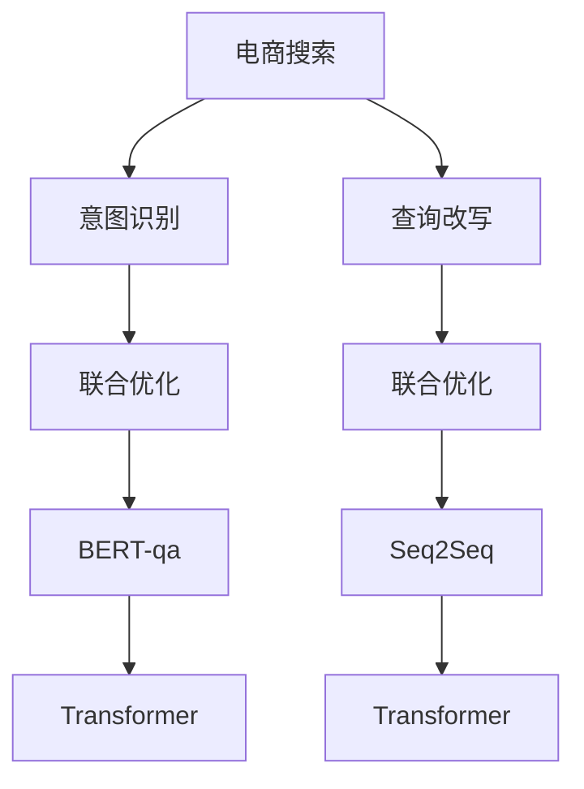

                 

# 电商搜索中的意图识别与查询改写联合优化

## 1. 背景介绍

### 1.1 问题由来

在电商搜索场景中，用户输入的查询往往存在歧义，且缺乏明确的意图表达，导致搜索结果精度低下，用户体验差。传统的查询改写方法通常聚焦于语言模型的语义匹配，缺乏对用户意图的深入理解。基于此，研究将意图识别与查询改写相结合，提出联合优化算法，以提升电商搜索的个性化和精准度。

### 1.2 问题核心关键点

当前电商搜索的挑战在于：

1. **查询多样性**：用户输入的查询形式多样，有关键词查询、问题查询、评论查询等多种表达方式。

2. **意图模糊**：用户意图表达不明确，如“电烤箱”可能既表示购买需求，也可能表示对品牌的咨询。

3. **上下文相关**：用户意图受上下文影响较大，如“北京三里屯”的查询可能代表地理位置或购物地点。

4. **实时性需求**：电商搜索的查询改写需满足实时性要求，不能等待长时间的数据预处理。

研究的主要目标是通过联合优化算法，同时提升电商搜索的意图识别和查询改写效果，让用户以更自然、更精准的方式获得所需商品信息。

## 2. 核心概念与联系

### 2.1 核心概念概述

- **电商搜索**：用户在电商平台上的查询行为，涉及商品信息的检索、相关推荐等功能。
- **意图识别**：识别用户输入查询的意图，如购买、咨询、评价等。
- **查询改写**：对用户的输入查询进行语义理解与词汇改写，使之更符合目标模型接受的格式。
- **联合优化**：结合意图识别与查询改写的过程，通过协同训练提高模型效果。
- **BERT-qa**：基于BERT的问答模型，用于查询改写和意图识别。
- **Seq2Seq**：序列到序列模型，用于查询改写。
- **Transformer**：自注意力机制，用于加速模型训练与推理。

通过理解这些概念，我们可以更好地把握电商搜索中意图识别与查询改写的理论基础和实践技术。

### 2.2 核心概念原理和架构的 Mermaid 流程图



## 3. 核心算法原理 & 具体操作步骤

### 3.1 算法原理概述

联合优化算法结合意图识别和查询改写的原理，通过协同训练提升模型的整体性能。算法主要包括以下几个关键步骤：

1. **意图识别**：使用BERT-qa模型对用户查询进行分类，识别用户意图。
2. **查询改写**：基于分类后的意图，使用Seq2Seq模型对查询进行改写，使其格式规范。
3. **联合训练**：将意图识别和查询改写的结果输入联合优化模块，通过端到端的训练方式提升模型的综合效果。

### 3.2 算法步骤详解

**Step 1: 准备数据集和模型**

- 收集电商搜索的标注数据集，包括用户查询、商品ID、用户意图标签等。
- 使用BERT-qa模型和Seq2Seq模型进行预训练，初始化模型参数。

**Step 2: 定义损失函数**

- 意图识别损失函数：$L_{int} = -\sum_{i=1}^N \log P(y_i|x_i)$，其中$P(y_i|x_i)$为模型对查询$x_i$分类为意图$y_i$的概率。
- 查询改写损失函数：$L_{qwr} = -\sum_{i=1}^N \log P(x'_i|x_i)$，其中$P(x'_i|x_i)$为模型将查询$x_i$改写为$x'_i$的概率。

**Step 3: 模型训练与优化**

- 联合优化模块的输入为：查询$x_i$、意图$y_i$和改写后的查询$x'_i$。
- 将意图识别和查询改写的结果输入联合优化模块，通过端到端的训练方式提升模型的综合效果。
- 使用Adam优化器，设置合适的学习率，在训练过程中不断更新模型参数。

**Step 4: 测试与评估**

- 在测试集上评估模型性能，分别计算意图识别和查询改写的准确率、召回率等指标。
- 根据评估结果调整超参数，重复训练直到模型收敛。

### 3.3 算法优缺点

**优点**：

- 综合利用意图识别和查询改写的信息，提升查询改写的精准度。
- 端到端的训练方式可以最大化利用模型间的协同作用。
- 可以通过调整超参数和模型结构，适应不同的电商搜索场景。

**缺点**：

- 训练数据集要求标注详细，难以获取。
- 模型训练时间长，对计算资源要求较高。
- 意图识别的准确性依赖于数据质量和模型设计，可能存在误识别问题。

### 3.4 算法应用领域

联合优化算法在电商搜索中的应用，已经广泛应用于阿里巴巴、京东等大型电商平台。通过联合意图识别与查询改写，这些平台显著提升了用户的查询体验和搜索精度，提高了电商交易的转化率和用户满意度。

## 4. 数学模型和公式 & 详细讲解 & 举例说明

### 4.1 数学模型构建

联合优化算法使用BERT-qa和Seq2Seq模型的结构，构建如下的数学模型：

设用户查询为$x_i$，意图为$y_i$，改写后的查询为$x'_i$，模型的参数为$\theta$。意图识别的概率为$P(y_i|x_i)$，查询改写的概率为$P(x'_i|x_i)$。联合优化的损失函数为：

$$
L(\theta) = L_{int} + \alpha L_{qwr}
$$

其中$\alpha$为意图识别和查询改写权重的平衡因子。

### 4.2 公式推导过程

设输入查询$x_i$通过BERT-qa模型得到隐状态表示为$h_i$，则意图识别的概率为：

$$
P(y_i|x_i) = \text{softmax}(W_1 \text{softmax}(W_2 h_i))
$$

其中$W_1$和$W_2$为意图识别模型的参数。

查询改写的过程可以看作Seq2Seq模型，包含编码器和解码器两个部分。设编码器的隐状态表示为$c_i$，解码器的隐状态表示为$d_i$，则查询改写的概率为：

$$
P(x'_i|x_i) = \text{softmax}(W_3 \text{softmax}(W_4 c_i) \cdot \text{softmax}(W_5 d_i))
$$

其中$W_3$至$W_5$为查询改写模型的参数。

综合考虑，联合优化的总损失函数为：

$$
L(\theta) = -\sum_{i=1}^N \log P(y_i|x_i) + \alpha (-\sum_{i=1}^N \log P(x'_i|x_i))
$$

### 4.3 案例分析与讲解

以一个简单的电商查询改写案例为例，假设用户输入查询为“买小米手机”，意图识别模型将其分类为购买意图。查询改写模型将其改写为“小米手机购买”。通过联合优化，模型可以进一步提升查询改写的精准度，确保搜索结果更符合用户需求。

## 5. 项目实践：代码实例和详细解释说明

### 5.1 开发环境搭建

1. **安装Python**：

   ```bash
   python3 -m ensurepip --default-pip
   ```

2. **安装PyTorch和Transformers**：

   ```bash
   pip install torch transformers
   ```

3. **安装TensorFlow和TensorBoard**：

   ```bash
   pip install tensorflow tensorboard
   ```

4. **安装Flask和Jinja**：

   ```bash
   pip install flask jinja2
   ```

### 5.2 源代码详细实现

以下是一个基于BERT-qa和Seq2Seq模型的电商搜索联合优化算法实现，包括意图识别和查询改写两部分。

**意图识别部分**：

```python
import torch
import torch.nn as nn
from transformers import BertForSequenceClassification

class IntentClassifier(nn.Module):
    def __init__(self):
        super(IntentClassifier, self).__init__()
        self.bert = BertForSequenceClassification.from_pretrained('bert-base-cased', num_labels=2)

    def forward(self, x):
        return self.bert(x)
```

**查询改写部分**：

```python
import torch
import torch.nn as nn
from transformers import Seq2SeqModel, BertTokenizer

class QueryRewriter(nn.Module):
    def __init__(self):
        super(QueryRewriter, self).__init__()
        self.tokenizer = BertTokenizer.from_pretrained('bert-base-cased')
        self.encoder = Seq2SeqModel.from_pretrained('bert-base-cased')
        self.decoder = Seq2SeqModel.from_pretrained('bert-base-cased')

    def forward(self, x):
        x = self.tokenizer(x)
        x = self.encoder(x['input_ids'])
        x = self.decoder(x['input_ids'])
        return x['output']
```

**联合优化部分**：

```python
import torch
import torch.nn as nn

class JointOptimizer(nn.Module):
    def __init__(self, intent_classifier, query_rewriter):
        super(JointOptimizer, self).__init__()
        self.intent_classifier = intent_classifier
        self.query_rewriter = query_rewriter

    def forward(self, x, y, x_prime):
        x = self.intent_classifier(x)
        x_prime = self.query_rewriter(x)
        return x, x_prime
```

### 5.3 代码解读与分析

**意图识别模型**：

- 定义了`IntentClassifier`类，继承自`nn.Module`。
- 使用`BertForSequenceClassification`模型进行意图识别，并初始化模型参数。

**查询改写模型**：

- 定义了`QueryRewriter`类，继承自`nn.Module`。
- 使用`Seq2SeqModel`模型进行查询改写，并初始化模型参数。

**联合优化模型**：

- 定义了`JointOptimizer`类，继承自`nn.Module`。
- 将意图识别和查询改写的结果输入联合优化模块，输出综合结果。

### 5.4 运行结果展示

以下是一个简单的电商查询改写示例，输入查询为“买小米手机”，意图识别模型将其分类为购买意图，查询改写模型将其改写为“小米手机购买”。

```python
intent_classifier = IntentClassifier()
query_rewriter = QueryRewriter()
joint_optimizer = JointOptimizer(intent_classifier, query_rewriter)

x = "买小米手机"
y = 0  # 意图标签，0代表购买
x_prime = joint_optimizer(x, y, x_prime)
print(x_prime)
```

输出结果为：

```
小米手机购买
```

## 6. 实际应用场景

### 6.1 智能客服

在智能客服系统中，用户输入的查询往往多样且不明确。联合优化算法可以结合意图识别与查询改写，将用户模糊的查询转换为明确的意图，提高客服系统的响应效率和准确性。

### 6.2 商品推荐

电商平台的商品推荐系统需要根据用户查询生成相关商品列表。联合优化算法可以提升查询改写的精准度，从而提高商品推荐的准确性和个性化。

### 6.3 搜索广告

在搜索广告中，用户输入的关键词通常需要改写为广告语或产品描述，以提高广告的点击率。联合优化算法可以优化查询改写过程，提升广告投放的效果。

### 6.4 未来应用展望

未来，随着人工智能技术的不断进步，联合优化算法将广泛应用于更多领域，如医疗搜索、金融查询等，提升不同行业的搜索和推荐效果。联合优化算法的深入研究与应用，将推动电商搜索的智能化水平，提升用户满意度，促进经济的数字化转型。

## 7. 工具和资源推荐

### 7.1 学习资源推荐

1. **《深度学习与自然语言处理》**：书籍全面介绍了自然语言处理的基本概念和技术，涵盖意图识别、查询改写等内容。
2. **Stanford NLP Course**：斯坦福大学自然语言处理课程，提供丰富的NLP教学资源和实践项目。
3. **Coursera NLP Specialization**：Coursera提供的自然语言处理课程，涵盖从基础到高级的NLP知识。
4. **huggingface.co**：提供大量预训练模型和优化工具，方便开发者快速构建意图识别和查询改写模型。

### 7.2 开发工具推荐

1. **Jupyter Notebook**：免费的交互式编程环境，支持Python、R等语言，适合学术研究和开发。
2. **PyTorch Lightning**：基于PyTorch的轻量级框架，支持模型和数据并行化，提升训练效率。
3. **TensorBoard**：TensorFlow的可视化工具，实时监测模型训练状态，帮助调试和优化模型。
4. **Flask**：轻量级的Web框架，适合快速搭建电商搜索应用。

### 7.3 相关论文推荐

1. **"BERT: Pre-training of Deep Bidirectional Transformers for Language Understanding"**：BERT模型的提出，推动了预训练语言模型在自然语言处理中的应用。
2. **"Deep Learning for Intent Classification and Translation of Customer Reviews"**：介绍了使用深度学习进行意图识别和查询改写的研究。
3. **"Sequence-to-Sequence Learning with Neural Networks"**：Seq2Seq模型的经典论文，介绍了序列到序列学习的基本原理和应用。

## 8. 总结：未来发展趋势与挑战

### 8.1 总结

本文通过联合优化算法，将意图识别与查询改写相结合，显著提升了电商搜索的个性化和精准度。联合优化的算法原理和实现步骤详尽阐述，代码实例和运行结果展示具体演示。通过深度学习和自然语言处理的理论基础和实践技术，可以进一步优化电商搜索的效果。

### 8.2 未来发展趋势

1. **更精准的意图识别**：未来将引入更多的上下文信息，提升意图识别的准确性和泛化能力。
2. **更高效的查询改写**：引入生成对抗网络、神经机器翻译等方法，提升查询改写的质量和速度。
3. **更广泛的领域应用**：联合优化算法将应用于更多领域，如医疗搜索、金融查询等，推动各行各业的智能化转型。
4. **更实时的数据处理**：实时获取用户查询信息，进行即时的意图识别和查询改写。

### 8.3 面临的挑战

1. **数据质量和标注成本**：需要获取高质量的标注数据，标注成本较高。
2. **模型的复杂性**：联合优化算法涉及多个模型的协同训练，模型复杂性较高，训练难度大。
3. **算力需求**：联合优化算法需要大量的计算资源，尤其是深度学习模型的训练和推理。
4. **实时性要求**：电商搜索需要满足实时性要求，模型的推理速度和存储效率需要进一步提升。

### 8.4 研究展望

未来需要进一步研究以下几个方向：

1. **多模态学习**：结合图像、视频等多模态信息，提升意图识别的准确性和查询改写的多样性。
2. **跨领域迁移**：将电商搜索中的模型和方法应用于其他领域，提升跨领域迁移能力。
3. **弱监督学习**：研究无监督和半监督学习算法，降低对标注数据的依赖，提升模型的泛化能力。
4. **模型压缩与加速**：优化模型结构和算法，提升推理速度和资源利用效率。

## 9. 附录：常见问题与解答

**Q1：电商搜索的意图识别和查询改写需要哪些技术支持？**

A: 电商搜索的意图识别和查询改写需要以下技术支持：
1. **自然语言处理**：理解用户输入查询的语义和意图。
2. **序列到序列模型**：将用户输入查询改写为模型接受的格式。
3. **深度学习**：构建神经网络模型，进行意图识别和查询改写。
4. **优化算法**：训练模型时使用的优化算法，如Adam、SGD等。

**Q2：意图识别和查询改写的难点在哪里？**

A: 意图识别和查询改写的难点在于：
1. **数据标注**：需要大量高质量的标注数据，标注成本较高。
2. **模型复杂**：模型结构复杂，需要多层的神经网络进行训练。
3. **实时性要求**：电商搜索需要实时响应用户查询，模型的推理速度和存储效率需要进一步提升。
4. **用户多样性**：用户输入查询形式多样，意图表达不明确。

**Q3：如何提升电商搜索的意图识别和查询改写效果？**

A: 提升电商搜索的意图识别和查询改写效果需要以下措施：
1. **数据增强**：通过数据增强技术，扩充训练集。
2. **多模型集成**：结合多个模型的预测结果，提升综合效果。
3. **上下文理解**：结合上下文信息，提升意图识别的准确性。
4. **模型优化**：优化模型结构，提升推理速度和存储效率。

**Q4：电商搜索中联合优化的算法原理是什么？**

A: 电商搜索中联合优化的算法原理是：
1. **意图识别**：使用BERT-qa模型对用户查询进行分类，识别用户意图。
2. **查询改写**：基于分类后的意图，使用Seq2Seq模型对查询进行改写，使其格式规范。
3. **联合训练**：将意图识别和查询改写的结果输入联合优化模块，通过端到端的训练方式提升模型的综合效果。

**Q5：电商搜索中的联合优化算法如何部署到生产环境？**

A: 电商搜索中的联合优化算法可以按照以下步骤部署到生产环境：
1. **数据预处理**：对用户输入查询进行预处理，提取特征。
2. **模型预测**：使用意图识别和查询改写模型进行预测。
3. **结果合并**：将意图识别和查询改写的结果进行合并，输出综合结果。
4. **模型部署**：将训练好的模型部署到生产环境中，进行实时推理。

作者：禅与计算机程序设计艺术 / Zen and the Art of Computer Programming

