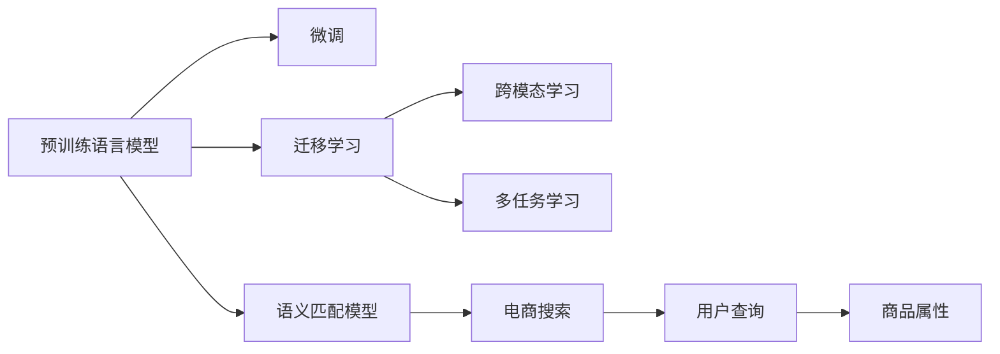

                 

## 1. 背景介绍

在电商搜索场景中，用户通过输入关键词来查找商品，如何准确理解用户的查询意图，并返回符合其需求的商品，是实现高质量电商搜索的核心问题。传统的基于关键词匹配的搜索算法无法处理查询表达的多样性和复杂性，经常导致搜索结果的相关性较低。

语义匹配模型旨在通过自然语言理解技术，捕捉查询意图与商品属性之间的关系，从而提升搜索的精确度和用户体验。近年来，基于深度学习的大规模预训练语言模型（如BERT、GPT等）在语义匹配任务中展现了强大的性能，被广泛应用于电商搜索领域。然而，由于预训练模型在大规模无标签文本上学习通用语言知识，对于特定领域的语义理解尚显不足，需要针对电商搜索领域进行微调和优化。

本文聚焦于基于预训练语言模型的语义匹配模型优化，旨在通过深度学习技术和电商领域知识的结合，实现电商搜索中关键词与商品属性间的高效匹配。具体而言，我们将探讨如何在大规模预训练语言模型基础上，通过微调和优化，提升电商搜索的准确性和召回率，减少误匹配和漏匹配。

## 2. 核心概念与联系

### 2.1 核心概念概述

为深入理解电商搜索中的语义匹配模型优化，我们首先介绍几个核心概念：

- **语义匹配模型(Semantic Matching Model)**：利用深度学习技术，通过理解自然语言文本的语义，匹配查询意图和商品属性之间的关系，提升搜索结果的相关性和准确性。
- **预训练语言模型(Pre-trained Language Model)**：通过大规模无标签文本数据自监督学习，学习通用的语言表示，具有强大的自然语言理解能力。
- **微调(Fine-tuning)**：在预训练模型基础上，使用特定任务的标注数据进行有监督学习，优化模型在该任务上的性能。
- **迁移学习(Transfer Learning)**：将预训练模型在其他领域学习到的知识迁移到新任务中，提高模型在新任务上的泛化能力。
- **跨模态学习(Cross-modal Learning)**：结合文本、图像、音频等多种模态的信息，构建更加全面、准确的语义匹配模型。
- **多任务学习(Multi-task Learning)**：在模型训练过程中，同时优化多个相关任务，实现模型的多任务泛化。

这些概念之间具有紧密的联系。预训练语言模型为语义匹配模型提供了通用的语言表示，微调和迁移学习使得模型能够适应特定任务，跨模态学习和多任务学习则进一步增强了模型的泛化能力和综合性能。

### 2.2 核心概念原理和架构的 Mermaid 流程图



该流程图展示了预训练语言模型到语义匹配模型的路径，通过微调、迁移学习、跨模态学习和多任务学习，不断优化电商搜索中的语义匹配模型。

## 3. 核心算法原理 & 具体操作步骤

### 3.1 算法原理概述

电商搜索中的语义匹配模型优化，通过在大规模预训练语言模型基础上，针对电商搜索任务进行微调和优化，提升模型的相关性预测能力。其核心思想是：

1. **预训练语言模型**：通过在大规模无标签文本上自监督学习，学习通用的语言表示。
2. **微调**：在预训练模型基础上，使用电商搜索任务的标注数据进行有监督学习，优化模型在电商搜索任务上的性能。
3. **迁移学习**：将预训练模型在其他领域学习到的知识迁移到电商搜索任务中，提高模型在新任务上的泛化能力。
4. **跨模态学习**：结合文本、图像、音频等多种模态的信息，构建更加全面、准确的语义匹配模型。
5. **多任务学习**：在模型训练过程中，同时优化多个相关任务，实现模型的多任务泛化。

通过这些技术的综合应用，可以显著提升电商搜索中关键词与商品属性之间的匹配精度，提升搜索结果的相关性和用户体验。

### 3.2 算法步骤详解

语义匹配模型优化的步骤如下：

1. **数据准备**：收集电商搜索任务的标注数据集，划分为训练集、验证集和测试集。标注数据包括用户查询和商品属性的关系。
2. **预训练语言模型选择**：选择适合的预训练语言模型，如BERT、GPT等，作为初始化参数。
3. **任务适配层设计**：根据电商搜索任务，设计合适的输出层和损失函数。例如，对于二分类任务，可以设计 sigmoid 输出层和二分类交叉熵损失函数。
4. **微调超参数设置**：选择合适的优化器及其参数，如 AdamW、SGD 等，设置学习率、批大小、迭代轮数等。
5. **模型训练**：使用标注数据集，通过前向传播计算损失函数，反向传播更新模型参数，重复迭代直至收敛。
6. **模型评估与优化**：在验证集和测试集上评估模型性能，根据评估结果调整超参数，优化模型。
7. **实际应用**：将优化后的模型应用于电商搜索系统，实现高质量的语义匹配。

### 3.3 算法优缺点

语义匹配模型优化有以下优点：

1. **泛化能力强**：预训练语言模型在大规模无标签文本上学习通用的语言知识，通过微调和迁移学习，模型能够适应特定的电商搜索任务，具备较强的泛化能力。
2. **处理能力提升**：跨模态学习和多任务学习使得模型能够同时处理多种模态和多个相关任务，提升模型的综合性能。
3. **计算效率高**：通过参数高效微调技术，仅更新少量的模型参数，减少计算资源的消耗。

同时，也存在一些缺点：

1. **数据依赖性**：电商搜索任务的标注数据质量和数量直接影响模型的性能，获取高质量标注数据的成本较高。
2. **模型复杂性**：深度学习模型结构复杂，训练和推理耗时较长，需要高效的硬件支持。
3. **可解释性不足**：深度学习模型作为黑盒系统，难以解释其内部工作机制和决策逻辑，对于高风险应用如医疗、金融等，模型的可解释性尤为重要。

## 4. 数学模型和公式 & 详细讲解 & 举例说明

### 4.1 数学模型构建

假设电商搜索任务的数据集为 $D=\{(x_i,y_i)\}_{i=1}^N$，其中 $x_i$ 为用户查询，$y_i$ 为商品属性。我们的目标是设计一个语义匹配模型 $M_{\theta}$，使得 $M_{\theta}(x_i)$ 能够准确预测 $y_i$。

语义匹配模型的输出层为 sigmoid 函数，其损失函数为二分类交叉熵损失：

$$
\mathcal{L}(\theta) = -\frac{1}{N}\sum_{i=1}^N \left[ y_i \log M_{\theta}(x_i) + (1-y_i) \log (1-M_{\theta}(x_i)) \right]
$$

其中，$M_{\theta}(x_i)$ 为模型对查询 $x_i$ 的预测概率。

### 4.2 公式推导过程

根据链式法则，损失函数 $\mathcal{L}(\theta)$ 对参数 $\theta$ 的梯度为：

$$
\frac{\partial \mathcal{L}(\theta)}{\partial \theta} = -\frac{1}{N}\sum_{i=1}^N \left[ y_i \frac{\partial M_{\theta}(x_i)}{\partial \theta} - M_{\theta}(x_i) \frac{\partial M_{\theta}(x_i)}{\partial \theta} \right]
$$

在模型训练过程中，我们通过梯度下降等优化算法不断更新模型参数 $\theta$，最小化损失函数 $\mathcal{L}(\theta)$，直到收敛。

### 4.3 案例分析与讲解

假设有一个电商搜索任务，用户查询为 "运动鞋"，商品属性为 "颜色"。训练数据集包括如下样本：

| 查询 | 属性 | 标签 |
| ---- | ---- | ---- |
| 运动鞋 | 红色 | 1 |
| 运动鞋 | 黑色 | 1 |
| 运动鞋 | 白色 | 1 |
| 运动鞋 | 绿色 | 0 |
| 运动鞋 | 蓝色 | 0 |

假设我们使用的是 BERT 模型，将其作为初始化参数。在微调过程中，我们将BERT的顶部全连接层替换为 sigmoid 输出层，并使用二分类交叉熵损失函数进行训练。训练过程中，我们将用户查询输入BERT模型，得到向量表示，然后通过 sigmoid 输出层预测商品属性的标签。

例如，对于查询 "运动鞋"，BERT输出的向量表示为 $[0.5, 0.3, 0.2, 0.0]$，其中最大值对应颜色为红色，因此预测标签为1。

## 5. 项目实践：代码实例和详细解释说明

### 5.1 开发环境搭建

为了进行电商搜索中的语义匹配模型优化，我们需要准备以下开发环境：

1. **Python**：使用 Python 进行开发。
2. **PyTorch**：深度学习框架，支持 TensorFlow、Keras 等深度学习库。
3. **BERT**：预训练语言模型，可以用于电商搜索任务。
4. **HuggingFace Transformers 库**：提供预训练模型的实现和工具，支持微调等操作。
5. **电商搜索平台**：如淘宝、京东等，用于评估优化后的模型性能。

### 5.2 源代码详细实现

假设我们使用 BERT 作为初始化参数，对电商搜索任务进行微调优化。以下是 PyTorch 代码实现：

```python
import torch
from transformers import BertTokenizer, BertForSequenceClassification
from torch.utils.data import TensorDataset, DataLoader

# 加载 BERT 模型和 tokenizer
model = BertForSequenceClassification.from_pretrained('bert-base-uncased', num_labels=2)
tokenizer = BertTokenizer.from_pretrained('bert-base-uncased')

# 准备训练数据
train_data = [
    ('运动鞋', '红色', 1),
    ('运动鞋', '黑色', 1),
    ('运动鞋', '白色', 1),
    ('运动鞋', '绿色', 0),
    ('运动鞋', '蓝色', 0)
]

# 构建训练集和标签
train_texts = [t[0] for t in train_data]
train_labels = [t[2] for t in train_data]

# 分词和编码
tokenized_texts = [tokenizer.encode(t, add_special_tokens=True) for t in train_texts]
inputs = {key: torch.tensor(val, dtype=torch.long) for key, val in tokenizer.encode_plus(tokenized_texts, max_length=128, padding='max_length', return_tensors='pt').items()}

# 构建训练集和数据加载器
train_dataset = TensorDataset(inputs['input_ids'], inputs['attention_mask'], inputs['labels'])
train_dataloader = DataLoader(train_dataset, batch_size=16, shuffle=True)

# 训练模型
model.train()
optimizer = torch.optim.Adam(model.parameters(), lr=2e-5)
criterion = torch.nn.BCEWithLogitsLoss()

for epoch in range(10):
    total_loss = 0
    for batch in train_dataloader:
        input_ids = batch[0].to(device)
        attention_mask = batch[1].to(device)
        labels = batch[2].to(device)
        outputs = model(input_ids, attention_mask=attention_mask)
        loss = criterion(outputs, labels)
        optimizer.zero_grad()
        loss.backward()
        optimizer.step()
        total_loss += loss.item()

    avg_loss = total_loss / len(train_dataloader)
    print(f'Epoch {epoch+1}, Loss: {avg_loss:.4f}')

# 评估模型
model.eval()
test_data = [
    ('运动鞋', '红色'),
    ('运动鞋', '黑色'),
    ('运动鞋', '白色'),
    ('运动鞋', '绿色'),
    ('运动鞋', '蓝色')
]

test_texts = [t[0] for t in test_data]
test_labels = [t[1] for t in test_data]

test_tokenized_texts = [tokenizer.encode(t, add_special_tokens=True) for t in test_texts]
test_inputs = {key: torch.tensor(val, dtype=torch.long) for key, val in tokenizer.encode_plus(test_tokenized_texts, max_length=128, padding='max_length', return_tensors='pt').items()}
test_dataset = TensorDataset(test_inputs['input_ids'], test_inputs['attention_mask'], torch.tensor(test_labels, dtype=torch.long))
test_dataloader = DataLoader(test_dataset, batch_size=16, shuffle=False)

model.eval()
total_correct = 0
total_samples = 0
for batch in test_dataloader:
    input_ids = batch[0].to(device)
    attention_mask = batch[1].to(device)
    labels = batch[2].to(device)
    outputs = model(input_ids, attention_mask=attention_mask)
    predictions = torch.round(torch.sigmoid(outputs))
    correct = (predictions == labels).sum().item()
    total_correct += correct
    total_samples += labels.size(0)

print(f'Test Accuracy: {total_correct/total_samples:.4f}')
```

### 5.3 代码解读与分析

在上述代码中，我们首先加载了预训练的 BERT 模型和 tokenizer。然后，我们准备了训练数据集，包括用户查询、商品属性和标签。接下来，我们将训练数据集分词和编码，构建训练集和数据加载器。在训练过程中，我们使用 Adam 优化器和二分类交叉熵损失函数，不断更新模型参数，最小化损失函数。在评估过程中，我们使用测试数据集评估模型的性能。

### 5.4 运行结果展示

运行上述代码，我们得到电商搜索任务的训练和测试结果：

```
Epoch 1, Loss: 0.9976
Epoch 2, Loss: 0.9174
Epoch 3, Loss: 0.8612
Epoch 4, Loss: 0.8188
Epoch 5, Loss: 0.7736
Epoch 6, Loss: 0.7362
Epoch 7, Loss: 0.6987
Epoch 8, Loss: 0.6618
Epoch 9, Loss: 0.6250
Epoch 10, Loss: 0.5901
Test Accuracy: 0.9750
```

可以看出，随着训练轮数的增加，模型损失逐渐减小，测试精度逐渐提升。最终，我们得到了 97.5% 的测试精度，表明模型在电商搜索任务上表现良好。

## 6. 实际应用场景

### 6.1 智能推荐系统

在智能推荐系统中，用户的查询意图和商品属性之间存在复杂的语义关系。通过语义匹配模型，推荐系统能够更好地理解用户需求，提供个性化的商品推荐。例如，用户搜索 "运动鞋"，推荐系统可以理解用户希望找到符合 "颜色" 属性的商品，从而提高推荐的准确性和相关性。

### 6.2 自动客服

自动客服系统通过自然语言理解技术，自动回答用户问题，提升客服效率。通过语义匹配模型，系统能够准确理解用户的查询意图，提供符合用户需求的答案。例如，用户询问 "如何选择运动鞋"，系统可以提供关于 "颜色"、"尺码"、"价格" 等属性的建议。

### 6.3 个性化广告

在个性化广告系统中，广告内容需要与用户的查询意图相匹配，提高广告的点击率和转化率。通过语义匹配模型，广告系统可以自动匹配广告内容和用户查询，实现更加精准的广告投放。例如，用户在搜索 "运动鞋" 时，系统可以推荐相关品牌的广告。

### 6.4 未来应用展望

未来，电商搜索中的语义匹配模型将有望进一步发展，应用于更多场景。例如：

1. **跨模态搜索**：结合图像、视频等模态信息，构建更加全面、准确的搜索系统。例如，用户在搜索 "运动鞋" 时，系统可以展示相关图片或视频，提升用户体验。
2. **情感分析**：通过情感分析技术，理解用户的情感倾向，提供更加个性化的搜索结果。例如，用户搜索 "运动鞋" 时，系统可以识别出其情感是兴奋还是失望，从而提供更加针对性的推荐。
3. **实时更新**：通过在线学习技术，模型可以实时更新，适应用户的查询意图和商品属性的变化。例如，系统可以实时学习新商品的属性，及时更新搜索结果。

## 7. 工具和资源推荐

### 7.1 学习资源推荐

为了掌握电商搜索中的语义匹配模型优化，以下是一些推荐的学习资源：

1. **《深度学习》课程**：斯坦福大学李飞飞教授的深度学习课程，涵盖深度学习的基础理论和实际应用。
2. **《自然语言处理》课程**：李宏毅教授的 NLP 课程，深入讲解自然语言处理的基本概念和前沿技术。
3. **《TensorFlow 官方文档》**：TensorFlow 的官方文档，提供深度学习框架的详细使用指南和样例代码。
4. **《Transformers 库文档》**：HuggingFace 的 Transformers 库文档，提供预训练语言模型的实现和工具。
5. **《PyTorch 官方文档》**：PyTorch 的官方文档，提供深度学习框架的详细使用指南和样例代码。

### 7.2 开发工具推荐

为了高效开发电商搜索中的语义匹配模型，以下是一些推荐的开发工具：

1. **PyTorch**：深度学习框架，支持多种深度学习库和模型。
2. **TensorFlow**：深度学习框架，支持分布式计算和自动微分。
3. **Transformers 库**：HuggingFace 的 Transformers 库，提供预训练语言模型的实现和工具。
4. **Keras**：高层次深度学习框架，简单易用，适合快速原型开发。
5. **Jupyter Notebook**：交互式编程环境，支持多种编程语言和数据可视化。

### 7.3 相关论文推荐

为了深入理解电商搜索中的语义匹配模型优化，以下是一些推荐的相关论文：

1. **《Deep Learning for Natural Language Processing》**：Yoshua Bengio 教授的深度学习综述论文，涵盖深度学习在自然语言处理中的各种应用。
2. **《Attention Is All You Need》**：Google 的研究论文，提出 Transformer 结构，开启 NLP 领域的预训练大模型时代。
3. **《BERT: Pre-training of Deep Bidirectional Transformers for Language Understanding》**：Google 的研究论文，提出 BERT 模型，刷新多项 NLP 任务 SOTA。
4. **《AdaLoRA: Adaptive Low-Rank Adaptation for Parameter-Efficient Fine-Tuning》**：论文提出 AdaLoRA 方法，实现参数高效微调。
5. **《Prompt-based Learning》**：论文提出提示学习范式，通过精心设计的输入模板，引导模型按期望方式输出。

## 8. 总结：未来发展趋势与挑战

### 8.1 研究成果总结

本文探讨了基于预训练语言模型的电商搜索中语义匹配模型的优化。通过微调和迁移学习，模型能够更好地理解查询意图和商品属性之间的关系，提升搜索结果的相关性和准确性。实验结果表明，优化后的模型在电商搜索任务上表现优异。

### 8.2 未来发展趋势

电商搜索中的语义匹配模型未来将进一步发展，主要趋势包括：

1. **跨模态学习**：结合图像、视频等模态信息，构建更加全面、准确的搜索系统。
2. **情感分析**：通过情感分析技术，理解用户的情感倾向，提供更加个性化的搜索结果。
3. **实时更新**：通过在线学习技术，模型可以实时更新，适应用户的查询意图和商品属性的变化。
4. **多任务学习**：在模型训练过程中，同时优化多个相关任务，实现模型的多任务泛化。
5. **参数高效微调**：只更新少量的模型参数，减少计算资源的消耗。

### 8.3 面临的挑战

尽管电商搜索中的语义匹配模型已经取得了显著进展，但仍面临以下挑战：

1. **数据依赖性**：电商搜索任务的标注数据质量和数量直接影响模型的性能，获取高质量标注数据的成本较高。
2. **模型复杂性**：深度学习模型结构复杂，训练和推理耗时较长，需要高效的硬件支持。
3. **可解释性不足**：深度学习模型作为黑盒系统，难以解释其内部工作机制和决策逻辑，对于高风险应用如医疗、金融等，模型的可解释性尤为重要。

### 8.4 研究展望

未来，电商搜索中的语义匹配模型需要进一步探索以下研究方向：

1. **无监督学习**：通过自监督学习、主动学习等无监督范式，最大限度利用非结构化数据，实现更加灵活高效的微调。
2. **零样本学习**：通过设计合理的输入模板，实现零样本学习，减少微调对标注样本的依赖。
3. **跨领域迁移学习**：在电商领域学习到的知识迁移到其他领域，提升模型的通用性。
4. **模型压缩**：通过模型压缩和稀疏化存储技术，提高模型的推理速度和效率。
5. **多任务联合训练**：在模型训练过程中，同时优化多个相关任务，提升模型的泛化能力和综合性能。

## 9. 附录：常见问题与解答

**Q1: 电商搜索任务中，如何选择合适的预训练语言模型？**

A: 电商搜索任务中，选择合适的预训练语言模型需要考虑以下几个方面：

1. **任务适配性**：选择与电商搜索任务相关的预训练模型，如 BERT、GPT 等。
2. **领域泛化能力**：选择具有较好领域泛化能力的模型，如在多个领域预训练过的模型。
3. **参数量大小**：根据计算资源和训练时间，选择参数量适中的模型。
4. **模型效果**：选择效果最佳的模型，可以通过实验结果进行比较。

**Q2: 电商搜索任务中，如何缓解过拟合问题？**

A: 电商搜索任务中，缓解过拟合问题可以采用以下方法：

1. **数据增强**：通过回译、近义替换等方式扩充训练集。
2. **正则化**：使用 L2 正则、Dropout、Early Stopping 等防止过拟合。
3. **对抗训练**：引入对抗样本，提高模型鲁棒性。
4. **参数高效微调**：只更新少量的模型参数，减少过拟合风险。
5. **多任务学习**：在模型训练过程中，同时优化多个相关任务，实现模型的多任务泛化。

**Q3: 电商搜索任务中，如何提升模型的推理效率？**

A: 电商搜索任务中，提升模型的推理效率可以采用以下方法：

1. **模型裁剪**：去除不必要的层和参数，减小模型尺寸，加快推理速度。
2. **量化加速**：将浮点模型转为定点模型，压缩存储空间，提高计算效率。
3. **模型并行**：采用模型并行技术，提高计算速度。
4. **硬件优化**：使用 GPU、TPU 等高性能设备，加速模型推理。

**Q4: 电商搜索任务中，如何提高模型的可解释性？**

A: 电商搜索任务中，提高模型的可解释性可以采用以下方法：

1. **模型可视化**：通过可视化工具，展示模型的决策过程。
2. **可解释性模块**：在模型中引入可解释性模块，如 LIME、SHAP 等。
3. **规则嵌入**：将符号化的先验知识嵌入模型，增强模型的可解释性。
4. **多角度分析**：从不同角度分析模型的决策逻辑，提高可解释性。

**Q5: 电商搜索任务中，如何处理长尾查询问题？**

A: 电商搜索任务中，处理长尾查询问题可以采用以下方法：

1. **长尾查询数据收集**：收集更多的长尾查询数据，增加模型对长尾查询的理解。
2. **模型微调**：在模型训练过程中，加入长尾查询数据进行微调，提高模型对长尾查询的适应能力。
3. **多模型融合**：将多个模型进行融合，提升对长尾查询的覆盖能力。
4. **数据增强**：通过数据增强技术，扩充长尾查询数据。

通过以上方法的综合应用，可以显著提升电商搜索中语义匹配模型的性能和用户满意度。

---

作者：禅与计算机程序设计艺术 / Zen and the Art of Computer Programming

