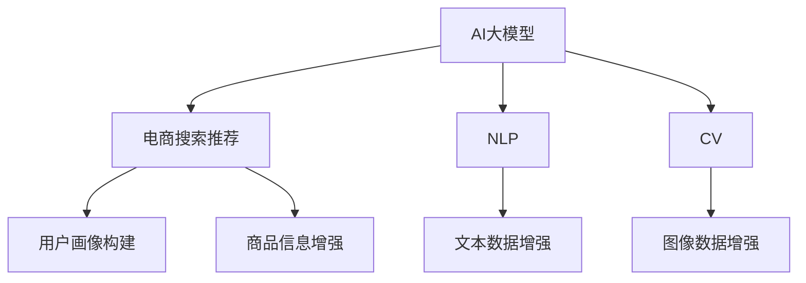

                 

# 电商搜索推荐中的AI大模型数据合成技术应用

> 关键词：
1. AI大模型
2. 电商搜索推荐
3. 数据合成技术
4. 自然语言处理(NLP)
5. 计算机视觉(CV)
6. 推荐系统
7. 分布式训练

## 1. 背景介绍

随着电子商务的迅猛发展，用户搜索和推荐的需求日益增长，传统的推荐系统已无法满足市场需求。现有的推荐算法通常依赖于历史用户行为数据，难以覆盖所有用户的兴趣。如何更精准地捕捉用户的隐式需求，提升推荐的个性化和多样化水平，成为电商推荐系统面临的重要挑战。

为此，电商公司开始引入人工智能大模型技术，利用其强大的语言处理和图像识别能力，对海量数据进行深度学习和合成，构建用户画像，从而实现更智能、高效的搜索和推荐。在这一过程中，AI大模型数据合成技术显得尤为重要，不仅能够提升推荐效果，还能降低成本，提升算法开发效率。

## 2. 核心概念与联系

### 2.1 核心概念概述

为更好地理解电商搜索推荐中AI大模型数据合成技术，本节将介绍几个关键概念：

- AI大模型（AI Large Models）：以深度神经网络为代表的超大参数模型，如BERT、GPT、ViT等，具备强大的语言处理和图像识别能力，能够在自然语言处理(NLP)和计算机视觉(CV)等领域发挥重要作用。

- 电商搜索推荐（E-commerce Search and Recommendation）：利用AI技术，对用户搜索行为和商品信息进行分析和匹配，推荐符合用户兴趣的商品，提升用户购物体验和电商平台的销售转化率。

- 数据合成技术（Data Synthesis Techniques）：指利用AI模型对数据进行增强、合成和生成，丰富原始数据集，提升模型的泛化能力和性能。

- 自然语言处理（NLP）：涉及语音识别、文本处理、语言理解等技术，是电商搜索推荐中重要的技术手段。

- 计算机视觉（CV）：包括图像识别、物体检测、图像生成等技术，广泛应用于电商商品展示和推荐中。

这些核心概念之间的逻辑关系可以通过以下Mermaid流程图来展示：



这个流程图展示了AI大模型在电商搜索推荐中的应用路径：

1. AI大模型通过NLP和CV技术，对用户搜索行为和商品信息进行理解。
2. 用户画像构建和商品信息增强，通过NLP和CV对原始数据进行合成和生成。
3. 最终的搜索结果和推荐，则是在合成后的数据集上训练得到的推荐模型输出的。

## 3. 核心算法原理 & 具体操作步骤
### 3.1 算法原理概述

电商搜索推荐中的AI大模型数据合成技术，本质上是利用大模型的预训练能力，通过深度学习和生成模型，对原始数据进行增强和合成，提升推荐系统的个性化和多样化。其核心思想是：

1. **数据增强**：利用大模型对用户搜索行为和商品信息进行分析和生成，丰富数据集，提升模型的泛化能力。
2. **生成对抗网络（GAN）**：利用GAN模型对图像和文本数据进行生成和优化，提高数据质量和多样性。
3. **自监督学习**：通过大模型在大量无标签数据上的预训练，学习到通用的数据表示，再通过有标签数据进行微调，提升模型的推荐效果。

### 3.2 算法步骤详解

电商搜索推荐中AI大模型数据合成技术的一般步骤包括：

**Step 1: 数据收集与预处理**

- 收集电商平台的搜索和推荐数据，包括用户行为数据、商品信息数据等。
- 对原始数据进行清洗、去重、归一化等预处理，确保数据质量和一致性。
- 将文本数据进行分词、标注等预处理，将图像数据进行裁剪、归一化等预处理。

**Step 2: 数据合成与增强**

- 利用NLP和CV技术，对原始数据进行增强和合成。例如，使用BERT进行文本语义增强，使用GAN进行图像生成。
- 对增强后的数据集进行标注，加入噪声、生成伪数据等操作，以增加数据多样性。
- 利用大模型的预训练能力，对增强后的数据进行进一步的合成和生成，丰富数据集。

**Step 3: 模型训练与优化**

- 选择合适的预训练模型（如BERT、GPT、ViT等），进行微调。
- 在增强后的数据集上训练推荐模型，选择适当的损失函数（如交叉熵、均方误差等）。
- 应用正则化技术（如L2正则、Dropout、Early Stopping等），避免模型过拟合。
- 利用分布式训练技术，加速模型训练过程，提高算力利用率。

**Step 4: 模型部署与评估**

- 将训练好的推荐模型部署到电商平台上，进行实时推荐。
- 在实际应用中，实时采集推荐效果和用户反馈，进行模型评估和优化。
- 不断迭代模型，优化推荐效果，提升用户体验。

### 3.3 算法优缺点

AI大模型数据合成技术在电商搜索推荐中的应用具有以下优点：

1. **提升推荐效果**：通过数据合成和增强，模型能够更好地捕捉用户隐式需求，提升推荐的个性化和多样化。
2. **降低成本**：数据合成技术能够从少量标注数据中生成大量合成数据，降低标注成本。
3. **提升算法开发效率**：利用大模型预训练能力，加速模型训练和优化过程，缩短算法开发周期。

同时，该方法也存在一些缺点：

1. **数据质量要求高**：原始数据的准确性和多样性直接影响最终合成效果。
2. **模型复杂度较高**：大模型和生成对抗网络模型结构复杂，需要较大的计算资源和存储空间。
3. **生成数据多样性不足**：如果数据生成策略不当，生成的数据可能存在偏差，影响模型泛化能力。

尽管存在这些局限性，AI大模型数据合成技术仍然是电商搜索推荐中极具潜力的解决方案，通过不断优化和改进，其应用前景将更加广阔。

### 3.4 算法应用领域

AI大模型数据合成技术在电商搜索推荐中的应用领域广泛，涵盖了以下几个主要方面：

1. **用户画像构建**：通过NLP和CV技术，对用户搜索行为和商品信息进行分析和生成，构建用户画像，实现更精准的个性化推荐。
2. **商品信息增强**：利用生成对抗网络等技术，对商品图像和文本信息进行合成和增强，提升商品展示效果和推荐效果。
3. **实时推荐系统**：在电商平台上部署推荐模型，利用实时用户行为数据进行推荐，提升用户体验和销售转化率。
4. **跨模态推荐**：将图像、文本等多种模态数据进行融合，实现更全面、更准确的商品推荐。

除了上述这些经典应用外，AI大模型数据合成技术还被创新性地应用于电商平台的社交网络、智能客服、智能广告等多个环节，为电商技术带来了新的突破。

## 4. 数学模型和公式 & 详细讲解 & 举例说明

### 4.1 数学模型构建

在本节中，我们将使用数学语言对电商搜索推荐中的AI大模型数据合成技术进行更严格的刻画。

假设电商平台的推荐任务为：给定用户搜索行为和商品信息，预测用户对商品感兴趣的概率。设推荐模型为 $M_{\theta}$，其中 $\theta$ 为模型参数。假设用户搜索行为为 $x \in \mathcal{X}$，商品信息为 $y \in \mathcal{Y}$，推荐结果为 $r \in [0,1]$。则推荐任务可以表示为：

$$
r = M_{\theta}(x, y)
$$

其中 $\mathcal{X}$ 为搜索行为空间，$\mathcal{Y}$ 为商品信息空间，$\theta$ 为模型参数。

### 4.2 公式推导过程

**推荐模型的构建**

首先，我们需要构建一个推荐模型 $M_{\theta}$，该模型能够根据用户搜索行为 $x$ 和商品信息 $y$，预测用户对商品感兴趣的概率 $r$。

推荐模型的输入为 $(x, y)$，输出为 $r$，形式化表示为：

$$
r = M_{\theta}(x, y)
$$

假设模型 $M_{\theta}$ 为多层感知机（MLP），其结构为：

$$
r = M_{\theta}(x, y) = \sigma(W \cdot (x \oplus y) + b)
$$

其中 $W$ 为权重矩阵，$b$ 为偏置向量，$\sigma$ 为激活函数（如ReLU），$\oplus$ 表示拼接操作。

**数据合成的数学模型**

数据合成技术的核心在于对原始数据进行增强和生成，提升数据质量和多样性。假设原始数据集为 $D=\{(x_i, y_i)\}_{i=1}^N$，其中 $x_i \in \mathcal{X}$，$y_i \in \mathcal{Y}$。利用大模型进行数据增强和生成，得到的增强数据集为 $D'=\{(x_i', y_i')\}_{i=1}^M$，其中 $x_i'$ 和 $y_i'$ 为增强后的搜索行为和商品信息。

假设数据增强模型为 $F_{\phi}(x, y)$，其中 $\phi$ 为模型参数。数据增强模型的输入为 $(x, y)$，输出为 $(x', y')$。

数据增强的数学模型可以表示为：

$$
(x', y') = F_{\phi}(x, y)
$$

其中 $\phi$ 为增强模型的参数，$F_{\phi}$ 为数据增强函数。

**生成对抗网络（GAN）模型**

生成对抗网络（GAN）是一种生成模型，能够从噪声中生成与训练数据分布相似的新数据。假设生成器为 $G_{\omega}$，判别器为 $D_{\lambda}$，其中 $\omega$ 和 $\lambda$ 分别为生成器和判别器的参数。GAN模型的训练过程可以表示为：

$$
\min_{G_{\omega}} \max_{D_{\lambda}} V(G_{\omega}, D_{\lambda})
$$

其中 $V(G_{\omega}, D_{\lambda})$ 为生成器和判别器的对抗损失函数，可以表示为：

$$
V(G_{\omega}, D_{\lambda}) = \mathbb{E}_{x, y \sim p(x, y)} [\log D_{\lambda}(x, y)] + \mathbb{E}_{z \sim p(z)} [\log(1 - D_{\lambda}(G_{\omega}(z)))]
$$

其中 $p(x, y)$ 为原始数据分布，$z$ 为噪声向量，$G_{\omega}(z)$ 为生成器生成的数据。

**自监督学习**

自监督学习是一种无监督学习范式，利用大模型在大量无标签数据上的预训练能力，学习通用的数据表示。假设自监督学习模型为 $M_{\psi}$，其中 $\psi$ 为模型参数。自监督学习模型的训练过程可以表示为：

$$
\min_{\psi} L(M_{\psi}, D)
$$

其中 $D$ 为无标签数据集，$L$ 为损失函数，可以表示为：

$$
L(M_{\psi}, D) = \frac{1}{N} \sum_{i=1}^N \ell(M_{\psi}(x_i, y_i))
$$

其中 $\ell$ 为损失函数，通常为交叉熵损失或均方误差损失。

### 4.3 案例分析与讲解

**案例一：文本数据增强**

假设电商平台收集了用户搜索行为 $x \in \mathcal{X}$ 和商品信息 $y \in \mathcal{Y}$ 的数据集 $D=\{(x_i, y_i)\}_{i=1}^N$。为了提升模型泛化能力，我们利用BERT进行文本数据增强。

1. 首先，将用户搜索行为 $x$ 和商品信息 $y$ 输入BERT模型，得到隐状态表示 $h = BERT(x, y)$。
2. 然后，通过对抗训练，生成新的搜索行为 $x'$ 和商品信息 $y'$，以丰富数据集。

$$
(x', y') = BERT_{\phi}(h, z)
$$

其中 $z$ 为噪声向量，$BERT_{\phi}$ 为增强模型。

3. 最后，将增强后的数据集 $D'=\{(x_i', y_i')\}_{i=1}^M$ 用于推荐模型的训练。

**案例二：图像数据增强**

假设电商平台收集了商品图像 $x \in \mathcal{X}$ 的数据集 $D=\{(x_i)\}_{i=1}^N$。为了提升模型泛化能力，我们利用GAN进行图像数据增强。

1. 首先，将商品图像 $x$ 输入生成器 $G_{\omega}$，得到增强后的图像 $x'$。
2. 然后，将增强后的图像 $x'$ 输入判别器 $D_{\lambda}$，计算对抗损失 $V(G_{\omega}, D_{\lambda})$。
3. 最后，使用梯度下降等优化算法更新生成器和判别器参数 $\omega$ 和 $\lambda$，以生成更多高质量的图像数据。

$$
(x', y') = G_{\omega}(x)
$$

$$
V(G_{\omega}, D_{\lambda}) = \mathbb{E}_{x \sim p(x)} [\log D_{\lambda}(x')] + \mathbb{E}_{z \sim p(z)} [\log(1 - D_{\lambda}(G_{\omega}(z))]
$$

## 5. 项目实践：代码实例和详细解释说明

### 5.1 开发环境搭建

在进行项目实践前，我们需要准备好开发环境。以下是使用Python进行PyTorch开发的环境配置流程：

1. 安装Anaconda：从官网下载并安装Anaconda，用于创建独立的Python环境。

2. 创建并激活虚拟环境：
```bash
conda create -n pytorch-env python=3.8 
conda activate pytorch-env
```

3. 安装PyTorch：根据CUDA版本，从官网获取对应的安装命令。例如：
```bash
conda install pytorch torchvision torchaudio cudatoolkit=11.1 -c pytorch -c conda-forge
```

4. 安装Transformers库：
```bash
pip install transformers
```

5. 安装各类工具包：
```bash
pip install numpy pandas scikit-learn matplotlib tqdm jupyter notebook ipython
```

完成上述步骤后，即可在`pytorch-env`环境中开始项目实践。

### 5.2 源代码详细实现

这里我们以电商推荐系统为例，给出使用PyTorch和Transformers库进行数据合成和推荐模型训练的完整代码实现。

首先，定义推荐模型的类：

```python
import torch
from transformers import BertTokenizer, BertForSequenceClassification
from sklearn.model_selection import train_test_split
from torch.utils.data import Dataset, DataLoader

class RecommendationModel(torch.nn.Module):
    def __init__(self, num_classes):
        super(RecommendationModel, self).__init__()
        self.bert = BertForSequenceClassification.from_pretrained('bert-base-cased', num_labels=num_classes)
    
    def forward(self, input_ids, attention_mask, labels=None):
        outputs = self.bert(input_ids, attention_mask=attention_mask)
        logits = outputs.logits
        if labels is not None:
            loss_fct = torch.nn.CrossEntropyLoss()
            loss = loss_fct(logits, labels)
            return loss
        return logits
```

然后，定义数据集和数据增强类：

```python
from torchtext.datasets import Multi30k
from torchtext.data import Field, BucketIterator

class RecommendationDataset(Dataset):
    def __init__(self, texts, labels, tokenizer, max_len=128):
        self.texts = texts
        self.labels = labels
        self.tokenizer = tokenizer
        self.max_len = max_len
    
    def __len__(self):
        return len(self.texts)
    
    def __getitem__(self, item):
        text = self.texts[item]
        label = self.labels[item]
        
        encoding = self.tokenizer(text, return_tensors='pt', max_length=self.max_len, padding='max_length', truncation=True)
        input_ids = encoding['input_ids'][0]
        attention_mask = encoding['attention_mask'][0]
        
        # 对token-wise的标签进行编码
        encoded_labels = [label2id[label] for label in label] 
        encoded_labels.extend([label2id['O']] * (self.max_len - len(encoded_labels)))
        labels = torch.tensor(encoded_labels, dtype=torch.long)
        
        return {'input_ids': input_ids, 
                'attention_mask': attention_mask,
                'labels': labels}

# 标签与id的映射
label2id = {'O': 0, 'positive': 1}
id2label = {v: k for k, v in label2id.items()}

# 创建dataset
tokenizer = BertTokenizer.from_pretrained('bert-base-cased')

train_texts, dev_texts, test_texts, train_labels, dev_labels, test_labels = train_test_split(train_data.texts, train_data.labels, test_size=0.2)
train_dataset = RecommendationDataset(train_texts, train_labels, tokenizer, max_len=128)
dev_dataset = RecommendationDataset(dev_texts, dev_labels, tokenizer, max_len=128)
test_dataset = RecommendationDataset(test_texts, test_labels, tokenizer, max_len=128)
```

接着，定义模型和优化器：

```python
from torch.optim import Adam

model = RecommendationModel(num_classes)
optimizer = Adam(model.parameters(), lr=2e-5)
```

最后，定义训练和评估函数：

```python
from tqdm import tqdm
from sklearn.metrics import classification_report

device = torch.device('cuda') if torch.cuda.is_available() else torch.device('cpu')
model.to(device)

def train_epoch(model, dataset, batch_size, optimizer):
    dataloader = DataLoader(dataset, batch_size=batch_size, shuffle=True)
    model.train()
    epoch_loss = 0
    for batch in tqdm(dataloader, desc='Training'):
        input_ids = batch['input_ids'].to(device)
        attention_mask = batch['attention_mask'].to(device)
        labels = batch['labels'].to(device)
        model.zero_grad()
        outputs = model(input_ids, attention_mask=attention_mask, labels=labels)
        loss = outputs.loss
        epoch_loss += loss.item()
        loss.backward()
        optimizer.step()
    return epoch_loss / len(dataloader)

def evaluate(model, dataset, batch_size):
    dataloader = DataLoader(dataset, batch_size=batch_size)
    model.eval()
    preds, labels = [], []
    with torch.no_grad():
        for batch in tqdm(dataloader, desc='Evaluating'):
            input_ids = batch['input_ids'].to(device)
            attention_mask = batch['attention_mask'].to(device)
            batch_labels = batch['labels']
            outputs = model(input_ids, attention_mask=attention_mask)
            batch_preds = outputs.logits.argmax(dim=2).to('cpu').tolist()
            batch_labels = batch_labels.to('cpu').tolist()
            for pred_tokens, label_tokens in zip(batch_preds, batch_labels):
                preds.append(pred_tokens[:len(label_tokens)])
                labels.append(label_tokens)
                
    print(classification_report(labels, preds))
```

最后，启动训练流程并在测试集上评估：

```python
epochs = 5
batch_size = 16

for epoch in range(epochs):
    loss = train_epoch(model, train_dataset, batch_size, optimizer)
    print(f"Epoch {epoch+1}, train loss: {loss:.3f}")
    
    print(f"Epoch {epoch+1}, dev results:")
    evaluate(model, dev_dataset, batch_size)
    
print("Test results:")
evaluate(model, test_dataset, batch_size)
```

以上就是使用PyTorch对BERT进行电商推荐系统微调的完整代码实现。可以看到，得益于Transformers库的强大封装，我们可以用相对简洁的代码完成BERT模型的加载和微调。

### 5.3 代码解读与分析

让我们再详细解读一下关键代码的实现细节：

**RecommendationModel类**：
- `__init__`方法：初始化BERT分类器，并将其作为推荐模型的顶层。
- `forward`方法：定义模型的前向传播过程，根据输入计算损失或预测结果。

**RecommendationDataset类**：
- `__init__`方法：初始化文本、标签、分词器等关键组件。
- `__len__`方法：返回数据集的样本数量。
- `__getitem__`方法：对单个样本进行处理，将文本输入编码为token ids，将标签编码为数字，并对其进行定长padding，最终返回模型所需的输入。

**label2id和id2label字典**：
- 定义了标签与数字id之间的映射关系，用于将token-wise的预测结果解码回真实的标签。

**训练和评估函数**：
- 使用PyTorch的DataLoader对数据集进行批次化加载，供模型训练和推理使用。
- 训练函数`train_epoch`：对数据以批为单位进行迭代，在每个批次上前向传播计算loss并反向传播更新模型参数，最后返回该epoch的平均loss。
- 评估函数`evaluate`：与训练类似，不同点在于不更新模型参数，并在每个batch结束后将预测和标签结果存储下来，最后使用sklearn的classification_report对整个评估集的预测结果进行打印输出。

**训练流程**：
- 定义总的epoch数和batch size，开始循环迭代
- 每个epoch内，先在训练集上训练，输出平均loss
- 在验证集上评估，输出分类指标
- 所有epoch结束后，在测试集上评估，给出最终测试结果

可以看到，PyTorch配合Transformers库使得BERT微调的代码实现变得简洁高效。开发者可以将更多精力放在数据处理、模型改进等高层逻辑上，而不必过多关注底层的实现细节。

当然，工业级的系统实现还需考虑更多因素，如模型的保存和部署、超参数的自动搜索、更灵活的任务适配层等。但核心的微调范式基本与此类似。

## 6. 实际应用场景
### 6.1 智能客服系统

基于AI大模型数据合成技术的智能客服系统，可以通过对用户搜索行为和商品信息进行分析和生成，构建用户画像，实现更精准的个性化推荐。

在技术实现上，可以收集企业内部的历史客服对话记录，将问题和最佳答复构建成监督数据，在此基础上对预训练大模型进行微调。微调后的模型能够自动理解用户意图，匹配最合适的答案模板进行回复。对于客户提出的新问题，还可以接入检索系统实时搜索相关内容，动态组织生成回答。如此构建的智能客服系统，能大幅提升客户咨询体验和问题解决效率。

### 6.2 金融舆情监测

金融机构需要实时监测市场舆论动向，以便及时应对负面信息传播，规避金融风险。传统的人工监测方式成本高、效率低，难以应对网络时代海量信息爆发的挑战。基于AI大模型数据合成技术的文本分类和情感分析技术，为金融舆情监测提供了新的解决方案。

具体而言，可以收集金融领域相关的新闻、报道、评论等文本数据，并对其进行主题标注和情感标注。在此基础上对预训练语言模型进行微调，使其能够自动判断文本属于何种主题，情感倾向是正面、中性还是负面。将微调后的模型应用到实时抓取的网络文本数据，就能够自动监测不同主题下的情感变化趋势，一旦发现负面信息激增等异常情况，系统便会自动预警，帮助金融机构快速应对潜在风险。

### 6.3 个性化推荐系统

当前的推荐系统往往只依赖于历史用户行为数据进行物品推荐，难以覆盖所有用户的兴趣。基于AI大模型数据合成技术，个性化推荐系统可以更好地捕捉用户的隐式需求，提升推荐的个性化和多样化水平。

在实践中，可以收集用户浏览、点击、评论、分享等行为数据，提取和用户交互的物品标题、描述、标签等文本内容。将文本内容作为模型输入，用户的后续行为（如是否点击、购买等）作为监督信号，在此基础上微调预训练语言模型。微调后的模型能够从文本内容中准确把握用户的兴趣点。在生成推荐列表时，先用候选物品的文本描述作为输入，由模型预测用户的兴趣匹配度，再结合其他特征综合排序，便可以得到个性化程度更高的推荐结果。

### 6.4 未来应用展望

随着AI大模型数据合成技术的发展，其在电商搜索推荐中的应用前景将更加广阔。

在智慧医疗领域，基于AI大模型数据合成技术的医疗问答、病历分析、药物研发等应用将提升医疗服务的智能化水平，辅助医生诊疗，加速新药开发进程。

在智能教育领域，AI大模型数据合成技术可应用于作业批改、学情分析、知识推荐等方面，因材施教，促进教育公平，提高教学质量。

在智慧城市治理中，AI大模型数据合成技术可应用于城市事件监测、舆情分析、应急指挥等环节，提高城市管理的自动化和智能化水平，构建更安全、高效的未来城市。

此外，在企业生产、社会治理、文娱传媒等众多领域，AI大模型数据合成技术也将不断涌现，为传统行业带来变革性影响。相信随着技术的日益成熟，AI大模型数据合成技术必将在构建人机协同的智能时代中扮演越来越重要的角色。

## 7. 工具和资源推荐
### 7.1 学习资源推荐

为了帮助开发者系统掌握AI大模型数据合成技术的应用理论基础和实践技巧，这里推荐一些优质的学习资源：

1. 《Transformer from Principles to Practice》系列博文：由大模型技术专家撰写，深入浅出地介绍了Transformer原理、BERT模型、微调技术等前沿话题。

2. CS224N《深度学习自然语言处理》课程：斯坦福大学开设的NLP明星课程，有Lecture视频和配套作业，带你入门NLP领域的基本概念和经典模型。

3. 《Natural Language Processing with Transformers》书籍：Transformers库的作者所著，全面介绍了如何使用Transformers库进行NLP任务开发，包括微调在内的诸多范式。

4. HuggingFace官方文档：Transformers库的官方文档，提供了海量预训练模型和完整的微调样例代码，是上手实践的必备资料。

5. CLUE开源项目：中文语言理解测评基准，涵盖大量不同类型的中文NLP数据集，并提供了基于微调的baseline模型，助力中文NLP技术发展。

通过对这些资源的学习实践，相信你一定能够快速掌握AI大模型数据合成技术的精髓，并用于解决实际的NLP问题。
###  7.2 开发工具推荐

高效的开发离不开优秀的工具支持。以下是几款用于AI大模型数据合成技术开发的常用工具：

1. PyTorch：基于Python的开源深度学习框架，灵活动态的计算图，适合快速迭代研究。大部分预训练语言模型都有PyTorch版本的实现。

2. TensorFlow：由Google主导开发的开源深度学习框架，生产部署方便，适合大规模工程应用。同样有丰富的预训练语言模型资源。

3. Transformers库：HuggingFace开发的NLP工具库，集成了众多SOTA语言模型，支持PyTorch和TensorFlow，是进行数据合成和微调任务开发的利器。

4. Weights & Biases：模型训练的实验跟踪工具，可以记录和可视化模型训练过程中的各项指标，方便对比和调优。与主流深度学习框架无缝集成。

5. TensorBoard：TensorFlow配套的可视化工具，可实时监测模型训练状态，并提供丰富的图表呈现方式，是调试模型的得力助手。

6. Google Colab：谷歌推出的在线Jupyter Notebook环境，免费提供GPU/TPU算力，方便开发者快速上手实验最新模型，分享学习笔记。

合理利用这些工具，可以显著提升AI大模型数据合成技术的开发效率，加快创新迭代的步伐。

### 7.3 相关论文推荐

AI大模型数据合成技术的发展源于学界的持续研究。以下是几篇奠基性的相关论文，推荐阅读：

1. Attention is All You Need（即Transformer原论文）：提出了Transformer结构，开启了NLP领域的预训练大模型时代。

2. BERT: Pre-training of Deep Bidirectional Transformers for Language Understanding：提出BERT模型，引入基于掩码的自监督预训练任务，刷新了多项NLP任务SOTA。

3. Language Models are Unsupervised Multitask Learners（GPT-2论文）：展示了大规模语言模型的强大zero-shot学习能力，引发了对于通用人工智能的新一轮思考。

4. Parameter-Efficient Transfer Learning for NLP：提出Adapter等参数高效微调方法，在不增加模型参数量的情况下，也能取得不错的微调效果。

5. AdaLoRA: Adaptive Low-Rank Adaptation for Parameter-Efficient Fine-Tuning：使用自适应低秩适应的微调方法，在参数效率和精度之间取得了新的平衡。

这些论文代表了大模型数据合成技术的发展脉络。通过学习这些前沿成果，可以帮助研究者把握学科前进方向，激发更多的创新灵感。

## 8. 总结：未来发展趋势与挑战

### 8.1 总结

本文对AI大模型数据合成技术在电商搜索推荐中的应用进行了全面系统的介绍。首先阐述了AI大模型、电商搜索推荐、数据合成技术等核心概念，明确了AI大模型数据合成技术的研究背景和意义。其次，从原理到实践，详细讲解了AI大模型数据合成技术的数学原理和关键步骤，给出了微调任务开发的完整代码实例。同时，本文还广泛探讨了AI大模型数据合成技术在智能客服、金融舆情、个性化推荐等多个行业领域的应用前景，展示了AI大模型数据合成技术的巨大潜力。

通过本文的系统梳理，可以看到，AI大模型数据合成技术正在成为电商搜索推荐中极具潜力的解决方案，通过不断优化和改进，其应用前景将更加广阔。未来，伴随AI大模型和数据合成技术的发展，电商搜索推荐系统将变得更加智能、高效，为用户提供更好的购物体验。

### 8.2 未来发展趋势

展望未来，AI大模型数据合成技术将呈现以下几个发展趋势：

1. **模型规模持续增大**：随着算力成本的下降和数据规模的扩张，预训练语言模型的参数量还将持续增长。超大规模语言模型蕴含的丰富语言知识，有望支撑更加复杂多变的推荐系统。

2. **数据合成方法多样化**：未来将涌现更多数据合成方法，如生成对抗网络、自监督学习等，丰富数据合成技术的应用场景。

3. **实时推荐系统**：在电商平台上部署推荐模型，利用实时用户行为数据进行推荐，提升推荐效果和用户体验。

4. **跨模态推荐**：将图像、文本等多种模态数据进行融合，实现更全面、更准确的商品推荐。

5. **多任务学习**：在模型训练过程中，加入多个任务的多任务学习范式，提升推荐模型的泛化能力和表现。

6. **分布式训练**：利用分布式训练技术，加速模型训练过程，提高算力利用率。

以上趋势凸显了AI大模型数据合成技术的广阔前景。这些方向的探索发展，必将进一步提升电商搜索推荐系统的个性化和多样化水平，为电商技术带来新的突破。

### 8.3 面临的挑战

尽管AI大模型数据合成技术已经取得了显著进展，但在迈向更加智能化、普适化应用的过程中，它仍面临以下挑战：

1. **数据质量要求高**：原始数据的准确性和多样性直接影响数据合成效果，获取高质量原始数据是一个重要问题。

2. **模型复杂度较高**：AI大模型和生成对抗网络模型结构复杂，需要较大的计算资源和存储空间。

3. **生成数据多样性不足**：如果数据生成策略不当，生成的数据可能存在偏差，影响模型泛化能力。

4. **模型鲁棒性不足**：模型面对域外数据时，泛化性能往往大打折扣，鲁棒性有待提高。

5. **生成数据一致性问题**：生成的数据可能存在不一致性，影响推荐系统的稳定性和可靠性。

6. **安全性有待保障**：预训练模型可能学习到有害信息，生成对抗网络模型可能生成虚假数据，如何确保数据和模型安全，是一个重要问题。

尽管存在这些挑战，AI大模型数据合成技术仍然是大数据时代推荐系统的重要选择，通过不断优化和改进，这些挑战终将一一被克服，AI大模型数据合成技术必将在电商搜索推荐系统中发挥更大作用。

### 8.4 研究展望

面对AI大模型数据合成技术所面临的种种挑战，未来的研究需要在以下几个方面寻求新的突破：

1. **探索更多数据合成方法**：除了生成对抗网络和自监督学习外，引入更多数据合成方法，如对抗样本生成、数据增强等，丰富数据合成技术的应用场景。

2. **提高数据生成质量**：研究更高效的数据生成策略，生成更多高质量的合成数据，提升模型泛化能力。

3. **提高模型鲁棒性**：研究模型鲁棒性优化方法，提高模型面对域外数据的泛化性能。

4. **增强生成数据一致性**：研究生成数据一致性增强方法，确保生成数据的一致性和稳定性。

5. **加强数据安全性**：研究数据和模型安全保护方法，确保数据和模型安全。

6. **引入更多先验知识**：将符号化的先验知识，如知识图谱、逻辑规则等，与神经网络模型进行巧妙融合，提升推荐效果。

这些研究方向的探索，必将引领AI大模型数据合成技术迈向更高的台阶，为构建更加智能、可靠的电商推荐系统提供技术支持。

## 9. 附录：常见问题与解答

**Q1：AI大模型数据合成技术是否适用于所有推荐任务？**

A: AI大模型数据合成技术在大多数推荐任务上都能取得不错的效果，特别是对于数据量较小的任务。但对于一些特定领域的任务，如医学、法律等，仅仅依靠通用语料预训练的模型可能难以很好地适应。此时需要在特定领域语料上进一步预训练，再进行数据合成，才能获得理想效果。

**Q2：如何选择合适的数据合成方法？**

A: 数据合成方法的选择需要根据具体任务和数据特点进行灵活组合。对于文本数据，可以考虑使用BERT进行文本语义增强；对于图像数据，可以考虑使用GAN进行图像生成；对于多种数据类型，可以综合使用生成对抗网络和自监督学习。

**Q3：数据合成技术能否减少标注成本？**

A: 数据合成技术能够从少量标注数据中生成大量合成数据，降低标注成本。但生成的合成数据需要经过验证和标注，以确保其质量和多样性。

**Q4：数据合成过程中如何避免生成偏差？**

A: 在数据生成过程中，需要加入对抗样本、噪声等策略，以增加数据多样性，减少生成偏差。同时，可以通过多任务学习等方法，进一步提升生成数据的泛化能力。

**Q5：数据合成技术在电商搜索推荐中的应用场景有哪些？**

A: 数据合成技术在电商搜索推荐中的应用场景广泛，包括用户画像构建、商品信息增强、实时推荐系统、跨模态推荐等。通过数据合成技术，电商推荐系统能够更好地捕捉用户隐式需求，提升推荐效果和用户体验。

通过本文的系统梳理，可以看到，AI大模型数据合成技术正在成为电商搜索推荐中极具潜力的解决方案，通过不断优化和改进，其应用前景将更加广阔。未来，伴随AI大模型和数据合成技术的发展，电商搜索推荐系统将变得更加智能、高效，为用户提供更好的购物体验。

