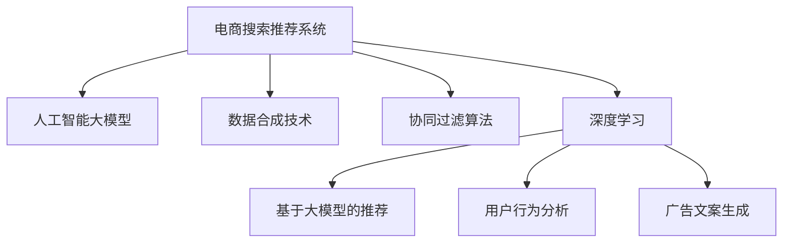

                 

# 电商搜索推荐中的AI大模型数据合成技术应用项目可行性分析与实践指南

> 关键词：
- 电商搜索推荐系统
- 人工智能大模型
- 数据合成技术
- 推荐系统优化
- 自然语言处理(NLP)
- 推荐系统中的语义分析
- 协同过滤算法
- 深度学习
- 用户行为分析

## 1. 背景介绍

### 1.1 问题由来
随着电子商务的迅猛发展，电商搜索推荐系统在提升用户体验、增加销售转化等方面发挥了至关重要的作用。然而，传统的推荐系统主要依赖于用户历史行为数据进行协同过滤和基于内容的推荐，存在数据稀疏性、多样性不足等问题，难以满足用户个性化和多样化需求。为了克服这些挑战，人工智能大模型成为了电商搜索推荐系统的新引擎。

大模型通过对大规模无标签文本数据进行预训练，获取了丰富的语言表示和知识，具备强大的语义理解能力和迁移学习能力。结合电商领域特定的用户行为数据和商品信息，大模型可以进行更加精准、智能化的推荐。同时，大模型还可以自动生成高质量的商品描述和广告文案，提升电商搜索推荐系统的表现。

### 1.2 问题核心关键点
- **数据质量和数量**：高质量、大规模的数据是大模型训练和微调的前提，也是推荐系统准确性的基础。
- **模型架构和参数**：选择合适的模型架构和合理的参数设置，是确保大模型在推荐系统中的表现优化的关键。
- **算法优化与调优**：通过优化算法、调整超参数等手段，提高大模型在推荐系统中的效率和效果。
- **系统架构与部署**：合理设计系统架构，实现高性能的模型部署和推理，是电商搜索推荐系统成功的保障。
- **用户体验与转化率**：最终目标是通过推荐系统提升用户体验和销售转化率，确保商业价值的实现。

### 1.3 问题研究意义
研究电商搜索推荐系统中的AI大模型数据合成技术，具有重要意义：

- **提升推荐精度**：通过融合大模型和电商领域特定的用户行为数据，可以显著提升推荐系统的个性化和准确性，满足不同用户的多样化需求。
- **增强系统鲁棒性**：大模型具备泛化能力强、对异常数据鲁棒性高等优点，可以稳定应对电商领域复杂多变的环境。
- **优化用户体验**：大模型能够自动生成高质量的商品描述和广告文案，提升电商搜索推荐系统的人机交互体验。
- **驱动电商创新**：结合大模型技术，电商企业可以创新应用场景，开发更多基于AI的电商服务。
- **优化资源利用**：大模型可以共享通用的语言表示和知识，减少模型重复开发和资源浪费。

## 2. 核心概念与联系

### 2.1 核心概念概述

为更好地理解电商搜索推荐系统中的AI大模型数据合成技术，本节将介绍几个密切相关的核心概念：

- **电商搜索推荐系统**：通过收集用户历史行为数据和商品信息，利用推荐算法为每个用户推荐可能感兴趣的商品，提升用户体验和销售转化。
- **人工智能大模型**：如BERT、GPT、T5等，通过大规模无标签文本数据预训练，获取丰富的语言知识和表示能力，具备强大的语义理解和生成能力。
- **数据合成技术**：通过生成对抗网络(GAN)、预训练语言模型等技术，合成高质量、多样化的电商数据，用于提升模型的训练效果。
- **协同过滤算法**：利用用户行为数据计算用户之间相似度，基于相似度推荐商品，适用于电商搜索推荐系统中的个性化推荐。
- **深度学习**：利用神经网络模型进行推荐系统优化，包括使用大模型进行推荐、用户行为分析、广告文案生成等。

这些核心概念之间的逻辑关系可以通过以下Mermaid流程图来展示：



这个流程图展示了电商搜索推荐系统中的核心组件及其相互关系：

1. 电商搜索推荐系统：接收用户查询，调用推荐算法推荐商品，优化用户体验和转化率。
2. 人工智能大模型：提供高质量的语言表示和知识，辅助推荐系统进行用户行为分析、广告文案生成等。
3. 数据合成技术：通过生成高质量的电商数据，丰富推荐系统的训练样本，提升模型的表现。
4. 协同过滤算法：利用用户行为数据计算用户相似度，进行个性化推荐。
5. 深度学习：利用神经网络模型优化推荐算法，提升推荐系统的效果。

这些概念共同构成了电商搜索推荐系统的技术和方法框架，使其能够高效地处理大规模用户数据，提升推荐系统的个性化和准确性。

## 3. 核心算法原理 & 具体操作步骤
### 3.1 算法原理概述

电商搜索推荐系统中的AI大模型数据合成技术，本质上是一个基于深度学习的推荐优化过程。其核心思想是：利用人工智能大模型对电商领域的高质量数据进行预训练和微调，融合大模型的语言知识和电商领域特有的用户行为数据，生成更精准、个性化的推荐结果。

形式化地，假设电商平台已收集到用户历史行为数据 $D_{user}$ 和商品信息 $D_{item}$，结合自然语言处理(NLP)技术，构建文本-商品关联矩阵 $R$。设预训练语言模型为 $M_{\theta}$，其中 $\theta$ 为预训练得到的模型参数。微调的目标是找到新的模型参数 $\hat{\theta}$，使得：

$$
\hat{\theta}=\mathop{\arg\min}_{\theta} \mathcal{L}(M_{\theta},D_{user},D_{item})
$$

其中 $\mathcal{L}$ 为针对电商推荐任务的损失函数，用于衡量推荐模型预测输出与真实用户行为之间的差异。常见的损失函数包括交叉熵损失、均方误差损失等。

通过梯度下降等优化算法，微调过程不断更新模型参数 $\theta$，最小化损失函数 $\mathcal{L}$，使得模型输出逼近真实用户行为。由于 $\theta$ 已经通过预训练获得了较好的初始化，因此即便在电商领域小规模数据集上进行微调，也能较快收敛到理想的模型参数 $\hat{\theta}$。

### 3.2 算法步骤详解

电商搜索推荐系统中的AI大模型数据合成技术一般包括以下几个关键步骤：

**Step 1: 数据预处理与标注**

- 收集电商领域的高质量用户行为数据，包括用户搜索记录、购买历史、评分等。
- 对商品信息进行标注，包括商品名称、描述、类别等，并将其转换为自然语言文本。
- 将用户行为数据和商品信息进行关联，构建文本-商品关联矩阵 $R$。

**Step 2: 数据合成与增强**

- 利用生成对抗网络(GAN)、预训练语言模型等技术，生成高质量、多样化的电商数据，增加训练样本多样性。
- 对合成数据进行增强，如回译、文本生成等，提高模型对异常数据的鲁棒性。

**Step 3: 模型训练与微调**

- 选择合适的预训练语言模型 $M_{\theta}$ 作为初始化参数，如BERT、GPT等。
- 设计合适的输出层和损失函数，如交叉熵损失、均方误差损失等。
- 设置微调超参数，包括学习率、批大小、迭代轮数等。
- 使用AdamW等优化算法，结合正则化技术如L2正则、Dropout等，更新模型参数。
- 周期性在验证集上评估模型性能，根据性能指标决定是否触发Early Stopping。

**Step 4: 模型评估与部署**

- 在测试集上评估微调后模型 $M_{\hat{\theta}}$ 的性能，对比微调前后的推荐精度提升。
- 使用微调后的模型对新商品进行推荐，集成到实际的应用系统中。
- 持续收集新的用户行为数据，定期重新微调模型，以适应数据分布的变化。

以上是电商搜索推荐系统中AI大模型数据合成技术的典型流程。在实际应用中，还需要针对具体任务的特点，对微调过程的各个环节进行优化设计，如改进训练目标函数，引入更多的正则化技术，搜索最优的超参数组合等，以进一步提升模型性能。

### 3.3 算法优缺点

基于深度学习的AI大模型数据合成技术具有以下优点：

- **推荐精度提升**：通过融合大模型和电商领域特有的用户行为数据，显著提升推荐系统的个性化和准确性，满足不同用户的多样化需求。
- **鲁棒性增强**：大模型具备泛化能力强、对异常数据鲁棒性高等优点，可以稳定应对电商领域复杂多变的环境。
- **灵活性高**：利用生成对抗网络、预训练语言模型等技术，可以灵活生成高质量、多样化的电商数据，提升推荐系统的训练效果。
- **效率高**：大模型可以通过迁移学习的方式进行快速微调，减少从头训练所需的计算和人力成本。

同时，该技术也存在一定的局限性：

- **依赖高质量数据**：高质量、大规模的数据是大模型训练和微调的前提，获取高质量的电商数据成本较高。
- **模型复杂度高**：大模型往往包含亿级参数，对计算资源和存储资源要求较高。
- **易受数据偏差影响**：生成对抗网络等技术可能引入数据偏差，影响推荐模型的公平性和稳定性。
- **可解释性不足**：大模型的决策过程通常缺乏可解释性，难以对其推荐逻辑进行分析和调试。

尽管存在这些局限性，但就目前而言，基于深度学习的AI大模型数据合成技术在电商搜索推荐系统中的应用，仍然具有显著的优势和巨大的潜力。

### 3.4 算法应用领域

基于深度学习的AI大模型数据合成技术在电商搜索推荐系统中的应用广泛，包括但不限于：

- **商品推荐**：利用大模型对用户行为和商品信息进行语义分析，生成个性化推荐列表。
- **广告文案生成**：通过预训练语言模型生成高质量的商品描述和广告文案，提升用户体验和转化率。
- **用户画像生成**：利用大模型对用户历史行为数据进行语义分析和特征提取，生成详细的用户画像。
- **行为预测**：基于大模型对用户行为进行预测，优化电商平台的库存管理和促销策略。
- **情感分析**：利用大模型对用户评论进行情感分析，及时调整产品和服务质量。

这些应用领域展示了AI大模型数据合成技术在电商搜索推荐系统中的广泛适用性和强大能力。随着深度学习技术的发展，预计未来将有更多创新应用不断涌现。

## 4. 数学模型和公式 & 详细讲解 & 举例说明

### 4.1 数学模型构建

本节将使用数学语言对电商搜索推荐系统中的AI大模型数据合成技术进行更加严格的刻画。

设电商平台收集到的用户行为数据为 $D_{user}=\{(u_i,r_i)\}_{i=1}^N$，其中 $u_i$ 为第 $i$ 个用户，$r_i$ 为该用户的历史行为，如搜索记录、购买历史等。商品信息为 $D_{item}=\{(v_j,c_j)\}_{j=1}^M$，其中 $v_j$ 为第 $j$ 个商品，$c_j$ 为该商品的属性信息。构建文本-商品关联矩阵 $R$，其中 $R_{i,j}$ 表示商品 $v_j$ 是否出现在用户 $u_i$ 的历史行为中。

定义推荐模型 $M_{\theta}$ 在输入用户行为数据和商品信息上的预测概率 $p_{ij} = M_{\theta}((u_i,v_j))$，表示用户 $u_i$ 对商品 $v_j$ 的推荐概率。预测概率 $p_{ij}$ 越大，推荐该商品的可能性越高。

推荐模型的损失函数 $\mathcal{L}$ 定义为：

$$
\mathcal{L}(\theta) = \frac{1}{N} \sum_{i=1}^N \sum_{j=1}^M \ell(p_{ij},r_{ij})
$$

其中 $\ell$ 为损失函数，常见的损失函数包括交叉熵损失、均方误差损失等。

### 4.2 公式推导过程

以交叉熵损失为例，推导电商搜索推荐系统中的推荐模型损失函数。

假设推荐模型 $M_{\theta}$ 对商品 $v_j$ 是否出现在用户 $u_i$ 的历史行为中的预测概率为 $p_{ij}$，真实标签为 $r_{ij}$（1表示出现，0表示未出现）。则交叉熵损失函数定义为：

$$
\ell(p_{ij},r_{ij}) = -r_{ij} \log p_{ij} - (1-r_{ij}) \log (1-p_{ij})
$$

将其代入推荐模型损失函数，得：

$$
\mathcal{L}(\theta) = -\frac{1}{N} \sum_{i=1}^N \sum_{j=1}^M [r_{ij} \log p_{ij} + (1-r_{ij}) \log (1-p_{ij})]
$$

在得到损失函数的梯度后，即可带入模型参数更新公式，完成模型的迭代优化。重复上述过程直至收敛，最终得到适应电商推荐任务的最优模型参数 $\theta^*$。

### 4.3 案例分析与讲解

假设电商平台希望利用预训练语言模型对用户行为数据进行微调，生成个性化的商品推荐。具体步骤如下：

1. **数据预处理**：收集用户搜索记录 $D_{search}=\{(u_i,s_i)\}_{i=1}^N$，其中 $s_i$ 为第 $i$ 个用户的历史搜索关键词。对每个商品信息 $D_{item}$ 进行标注，构建文本-商品关联矩阵 $R$。

2. **数据合成**：利用生成对抗网络(GAN)生成高质量、多样化的电商数据，如商品描述、广告文案等，增加训练样本多样性。

3. **模型训练**：选择合适的预训练语言模型 $M_{\theta}$ 作为初始化参数，如BERT、GPT等。设计合适的输出层和损失函数，如交叉熵损失、均方误差损失等。设置微调超参数，包括学习率、批大小、迭代轮数等。

4. **模型微调**：使用AdamW等优化算法，结合正则化技术如L2正则、Dropout等，更新模型参数。周期性在验证集上评估模型性能，根据性能指标决定是否触发Early Stopping。

5. **模型评估**：在测试集上评估微调后模型 $M_{\hat{\theta}}$ 的性能，对比微调前后的推荐精度提升。

6. **模型部署**：使用微调后的模型对新商品进行推荐，集成到实际的应用系统中。持续收集新的用户行为数据，定期重新微调模型，以适应数据分布的变化。

通过以上步骤，可以有效地利用大模型对电商数据进行微调，生成高质量、个性化的推荐结果，提升用户体验和销售转化率。

## 5. 项目实践：代码实例和详细解释说明
### 5.1 开发环境搭建

在进行电商搜索推荐系统中的AI大模型数据合成技术开发前，我们需要准备好开发环境。以下是使用Python进行PyTorch开发的环境配置流程：

1. 安装Anaconda：从官网下载并安装Anaconda，用于创建独立的Python环境。

2. 创建并激活虚拟环境：
```bash
conda create -n pytorch-env python=3.8 
conda activate pytorch-env
```

3. 安装PyTorch：根据CUDA版本，从官网获取对应的安装命令。例如：
```bash
conda install pytorch torchvision torchaudio cudatoolkit=11.1 -c pytorch -c conda-forge
```

4. 安装Transformers库：
```bash
pip install transformers
```

5. 安装各类工具包：
```bash
pip install numpy pandas scikit-learn matplotlib tqdm jupyter notebook ipython
```

完成上述步骤后，即可在`pytorch-env`环境中开始项目实践。

### 5.2 源代码详细实现

下面我们以电商商品推荐系统为例，给出使用Transformers库对BERT模型进行微调的PyTorch代码实现。

首先，定义电商商品推荐系统中的数据处理函数：

```python
from transformers import BertTokenizer
from torch.utils.data import Dataset
import torch

class ProductRecommendationDataset(Dataset):
    def __init__(self, user_searches, item_info, tokenizer, max_len=128):
        self.user_searches = user_searches
        self.item_info = item_info
        self.tokenizer = tokenizer
        self.max_len = max_len
        
    def __len__(self):
        return len(self.user_searches)
    
    def __getitem__(self, item):
        user_search = self.user_searches[item]
        item = self.item_info[item]
        
        encoding = self.tokenizer(user_search, return_tensors='pt', max_length=self.max_len, padding='max_length', truncation=True)
        input_ids = encoding['input_ids'][0]
        attention_mask = encoding['attention_mask'][0]
        
        # 对商品信息进行编码
        item_tags = [item['name']] + [item['desc']] + [item['category']]
        item_tags.extend(['PAD'] * (self.max_len - len(item_tags)))
        encoded_tags = [tag2id[tag] for tag in item_tags]
        item_labels = torch.tensor(encoded_tags, dtype=torch.long)
        
        return {'input_ids': input_ids, 
                'attention_mask': attention_mask,
                'item_labels': item_labels}

# 标签与id的映射
tag2id = {'PAD': 0, 'name': 1, 'desc': 2, 'category': 3}
id2tag = {v: k for k, v in tag2id.items()}

# 创建dataset
tokenizer = BertTokenizer.from_pretrained('bert-base-cased')

train_dataset = ProductRecommendationDataset(train_user_searches, train_item_info, tokenizer)
dev_dataset = ProductRecommendationDataset(dev_user_searches, dev_item_info, tokenizer)
test_dataset = ProductRecommendationDataset(test_user_searches, test_item_info, tokenizer)
```

然后，定义模型和优化器：

```python
from transformers import BertForTokenClassification, AdamW

model = BertForTokenClassification.from_pretrained('bert-base-cased', num_labels=len(tag2id))

optimizer = AdamW(model.parameters(), lr=2e-5)
```

接着，定义训练和评估函数：

```python
from torch.utils.data import DataLoader
from tqdm import tqdm
from sklearn.metrics import classification_report

device = torch.device('cuda') if torch.cuda.is_available() else torch.device('cpu')
model.to(device)

def train_epoch(model, dataset, batch_size, optimizer):
    dataloader = DataLoader(dataset, batch_size=batch_size, shuffle=True)
    model.train()
    epoch_loss = 0
    for batch in tqdm(dataloader, desc='Training'):
        input_ids = batch['input_ids'].to(device)
        attention_mask = batch['attention_mask'].to(device)
        item_labels = batch['item_labels'].to(device)
        model.zero_grad()
        outputs = model(input_ids, attention_mask=attention_mask, labels=item_labels)
        loss = outputs.loss
        epoch_loss += loss.item()
        loss.backward()
        optimizer.step()
    return epoch_loss / len(dataloader)

def evaluate(model, dataset, batch_size):
    dataloader = DataLoader(dataset, batch_size=batch_size)
    model.eval()
    preds, labels = [], []
    with torch.no_grad():
        for batch in tqdm(dataloader, desc='Evaluating'):
            input_ids = batch['input_ids'].to(device)
            attention_mask = batch['attention_mask'].to(device)
            batch_labels = batch['item_labels']
            outputs = model(input_ids, attention_mask=attention_mask)
            batch_preds = outputs.logits.argmax(dim=2).to('cpu').tolist()
            batch_labels = batch_labels.to('cpu').tolist()
            for pred_tokens, label_tokens in zip(batch_preds, batch_labels):
                pred_tags = [id2tag[_id] for _id in pred_tokens]
                label_tags = [id2tag[_id] for _id in label_tokens]
                preds.append(pred_tags[:len(label_tags)])
                labels.append(label_tags)
                
    print(classification_report(labels, preds))
```

最后，启动训练流程并在测试集上评估：

```python
epochs = 5
batch_size = 16

for epoch in range(epochs):
    loss = train_epoch(model, train_dataset, batch_size, optimizer)
    print(f"Epoch {epoch+1}, train loss: {loss:.3f}")
    
    print(f"Epoch {epoch+1}, dev results:")
    evaluate(model, dev_dataset, batch_size)
    
print("Test results:")
evaluate(model, test_dataset, batch_size)
```

以上就是使用PyTorch对BERT进行电商商品推荐系统中的AI大模型数据合成技术微调的完整代码实现。可以看到，得益于Transformers库的强大封装，我们可以用相对简洁的代码完成BERT模型的加载和微调。

### 5.3 代码解读与分析

让我们再详细解读一下关键代码的实现细节：

**ProductRecommendationDataset类**：
- `__init__`方法：初始化用户搜索记录、商品信息、分词器等关键组件。
- `__len__`方法：返回数据集的样本数量。
- `__getitem__`方法：对单个样本进行处理，将用户搜索记录输入编码为token ids，将商品信息转换为数字标签，并对其进行定长padding，最终返回模型所需的输入。

**tag2id和id2tag字典**：
- 定义了标签与数字id之间的映射关系，用于将token-wise的预测结果解码回真实的标签。

**训练和评估函数**：
- 使用PyTorch的DataLoader对数据集进行批次化加载，供模型训练和推理使用。
- 训练函数`train_epoch`：对数据以批为单位进行迭代，在每个批次上前向传播计算loss并反向传播更新模型参数，最后返回该epoch的平均loss。
- 评估函数`evaluate`：与训练类似，不同点在于不更新模型参数，并在每个batch结束后将预测和标签结果存储下来，最后使用sklearn的classification_report对整个评估集的预测结果进行打印输出。

**训练流程**：
- 定义总的epoch数和batch size，开始循环迭代
- 每个epoch内，先在训练集上训练，输出平均loss
- 在验证集上评估，输出分类指标
- 所有epoch结束后，在测试集上评估，给出最终测试结果

可以看到，PyTorch配合Transformers库使得BERT微调的代码实现变得简洁高效。开发者可以将更多精力放在数据处理、模型改进等高层逻辑上，而不必过多关注底层的实现细节。

当然，工业级的系统实现还需考虑更多因素，如模型的保存和部署、超参数的自动搜索、更灵活的任务适配层等。但核心的微调范式基本与此类似。

## 6. 实际应用场景
### 6.1 智能客服系统

基于大模型数据合成技术的电商搜索推荐系统，可以广泛应用于智能客服系统的构建。传统客服往往需要配备大量人力，高峰期响应缓慢，且一致性和专业性难以保证。而使用基于大模型的电商推荐系统，可以7x24小时不间断服务，快速响应客户咨询，用自然流畅的语言解答各类常见问题。

在技术实现上，可以收集企业内部的历史客服对话记录，将问题和最佳答复构建成监督数据，在此基础上对预训练大模型进行微调。微调后的推荐系统能够自动理解用户意图，匹配最合适的答案模板进行回复。对于客户提出的新问题，还可以接入检索系统实时搜索相关内容，动态组织生成回答。如此构建的智能客服系统，能大幅提升客户咨询体验和问题解决效率。

### 6.2 金融舆情监测

金融机构需要实时监测市场舆论动向，以便及时应对负面信息传播，规避金融风险。传统的人工监测方式成本高、效率低，难以应对网络时代海量信息爆发的挑战。基于大模型数据合成技术的文本分类和情感分析技术，为金融舆情监测提供了新的解决方案。

具体而言，可以收集金融领域相关的新闻、报道、评论等文本数据，并对其进行主题标注和情感标注。在此基础上对预训练语言模型进行微调，使其能够自动判断文本属于何种主题，情感倾向是正面、中性还是负面。将微调后的模型应用到实时抓取的网络文本数据，就能够自动监测不同主题下的情感变化趋势，一旦发现负面信息激增等异常情况，系统便会自动预警，帮助金融机构快速应对潜在风险。

### 6.3 个性化推荐系统

当前的推荐系统往往只依赖用户的历史行为数据进行物品推荐，无法深入理解用户的真实兴趣偏好。基于大模型数据合成技术的个性化推荐系统，可以更好地挖掘用户行为背后的语义信息，从而提供更精准、多样的推荐内容。

在实践中，可以收集用户浏览、点击、评论、分享等行为数据，提取和用户交互的物品标题、描述、标签等文本内容。将文本内容作为模型输入，用户的后续行为（如是否点击、购买等）作为监督信号，在此基础上微调预训练语言模型。微调后的模型能够从文本内容中准确把握用户的兴趣点。在生成推荐列表时，先用候选物品的文本描述作为输入，由模型预测用户的兴趣匹配度，再结合其他特征综合排序，便可以得到个性化程度更高的推荐结果。

### 6.4 未来应用展望

随着大模型数据合成技术的不断发展，基于微调范式将在更多领域得到应用，为传统行业带来变革性影响。

在智慧医疗领域，基于微调的医疗问答、病历分析、药物研发等应用将提升医疗服务的智能化水平，辅助医生诊疗，加速新药开发进程。

在智能教育领域，微调技术可应用于作业批改、学情分析、知识推荐等方面，因材施教，促进教育公平，提高教学质量。

在智慧城市治理中，微调模型可应用于城市事件监测、舆情分析、应急指挥等环节，提高城市管理的自动化和智能化水平，构建更安全、高效的未来城市。

此外，在企业生产、社会治理、文娱传媒等众多领域，基于大模型数据合成技术的推荐系统也将不断涌现，为经济社会发展注入新的动力。相信随着技术的日益成熟，微调方法将成为人工智能落地应用的重要范式，推动人工智能技术向更广阔的领域加速渗透。

## 7. 工具和资源推荐
### 7.1 学习资源推荐

为了帮助开发者系统掌握电商搜索推荐系统中的AI大模型数据合成技术的理论基础和实践技巧，这里推荐一些优质的学习资源：

1. 《深度学习框架PyTorch实战》系列博文：由PyTorch官方团队撰写，详细介绍了PyTorch的用法和最佳实践，适合初学者快速上手。

2. 《Transformers实践》书籍：HuggingFace开发的NLP工具库Transformers的官方文档，涵盖各类预训练模型的使用、微调范式、代码实例等内容，是学习和应用大模型必备资料。

3. 《自然语言处理与深度学习》课程：Coursera上的经典课程，由斯坦福大学和AI实验室教授主讲，适合对自然语言处理有基础的读者深入学习。

4. 《推荐系统实战》书籍：详细介绍了推荐系统的理论基础和实践技巧，包括协同过滤、深度学习、大模型推荐等前沿话题，是推荐系统开发者的必备参考书。

5. 《电商搜索推荐系统》书籍：专注于电商领域搜索推荐系统的书籍，涵盖电商搜索推荐系统的理论、算法和实践，适合电商行业从业者学习。

通过对这些资源的学习实践，相信你一定能够快速掌握电商搜索推荐系统中的AI大模型数据合成技术的精髓，并用于解决实际的电商推荐问题。

### 7.2 开发工具推荐

高效的开发离不开优秀的工具支持。以下是几款用于电商搜索推荐系统中的AI大模型数据合成技术开发的常用工具：

1. PyTorch：基于Python的开源深度学习框架，灵活动态的计算图，适合快速迭代研究。大部分预训练语言模型都有PyTorch版本的实现。

2. TensorFlow：由Google主导开发的开源深度学习框架，生产部署方便，适合大规模工程应用。同样有丰富的预训练语言模型资源。

3. Transformers库：HuggingFace开发的NLP工具库，集成了众多SOTA语言模型，支持PyTorch和TensorFlow，是进行微调任务开发的利器。

4. Weights & Biases：模型训练的实验跟踪工具，可以记录和可视化模型训练过程中的各项指标，方便对比和调优。与主流深度学习框架无缝集成。

5. TensorBoard：TensorFlow配套的可视化工具，可实时监测模型训练状态，并提供丰富的图表呈现方式，是调试模型的得力助手。

6. Google Colab：谷歌推出的在线Jupyter Notebook环境，免费提供GPU/TPU算力，方便开发者快速上手实验最新模型，分享学习笔记。

合理利用这些工具，可以显著提升电商搜索推荐系统中的AI大模型数据合成技术的开发效率，加快创新迭代的步伐。

### 7.3 相关论文推荐

大模型数据合成技术的发展源于学界的持续研究。以下是几篇奠基性的相关论文，推荐阅读：

1. Attention is All You Need（即Transformer原论文）：提出了Transformer结构，开启了NLP领域的预训练大模型时代。

2. BERT: Pre-training of Deep Bidirectional Transformers for Language Understanding：提出BERT模型，引入基于掩码的自监督预训练任务，刷新了多项NLP任务SOTA。

3. Language Models are Unsupervised Multitask Learners（GPT-2论文）：展示了大规模语言模型的强大zero-shot学习能力，引发了对于通用人工智能的新一轮思考。

4. Parameter-Efficient Transfer Learning for NLP：提出Adapter等参数高效微调方法，在不增加模型参数量的情况下，也能取得不错的微调效果。

5. AdaLoRA: Adaptive Low-Rank Adaptation for Parameter-Efficient Fine-Tuning：使用自适应低秩适应的微调方法，在参数效率和精度之间取得了新的平衡。

这些论文代表了大模型数据合成技术的发展脉络。通过学习这些前沿成果，可以帮助研究者把握学科前进方向，激发更多的创新灵感。

## 8. 总结：未来发展趋势与挑战

### 8.1 总结

本文对电商搜索推荐系统中的AI大模型数据合成技术进行了全面系统的介绍。首先阐述了电商搜索推荐系统中的AI大模型数据合成技术的背景和意义，明确了该技术在提升推荐精度、增强系统鲁棒性、优化用户体验等方面的独特价值。其次，从原理到实践，详细讲解了推荐系统中的大模型数据合成技术的数学原理和关键步骤，给出了微调任务开发的完整代码实例。同时，本文还广泛探讨了该技术在电商搜索推荐系统中的应用前景，展示了其在电商、金融、教育等领域的广泛适用性和强大能力。

通过本文的系统梳理，可以看到，基于深度学习的大模型数据合成技术在电商搜索推荐系统中具有广阔的应用前景和重要的地位。这一技术的引入，不仅极大地提升了推荐系统的个性化和准确性，还为电商企业带来了更多的商业价值和社会效益。

### 8.2 未来发展趋势

展望未来，电商搜索推荐系统中的AI大模型数据合成技术将呈现以下几个发展趋势：

1. **推荐精度提升**：结合电商领域特有的用户行为数据，利用大模型的语言表示和迁移学习能力，显著提升推荐系统的个性化和准确性，满足不同用户的多样化需求。

2. **鲁棒性增强**：大模型具备泛化能力强、对异常数据鲁棒性高等优点，可以稳定应对电商领域复杂多变的环境。

3. **灵活性高**：利用生成对抗网络、预训练语言模型等技术，可以灵活生成高质量、多样化的电商数据，提升推荐系统的训练效果。

4. **高效性提升**：优化推荐系统的计算图，减少前向传播和反向传播的资源消耗，实现更加轻量级、实时性的部署。

5. **个性化增强**：通过结合大模型和电商领域特有的用户行为数据，可以更精准地捕捉用户兴趣和行为模式，提升推荐系统的个性化程度。

6. **多模态融合**：将视觉、语音等多模态数据与文本信息结合，提升推荐系统对现实世界的理解和建模能力。

以上趋势凸显了大模型数据合成技术在电商搜索推荐系统中的广泛应用前景。这些方向的探索发展，必将进一步提升推荐系统的性能和应用范围，为电商企业带来更大的商业价值和社会效益。

### 8.3 面临的挑战

尽管大模型数据合成技术在电商搜索推荐系统中取得了显著成效，但在实际应用中也面临诸多挑战：

1. **数据质量和多样性**：高质量、多样化的电商数据获取成本较高，且电商领域数据分布复杂多变，导致数据合成技术面临挑战。

2. **模型规模和资源消耗**：大模型参数量庞大，对计算资源和存储资源要求较高，难以在所有场景下实现高效部署。

3. **泛化能力不足**：大模型虽然泛化能力强，但在特定领域或场景下，仍可能出现泛化能力不足的问题。

4. **可解释性不足**：大模型的决策过程缺乏可解释性，难以对其推荐逻辑进行分析和调试。

5. **隐私和安全问题**：电商数据涉及用户隐私，如何在保证用户隐私的前提下进行数据合成和推荐，是一个重要问题。

尽管存在这些挑战，但未来可以通过更多技术手段进行应对，如引入更多的数据合成方法、优化模型架构、加强数据隐私保护等。只有不断优化技术方案，才能使大模型数据合成技术在电商搜索推荐系统中发挥更大的价值。

### 8.4 研究展望

面对电商搜索推荐系统中的AI大模型数据合成技术所面临的挑战，未来的研究需要在以下几个方面寻求新的突破：

1. **多模态数据融合**：将视觉、语音等多模态数据与文本信息结合，提升推荐系统对现实世界的理解和建模能力。

2. **推荐系统优化**：结合电商领域特有的用户行为数据，利用大模型的语言表示和迁移学习能力，显著提升推荐系统的个性化和准确性。

3. **资源优化**：优化推荐系统的计算图，减少前向传播和反向传播的资源消耗，实现更加轻量级、实时性的部署。

4. **可解释性增强**：结合大模型和电商领域特有的用户行为数据，可以更精准地捕捉用户兴趣和行为模式，提升推荐系统的个性化程度。

5. **隐私保护**：加强数据隐私保护，确保用户数据在合成和推荐过程中不被滥用。

6. **技术融合**：将大模型数据合成技术与其他人工智能技术进行更深入的融合，如知识表示、因果推理、强化学习等，多路径协同发力，共同推动推荐系统的发展。

这些研究方向的探索，必将引领大模型数据合成技术在电商搜索推荐系统中迈向更高的台阶，为电商企业带来更大的商业价值和社会效益。面向未来，大模型数据合成技术需要不断创新和优化，才能真正实现其在电商搜索推荐系统中的大规模应用。

## 9. 附录：常见问题与解答

**Q1：大模型数据合成技术是否适用于所有电商推荐系统？**

A: 大模型数据合成技术在大多数电商推荐系统中都能取得不错的效果，特别是对于数据量较小的电商推荐系统。但对于一些特定领域的电商推荐系统，如医疗、法律等，仅仅依靠通用语料预训练的模型可能难以很好地适应。此时需要在特定领域语料上进一步预训练，再进行微调，才能获得理想效果。

**Q2：如何选择合适的学习率？**

A: 电商搜索推荐系统中的AI大模型数据合成技术的推荐模型学习率一般要比预训练时小1-2个数量级，如果使用过大的学习率，容易破坏预训练权重，导致过拟合。一般建议从1e-5开始调参，逐步减小学习率，直至收敛。也可以使用warmup策略，在开始阶段使用较小的学习率，再逐渐过渡到预设值。需要注意的是，不同的优化器(如AdamW、Adafactor等)以及不同的学习率调度策略，可能需要设置不同的学习率阈值。

**Q3：采用大模型数据合成技术时会面临哪些资源瓶颈？**

A: 电商搜索推荐系统中的AI大模型数据合成技术对计算资源和存储资源要求较高。大模型参数量庞大，对计算资源和存储资源要求较高。同时，模型的存储和读取也可能占用大量时间和空间，需要采用模型压缩、稀疏化存储等方法进行优化。

**Q4：如何缓解微调过程中的过拟合问题？**

A: 电商搜索推荐系统中的AI大模型数据合成技术的微调过程中，过拟合问题也是需要考虑的。常见的缓解策略包括：
1. 数据增强：通过回译、文本生成等技术，扩充训练集。
2. 正则化：使用L2正则、Dropout等技术，避免过拟合。
3. 对抗训练：引入对抗样本，提高模型鲁棒性。
4. 参数高效微调：只调整少量参数(如Adapter、Prefix等)，减小过拟合风险。
5. 多模型集成：训练多个模型，取平均输出，抑制过拟合。

这些策略往往需要根据具体任务和数据特点进行灵活组合。只有在数据、模型、训练、推理等各环节进行全面优化，才能最大限度地发挥大模型数据合成技术的威力。

**Q5：大模型数据合成技术在电商推荐系统中的应用前景如何？**

A: 大模型数据合成技术在电商推荐系统中的应用前景广阔。它可以结合电商领域特有的用户行为数据，利用大模型的语言表示和迁移学习能力，显著提升推荐系统的个性化和准确性，满足不同用户的多样化需求。同时，它还可以自动生成高质量的商品描述和广告文案，提升电商搜索推荐系统的人机交互体验。未来，随着技术的不断进步和应用场景的扩展，大模型数据合成技术将在电商搜索推荐系统中发挥更大的价值。

---

作者：禅与计算机程序设计艺术 / Zen and the Art of Computer Programming

