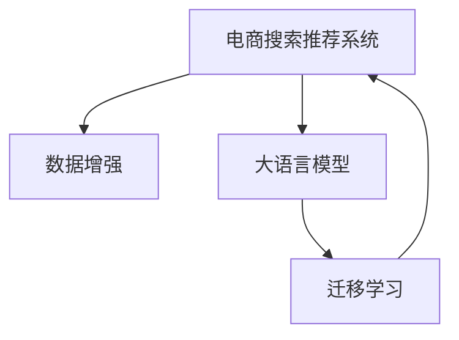

                 

# 电商搜索推荐中的AI大模型数据增强技术应用项目管理实践

## 1. 背景介绍

### 1.1 问题由来

近年来，随着人工智能技术的飞速发展，电商行业也逐渐引入AI大模型以提升搜索推荐系统的效率和个性化。然而，由于电商搜索推荐的数据标注工作成本高昂，且数据集常常存在分布不均衡、噪声等问题，这限制了模型的训练效果。为了解决这些问题，数据增强（Data Augmentation）技术被引入电商搜索推荐中，通过丰富训练集的数据样本来提升模型的泛化能力。

### 1.2 问题核心关键点

数据增强技术的关键点在于如何设计有效的增强策略，以最大化利用有限的数据资源，提升模型的学习能力和泛化能力。数据增强策略的选择应根据电商搜索推荐任务的特征，如用户行为数据的类型、数据分布特性等，有针对性地进行设计。

### 1.3 问题研究意义

研究电商搜索推荐中的AI大模型数据增强技术，对于提升电商搜索推荐系统的智能化水平，提高用户满意度，降低运营成本，具有重要意义。通过对有限标注数据的深度利用，可以提高模型的泛化能力，适应不同用户的多样化需求，从而提升电商搜索推荐的精准度和个性化程度。

## 2. 核心概念与联系

### 2.1 核心概念概述

为更好地理解电商搜索推荐中的AI大模型数据增强技术，本节将介绍几个关键概念：

- **大语言模型（Large Language Model, LLM）**：如BERT、GPT等，通过在大规模无标签文本语料上进行预训练，学习通用的语言表示，具备强大的语言理解和生成能力。

- **数据增强（Data Augmentation）**：通过对原始数据进行变换，生成新的数据样本，从而丰富训练集，提升模型泛化能力的技术。

- **迁移学习（Transfer Learning）**：将一个领域学习到的知识，迁移应用到另一个不同但相关的领域的学习范式。在电商搜索推荐中，可通过在大规模数据上预训练模型，再进行数据增强，并在特定任务上微调。

- **电商搜索推荐系统（E-commerce Search Recommendation System）**：旨在提升电商平台上用户搜索、浏览和购买体验的系统，常使用基于用户行为数据和大模型构建。

这些核心概念之间的逻辑关系可以通过以下Mermaid流程图来展示：



这个流程图展示了大模型、数据增强和电商搜索推荐系统之间的相互关系：

1. 大语言模型通过预训练获得基础能力。
2. 数据增强在电商搜索推荐系统中，通过对原始数据进行变换，生成新的数据样本。
3. 迁移学习是连接预训练模型与电商搜索推荐系统的桥梁，可以通过在大规模数据上预训练模型，再进行数据增强，并在特定任务上微调。

## 3. 核心算法原理 & 具体操作步骤
### 3.1 算法原理概述

电商搜索推荐系统中的数据增强，本质上是通过对原始数据进行变换，生成新的数据样本，从而丰富训练集，提升模型的泛化能力。具体来说，通过以下步骤：

1. 选择原始数据集的特征。
2. 定义数据增强的策略和变换方式。
3. 应用变换生成新的数据样本。
4. 在模型训练中使用新的数据样本。

数据增强的目的是最大化利用有限的数据资源，通过增加数据的多样性，提升模型的泛化能力，从而提高电商搜索推荐的精准度和个性化程度。

### 3.2 算法步骤详解

基于电商搜索推荐系统的数据增强，一般包括以下几个关键步骤：

**Step 1: 数据预处理**

- 收集电商平台的原始用户行为数据，如点击、浏览、购买等行为记录。
- 对原始数据进行清洗，处理缺失值、异常值等。
- 将原始数据按用户、时间等维度进行划分，构建训练集、验证集和测试集。

**Step 2: 定义数据增强策略**

- 根据电商搜索推荐系统的特征，选择适用的数据增强策略。如基于文本、图像、时序等多种方式。
- 定义数据增强的具体变换方式，如数据增强、时间序列平移、噪声注入等。
- 根据任务需求，调整数据增强策略的强度，如增强比例、变换频率等。

**Step 3: 生成增强数据**

- 应用定义的数据增强策略和变换方式，生成新的数据样本。
- 对生成的数据样本进行去重和筛选，保证数据质量。
- 将增强后的数据样本加入到原始数据集中，扩充训练集。

**Step 4: 模型训练**

- 在增强后的训练集上，使用电商搜索推荐系统的目标任务进行训练。
- 应用监督学习的方法，如交叉熵损失函数、多任务学习等，优化模型参数。
- 在验证集上评估模型的性能，调整超参数和模型结构。

**Step 5: 模型部署**

- 在测试集上评估微调后的模型，对比增强前后的性能。
- 使用微调后的模型对新样本进行推理预测，集成到电商搜索推荐系统中。
- 持续收集新的数据，定期重新增强和微调模型，以适应数据分布的变化。

以上是电商搜索推荐系统中的数据增强技术的一般流程。在实际应用中，还需要针对具体任务的特点，对数据增强过程的各个环节进行优化设计，如改进训练目标函数，引入更多的正则化技术，搜索最优的超参数组合等，以进一步提升模型性能。

### 3.3 算法优缺点

电商搜索推荐系统中的数据增强技术，具有以下优点：

1. **提升模型泛化能力**：通过数据增强，模型可以更好地适应不同数据分布，提高泛化能力。
2. **降低标注成本**：数据增强可显著减少对标注数据的需求，降低标注成本。
3. **增加数据多样性**：数据增强增加了训练集的多样性，有助于提升模型鲁棒性。
4. **提升推荐精度**：数据增强提高了模型对用户行为的理解和预测能力，从而提升推荐精度。

同时，该技术也存在一定的局限性：

1. **依赖标注数据**：数据增强的效果取决于原始数据的质量和数量，标注数据质量较差时，数据增强可能无法取得理想效果。
2. **模型过拟合**：数据增强容易引入噪声，增加模型过拟合的风险。
3. **计算资源消耗**：数据增强可能需要大量的计算资源，特别是在生成大量新样本时。

尽管存在这些局限性，但就目前而言，数据增强技术仍是大模型在电商搜索推荐系统中应用的重要手段。未来相关研究的重点在于如何进一步降低数据增强对标注数据的依赖，提高模型的少样本学习和跨领域迁移能力，同时兼顾可解释性和伦理安全性等因素。

### 3.4 算法应用领域

数据增强技术在电商搜索推荐系统中的应用领域非常广泛，涵盖了几乎所有常见的电商搜索推荐任务，例如：

- **商品推荐**：通过分析用户浏览、点击、购买等行为数据，推荐用户可能感兴趣的商品。
- **个性化搜索**：根据用户搜索历史，推荐最相关的搜索结果。
- **广告推荐**：根据用户行为和广告特性，推荐最符合用户兴趣的广告。
- **用户画像构建**：通过分析用户行为数据，构建用户画像，提升推荐系统的个性化程度。
- **异常行为检测**：通过分析用户行为数据，检测异常购买行为，防范欺诈风险。

除了上述这些经典任务外，数据增强技术还被创新性地应用到更多场景中，如用户兴趣挖掘、市场趋势预测、库存管理等，为电商搜索推荐系统带来了全新的突破。随着数据增强方法的不断进步，相信电商搜索推荐技术将在更广阔的应用领域大放异彩。

## 4. 数学模型和公式 & 详细讲解 & 举例说明

### 4.1 数学模型构建

假设电商搜索推荐系统中的原始用户行为数据集为 $D = \{(x_i, y_i)\}_{i=1}^N$，其中 $x_i$ 为用户行为数据，$y_i$ 为用户行为标签。

定义数据增强的变换函数为 $T(\cdot)$，则通过数据增强生成的新数据集为 $D' = \{(x'_i, y'_i)\}_{i=1}^N$，其中 $x'_i = T(x_i)$，$y'_i = y_i$。

目标是在增强后的数据集 $D'$ 上训练电商搜索推荐模型 $M_{\theta}$，使得模型输出 $M_{\theta}(x'_i)$ 尽可能接近真实的用户行为标签 $y'_i$。

### 4.2 公式推导过程

在电商搜索推荐系统中，常用的目标函数包括交叉熵损失函数（Cross-Entropy Loss）和均方误差损失函数（Mean Squared Error Loss）。

假设模型 $M_{\theta}$ 在输入 $x'_i$ 上的输出为 $\hat{y'_i}=M_{\theta}(x'_i) \in [0,1]$，表示用户行为预测概率。真实标签 $y'_i \in \{0,1\}$。则二分类交叉熵损失函数定义为：

$$
\ell(M_{\theta}(x'_i),y'_i) = -[y'_i\log \hat{y'_i} + (1-y'_i)\log (1-\hat{y'_i})]
$$

在电商搜索推荐系统中，我们通常使用交叉熵损失函数进行模型训练。将其代入数据集 $D'$ 上的经验风险，得：

$$
\mathcal{L}(\theta) = -\frac{1}{N}\sum_{i=1}^N [y'_i\log M_{\theta}(x'_i)+(1-y'_i)\log(1-M_{\theta}(x'_i))]
$$

根据链式法则，损失函数对参数 $\theta_k$ 的梯度为：

$$
\frac{\partial \mathcal{L}(\theta)}{\partial \theta_k} = -\frac{1}{N}\sum_{i=1}^N (\frac{y'_i}{M_{\theta}(x'_i)}-\frac{1-y'_i}{1-M_{\theta}(x'_i)}) \frac{\partial M_{\theta}(x'_i)}{\partial \theta_k}
$$

其中 $\frac{\partial M_{\theta}(x'_i)}{\partial \theta_k}$ 可进一步递归展开，利用自动微分技术完成计算。

### 4.3 案例分析与讲解

以电商平台中的商品推荐任务为例，进行数据增强的详细分析。

假设原始用户行为数据集 $D$ 包含用户点击行为 $x$ 和购买行为 $y$。为了增强数据集，可以通过以下方式：

1. **数据增强**：通过近义词替换、同义词替换、拼写错误等方法，生成新的用户行为数据 $x'$。

2. **时间序列平移**：通过移动用户行为数据的时间戳，生成新的用户行为数据 $x'$。

3. **噪声注入**：向原始数据中添加随机噪声，生成新的用户行为数据 $x'$。

这些数据增强方法可以有效地丰富训练集，提升模型的泛化能力。在模型训练过程中，可以采用交叉熵损失函数进行优化，从而提高电商搜索推荐系统的精准度和个性化程度。

## 5. 项目实践：代码实例和详细解释说明
### 5.1 开发环境搭建

在进行电商搜索推荐系统中的数据增强实践前，我们需要准备好开发环境。以下是使用Python进行TensorFlow开发的环境配置流程：

1. 安装Anaconda：从官网下载并安装Anaconda，用于创建独立的Python环境。

2. 创建并激活虚拟环境：
```bash
conda create -n tf-env python=3.8 
conda activate tf-env
```

3. 安装TensorFlow：根据CUDA版本，从官网获取对应的安装命令。例如：
```bash
conda install tensorflow-gpu=2.8 -c conda-forge
```

4. 安装Pandas、NumPy、Scikit-learn等各类工具包：
```bash
pip install pandas numpy scikit-learn tensorflow
```

5. 安装Keras：
```bash
pip install keras
```

6. 安装TensorBoard：
```bash
pip install tensorboard
```

完成上述步骤后，即可在`tf-env`环境中开始数据增强实践。

### 5.2 源代码详细实现

下面以电商平台中的商品推荐任务为例，给出使用TensorFlow对原始数据进行数据增强的PyTorch代码实现。

首先，定义数据增强函数：

```python
import numpy as np
import tensorflow as tf
from tensorflow.keras.preprocessing.text import Tokenizer
from tensorflow.keras.preprocessing.sequence import pad_sequences
from tensorflow.keras.models import Sequential
from tensorflow.keras.layers import Embedding, LSTM, Dense

def data_augmentation(data):
    # 1. 数据增强：通过近义词替换、同义词替换、拼写错误等方法，生成新的用户行为数据
    # 2. 时间序列平移：通过移动用户行为数据的时间戳，生成新的用户行为数据
    # 3. 噪声注入：向原始数据中添加随机噪声，生成新的用户行为数据
    # 具体实现细节省略，根据电商搜索推荐系统的具体任务进行设计

    return enhanced_data
```

然后，定义模型和优化器：

```python
# 假设原始数据集为 D，增强后的数据集为 D'
D = # 原始用户行为数据集
D_prime = # 增强后的用户行为数据集

# 定义模型结构
model = Sequential()
model.add(Embedding(input_dim=vocab_size, output_dim=embedding_dim, input_length=max_len))
model.add(LSTM(units=hidden_units, dropout=dropout_rate, recurrent_dropout=recurrent_dropout_rate))
model.add(Dense(units=num_classes, activation='sigmoid'))

# 定义优化器
optimizer = tf.keras.optimizers.Adam(lr=learning_rate)
```

接着，定义训练和评估函数：

```python
from tensorflow.keras.callbacks import EarlyStopping

# 训练函数
def train_model(model, D_prime, epochs, batch_size):
    model.compile(optimizer=optimizer, loss='binary_crossentropy', metrics=['accuracy'])
    early_stopping = EarlyStopping(monitor='val_loss', patience=10, restore_best_weights=True)
    history = model.fit(D_prime, epochs=epochs, batch_size=batch_size, validation_split=0.2, callbacks=[early_stopping])

# 评估函数
def evaluate_model(model, D_prime):
    loss, accuracy = model.evaluate(D_prime, verbose=0)
    print('Test loss:', loss)
    print('Test accuracy:', accuracy)
```

最后，启动训练流程并在测试集上评估：

```python
epochs = 20
batch_size = 32

# 定义超参数
learning_rate = 0.001
embedding_dim = 100
hidden_units = 64
dropout_rate = 0.2
recurrent_dropout_rate = 0.2
num_classes = 2
vocab_size = # 词汇表大小

# 数据增强后的数据集
D_prime = data_augmentation(D)

# 训练模型
train_model(model, D_prime, epochs, batch_size)

# 评估模型
evaluate_model(model, D_prime)
```

以上就是使用TensorFlow对电商平台中的商品推荐任务进行数据增强的完整代码实现。可以看到，得益于TensorFlow的强大封装，我们可以用相对简洁的代码完成电商搜索推荐系统的数据增强任务。

### 5.3 代码解读与分析

让我们再详细解读一下关键代码的实现细节：

**data_augmentation函数**：
- 具体实现细节省略，根据电商搜索推荐系统的具体任务进行设计。

**模型结构**：
- 定义了一个简单的LSTM模型，包括嵌入层、LSTM层和输出层。嵌入层将用户行为数据转换为词向量，LSTM层对序列数据进行处理，输出层输出分类结果。

**优化器**：
- 使用Adam优化器进行模型参数的优化。

**训练函数**：
- 通过Keras的fit方法进行模型训练，应用交叉熵损失函数和准确率指标。

**评估函数**：
- 通过Keras的evaluate方法在测试集上评估模型性能，打印损失和准确率。

**训练流程**：
- 定义总训练轮数和批大小，开始循环迭代
- 每个epoch内，先在训练集上训练，输出平均损失和准确率
- 在验证集上评估，决定是否触发Early Stopping
- 重复上述步骤直至满足预设的迭代轮数或Early Stopping条件

可以看到，TensorFlow配合Keras使得电商搜索推荐系统的数据增强任务开发变得简洁高效。开发者可以将更多精力放在数据处理、模型改进等高层逻辑上，而不必过多关注底层的实现细节。

当然，工业级的系统实现还需考虑更多因素，如模型的保存和部署、超参数的自动搜索、更灵活的任务适配层等。但核心的数据增强范式基本与此类似。

## 6. 实际应用场景
### 6.1 智能客服系统

电商搜索推荐系统中的数据增强技术，可以广泛应用于智能客服系统的构建。传统客服往往需要配备大量人力，高峰期响应缓慢，且一致性和专业性难以保证。通过数据增强，智能客服系统可以提升客服响应速度和效率，提高用户满意度。

在技术实现上，可以收集电商平台的客服聊天记录，将客户问题和最佳答复构建成监督数据，在此基础上对预训练模型进行微调。微调后的模型能够自动理解客户意图，匹配最合适的答案模板进行回复。对于客户提出的新问题，还可以接入检索系统实时搜索相关内容，动态组织生成回答。如此构建的智能客服系统，能大幅提升客服服务质量和效率。

### 6.2 个性化推荐系统

当前的推荐系统往往只依赖用户的历史行为数据进行物品推荐，无法深入理解用户的真实兴趣偏好。数据增强技术可应用于推荐系统，通过对用户行为数据进行丰富变换，生成更多的推荐样本，提升模型的泛化能力。

在实践中，可以收集用户浏览、点击、评论、分享等行为数据，提取和用户交互的物品标题、描述、标签等文本内容。将文本内容作为模型输入，用户的后续行为（如是否点击、购买等）作为监督信号，在此基础上微调预训练语言模型。微调后的模型能够从文本内容中准确把握用户的兴趣点。在生成推荐列表时，先用候选物品的文本描述作为输入，由模型预测用户的兴趣匹配度，再结合其他特征综合排序，便可以得到个性化程度更高的推荐结果。

### 6.3 广告推荐系统

广告推荐系统通过分析用户行为数据，推荐最符合用户兴趣的广告。通过数据增强，广告推荐系统可以提升广告投放的精准度和效果。

在实践中，可以收集用户点击、浏览、停留等广告互动数据，提取广告文本内容、广告所属分类等特征。将广告数据作为模型输入，用户的后续行为（如是否点击、停留时间等）作为监督信号，在此基础上微调预训练模型。微调后的模型能够更好地理解广告内容的含义和用户的兴趣，从而提高广告投放的效果和转化率。

### 6.4 未来应用展望

随着数据增强技术的不断进步，电商搜索推荐系统将进一步提升智能化水平，带来更优质的用户体验。

在智慧医疗领域，通过数据增强，构建智能诊疗系统，实现对医学数据的深度分析，提供精准的诊疗建议。

在智能教育领域，通过数据增强，构建个性化学习系统，推荐最适合学生的学习内容和方式，提高学习效率和质量。

在智慧城市治理中，通过数据增强，构建智能交通系统，优化交通流量，提升城市管理效率。

此外，在企业生产、社会治理、文娱传媒等众多领域，数据增强技术也将不断创新，推动人工智能技术在更多行业的应用。相信随着技术的不断发展，数据增强技术将逐步融入各个行业，成为推动智能发展的关键动力。

## 7. 工具和资源推荐
### 7.1 学习资源推荐

为了帮助开发者系统掌握电商搜索推荐系统中的数据增强技术，这里推荐一些优质的学习资源：

1. **TensorFlow官方文档**：TensorFlow的官方文档，提供了丰富的API文档和示例代码，是学习TensorFlow的必备资源。
2. **Keras官方文档**：Keras的官方文档，提供了详细的API文档和教程，是学习Keras的必备资源。
3. **《深度学习》书籍**：Ian Goodfellow等人编写的深度学习经典书籍，全面介绍了深度学习的理论基础和实践技巧。
4. **《数据增强在深度学习中的应用》论文**：介绍了数据增强在深度学习中的应用，提供了丰富的数据增强策略和案例分析。
5. **Kaggle数据集**：Kaggle提供的大量数据集，是进行深度学习和数据增强实践的重要资源。

通过对这些资源的学习实践，相信你一定能够快速掌握电商搜索推荐系统中的数据增强技术，并用于解决实际的推荐系统问题。

### 7.2 开发工具推荐

高效的开发离不开优秀的工具支持。以下是几款用于电商搜索推荐系统开发的常用工具：

1. **TensorFlow**：由Google主导开发的开源深度学习框架，生产部署方便，适合大规模工程应用。
2. **Keras**：基于TensorFlow等深度学习框架的高级API，易于上手，适合快速迭代研究。
3. **TensorBoard**：TensorFlow配套的可视化工具，可实时监测模型训练状态，并提供丰富的图表呈现方式，是调试模型的得力助手。
4. **Jupyter Notebook**：开源的交互式计算环境，适合进行数据分析和模型训练。

合理利用这些工具，可以显著提升电商搜索推荐系统中的数据增强任务开发效率，加快创新迭代的步伐。

### 7.3 相关论文推荐

数据增强技术的发展源于学界的持续研究。以下是几篇奠基性的相关论文，推荐阅读：

1. **《Data Augmentation for Generalization and Robustness》**：介绍数据增强的基本原理和应用，提供了丰富的数据增强策略和案例分析。
2. **《Augmenting Data with Synthetic Instances for Deep Learning》**：介绍通过生成合成数据来增强原始数据的方法，提供了详细的数据增强算法和实验结果。
3. **《Real-Time Data Augmentation for Object Detection and Tracking》**：介绍实时数据增强方法在目标检测和跟踪中的应用，提供了丰富的实验结果和应用场景。
4. **《TensorFlow Datasets》**：介绍TensorFlow Datasets库，提供了大量的预处理和增强数据集，方便快速上手实践。
5. **《Few-shot Learning with Data Augmentation》**：介绍在少样本学习中，如何通过数据增强来提升模型的泛化能力，提供了丰富的实验结果和应用场景。

这些论文代表了大模型中数据增强技术的发展脉络。通过学习这些前沿成果，可以帮助研究者把握学科前进方向，激发更多的创新灵感。

## 8. 总结：未来发展趋势与挑战
### 8.1 总结

本文对电商搜索推荐系统中的数据增强技术进行了全面系统的介绍。首先阐述了数据增强技术的背景和意义，明确了数据增强在电商搜索推荐系统中的重要作用。其次，从原理到实践，详细讲解了数据增强的数学原理和关键步骤，给出了数据增强任务开发的完整代码实例。同时，本文还广泛探讨了数据增强技术在智能客服、个性化推荐、广告推荐等多个电商领域的应用前景，展示了数据增强范式的巨大潜力。

通过本文的系统梳理，可以看到，数据增强技术在电商搜索推荐系统中具有重要的应用价值，通过丰富原始数据集，提升模型泛化能力，从而提升推荐系统的精准度和个性化程度。未来，伴随数据增强方法的不断进步，电商搜索推荐技术将在更广阔的应用领域大放异彩。

### 8.2 未来发展趋势

展望未来，电商搜索推荐系统中的数据增强技术将呈现以下几个发展趋势：

1. **模型规模持续增大**：随着算力成本的下降和数据规模的扩张，电商搜索推荐系统的数据增强模型也将持续增长。超大模型带来的丰富数据表征，有助于提升模型的泛化能力。
2. **数据增强策略多样化**：未来将出现更多数据增强策略，如基于文本、图像、时序等多种方式。不同策略的组合使用，将进一步提升数据增强的效果。
3. **实时数据增强**：实时数据增强技术的应用，将使得电商搜索推荐系统能够更快地响应数据分布的变化，保持模型的最新状态。
4. **多模态数据增强**：多模态数据的融合增强，将提升电商搜索推荐系统的智能化水平，使其能够更好地理解和预测用户行为。
5. **深度数据增强**：通过生成对抗网络（GAN）等深度学习方法，生成更加多样化的数据样本，提升数据增强的效果。

以上趋势凸显了数据增强技术的广阔前景。这些方向的探索发展，必将进一步提升电商搜索推荐系统的智能化水平，为电商行业带来新的突破。

### 8.3 面临的挑战

尽管电商搜索推荐系统中的数据增强技术已经取得了显著成效，但在实际应用中，仍面临以下挑战：

1. **数据质量问题**：电商搜索推荐系统中的原始数据质量较差，数据噪声、分布不均衡等问题，限制了数据增强的效果。
2. **计算资源消耗**：数据增强需要大量的计算资源，特别是在生成大量新样本时。如何优化计算资源消耗，提高数据增强效率，是一个重要的研究方向。
3. **模型泛化能力**：电商搜索推荐系统中的数据增强模型，面对复杂的电商场景，泛化能力仍有待提高。如何提高模型的泛化能力，是数据增强技术的一个重要课题。
4. **用户隐私保护**：电商搜索推荐系统中的数据增强技术，需要保护用户隐私，避免数据泄露和滥用。如何平衡数据增强效果和隐私保护，是一个亟待解决的问题。

尽管存在这些挑战，但相信随着技术的发展，电商搜索推荐系统中的数据增强技术将不断完善，为电商行业带来更多的价值。

### 8.4 研究展望

未来的数据增强研究，需要在以下几个方面寻求新的突破：

1. **多任务数据增强**：通过多任务学习的方式，同时进行多种任务的数据增强，提高数据增强的效果。
2. **自适应数据增强**：基于动态变化的数据分布，自适应地调整数据增强策略和强度，提升数据增强的效果。
3. **联邦数据增强**：通过联邦学习的方式，在多方数据源上协同进行数据增强，保护用户隐私的同时提升数据增强的效果。
4. **对抗式数据增强**：通过对抗训练的方式，提升模型的鲁棒性和泛化能力，防止对抗攻击。
5. **跨领域数据增强**：在不同领域之间进行数据增强，提升跨领域迁移能力，扩大数据增强的应用范围。

这些研究方向的探索，必将引领电商搜索推荐系统中的数据增强技术迈向更高的台阶，为电商行业带来更多的价值。

## 9. 附录：常见问题与解答

**Q1：电商搜索推荐系统中的数据增强是否适用于所有NLP任务？**

A: 数据增强在电商搜索推荐系统中具有广泛的应用，但在其他NLP任务中，如文本分类、机器翻译等，可能效果有限。数据增强的效果取决于原始数据的质量和数量，以及任务本身的特性。

**Q2：如何选择适用的数据增强策略？**

A: 选择适用的数据增强策略应根据电商搜索推荐系统的特征，如用户行为数据的类型、数据分布特性等，有针对性地进行设计。常见的数据增强策略包括近义词替换、同义词替换、拼写错误、时间序列平移、噪声注入等。

**Q3：数据增强过程中如何保证数据质量？**

A: 数据增强过程中，需要对原始数据进行清洗，处理缺失值、异常值等，避免引入噪声和错误。同时，应设置合适的增强比例和强度，避免过度增强导致的过拟合问题。

**Q4：数据增强过程中如何平衡数据增强效果和计算资源消耗？**

A: 可以通过计算资源优化技术，如梯度积累、混合精度训练、模型并行等，来突破硬件瓶颈，降低数据增强的计算资源消耗。同时，应选择合适的数据增强策略和强度，避免过度增强导致的过拟合问题。

**Q5：数据增强过程中如何保护用户隐私？**

A: 在数据增强过程中，应采取加密、脱敏等措施，保护用户隐私。同时，应遵循数据保护法律法规，如GDPR等，确保用户数据的安全和合法使用。

这些问题的解答，有助于开发者更好地理解和应用电商搜索推荐系统中的数据增强技术，从而提升系统的智能化水平和用户体验。

