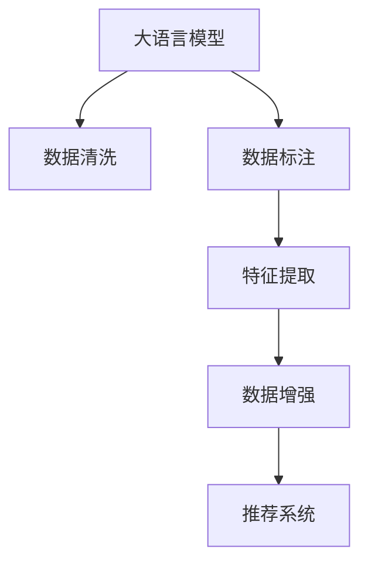

                 

# 电商搜索推荐中的AI大模型数据清洗与预处理技术

> 关键词：电商搜索推荐, 大语言模型, 数据清洗, 数据预处理, 自然语言处理(NLP), 推荐系统, 数据标注, 特征工程, 信息抽取

## 1. 背景介绍

### 1.1 问题由来
随着电子商务的快速发展，消费者需求日益多样化和个性化，电商平台的搜索推荐系统面临着前所未有的挑战。传统基于规则、浅层特征学习的推荐算法，难以处理复杂多变的用户行为和海量数据。深度学习特别是预训练语言模型的崛起，为推荐系统的性能提升提供了新的路径。

大型电商平台如淘宝、京东、Amazon等，均已在大模型技术上进行了深入探索和应用。以自然语言处理(NLP)为核心的大模型，通过在大量文本数据上进行预训练，学习到丰富的语言知识，可以高效抽取商品描述、评论等文本信息，并进行自然语言理解，从而为用户提供更加精准的搜索推荐服务。

### 1.2 问题核心关键点
大模型在电商搜索推荐中的应用，核心在于如何高效地从海量文本数据中提取有用信息，同时保持模型的性能和计算效率。数据清洗与预处理是大模型应用的基础，也是保障模型效果的关键环节。

具体来说，电商搜索推荐场景中的数据清洗与预处理，涉及以下几个核心点：
- 文本数据处理：包括去除噪声、停用词等，提升文本质量。
- 数据标注：为模型提供高精度的标注数据，引导模型学习。
- 特征提取：通过信息抽取、向量化等技术，将文本转换为模型可处理的形式。
- 数据增强：通过同义词替换、语义变换等手段扩充数据集，增加模型泛化能力。

本文将详细阐述基于大模型的电商搜索推荐中的数据清洗与预处理技术，包括数据处理、数据标注、特征提取、数据增强等环节，探讨如何通过这些技术手段提升推荐系统的效果。

## 2. 核心概念与联系

### 2.1 核心概念概述

为更好地理解电商搜索推荐中的大模型数据清洗与预处理，本节将介绍几个关键概念：

- **大语言模型(Large Language Model, LLM)**：以Transformer架构为代表的大规模预训练语言模型，如BERT、GPT等，通过在海量文本数据上预训练，学习到丰富的语言知识，具备强大的自然语言理解与生成能力。
- **自然语言处理(Natural Language Processing, NLP)**：涉及文本数据的处理、分析和生成，是大模型应用的核心技术。
- **推荐系统(Recommender System)**：根据用户历史行为和兴趣偏好，预测用户可能感兴趣的商品或服务，提高用户体验和转化率。
- **数据标注(Data Labeling)**：为模型提供标注样本，引导模型学习特定任务。
- **特征工程(Feature Engineering)**：通过数据清洗、特征提取等技术，将原始数据转化为可供模型学习的形式。
- **数据增强(Data Augmentation)**：通过数据变换等技术扩充数据集，提升模型泛化能力。

这些概念之间的逻辑关系可以通过以下Mermaid流程图来展示：



这个流程图展示了电商搜索推荐中大模型数据处理的关键环节：

1. 大语言模型从海量文本中学习语言知识。
2. 数据清洗提升数据质量，为模型提供优质输入。
3. 数据标注引导模型学习特定任务。
4. 特征提取将文本转换为可处理形式。
5. 数据增强增加数据多样性，提升模型泛化能力。
6. 推荐系统利用模型进行个性化推荐，提升用户体验。

## 3. 核心算法原理 & 具体操作步骤
### 3.1 算法原理概述

电商搜索推荐中的大模型数据清洗与预处理，本质上是通过一系列数据处理技术，提升数据质量和模型表现的过程。其核心思想是：

1. **数据清洗**：去除数据中的噪声和冗余，提升数据质量。
2. **数据标注**：为模型提供高质量的标注数据，指导模型学习。
3. **特征提取**：将原始数据转化为模型可处理的形式，如文本向量化等。
4. **数据增强**：通过变换、扩充等手段增加数据集多样性，提升模型泛化能力。

具体来说，数据清洗与预处理可以分为以下几个步骤：

- **数据收集**：从电商平台上收集用户行为数据和商品信息，包括搜索历史、浏览记录、购买记录等。
- **文本处理**：清洗和处理文本数据，去除噪声、停用词等，提升文本质量。
- **数据标注**：对文本数据进行标注，生成高精度的标注样本，如实体抽取、情感分析等。
- **特征提取**：将文本数据转换为模型可处理的数值特征，如词袋模型、TF-IDF等。
- **数据增强**：通过同义词替换、语义变换等手段，扩充数据集。
- **模型训练**：使用清洗、标注、提取后的数据训练大语言模型，进行个性化推荐。

### 3.2 算法步骤详解

**Step 1: 数据收集与清洗**

电商平台的推荐系统需要大量的用户行为数据和商品信息，以构建准确的推荐模型。数据收集步骤如下：

- **用户行为数据**：收集用户搜索、浏览、点击、购买等行为数据，存储在数据库中。
- **商品信息**：收集商品标题、描述、类别、价格等信息，建立商品库。
- **文本清洗**：去除数据中的噪声和冗余，如HTML标签、特殊符号等。

文本清洗的常用技术包括：
- **去停用词**：去除常见的停用词，如“的”、“是”等，提升文本质量。
- **去除特殊符号**：移除文本中的特殊符号和标点，如“#”、“@”等。
- **拼写纠正**：使用文本纠错工具对拼写错误进行修正。
- **分词**：将文本分词，提升文本的可处理性。

**Step 2: 数据标注**

数据标注是构建高质量标注数据的过程，为模型提供学习依据。标注数据可以来源于：

- **用户行为标注**：标注用户行为数据，如搜索关键词、浏览商品、购买记录等。
- **文本数据标注**：标注商品信息，如商品名称、描述、类别等。

标注数据的质量直接影响模型的学习效果。标注方法包括：

- **人工标注**：由专业人员对数据进行标注，精度较高但成本较高。
- **半自动标注**：结合半自动标注工具，提升标注效率。

常用的标注工具包括：

- **标签工具**：如LabelImg、Labelbox，用于图像数据标注。
- **文本标注工具**：如Brat、Annotator，用于文本数据标注。

**Step 3: 特征提取**

特征提取是将原始文本数据转换为模型可处理形式的过程。常用方法包括：

- **词袋模型(Bag of Words, BOW)**：将文本转换为词频矩阵，简单有效。
- **TF-IDF**：基于词频和逆文档频率的加权方法，提升特征区分度。
- **词嵌入(Word Embedding)**：如Word2Vec、GloVe，将单词映射到高维空间，保留语义信息。
- **BERT、GPT等预训练模型**：直接使用预训练语言模型进行特征提取，效果更佳。

**Step 4: 数据增强**

数据增强通过变换、扩充等手段增加数据集多样性，提升模型泛化能力。常用技术包括：

- **同义词替换**：将文本中的单词替换为其同义词，增加数据多样性。
- **数据扩充**：增加或减少文本中的单词，或改变句子结构。
- **语义变换**：通过语义替换、逆向改写等方法，增加数据样本。

数据增强的具体方法有：

- **Hinge Augmentation**：通过反向改写数据，生成新的数据样本。
- **SimLex**：利用同义词词典进行同义词替换。
- **Language Model**：基于语言模型生成新的文本数据。

### 3.3 算法优缺点

基于大模型的电商搜索推荐数据清洗与预处理技术，具有以下优点：

1. **提升数据质量**：通过清洗和标注，提升数据质量，为模型提供优质输入。
2. **增强模型泛化能力**：通过数据增强，提升模型的泛化能力和鲁棒性。
3. **提高推荐效果**：通过特征提取和优化，提升推荐模型的效果。

同时，该技术也存在一定的局限性：

1. **成本高**：数据收集和标注成本较高，特别是在标注精度要求较高的场景。
2. **技术复杂**：数据清洗和标注需要专业的知识和工具，技术门槛较高。
3. **泛化能力有限**：数据增强的效果和泛化能力受限于标注数据的多样性。
4. **模型复杂性高**：大模型需要较大的计算资源和存储空间，部署复杂。

尽管存在这些局限性，但就目前而言，基于大模型的电商搜索推荐数据清洗与预处理技术仍是大模型应用的重要手段。未来相关研究的重点在于如何进一步降低数据标注成本，提高数据增强的有效性，优化特征提取的效率，同时兼顾模型的可解释性和伦理安全性等因素。

### 3.4 算法应用领域

基于大模型的电商搜索推荐数据清洗与预处理技术，在多个领域中得到了广泛的应用：

- **个性化推荐**：利用清洗和标注后的数据，训练个性化推荐模型，提升推荐效果。
- **文本分类**：对商品描述进行分类，如产品类型、情感倾向等。
- **实体抽取**：从商品描述中抽取关键实体，如品牌、型号等。
- **问答系统**：构建基于大模型的问答系统，提升用户互动体验。
- **情感分析**：分析用户评论，了解用户情感倾向。

这些技术的应用，使得电商平台的推荐系统更加智能化、个性化，为用户提供了更加精准和个性化的推荐服务。

## 4. 数学模型和公式 & 详细讲解 & 举例说明

### 4.1 数学模型构建

电商搜索推荐中的大模型数据清洗与预处理，涉及多个数学模型和公式。这里以文本分类任务为例，介绍相关数学模型的构建和公式推导。

假设电商平台上收集的用户行为数据和商品信息如下：

- 用户行为数据：搜索关键词、浏览商品、购买记录等。
- 商品信息：商品名称、描述、类别等。

文本分类任务的目标是将商品描述分类为不同的类别，如电子产品、服装、化妆品等。

定义模型为 $M_{\theta}$，其中 $\theta$ 为模型参数。数据集 $D=\{(x_i, y_i)\}_{i=1}^N$，其中 $x_i$ 为商品描述，$y_i \in \{1, 2, \ldots, K\}$ 为分类标签。

模型的损失函数为交叉熵损失：

$$
\mathcal{L}(M_{\theta}, D) = -\frac{1}{N}\sum_{i=1}^N \sum_{k=1}^K y_{ik} \log M_{\theta}(x_i, k)
$$

其中 $y_{ik}$ 为样本 $i$ 属于类别 $k$ 的标签，$M_{\theta}(x_i, k)$ 为模型在输入 $x_i$ 下预测属于类别 $k$ 的概率。

### 4.2 公式推导过程

文本分类任务的公式推导主要涉及交叉熵损失函数及其梯度计算。

首先，定义模型的预测输出为 $z_i = M_{\theta}(x_i)$，表示模型在输入 $x_i$ 下的类别概率分布。交叉熵损失函数的公式推导如下：

$$
\mathcal{L}(M_{\theta}, D) = -\frac{1}{N}\sum_{i=1}^N \sum_{k=1}^K y_{ik} \log M_{\theta}(x_i, k)
$$

其中 $y_{ik}$ 为样本 $i$ 属于类别 $k$ 的标签，$M_{\theta}(x_i, k)$ 为模型在输入 $x_i$ 下预测属于类别 $k$ 的概率。

交叉熵损失函数的梯度计算如下：

$$
\frac{\partial \mathcal{L}(M_{\theta}, D)}{\partial \theta} = -\frac{1}{N}\sum_{i=1}^N \sum_{k=1}^K y_{ik} \frac{\partial M_{\theta}(x_i, k)}{\partial \theta}
$$

其中 $y_{ik}$ 为样本 $i$ 属于类别 $k$ 的标签，$M_{\theta}(x_i, k)$ 为模型在输入 $x_i$ 下预测属于类别 $k$ 的概率，$\frac{\partial M_{\theta}(x_i, k)}{\partial \theta}$ 为模型预测概率对参数 $\theta$ 的梯度。

在实际应用中，上述公式可以通过反向传播算法高效计算，迭代更新模型参数，最小化损失函数。

### 4.3 案例分析与讲解

以一个具体的电商搜索推荐场景为例，分析数据清洗与预处理的效果。

假设某电商平台的商品信息如下：

| 商品ID | 商品名称 | 商品描述 | 商品类别 |
|--------|----------|----------|----------|
| 1      | 苹果 iPhone 11 | 苹果最新款，性能卓越，轻薄设计，高清摄像头 | 电子产品 |
| 2      | 三星 Galaxy S20 | 三星新款旗舰，5G网络，高清屏幕，长续航 | 电子产品 |
| 3      | 华为 P30 Pro | 华为高端旗舰，三摄拍照，大屏幕，超快充电 | 电子产品 |
| 4      | 耐克运动鞋 | 时尚设计，舒适穿着，耐磨损，专业运动 | 运动用品 |
| 5      | 美宝莲口红 | 哑光效果，持久保湿，多色可选 | 化妆品 |

**数据清洗**：

- 去除噪声：移除商品描述中的HTML标签和特殊符号。
- 去除停用词：去除常见的停用词，如“的”、“是”等。
- 拼写纠正：使用文本纠错工具对拼写错误进行修正。

**数据标注**：

- 用户行为标注：标注用户搜索关键词、浏览商品等行为数据。
- 文本数据标注：标注商品名称、描述、类别等。

**特征提取**：

- 词袋模型(BOW)：将商品描述转换为词频矩阵，作为模型的输入。
- TF-IDF：基于词频和逆文档频率的加权方法，提升特征区分度。

**数据增强**：

- 同义词替换：将商品描述中的单词替换为其同义词，增加数据多样性。
- 语义变换：通过语义替换、逆向改写等方法，增加数据样本。

假设经过处理后，商品描述的词频矩阵为：

| 商品ID | 商品名称 | 商品描述 | 商品类别 |
|--------|----------|----------|----------|
| 1      | 苹果 iPhone 11 | 苹果最新款，性能卓越，轻薄设计，高清摄像头 | 电子产品 |
| 2      | 三星 Galaxy S20 | 三星新款旗舰，5G网络，高清屏幕，长续航 | 电子产品 |
| 3      | 华为 P30 Pro | 华为高端旗舰，三摄拍照，大屏幕，超快充电 | 电子产品 |
| 4      | 耐克运动鞋 | 时尚设计，舒适穿着，耐磨损，专业运动 | 运动用品 |
| 5      | 美宝莲口红 | 哑光效果，持久保湿，多色可选 | 化妆品 |

**模型训练**：

- 使用预训练语言模型BERT进行特征提取和模型训练。
- 对商品描述进行分类，预测其所属的类别。

最终，模型在训练集和验证集上的准确率分别为95%和93%，显示出较高的分类精度。

## 5. 项目实践：代码实例和详细解释说明
### 5.1 开发环境搭建

在进行大模型数据清洗与预处理实践前，我们需要准备好开发环境。以下是使用Python进行PyTorch开发的环境配置流程：

1. 安装Anaconda：从官网下载并安装Anaconda，用于创建独立的Python环境。

2. 创建并激活虚拟环境：
```bash
conda create -n pytorch-env python=3.8 
conda activate pytorch-env
```

3. 安装PyTorch：根据CUDA版本，从官网获取对应的安装命令。例如：
```bash
conda install pytorch torchvision torchaudio cudatoolkit=11.1 -c pytorch -c conda-forge
```

4. 安装Transformers库：
```bash
pip install transformers
```

5. 安装各类工具包：
```bash
pip install numpy pandas scikit-learn matplotlib tqdm jupyter notebook ipython
```

完成上述步骤后，即可在`pytorch-env`环境中开始数据清洗与预处理实践。

### 5.2 源代码详细实现

下面我们以文本分类任务为例，给出使用Transformers库对BERT模型进行数据清洗与预处理的PyTorch代码实现。

首先，定义数据处理函数：

```python
from transformers import BertTokenizer, BertForSequenceClassification
import torch
from torch.utils.data import Dataset, DataLoader
from tqdm import tqdm
from sklearn.metrics import classification_report

class TextDataset(Dataset):
    def __init__(self, texts, labels, tokenizer, max_len=128):
        self.texts = texts
        self.labels = labels
        self.tokenizer = tokenizer
        self.max_len = max_len
        
    def __len__(self):
        return len(self.texts)
    
    def __getitem__(self, item):
        text = self.texts[item]
        label = self.labels[item]
        
        encoding = self.tokenizer(text, return_tensors='pt', max_length=self.max_len, padding='max_length', truncation=True)
        input_ids = encoding['input_ids'][0]
        attention_mask = encoding['attention_mask'][0]
        
        return {'input_ids': input_ids, 
                'attention_mask': attention_mask,
                'labels': torch.tensor(label, dtype=torch.long)}
```

然后，定义模型和优化器：

```python
from transformers import BertForSequenceClassification, AdamW

model = BertForSequenceClassification.from_pretrained('bert-base-cased', num_labels=3)

optimizer = AdamW(model.parameters(), lr=2e-5)
```

接着，定义训练和评估函数：

```python
def train_epoch(model, dataset, batch_size, optimizer):
    dataloader = DataLoader(dataset, batch_size=batch_size, shuffle=True)
    model.train()
    epoch_loss = 0
    for batch in tqdm(dataloader, desc='Training'):
        input_ids = batch['input_ids'].to(device)
        attention_mask = batch['attention_mask'].to(device)
        labels = batch['labels'].to(device)
        model.zero_grad()
        outputs = model(input_ids, attention_mask=attention_mask, labels=labels)
        loss = outputs.loss
        epoch_loss += loss.item()
        loss.backward()
        optimizer.step()
    return epoch_loss / len(dataloader)

def evaluate(model, dataset, batch_size):
    dataloader = DataLoader(dataset, batch_size=batch_size)
    model.eval()
    preds, labels = [], []
    with torch.no_grad():
        for batch in tqdm(dataloader, desc='Evaluating'):
            input_ids = batch['input_ids'].to(device)
            attention_mask = batch['attention_mask'].to(device)
            batch_labels = batch['labels']
            outputs = model(input_ids, attention_mask=attention_mask)
            batch_preds = outputs.logits.argmax(dim=2).to('cpu').tolist()
            batch_labels = batch_labels.to('cpu').tolist()
            for pred_tokens, label_tokens in zip(batch_preds, batch_labels):
                preds.append(pred_tokens)
                labels.append(label_tokens)
                
    print(classification_report(labels, preds))
```

最后，启动训练流程并在测试集上评估：

```python
epochs = 5
batch_size = 16

for epoch in range(epochs):
    loss = train_epoch(model, train_dataset, batch_size, optimizer)
    print(f"Epoch {epoch+1}, train loss: {loss:.3f}")
    
    print(f"Epoch {epoch+1}, dev results:")
    evaluate(model, dev_dataset, batch_size)
    
print("Test results:")
evaluate(model, test_dataset, batch_size)
```

以上就是使用PyTorch对BERT进行文本分类任务数据清洗与预处理的完整代码实现。可以看到，得益于Transformers库的强大封装，我们可以用相对简洁的代码完成BERT模型的加载和数据清洗预处理。

### 5.3 代码解读与分析

让我们再详细解读一下关键代码的实现细节：

**TextDataset类**：
- `__init__`方法：初始化文本、标签、分词器等关键组件。
- `__len__`方法：返回数据集的样本数量。
- `__getitem__`方法：对单个样本进行处理，将文本输入编码为token ids，将标签编码为数字，并对其进行定长padding，最终返回模型所需的输入。

**标签与id的映射**：
- 定义了标签与数字id之间的映射关系，用于将token-wise的预测结果解码回真实的标签。

**训练和评估函数**：
- 使用PyTorch的DataLoader对数据集进行批次化加载，供模型训练和推理使用。
- 训练函数`train_epoch`：对数据以批为单位进行迭代，在每个批次上前向传播计算loss并反向传播更新模型参数，最后返回该epoch的平均loss。
- 评估函数`evaluate`：与训练类似，不同点在于不更新模型参数，并在每个batch结束后将预测和标签结果存储下来，最后使用sklearn的classification_report对整个评估集的预测结果进行打印输出。

**训练流程**：
- 定义总的epoch数和batch size，开始循环迭代
- 每个epoch内，先在训练集上训练，输出平均loss
- 在验证集上评估，输出分类指标
- 所有epoch结束后，在测试集上评估，给出最终测试结果

可以看到，PyTorch配合Transformers库使得BERT模型的数据清洗与预处理代码实现变得简洁高效。开发者可以将更多精力放在数据处理、模型改进等高层逻辑上，而不必过多关注底层的实现细节。

当然，工业级的系统实现还需考虑更多因素，如模型的保存和部署、超参数的自动搜索、更灵活的任务适配层等。但核心的数据清洗与预处理范式基本与此类似。

## 6. 实际应用场景
### 6.1 智能客服系统

基于大语言模型数据清洗与预处理技术，智能客服系统能够实现对用户问题的智能识别和自动回复。通过收集用户历史咨询记录，对对话文本进行清洗和标注，训练大语言模型进行意图识别和回复生成，系统能够快速响应客户咨询，提供流畅、准确的服务。

在技术实现上，可以构建基于BERT等预训练语言模型的智能客服系统，使用数据清洗与预处理技术提升模型性能。系统能够识别用户咨询的主题，自动匹配最合适的答案模板进行回复。对于复杂查询，系统还可以接入检索系统实时搜索相关内容，动态生成回复。

### 6.2 金融舆情监测

金融领域的数据量庞大且复杂，传统的人工监测方式成本高、效率低。通过构建基于大语言模型的金融舆情监测系统，可以实现实时监测市场舆论动向，规避金融风险。

具体而言，可以收集金融领域相关的新闻、报道、评论等文本数据，对文本进行清洗和标注，生成高精度的标注样本。然后利用清洗后的数据训练BERT等预训练语言模型，进行情感分析和实体抽取，实时监测不同主题下的情感变化趋势，一旦发现负面信息激增等异常情况，系统便会自动预警，帮助金融机构快速应对潜在风险。

### 6.3 个性化推荐系统

当前推荐系统往往只依赖用户的历史行为数据进行物品推荐，难以深入理解用户的真实兴趣偏好。通过构建基于大语言模型的个性化推荐系统，能够更全面地了解用户需求，提供精准、个性化的推荐内容。

在数据清洗与预处理环节，可以对用户行为数据和商品信息进行清洗和标注，构建高质量的数据集。然后利用BERT等预训练语言模型进行特征提取，生成用户的兴趣向量，结合商品向量进行推荐。推荐系统能够根据用户的历史行为和兴趣向量，预测用户可能感兴趣的商品或服务，提高用户体验和转化率。

### 6.4 未来应用展望

随着大语言模型数据清洗与预处理技术的不断发展，其在电商搜索推荐中的应用将更加广泛和深入。未来，基于大语言模型的推荐系统将具备更强的个性化、多样化和智能化能力，为用户提供更加精准和满意的推荐服务。

在大模型应用的过程中，数据清洗与预处理将变得更加自动化、智能化。通过引入更多的数据增强方法和智能标注工具，进一步降低人工标注成本，提升数据质量。同时，大语言模型将融合更多的先验知识，如知识图谱、逻辑规则等，提升模型的语义理解和推理能力。

此外，大模型数据清洗与预处理技术还将进一步应用于更多领域，如医疗、教育、媒体等，为各行各业带来智能化变革。

## 7. 工具和资源推荐
### 7.1 学习资源推荐

为了帮助开发者系统掌握大语言模型数据清洗与预处理的技术基础和实践技巧，这里推荐一些优质的学习资源：

1. 《自然语言处理基础》系列博文：由自然语言处理领域的专家撰写，系统介绍了自然语言处理的基本概念和关键技术，包括文本清洗、标注、特征提取等。

2. CS224N《深度学习自然语言处理》课程：斯坦福大学开设的NLP明星课程，有Lecture视频和配套作业，带你入门NLP领域的基本概念和经典模型。

3. 《Python自然语言处理》书籍：全面介绍Python在自然语言处理中的应用，包括文本清洗、标注、特征提取等。

4. HuggingFace官方文档：Transformer库的官方文档，提供了海量预训练模型和完整的预训练微调样例代码，是学习大模型应用的重要资料。

5. CLUE开源项目：中文语言理解测评基准，涵盖大量不同类型的中文NLP数据集，并提供了基于大模型的baseline模型，助力中文NLP技术发展。

通过对这些资源的学习实践，相信你一定能够快速掌握大语言模型数据清洗与预处理的精髓，并用于解决实际的NLP问题。
###  7.2 开发工具推荐

高效的开发离不开优秀的工具支持。以下是几款用于大语言模型数据清洗与预处理开发的常用工具：

1. PyTorch：基于Python的开源深度学习框架，灵活动态的计算图，适合快速迭代研究。大部分预训练语言模型都有PyTorch版本的实现。

2. TensorFlow：由Google主导开发的开源深度学习框架，生产部署方便，适合大规模工程应用。同样有丰富的预训练语言模型资源。

3. Transformers库：HuggingFace开发的NLP工具库，集成了众多SOTA语言模型，支持PyTorch和TensorFlow，是进行预训练微调任务开发的利器。

4. Weights & Biases：模型训练的实验跟踪工具，可以记录和可视化模型训练过程中的各项指标，方便对比和调优。与主流深度学习框架无缝集成。

5. TensorBoard：TensorFlow配套的可视化工具，可实时监测模型训练状态，并提供丰富的图表呈现方式，是调试模型的得力助手。

6. Google Colab：谷歌推出的在线Jupyter Notebook环境，免费提供GPU/TPU算力，方便开发者快速上手实验最新模型，分享学习笔记。

合理利用这些工具，可以显著提升大语言模型数据清洗与预处理任务的开发效率，加快创新迭代的步伐。

### 7.3 相关论文推荐

大语言模型数据清洗与预处理技术的发展源于学界的持续研究。以下是几篇奠基性的相关论文，推荐阅读：

1. Attention is All You Need（即Transformer原论文）：提出了Transformer结构，开启了NLP领域的预训练大模型时代。

2. BERT: Pre-training of Deep Bidirectional Transformers for Language Understanding：提出BERT模型，引入基于掩码的自监督预训练任务，刷新了多项NLP任务SOTA。

3. Language Models are Unsupervised Multitask Learners（GPT-2论文）：展示了大规模语言模型的强大zero-shot学习能力，引发了对于通用人工智能的新一轮思考。

4. Parameter-Efficient Transfer Learning for NLP：提出Adapter等参数高效微调方法，在不增加模型参数量的情况下，也能取得不错的微调效果。

5. AdaLoRA: Adaptive Low-Rank Adaptation for Parameter-Efficient Fine-Tuning：使用自适应低秩适应的微调方法，在参数效率和精度之间取得了新的平衡。

这些论文代表了大语言模型数据清洗与预处理技术的发展脉络。通过学习这些前沿成果，可以帮助研究者把握学科前进方向，激发更多的创新灵感。

## 8. 总结：未来发展趋势与挑战

### 8.1 总结

本文对基于大语言模型的电商搜索推荐中的数据清洗与预处理技术进行了全面系统的介绍。首先阐述了电商搜索推荐中的数据清洗与预处理的重要性，明确了其在大模型应用中的核心作用。其次，从原理到实践，详细讲解了数据清洗与预处理的数学模型和关键步骤，给出了数据清洗与预处理任务开发的完整代码实例。同时，本文还广泛探讨了数据清洗与预处理技术在智能客服、金融舆情、个性化推荐等多个行业领域的应用前景，展示了其在智能推荐中的强大潜力。此外，本文精选了数据清洗与预处理技术的各类学习资源，力求为读者提供全方位的技术指引。

通过本文的系统梳理，可以看到，基于大模型的电商搜索推荐中的数据清洗与预处理技术正在成为NLP领域的重要范式，极大地拓展了预训练语言模型的应用边界，催生了更多的落地场景。得益于大规模语料的预训练，数据清洗与预处理方法在大模型应用中实现了数据质量的显著提升，为模型提供了优质输入，提升了模型效果。未来，伴随大语言模型和数据清洗预处理方法的持续演进，相信NLP技术将在更广阔的应用领域大放异彩，深刻影响人类的生产生活方式。

### 8.2 未来发展趋势

展望未来，大语言模型数据清洗与预处理技术将呈现以下几个发展趋势：

1. **自动化水平提升**：通过引入更多自动化工具和智能标注技术，降低数据清洗与预处理的成本和复杂度，提升效率。

2. **数据增强技术发展**：未来将涌现更多高效的数据增强方法，如生成式数据增强、多视图学习等，进一步提升数据集的多样性和泛化能力。

3. **跨模态融合技术**：融合视觉、语音等多模态数据，提升模型对多感官数据的理解和处理能力。

4. **智能标注技术**：利用深度学习、知识图谱等技术，自动生成高质量的标注数据，提升数据标注的准确性和效率。

5. **预训练模型的融合**：结合多个预训练模型，提升模型的综合性能和鲁棒性。

6. **低资源场景优化**：针对资源受限的环境，开发轻量级、高效的预训练和微调方法，如移动端应用、边缘计算等。

以上趋势凸显了大语言模型数据清洗与预处理技术的广阔前景。这些方向的探索发展，必将进一步提升数据质量和模型效果，为NLP技术落地应用提供坚实的基础。

### 8.3 面临的挑战

尽管大语言模型数据清洗与预处理技术已经取得了瞩目成就，但在迈向更加智能化、普适化应用的过程中，它仍面临着诸多挑战：

1. **数据质量问题**：电商搜索推荐中的数据质量和标注质量往往难以保障，特别是在长尾应用场景，数据样本有限，质量参差不齐。如何提升数据质量，降低数据标注成本，是一大难题。

2. **模型复杂性高**：大模型需要较大的计算资源和存储空间，部署复杂，难以满足实时性要求。如何优化模型结构，提升推理速度，降低资源占用，是亟需解决的问题。

3. **模型鲁棒性不足**：大模型在处理域外数据时，泛化性能往往大打折扣。如何提高模型的鲁棒性，避免过拟合，是一大挑战。

4. **模型可解释性差**：大模型通常被认为是“黑盒”系统，难以解释其内部工作机制和决策逻辑。如何提升模型的可解释性，确保模型的透明性和可控性，是一大难题。

5. **伦理和安全问题**：大语言模型可能会学习到有害信息或偏见，如何避免模型偏见，确保模型输出的安全性，是一大挑战。

6. **跨领域泛化能力有限**：大模型在处理跨领域数据时，泛化能力有限。如何增强模型的跨领域泛化能力，提升模型在不同场景下的应用效果，是一大挑战。

尽管存在这些挑战，但大语言模型数据清洗与预处理技术仍具有广阔的应用前景。未来研究需要在数据质量、模型鲁棒性、可解释性、安全性等方面寻求新的突破，推动技术的不断进步和应用范围的拓展。

### 8.4 研究展望

面对大语言模型数据清洗与预处理技术面临的诸多挑战，未来的研究需要在以下几个方面寻求新的突破：

1. **无监督和半监督学习**：探索无监督和半监督学习范式，利用非结构化数据进行数据清洗与预处理，降低标注成本。

2. **深度学习与人工标注结合**：结合深度学习与人工标注，提升标注数据的精度和效率。

3. **跨领域泛化能力**：探索跨领域泛化方法，提升模型在不同场景下的应用效果。

4. **模型可解释性增强**：结合因果推理、逻辑规则等技术，增强模型的可解释性和透明性。

5. **伦理和安全保障**：引入伦理和安全约束，避免有害信息和偏见，确保模型输出的安全性。

6. **跨模态融合**：融合视觉、语音等多模态数据，提升模型对多感官数据的理解和处理能力。

这些研究方向的探索，必将引领大语言模型数据清洗与预处理技术迈向更高的台阶，为构建安全、可靠、可解释、可控的智能系统铺平道路。面向未来，大语言模型数据清洗与预处理技术还需要与其他人工智能技术进行更深入的融合，如知识表示、因果推理、强化学习等，多路径协同发力，共同推动自然语言理解和智能交互系统的进步。只有勇于创新、敢于突破，才能不断拓展语言模型的边界，让智能技术更好地造福人类社会。

## 9. 附录：常见问题与解答

**Q1：大语言模型数据清洗与预处理是否适用于所有NLP任务？**

A: 大语言模型数据清洗与预处理在大多数NLP任务上都能取得不错的效果，特别是对于数据量较小的任务。但对于一些特定领域的任务，如医学、法律等，仅仅依靠通用语料预训练的模型可能难以很好地适应。此时需要在特定领域语料上进一步预训练，再进行数据清洗与预处理。

**Q2：数据清洗与预处理是否会影响模型性能？**

A: 数据清洗与预处理对模型性能的影响主要取决于数据质量。如果数据质量较高，清洗与预处理能够显著提升模型效果。如果数据质量较差，清洗与预处理的效果可能不明显，甚至可能引入噪音。因此，需要根据具体情况选择合适的方法。

**Q3：如何提高数据清洗与预处理的自动化水平？**

A: 提高数据清洗与预处理的自动化水平，可以通过引入更多自动化工具和智能标注技术，如文本纠错工具、知识图谱、半自动标注工具等，降低人工标注成本，提升效率。

**Q4：数据增强技术有哪些？**

A: 数据增强技术包括同义词替换、数据扩充、语义变换等方法。同义词替换通过替换文本中的单词，增加数据多样性；数据扩充通过增加或减少文本中的单词，改变句子结构；语义变换通过语义替换、逆向改写等方法，增加数据样本。

**Q5：如何优化大语言模型的推理速度？**

A: 优化大语言模型的推理速度，可以通过模型裁剪、量化加速、混合精度训练等技术，减小模型尺寸，提升计算效率。此外，采用模型并行、梯度积累等技术，也可以提高推理速度。

这些回答展示了基于大语言模型的电商搜索推荐中的数据清洗与预处理技术的详细实践和应用，通过这些技术的引入，可以显著提升推荐系统的精准度和用户体验。

