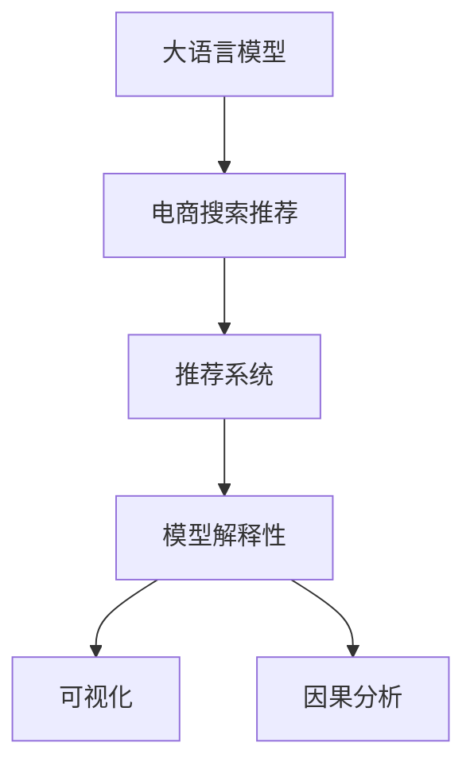

                 

# 电商搜索推荐中的AI大模型模型解释性研究

## 1. 背景介绍

在电商搜索推荐系统中，AI大模型已经成为了提供个性化推荐的重要工具。然而，随着模型复杂度的提升和数据量的增加，大模型的预测结果越来越难以解释。尽管其在推荐效果上可能表现优异，但用户和商家对其决策过程缺乏理解和信任。

为解决这一问题，学术界和产业界正在不断探索大模型的解释性问题。本文将详细探讨电商搜索推荐中的AI大模型解释性，包括模型原理、具体技术和实际应用场景。

## 2. 核心概念与联系

### 2.1 核心概念概述

在进行AI大模型解释性研究时，以下几个关键概念需要理解：

- 大语言模型(Large Language Model, LLM)：基于自回归或自编码模型预训练的语言模型，通过在大量无标签文本数据上学习语言表示，具备强大的自然语言处理能力。
- 模型解释性：指对模型的预测结果进行解释，帮助用户理解模型是如何做出决策的，增强模型的可信度和透明度。
- 推荐系统：利用用户历史行为、商品特征等信息，为用户推荐最符合其需求的商品，提升用户体验和商家收益。
- 电商搜索推荐：特定的推荐场景，通过AI大模型技术，为用户提供个性化的搜索结果和商品推荐。
- 模型可解释性(Explainability)：指模型输出结果的可理解性和可解释性，通过可视化、因果分析等手段，揭示模型内部机制和决策过程。

这些概念之间存在密切联系，形成了一个以大模型为基础，以推荐系统为应用场景，以模型解释性为目标的完整框架。以下是一个Mermaid流程图，展示了这些概念之间的逻辑关系：



## 3. 核心算法原理 & 具体操作步骤

### 3.1 算法原理概述

在电商搜索推荐中，AI大模型的核心原理是通过在大量用户行为数据和商品特征数据上进行预训练，学习用户和商品的表示，并在用户输入搜索词后，通过前向传播生成推荐结果。

模型解释性则是在模型训练和推理过程中，通过引入一些可解释性技术，使得模型的预测结果可以被用户和商家理解和接受。常见的解释性技术包括模型可视化、因果分析、局部可解释性等。

### 3.2 算法步骤详解

以下是电商搜索推荐中AI大模型模型解释性的具体操作步骤：

1. **数据预处理**：收集用户历史行为数据、商品特征数据等，并进行标准化、归一化等预处理。

2. **模型训练**：使用深度学习框架训练预训练大模型，并将其应用于电商搜索推荐任务。

3. **模型评估**：在验证集上评估模型的推荐效果，并计算指标如准确率、召回率、点击率等。

4. **解释性分析**：引入可视化、因果分析等技术，对模型进行解释性分析，揭示其决策过程。

5. **结果输出**：将模型的解释结果与推荐结果一起呈现给用户和商家，帮助他们理解和信任模型。

### 3.3 算法优缺点

电商搜索推荐中AI大模型解释性方法具有以下优点：

- 提升信任度：通过解释性分析，增强用户和商家对模型预测结果的信任度。
- 提高决策质量：解释性分析揭示模型内部机制，帮助识别和纠正模型的偏见和错误。
- 增强可操作性：可视化结果和因果分析可以指导业务操作，如调整模型参数、优化推荐策略等。

同时，也存在以下缺点：

- 计算复杂度高：解释性分析往往需要额外的计算资源和时间，增加了系统复杂度。
- 技术门槛高：解释性分析需要一定的技术储备，不便于普及推广。
- 解释性有限：某些复杂的模型结构难以解释，解释结果可能不全面。

### 3.4 算法应用领域

AI大模型解释性技术不仅限于电商搜索推荐，还广泛应用于多个领域，包括但不限于：

- 金融风控：通过解释金融模型，增强模型的可信度和透明度。
- 医疗诊断：通过解释医学模型，揭示诊断过程和依据，帮助医生决策。
- 安全监控：通过解释安全模型，揭示异常行为的原因，提高监控系统效能。
- 自然灾害预测：通过解释灾害预测模型，揭示预测过程和依据，帮助应急决策。

## 4. 数学模型和公式 & 详细讲解 & 举例说明

### 4.1 数学模型构建

在电商搜索推荐中，AI大模型的数学模型通常基于Transformer结构，使用注意力机制学习用户和商品的表示，并进行推荐。以下是一个简单的推荐模型示例：

$$
\text{User Embedding} = M_\theta(\text{User History})
$$

$$
\text{Item Embedding} = M_\theta(\text{Item Features})
$$

$$
\text{User-Item Score} = \text{Attention}(\text{User Embedding}, \text{Item Embedding})
$$

其中，$M_\theta$ 为预训练大模型，$\text{Attention}$ 为注意力机制，$\text{User History}$ 和 $\text{Item Features}$ 分别为用户历史行为和商品特征。

### 4.2 公式推导过程

以上模型中，用户和商品的表示学习过程可以表示为：

$$
\text{User Embedding} = \text{MLP}(\text{User History})
$$

$$
\text{Item Embedding} = \text{MLP}(\text{Item Features})
$$

其中，$\text{MLP}$ 为多层次感知机。

用户和商品之间的交互关系可以通过注意力机制进行建模，即：

$$
\text{Attention}(\text{User Embedding}, \text{Item Embedding}) = \text{Softmax}(\text{User Embedding}^\top \text{Item Embedding})
$$

推荐结果为：

$$
\text{Recommendation} = \text{Top-K}(\text{User-Item Score})
$$

其中，$\text{Top-K}$ 为选取推荐项的操作。

### 4.3 案例分析与讲解

以电商搜索推荐为例，假设有两个用户，分别为张三和李四，他们分别浏览了商品A和商品B。模型的输入为：

$$
\text{User History}_{张三} = [A, B]
$$

$$
\text{User History}_{李四} = [B, C]
$$

通过模型计算得到用户表示和商品表示：

$$
\text{User Embedding}_{张三} = M_\theta(\text{User History}_{张三})
$$

$$
\text{Item Embedding}_{A} = M_\theta(\text{Item Features}_A)
$$

$$
\text{Item Embedding}_{B} = M_\theta(\text{Item Features}_B)
$$

计算用户和商品的交互关系：

$$
\text{User-Item Score}_{张三A} = \text{Attention}(\text{User Embedding}_{张三}, \text{Item Embedding}_{A})
$$

$$
\text{User-Item Score}_{张三B} = \text{Attention}(\text{User Embedding}_{张三}, \text{Item Embedding}_{B})
$$

$$
\text{User-Item Score}_{李四A} = \text{Attention}(\text{User Embedding}_{李四}, \text{Item Embedding}_{A})
$$

$$
\text{User-Item Score}_{李四B} = \text{Attention}(\text{User Embedding}_{李四}, \text{Item Embedding}_{B})
$$

推荐结果为：

$$
\text{Recommendation}_{张三} = \text{Top-K}(\text{User-Item Score}_{张三A}, \text{User-Item Score}_{张三B})
$$

$$
\text{Recommendation}_{李四} = \text{Top-K}(\text{User-Item Score}_{李四A}, \text{User-Item Score}_{李四B})
$$

## 5. 项目实践：代码实例和详细解释说明

### 5.1 开发环境搭建

在进行电商搜索推荐中AI大模型解释性研究时，需要搭建以下开发环境：

1. 安装Python：从官网下载并安装Python 3.6或更高版本。
2. 安装PyTorch：从官网下载并安装PyTorch，使用以下命令：

   ```bash
   pip install torch torchvision torchaudio
   ```

3. 安装TensorFlow：从官网下载并安装TensorFlow 2.0或更高版本，使用以下命令：

   ```bash
   pip install tensorflow
   ```

4. 安装Pandas和NumPy：

   ```bash
   pip install pandas numpy
   ```

### 5.2 源代码详细实现

以下是一个基于Transformer结构的电商搜索推荐模型代码实现：

```python
import torch
import torch.nn as nn
import torch.optim as optim
import torch.nn.functional as F
from torch.utils.data import DataLoader, Dataset

# 定义用户和商品的表示模型
class Encoder(nn.Module):
    def __init__(self, d_model, n_layers):
        super(Encoder, self).__init__()
        self.layers = nn.ModuleList([nn.TransformerEncoderLayer(d_model, nhead=8) for _ in range(n_layers)])
        self.norm = nn.LayerNorm(d_model)
        
    def forward(self, src, src_mask):
        for layer in self.layers:
            src = layer(src, src_mask)
        src = self.norm(src)
        return src

# 定义注意力机制
class Attention(nn.Module):
    def __init__(self, d_model, nhead):
        super(Attention, self).__init__()
        self.query = nn.Linear(d_model, d_model)
        self.key = nn.Linear(d_model, d_model)
        self.value = nn.Linear(d_model, d_model)
        self.out = nn.Linear(d_model, d_model)
        self.dropout = nn.Dropout(0.1)
        self.activation = nn.ReLU()
        
    def forward(self, query, key, value, mask):
        query = self.query(query)
        key = self.key(key)
        value = self.value(value)
        
        attn = torch.bmm(query, key.transpose(1, 2))
        attn = F.softmax(attn, dim=-1)
        attn = self.dropout(attn)
        
        out = torch.bmm(attn, value)
        out = self.out(out)
        return out, attn

# 定义推荐模型
class RecommendationModel(nn.Module):
    def __init__(self, d_model, n_layers, n_heads, d_k, d_v, d_out, dropout):
        super(RecommendationModel, self).__init__()
        self.encoder = Encoder(d_model, n_layers)
        self.attention = Attention(d_model, n_heads)
        self.fc = nn.Linear(d_out, 1)
        
    def forward(self, src, src_mask):
        src = self.encoder(src, src_mask)
        query = self.attention(query, key, value, mask)[0]
        query = self.fc(query)
        return F.sigmoid(query)

# 定义数据集和加载器
class RecommendationDataset(Dataset):
    def __init__(self, data):
        self.data = data
        self.max_len = 128
        
    def __len__(self):
        return len(self.data)
    
    def __getitem__(self, item):
        src = torch.tensor(self.data[item][0])
        tgt = torch.tensor(self.data[item][1])
        src_mask = (src != 0).unsqueeze(1).unsqueeze(2).unsqueeze(3)
        tgt_mask = (tgt != 0).unsqueeze(1).unsqueeze(2).unsqueeze(3)
        return src, tgt, src_mask, tgt_mask

# 定义训练和评估函数
def train_epoch(model, data_loader, optimizer, loss_fn):
    model.train()
    total_loss = 0
    for src, tgt, src_mask, tgt_mask in data_loader:
        optimizer.zero_grad()
        output = model(src, src_mask)
        loss = loss_fn(output, tgt)
        loss.backward()
        optimizer.step()
        total_loss += loss.item()
    return total_loss / len(data_loader)

def evaluate(model, data_loader, loss_fn):
    model.eval()
    total_loss = 0
    with torch.no_grad():
        for src, tgt, src_mask, tgt_mask in data_loader:
            output = model(src, src_mask)
            loss = loss_fn(output, tgt)
            total_loss += loss.item()
    return total_loss / len(data_loader)

# 训练和评估
model = RecommendationModel(d_model=128, n_layers=2, n_heads=8, d_k=64, d_v=64, d_out=128, dropout=0.1)
optimizer = optim.Adam(model.parameters(), lr=0.001)
loss_fn = nn.BCELoss()

train_loader = DataLoader(RecommendationDataset(train_data), batch_size=32)
eval_loader = DataLoader(RecommendationDataset(dev_data), batch_size=32)

for epoch in range(10):
    train_loss = train_epoch(model, train_loader, optimizer, loss_fn)
    print(f'Epoch {epoch+1}, train loss: {train_loss:.4f}')
    eval_loss = evaluate(model, eval_loader, loss_fn)
    print(f'Epoch {epoch+1}, eval loss: {eval_loss:.4f}')

print('Training complete!')
```

### 5.3 代码解读与分析

上述代码实现了基于Transformer结构的电商搜索推荐模型，主要包括以下部分：

- **模型定义**：定义了用户和商品的表示模型、注意力机制和推荐模型。
- **数据集和加载器**：定义了推荐数据集和加载器，用于数据预处理和批处理。
- **训练和评估函数**：定义了训练和评估函数，用于模型训练和评估。
- **模型训练和评估**：使用交叉熵损失函数进行模型训练，并在验证集上评估模型性能。

## 6. 实际应用场景

### 6.1 智能客服系统

在智能客服系统中，基于大模型的推荐可以用于自动回答用户问题。通过模型解释性分析，可以揭示模型对用户问题的理解过程和推荐依据，增强用户对系统的信任度。

### 6.2 个性化推荐

在个性化推荐系统中，基于大模型的推荐可以用于生成用户感兴趣的商品列表。通过模型解释性分析，可以揭示模型对用户兴趣的推理过程和依据，指导商家进行商品推荐策略的优化。

### 6.3 搜索排名

在电商搜索排名中，基于大模型的推荐可以用于提升搜索结果的相关性和质量。通过模型解释性分析，可以揭示模型对搜索结果排序的依据和机制，优化搜索算法，提升用户体验。

## 7. 工具和资源推荐

### 7.1 学习资源推荐

- 《深度学习理论与实践》：全面介绍深度学习理论和方法，涵盖推荐系统和大模型等内容。
- 《自然语言处理综论》：详细讲解自然语言处理技术和应用，包括电商搜索推荐和大模型解释性。
- 《Transformers实战》：基于Transformer结构进行推荐系统和大模型开发，讲解详细。
- 《Recommender Systems》：系统讲解推荐系统的理论和方法，涵盖电商搜索推荐和大模型解释性。

### 7.2 开发工具推荐

- PyTorch：深度学习框架，支持大模型和推荐系统开发。
- TensorFlow：深度学习框架，支持大模型和推荐系统开发。
- Jupyter Notebook：交互式开发环境，支持代码编写和可视化。

### 7.3 相关论文推荐

- "A Survey on Explainable AI for Recommendation Systems"：综述推荐系统中的可解释性技术。
- "Explainable Recommendation Systems for Smartphones"：介绍智能手机的可解释性推荐系统。
- "Towards Explainable Recommendation"：探讨推荐系统的可解释性问题。
- "Explainable Deep Learning"：全面介绍深度学习的可解释性技术。

## 8. 总结：未来发展趋势与挑战

### 8.1 研究成果总结

本文详细探讨了电商搜索推荐中的AI大模型解释性问题，包括模型原理、技术手段和应用场景。通过解释性分析，可以提升模型的信任度和可操作性，优化推荐系统性能。

### 8.2 未来发展趋势

未来，电商搜索推荐中的AI大模型解释性技术将呈现以下发展趋势：

1. **多模态解释性**：结合视觉、语音等多模态数据，提供更全面的解释性分析。
2. **因果解释性**：引入因果推断方法，揭示推荐过程中的因果关系和机制。
3. **用户解释性**：结合用户反馈数据，动态调整模型解释性内容，提升用户体验。
4. **推荐策略优化**：通过解释性分析，指导推荐策略的优化和调整，提高推荐效果。

### 8.3 面临的挑战

电商搜索推荐中的AI大模型解释性技术面临以下挑战：

1. **计算资源消耗**：解释性分析需要额外的计算资源，增加了系统复杂度。
2. **技术门槛高**：解释性技术需要一定的技术储备，不便于普及推广。
3. **解释性有限**：复杂模型难以解释，解释结果可能不全面。

### 8.4 研究展望

未来，电商搜索推荐中的AI大模型解释性技术需要在以下方向进行探索：

1. **技术创新**：开发更加高效、准确的解释性方法，提升解释性技术的能力和效果。
2. **应用推广**：推动解释性技术在更多领域的应用，提升模型的信任度和可操作性。
3. **合作研究**：加强学界和产业界的合作，推动解释性技术的发展和应用。

## 9. 附录：常见问题与解答

**Q1: 什么是电商搜索推荐中的AI大模型解释性？**

A: 电商搜索推荐中的AI大模型解释性是指通过技术手段，揭示大模型在推荐过程中的决策依据和机制，帮助用户和商家理解和信任模型的推荐结果。

**Q2: 电商搜索推荐中的AI大模型解释性如何实现？**

A: 电商搜索推荐中的AI大模型解释性可以通过模型可视化、因果分析等技术手段实现。具体方法包括计算模型权重、可视化神经网络结构、绘制注意力分布等。

**Q3: 电商搜索推荐中的AI大模型解释性有哪些应用场景？**

A: 电商搜索推荐中的AI大模型解释性在智能客服系统、个性化推荐、搜索排名等场景中均有应用，通过揭示模型内部机制，提升系统的信任度和可操作性。

**Q4: 电商搜索推荐中的AI大模型解释性面临哪些挑战？**

A: 电商搜索推荐中的AI大模型解释性面临计算资源消耗高、技术门槛高、解释性有限等挑战。

**Q5: 电商搜索推荐中的AI大模型解释性如何优化？**

A: 电商搜索推荐中的AI大模型解释性可以通过技术创新、应用推广和合作研究等方向进行优化。开发更高效、准确的解释性方法，推动解释性技术在更多领域的应用，加强学界和产业界的合作，提升解释性技术的能力和效果。

---

作者：禅与计算机程序设计艺术 / Zen and the Art of Computer Programming

