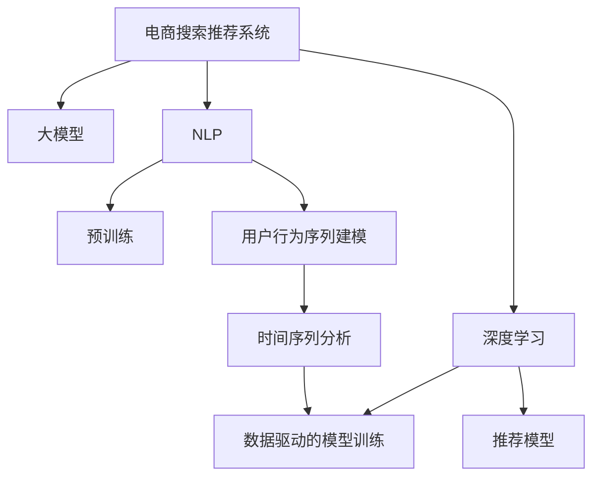

                 

# 电商搜索推荐中的AI大模型用户行为序列建模技术

> 关键词：电商搜索推荐, 用户行为序列建模, 大模型, 自然语言处理(NLP), 深度学习, 时间序列分析

## 1. 背景介绍

随着电商行业的迅猛发展，搜索推荐系统成为了电商平台的重要组成部分，其准确性和个性化程度直接影响着用户体验和销售额。传统的搜索推荐系统主要依赖于规则引擎、协同过滤、线性回归等技术，虽然能够提供基本的个性化推荐，但在数据复杂度提升和用户行为变化加快的今天，其效果已经难以满足日益增长的用户需求。

为了应对这些挑战，人工智能技术逐渐被引入到电商搜索推荐系统中，带来了搜索推荐领域的重大变革。基于深度学习的大模型，尤其是预训练语言模型(如BERT、GPT等)，在自然语言处理(NLP)和推荐系统领域都取得了显著的成果。这些模型通过在大规模文本数据上进行预训练，具备了强大的语义理解和生成能力，能够理解用户的搜索意图、浏览行为和购买历史，从而提供更加个性化的搜索结果和推荐内容。

近年来，电商搜索推荐系统中的大模型技术逐渐成熟，且在一些应用场景中表现出色。例如，通过在大规模商品描述和用户评论数据上进行预训练，模型能够准确捕捉用户搜索意图，预测其可能感兴趣的商品，从而提升搜索和推荐的精度和效率。

## 2. 核心概念与联系

### 2.1 核心概念概述

为了更好地理解电商搜索推荐系统中的AI大模型技术，本节将介绍几个关键概念：

- **电商搜索推荐系统**：一种根据用户行为和商品特征自动推荐商品给用户的系统，旨在提升用户体验和销售额。
- **大模型**：以自回归(如GPT)或自编码(如BERT)模型为代表的大规模预训练语言模型。通过在大规模无标签文本语料上进行预训练，学习通用的语言表示，具备强大的语言理解和生成能力。
- **自然语言处理(NLP)**：涉及计算机处理、理解、生成自然语言的技术，是电商搜索推荐系统的重要组成部分。
- **深度学习**：基于神经网络的学习框架，能够从数据中学习抽象特征，广泛应用于图像、语音、文本等领域。
- **时间序列分析**：研究时间序列数据的变化规律，用于预测和分析。在电商搜索推荐中，时间序列分析可帮助模型理解用户行为的时间规律。

这些核心概念之间的逻辑关系可以通过以下Mermaid流程图来展示：



这个流程图展示了大模型在电商搜索推荐系统中的核心概念及其之间的关系：

1. 电商搜索推荐系统通过大模型实现，大模型具备的自然语言处理能力使其能够理解用户查询和商品描述。
2. 自然语言处理通过深度学习模型进行预训练，进而进行用户行为序列建模。
3. 时间序列分析结合自然语言处理结果，优化推荐模型，提升推荐效果。

这些概念共同构成了电商搜索推荐系统的大模型应用框架，使其能够高效处理大量用户行为数据，提供个性化的搜索和推荐服务。

## 3. 核心算法原理 & 具体操作步骤
### 3.1 算法原理概述

电商搜索推荐系统中的大模型用户行为序列建模，本质上是一种时间序列预测任务。其核心思想是：利用深度学习模型，通过对历史用户行为数据的分析，预测用户未来的购买行为，从而提供个性化的商品推荐。

具体而言，假设电商平台用户的浏览历史、购买记录等行为数据为时间序列数据 $X = (x_1, x_2, \dots, x_n)$，其中 $x_i = (i, u_i, p_i)$ 分别表示第 $i$ 天的用户 $u_i$ 的浏览商品 $p_i$。目标是利用这些时间序列数据，预测用户未来的购买行为 $Y = (y_1, y_2, \dots, y_n)$，其中 $y_i = 1$ 表示用户购买了商品 $p_i$，$y_i = 0$ 表示用户未购买商品 $p_i$。

在建模时，通常采用以下步骤：

1. 数据预处理：将时间序列数据标准化，去除噪声。
2. 模型选择：选择适合时间序列预测的深度学习模型，如LSTM、GRU等。
3. 训练模型：利用历史数据对模型进行训练，调整模型参数。
4. 预测和评估：利用训练好的模型，对新数据进行预测，并通过评估指标（如准确率、召回率等）评估模型性能。
5. 优化调整：根据评估结果调整模型参数，迭代优化。

### 3.2 算法步骤详解

基于时间序列预测的大模型用户行为序列建模，一般包括以下关键步骤：

**Step 1: 数据预处理**

电商搜索推荐系统中的用户行为数据通常为时间序列数据，包含大量的无标签数据。需要对原始数据进行清洗和标准化，以提升后续模型的训练效果。常用的预处理方法包括：

1. 缺失值处理：对缺失值进行填充或删除，保持数据完整性。
2. 归一化：将数据缩放到0到1之间，便于模型训练。
3. 特征选择：选择对预测有意义的特征，减少维度。
4. 数据增强：通过数据变换、合成等方法，增加训练数据量。

**Step 2: 模型选择**

在大模型用户行为序列建模中，常用的深度学习模型包括LSTM、GRU、RNN等。这些模型能够处理序列数据，具备记忆功能，适合时间序列预测任务。

**Step 3: 模型训练**

模型的训练需要足够的训练数据和时间。可以使用GPU等高性能设备进行加速，优化训练过程。常见的训练目标函数包括均方误差损失函数（MSE）、交叉熵损失函数（CE）等。训练过程中，需要调整学习率、批大小等超参数，以获得最优的模型效果。

**Step 4: 模型评估**

模型训练完成后，需要进行评估，以检验其预测性能。评估方法包括留出法、交叉验证法等。常用的评估指标包括准确率、召回率、F1值等，以衡量模型的预测能力和鲁棒性。

**Step 5: 模型优化**

模型评估后，根据评估结果对模型进行优化调整，以提升其性能。常见的方法包括模型参数更新、超参数调整、模型结构优化等。

**Step 6: 模型应用**

最终训练好的模型可以应用到电商搜索推荐系统中，对用户的搜索请求和浏览记录进行分析，预测其未来的购买行为，提供个性化推荐。

### 3.3 算法优缺点

基于时间序列预测的大模型用户行为序列建模，具有以下优点：

1. 能够充分利用时间序列数据的特性，捕捉用户行为的时间规律。
2. 借助大模型的预训练能力，能够更好地理解自然语言描述，提升模型预测的准确性和可靠性。
3. 可以处理非结构化数据，适用于电商搜索推荐中的用户行为数据。
4. 能够进行实时预测，动态调整推荐内容，提高用户体验。

同时，该方法也存在一定的局限性：

1. 对标注数据的需求较高，训练过程可能需要大量标注数据。
2. 模型复杂度较高，训练和推理速度较慢。
3. 模型容易出现过拟合，尤其是在标注数据较少的情况下。
4. 对数据的噪声敏感，需要预先处理。
5. 需要较多计算资源，训练和部署成本较高。

尽管存在这些局限性，但就目前而言，基于时间序列预测的大模型用户行为序列建模，仍是目前电商搜索推荐系统中最为有效的方法之一。未来相关研究重点在于如何进一步降低对标注数据的依赖，提高模型的泛化能力和实时性，同时兼顾可解释性和伦理安全性等因素。

### 3.4 算法应用领域

基于时间序列预测的大模型用户行为序列建模，已经在电商搜索推荐系统中的应用得到了广泛验证。以下是几个典型的应用场景：

- **个性化推荐**：利用用户历史行为数据，预测用户未来可能感兴趣的商品，提供个性化推荐。
- **广告推荐**：根据用户搜索历史和点击记录，预测用户对广告的兴趣，推荐相关广告。
- **实时搜索**：对用户实时搜索请求进行分析，动态调整搜索结果，提升搜索体验。
- **客户行为预测**：分析客户行为数据，预测其购买意图，提前安排物流和库存。
- **异常检测**：检测用户行为序列中的异常行为，如欺诈行为、异常购买行为等。

此外，在金融、社交媒体、智能家居等多个领域，大模型用户行为序列建模技术也在逐步应用，为数据驱动的决策支持系统提供了新的技术手段。

## 4. 数学模型和公式 & 详细讲解  
### 4.1 数学模型构建

大模型用户行为序列建模的核心数学模型为递归神经网络（RNN）及其变种，如LSTM、GRU等。这些模型通过定义状态的演化规则，捕捉时间序列数据中的时间依赖关系。

以下以LSTM模型为例，描述其数学模型构建过程：

**LSTM模型**：

LSTM模型是一种经典的递归神经网络，具有长短期记忆功能，能够更好地处理长序列数据。其核心结构包括输入门、遗忘门和输出门，用于控制信息的输入、遗忘和输出。LSTM模型的数学表达式为：

$$
\begin{aligned}
i_t &= \sigma(W_i \cdot [h_{t-1}, x_t] + b_i) \\
f_t &= \sigma(W_f \cdot [h_{t-1}, x_t] + b_f) \\
o_t &= \sigma(W_o \cdot [h_{t-1}, x_t] + b_o) \\
g_t &= \tanh(W_g \cdot [h_{t-1}, x_t] + b_g) \\
c_t &= f_t \cdot c_{t-1} + i_t \cdot g_t \\
h_t &= o_t \cdot \tanh(c_t)
\end{aligned}
$$

其中：
- $i_t$、$f_t$、$o_t$ 为门函数，控制信息的输入、遗忘和输出。
- $g_t$ 为候选记忆单元。
- $c_t$ 为当前记忆单元。
- $h_t$ 为当前输出。

LSTM模型的训练目标是使模型预测的输出与真实标签尽可能接近，即最小化损失函数：

$$
\mathcal{L} = \frac{1}{N} \sum_{i=1}^{N} \ell(h_i, y_i)
$$

其中 $\ell$ 为损失函数，$N$ 为样本数。常用的损失函数包括均方误差损失函数（MSE）、交叉熵损失函数（CE）等。

### 4.2 公式推导过程

以下以均方误差损失函数（MSE）为例，描述LSTM模型的训练过程：

**MSE损失函数**：

MSE损失函数定义为：

$$
\ell(h_i, y_i) = \frac{1}{2}(h_i - y_i)^2
$$

其中 $h_i$ 为模型预测的输出，$y_i$ 为真实标签。

**训练过程**：

LSTM模型的训练过程为：

1. 初始化模型参数。
2. 将历史数据输入模型，计算预测输出。
3. 计算预测输出与真实标签之间的差值，计算损失函数。
4. 反向传播计算参数梯度，更新模型参数。
5. 重复步骤2-4，直到损失函数收敛或达到预设迭代次数。

训练过程中，需要调整超参数，如学习率、批大小等，以优化训练效果。

### 4.3 案例分析与讲解

**案例分析**：

某电商平台的搜索推荐系统，利用LSTM模型进行用户行为序列建模。平台收集了用户历史浏览记录、购买记录等数据，进行预处理和标准化后，输入到LSTM模型中进行训练。

**讲解**：

1. 数据预处理：对原始数据进行清洗、归一化、特征选择等处理，将数据标准化。
2. 模型选择：选择LSTM模型作为用户行为序列建模的深度学习模型。
3. 模型训练：利用历史数据对LSTM模型进行训练，调整模型参数，使其能够准确预测用户购买行为。
4. 模型评估：对训练好的模型进行评估，通过均方误差等指标衡量模型性能。
5. 模型优化：根据评估结果对模型进行优化调整，如调整学习率、批大小等。
6. 模型应用：将训练好的模型应用到电商搜索推荐系统中，对用户搜索请求和浏览记录进行分析，预测其购买行为，提供个性化推荐。

通过这个案例，可以看到LSTM模型在电商搜索推荐系统中的应用效果，展示了基于大模型的用户行为序列建模技术的强大能力。

## 5. 项目实践：代码实例和详细解释说明
### 5.1 开发环境搭建

在进行电商搜索推荐系统中的大模型用户行为序列建模时，需要搭建一个合适的开发环境。以下是使用Python进行PyTorch开发的环境配置流程：

1. 安装Anaconda：从官网下载并安装Anaconda，用于创建独立的Python环境。

2. 创建并激活虚拟环境：
```bash
conda create -n pytorch-env python=3.8 
conda activate pytorch-env
```

3. 安装PyTorch：根据CUDA版本，从官网获取对应的安装命令。例如：
```bash
conda install pytorch torchvision torchaudio cudatoolkit=11.1 -c pytorch -c conda-forge
```

4. 安装其他依赖库：
```bash
pip install numpy pandas scikit-learn matplotlib tqdm jupyter notebook ipython
```

完成上述步骤后，即可在`pytorch-env`环境中开始项目实践。

### 5.2 源代码详细实现

我们以LSTM模型为例，给出在PyTorch中实现电商搜索推荐系统中的大模型用户行为序列建模的代码实现。

首先，定义LSTM模型的类：

```python
import torch
import torch.nn as nn

class LSTMModel(nn.Module):
    def __init__(self, input_size, hidden_size, output_size):
        super(LSTMModel, self).__init__()
        self.hidden_size = hidden_size
        self.lstm = nn.LSTM(input_size, hidden_size, 1)
        self.fc = nn.Linear(hidden_size, output_size)
    
    def forward(self, x):
        h0 = torch.zeros(1, x.size(0), self.hidden_size).to(device)
        c0 = torch.zeros(1, x.size(0), self.hidden_size).to(device)
        
        out, _ = self.lstm(x, (h0, c0))
        out = self.fc(out[:, -1, :])
        return out
```

接着，定义数据预处理和模型训练函数：

```python
import torch.utils.data as Data
from torch.optim import Adam

def preprocess_data(data):
    # 数据清洗、归一化、特征选择等处理
    return processed_data

def train_model(model, train_data, test_data, learning_rate, batch_size, epochs):
    device = torch.device('cuda') if torch.cuda.is_available() else torch.device('cpu')
    model.to(device)
    
    optimizer = Adam(model.parameters(), lr=learning_rate)
    criterion = nn.MSELoss()
    
    for epoch in range(epochs):
        model.train()
        total_loss = 0
        
        for i, (inputs, labels) in enumerate(train_data):
            inputs, labels = inputs.to(device), labels.to(device)
            optimizer.zero_grad()
            outputs = model(inputs)
            loss = criterion(outputs, labels)
            loss.backward()
            optimizer.step()
            total_loss += loss.item()
            
        print(f'Epoch {epoch+1}, train loss: {total_loss/len(train_data)}')
        
    model.eval()
    total_loss = 0
    
    for i, (inputs, labels) in enumerate(test_data):
        inputs, labels = inputs.to(device), labels.to(device)
        outputs = model(inputs)
        loss = criterion(outputs, labels)
        total_loss += loss.item()
    
    print(f'Test loss: {total_loss/len(test_data)}')
```

最后，进行数据加载和模型训练：

```python
from torch.utils.data import DataLoader

# 加载数据
train_dataset = preprocess_data(train_data)
test_dataset = preprocess_data(test_data)
data_loader = DataLoader(train_dataset, batch_size=batch_size, shuffle=True)

# 训练模型
train_model(model, data_loader, test_data, learning_rate, batch_size, epochs)
```

以上就是使用PyTorch对LSTM模型进行电商搜索推荐系统中的用户行为序列建模的完整代码实现。可以看到，借助PyTorch的强大封装，代码实现变得简洁高效。

### 5.3 代码解读与分析

让我们再详细解读一下关键代码的实现细节：

**LSTMModel类**：
- `__init__`方法：初始化模型的输入大小、隐藏大小和输出大小。
- `forward`方法：定义模型的前向传播过程。

**train_model函数**：
- 数据加载和模型训练：利用DataLoader对数据进行批次化加载，对模型进行训练，调整学习率、批大小等超参数，优化模型性能。
- 模型评估：在测试集上对模型进行评估，输出测试损失。

**数据预处理**：
- 数据预处理函数`preprocess_data`：进行数据清洗、归一化、特征选择等处理，将数据标准化。

通过这个代码实现，可以看到LSTM模型在电商搜索推荐系统中的实际应用，展示了基于大模型的用户行为序列建模技术的实际效果。

## 6. 实际应用场景
### 6.1 智能推荐系统

基于大模型用户行为序列建模的智能推荐系统，已经在多个电商平台上得到了广泛应用。通过分析用户的历史浏览、购买等行为数据，模型能够预测用户未来的购买意愿，提供个性化的商品推荐。

具体而言，智能推荐系统通常包括以下几个关键步骤：

1. 数据收集：收集用户的历史行为数据，如浏览记录、购买记录等。
2. 数据预处理：对原始数据进行清洗、归一化、特征选择等处理，将数据标准化。
3. 模型训练：利用预处理后的数据对大模型进行训练，调整模型参数，使其能够准确预测用户购买行为。
4. 模型评估：对训练好的模型进行评估，通过准确率、召回率等指标衡量模型性能。
5. 模型优化：根据评估结果对模型进行优化调整，如调整学习率、批大小等。
6. 推荐应用：将训练好的模型应用到电商推荐系统中，对用户搜索请求和浏览记录进行分析，预测其购买行为，提供个性化推荐。

通过智能推荐系统，电商平台能够更好地理解用户需求，提升用户体验和销售额。

### 6.2 广告推荐

广告推荐是电商搜索推荐系统中的另一个重要应用。通过分析用户的历史行为数据，模型能够预测用户对广告的兴趣，推荐相关广告，提升广告点击率和转化率。

具体而言，广告推荐系统通常包括以下几个关键步骤：

1. 数据收集：收集用户的历史行为数据，如搜索记录、点击记录等。
2. 数据预处理：对原始数据进行清洗、归一化、特征选择等处理，将数据标准化。
3. 模型训练：利用预处理后的数据对大模型进行训练，调整模型参数，使其能够准确预测用户对广告的兴趣。
4. 模型评估：对训练好的模型进行评估，通过准确率、点击率等指标衡量模型性能。
5. 模型优化：根据评估结果对模型进行优化调整，如调整学习率、批大小等。
6. 广告推荐：将训练好的模型应用到广告推荐系统中，对用户搜索请求和浏览记录进行分析，推荐相关广告。

通过广告推荐系统，电商平台能够更精准地投放广告，提升广告效果，增加用户点击和购买行为。

### 6.3 实时搜索

实时搜索是电商搜索推荐系统中的另一重要应用。通过分析用户实时搜索请求，模型能够动态调整搜索结果，提升搜索体验。

具体而言，实时搜索系统通常包括以下几个关键步骤：

1. 数据收集：收集用户的实时搜索请求。
2. 数据预处理：对实时搜索请求进行预处理，去除噪声。
3. 模型训练：利用预处理后的数据对大模型进行训练，调整模型参数，使其能够准确预测用户搜索意图。
4. 模型评估：对训练好的模型进行评估，通过准确率、召回率等指标衡量模型性能。
5. 模型优化：根据评估结果对模型进行优化调整，如调整学习率、批大小等。
6. 实时搜索：将训练好的模型应用到实时搜索系统中，对用户实时搜索请求进行分析，预测其搜索意图，动态调整搜索结果。

通过实时搜索系统，电商平台能够更准确地理解用户搜索意图，提升搜索体验。

### 6.4 客户行为预测

客户行为预测是电商搜索推荐系统中的另一个重要应用。通过分析客户行为数据，模型能够预测其购买意图，提前安排物流和库存，提升用户体验和运营效率。

具体而言，客户行为预测系统通常包括以下几个关键步骤：

1. 数据收集：收集客户的浏览记录、购买记录等数据。
2. 数据预处理：对原始数据进行清洗、归一化、特征选择等处理，将数据标准化。
3. 模型训练：利用预处理后的数据对大模型进行训练，调整模型参数，使其能够准确预测客户购买意图。
4. 模型评估：对训练好的模型进行评估，通过准确率、召回率等指标衡量模型性能。
5. 模型优化：根据评估结果对模型进行优化调整，如调整学习率、批大小等。
6. 客户行为预测：将训练好的模型应用到客户行为预测系统中，对客户行为数据进行分析，预测其购买意图。

通过客户行为预测系统，电商平台能够更好地安排物流和库存，提升运营效率，降低运营成本。

## 7. 工具和资源推荐
### 7.1 学习资源推荐

为了帮助开发者系统掌握电商搜索推荐系统中的大模型用户行为序列建模技术，这里推荐一些优质的学习资源：

1. 《深度学习框架PyTorch》系列博文：由大模型技术专家撰写，深入浅出地介绍了PyTorch的使用方法和应用场景，适合初学者入门。
2. 《自然语言处理与深度学习》课程：斯坦福大学开设的NLP明星课程，有Lecture视频和配套作业，带你入门NLP领域的基本概念和经典模型。
3. 《深度学习与推荐系统》书籍：详细介绍了深度学习在推荐系统中的应用，涵盖了大模型用户行为序列建模等多个方向。
4. Weights & Biases：模型训练的实验跟踪工具，可以记录和可视化模型训练过程中的各项指标，方便对比和调优。与主流深度学习框架无缝集成。
5. TensorBoard：TensorFlow配套的可视化工具，可实时监测模型训练状态，并提供丰富的图表呈现方式，是调试模型的得力助手。

通过对这些资源的学习实践，相信你一定能够快速掌握电商搜索推荐系统中的大模型用户行为序列建模技术，并用于解决实际的电商推荐问题。
###  7.2 开发工具推荐

高效的开发离不开优秀的工具支持。以下是几款用于电商搜索推荐系统中的大模型用户行为序列建模开发的常用工具：

1. PyTorch：基于Python的开源深度学习框架，灵活动态的计算图，适合快速迭代研究。大部分预训练语言模型都有PyTorch版本的实现。
2. TensorFlow：由Google主导开发的开源深度学习框架，生产部署方便，适合大规模工程应用。同样有丰富的预训练语言模型资源。
3. Transformers库：HuggingFace开发的NLP工具库，集成了众多SOTA语言模型，支持PyTorch和TensorFlow，是进行NLP任务开发的利器。
4. Weights & Biases：模型训练的实验跟踪工具，可以记录和可视化模型训练过程中的各项指标，方便对比和调优。与主流深度学习框架无缝集成。
5. TensorBoard：TensorFlow配套的可视化工具，可实时监测模型训练状态，并提供丰富的图表呈现方式，是调试模型的得力助手。
6. Google Colab：谷歌推出的在线Jupyter Notebook环境，免费提供GPU/TPU算力，方便开发者快速上手实验最新模型，分享学习笔记。

合理利用这些工具，可以显著提升电商搜索推荐系统中的大模型用户行为序列建模任务的开发效率，加快创新迭代的步伐。

### 7.3 相关论文推荐

大模型用户行为序列建模技术的发展源于学界的持续研究。以下是几篇奠基性的相关论文，推荐阅读：

1. Long Short-Term Memory（LSTM论文）：提出了LSTM模型，在时间序列预测任务中取得了显著效果。
2. GRU：一种基于门控的递归神经网络，具有与LSTM类似的记忆功能，但在计算效率上略优于LSTM。
3. Attention Mechanism：一种用于解决LSTM计算效率低下的方法，通过引入注意力机制，使模型能够更好地处理长序列数据。
4. Transformer：一种基于自注意力机制的深度学习模型，在自然语言处理中取得了突破性进展。
5. BERT：一种预训练语言模型，通过掩码语言模型等自监督任务进行训练，在各种NLP任务中取得了SOTA。

这些论文代表了大模型用户行为序列建模技术的发展脉络。通过学习这些前沿成果，可以帮助研究者把握学科前进方向，激发更多的创新灵感。

## 8. 总结：未来发展趋势与挑战

### 8.1 总结

本文对电商搜索推荐系统中的大模型用户行为序列建模技术进行了全面系统的介绍。首先阐述了电商搜索推荐系统中的大模型技术背景，明确了其在提升用户体验和销售额方面的独特价值。其次，从原理到实践，详细讲解了时间序列预测的数学模型和关键步骤，给出了电商搜索推荐系统中的LSTM模型代码实现。同时，本文还广泛探讨了基于大模型用户行为序列建模技术的多个实际应用场景，展示了其在电商推荐系统中的强大能力。

通过本文的系统梳理，可以看到，基于时间序列预测的大模型用户行为序列建模技术在电商搜索推荐系统中已经得到了广泛验证。未来，伴随大模型的不断演进和预训练技术的发展，基于大模型的用户行为序列建模技术将进一步拓展应用范围，提升推荐系统的精度和效率。

### 8.2 未来发展趋势

展望未来，大模型用户行为序列建模技术将呈现以下几个发展趋势：

1. 模型规模持续增大。随着算力成本的下降和数据规模的扩张，预训练语言模型的参数量还将持续增长。超大规模语言模型蕴含的丰富语言知识，有望支撑更加复杂多变的推荐任务。
2. 微调技术日趋多样。除了传统的全参数微调外，未来会涌现更多参数高效的微调方法，如Adapter、Prompt-Tuning等，在节省计算资源的同时也能保证微调精度。
3. 深度学习范式扩展。未来的模型将更多采用Transformer等注意力机制，能够更好地处理长序列数据，提升推荐系统的性能。
4. 跨领域知识融合。未来的推荐系统将更多地融合跨领域知识，如知识图谱、逻辑规则等，增强推荐模型的知识表示能力。
5. 实时性提升。未来的推荐系统将更多地采用分布式计算、实时训练等技术，实现实时预测和动态调整。
6. 可解释性和安全性增强。未来的推荐系统将更多地引入可解释性技术和伦理安全机制，确保推荐模型的决策过程透明、公正。

以上趋势凸显了大模型用户行为序列建模技术的广阔前景。这些方向的探索发展，必将进一步提升电商推荐系统的精度和效率，为电商行业带来新的变革。

### 8.3 面临的挑战

尽管大模型用户行为序列建模技术已经取得了瞩目成就，但在迈向更加智能化、普适化应用的过程中，它仍面临着诸多挑战：

1. 数据分布变化：电商平台的运营数据随时在变化，模型需要不断更新才能保持其性能。
2. 数据隐私保护：电商平台需要保护用户数据隐私，避免数据泄露。
3. 模型复杂度高：大模型的训练和推理过程复杂，需要高性能计算资源。
4. 实时性要求高：电商平台需要实时响应用户请求，对模型的计算效率和响应速度要求高。
5. 可解释性不足：推荐模型的决策过程难以解释，难以进行调优和监控。
6. 安全性问题：模型容易受到恶意攻击，需要加强安全防护。

尽管存在这些挑战，但大模型用户行为序列建模技术仍然是大规模电商推荐系统中的重要技术手段。未来相关研究需要在以下几个方面寻求新的突破：

1. 数据高效处理：通过分布式计算、边缘计算等技术，提升数据处理效率，降低计算成本。
2. 模型压缩与优化：通过模型压缩、量化等技术，减少模型参数量，提升计算效率。
3. 多模态融合：将多模态数据（如文本、图片、视频等）与推荐模型结合，提升推荐效果。
4. 可解释性增强：引入可解释性技术，如LIME、SHAP等，提高推荐模型的透明性。
5. 安全性保障：引入安全机制，如对抗训练、加密等，确保推荐模型的安全性。

这些研究方向的探索，必将进一步提升大模型用户行为序列建模技术的精度和效率，使其在电商推荐系统中发挥更大的作用。

### 8.4 研究展望

未来的研究可以在以下几个方向上进行突破：

1. 融合因果推断和强化学习：引入因果推断和强化学习思想，提升推荐模型的决策质量，增加模型的稳定性和鲁棒性。
2. 引入外部知识库：将符号化的外部知识库与神经网络模型结合，增强推荐模型的知识表示能力。
3. 应用自适应学习：引入自适应学习机制，使模型能够动态调整参数，适应数据分布变化。
4. 优化模型训练和推理：引入模型蒸馏、知识蒸馏等技术，提升模型训练和推理效率，降低计算成本。
5. 提高推荐模型的可解释性和安全性：引入可解释性技术和安全机制，提高推荐模型的透明性和安全性。

通过这些研究方向的探索，相信大模型用户行为序列建模技术将进一步提升推荐系统的性能和应用范围，为电商行业带来新的突破。

## 9. 附录：常见问题与解答

**Q1：电商搜索推荐系统中的大模型用户行为序列建模与传统推荐系统的区别是什么？**

A: 电商搜索推荐系统中的大模型用户行为序列建模，利用深度学习模型对用户历史行为数据进行分析，预测用户未来的购买行为，提供个性化的商品推荐。相比传统推荐系统，其优势在于：
1. 能够更好地理解用户的真实需求，提供更加精准的推荐。
2. 能够处理长序列数据，捕捉用户行为的时间规律。
3. 能够动态调整推荐内容，提升用户体验。
4. 能够利用外部知识库，增强推荐模型的知识表示能力。
5. 能够进行实时预测，实现个性化推荐。

**Q2：大模型用户行为序列建模在电商搜索推荐系统中的训练和优化过程需要注意哪些问题？**

A: 大模型用户行为序列建模在电商搜索推荐系统中的训练和优化过程需要注意以下问题：
1. 数据预处理：需要对原始数据进行清洗、归一化、特征选择等处理，提升数据质量。
2. 模型选择：需要选择合适的深度学习模型，如LSTM、GRU等。
3. 超参数调整：需要调整学习率、批大小、迭代次数等超参数，优化模型效果。
4. 模型评估：需要选择合适的评估指标，如准确率、召回率等，评估模型性能。
5. 模型优化：需要根据评估结果调整模型参数，优化模型效果。
6. 模型部署：需要考虑模型的计算效率和响应速度，优化模型部署。

**Q3：电商搜索推荐系统中的大模型用户行为序列建模如何提高用户满意度？**

A: 电商搜索推荐系统中的大模型用户行为序列建模可以通过以下方式提高用户满意度：
1. 个性化推荐：利用用户历史行为数据，预测用户未来的购买意愿，提供个性化的商品推荐。
2. 实时搜索：分析用户实时搜索请求，动态调整搜索结果，提升搜索体验。
3. 广告推荐：根据用户搜索历史和点击记录，推荐相关广告，提升广告效果。
4. 客户行为预测：预测客户购买意图，提前安排物流和库存，提升用户体验和运营效率。
5. 实时反馈：收集用户反馈，动态调整推荐模型，提升推荐效果。

**Q4：电商搜索推荐系统中的大模型用户行为序列建模在开发过程中需要注意哪些问题？**

A: 电商搜索推荐系统中的大模型用户行为序列建模在开发过程中需要注意以下问题：
1. 数据隐私保护：需要保护用户数据隐私，避免数据泄露。
2. 模型复杂度高：大模型的训练和推理过程复杂，需要高性能计算资源。
3. 实时性要求高：电商平台需要实时响应用户请求，对模型的计算效率和响应速度要求高。
4. 模型可解释性：需要提高推荐模型的透明性，方便调优和监控。
5. 安全性保障：需要加强安全防护，确保推荐模型的安全性。

**Q5：大模型用户行为序列建模在电商搜索推荐系统中的未来应用方向是什么？**

A: 大模型用户行为序列建模在电商搜索推荐系统中的未来应用方向包括：
1. 跨领域知识融合：将符号化的外部知识库与神经网络模型结合，增强推荐模型的知识表示能力。
2. 融合因果推断和强化学习：引入因果推断和强化学习思想，提升推荐模型的决策质量，增加模型的稳定性和鲁棒性。
3. 应用自适应学习：引入自适应学习机制，使模型能够动态调整参数，适应数据分布变化。
4. 优化模型训练和推理：引入模型蒸馏、知识蒸馏等技术，提升模型训练和推理效率，降低计算成本。
5. 提高推荐模型的可解释性和安全性：引入可解释性技术和安全机制，提高推荐模型的透明性和安全性。

这些应用方向的研究，将进一步提升大模型用户行为序列建模技术的精度和效率，使其在电商推荐系统中发挥更大的作用。

