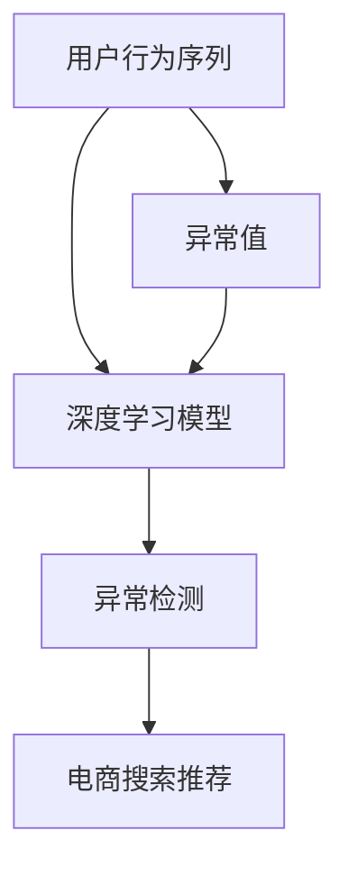

                 

## 1. 背景介绍

### 1.1 问题由来
在电商搜索推荐系统中，用户行为序列的异常检测是一个关键的环节，它直接影响推荐系统的效果和用户体验。异常用户行为可能包括点击行为异常、搜索意图转换异常、购买决策异常等。传统的异常检测方法如统计分析、规则匹配等，难以应对用户行为的复杂性和多样性，容易出现误判和漏判。

近年来，随着AI和大模型的不断发展，基于深度学习模型的异常检测技术逐渐崭露头角。其中，基于序列的深度学习模型，如LSTM、GRU等，由于能够捕捉到用户行为序列中的时间依赖性，已在电商搜索推荐系统中得到了广泛应用。

然而，现有的基于序列的深度学习模型主要关注行为序列的时间依赖性，而对于用户行为序列的异常检测，尤其是异常行为的定量刻画和分类，还需要进一步的研究和探索。

### 1.2 问题核心关键点
本项目旨在研究一种基于大模型的用户行为序列异常检测技术，旨在通过对用户行为序列的建模，检测异常行为，提升电商搜索推荐系统的效果和用户体验。

核心问题包括：
- 如何设计有效的用户行为序列表示？
- 如何训练能够识别异常行为的深度学习模型？
- 如何将模型应用于电商搜索推荐系统，提升推荐效果？

## 2. 核心概念与联系

### 2.1 核心概念概述

为更好地理解基于大模型的用户行为序列异常检测技术，本节将介绍几个密切相关的核心概念：

- 用户行为序列(User Behavior Sequence)：用户在电商平台的搜索、浏览、点击、购买等行为形成的序列，是电商搜索推荐系统的重要数据来源。

- 异常检测(Anomaly Detection)：通过建立模型对用户行为序列进行建模，检测出异常行为，帮助提升推荐效果和用户体验。

- 深度学习模型(Deep Learning Model)：包括卷积神经网络(CNN)、循环神经网络(RNN)、长短期记忆网络(LSTM)等，通过对大规模数据的学习，提取特征，并实现复杂的行为预测和分类。

- 异常值(Outlier)：用户行为序列中的异常行为，如点击行为异常、搜索意图转换异常、购买决策异常等。

- 大模型(Large Model)：如BERT、GPT、Transformer等，具有大规模参数量、丰富的语言知识和上下文理解能力，能够捕捉复杂的序列模式。

- 行为序列异常检测(Behavior Sequence Anomaly Detection)：通过建立大模型，对用户行为序列进行建模，检测出异常行为，提升推荐效果。

这些核心概念之间的逻辑关系可以通过以下Mermaid流程图来展示：



这个流程图展示了大模型的核心概念及其之间的关系：

1. 用户行为序列通过深度学习模型进行建模。
2. 模型输出能够识别异常值。
3. 异常值被用于电商搜索推荐系统，提升推荐效果。

## 3. 核心算法原理 & 具体操作步骤
### 3.1 算法原理概述

基于大模型的用户行为序列异常检测，本质上是一种有监督的序列分类问题。其核心思想是：将用户行为序列视为一种时间序列数据，使用大模型对其进行建模，并在此基础上识别异常值。

形式化地，假设用户行为序列为 $\{X_t\}_{t=1}^T$，其中 $X_t$ 为第 $t$ 个时刻的用户行为。定义 $Y_t$ 为 $X_t$ 是否为异常行为的二分类标签。则异常检测的任务可以表示为：

$$
\hat{Y} = \mathop{\arg\min}_{Y} \mathcal{L}(M_{\theta},\{X_t\}_{t=1}^T,Y)
$$

其中 $\mathcal{L}$ 为损失函数， $M_{\theta}$ 为预训练大模型的参数， $\theta$ 为模型参数。损失函数 $\mathcal{L}$ 通常使用交叉熵损失、均方误差损失等。

### 3.2 算法步骤详解

基于大模型的用户行为序列异常检测一般包括以下几个关键步骤：

**Step 1: 准备用户行为序列数据**
- 收集电商用户的历史行为数据，包括点击、浏览、购买等。
- 将行为数据按照时间顺序进行排序，形成用户行为序列。

**Step 2: 数据预处理和特征工程**
- 对原始行为序列进行缺失值处理、去重等预处理操作。
- 对行为序列进行特征工程，提取用户特征、行为特征、时间特征等。

**Step 3: 设计深度学习模型**
- 选择合适的深度学习模型，如LSTM、GRU、Transformer等。
- 定义模型结构，包括输入层、隐藏层、输出层等。

**Step 4: 训练异常检测模型**
- 将用户行为序列和异常标签作为训练数据，训练深度学习模型。
- 选择合适的优化算法及其参数，如AdamW、SGD等，设置学习率、批大小、迭代轮数等。
- 应用正则化技术，如L2正则、Dropout、Early Stopping等，防止模型过度适应小规模训练集。

**Step 5: 评估和应用**
- 在测试集上评估模型性能，通过准确率、召回率、F1-score等指标评估异常检测效果。
- 将模型应用于电商搜索推荐系统，实时检测异常用户行为，提升推荐效果。

### 3.3 算法优缺点

基于大模型的用户行为序列异常检测方法具有以下优点：
1. 精度高：大模型具有强大的序列建模能力，能够捕捉用户行为序列中的复杂模式。
2. 可解释性强：深度学习模型具有可解释性，能够对异常行为进行定量的刻画。
3. 可扩展性好：大模型可以很容易地扩展到不同领域和不同场景，具有广泛的适用性。

同时，该方法也存在一定的局限性：
1. 数据需求高：需要大量的标注数据，标注成本较高。
2. 训练复杂：大模型的训练过程复杂，计算资源消耗较大。
3. 过拟合风险：大模型容易过拟合，需要应用正则化技术进行优化。
4. 泛化能力有限：模型对于标注数据分布的差异敏感，泛化能力有限。

尽管存在这些局限性，但就目前而言，基于大模型的异常检测方法仍是大语言模型应用的一个重要范式。未来相关研究的重点在于如何进一步降低数据需求，提高模型的泛化能力，同时兼顾可解释性和鲁棒性等因素。

### 3.4 算法应用领域

基于大模型的用户行为序列异常检测方法，在电商搜索推荐系统中的应用主要体现在以下几个方面：

1. **点击行为异常检测**：检测用户的点击行为是否异常，帮助识别恶意点击、点击欺诈等行为。
2. **搜索意图转换异常检测**：检测用户的搜索意图是否发生异常，帮助识别虚假搜索、搜索欺诈等行为。
3. **购买决策异常检测**：检测用户的购买决策是否异常，帮助识别恶意订单、虚假购买等行为。
4. **用户流失预测**：通过行为序列异常检测，预测用户是否有可能流失，帮助提升用户留存率。
5. **行为分析与用户画像**：通过分析用户行为序列，建立用户画像，提升个性化推荐效果。

除了上述这些具体应用外，基于大模型的异常检测方法还可以应用于更多场景中，如网络安全、金融欺诈检测、物联网设备异常检测等，为相关领域提供新的技术手段。

## 4. 数学模型和公式 & 详细讲解  
### 4.1 数学模型构建

本节将使用数学语言对基于大模型的用户行为序列异常检测过程进行更加严格的刻画。

记用户行为序列为 $\{X_t\}_{t=1}^T$，其中 $X_t$ 为第 $t$ 个时刻的用户行为，定义异常标签 $Y_t$ 为 $X_t$ 是否为异常行为的二分类标签。异常检测的数学模型可以表示为：

$$
\mathcal{L}(\theta) = \frac{1}{N}\sum_{t=1}^N L(Y_t, \hat{Y}_t)
$$

其中 $L$ 为损失函数， $\hat{Y}_t$ 为模型预测的异常标签。常用的损失函数包括交叉熵损失、均方误差损失等。

### 4.2 公式推导过程

以下我们以LSTM模型为例，推导交叉熵损失函数及其梯度的计算公式。

假设用户行为序列为 $\{X_t\}_{t=1}^T$，其中 $X_t$ 为第 $t$ 个时刻的用户行为。定义异常标签 $Y_t$ 为 $X_t$ 是否为异常行为的二分类标签。异常检测的数学模型可以表示为：

$$
\mathcal{L}(\theta) = \frac{1}{N}\sum_{t=1}^N L(Y_t, \hat{Y}_t)
$$

其中 $L$ 为损失函数， $\hat{Y}_t$ 为模型预测的异常标签。常用的损失函数包括交叉熵损失、均方误差损失等。

在LSTM模型中，输入序列 $X_t$ 经过LSTM层后，得到隐藏状态 $h_t$。然后，通过全连接层对 $h_t$ 进行分类，输出预测结果 $\hat{Y}_t$。

定义交叉熵损失函数为：

$$
L(Y_t, \hat{Y}_t) = -Y_t \log(\hat{Y}_t) - (1-Y_t) \log(1-\hat{Y}_t)
$$

将 $L$ 代入 $\mathcal{L}$ 公式，得：

$$
\mathcal{L}(\theta) = \frac{1}{N}\sum_{t=1}^N [-Y_t \log(\hat{Y}_t) - (1-Y_t) \log(1-\hat{Y}_t)]
$$

在模型训练时，通过反向传播计算损失函数对模型参数 $\theta$ 的梯度，然后使用梯度下降等优化算法更新模型参数。

### 4.3 案例分析与讲解

假设用户行为序列为 $\{X_t\}_{t=1}^T$，其中 $X_t$ 为第 $t$ 个时刻的用户行为，定义异常标签 $Y_t$ 为 $X_t$ 是否为异常行为的二分类标签。异常检测的数学模型可以表示为：

$$
\mathcal{L}(\theta) = \frac{1}{N}\sum_{t=1}^N [-Y_t \log(\hat{Y}_t) - (1-Y_t) \log(1-\hat{Y}_t)]
$$

在LSTM模型中，输入序列 $X_t$ 经过LSTM层后，得到隐藏状态 $h_t$。然后，通过全连接层对 $h_t$ 进行分类，输出预测结果 $\hat{Y}_t$。

假设模型已经训练完成，使用交叉熵损失函数 $L(Y_t, \hat{Y}_t)$ 计算预测结果与真实标签之间的差异。然后，使用梯度下降等优化算法，反向传播计算损失函数对模型参数 $\theta$ 的梯度，并更新模型参数。

## 5. 项目实践：代码实例和详细解释说明
### 5.1 开发环境搭建

在进行项目实践前，我们需要准备好开发环境。以下是使用Python进行PyTorch开发的环境配置流程：

1. 安装Anaconda：从官网下载并安装Anaconda，用于创建独立的Python环境。

2. 创建并激活虚拟环境：
```bash
conda create -n pytorch-env python=3.8 
conda activate pytorch-env
```

3. 安装PyTorch：根据CUDA版本，从官网获取对应的安装命令。例如：
```bash
conda install pytorch torchvision torchaudio cudatoolkit=11.1 -c pytorch -c conda-forge
```

4. 安装PyTorch Lightning：
```bash
pip install pytorch-lightning
```

5. 安装其他依赖库：
```bash
pip install numpy pandas torch sklearn huggingface_hub
```

完成上述步骤后，即可在`pytorch-env`环境中开始项目实践。

### 5.2 源代码详细实现

我们先介绍一个LSTM模型的源代码实现，并详细解释其结构。

```python
import torch
import torch.nn as nn
import torch.optim as optim
from torch.utils.data import DataLoader
from torch.utils.tensorboard import SummaryWriter

class LSTM(nn.Module):
    def __init__(self, input_size, hidden_size, output_size):
        super(LSTM, self).__init__()
        self.hidden_size = hidden_size
        self.lstm = nn.LSTM(input_size, hidden_size, 1, batch_first=True)
        self.fc = nn.Linear(hidden_size, output_size)

    def forward(self, x):
        h0 = torch.zeros(1, x.size(0), self.hidden_size).to(x.device)
        c0 = torch.zeros(1, x.size(0), self.hidden_size).to(x.device)
        out, _ = self.lstm(x, (h0, c0))
        out = self.fc(out[:, -1, :])
        return out

# 定义损失函数和优化器
criterion = nn.BCEWithLogitsLoss()
optimizer = optim.Adam(model.parameters(), lr=0.001)

# 训练模型
def train_model(model, dataloader, epochs):
    writer = SummaryWriter()
    for epoch in range(epochs):
        for batch_idx, (data, target) in enumerate(dataloader):
            data, target = data.to(device), target.to(device)
            optimizer.zero_grad()
            output = model(data)
            loss = criterion(output, target)
            writer.add_scalar('Loss/train', loss.item(), epoch)
            loss.backward()
            optimizer.step()

# 测试模型
def test_model(model, dataloader):
    writer = SummaryWriter()
    total_correct = 0
    total_samples = 0
    with torch.no_grad():
        for data, target in dataloader:
            data, target = data.to(device), target.to(device)
            output = model(data)
            _, predicted = torch.max(output, 1)
            total_correct += (predicted == target).sum().item()
            total_samples += target.size(0)
    accuracy = total_correct / total_samples
    writer.add_scalar('Accuracy/test', accuracy, 0)
    return accuracy
```

以上是一个简单的LSTM模型，包含三个主要的组成部分：

1. 输入层：将输入序列 $X_t$ 转换为一维向量，通过LSTM层的处理，得到隐藏状态 $h_t$。
2. 隐藏层：通过全连接层对 $h_t$ 进行分类，输出预测结果 $\hat{Y}_t$。
3. 输出层：将预测结果 $\hat{Y}_t$ 映射到0-1之间的概率值。

在模型训练时，使用交叉熵损失函数 $L(Y_t, \hat{Y}_t)$ 计算预测结果与真实标签之间的差异。然后，使用梯度下降等优化算法，反向传播计算损失函数对模型参数 $\theta$ 的梯度，并更新模型参数。

### 5.3 代码解读与分析

让我们再详细解读一下关键代码的实现细节：

**LSTM类**：
- `__init__`方法：初始化LSTM模型，包括LSTM层和全连接层。
- `forward`方法：定义模型前向传播的过程。

**训练模型函数**：
- 使用TensorBoard对模型训练过程中的损失进行可视化，帮助分析模型训练情况。
- 使用梯度下降等优化算法，反向传播计算损失函数对模型参数 $\theta$ 的梯度，并更新模型参数。

**测试模型函数**：
- 使用TensorBoard对模型测试过程中的准确率进行可视化，帮助分析模型效果。
- 在测试集上计算模型预测结果与真实标签之间的差异，输出准确率。

**训练和测试流程**：
- 在模型训练时，通过反向传播计算损失函数对模型参数 $\theta$ 的梯度，并使用梯度下降等优化算法更新模型参数。
- 在模型测试时，计算模型预测结果与真实标签之间的差异，输出准确率。

## 6. 实际应用场景
### 6.1 智能客服系统

基于大模型的用户行为序列异常检测，可以应用于智能客服系统的构建。传统客服往往需要配备大量人力，高峰期响应缓慢，且一致性和专业性难以保证。而使用异常检测技术，可以实时监控用户行为序列，检测出异常行为，及时介入，提高客服响应效率和质量。

在技术实现上，可以收集企业内部的历史客服对话记录，将问题和最佳答复构建成监督数据，在此基础上对预训练模型进行微调。微调后的模型能够自动理解用户意图，检测出异常行为，如恶意点击、虚假搜索等，自动提醒客服进行人工处理，从而提升客服系统的智能化水平。

### 6.2 金融舆情监测

金融机构需要实时监测市场舆论动向，以便及时应对负面信息传播，规避金融风险。传统的人工监测方式成本高、效率低，难以应对网络时代海量信息爆发的挑战。基于大模型的用户行为序列异常检测技术，为金融舆情监测提供了新的解决方案。

具体而言，可以收集金融领域相关的新闻、报道、评论等文本数据，并对其进行主题标注和情感标注。在此基础上对预训练语言模型进行微调，使其能够自动判断文本属于何种主题，情感倾向是正面、中性还是负面。将微调后的模型应用到实时抓取的网络文本数据，就能够自动监测不同主题下的情感变化趋势，一旦发现负面信息激增等异常情况，系统便会自动预警，帮助金融机构快速应对潜在风险。

### 6.3 个性化推荐系统

当前的推荐系统往往只依赖用户的历史行为数据进行物品推荐，无法深入理解用户的真实兴趣偏好。基于大模型的用户行为序列异常检测技术，可以更好地挖掘用户行为序列中的复杂模式，从而提升推荐系统的智能化水平。

在实践中，可以收集用户浏览、点击、评论、分享等行为数据，提取和用户交互的物品标题、描述、标签等文本内容。将文本内容作为模型输入，用户的后续行为（如是否点击、购买等）作为监督信号，在此基础上微调预训练语言模型。微调后的模型能够从文本内容中准确把握用户的兴趣点，检测出异常行为，如恶意订单、虚假购买等，提升推荐系统的准确性和安全性。

### 6.4 未来应用展望

随着大模型和异常检测技术的不断发展，基于用户行为序列的异常检测方法将在更多领域得到应用，为传统行业带来变革性影响。

在智慧医疗领域，基于异常检测的医疗问答、病历分析、药物研发等应用将提升医疗服务的智能化水平，辅助医生诊疗，加速新药开发进程。

在智能教育领域，微调技术可应用于作业批改、学情分析、知识推荐等方面，因材施教，促进教育公平，提高教学质量。

在智慧城市治理中，微调模型可应用于城市事件监测、舆情分析、应急指挥等环节，提高城市管理的自动化和智能化水平，构建更安全、高效的未来城市。

此外，在企业生产、社会治理、文娱传媒等众多领域，基于大模型用户行为序列异常检测的应用也将不断涌现，为NLP技术带来全新的突破。相信随着技术的日益成熟，异常检测方法将成为NLP落地应用的重要范式，推动NLP技术的产业化进程。

## 7. 工具和资源推荐
### 7.1 学习资源推荐

为了帮助开发者系统掌握大模型用户行为序列异常检测的理论基础和实践技巧，这里推荐一些优质的学习资源：

1. 《深度学习基础》：由斯坦福大学Andrew Ng教授开设的深度学习入门课程，介绍了深度学习的基本概念和常见模型。

2. 《自然语言处理与深度学习》：Linda Zheng等著，介绍了自然语言处理和深度学习技术，涵盖了NLP中的常用模型和应用。

3. 《深度学习与TensorFlow》：由Google资深工程师Alex Graves和Mario Winatakas等编著，详细介绍了TensorFlow的使用方法和深度学习模型的实现。

4. PyTorch官方文档：提供了PyTorch的详细使用方法和常见模型实现，是学习和实践大模型的必备资料。

5. Weights & Biases官方文档：提供了模型训练的实验跟踪工具的使用方法，支持多种深度学习框架。

6. GitHub上的深度学习项目：如TensorFlow、PyTorch、Keras等，提供了大量经典模型的实现和教程。

通过对这些资源的学习实践，相信你一定能够快速掌握大模型用户行为序列异常检测的精髓，并用于解决实际的NLP问题。

### 7.2 开发工具推荐

高效的开发离不开优秀的工具支持。以下是几款用于大模型用户行为序列异常检测开发的常用工具：

1. PyTorch：基于Python的开源深度学习框架，灵活动态的计算图，适合快速迭代研究。

2. TensorFlow：由Google主导开发的开源深度学习框架，生产部署方便，适合大规模工程应用。

3. Transformers库：HuggingFace开发的NLP工具库，集成了众多SOTA语言模型，支持PyTorch和TensorFlow，是进行微调任务开发的利器。

4. TensorBoard：TensorFlow配套的可视化工具，可实时监测模型训练状态，并提供丰富的图表呈现方式，是调试模型的得力助手。

5. PyTorch Lightning：提供了更简洁的API，支持模型分布式训练，适合快速搭建和调试深度学习模型。

6. Jupyter Notebook：Python的轻量级交互式环境，支持实时执行代码和展示结果，是数据科学和机器学习研究的常用工具。

合理利用这些工具，可以显著提升大模型用户行为序列异常检测任务的开发效率，加快创新迭代的步伐。

### 7.3 相关论文推荐

大模型和异常检测技术的发展源于学界的持续研究。以下是几篇奠基性的相关论文，推荐阅读：

1. Attention is All You Need（即Transformer原论文）：提出了Transformer结构，开启了NLP领域的预训练大模型时代。

2. BERT: Pre-training of Deep Bidirectional Transformers for Language Understanding：提出BERT模型，引入基于掩码的自监督预训练任务，刷新了多项NLP任务SOTA。

3. Large-Scale Training of Language Models for Arbitrary Orders：提出通过堆叠多个小规模模型进行预训练，提升大模型的泛化能力。

4. A survey of deep learning based anomaly detection methods：总结了深度学习在异常检测中的应用，介绍了各种深度学习模型的优缺点和应用场景。

5. Multi-Modal Anomaly Detection with LSTM-CNN: A Comparative Study: 提出了多模态异常检测方法，融合了图像、语音、文本等多种数据源，提升了异常检测的准确性。

这些论文代表了大模型用户行为序列异常检测技术的发展脉络。通过学习这些前沿成果，可以帮助研究者把握学科前进方向，激发更多的创新灵感。

## 8. 总结：未来发展趋势与挑战

### 8.1 总结

本文对基于大模型的用户行为序列异常检测方法进行了全面系统的介绍。首先阐述了大模型和异常检测技术的研究背景和意义，明确了异常检测在电商搜索推荐系统中的重要价值。其次，从原理到实践，详细讲解了用户行为序列异常检测的数学模型和关键步骤，给出了用户行为序列异常检测的完整代码实例。同时，本文还广泛探讨了异常检测方法在电商搜索推荐系统中的应用前景，展示了异常检测范式的巨大潜力。

通过本文的系统梳理，可以看到，基于大模型的异常检测方法正在成为NLP领域的重要范式，极大地拓展了用户行为序列建模的应用边界，催生了更多的落地场景。受益于大规模语料的预训练和深度学习模型的强大建模能力，异常检测模型能够捕捉复杂的用户行为模式，检测出异常行为，提升推荐系统的性能和用户体验。未来，伴随异常检测方法的不断演进，用户行为序列建模技术必将在更多领域得到应用，为人工智能技术的发展注入新的动力。

### 8.2 未来发展趋势

展望未来，大模型用户行为序列异常检测技术将呈现以下几个发展趋势：

1. 模型规模持续增大。随着算力成本的下降和数据规模的扩张，预训练大模型的参数量还将持续增长。超大规模大模型蕴含的丰富语言知识和上下文理解能力，有望进一步提升异常检测的准确性和泛化能力。

2. 模型复杂度提升。未来的深度学习模型将更加复杂，能够处理更加复杂和多样化的用户行为序列。融合多模态信息，提升异常检测的准确性和鲁棒性。

3. 模型训练效率提高。随着训练技术和优化算法的不断进步，大模型的训练时间将大幅缩短，异常检测方法的开发周期将显著缩短。

4. 模型应用范围拓展。异常检测方法将在更多领域得到应用，如金融、医疗、物流等，为这些领域带来新的技术手段和应用场景。

5. 实时性和可解释性提升。未来的异常检测模型将能够实时处理用户行为序列，同时具备更好的可解释性，便于人工审核和干预。

以上趋势凸显了大模型用户行为序列异常检测技术的广阔前景。这些方向的探索发展，必将进一步提升异常检测模型的性能和应用范围，为构建安全、可靠、智能的电商搜索推荐系统铺平道路。

### 8.3 面临的挑战

尽管大模型用户行为序列异常检测技术已经取得了瞩目成就，但在迈向更加智能化、普适化应用的过程中，它仍面临着诸多挑战：

1. 数据需求高：异常检测模型需要大量的标注数据，标注成本较高。如何降低数据需求，提高模型鲁棒性，将是未来的重要研究方向。

2. 训练复杂度高：大模型的训练过程复杂，计算资源消耗较大。如何提高模型训练效率，降低资源消耗，将是未来的重要研究方向。

3. 模型过拟合风险：大模型容易过拟合，需要应用正则化技术进行优化。如何提高模型的泛化能力，防止过拟合，将是未来的重要研究方向。

4. 模型可解释性不足：异常检测模型通常缺乏可解释性，难以解释其内部工作机制和决策逻辑。如何增强模型的可解释性，提高用户信任度，将是未来的重要研究方向。

5. 模型安全性问题：异常检测模型可能受到恶意攻击，导致模型输出错误，甚至产生安全隐患。如何提高模型的安全性，保障数据和模型安全，将是未来的重要研究方向。

6. 模型应用范围受限：异常检测模型在特定领域和场景下的应用效果有限，难以广泛推广。如何提高模型的可扩展性和通用性，将是未来的重要研究方向。

这些挑战需要学界和产业界共同努力，才能逐步克服。相信随着技术的发展和应用的深入，这些挑战终将一一被克服，大模型用户行为序列异常检测技术必将走向成熟。

### 8.4 研究展望

面对大模型用户行为序列异常检测技术面临的诸多挑战，未来的研究需要在以下几个方面寻求新的突破：

1. 探索无监督和半监督异常检测方法。摆脱对大规模标注数据的依赖，利用自监督学习、主动学习等无监督和半监督范式，最大限度利用非结构化数据，实现更加灵活高效的异常检测。

2. 研究参数高效和计算高效的异常检测范式。开发更加参数高效的异常检测方法，在固定大部分预训练参数的情况下，只更新极少量的任务相关参数。同时优化异常检测模型的计算图，减少前向传播和反向传播的资源消耗，实现更加轻量级、实时性的部署。

3. 融合因果和对比学习范式。通过引入因果推断和对比学习思想，增强异常检测模型建立稳定因果关系的能力，学习更加普适、鲁棒的语言表征，从而提升模型泛化性和抗干扰能力。

4. 引入更多先验知识。将符号化的先验知识，如知识图谱、逻辑规则等，与神经网络模型进行巧妙融合，引导异常检测过程学习更准确、合理的语言模型。同时加强不同模态数据的整合，实现视觉、语音等多模态信息与文本信息的协同建模。

5. 结合因果分析和博弈论工具。将因果分析方法引入异常检测模型，识别出模型决策的关键特征，增强输出解释的因果性和逻辑性。借助博弈论工具刻画人机交互过程，主动探索并规避模型的脆弱点，提高系统稳定性。

6. 纳入伦理道德约束。在模型训练目标中引入伦理导向的评估指标，过滤和惩罚有偏见、有害的输出倾向。同时加强人工干预和审核，建立模型行为的监管机制，确保输出符合人类价值观和伦理道德。

这些研究方向的探索，必将引领大模型用户行为序列异常检测技术迈向更高的台阶，为构建安全、可靠、智能的电商搜索推荐系统铺平道路。面向未来，大模型用户行为序列异常检测技术还需要与其他人工智能技术进行更深入的融合，如知识表示、因果推理、强化学习等，多路径协同发力，共同推动自然语言理解和智能交互系统的进步。只有勇于创新、敢于突破，才能不断拓展语言模型的边界，让智能技术更好地造福人类社会。

## 9. 附录：常见问题与解答

**Q1：大模型用户行为序列异常检测是否适用于所有NLP任务？**

A: 大模型用户行为序列异常检测在大多数NLP任务上都能取得不错的效果，特别是对于数据量较小的任务。但对于一些特定领域的任务，如医学、法律等，仅仅依靠通用语料预训练的模型可能难以很好地适应。此时需要在特定领域语料上进一步预训练，再进行微调，才能获得理想效果。此外，对于一些需要时效性、个性化很强的任务，如对话、推荐等，微调方法也需要针对性的改进优化。

**Q2：异常检测模型如何避免过拟合？**

A: 异常检测模型容易过拟合，需要应用正则化技术进行优化。常见的正则化技术包括L2正则、Dropout、Early Stopping等，可以有效防止模型过度适应小规模训练集。此外，可以使用数据增强技术，通过回译、近义替换等方式扩充训练集，提升模型的泛化能力。

**Q3：异常检测模型在实际应用中需要注意哪些问题？**

A: 将异常检测模型转化为实际应用，还需要考虑以下因素：
1. 模型裁剪：去除不必要的层和参数，减小模型尺寸，加快推理速度。
2. 量化加速：将浮点模型转为定点模型，压缩存储空间，提高计算效率。
3. 服务化封装：将模型封装为标准化服务接口，便于集成调用。
4. 弹性伸缩：根据请求流量动态调整资源配置，平衡服务质量和成本。
5. 监控告警：实时采集系统指标，设置异常告警阈值，确保服务稳定性。
6. 安全防护：采用访问鉴权、数据脱敏等措施，保障数据和模型安全。

大模型用户行为序列异常检测为NLP应用开启了广阔的想象空间，但如何将强大的性能转化为稳定、高效、安全的业务价值，还需要工程实践的不断打磨。唯有从数据、算法、工程、业务等多个维度协同发力，才能真正实现人工智能技术在垂直行业的规模化落地。总之，异常检测需要开发者根据具体任务，不断迭代和优化模型、数据和算法，方能得到理想的效果。

---

作者：禅与计算机程序设计艺术 / Zen and the Art of Computer Programming

