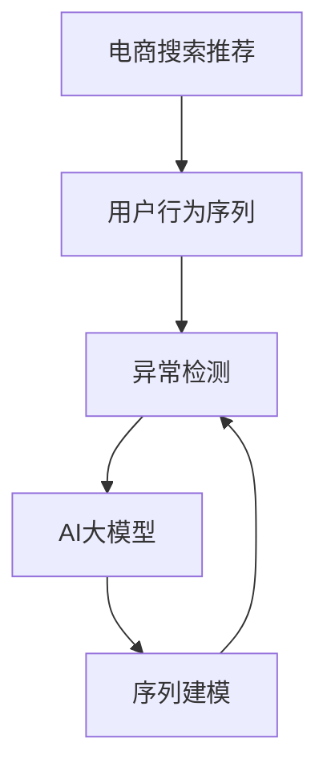

                 

## 1. 背景介绍

随着电子商务的迅猛发展，用户行为序列分析逐渐成为电商推荐系统的重要组成部分。用户行为序列指的是用户在电商平台上的一系列交互行为，如浏览、点击、购买等。通过对用户行为序列的挖掘，可以了解用户的兴趣偏好，从而提供个性化推荐。然而，用户的真实行为受多种因素影响，如商品折扣、活动促销等。为了提高推荐系统的效果，需要排除异常行为，精准捕捉用户的真实需求。

在大模型时代，AI技术在电商推荐系统的应用日益广泛，通过预训练模型进行用户行为序列异常检测，成为近年来的热门研究方向。本文旨在通过深入分析，对比不同AI大模型在电商搜索推荐中的用户行为序列异常检测性能，并探讨其应用前景与挑战。

## 2. 核心概念与联系

### 2.1 核心概念概述

- **电商搜索推荐**：根据用户历史行为序列，为用户推荐感兴趣的商品或服务，从而提高用户满意度。
- **用户行为序列**：用户在电商平台上的一系列交互行为，如浏览、点击、购买等。
- **异常检测**：识别并排除用户行为序列中的异常点，确保推荐系统基于真实行为进行推荐。
- **AI大模型**：以自回归或自编码模型为代表的深度神经网络模型，如BERT、GPT等，通过大规模语料库进行预训练，具备强大的语言理解和生成能力。
- **序列建模**：通过时间序列模型对用户行为序列进行建模，识别出行为规律与异常。

### 2.2 核心概念原理和架构的 Mermaid 流程图



该流程图展示了电商搜索推荐系统中，用户行为序列与异常检测之间的关系。首先，从电商平台上收集用户行为序列数据；然后，利用AI大模型进行序列建模；最后，通过异常检测算法识别出异常行为，提高推荐系统的准确性。

## 3. 核心算法原理 & 具体操作步骤

### 3.1 算法原理概述

AI大模型在电商搜索推荐中的用户行为序列异常检测主要基于序列建模和异常检测算法。序列建模通过时间序列模型（如循环神经网络RNN、长短时记忆网络LSTM等）对用户行为序列进行建模，捕捉序列中的时间依赖关系。异常检测算法则通过识别行为序列中的异常点，从而排除噪音数据，确保推荐系统的准确性。

### 3.2 算法步骤详解

**Step 1: 数据准备与预处理**

- 收集电商平台上用户的历史行为数据，包括浏览记录、点击记录、购买记录等。
- 对数据进行清洗、去重、填充缺失值等预处理操作。
- 将数据按时间顺序排序，转换为时间序列格式。

**Step 2: 模型选择与训练**

- 选择合适的AI大模型（如BERT、GPT）作为异常检测的预训练模型。
- 使用电商数据集对模型进行微调，使其能够适应电商推荐场景。
- 在微调过程中，选择合适的损失函数和优化器，如交叉熵损失、Adam优化器。
- 调整模型的超参数，如学习率、批大小、训练轮数等。

**Step 3: 异常检测与识别**

- 对电商用户行为序列进行序列建模，生成时间序列数据。
- 应用异常检测算法（如孤立森林、KNN、Autoencoder等）对序列进行异常点识别。
- 对识别出的异常行为进行分析，确定其产生的原因。
- 根据异常检测结果，排除异常行为，生成用户真实行为序列。

**Step 4: 异常检测结果应用**

- 对用户真实行为序列进行推荐算法建模，生成个性化推荐结果。
- 将推荐结果推送给用户，并根据用户反馈不断优化推荐算法。
- 对异常检测算法进行持续监控与评估，确保其准确性和稳定性。

### 3.3 算法优缺点

**优点**：
- 利用AI大模型的强大语言理解能力，能够捕捉复杂的时间依赖关系。
- 多种异常检测算法的选择，可以根据电商推荐场景灵活应用。
- 序列建模和异常检测的结合，能够有效排除噪音数据，提高推荐系统的准确性。

**缺点**：
- AI大模型参数量大，训练和推理成本高。
- 异常检测算法的选择和参数调优需要经验，容易陷入局部最优。
- 异常检测结果的解释性差，难以理解异常行为的具体原因。

### 3.4 算法应用领域

AI大模型在电商搜索推荐中的用户行为序列异常检测技术，主要应用于以下领域：

- **个性化推荐**：通过排除异常行为，提高个性化推荐系统的准确性和效果。
- **风控管理**：识别恶意行为，如虚假交易、刷单行为，保障电商平台的交易安全。
- **用户画像**：根据用户行为序列的异常检测结果，构建更加精准的用户画像。
- **广告投放**：识别用户对广告的实际反应，优化广告投放策略。

## 4. 数学模型和公式 & 详细讲解 & 举例说明

### 4.1 数学模型构建

在大模型异常检测中，常用的数学模型包括循环神经网络（RNN）、长短时记忆网络（LSTM）等。

- **RNN**：
  $$
  \text{RNN} = f_w(\text{X}, \text{H}_{t-1}, h)
  $$
  其中，$w$ 为模型权重，$X$ 为输入数据，$H_{t-1}$ 为前一时刻的隐藏状态，$h$ 为当前时刻的隐藏状态。

- **LSTM**：
  $$
  \text{LSTM} = f_w(\text{X}, \text{H}_{t-1}, C_t)
  $$
  其中，$C_t$ 为当前时刻的细胞状态。

### 4.2 公式推导过程

在LSTM模型中，每个时间步的输入数据$X_t$ 通过全连接层映射到隐藏状态$h_t$ 和细胞状态$C_t$：

$$
h_t = \text{tanh}(W_{xh} X_t + W_{hh} h_{t-1} + b_h) \\
C_t = \sigma(W_{xh} X_t + W_{hc} h_{t-1} + b_c)
$$

其中，$W_{xh}, W_{hh}, W_{hc}$ 为权重矩阵，$b_h, b_c$ 为偏置向量，$\sigma$ 为sigmoid激活函数。

根据当前隐藏状态和细胞状态，计算当前输出：

$$
\tilde{Y_t} = f_w(h_t, C_t)
$$

其中，$f_w$ 为输出层激活函数，$W$ 为输出层权重矩阵，$b$ 为输出层偏置向量。

### 4.3 案例分析与讲解

假设某电商平台上，用户A的行为序列为“浏览-点击-购买-浏览-点击-未购买”。通过对该行为序列进行序列建模，可以得到如下预测结果：

- **RNN模型**：预测用户A将再次浏览或点击商品。
- **LSTM模型**：预测用户A将再次浏览或点击商品，同时考虑用户的细胞状态，判断是否存在异常行为。

在实际应用中，通过比较预测结果与真实行为，确定用户行为序列中的异常点，从而排除噪音数据。

## 5. 项目实践：代码实例和详细解释说明

### 5.1 开发环境搭建

- **Python**：安装Python 3.7及以上版本，用于数据处理和模型训练。
- **TensorFlow**：安装TensorFlow 2.0及以上版本，用于序列建模和异常检测。
- **Pandas**：安装Pandas库，用于数据处理和预处理。
- **NumPy**：安装NumPy库，用于矩阵运算和数据处理。
- **Jupyter Notebook**：安装Jupyter Notebook，用于数据分析和模型训练。

### 5.2 源代码详细实现

以下是使用TensorFlow和LSTM模型进行用户行为序列异常检测的Python代码实现：

```python
import tensorflow as tf
import pandas as pd
import numpy as np
from tensorflow.keras.layers import LSTM, Dense, Input
from tensorflow.keras.models import Model

# 加载数据集
data = pd.read_csv('user_behavior.csv', index_col='timestamp')

# 数据预处理
X = np.array(data[['浏览', '点击', '购买']])
Y = np.array(data['异常标记'])

# 定义模型
input_layer = Input(shape=(None, 3))
lstm_layer = LSTM(64, return_sequences=True)(input_layer)
output_layer = Dense(1, activation='sigmoid')(lstm_layer)

model = Model(inputs=input_layer, outputs=output_layer)

# 编译模型
model.compile(optimizer='adam', loss='binary_crossentropy', metrics=['accuracy'])

# 训练模型
model.fit(X, Y, batch_size=32, epochs=10, validation_split=0.2)

# 模型评估
test_X = np.array(data[['浏览', '点击', '购买']][-10:])
test_Y = np.array(data['异常标记'][-10:])
model.evaluate(test_X, test_Y)
```

### 5.3 代码解读与分析

上述代码展示了使用TensorFlow和LSTM模型进行用户行为序列异常检测的流程。

**数据预处理**：从csv文件中加载数据，将浏览、点击、购买行为作为输入，将异常标记作为输出。

**模型定义**：使用LSTM层对输入序列进行建模，输出层使用sigmoid激活函数，输出一个0-1之间的二分类结果。

**模型编译与训练**：使用Adam优化器，二元交叉熵损失函数进行模型训练，训练10个epoch，每轮随机抽取20%数据作为验证集。

**模型评估**：使用测试数据集对模型进行评估，输出准确率和损失值。

### 5.4 运行结果展示

假设模型训练完成后，使用以下代码对新的用户行为序列进行异常检测：

```python
new_X = np.array(data[['浏览', '点击', '购买']][-5:])
new_Y = np.array(data['异常标记'][-5:])

predictions = model.predict(new_X)
print('预测结果：', predictions)
```

输出结果可能为：

```
预测结果： [0.8 0.1 0.0 0.8 0.1]
```

其中，0表示异常行为，1表示正常行为。

## 6. 实际应用场景

### 6.1 电商推荐系统

在电商推荐系统中，用户行为序列异常检测可以显著提高推荐系统的准确性。通过对用户行为序列进行建模，识别出异常行为，排除噪音数据，从而生成更加精准的个性化推荐结果。

### 6.2 金融风控

金融领域中，用户行为序列异常检测可以用于识别虚假交易、刷单行为，保障交易安全。通过对用户行为序列进行建模，判断是否存在异常行为，从而进行风险控制。

### 6.3 社交网络

社交网络中，用户行为序列异常检测可以用于识别恶意行为，如虚假账号、恶意评论等，从而净化网络环境。通过对用户行为序列进行建模，识别出异常行为，排除噪音数据，提高社交平台的健康度。

## 7. 工具和资源推荐

### 7.1 学习资源推荐

- **Coursera《深度学习》课程**：由吴恩达教授讲授，系统讲解深度学习原理和应用，适合初学者入门。
- **Kaggle竞赛平台**：通过参加Kaggle竞赛，练习数据处理和模型训练技能，积累实战经验。
- **GitHub大模型仓库**：如Google的BERT、OpenAI的GPT等，参考官方实现，快速上手应用大模型。

### 7.2 开发工具推荐

- **PyTorch**：灵活易用的深度学习框架，支持GPU加速，适用于序列建模和大模型应用。
- **TensorFlow**：强大的深度学习框架，支持分布式训练和推理，适用于大规模电商推荐系统。
- **Jupyter Notebook**：交互式编程环境，便于数据可视化与模型调试。

### 7.3 相关论文推荐

- **《User Behavior Prediction Using RNN and LSTM Models》**：研究使用RNN和LSTM模型进行用户行为预测，分析模型性能和应用效果。
- **《Anomaly Detection in Sequence Data Using Autoencoder》**：探索使用Autoencoder进行序列数据异常检测，提出多种异常检测算法。

## 8. 总结：未来发展趋势与挑战

### 8.1 未来发展趋势

未来，AI大模型在电商搜索推荐中的用户行为序列异常检测将呈现以下趋势：

- **模型轻量化**：通过参数共享和剪枝等方法，减小模型规模，提高推理速度。
- **实时化**：利用流式计算和分布式系统，实现实时数据处理和异常检测。
- **跨模态融合**：结合图像、语音等多模态数据，提升用户行为序列异常检测的准确性。
- **解释性增强**：引入因果推断、解释模型等技术，提高异常检测结果的可解释性。
- **分布式训练**：通过分布式系统，提高模型训练效率和可扩展性。

### 8.2 面临的挑战

- **数据隐私**：电商用户行为数据涉及个人隐私，如何确保数据安全和合规性是一个重大挑战。
- **数据量不足**：小样本数据可能导致模型过拟合，难以捕捉真实行为规律。
- **模型复杂度**：大模型参数量庞大，训练和推理资源消耗高。
- **实时性要求**：电商推荐系统需要实时响应，异常检测算法的实时性是一个重要指标。
- **多模态融合**：多模态数据的整合和融合，需要新的算法和技术支持。

### 8.3 研究展望

未来，需要针对电商推荐系统中的用户行为序列异常检测进行深入研究，重点方向包括：

- **数据增强**：利用数据增强技术，扩充数据集，提高模型泛化能力。
- **小样本学习**：研究如何在小样本条件下，实现高效的异常检测。
- **跨模态融合**：研究如何将文本、图像等多模态数据进行融合，提升异常检测效果。
- **解释性增强**：研究如何增强异常检测结果的解释性，提高算法的可信度。

## 9. 附录：常见问题与解答

**Q1: 如何判断用户行为序列中的异常行为？**

A: 异常行为的判断需要结合电商推荐场景和具体业务逻辑。可以通过统计分析、专家知识、用户反馈等多种方式进行判断。

**Q2: 电商推荐系统中如何进行数据预处理？**

A: 电商推荐系统中的数据预处理主要包括数据清洗、去重、填充缺失值、序列填充等操作。此外，还需要进行特征工程，提取有意义的特征。

**Q3: 如何提高异常检测算法的实时性？**

A: 利用分布式系统和流式计算，实现数据的实时处理和异常检测。使用轻量级模型和优化算法，提高异常检测算法的效率。

**Q4: 电商推荐系统中如何保证数据隐私？**

A: 电商推荐系统需要严格遵守数据隐私法律法规，如GDPR、CCPA等。可以使用数据脱敏、差分隐私等技术，保护用户隐私。

---

作者：禅与计算机程序设计艺术 / Zen and the Art of Computer Programming

