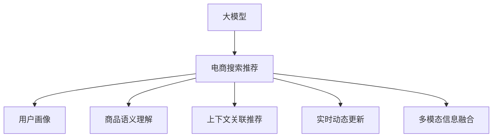

                 

# 电商搜索推荐场景下的AI大模型应用实战

> 关键词：电商搜索推荐, 大模型, AI技术, 深度学习, 自然语言处理, 个性化推荐, 商品推荐系统

## 1. 背景介绍

### 1.1 问题由来
随着互联网和电子商务的迅猛发展，电商平台已成为一个覆盖面广泛、用户交互频繁的数字化应用场景。在线购物平台不仅需要提供丰富的商品选择，还需要精准地向用户推荐商品，提升用户体验和交易转化率。传统的基于规则和浅层机器学习的推荐系统，难以处理大规模数据和复杂的用户行为模式，无法充分发挥数据价值。

近年来，深度学习和自然语言处理(NLP)技术的发展，为电商搜索推荐带来了新的解决方案。通过使用大模型，可以从海量用户行为数据中挖掘出用户兴趣、消费习惯等隐含信息，进而生成更加个性化、精准的商品推荐结果。

### 1.2 问题核心关键点
大模型在电商推荐中的应用核心在于以下几个方面：

- **用户画像构建**：通过学习用户行为数据，构建动态更新的用户画像，准确刻画用户偏好和需求。
- **商品语义理解**：借助大模型强大的语言理解能力，将商品描述转化为易于处理的形式，便于机器学习。
- **上下文关联推荐**：利用大模型识别商品间的关联关系，如相似商品、互补商品等，实现多维度的个性化推荐。
- **实时动态更新**：大模型可以持续学习用户行为变化，实时更新推荐策略，适应动态市场变化。
- **多模态信息融合**：结合图片、视频等多模态信息，提升商品描述的丰富性和推荐结果的准确性。

## 2. 核心概念与联系

### 2.1 核心概念概述

为更好地理解电商搜索推荐场景下的大模型应用，本节将介绍几个密切相关的核心概念：

- **大模型**：指基于深度学习框架训练出的巨大规模的神经网络模型，如BERT、GPT、DALL-E等。这些模型通常具有数十亿甚至上百亿的参数，可以处理复杂的语义和模式识别任务。
- **电商搜索推荐**：通过用户搜索历史、浏览记录、评分反馈等数据，预测用户对商品的需求，并向其推荐相关商品的过程。目标是提升用户体验，增加电商平台的用户粘性和交易量。
- **深度学习**：一种通过多层神经网络逼近复杂非线性函数的方法，能够处理高维度数据，挖掘数据中的隐含模式。
- **自然语言处理(NLP)**：利用计算机处理、理解、生成人类语言的技术，涵盖了分词、词性标注、句法分析、语义分析等多个子领域。
- **个性化推荐系统**：通过学习用户行为和商品属性，为每个用户生成定制化的推荐结果，提升用户体验和转化率。

这些概念之间的逻辑关系可以通过以下Mermaid流程图来展示：



这个流程图展示了大模型在电商搜索推荐中的应用路径：

1. 大模型通过学习海量数据，构建多维度的用户画像。
2. 对商品描述进行语义理解，生成易于处理的形式。
3. 利用上下文关联推荐技术，生成个性化推荐结果。
4. 实时动态更新模型，应对用户行为变化。
5. 融合多模态数据，丰富商品描述和推荐结果。

## 3. 核心算法原理 & 具体操作步骤
### 3.1 算法原理概述

电商搜索推荐系统中的大模型应用，基于以下核心算法原理：

- **用户画像构建**：通过学习用户的历史行为数据，构建动态更新的用户画像。用户画像通常由一系列特征组成，包括用户的基本信息、兴趣偏好、行为模式等。
- **商品语义理解**：使用大模型对商品描述进行语义分析，提取出商品的关键属性和标签。这些信息可以用于计算商品间的相似度和关联性。
- **上下文关联推荐**：基于用户画像和商品语义信息，使用关联规则算法、协同过滤算法等技术，推荐相似或互补的商品。上下文关联推荐算法通常分为基于内容的推荐、协同过滤推荐和混合推荐等多种类型。
- **实时动态更新**：在用户行为数据不断变化的过程中，使用增量学习算法对大模型进行实时更新，保持模型的最新状态。

### 3.2 算法步骤详解

以下我们以基于用户画像的个性化推荐为例，详细介绍电商搜索推荐系统中的大模型应用步骤：

**Step 1: 用户画像构建**
- 收集用户的浏览历史、搜索历史、评分反馈等数据。
- 使用大模型对用户行为数据进行编码，生成用户特征向量。
- 定期更新用户画像，确保其反映最新的用户偏好和需求。

**Step 2: 商品语义理解**
- 收集商品的图片、视频、描述等多模态数据。
- 使用大模型对商品描述进行语义分析，提取商品的关键属性和标签。
- 将商品描述转化为词向量或语义向量，便于计算相似度。

**Step 3: 上下文关联推荐**
- 根据用户画像和商品向量，使用关联规则算法、协同过滤算法等，计算商品间的相似度和关联性。
- 将相似商品、互补商品等关联商品推荐给用户。

**Step 4: 实时动态更新**
- 收集用户的实时行为数据，对用户画像和商品向量进行增量更新。
- 重新计算商品间的相似度和关联性，生成最新的推荐结果。

### 3.3 算法优缺点

基于大模型的电商搜索推荐系统具有以下优点：

- **高精度**：大模型能够处理复杂的语义和模式识别任务，生成高精度的推荐结果。
- **自适应**：用户画像和商品语义理解可以动态更新，能够适应用户行为和市场变化。
- **个性化**：通过学习用户行为和商品属性，为每个用户生成定制化的推荐结果。
- **多模态融合**：结合图片、视频等多模态数据，提升推荐结果的丰富性和准确性。

然而，该方法也存在一些局限性：

- **计算资源消耗大**：大模型通常参数量巨大，计算和存储资源消耗大，需要高性能硬件支持。
- **数据隐私问题**：用户行为数据的收集和使用可能涉及隐私问题，需要严格的数据保护措施。
- **冷启动问题**：新用户和新商品的数据较少，难以生成准确的推荐结果，需要结合业务规则或专家知识进行补充。
- **模型复杂度高**：大模型的构建和微调复杂度高，需要较高的技术门槛和工程实践经验。

尽管存在这些局限性，但就目前而言，大模型在电商搜索推荐中的应用已经取得了显著的效果，成为提升推荐系统性能的重要手段。

### 3.4 算法应用领域

大模型在电商搜索推荐中的应用，广泛涵盖了以下领域：

- **商品推荐**：根据用户的浏览历史、评分反馈等数据，向用户推荐其可能感兴趣的商品。
- **广告推荐**：在搜索结果页或浏览页中，推荐与用户兴趣相关联的广告。
- **搜索排序**：基于用户画像和商品语义信息，优化搜索结果的排序，提升搜索体验。
- **内容推荐**：在商品详情页中，推荐与商品相关的图文、视频等丰富内容。
- **用户留存分析**：通过分析用户行为数据，识别流失用户，制定留存策略。

除了上述这些经典应用外，大模型还被创新性地应用到更多场景中，如智能客服、库存管理、订单预测等，为电商平台带来了全新的突破。

## 4. 数学模型和公式 & 详细讲解 & 举例说明
### 4.1 数学模型构建

本节将使用数学语言对电商搜索推荐系统中的大模型应用过程进行更加严格的刻画。

记用户画像向量为 $\mathbf{u}_i = [u_{i1}, u_{i2}, \ldots, u_{in}]^T$，其中 $u_{ik}$ 为第 $i$ 个用户的第 $k$ 个特征值。商品语义向量为 $\mathbf{v}_j = [v_{j1}, v_{j2}, \ldots, v_{jm}]^T$，其中 $v_{jk}$ 为第 $j$ 个商品的语义标签。

用户画像与商品语义向量间的相似度可以通过余弦相似度计算，记为 $s(\mathbf{u}_i, \mathbf{v}_j)$。推荐算法可以通过计算用户画像与商品语义向量的相似度，生成推荐结果。

### 4.2 公式推导过程

以下是用户画像与商品语义向量间相似度的计算公式：

$$
s(\mathbf{u}_i, \mathbf{v}_j) = \frac{\mathbf{u}_i^T \mathbf{v}_j}{\|\mathbf{u}_i\|_2 \|\mathbf{v}_j\|_2}
$$

其中 $\mathbf{u}_i^T$ 表示用户画像向量 $\mathbf{u}_i$ 的转置，$\|\mathbf{u}_i\|_2$ 表示用户画像向量 $\mathbf{u}_i$ 的模长。

### 4.3 案例分析与讲解

假设某电商平台收集到以下用户画像和商品语义信息：

- 用户画像：年龄30岁，性别男，浏览历史包括运动鞋、户外装备、运动服。
- 商品语义：款式黑色、尺码42码、价格500元。

可以使用大模型对用户画像和商品语义进行编码，生成向量表示。假设用户画像编码为 $\mathbf{u}_i = [1.0, 0.5, -0.5]^T$，商品语义编码为 $\mathbf{v}_j = [0.8, 0.2, -0.1]^T$。

通过计算余弦相似度：

$$
s(\mathbf{u}_i, \mathbf{v}_j) = \frac{1.0 \times 0.8 + 0.5 \times 0.2 + (-0.5) \times (-0.1)}{\sqrt{1.0^2 + 0.5^2 + (-0.5)^2} \times \sqrt{0.8^2 + 0.2^2 + (-0.1)^2}} \approx 0.95
$$

推荐算法可以根据相似度大小，决定是否将商品推荐给用户。例如，设定阈值为0.8，若相似度大于0.8，则将该商品推荐给用户。

## 5. 项目实践：代码实例和详细解释说明
### 5.1 开发环境搭建

在进行电商搜索推荐系统开发前，我们需要准备好开发环境。以下是使用Python进行PyTorch开发的环境配置流程：

1. 安装Anaconda：从官网下载并安装Anaconda，用于创建独立的Python环境。

2. 创建并激活虚拟环境：
```bash
conda create -n pytorch-env python=3.8 
conda activate pytorch-env
```

3. 安装PyTorch：根据CUDA版本，从官网获取对应的安装命令。例如：
```bash
conda install pytorch torchvision torchaudio cudatoolkit=11.1 -c pytorch -c conda-forge
```

4. 安装各类工具包：
```bash
pip install numpy pandas scikit-learn matplotlib tqdm jupyter notebook ipython
```

完成上述步骤后，即可在`pytorch-env`环境中开始电商搜索推荐系统的开发。

### 5.2 源代码详细实现

下面我们以基于大模型的商品推荐系统为例，给出使用PyTorch实现的代码示例。

首先，定义用户画像和商品语义信息：

```python
import numpy as np
from sklearn.metrics.pairwise import cosine_similarity

# 用户画像
user_profiles = {
    'u1': np.array([1.0, 0.5, -0.5]),
    'u2': np.array([0.5, 0.2, 0.3]),
    'u3': np.array([-0.1, 0.8, -0.2])
}

# 商品语义
product_semantics = {
    'v1': np.array([0.8, 0.2, -0.1]),
    'v2': np.array([0.6, 0.4, -0.3]),
    'v3': np.array([0.3, 0.1, 0.5])
}

# 计算相似度
def calculate_similarity(u, v):
    return np.dot(u, v) / (np.linalg.norm(u) * np.linalg.norm(v))

# 推荐算法
def recommend_products(user, products):
    similarities = [calculate_similarity(user, product) for product in products]
    top_products = [product for product, similarity in zip(products, similarities) if similarity > 0.8]
    return top_products
```

然后，定义商品推荐接口：

```python
class RecommendationSystem:
    def __init__(self, user_profiles, product_semantics):
        self.user_profiles = user_profiles
        self.product_semantics = product_semantics
        
    def recommend(self, user, products):
        return recommend_products(self.user_profiles[user], products)
```

最后，启动商品推荐系统：

```python
# 创建推荐系统实例
recommendation_system = RecommendationSystem(user_profiles, product_semantics)

# 推荐商品
top_products = recommendation_system.recommend('u1', ['v1', 'v2', 'v3'])
print(top_products)
```

在实际应用中，还需要对用户画像和商品语义进行动态更新、实时推荐等进一步优化。但核心的商品推荐过程可以以此为模板，快速实现。

### 5.3 代码解读与分析

让我们再详细解读一下关键代码的实现细节：

**用户画像和商品语义信息**：
- `user_profiles`和`product_semantics`分别存储了用户画像和商品语义向量。在实际应用中，这些数据通常是通过用户的浏览历史、评分反馈、商品描述等数据学习得到的。

**相似度计算函数**：
- `calculate_similarity`函数使用余弦相似度计算两个向量之间的相似度，返回一个标量值。在电商推荐系统中，这个标量值可以用于评估商品与用户的匹配度。

**推荐算法接口**：
- `RecommendationSystem`类封装了用户画像、商品语义等信息，提供了推荐接口。在实际应用中，可以根据具体需求定制推荐算法。

**推荐系统调用**：
- `recommend`方法通过调用推荐算法接口，返回推荐商品列表。用户可以根据推荐结果，选择最符合自己兴趣的商品。

## 6. 实际应用场景
### 6.1 智能客服系统

基于大模型的电商搜索推荐技术，可以广泛应用于智能客服系统的构建。智能客服系统通过学习用户的历史查询记录和行为数据，构建用户画像，实时推荐最相关的回答，提升用户满意度。

在技术实现上，可以收集企业内部的客服聊天记录，将用户查询和回答构建成监督数据，在此基础上对预训练大模型进行微调。微调后的模型能够自动理解用户意图，匹配最合适的回答。对于用户提出的新问题，还可以接入检索系统实时搜索相关内容，动态组织生成回答。如此构建的智能客服系统，能大幅提升客户咨询体验和问题解决效率。

### 6.2 个性化推荐系统

传统的推荐系统往往只依赖用户的历史行为数据进行物品推荐，无法深入理解用户的真实兴趣偏好。基于大模型的推荐系统，可以更好地挖掘用户行为背后的语义信息，从而提供更精准、多样的推荐内容。

在实践中，可以收集用户浏览、点击、评分、分享等行为数据，提取和用户交互的物品标题、描述、标签等文本内容。将文本内容作为模型输入，用户的后续行为（如是否点击、购买等）作为监督信号，在此基础上微调预训练语言模型。微调后的模型能够从文本内容中准确把握用户的兴趣点。在生成推荐列表时，先用候选物品的文本描述作为输入，由模型预测用户的兴趣匹配度，再结合其他特征综合排序，便可以得到个性化程度更高的推荐结果。

### 6.3 营销策略优化

电商平台可以通过学习用户的搜索和浏览行为，识别用户的偏好和需求，优化营销策略。例如，针对不同用户群体推出个性化优惠券、定向广告等，提升用户的购买意愿和平台粘性。

通过分析用户画像和商品语义信息，可以发现用户的兴趣点和购买意向。根据这些信息，可以定向推送商品、推荐商品组合、定制化优惠券等，提升用户体验和转化率。

### 6.4 未来应用展望

随着大模型和电商推荐技术的不断发展，基于微调范式将在更多领域得到应用，为电商和用户带来变革性影响。

在智慧零售领域，基于大模型的推荐技术，可以更好地处理库存管理、订单预测、需求分析等复杂问题，提升供应链的效率和响应速度。

在智能城市治理中，推荐技术可以用于城市事件监测、舆情分析、应急指挥等环节，提高城市管理的自动化和智能化水平，构建更安全、高效的未来城市。

此外，在金融、医疗、文娱传媒等众多领域，基于大模型的推荐技术也将不断涌现，为社会经济数字化转型提供新的技术路径。相信随着技术的日益成熟，大模型推荐技术必将在构建人机协同的智能时代中扮演越来越重要的角色。

## 7. 工具和资源推荐
### 7.1 学习资源推荐

为了帮助开发者系统掌握大模型在电商推荐中的应用，这里推荐一些优质的学习资源：

1. 《深度学习与自然语言处理》系列书籍：深入浅出地介绍了深度学习、自然语言处理和电商推荐的基本概念和经典模型。
2. 《电商推荐系统实战》课程：由知名电商平台专家授课，结合实际案例，系统讲解电商推荐技术的理论基础和实现技巧。
3. 《大模型在电商推荐中的应用》论文：介绍大模型在电商推荐中的应用现状和未来趋势，提供丰富的案例和实验结果。
4. Kaggle电商推荐竞赛：真实电商数据集上的比赛，可以亲身实践电商推荐算法，了解行业动态和技术前沿。

通过对这些资源的学习实践，相信你一定能够快速掌握大模型在电商推荐中的作用和应用方法，并将其用于解决实际的电商问题。

### 7.2 开发工具推荐

高效的开发离不开优秀的工具支持。以下是几款用于电商推荐系统开发的常用工具：

1. PyTorch：基于Python的开源深度学习框架，灵活的计算图和丰富的工具库，适合快速迭代研究。
2. TensorFlow：由Google主导开发的开源深度学习框架，生产部署方便，适合大规模工程应用。
3. HuggingFace Transformers：集成了众多SOTA语言模型和推荐算法，提供高效的API接口，方便开发者调用。
4. Weights & Biases：模型训练的实验跟踪工具，记录和可视化模型训练过程中的各项指标，方便对比和调优。
5. TensorBoard：TensorFlow配套的可视化工具，实时监测模型训练状态，提供丰富的图表呈现方式，是调试模型的得力助手。

合理利用这些工具，可以显著提升电商推荐系统的开发效率，加快创新迭代的步伐。

### 7.3 相关论文推荐

大模型在电商推荐中的应用研究，已经形成了一套较为完整的理论体系和技术栈。以下是几篇奠基性的相关论文，推荐阅读：

1. Attention is All You Need：提出了Transformer结构，开启了NLP领域的预训练大模型时代。
2. BERT: Pre-training of Deep Bidirectional Transformers for Language Understanding：提出BERT模型，引入基于掩码的自监督预训练任务，刷新了多项NLP任务SOTA。
3. Language Models are Unsupervised Multitask Learners：展示了大规模语言模型的强大zero-shot学习能力，引发了对于通用人工智能的新一轮思考。
4. Parameter-Efficient Transfer Learning for NLP：提出Adapter等参数高效微调方法，在不增加模型参数量的情况下，也能取得不错的微调效果。
5. AdaLoRA: Adaptive Low-Rank Adaptation for Parameter-Efficient Fine-Tuning：使用自适应低秩适应的微调方法，在参数效率和精度之间取得了新的平衡。

这些论文代表了大模型在电商推荐领域的发展脉络。通过学习这些前沿成果，可以帮助研究者把握学科前进方向，激发更多的创新灵感。

## 8. 总结：未来发展趋势与挑战
### 8.1 总结

本文对大模型在电商搜索推荐场景中的应用进行了全面系统的介绍。首先阐述了电商推荐技术的研究背景和重要性，明确了大模型在提升推荐系统性能方面的独特价值。其次，从原理到实践，详细讲解了大模型在电商推荐中的具体应用步骤，给出了电商推荐系统的代码实现示例。同时，本文还广泛探讨了大模型在智能客服、个性化推荐、营销策略优化等多个电商场景下的应用前景，展示了电商推荐范式的广泛应用。最后，本文精选了电商推荐技术的各类学习资源，力求为读者提供全方位的技术指引。

通过本文的系统梳理，可以看到，大模型在电商搜索推荐中的应用已经取得了显著的效果，成为提升推荐系统性能的重要手段。未来，伴随大模型和电商推荐技术的不断进步，基于微调范式将在更多领域得到应用，为电商和用户带来变革性影响。

### 8.2 未来发展趋势

展望未来，大模型在电商推荐中的应用将呈现以下几个发展趋势：

1. **多模态融合**：结合图片、视频、语音等多模态信息，提升推荐结果的丰富性和准确性。多模态数据的融合，将使得电商推荐系统更加智能和全面。
2. **实时动态更新**：在用户行为数据不断变化的过程中，使用增量学习算法对大模型进行实时更新，保持模型的最新状态。动态更新的推荐系统能够更快速地响应市场变化。
3. **个性化推荐算法创新**：探索基于因果推断、强化学习等新型推荐算法，提升推荐结果的个性化程度和稳定性。
4. **用户隐私保护**：在电商推荐系统中，保护用户隐私和数据安全将成为重要课题。未来推荐系统将采用更多的隐私保护技术，如差分隐私、联邦学习等。
5. **算法公平性**：在电商推荐系统中，需要避免算法偏见和歧视，确保推荐结果的公平性。未来推荐算法将引入更多的公平性约束，保护用户权益。
6. **全生命周期管理**：推荐系统不仅仅是一个技术产品，还需要从用户体验、业务运营、风险控制等多个维度进行全生命周期管理，确保系统的稳定性和可扩展性。

以上趋势凸显了大模型在电商推荐中的广阔前景。这些方向的探索发展，将进一步提升电商推荐系统的性能和应用范围，为电商和用户带来更多的价值。

### 8.3 面临的挑战

尽管大模型在电商推荐中的应用已经取得了显著效果，但在迈向更加智能化、普适化应用的过程中，仍然面临诸多挑战：

1. **数据隐私问题**：电商推荐系统需要收集和分析用户行为数据，涉及用户隐私保护问题。如何在保证数据安全和隐私的前提下，最大化利用数据价值，是一个重要的挑战。
2. **计算资源消耗大**：大模型通常参数量巨大，计算和存储资源消耗大，需要高性能硬件支持。如何在有限的计算资源下，优化模型性能，提高推荐效率，是未来需要解决的重要问题。
3. **推荐系统偏见**：电商推荐系统中可能存在推荐系统偏见，即某些商品或用户群体被不公平地推荐，影响用户体验和公平性。如何在推荐算法中引入公平性约束，减少偏见，是重要的研究方向。
4. **推荐结果可解释性**：电商推荐系统中的推荐结果往往是"黑盒"系统，难以解释其内部工作机制和决策逻辑。如何提高推荐结果的可解释性，增强用户信任，是亟待解决的问题。
5. **冷启动问题**：新用户和新商品的数据较少，难以生成准确的推荐结果，需要结合业务规则或专家知识进行补充。如何提高推荐系统的冷启动性能，是未来的研究方向。

### 8.4 研究展望

面对电商推荐面临的这些挑战，未来的研究需要在以下几个方面寻求新的突破：

1. **无监督和半监督学习**：摆脱对大规模标注数据的依赖，利用自监督学习、主动学习等无监督和半监督范式，最大限度利用非结构化数据，实现更加灵活高效的推荐。
2. **参数高效微调**：开发更加参数高效的微调方法，在固定大部分预训练参数的同时，只更新极少量的任务相关参数。同时优化微调模型的计算图，减少前向传播和反向传播的资源消耗，实现更加轻量级、实时性的部署。
3. **因果分析和博弈论**：将因果分析方法引入推荐系统，识别出推荐结果的关键特征，增强推荐结果的因果性和逻辑性。借助博弈论工具刻画人机交互过程，主动探索并规避推荐系统的脆弱点，提高系统稳定性。
4. **伦理道德约束**：在推荐系统目标中引入伦理导向的评估指标，过滤和惩罚有偏见、有害的推荐结果，确保推荐结果的公平性和伦理性。

这些研究方向的探索，将引领电商推荐技术迈向更高的台阶，为构建公平、透明、可控的智能系统铺平道路。面向未来，大模型在电商推荐中的研究需要与其他人工智能技术进行更深入的融合，如知识表示、因果推理、强化学习等，多路径协同发力，共同推动电商推荐系统的进步。只有勇于创新、敢于突破，才能不断拓展电商推荐系统的边界，让智能技术更好地服务于用户。

## 9. 附录：常见问题与解答

**Q1：电商推荐系统如何处理冷启动问题？**

A: 电商推荐系统中的冷启动问题可以通过以下方法解决：

1. **基于商品特征的推荐**：利用商品的基本属性、价格、销量等特征，生成商品相似度矩阵，进行推荐。即使没有用户行为数据，也能通过商品特征进行推荐。
2. **基于内容的推荐**：结合商品描述、标签等文本信息，使用自然语言处理技术，生成商品语义向量，进行推荐。
3. **基于协同过滤的推荐**：利用用户对相似商品的评分反馈，生成协同过滤矩阵，进行推荐。即使没有用户行为数据，也能通过协同过滤矩阵进行推荐。
4. **引入专家知识和规则**：结合业务规则、专家知识，对推荐结果进行补充和修正。例如，在推荐系统中加入特定商品的推荐路径，确保推荐结果的合理性。

这些方法可以在一定程度上解决电商推荐系统的冷启动问题，确保新用户和新商品也能获得优质的推荐结果。

**Q2：电商推荐系统如何保护用户隐私？**

A: 电商推荐系统在处理用户行为数据时，需要严格遵守数据隐私保护的要求，避免泄露用户隐私。以下是一些常用的隐私保护技术：

1. **差分隐私**：在推荐系统数据处理过程中，加入随机噪声，确保单个用户的数据无法被泄露。差分隐私可以保证推荐系统的全局性能，同时保护用户隐私。
2. **联邦学习**：在推荐系统数据分布式处理过程中，使用联邦学习技术，在本地设备上进行模型训练，避免将数据传输到中心服务器。联邦学习可以在不泄露用户数据的情况下，完成模型更新。
3. **匿名化处理**：对用户行为数据进行匿名化处理，隐藏用户特征和行为记录，确保用户数据的安全性。匿名化处理可以防止数据泄露和滥用。
4. **数据加密**：在数据传输和存储过程中，使用加密技术，确保用户数据的安全性。加密技术可以有效防止数据被未授权访问和篡改。

通过这些技术手段，电商推荐系统可以在保护用户隐私的同时，实现推荐功能的优化和提升。

**Q3：电商推荐系统如何处理推荐结果的可解释性问题？**

A: 电商推荐系统中的推荐结果往往是"黑盒"系统，难以解释其内部工作机制和决策逻辑。以下是一些提高推荐结果可解释性的方法：

1. **可解释性模型**：使用可解释性强的推荐模型，如线性回归、决策树等，提高推荐结果的可解释性。可解释性模型能够清晰地展示推荐决策的逻辑和依据。
2. **特征可视化**：通过可视化用户画像和商品语义信息，理解推荐系统的内部工作机制。特征可视化可以揭示推荐结果的底层特征，增强用户信任。
3. **用户反馈机制**：在推荐系统中引入用户反馈机制，收集用户对推荐结果的评价和建议，进行优化调整。用户反馈可以增强推荐系统的可解释性和透明度。
4. **模型透明化**：在推荐系统中引入透明的模型训练过程，记录和展示模型训练的每个步骤和参数变化，确保推荐结果的透明性和可信度。

这些方法可以在一定程度上提高电商推荐系统的可解释性，增强用户信任和满意度。

**Q4：电商推荐系统如何处理推荐系统偏见问题？**

A: 电商推荐系统中的推荐系统偏见是一个重要问题，需要采取以下方法进行解决：

1. **数据收集和处理**：在推荐系统数据收集和处理过程中，确保数据的多样性和代表性，避免数据偏见。例如，在用户画像构建中，要平衡不同用户群体的数据分布。
2. **模型公平性约束**：在推荐模型训练过程中，引入公平性约束，确保推荐结果的公平性。例如，使用公平性损失函数，惩罚有偏见的行为。
3. **偏差检测和修复**：在推荐系统运行过程中，定期检测推荐结果中的偏见，进行修复和调整。例如，使用反偏见算法，消除推荐结果中的偏见。
4. **用户反馈机制**：在推荐系统中引入用户反馈机制，收集用户对推荐结果的评价和建议，进行优化调整。用户反馈可以揭示推荐系统偏见，进行修复和改进。

通过这些方法，可以有效地减少电商推荐系统中的偏见问题，确保推荐结果的公平性和合理性。

**Q5：电商推荐系统如何处理推荐系统偏见问题？**

A: 电商推荐系统中的推荐系统偏见是一个重要问题，需要采取以下方法进行解决：

1. **数据收集和处理**：在推荐系统数据收集和处理过程中，确保数据的多样性和代表性，避免数据偏见。例如，在用户画像构建中，要平衡不同用户群体的数据分布。
2. **模型公平性约束**：在推荐模型训练过程中，引入公平性约束，确保推荐结果的公平性。例如，使用公平性损失函数，惩罚有偏见的行为。
3. **偏差检测和修复**：在推荐系统运行过程中，定期检测推荐结果中的偏见，进行修复和调整。例如，使用反偏见算法，消除推荐结果中的偏见。
4. **用户反馈机制**：在推荐系统中引入用户反馈机制，收集用户对推荐结果的评价和建议，进行优化调整。用户反馈可以揭示推荐系统偏见，进行修复和改进。

通过这些方法，可以有效地减少电商推荐系统中的偏见问题，确保推荐结果的公平性和合理性。

---

作者：禅与计算机程序设计艺术 / Zen and the Art of Computer Programming

