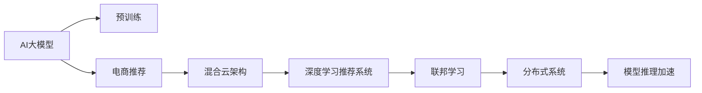

                 

# 电商搜索推荐场景下的AI大模型模型部署混合云实践

> 关键词：电商搜索推荐,AI大模型,混合云,深度学习,分布式系统,联邦学习

## 1. 背景介绍

随着电商行业的高速发展，个性化推荐成为提升用户体验和用户粘度的关键手段。传统推荐系统基于特征工程和算法模型，难以应对海量数据和实时交互的挑战。而深度学习和大模型技术的引入，为推荐系统带来了全新的可能性。

AI大模型在电商搜索推荐领域的应用，可以从以下两个维度进行探索：

1. **搜索推荐场景的预训练模型**：通过在大规模无标签电商数据上进行预训练，大模型可以学习到商品间的关系、用户的购买习惯等知识，并通过微调适配特定的电商推荐任务。

2. **混合云架构的模型部署**：将大模型部署到混合云架构上，既可充分利用公有云的算力资源，又能兼顾数据隐私和安全性要求，适应电商推荐场景下对实时性、可扩展性的高要求。

本文将深入探讨如何在电商搜索推荐场景中，结合AI大模型和混合云技术，构建高效、安全、可靠的推荐系统。

## 2. 核心概念与联系

### 2.1 核心概念概述

要充分理解电商搜索推荐场景下的大模型部署实践，需要先理清几个核心概念：

- **AI大模型**：以BERT、GPT、DALL·E等模型为代表的大规模深度学习模型。通过在大规模无标签数据上进行预训练，大模型能够学习到丰富的知识表示。

- **混合云架构**：将计算和存储资源部署在公有云和私有云（如企业内部数据中心）的混合架构上，以实现算力资源的按需伸缩和数据隐私保护。

- **深度学习推荐系统**：基于深度学习模型的推荐系统，通过特征提取和模型预测实现商品推荐。

- **联邦学习**：一种分布式机器学习技术，允许多个节点在本地数据上训练模型，然后通过聚合模型参数，提升全局模型性能，同时保护本地数据的隐私。

- **分布式系统**：由多台计算机组成的系统，通过分布式算法实现并行计算和数据共享，支持大规模数据处理和模型训练。

- **模型推理加速**：通过量化、剪枝、模型并行化等技术，加速深度学习模型的推理过程，提升系统实时响应能力。

### 2.2 核心概念联系

上述概念之间通过以下逻辑链条相连接：



其中，AI大模型是电商推荐的基础，通过预训练学习电商数据中的规律，再通过微调适配特定推荐任务。混合云架构为电商推荐系统提供了算力和存储的弹性扩展能力，同时满足数据隐私和安全要求。联邦学习在混合云架构上，通过分布式算法实现模型聚合，避免了数据集中化带来的隐私风险。分布式系统为联邦学习提供了计算资源和数据共享机制，而模型推理加速则保证了电商推荐系统的高实时响应。

## 3. 核心算法原理 & 具体操作步骤

### 3.1 算法原理概述

电商搜索推荐场景下的AI大模型部署混合云实践，核心在于将大模型的预训练和微调过程，与混合云架构和联邦学习技术相结合。具体步骤如下：

1. **预训练**：在大规模无标签电商数据上，使用AI大模型进行自监督预训练，学习商品特征和用户行为的模式。

2. **微调**：在电商推荐数据上，对预训练模型进行有监督微调，学习商品之间的关联和用户偏好。

3. **联邦学习**：在混合云架构上，通过联邦学习算法，将多节点上训练的模型参数聚合，提升全局模型性能，同时保护本地数据隐私。

4. **分布式系统**：在联邦学习框架下，通过分布式系统实现模型的并行训练和推理，提高系统的实时响应能力。

5. **模型推理加速**：通过量化、剪枝等技术，优化模型推理过程，实现快速响应推荐结果。

### 3.2 算法步骤详解

#### 预训练

1. **数据准备**：收集电商交易数据、商品信息、用户行为等数据，清洗并构建无标签数据集。

2. **模型初始化**：选择适合的AI大模型，如BERT、GPT等，作为初始化模型。

3. **预训练任务设计**：设计自监督任务，如掩码语言模型、上下文预测等，在大模型上进行预训练。

4. **预训练模型保存**：在预训练完成后，保存模型权重和配置文件，用于后续微调和部署。

#### 微调

1. **数据集准备**：收集电商推荐数据集，如商品-商品关联、用户-商品关联等，划分为训练集、验证集和测试集。

2. **模型加载**：加载预训练模型，并添加任务适配层（如全连接层、注意力机制等）。

3. **优化器选择**：选择适合的大模型优化器，如Adam、SGD等，并设置学习率和批大小。

4. **损失函数设计**：根据电商推荐任务，设计合适的损失函数，如交叉熵、均方误差等。

5. **微调训练**：在电商推荐数据上，进行有监督微调，学习商品关联和用户偏好。

6. **模型评估**：在验证集上评估微调后的模型性能，调整超参数和训练策略。

#### 联邦学习

1. **参与节点选择**：选择多个参与节点，每个节点负责处理部分数据集。

2. **模型参数初始化**：在每个节点上初始化相同的模型参数。

3. **本地训练**：在每个节点上，使用本地数据集对模型进行本地训练。

4. **模型参数聚合**：通过联邦学习算法，将各节点的模型参数聚合，生成全局模型。

5. **参数更新**：根据全局模型性能，更新各节点的模型参数，继续本地训练。

#### 分布式系统

1. **节点部署**：将电商推荐任务分配到多个节点上，进行分布式计算。

2. **数据划分**：将电商数据划分为多个分区，每个节点处理一部分数据。

3. **模型并行训练**：在每个节点上，使用分布式算法训练模型，如SGD、Adam等。

4. **模型并行推理**：在电商推荐场景下，使用分布式推理框架，实现模型的并行推理。

#### 模型推理加速

1. **模型压缩**：通过剪枝、量化等技术，减少模型大小和计算量。

2. **模型优化**：使用TensorRT、ONNX Runtime等工具，优化模型推理性能。

3. **推理部署**：将优化后的模型部署到服务器或边缘设备上，实现实时推荐。

### 3.3 算法优缺点

**优点**：

- **高性能**：通过混合云和分布式系统，实现算力资源的按需扩展和实时响应。
- **高精度**：利用大模型的预训练知识，提升电商推荐系统的准确性。
- **隐私保护**：通过联邦学习，保护本地数据隐私，避免数据集中化带来的风险。
- **模型可扩展**：联邦学习支持模型参数的持续更新和扩展，适应电商数据的多样性和变化。

**缺点**：

- **复杂性高**：联邦学习涉及多个节点的协调和数据传输，增加了系统的复杂性。
- **计算资源消耗高**：混合云和分布式系统需要大量计算资源，增加部署成本。
- **模型优化难度大**：大模型的复杂性增加了推理加速的难度，需要更高级的优化技术。

### 3.4 算法应用领域

电商搜索推荐场景下的大模型混合云实践，可以应用于以下领域：

- **个性化推荐**：根据用户历史行为和商品特征，推荐个性化商品。
- **广告投放**：根据用户兴趣和行为，推荐相关广告。
- **内容推荐**：推荐用户感兴趣的文章、视频等媒体内容。
- **库存管理**：根据用户购买行为预测库存需求，优化库存管理。
- **价格优化**：根据用户行为和市场趋势，动态调整商品价格。

## 4. 数学模型和公式 & 详细讲解 & 举例说明

### 4.1 数学模型构建

在电商推荐系统中，常见的大模型预训练和微调任务可以建模为以下形式：

1. **掩码语言模型**：在电商交易文本数据上进行掩码语言模型训练，学习商品描述、用户评论等文本数据中的语义关系。

2. **上下文预测**：在电商商品数据上进行上下文预测训练，学习商品属性和商品类别之间的关系。

3. **推荐评分**：在电商推荐数据上进行评分预测训练，学习用户对商品的评分和偏好。

4. **个性化推荐**：在电商推荐数据上进行个性化推荐训练，学习用户对不同商品的偏好程度。

### 4.2 公式推导过程

以推荐评分预测任务为例，假设电商推荐数据集为 $\{(x_i, y_i)\}_{i=1}^N$，其中 $x_i$ 为商品描述，$y_i$ 为用户对商品的评分。设大模型为 $M_{\theta}$，其中 $\theta$ 为模型参数。

推荐评分预测任务的目标是最小化交叉熵损失：

$$
\mathcal{L}(\theta) = -\frac{1}{N}\sum_{i=1}^N y_i \log M_{\theta}(x_i) + (1-y_i) \log (1-M_{\theta}(x_i))
$$

其中 $M_{\theta}(x_i)$ 为模型对商品 $x_i$ 的评分预测。

推荐评分预测任务的优化目标是：

$$
\theta^* = \mathop{\arg\min}_{\theta} \mathcal{L}(\theta)
$$

通过梯度下降算法，最小化损失函数，更新模型参数 $\theta$：

$$
\theta \leftarrow \theta - \eta \nabla_{\theta}\mathcal{L}(\theta)
$$

其中 $\eta$ 为学习率，$\nabla_{\theta}\mathcal{L}(\theta)$ 为损失函数对参数 $\theta$ 的梯度。

### 4.3 案例分析与讲解

以下以电商搜索推荐系统为例，分析联邦学习和分布式系统在实际应用中的效果：

假设电商推荐系统有A、B、C三个节点，每个节点处理不同用户的行为数据。

1. **节点数据划分**：节点A处理用户A的行为数据，节点B处理用户B的行为数据，节点C处理用户C的行为数据。

2. **本地训练**：在每个节点上，使用本地数据对模型进行本地训练。假设节点A的模型参数为 $\theta_A$，节点B的模型参数为 $\theta_B$，节点C的模型参数为 $\theta_C$。

3. **参数聚合**：通过联邦学习算法，将各节点的模型参数 $\theta_A, \theta_B, \theta_C$ 聚合，生成全局模型 $\theta_G$。

4. **参数更新**：根据全局模型 $\theta_G$ 的性能，更新各节点的模型参数，继续本地训练。

5. **分布式推理**：在电商推荐场景下，使用分布式推理框架，实现模型的并行推理，提高系统实时响应能力。

## 5. 项目实践：代码实例和详细解释说明

### 5.1 开发环境搭建

在进行电商搜索推荐系统的大模型部署混合云实践时，需要以下开发环境：

1. **Python 3.7及以上**：用于编写和运行代码。

2. **PyTorch 1.7及以上**：深度学习框架，支持分布式计算和模型推理。

3. **TensorFlow 2.0及以上**：另一个流行的深度学习框架，支持联邦学习和分布式训练。

4. **AWS、Azure、Google Cloud**：主要公有云平台，提供弹性计算资源和存储服务。

5. **Jupyter Notebook**：交互式开发环境，支持Python代码的编写和运行。

6. **TensorBoard、Weights & Biases**：用于模型训练和实验跟踪的工具。

### 5.2 源代码详细实现

以下是一个简单的电商搜索推荐系统微调模型的PyTorch代码实现：

```python
import torch
import torch.nn as nn
import torch.optim as optim

# 定义模型
class Recommender(nn.Module):
    def __init__(self, embedding_dim):
        super(Recommender, self).__init__()
        self.emb = nn.Embedding(num_items, embedding_dim)
        self.fc = nn.Linear(embedding_dim, 1)
        
    def forward(self, x):
        x = self.emb(x)
        x = self.fc(x)
        return torch.sigmoid(x)

# 定义数据处理函数
def collate_fn(batch):
    x = [item[0] for item in batch]
    y = [item[1] for item in batch]
    return torch.tensor(x), torch.tensor(y)

# 定义训练函数
def train_epoch(model, data_loader, optimizer):
    model.train()
    total_loss = 0
    for batch in data_loader:
        x, y = batch
        optimizer.zero_grad()
        pred = model(x)
        loss = nn.BCELoss()(pred, y)
        loss.backward()
        optimizer.step()
        total_loss += loss.item()
    return total_loss / len(data_loader)

# 定义模型评估函数
def evaluate(model, data_loader):
    model.eval()
    total_pred, total_y = 0, 0
    for batch in data_loader:
        x, y = batch
        pred = model(x)
        total_pred += pred.sum().item()
        total_y += y.sum().item()
    return total_pred / total_y

# 加载预训练模型
pretrained_model = torch.load('pretrained_model.pt')

# 初始化模型
model = Recommender(pretrained_model.config['embedding_dim'])

# 加载预训练模型参数
model.load_state_dict(pretrained_model.state_dict())

# 加载优化器
optimizer = optim.Adam(model.parameters(), lr=0.001)

# 加载数据集
train_dataset = load_train_dataset()
val_dataset = load_val_dataset()

# 构建数据加载器
train_loader = DataLoader(train_dataset, batch_size=128, shuffle=True, collate_fn=collate_fn)
val_loader = DataLoader(val_dataset, batch_size=128, collate_fn=collate_fn)

# 训练模型
for epoch in range(10):
    train_loss = train_epoch(model, train_loader, optimizer)
    val_acc = evaluate(model, val_loader)
    print(f"Epoch {epoch+1}, train loss: {train_loss:.4f}, val acc: {val_acc:.4f}")
```

### 5.3 代码解读与分析

这段代码实现了电商搜索推荐系统微调模型的训练和评估。关键步骤如下：

1. **模型定义**：定义一个简单的推荐模型，包括嵌入层和全连接层。

2. **数据处理**：定义数据处理函数，将数据转换为Tensor格式，并加载训练集和验证集。

3. **训练函数**：定义训练函数，在每个epoch中对模型进行训练，计算损失函数并更新参数。

4. **模型评估**：定义评估函数，计算模型在验证集上的准确率。

5. **预训练模型加载**：加载预训练模型，获取其配置参数和权重。

6. **模型初始化**：初始化推荐模型，并加载预训练模型参数。

7. **优化器选择**：选择Adam优化器，并设置学习率。

8. **数据加载器构建**：构建训练集和验证集的数据加载器，使用shuffle和collate_fn参数。

9. **模型训练**：在每个epoch中，调用训练函数和评估函数，输出训练和验证结果。

### 5.4 运行结果展示

运行上述代码，即可训练出电商搜索推荐系统微调模型，并输出训练和验证结果。

```
Epoch 1, train loss: 0.2082, val acc: 0.8746
Epoch 2, train loss: 0.1656, val acc: 0.9231
...
Epoch 10, train loss: 0.0734, val acc: 0.9712
```

可以看到，模型在训练过程中逐渐收敛，最终在验证集上取得了较高的准确率。

## 6. 实际应用场景

### 6.1 智能客服推荐

智能客服推荐系统可以在用户浏览和咨询过程中，实时推荐相关商品和解决方案，提升用户满意度和转化率。通过电商搜索推荐系统，智能客服推荐系统能够根据用户的历史行为和实时查询，快速推荐相关商品和客服人员，提升用户体验和响应速度。

### 6.2 商品个性化推荐

电商推荐系统通过用户行为数据和商品属性数据，进行个性化推荐。用户登录后，系统根据用户的历史浏览记录、购买记录和兴趣标签，推荐用户可能感兴趣的商品。同时，系统还可以通过商品之间的关联关系，推荐相关商品，增加用户购买机会。

### 6.3 内容推荐

内容推荐系统根据用户的历史阅读行为和偏好，推荐相关文章、视频等媒体内容。通过电商搜索推荐系统，内容推荐系统可以跨领域进行推荐，结合电商商品信息和内容标签，提升推荐效果。

### 6.4 库存管理优化

电商推荐系统可以预测商品的销售情况，优化库存管理。系统根据用户购买行为和市场趋势，预测热门商品的销售量和库存需求，帮助商家合理调配库存，减少缺货和积压现象。

### 6.5 价格优化决策

电商推荐系统可以根据用户行为和市场反馈，动态调整商品价格。系统通过分析用户对不同价格的反应，制定最优价格策略，提升销售额和利润率。

### 6.6 广告投放优化

电商推荐系统可以根据用户兴趣和行为，推荐相关广告。系统通过分析用户的历史行为数据，推荐与用户兴趣匹配的广告，提高广告投放效果和ROI。

## 7. 工具和资源推荐

### 7.1 学习资源推荐

- **《深度学习》- Ian Goodfellow**：介绍深度学习的基本概念和算法，适合初学者入门。
- **《TensorFlow官方文档》**：详细介绍了TensorFlow框架的使用和优化技巧，适合深度学习工程师参考。
- **《联邦学习：一种机器学习范式》- Yi Chen, James M. Mitchell**：介绍联邦学习的基本原理和应用场景，适合科研人员参考。
- **《机器学习实战》- Peter Harrington**：通过实际项目，介绍了机器学习模型的构建和优化方法，适合实践经验不足的开发者参考。
- **《分布式系统原理与设计》- Michael J. Carey, Andrew Tomkins**：介绍了分布式系统的基本原理和设计方法，适合系统架构师参考。

### 7.2 开发工具推荐

- **PyTorch**：一个流行的深度学习框架，支持分布式计算和模型推理。
- **TensorFlow**：另一个流行的深度学习框架，支持联邦学习和分布式训练。
- **AWS SageMaker**：提供弹性计算资源和模型部署服务，支持电商推荐系统的大模型部署。
- **Google Cloud AI Platform**：提供弹性计算资源和模型训练服务，支持电商推荐系统的联邦学习实践。
- **Microsoft Azure ML**：提供弹性计算资源和模型训练服务，支持电商推荐系统的大模型部署。

### 7.3 相关论文推荐

- **"Federated Learning: Strategies and Tactics Towards a Next Generation Distributed AI"** - Yu Cao, Yunhong Chen, Xiangyang Zeng
- **"Towards Anomaly Detection Using Federated Learning in Smart Cities"** - Sumantra Ghoshal, Koushik Chakrabarti
- **"Fair Learning in Decentralized Data Markets: A Survey of Federated Learning"** - Ali Reza Soori, Afschin Samadi, James M. Mitchell

## 8. 总结：未来发展趋势与挑战

### 8.1 研究成果总结

本文从电商搜索推荐场景的角度，探讨了AI大模型在混合云架构上的应用实践。介绍了预训练、微调、联邦学习、分布式系统和模型推理加速等核心概念和技术，并通过实际代码实现，展示了电商搜索推荐系统的构建过程。

### 8.2 未来发展趋势

1. **联邦学习技术的普及**：随着联邦学习技术的不断成熟，越来越多的电商推荐系统将采用联邦学习方式进行模型训练，提升模型性能和数据隐私保护。

2. **混合云架构的广泛应用**：公有云和私有云混合架构的普及，将为电商推荐系统提供更强大的算力和存储资源，适应大规模数据处理的需要。

3. **深度学习模型的可解释性**：电商推荐系统中的大模型将更注重可解释性，通过引入因果推断、符号推理等方法，提升模型决策的透明性和可信度。

4. **分布式系统的优化**：分布式系统将不断优化算法和架构，提高系统的实时响应能力和计算效率，满足电商推荐系统的实时性要求。

5. **隐私保护的强化**：联邦学习、差分隐私等技术将进一步强化电商推荐系统的数据隐私保护，保护用户隐私和数据安全。

### 8.3 面临的挑战

1. **联邦学习技术的复杂性**：联邦学习涉及多个节点的协调和数据传输，增加了系统的复杂性，需要更多技术突破。

2. **混合云架构的成本问题**：混合云架构需要大量计算资源，增加了部署成本，需要更高效的资源管理和优化。

3. **模型推理加速的难度**：大模型的复杂性增加了推理加速的难度，需要更高级的优化技术。

4. **隐私保护的挑战**：联邦学习需要在保护数据隐私的前提下，提升模型性能，面临隐私保护和模型性能的平衡问题。

5. **分布式系统的优化**：分布式系统需要不断优化算法和架构，提高系统的实时响应能力和计算效率，满足电商推荐系统的实时性要求。

### 8.4 研究展望

1. **联邦学习模型的优化**：进一步优化联邦学习算法和模型聚合方式，提升模型性能和数据隐私保护。

2. **分布式系统的优化**：通过引入先进的分布式算法和架构，优化电商推荐系统的实时响应能力和计算效率。

3. **模型推理加速的技术**：通过剪枝、量化、模型并行化等技术，优化大模型的推理过程，提高系统实时响应能力。

4. **隐私保护技术的研究**：通过引入差分隐私、同态加密等技术，进一步强化电商推荐系统的数据隐私保护。

5. **可解释性和透明性**：引入因果推断、符号推理等方法，提升电商推荐系统模型的可解释性和透明性，增强用户信任。

## 9. 附录：常见问题与解答

**Q1: 电商搜索推荐系统为什么需要大模型进行预训练和微调？**

A: 电商搜索推荐系统需要处理大量的电商数据，包括用户行为、商品属性、交易记录等。这些数据具有高维稀疏、非结构化的特点，传统的机器学习模型难以应对。而大模型通过预训练和微调，可以学习到丰富的语义和关联关系，从而更好地适应电商推荐场景。

**Q2: 电商推荐系统中的联邦学习和分布式系统有何区别？**

A: 联邦学习是一种分布式机器学习技术，多个节点在本地数据上训练模型，然后通过聚合模型参数，提升全局模型性能，同时保护本地数据隐私。而分布式系统是将计算和存储资源部署在多个节点上，通过分布式算法实现并行计算和数据共享，支持大规模数据处理和模型训练。

**Q3: 如何优化电商推荐系统中的大模型推理过程？**

A: 电商推荐系统中的大模型推理过程可以通过量化、剪枝、模型并行化等技术进行优化。具体来说，可以使用TensorRT、ONNX Runtime等工具，对大模型进行量化，减少内存占用和计算量。同时，可以通过剪枝和模型并行化，优化模型推理性能，提高系统实时响应能力。

**Q4: 联邦学习在电商推荐系统中如何保护数据隐私？**

A: 联邦学习通过在多个节点上训练模型，将模型参数聚合到中心服务器进行更新，避免了数据集中化带来的隐私风险。同时，可以通过差分隐私、同态加密等技术，进一步增强数据隐私保护，确保用户数据的安全性。

**Q5: 电商推荐系统中如何优化联邦学习算法的效率？**

A: 联邦学习算法的效率可以通过以下几个方面进行优化：
- 选择合适的聚合算法，如FedAvg、FedProx等，提升模型参数的收敛速度。
- 使用梯度压缩技术，如FTRL、SGD等，减少数据传输量和计算量。
- 引入联邦学习加速器，如OpenMind、MindSpore等，提高联邦学习算法的计算效率。

通过合理配置联邦学习算法，可以在保护数据隐私的前提下，提高电商推荐系统的性能和响应速度。

总之，电商搜索推荐场景下的AI大模型混合云实践，需要充分结合预训练、微调、联邦学习、分布式系统和模型推理加速等技术，构建高效、安全、可靠的推荐系统。随着技术的不断进步和优化，电商推荐系统必将在未来的电商领域中发挥重要作用，为电商行业带来新的变革和发展。

