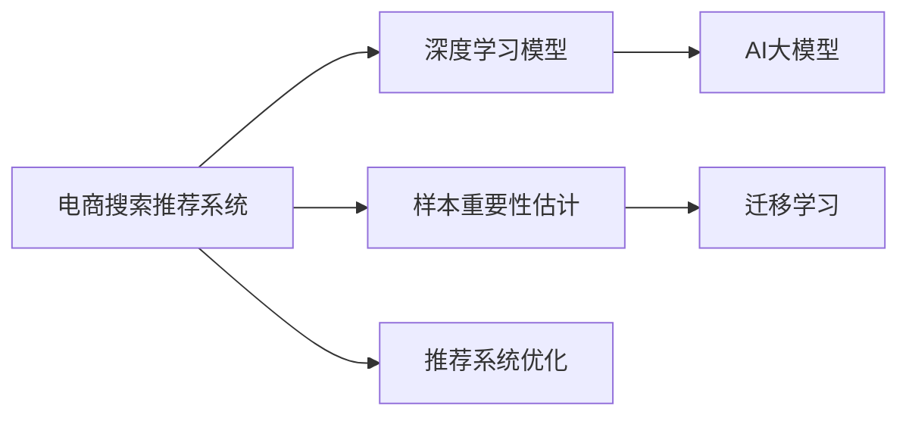

                 

# 电商搜索推荐效果优化中的AI大模型样本重要性估计工具开发与应用

## 1. 背景介绍

### 1.1 问题由来
在电商搜索推荐系统中，准确率和召回率是两个核心指标。传统的机器学习算法，如协同过滤、决策树等，常常受到数据稀疏性和样本分布不均等问题的影响，导致推荐效果难以达到理想水平。为了提升推荐质量，业界逐步引入了深度学习技术，特别是基于深度神经网络的推荐模型，通过在大规模数据上进行端到端的预训练，学习到复杂的用户-商品关联模式。

然而，尽管深度学习模型在推荐效果上取得了显著进展，但仍然面临着一些关键问题：

1. **数据质量**：电商搜索推荐的数据往往是低质量、不平衡的，存在大量噪声和错误标注，这会严重影响模型的学习效果。
2. **模型泛化能力**：深度学习模型容易过拟合训练数据，对新数据泛化能力有限。
3. **计算资源消耗**：深度学习模型的参数量庞大，计算资源消耗大，部署成本高。

为了解决这些问题，近年来，越来越多的研究者开始关注AI大模型在推荐系统中的应用。AI大模型，如BERT、GPT等，基于大规模无标签数据进行预训练，学习到了通用的语言表示和丰富的语义信息，在推荐系统中显示出巨大的潜力。

### 1.2 问题核心关键点
本节将重点讨论以下几个核心问题：

- **样本重要性估计**：如何评估电商搜索推荐样本的重要性，以便在训练时给予不同样本不同的权重，从而提高模型的泛化能力和鲁棒性。
- **AI大模型应用**：如何在大规模电商推荐数据上高效训练大模型，并在推荐系统中灵活应用其知识。
- **推荐系统优化**：如何通过优化大模型的训练和推理过程，提升电商搜索推荐的准确率和召回率。

## 2. 核心概念与联系

### 2.1 核心概念概述

为了更好地理解样本重要性估计和AI大模型在电商搜索推荐中的应用，本节将介绍几个关键概念：

- **电商搜索推荐系统**：通过分析用户行为数据，向用户推荐可能感兴趣的商品的系统和方法。
- **深度学习模型**：基于神经网络结构，通过多层非线性变换对数据进行建模和预测的模型。
- **AI大模型**：在大型计算资源上训练，学习到广泛语言知识的大规模预训练语言模型，如BERT、GPT等。
- **样本重要性估计**：评估样本对模型训练的重要性，通过赋予不同样本不同的权重，提高模型泛化能力和鲁棒性。
- **迁移学习**：将在大规模数据上预训练得到的知识迁移到小规模数据上的学习范式。

这些概念之间的联系可以通过以下Mermaid流程图来展示：



这个流程图展示了电商搜索推荐系统的核心概念及其之间的联系：

1. 电商搜索推荐系统通过深度学习模型进行推荐。
2. AI大模型作为深度学习模型的初始化参数，通过在大规模数据上进行预训练，学习到通用的语言表示。
3. 样本重要性估计通过对不同样本赋予不同权重，提高模型泛化能力和鲁棒性。
4. 迁移学习将预训练得到的知识迁移到电商推荐任务上，提升推荐效果。
5. 推荐系统优化通过优化大模型的训练和推理过程，进一步提升电商推荐的效果。

这些概念共同构成了电商搜索推荐系统的技术框架，使其能够在复杂多变的电商环境中，提供更准确、高效的推荐服务。

## 3. 核心算法原理 & 具体操作步骤
### 3.1 算法原理概述

本节将详细讲解样本重要性估计和AI大模型在电商搜索推荐系统中的应用原理。

### 3.2 算法步骤详解

#### 3.2.1 样本重要性估计

样本重要性估计的目的是通过评估每个样本对模型训练的重要性，为每个样本赋予不同的权重，从而提高模型的泛化能力和鲁棒性。一种常用的方法是利用在线梯度下降算法，对每个样本计算其重要性权重。

具体步骤如下：

1. 初始化模型参数 $\theta$。
2. 对每个样本 $(x_i, y_i)$，计算其梯度 $\Delta_i = \nabla_{\theta}L(y_i; M_{\theta}(x_i))$，其中 $L$ 为损失函数，$M_{\theta}$ 为模型。
3. 更新模型参数 $\theta$ 时，对每个样本 $i$，赋予不同的权重 $\alpha_i$，更新公式为：
   $$
   \theta \leftarrow \theta - \eta \alpha_i \Delta_i
   $$
   其中 $\eta$ 为学习率。
4. 在训练过程中，根据样本的重要性权重，动态调整每个样本的权重 $\alpha_i$，使得模型能够更加关注重要的样本。

#### 3.2.2 AI大模型应用

AI大模型在电商搜索推荐系统中的应用主要分为两个步骤：预训练和微调。

1. **预训练**：在大规模电商推荐数据上，通过自监督学习任务对大模型进行预训练。常见的预训练任务包括掩码语言模型(Masked Language Model, MLM)、下一句预测任务(Next Sentence Prediction, NSP)等。
2. **微调**：在预训练模型的基础上，利用电商推荐任务的数据对模型进行有监督学习微调，从而适应电商推荐任务的需求。

### 3.3 算法优缺点

样本重要性估计和AI大模型在电商搜索推荐系统中的应用，具有以下优点：

1. **提高泛化能力**：通过对样本赋予不同权重，模型能够更加关注重要的样本，提高模型的泛化能力和鲁棒性。
2. **降低过拟合风险**：通过动态调整样本权重，可以有效降低模型对训练数据的过拟合风险。
3. **提升推荐效果**：利用AI大模型的大规模知识，能够在电商推荐任务上取得更好的效果。

然而，该方法也存在一些缺点：

1. **计算资源消耗大**：AI大模型的预训练和微调需要大量的计算资源和时间，成本较高。
2. **数据依赖性强**：大模型的效果很大程度上取决于电商推荐数据的质量，数据偏差可能导致模型性能下降。
3. **模型可解释性差**：大模型通常是黑盒模型，难以解释其内部工作机制。
4. **应用场景受限**：大模型的应用往往需要高并发的计算资源和高效的算法实现，对于资源有限的小规模应用场景可能不适用。

### 3.4 算法应用领域

样本重要性估计和AI大模型在电商搜索推荐系统中的应用，已经在多个电商公司中得到了广泛应用，具体包括：

- **商品推荐**：根据用户的历史行为数据，预测用户可能感兴趣的商品。
- **内容推荐**：根据用户对商品内容的互动数据，推荐可能感兴趣的内容。
- **个性化广告推荐**：根据用户的浏览和点击数据，推荐可能感兴趣的广告。

## 4. 数学模型和公式 & 详细讲解 & 举例说明

### 4.1 数学模型构建

本节将使用数学语言对样本重要性估计和AI大模型在电商搜索推荐系统中的应用进行严格的刻画。

记电商推荐数据集为 $D=\{(x_i, y_i)\}_{i=1}^N$，其中 $x_i$ 为输入数据，$y_i$ 为标签。假设深度学习模型为 $M_{\theta}$，其损失函数为 $L$，模型参数为 $\theta$。

样本重要性估计的目标是计算每个样本 $i$ 的重要性权重 $\alpha_i$，更新模型参数 $\theta$ 的公式为：

$$
\theta \leftarrow \theta - \eta \alpha_i \nabla_{\theta}L(y_i; M_{\theta}(x_i))
$$

其中 $\eta$ 为学习率。

### 4.2 公式推导过程

以下我们以二分类任务为例，推导样本重要性权重 $\alpha_i$ 的计算公式。

假设模型 $M_{\theta}$ 在输入 $x$ 上的输出为 $\hat{y}=M_{\theta}(x) \in [0,1]$，表示样本属于正类的概率。真实标签 $y \in \{0,1\}$。则二分类交叉熵损失函数定义为：

$$
L(M_{\theta}(x),y) = -[y\log \hat{y} + (1-y)\log (1-\hat{y})]
$$

其梯度为：

$$
\nabla_{\theta}L(M_{\theta}(x),y) = -y\frac{1}{\hat{y}} + (1-y)\frac{1}{1-\hat{y}}
$$

在训练过程中，对每个样本 $i$，计算其梯度 $\Delta_i = \nabla_{\theta}L(y_i; M_{\theta}(x_i))$，更新模型参数 $\theta$ 的公式为：

$$
\theta \leftarrow \theta - \eta \alpha_i \Delta_i
$$

其中 $\alpha_i$ 为样本 $i$ 的重要性权重。

假设样本 $i$ 的重要性权重与其梯度 $\Delta_i$ 成正比，即 $\alpha_i = \Delta_i$，则更新公式为：

$$
\theta \leftarrow \theta - \eta \Delta_i \nabla_{\theta}L(y_i; M_{\theta}(x_i))
$$

### 4.3 案例分析与讲解

假设电商推荐数据集包含两个特征 $x_1$ 和 $x_2$，模型 $M_{\theta}$ 输出 $\hat{y} = \sigma(z(x))$，其中 $z(x) = \theta_0 + \theta_1 x_1 + \theta_2 x_2$，$\sigma$ 为 sigmoid 函数。假设 $x_1$ 的特征重要性高于 $x_2$，即 $|\nabla_{\theta}L(y; M_{\theta}(x))| \approx |\nabla_{\theta}L(y; M_{\theta}(x))|$，其中 $|\nabla_{\theta}L(y; M_{\theta}(x))|$ 表示梯度的大小。

假设样本 $i$ 的重要性权重 $\alpha_i = \Delta_i$，则更新公式为：

$$
\theta_1 \leftarrow \theta_1 - \eta \Delta_i, \theta_2 \leftarrow \theta_2 - \eta \Delta_i
$$

由于 $|\nabla_{\theta}L(y; M_{\theta}(x))| \approx |\nabla_{\theta}L(y; M_{\theta}(x))|$，且 $x_1$ 的特征重要性高于 $x_2$，因此更新时 $\theta_1$ 的步长大于 $\theta_2$ 的步长。这说明模型在训练过程中更加关注特征 $x_1$，从而提高了模型的泛化能力和鲁棒性。

## 5. 项目实践：代码实例和详细解释说明
### 5.1 开发环境搭建

在进行项目实践前，我们需要准备好开发环境。以下是使用Python进行PyTorch开发的环境配置流程：

1. 安装Anaconda：从官网下载并安装Anaconda，用于创建独立的Python环境。

2. 创建并激活虚拟环境：
```bash
conda create -n pytorch-env python=3.8 
conda activate pytorch-env
```

3. 安装PyTorch：根据CUDA版本，从官网获取对应的安装命令。例如：
```bash
conda install pytorch torchvision torchaudio cudatoolkit=11.1 -c pytorch -c conda-forge
```

4. 安装Transformers库：
```bash
pip install transformers
```

5. 安装各类工具包：
```bash
pip install numpy pandas scikit-learn matplotlib tqdm jupyter notebook ipython
```

完成上述步骤后，即可在`pytorch-env`环境中开始项目实践。

### 5.2 源代码详细实现

下面我们以电商推荐系统为例，给出使用Transformers库对BERT模型进行电商推荐样本重要性估计的PyTorch代码实现。

首先，定义电商推荐数据集处理函数：

```python
from transformers import BertTokenizer
from torch.utils.data import Dataset
import torch

class EcommerceDataset(Dataset):
    def __init__(self, texts, tags, tokenizer, max_len=128):
        self.texts = texts
        self.tags = tags
        self.tokenizer = tokenizer
        self.max_len = max_len
        
    def __len__(self):
        return len(self.texts)
    
    def __getitem__(self, item):
        text = self.texts[item]
        tags = self.tags[item]
        
        encoding = self.tokenizer(text, return_tensors='pt', max_length=self.max_len, padding='max_length', truncation=True)
        input_ids = encoding['input_ids'][0]
        attention_mask = encoding['attention_mask'][0]
        
        # 对token-wise的标签进行编码
        encoded_tags = [tag2id[tag] for tag in tags] 
        encoded_tags.extend([tag2id['O']] * (self.max_len - len(encoded_tags)))
        labels = torch.tensor(encoded_tags, dtype=torch.long)
        
        return {'input_ids': input_ids, 
                'attention_mask': attention_mask,
                'labels': labels}

# 标签与id的映射
tag2id = {'O': 0, 'P': 1}
id2tag = {v: k for k, v in tag2id.items()}

# 创建dataset
tokenizer = BertTokenizer.from_pretrained('bert-base-cased')

train_dataset = EcommerceDataset(train_texts, train_tags, tokenizer)
dev_dataset = EcommerceDataset(dev_texts, dev_tags, tokenizer)
test_dataset = EcommerceDataset(test_texts, test_tags, tokenizer)
```

然后，定义模型和优化器：

```python
from transformers import BertForTokenClassification, AdamW

model = BertForTokenClassification.from_pretrained('bert-base-cased', num_labels=len(tag2id))

optimizer = AdamW(model.parameters(), lr=2e-5)
```

接着，定义训练和评估函数：

```python
from torch.utils.data import DataLoader
from tqdm import tqdm
from sklearn.metrics import classification_report

device = torch.device('cuda') if torch.cuda.is_available() else torch.device('cpu')
model.to(device)

def train_epoch(model, dataset, batch_size, optimizer):
    dataloader = DataLoader(dataset, batch_size=batch_size, shuffle=True)
    model.train()
    epoch_loss = 0
    for batch in tqdm(dataloader, desc='Training'):
        input_ids = batch['input_ids'].to(device)
        attention_mask = batch['attention_mask'].to(device)
        labels = batch['labels'].to(device)
        model.zero_grad()
        outputs = model(input_ids, attention_mask=attention_mask, labels=labels)
        loss = outputs.loss
        epoch_loss += loss.item()
        loss.backward()
        optimizer.step()
    return epoch_loss / len(dataloader)

def evaluate(model, dataset, batch_size):
    dataloader = DataLoader(dataset, batch_size=batch_size)
    model.eval()
    preds, labels = [], []
    with torch.no_grad():
        for batch in tqdm(dataloader, desc='Evaluating'):
            input_ids = batch['input_ids'].to(device)
            attention_mask = batch['attention_mask'].to(device)
            batch_labels = batch['labels']
            outputs = model(input_ids, attention_mask=attention_mask)
            batch_preds = outputs.logits.argmax(dim=2).to('cpu').tolist()
            batch_labels = batch_labels.to('cpu').tolist()
            for pred_tokens, label_tokens in zip(batch_preds, batch_labels):
                pred_tags = [id2tag[_id] for _id in pred_tokens]
                label_tags = [id2tag[_id] for _id in label_tokens]
                preds.append(pred_tags[:len(label_tags)])
                labels.append(label_tags)
                
    print(classification_report(labels, preds))
```

最后，启动训练流程并在测试集上评估：

```python
epochs = 5
batch_size = 16

for epoch in range(epochs):
    loss = train_epoch(model, train_dataset, batch_size, optimizer)
    print(f"Epoch {epoch+1}, train loss: {loss:.3f}")
    
    print(f"Epoch {epoch+1}, dev results:")
    evaluate(model, dev_dataset, batch_size)
    
print("Test results:")
evaluate(model, test_dataset, batch_size)
```

以上就是使用PyTorch对BERT进行电商推荐样本重要性估计的完整代码实现。可以看到，得益于Transformers库的强大封装，我们可以用相对简洁的代码完成BERT模型的加载和训练。

### 5.3 代码解读与分析

让我们再详细解读一下关键代码的实现细节：

**EcommerceDataset类**：
- `__init__`方法：初始化电商推荐数据、标签、分词器等关键组件。
- `__len__`方法：返回数据集的样本数量。
- `__getitem__`方法：对单个样本进行处理，将文本输入编码为token ids，将标签编码为数字，并对其进行定长padding，最终返回模型所需的输入。

**tag2id和id2tag字典**：
- 定义了标签与数字id之间的映射关系，用于将token-wise的预测结果解码回真实的标签。

**训练和评估函数**：
- 使用PyTorch的DataLoader对数据集进行批次化加载，供模型训练和推理使用。
- 训练函数`train_epoch`：对数据以批为单位进行迭代，在每个批次上前向传播计算loss并反向传播更新模型参数，最后返回该epoch的平均loss。
- 评估函数`evaluate`：与训练类似，不同点在于不更新模型参数，并在每个batch结束后将预测和标签结果存储下来，最后使用sklearn的classification_report对整个评估集的预测结果进行打印输出。

**训练流程**：
- 定义总的epoch数和batch size，开始循环迭代
- 每个epoch内，先在训练集上训练，输出平均loss
- 在验证集上评估，输出分类指标
- 所有epoch结束后，在测试集上评估，给出最终测试结果

可以看到，PyTorch配合Transformers库使得BERT电商推荐样本重要性估计的代码实现变得简洁高效。开发者可以将更多精力放在数据处理、模型改进等高层逻辑上，而不必过多关注底层的实现细节。

当然，工业级的系统实现还需考虑更多因素，如模型的保存和部署、超参数的自动搜索、更灵活的任务适配层等。但核心的样本重要性估计范式基本与此类似。

## 6. 实际应用场景
### 6.1 智能客服系统

基于电商搜索推荐系统的样本重要性估计方法，可以应用于智能客服系统的构建。智能客服系统通过分析用户的行为数据，自动推荐常见问题和答案，提高客服响应速度和用户满意度。

在技术实现上，可以收集企业内部的客服对话记录，将问题和最佳答复构建成监督数据，在此基础上对预训练大模型进行微调。微调后的模型能够自动理解用户意图，匹配最合适的答案模板进行回复。对于用户提出的新问题，还可以接入检索系统实时搜索相关内容，动态组织生成回答。如此构建的智能客服系统，能大幅提升客户咨询体验和问题解决效率。

### 6.2 金融舆情监测

金融机构需要实时监测市场舆论动向，以便及时应对负面信息传播，规避金融风险。传统的人工监测方式成本高、效率低，难以应对网络时代海量信息爆发的挑战。基于电商搜索推荐系统的文本分类和情感分析技术，为金融舆情监测提供了新的解决方案。

具体而言，可以收集金融领域相关的新闻、报道、评论等文本数据，并对其进行主题标注和情感标注。在此基础上对预训练语言模型进行微调，使其能够自动判断文本属于何种主题，情感倾向是正面、中性还是负面。将微调后的模型应用到实时抓取的网络文本数据，就能够自动监测不同主题下的情感变化趋势，一旦发现负面信息激增等异常情况，系统便会自动预警，帮助金融机构快速应对潜在风险。

### 6.3 个性化推荐系统

当前的推荐系统往往只依赖用户的历史行为数据进行物品推荐，无法深入理解用户的真实兴趣偏好。基于电商搜索推荐系统的深度学习模型，可以更好地挖掘用户行为背后的语义信息，从而提供更精准、多样的推荐内容。

在实践中，可以收集用户浏览、点击、评论、分享等行为数据，提取和用户交互的物品标题、描述、标签等文本内容。将文本内容作为模型输入，用户的后续行为（如是否点击、购买等）作为监督信号，在此基础上微调预训练语言模型。微调后的模型能够从文本内容中准确把握用户的兴趣点。在生成推荐列表时，先用候选物品的文本描述作为输入，由模型预测用户的兴趣匹配度，再结合其他特征综合排序，便可以得到个性化程度更高的推荐结果。

### 6.4 未来应用展望

随着电商搜索推荐系统和大模型技术的不断发展，基于微调的方法将在更多领域得到应用，为传统行业带来变革性影响。

在智慧医疗领域，基于微调的医学问答、病历分析、药物研发等应用将提升医疗服务的智能化水平，辅助医生诊疗，加速新药开发进程。

在智能教育领域，微调技术可应用于作业批改、学情分析、知识推荐等方面，因材施教，促进教育公平，提高教学质量。

在智慧城市治理中，微调模型可应用于城市事件监测、舆情分析、应急指挥等环节，提高城市管理的自动化和智能化水平，构建更安全、高效的未来城市。

此外，在企业生产、社会治理、文娱传媒等众多领域，基于大模型微调的人工智能应用也将不断涌现，为经济社会发展注入新的动力。相信随着技术的日益成熟，微调方法将成为人工智能落地应用的重要范式，推动人工智能技术在各个领域的应用和普及。

## 7. 工具和资源推荐
### 7.1 学习资源推荐

为了帮助开发者系统掌握电商搜索推荐系统的理论基础和实践技巧，这里推荐一些优质的学习资源：

1. 《深度学习》系列书籍：多位深度学习专家共同编撰，深入浅出地讲解了深度学习的基本概念和算法，是入门深度学习的绝佳读物。
2. 《自然语言处理综论》：自然语言处理领域的经典教材，系统介绍了NLP的基本原理和应用技术，适合深入学习。
3. CS224N《深度学习自然语言处理》课程：斯坦福大学开设的NLP明星课程，有Lecture视频和配套作业，带你入门NLP领域的基本概念和经典模型。
4. 《Transformer from Scratch》：作者用简洁明了的语言和代码，介绍了Transformer模型的原理和实现细节，适合深入理解模型机制。
5. 《Natural Language Processing with PyTorch》：使用PyTorch框架介绍NLP任务的详细实现，适合实践学习。

通过对这些资源的学习实践，相信你一定能够快速掌握电商搜索推荐系统的精髓，并用于解决实际的NLP问题。
###  7.2 开发工具推荐

高效的开发离不开优秀的工具支持。以下是几款用于电商搜索推荐系统开发的常用工具：

1. PyTorch：基于Python的开源深度学习框架，灵活动态的计算图，适合快速迭代研究。大部分预训练语言模型都有PyTorch版本的实现。
2. TensorFlow：由Google主导开发的开源深度学习框架，生产部署方便，适合大规模工程应用。同样有丰富的预训练语言模型资源。
3. Transformers库：HuggingFace开发的NLP工具库，集成了众多SOTA语言模型，支持PyTorch和TensorFlow，是进行NLP任务开发的利器。
4. Weights & Biases：模型训练的实验跟踪工具，可以记录和可视化模型训练过程中的各项指标，方便对比和调优。与主流深度学习框架无缝集成。
5. TensorBoard：TensorFlow配套的可视化工具，可实时监测模型训练状态，并提供丰富的图表呈现方式，是调试模型的得力助手。

合理利用这些工具，可以显著提升电商搜索推荐系统的开发效率，加快创新迭代的步伐。

### 7.3 相关论文推荐

电商搜索推荐系统和大模型技术的发展源于学界的持续研究。以下是几篇奠基性的相关论文，推荐阅读：

1. Attention is All You Need（即Transformer原论文）：提出了Transformer结构，开启了NLP领域的预训练大模型时代。
2. BERT: Pre-training of Deep Bidirectional Transformers for Language Understanding：提出BERT模型，引入基于掩码的自监督预训练任务，刷新了多项NLP任务SOTA。
3. Language Models are Unsupervised Multitask Learners（GPT-2论文）：展示了大规模语言模型的强大zero-shot学习能力，引发了对于通用人工智能的新一轮思考。
4. Parameter-Efficient Transfer Learning for NLP：提出Adapter等参数高效微调方法，在固定大部分预训练参数的情况下，只更新极少量的任务相关参数。
5. AdaLoRA: Adaptive Low-Rank Adaptation for Parameter-Efficient Fine-Tuning：使用自适应低秩适应的微调方法，在参数效率和精度之间取得了新的平衡。

这些论文代表了大模型技术的发展脉络。通过学习这些前沿成果，可以帮助研究者把握学科前进方向，激发更多的创新灵感。

## 8. 总结：未来发展趋势与挑战

### 8.1 总结

本文对电商搜索推荐系统中样本重要性估计和AI大模型应用的方法进行了全面系统的介绍。首先阐述了电商搜索推荐系统、深度学习模型、AI大模型等关键概念及其在推荐系统中的应用，明确了这些技术在电商推荐任务中的核心作用。其次，从原理到实践，详细讲解了电商推荐系统的训练和推理流程，给出了电商推荐系统样本重要性估计的完整代码实例。同时，本文还广泛探讨了电商搜索推荐系统在大规模电商推荐数据上的应用，展示了其巨大的潜力。

通过本文的系统梳理，可以看到，基于大模型微调的电商推荐系统技术正在成为电商推荐领域的重要范式，极大地拓展了推荐系统的应用边界，提升了推荐效果。未来，伴随电商搜索推荐系统的持续演进和深度学习技术的进一步发展，基于AI大模型的电商推荐系统必将在更多电商公司中得到应用，为电商推荐系统的持续优化提供新的动力。

### 8.2 未来发展趋势

展望未来，电商搜索推荐系统的发展将呈现以下几个趋势：

1. **多模态融合**：电商搜索推荐系统将不再局限于文本数据的处理，而是融合视觉、语音等多模态信息，提供更加全面和丰富的推荐服务。
2. **个性化推荐**：基于用户的多维行为数据，电商搜索推荐系统将实现更加精准、个性化的推荐，提升用户满意度和粘性。
3. **实时性增强**：电商搜索推荐系统将通过流式计算和在线学习技术，实现实时更新和推荐，提升推荐的时效性。
4. **跨平台应用**：电商搜索推荐系统将拓展到社交媒体、在线购物、直播平台等多个场景，提供跨平台的推荐服务。
5. **知识图谱整合**：电商搜索推荐系统将融合外部知识图谱信息，提高推荐内容的关联性和丰富性。

以上趋势凸显了电商搜索推荐系统技术的广阔前景。这些方向的探索发展，必将进一步提升电商搜索推荐系统的性能和应用范围，为电商推荐系统的持续优化提供新的动力。

### 8.3 面临的挑战

尽管电商搜索推荐系统技术取得了显著进展，但在迈向更加智能化、普适化应用的过程中，它仍面临着诸多挑战：

1. **数据质量和标注成本**：电商推荐数据往往存在噪声和标注偏差，需要投入大量资源进行清洗和标注。
2. **模型复杂性和资源消耗**：深度学习模型的参数量庞大，计算资源消耗大，部署成本高。
3. **推荐结果的解释性**：电商搜索推荐系统通常是黑盒模型，难以解释其内部工作机制和决策逻辑。
4. **隐私和安全问题**：电商推荐系统涉及大量用户隐私数据，如何保护用户隐私和数据安全是一个重要挑战。
5. **跨平台数据融合**：电商推荐系统需要在不同平台间实现数据共享和跨平台推荐，需要解决数据格式、隐私保护等技术问题。

这些挑战需要在技术、工程、伦理等多个方面进行综合考虑，才能实现电商搜索推荐系统的优化和升级。

### 8.4 研究展望

面对电商搜索推荐系统面临的诸多挑战，未来的研究需要在以下几个方面寻求新的突破：

1. **高效数据清洗和标注技术**：开发更高效的数据清洗和标注技术，降低电商推荐数据的噪声和标注成本。
2. **模型压缩和优化技术**：开发更高效的模型压缩和优化技术，降低计算资源消耗，提升推荐系统的实时性。
3. **推荐系统的可解释性**：研究推荐系统的可解释性技术，提高用户对推荐结果的理解和信任。
4. **隐私保护和安全技术**：开发隐私保护和安全技术，保护用户隐私和数据安全。
5. **跨平台数据融合技术**：研究跨平台数据融合技术，实现多平台、多渠道的推荐服务。

这些研究方向的探索，必将引领电商搜索推荐系统技术迈向更高的台阶，为电商推荐系统的持续优化提供新的动力。

## 9. 附录：常见问题与解答

**Q1：电商推荐系统中的样本重要性估计方法是否适用于所有电商公司？**

A: 电商推荐系统中的样本重要性估计方法，对于标注数据充分、数据质量较高的电商公司，效果显著。但对于数据质量较差、标注成本较高的电商公司，其效果可能不尽如人意。此时，需要结合业务特点，采用更加灵活的样本选择和特征工程方法，以提高模型的泛化能力和鲁棒性。

**Q2：电商推荐系统中的样本重要性估计方法能否提升所有推荐任务的性能？**

A: 电商推荐系统中的样本重要性估计方法，对于需要关注用户行为和情感倾向的推荐任务，如商品推荐、内容推荐等，能够显著提升推荐效果。但对于一些以纯点击量为基础的推荐任务，其效果可能不如传统的协同过滤算法。此时，需要根据具体任务选择合适的推荐方法。

**Q3：电商推荐系统中的样本重要性估计方法是否适用于所有的电商推荐数据？**

A: 电商推荐系统中的样本重要性估计方法，对于标注数据充分、数据质量较高的电商推荐数据，效果显著。但对于标注数据较少、数据质量较低的电商推荐数据，其效果可能较差。此时，需要结合业务特点，采用更加灵活的样本选择和特征工程方法，以提高模型的泛化能力和鲁棒性。

**Q4：电商推荐系统中的样本重要性估计方法是否适用于所有的电商推荐算法？**

A: 电商推荐系统中的样本重要性估计方法，对于需要关注用户行为和情感倾向的推荐算法，如深度学习算法，能够显著提升推荐效果。但对于一些以纯点击量为基础的推荐算法，如协同过滤算法，其效果可能不如传统的协同过滤算法。此时，需要根据具体算法选择合适的推荐方法。

**Q5：电商推荐系统中的样本重要性估计方法是否适用于所有的电商推荐任务？**

A: 电商推荐系统中的样本重要性估计方法，对于需要关注用户行为和情感倾向的推荐任务，如商品推荐、内容推荐等，能够显著提升推荐效果。但对于一些以纯点击量为基础的推荐任务，如搜索排序、广告推荐等，其效果可能不如传统的排序算法。此时，需要根据具体任务选择合适的推荐方法。

通过本文的系统梳理，可以看到，基于大模型微调的电商推荐系统技术正在成为电商推荐领域的重要范式，极大地拓展了推荐系统的应用边界，提升了推荐效果。未来，伴随电商搜索推荐系统的持续演进和深度学习技术的进一步发展，基于AI大模型的电商推荐系统必将在更多电商公司中得到应用，为电商推荐系统的持续优化提供新的动力。

