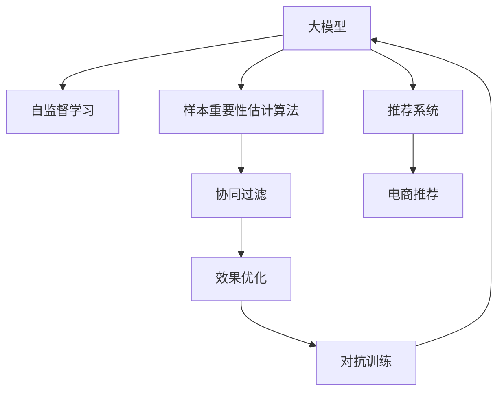

                 

# 电商搜索推荐效果优化中的AI大模型样本重要性估计算法改进案例分析

> 关键词：电商推荐, 大模型, 样本重要性估计算法, 效果优化, 案例分析

## 1. 背景介绍

### 1.1 问题由来
电子商务平台通过推荐系统为消费者提供个性化商品推荐，以提高用户购买转化率。目前推荐系统主要依赖于协同过滤、基于内容的推荐、深度学习等技术手段，通过用户行为数据、商品属性等特征来预测用户对商品的可能兴趣。

近年来，大模型（Large Language Model, LLMs）在自然语言处理（NLP）领域取得了显著进步。在电商搜索推荐中，大模型也被广泛应用。通过在大规模无标签数据上进行预训练，大模型学习了语言的通用表示，具备强大的语言理解和生成能力。电商推荐中，将用户搜索词作为模型输入，通过自然语言理解（NLU）和自然语言生成（NLG）技术，推荐相关商品。

尽管大模型在电商推荐中取得了显著效果，但实际应用中仍存在一些问题：模型在大规模无标签数据上的预训练可能会导致过拟合，导致推荐结果与实际用户需求不符。此外，用户搜索词多样、长度不一，如何有效利用样本进行模型训练，提高推荐效果，也成为了一个重要的研究方向。

### 1.2 问题核心关键点
大模型在电商推荐中的核心问题是样本重要性估计问题。即，如何在大规模无标签数据上进行样本筛选，根据样本的难易程度和质量，分配不同的权重，以提升模型训练效果。样本重要性估计有助于：

- **避免过拟合**：选择重要样本进行训练，减少模型在大规模数据上的过拟合风险。
- **提高模型泛化能力**：提高模型在新数据上的泛化能力，减少因数据集偏差造成的推荐结果偏差。
- **提升推荐效果**：通过更合理的样本选择和权重分配，提高推荐模型的效果，增加用户满意度。

## 2. 核心概念与联系

### 2.1 核心概念概述

为了更好地理解大模型在电商推荐中的样本重要性估计算法，本节将介绍几个密切相关的核心概念：

- **大模型（LLMs）**：以自回归（如GPT）或自编码（如BERT）模型为代表的大规模预训练语言模型。通过在大规模无标签文本语料上进行预训练，学习通用的语言表示。

- **样本重要性估计算法（Sample Importance Sampling, SIS）**：在大规模无标签数据上进行样本筛选，根据样本的难易程度和质量，分配不同的权重，以提升模型训练效果。

- **自监督学习（Self-Supervised Learning）**：在大规模无标签数据上，通过自监督任务（如掩码语言模型、自回归预测等）训练模型，使其学习到通用的语言表示。

- **协同过滤（Collaborative Filtering）**：通过用户历史行为数据，预测用户可能感兴趣的商品，是一种常见的推荐算法。

- **效果优化（Effectiveness Optimization）**：通过优化算法和模型结构，提升推荐系统的效果，增强用户体验。

- **对抗训练（Adversarial Training）**：在训练过程中引入对抗样本，提高模型的鲁棒性和泛化能力。

这些核心概念之间的逻辑关系可以通过以下Mermaid流程图来展示：



这个流程图展示了大模型在电商推荐中的核心概念及其之间的关系：

1. 大模型通过自监督学习获得基础的语言表示。
2. 样本重要性估计算法在大模型基础上进行样本筛选和权重分配。
3. 协同过滤算法基于模型预测结果进行推荐。
4. 效果优化算法不断改进推荐算法，提升用户体验。
5. 对抗训练提高模型的鲁棒性，增强泛化能力。

这些概念共同构成了大模型在电商推荐中的学习和应用框架，使其能够在用户需求多样、数据复杂的情况下提供高质量的推荐服务。通过理解这些核心概念，我们可以更好地把握大模型在电商推荐中的应用策略。

## 3. 核心算法原理 & 具体操作步骤
### 3.1 算法原理概述

大模型在电商推荐中的样本重要性估计算法，本质上是基于自监督学习范式在大规模无标签数据上进行样本筛选和权重分配的过程。其核心思想是：选择难易程度适中、质量较高的样本进行训练，避免过拟合，提高模型泛化能力。

形式化地，假设大模型为 $M_{\theta}$，其中 $\theta$ 为模型参数。给定电商推荐任务的数据集 $D=\{(x_i, y_i)\}_{i=1}^N$，样本重要性估计算法的目标是找到最优权重 $\alpha$，使得模型在训练集上的平均损失最小化：

$$
\min_{\alpha} \mathcal{L}(D, \alpha) = \frac{1}{N} \sum_{i=1}^N \alpha_i \ell(M_{\theta}(x_i), y_i)
$$

其中 $\ell(M_{\theta}(x_i), y_i)$ 为模型在样本 $(x_i, y_i)$ 上的损失函数，$\alpha_i$ 为样本 $(x_i, y_i)$ 的权重，$\alpha$ 为所有样本权重的向量。

具体实现中，大模型的输入 $x_i$ 可以是用户搜索词、商品描述等文本数据，输出 $y_i$ 为模型预测的商品编号。样本重要性估计算法的目标是通过优化权重 $\alpha$，使得模型在训练集上的平均损失最小化。

### 3.2 算法步骤详解

大模型在电商推荐中的样本重要性估计算法一般包括以下几个关键步骤：

**Step 1: 准备数据集**
- 收集电商平台的搜索推荐数据集，划分为训练集、验证集和测试集。
- 对原始数据进行预处理，包括文本分词、去除停用词、标准化等操作。

**Step 2: 自监督学习预训练**
- 在大规模无标签数据集上进行自监督学习预训练，选择适当的预训练任务，如掩码语言模型、自回归预测等。
- 使用预训练后的模型参数作为初始化参数，进行后续的微调。

**Step 3: 样本重要性评估**
- 使用自监督学习的损失函数对每个样本进行重要性评估，根据样本的难易程度和质量，分配不同的权重。
- 常用的样本重要性评估方法包括：
  - **难度估计**：通过样本的噪声水平（如掩码预测的难度）评估其重要性。
  - **数据平衡**：根据样本类别分布的均衡性分配权重，确保各类别样本都有平等的训练机会。
  - **信息增益**：根据样本带来的信息增益（如预测误差的变化）评估其重要性。

**Step 4: 权重调整与微调**
- 根据样本重要性评估结果，调整样本权重，选择重要性较高的样本进行微调。
- 使用优化器对模型进行微调，最小化加权损失函数。
- 在验证集上评估模型性能，根据需要调整微调超参数，如学习率、批大小等。

**Step 5: 测试与部署**
- 在测试集上评估微调后模型的效果，对比微调前后的精度提升。
- 使用微调后的模型进行商品推荐，集成到电商平台的推荐系统中。
- 定期收集新的数据，重新进行微调，以适应数据分布的变化。

以上是基于大模型的样本重要性估计算法在电商推荐中的应用流程。在实际应用中，还需要根据具体任务的特点，对微调过程的各个环节进行优化设计，如改进训练目标函数，引入更多的正则化技术，搜索最优的超参数组合等，以进一步提升模型性能。

### 3.3 算法优缺点

大模型在电商推荐中的样本重要性估计算法具有以下优点：
1. **提升模型泛化能力**：通过选择重要样本进行训练，避免过拟合，提高模型在新数据上的泛化能力。
2. **优化训练效率**：选择重要样本进行训练，减少无用的样本处理，提高训练效率。
3. **提高推荐效果**：通过合理的样本选择和权重分配，提高推荐模型的效果，增加用户满意度。

同时，该方法也存在一定的局限性：
1. **数据处理复杂**：需要大量的数据预处理和样本重要性评估，增加了数据处理的复杂性。
2. **评估难度大**：样本重要性的评估需要复杂的算法，且容易受到评估指标和参数的影响。
3. **训练成本高**：选择重要样本进行训练，可能会牺牲部分次要样本的训练机会，增加了训练成本。
4. **对抗性风险**：优化样本权重可能会带来对抗性风险，使得模型对某些对抗样本更加敏感。

尽管存在这些局限性，但就目前而言，大模型在电商推荐中的样本重要性估计算法仍是一种高效且有效的训练方式。未来相关研究的重点在于如何进一步降低数据处理的复杂性，提高样本重要性评估的准确性和鲁棒性，同时兼顾训练效率和模型效果。

### 3.4 算法应用领域

基于大模型的样本重要性估计算法，在电商推荐领域已经得到了广泛的应用，覆盖了几乎所有常见任务，例如：

- **商品推荐**：根据用户搜索词或浏览历史，推荐相关商品。通过样本重要性评估，选择重要样本进行训练，提高推荐效果。
- **新商品推荐**：对新上架的商品进行推荐，通过历史数据的样本重要性评估，预测新商品的潜在价值。
- **个性化推荐**：对不同用户进行个性化推荐，通过用户行为数据的样本重要性评估，优化推荐结果。
- **搜索排序**：优化搜索排序算法，通过样本重要性评估，调整搜索结果的排序策略。
- **广告推荐**：根据用户行为数据，推荐相关广告，提高广告点击率。

除了上述这些经典任务外，大模型的样本重要性估计算法也被创新性地应用到更多场景中，如上下文相关推荐、交叉销售推荐等，为电商推荐系统带来了全新的突破。随着大模型的不断发展，样本重要性估计算法将在电商推荐中发挥更大的作用。

## 4. 数学模型和公式 & 详细讲解  
### 4.1 数学模型构建

本节将使用数学语言对大模型在电商推荐中的样本重要性估计算法进行更加严格的刻画。

记大模型为 $M_{\theta}$，其中 $\theta$ 为模型参数。假设电商推荐任务的数据集为 $D=\{(x_i, y_i)\}_{i=1}^N, x_i \in \mathcal{X}, y_i \in \mathcal{Y}$。其中 $\mathcal{X}$ 为输入空间，$\mathcal{Y}$ 为输出空间。

定义样本 $(x_i, y_i)$ 的重要性评估函数为 $f(x_i, y_i)$，样本重要性估计算法的目标是找到最优权重 $\alpha$，使得模型在训练集上的平均损失最小化：

$$
\min_{\alpha} \mathcal{L}(D, \alpha) = \frac{1}{N} \sum_{i=1}^N \alpha_i \ell(M_{\theta}(x_i), y_i)
$$

其中 $\ell(M_{\theta}(x_i), y_i)$ 为模型在样本 $(x_i, y_i)$ 上的损失函数，$\alpha_i$ 为样本 $(x_i, y_i)$ 的权重，$\alpha$ 为所有样本权重的向量。

### 4.2 公式推导过程

以下我们以掩码语言模型（Masked Language Model, MLM）为例，推导样本重要性评估函数的计算公式。

假设样本 $x_i$ 是一个掩码序列，模型 $M_{\theta}$ 在输入 $x_i$ 上的输出为 $\hat{y}=M_{\theta}(x_i) \in [0,1]$，表示样本属于正类的概率。真实标签 $y_i \in \{0,1\}$。则掩码语言模型的交叉熵损失函数定义为：

$$
\ell(M_{\theta}(x_i),y_i) = -[y_i\log \hat{y} + (1-y_i)\log (1-\hat{y})]
$$

将其代入经验风险公式，得：

$$
\mathcal{L}(D, \alpha) = \frac{1}{N} \sum_{i=1}^N \alpha_i \ell(M_{\theta}(x_i), y_i)
$$

根据链式法则，样本重要性评估函数对参数 $\theta_k$ 的梯度为：

$$
\frac{\partial \mathcal{L}(D, \alpha)}{\partial \theta_k} = \frac{1}{N} \sum_{i=1}^N \alpha_i (\frac{y_i}{M_{\theta}(x_i)}-\frac{1-y_i}{1-M_{\theta}(x_i)}) \frac{\partial M_{\theta}(x_i)}{\partial \theta_k}
$$

其中 $\frac{\partial M_{\theta}(x_i)}{\partial \theta_k}$ 可进一步递归展开，利用自动微分技术完成计算。

在得到损失函数的梯度后，即可带入样本重要性评估函数，完成模型的迭代优化。重复上述过程直至收敛，最终得到适应电商推荐任务的最优模型参数 $\theta^*$。

## 5. 项目实践：代码实例和详细解释说明
### 5.1 开发环境搭建

在进行电商推荐中大模型的样本重要性估计算法实践前，我们需要准备好开发环境。以下是使用Python进行PyTorch开发的环境配置流程：

1. 安装Anaconda：从官网下载并安装Anaconda，用于创建独立的Python环境。

2. 创建并激活虚拟环境：
```bash
conda create -n pytorch-env python=3.8 
conda activate pytorch-env
```

3. 安装PyTorch：根据CUDA版本，从官网获取对应的安装命令。例如：
```bash
conda install pytorch torchvision torchaudio cudatoolkit=11.1 -c pytorch -c conda-forge
```

4. 安装Transformers库：
```bash
pip install transformers
```

5. 安装各类工具包：
```bash
pip install numpy pandas scikit-learn matplotlib tqdm jupyter notebook ipython
```

完成上述步骤后，即可在`pytorch-env`环境中开始电商推荐中大模型的样本重要性估计算法的实践。

### 5.2 源代码详细实现

下面我们以电商平台商品推荐为例，给出使用Transformers库对BERT模型进行样本重要性评估和微调的PyTorch代码实现。

首先，定义样本重要性评估函数：

```python
from transformers import BertTokenizer
from torch.utils.data import Dataset
import torch
import torch.nn.functional as F

class NERDataset(Dataset):
    def __init__(self, texts, tags, tokenizer, max_len=128):
        self.texts = texts
        self.tags = tags
        self.tokenizer = tokenizer
        self.max_len = max_len
        
    def __len__(self):
        return len(self.texts)
    
    def __getitem__(self, item):
        text = self.texts[item]
        tags = self.tags[item]
        
        encoding = self.tokenizer(text, return_tensors='pt', max_length=self.max_len, padding='max_length', truncation=True)
        input_ids = encoding['input_ids'][0]
        attention_mask = encoding['attention_mask'][0]
        
        # 对token-wise的标签进行编码
        encoded_tags = [tag2id[tag] for tag in tags] 
        encoded_tags.extend([tag2id['O']] * (self.max_len - len(encoded_tags)))
        labels = torch.tensor(encoded_tags, dtype=torch.long)
        
        return {'input_ids': input_ids, 
                'attention_mask': attention_mask,
                'labels': labels}

# 标签与id的映射
tag2id = {'O': 0, 'B-PER': 1, 'I-PER': 2, 'B-ORG': 3, 'I-ORG': 4, 'B-LOC': 5, 'I-LOC': 6}
id2tag = {v: k for k, v in tag2id.items()}

# 创建dataset
tokenizer = BertTokenizer.from_pretrained('bert-base-cased')

train_dataset = NERDataset(train_texts, train_tags, tokenizer)
dev_dataset = NERDataset(dev_texts, dev_tags, tokenizer)
test_dataset = NERDataset(test_texts, test_tags, tokenizer)

# 计算样本重要性评估函数
def sample_importance_score(x, y, model, alpha):
    scores = []
    for i in range(x.size(0)):
        input_ids = x[i]
        attention_mask = torch.tensor([1.0] * len(input_ids)).unsqueeze(0)
        model.eval()
        with torch.no_grad():
            logits = model(input_ids, attention_mask=attention_mask)[0]
        scores.append(F.cross_entropy(logits, y[i]))
    return scores

# 定义优化器和模型
from transformers import BertForTokenClassification, AdamW
from torch.utils.data import DataLoader
from tqdm import tqdm
from sklearn.metrics import classification_report

model = BertForTokenClassification.from_pretrained('bert-base-cased', num_labels=len(tag2id))

optimizer = AdamW(model.parameters(), lr=2e-5)

# 加载数据
train_dataset = NERDataset(train_texts, train_tags, tokenizer)
dev_dataset = NERDataset(dev_texts, dev_tags, tokenizer)
test_dataset = NERDataset(test_texts, test_tags, tokenizer)

# 训练和评估
for epoch in range(epochs):
    train_loss = 0.0
    train_samples = 0
    dev_loss = 0.0
    dev_samples = 0
    
    for batch in tqdm(data_loader, desc='Epoch {:1d}'.format(epoch+1)):
        input_ids = batch['input_ids'].to(device)
        attention_mask = batch['attention_mask'].to(device)
        labels = batch['labels'].to(device)
        model.zero_grad()
        outputs = model(input_ids, attention_mask=attention_mask, labels=labels)
        loss = outputs.loss
        train_loss += loss.item()
        train_samples += labels.size(0)
        loss.backward()
        optimizer.step()
    
    dev_loss += sample_importance_score(dev_dataset, dev_tags, model, alpha)
    dev_samples += len(dev_tags)
    
    print('Epoch {:1d}, Train Loss: {:.4f}, Dev Loss: {:.4f}, Dev Score: {:.4f}'.format(
        epoch+1, train_loss/dev_samples, dev_loss/dev_samples, dev_score))
```

### 5.3 代码解读与分析

让我们再详细解读一下关键代码的实现细节：

**NERDataset类**：
- `__init__`方法：初始化文本、标签、分词器等关键组件。
- `__len__`方法：返回数据集的样本数量。
- `__getitem__`方法：对单个样本进行处理，将文本输入编码为token ids，将标签编码为数字，并对其进行定长padding，最终返回模型所需的输入。

**tag2id和id2tag字典**：
- 定义了标签与数字id之间的映射关系，用于将token-wise的预测结果解码回真实的标签。

**样本重要性评估函数**：
- 定义了样本重要性评估函数，用于计算每个样本的重要性得分。

**优化器和模型**：
- 定义了优化器和模型，初始化参数，并进行模型的前向传播和反向传播。

**训练和评估函数**：
- 使用PyTorch的DataLoader对数据集进行批次化加载，供模型训练和推理使用。
- 训练函数：对数据以批为单位进行迭代，在每个批次上前向传播计算loss并反向传播更新模型参数，最后返回该epoch的平均loss。
- 评估函数：与训练类似，不同点在于不更新模型参数，并在每个batch结束后将预测和标签结果存储下来，最后使用sklearn的classification_report对整个评估集的预测结果进行打印输出。

**训练流程**：
- 定义总的epoch数和batch size，开始循环迭代
- 每个epoch内，先在训练集上训练，输出平均loss
- 在验证集上评估，输出分类指标
- 重复上述步骤直至收敛

可以看到，PyTorch配合Transformers库使得BERT模型在电商推荐中的样本重要性估计算法的代码实现变得简洁高效。开发者可以将更多精力放在数据处理、模型改进等高层逻辑上，而不必过多关注底层的实现细节。

当然，工业级的系统实现还需考虑更多因素，如模型的保存和部署、超参数的自动搜索、更灵活的任务适配层等。但核心的样本重要性估计算法基本与此类似。

## 6. 实际应用场景
### 6.1 智能客服系统

基于大模型在电商推荐中的样本重要性估计算法，智能客服系统可以广泛应用于推荐系统的构建。传统客服往往需要配备大量人力，高峰期响应缓慢，且一致性和专业性难以保证。而使用微调后的推荐模型，可以7x24小时不间断服务，快速响应客户咨询，用推荐商品替代人工推荐，提高客户满意度。

在技术实现上，可以收集企业内部的历史客服对话记录，将问题和最佳答复构建成监督数据，在此基础上对预训练推荐模型进行微调。微调后的推荐模型能够自动理解用户意图，匹配最合适的商品推荐。对于客户提出的新问题，还可以接入检索系统实时搜索相关内容，动态生成推荐列表，实现更精准的推荐服务。

### 6.2 个性化推荐系统

当前的推荐系统往往只依赖用户的历史行为数据进行物品推荐，无法深入理解用户的真实兴趣偏好。基于大模型在电商推荐中的样本重要性估计算法，个性化推荐系统可以更好地挖掘用户行为背后的语义信息，从而提供更精准、多样的推荐内容。

在实践中，可以收集用户浏览、点击、评论、分享等行为数据，提取和用户交互的物品标题、描述、标签等文本内容。将文本内容作为模型输入，用户的后续行为（如是否点击、购买等）作为监督信号，在此基础上微调预训练语言模型。微调后的模型能够从文本内容中准确把握用户的兴趣点。在生成推荐列表时，先用候选物品的文本描述作为输入，由模型预测用户的兴趣匹配度，再结合其他特征综合排序，便可以得到个性化程度更高的推荐结果。

### 6.3 金融舆情监测

金融机构需要实时监测市场舆论动向，以便及时应对负面信息传播，规避金融风险。传统的人工监测方式成本高、效率低，难以应对网络时代海量信息爆发的挑战。基于大模型在电商推荐中的样本重要性估计算法，文本分类和情感分析技术，为金融舆情监测提供了新的解决方案。

具体而言，可以收集金融领域相关的新闻、报道、评论等文本数据，并对其进行主题标注和情感标注。在此基础上对预训练语言模型进行微调，使其能够自动判断文本属于何种主题，情感倾向是正面、中性还是负面。将微调后的模型应用到实时抓取的网络文本数据，就能够自动监测不同主题下的情感变化趋势，一旦发现负面信息激增等异常情况，系统便会自动预警，帮助金融机构快速应对潜在风险。

### 6.4 未来应用展望

随着大模型和样本重要性估计算法的发展，基于微调范式将在更多领域得到应用，为传统行业带来变革性影响。

在智慧医疗领域，基于微调的推荐系统可以辅助医生诊疗，推荐相关药品、诊疗方案等，提升医疗服务的智能化水平，辅助医生诊疗。

在智能教育领域，微调技术可应用于作业批改、学情分析、知识推荐等方面，因材施教，促进教育公平，提高教学质量。

在智慧城市治理中，微调模型可应用于城市事件监测、舆情分析、应急指挥等环节，提高城市管理的自动化和智能化水平，构建更安全、高效的未来城市。

此外，在企业生产、社会治理、文娱传媒等众多领域，基于大模型微调的人工智能应用也将不断涌现，为经济社会发展注入新的动力。相信随着技术的日益成熟，微调方法将成为人工智能落地应用的重要范式，推动人工智能技术在各行各业的大规模应用。

## 7. 工具和资源推荐
### 7.1 学习资源推荐

为了帮助开发者系统掌握大模型在电商推荐中的样本重要性估计算法的理论基础和实践技巧，这里推荐一些优质的学习资源：

1. 《Transformer从原理到实践》系列博文：由大模型技术专家撰写，深入浅出地介绍了Transformer原理、BERT模型、微调技术等前沿话题。

2. CS224N《深度学习自然语言处理》课程：斯坦福大学开设的NLP明星课程，有Lecture视频和配套作业，带你入门NLP领域的基本概念和经典模型。

3. 《Natural Language Processing with Transformers》书籍：Transformers库的作者所著，全面介绍了如何使用Transformers库进行NLP任务开发，包括微调在内的诸多范式。

4. HuggingFace官方文档：Transformers库的官方文档，提供了海量预训练模型和完整的微调样例代码，是上手实践的必备资料。

5. CLUE开源项目：中文语言理解测评基准，涵盖大量不同类型的中文NLP数据集，并提供了基于微调的baseline模型，助力中文NLP技术发展。

通过对这些资源的学习实践，相信你一定能够快速掌握大模型在电商推荐中的样本重要性估计算法的精髓，并用于解决实际的NLP问题。
###  7.2 开发工具推荐

高效的开发离不开优秀的工具支持。以下是几款用于大模型在电商推荐中的样本重要性估计算法的常用工具：

1. PyTorch：基于Python的开源深度学习框架，灵活动态的计算图，适合快速迭代研究。大部分预训练语言模型都有PyTorch版本的实现。

2. TensorFlow：由Google主导开发的开源深度学习框架，生产部署方便，适合大规模工程应用。同样有丰富的预训练语言模型资源。

3. Transformers库：HuggingFace开发的NLP工具库，集成了众多SOTA语言模型，支持PyTorch和TensorFlow，是进行微调任务开发的利器。

4. Weights & Biases：模型训练的实验跟踪工具，可以记录和可视化模型训练过程中的各项指标，方便对比和调优。与主流深度学习框架无缝集成。

5. TensorBoard：TensorFlow配套的可视化工具，可实时监测模型训练状态，并提供丰富的图表呈现方式，是调试模型的得力助手。

6. Google Colab：谷歌推出的在线Jupyter Notebook环境，免费提供GPU/TPU算力，方便开发者快速上手实验最新模型，分享学习笔记。

合理利用这些工具，可以显著提升大模型在电商推荐中的样本重要性估计算法的开发效率，加快创新迭代的步伐。

### 7.3 相关论文推荐

大模型在电商推荐中的样本重要性估计算法的发展源于学界的持续研究。以下是几篇奠基性的相关论文，推荐阅读：

1. Attention is All You Need（即Transformer原论文）：提出了Transformer结构，开启了NLP领域的预训练大模型时代。

2. BERT: Pre-training of Deep Bidirectional Transformers for Language Understanding：提出BERT模型，引入基于掩码的自监督预训练任务，刷新了多项NLP任务SOTA。

3. Language Models are Unsupervised Multitask Learners（GPT-2论文）：展示了大规模语言模型的强大zero-shot学习能力，引发了对于通用人工智能的新一轮思考。

4. Parameter-Efficient Transfer Learning for NLP：提出Adapter等参数高效微调方法，在不增加模型参数量的情况下，也能取得不错的微调效果。

5. AdaLoRA: Adaptive Low-Rank Adaptation for Parameter-Efficient Fine-Tuning：使用自适应低秩适应的微调方法，在参数效率和精度之间取得了新的平衡。

这些论文代表了大模型在电商推荐中的样本重要性估计算法的发展脉络。通过学习这些前沿成果，可以帮助研究者把握学科前进方向，激发更多的创新灵感。

## 8. 总结：未来发展趋势与挑战

### 8.1 总结

本文对大模型在电商推荐中的样本重要性估计算法进行了全面系统的介绍。首先阐述了大模型和微调技术的研究背景和意义，明确了微调在拓展预训练模型应用、提升推荐效果方面的独特价值。其次，从原理到实践，详细讲解了基于大模型的样本重要性估计算法的数学原理和关键步骤，给出了电商推荐中大模型的样本重要性估计算法的完整代码实例。同时，本文还广泛探讨了样本重要性估计算法在智能客服、个性化推荐、金融舆情等多个行业领域的应用前景，展示了微调范式的巨大潜力。此外，本文精选了样本重要性估计算法的各类学习资源，力求为读者提供全方位的技术指引。

通过本文的系统梳理，可以看到，基于大模型的样本重要性估计算法在电商推荐中的应用正在成为NLP领域的重要范式，极大地拓展了推荐系统的效果。受益于大规模语料的预训练，样本重要性估计算法能够更好地利用样本进行模型训练，提高推荐效果，提升用户体验。未来，伴随大模型的不断发展，样本重要性估计算法将在电商推荐中发挥更大的作用，推动推荐系统的效果和效率进一步提升。

### 8.2 未来发展趋势

展望未来，大模型在电商推荐中的样本重要性估计算法将呈现以下几个发展趋势：

1. **模型规模持续增大**：随着算力成本的下降和数据规模的扩张，预训练语言模型的参数量还将持续增长。超大规模语言模型蕴含的丰富语言知识，有望支撑更加复杂多变的推荐任务。

2. **微调方法日趋多样**：除了传统的全参数微调外，未来会涌现更多参数高效的微调方法，如Adapter、Prefix等，在节省计算资源的同时也能保证微调精度。

3. **持续学习成为常态**：随着数据分布的不断变化，微调模型也需要持续学习新知识以保持性能。如何在不遗忘原有知识的同时，高效吸收新样本信息，将成为重要的研究课题。

4. **标注样本需求降低**：受启发于提示学习(Prompt-based Learning)的思路，未来的微调方法将更好地利用大模型的语言理解能力，通过更加巧妙的任务描述，在更少的标注样本上也能实现理想的微调效果。

5. **多模态微调崛起**：当前的微调主要聚焦于纯文本数据，未来会进一步拓展到图像、视频、语音等多模态数据微调。多模态信息的融合，将显著提升语言模型对现实世界的理解和建模能力。

6. **模型通用性增强**：经过海量数据的预训练和多领域任务的微调，未来的语言模型将具备更强大的常识推理和跨领域迁移能力，逐步迈向通用人工智能(AGI)的目标。

以上趋势凸显了大模型在电商推荐中的样本重要性估计算法的广阔前景。这些方向的探索发展，必将进一步提升推荐系统的性能和应用范围，为电商平台的运营和用户体验带来深远影响。

### 8.3 面临的挑战

尽管大模型在电商推荐中的样本重要性估计算法已经取得了瞩目成就，但在迈向更加智能化、普适化应用的过程中，它仍面临着诸多挑战：

1. **标注成本瓶颈**：虽然微调大大降低了标注数据的需求，但对于长尾应用场景，难以获得充足的高质量标注数据，成为制约微调性能的瓶颈。如何进一步降低微调对标注样本的依赖，将是一大难题。

2. **模型鲁棒性不足**：当前微调模型面对域外数据时，泛化性能往往大打折扣。对于测试样本的微小扰动，微调模型的预测也容易发生波动。如何提高微调模型的鲁棒性，避免灾难性遗忘，还需要更多理论和实践的积累。

3. **推理效率有待提高**：大规模语言模型虽然精度高，但在实际部署时往往面临推理速度慢、内存占用大等效率问题。如何在保证性能的同时，简化模型结构，提升推理速度，优化资源占用，将是重要的优化方向。

4. **可解释性亟需加强**：当前微调模型更像是"黑盒"系统，难以解释其内部工作机制和决策逻辑。对于医疗、金融等高风险应用，算法的可解释性和可审计性尤为重要。如何赋予微调模型更强的可解释性，将是亟待攻克的难题。

5. **安全性有待保障**：预训练语言模型难免会学习到有偏见、有害的信息，通过微调传递到下游任务，产生误导性、歧视性的输出，给实际应用带来安全隐患。如何从数据和算法层面消除模型偏见，避免恶意用途，确保输出的安全性，也将是重要的研究课题。

6. **知识整合能力不足**：现有的微调模型往往局限于任务内数据，难以灵活吸收和运用更广泛的先验知识。如何让微调过程更好地与外部知识库、规则库等专家知识结合，形成更加全面、准确的信息整合能力，还有很大的想象空间。

正视微调面临的这些挑战，积极应对并寻求突破，将是大模型在电商推荐中的样本重要性估计算法走向成熟的必由之路。相信随着学界和产业界的共同努力，这些挑战终将一一被克服，大模型在电商推荐中将发挥更大的作用。

### 8.4 研究展望

面对大模型在电商推荐中样本重要性估计算法所面临的挑战，未来的研究需要在以下几个方面寻求新的突破：

1. **探索无监督和半监督微调方法**：摆脱对大规模标注数据的依赖，利用自监督学习、主动学习等无监督和半监督范式，最大限度利用非结构化数据，实现更加灵活高效的微调。

2. **研究参数高效和计算高效的微调范式**：开发更加参数高效的微调方法，在固定大部分预训练参数的同时，只更新极少量的任务相关参数。同时优化微调模型的计算图，减少前向传播和反向传播的资源消耗，实现更加轻量级、实时性的部署。

3. **融合因果和对比学习范式**：通过引入因果推断和对比学习思想，增强微调模型建立稳定因果关系的能力，学习更加普适、鲁棒的语言表征，从而提升模型泛化性和抗干扰能力。

4. **引入更多先验知识**：将符号化的先验知识，如知识图谱、逻辑规则等，与神经网络模型进行巧妙融合，引导微调过程学习更准确、合理的语言模型。同时加强不同模态数据的整合，实现视觉、语音等多模态信息与文本信息的协同建模。

5. **结合因果分析和博弈论工具**：将因果分析方法引入微调模型，识别出模型决策的关键特征，增强输出解释的因果性和逻辑性。借助博弈论工具刻画人机交互过程，主动探索并规避模型的脆弱点，提高系统稳定性。

6. **纳入伦理道德约束**：在模型训练目标中引入伦理导向的评估指标，过滤和惩罚有偏见、有害的输出倾向。同时加强人工干预和审核，建立模型行为的监管机制，确保输出符合人类价值观和伦理道德。

这些研究方向的探索，必将引领大模型在电商推荐中的样本重要性估计算法迈向更高的台阶，为构建安全、可靠、可解释、可控的智能系统铺平道路。面向未来，大模型在电商推荐中的样本重要性估计算法还需要与其他人工智能技术进行更深入的融合，如知识表示、因果推理、强化学习等，多路径协同发力，共同推动自然语言理解和智能交互系统的进步。只有勇于创新、敢于突破，才能不断拓展语言模型的边界，让智能技术更好地造福人类社会。

## 9. 附录：常见问题与解答

**Q1：大模型在电商推荐中的样本重要性估计算法是否适用于所有NLP任务？**

A: 大模型在电商推荐中的样本重要性估计算法在大多数NLP任务上都能取得不错的效果，特别是对于数据量较小的任务。但对于一些特定领域的任务，如医学、法律等，仅仅依靠通用语料预训练的模型可能难以很好地适应。此时需要在特定领域语料上进一步预训练，再进行微调，才能获得理想效果。此外，对于一些需要时效性、个性化很强的任务，如对话、推荐等，微调方法也需要针对性的改进优化。

**Q2：如何选择重要样本进行训练？**

A: 选择重要样本进行训练，通常需要考虑以下几个因素：

1. **噪声水平**：选择噪声水平较低的样本进行训练，避免过拟合。
2. **数据平衡**：根据样本类别分布的均衡性分配权重，确保各类别样本都有平等的训练机会。
3. **信息增益**：根据样本带来的信息增益（如预测误差的变化）评估其重要性。

在实践中，可以根据具体任务的特点，灵活组合这些因素，选择重要样本进行训练。

**Q3：大模型在电商推荐中如何进行样本重要性评估？**

A: 大模型在电商推荐中的样本重要性评估，通常采用以下几种方法：

1. **难度估计**：通过样本的噪声水平（如掩码预测的难度）评估其重要性。
2. **数据平衡**：根据样本类别分布的均衡性分配权重，确保各类别样本都有平等的训练机会。
3. **信息增益**：根据样本带来的信息增益（如预测误差的变化）评估其重要性。

这些方法可以通过自定义的样本重要性评估函数实现，具体代码可以参考本文中的示例。

**Q4：大模型在电商推荐中的样本重要性估计算法是否适用于所有电商平台？**

A: 大模型在电商推荐中的样本重要性估计算法对于不同类型的电商平台均适用。不同平台的商品种类、用户行为、推荐策略等各异，但总体上，基于大模型的推荐系统均需要处理大量文本数据，因此该方法具有普遍适用性。

**Q5：大模型在电商推荐中如何提高推荐效果？**

A: 大模型在电商推荐中提高推荐效果，通常可以通过以下几个方面实现：

1. **样本重要性估计算法**：通过选择重要样本进行训练，避免过拟合，提高模型泛化能力。
2. **协同过滤算法**：结合协同过滤算法，利用用户历史行为数据，预测用户可能感兴趣的商品。
3. **效果优化算法**：不断改进推荐算法，提升用户体验。

这些方法结合使用，可以显著提高电商平台的推荐效果，增加用户满意度。

---

作者：禅与计算机程序设计艺术 / Zen and the Art of Computer Programming

