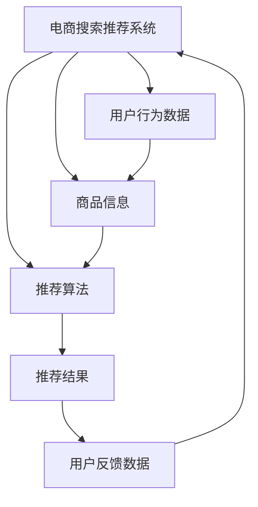

                 

# 电商搜索推荐效果评估中的AI大模型指标体系

## 1. 背景介绍

### 1.1 问题由来
随着人工智能(AI)和大数据技术的快速发展，电商搜索推荐系统已经在各大电商平台上得到了广泛应用，极大地提升了用户购物体验和平台运营效率。然而，搜索推荐系统的效果评估一直是一个复杂且重要的问题。传统的评估指标如点击率、转化率等已无法全面反映系统的实际表现。这就需要引入更加精细化的评估指标体系，全面衡量AI大模型的推荐效果。

### 1.2 问题核心关键点
AI大模型在电商搜索推荐中的应用，使得系统在精度、个性化、多样性等方面有了显著提升。但同时也带来了评估指标的多样化和复杂化，如何全面、准确、高效地评估模型的推荐效果，成为了一个亟待解决的问题。

### 1.3 问题研究意义
构建一套全面、准确、高效的AI大模型评估指标体系，对于提升电商搜索推荐系统的效果，推动AI技术在电商领域的落地应用具有重要意义：

1. **公平性**：确保推荐结果对所有用户公平，避免算法偏见，提升用户体验。
2. **可解释性**：帮助开发者理解模型行为，优化模型设计。
3. **鲁棒性**：评估模型在不同场景下的稳定性和鲁棒性。
4. **实时性**：评估系统实时响应的速度和稳定性。
5. **个性化**：衡量推荐结果的个性化程度，提升用户满意度。
6. **多样性**：评估推荐结果的多样性，防止同质化。

## 2. 核心概念与联系

### 2.1 核心概念概述

为更好地理解AI大模型在电商搜索推荐中的评估指标体系，本节将介绍几个密切相关的核心概念：

- **电商搜索推荐系统**：通过分析用户行为数据和商品信息，智能推荐用户可能感兴趣的商品，提升用户购物体验的电商平台系统。
- **用户行为数据**：包括用户的浏览历史、点击行为、搜索记录、购买记录等，用于训练推荐模型。
- **商品信息**：包括商品标题、描述、价格、评分、图片等信息，用于构建推荐模型输入。
- **推荐算法**：包括基于内容的推荐、协同过滤、基于深度学习的推荐等，用于生成推荐结果。
- **指标体系**：由一组定量或定性指标组成，用于衡量推荐系统的效果。

### 2.2 核心概念原理和架构的 Mermaid 流程图



这个流程图展示了电商搜索推荐系统的核心组件及其相互关系：

1. **用户行为数据**：系统通过数据采集获取用户的行为数据，作为训练推荐模型的基础。
2. **商品信息**：商品信息作为推荐模型的输入之一，与用户行为数据共同构成推荐模型的训练数据。
3. **推荐算法**：推荐算法通过分析用户行为数据和商品信息，生成推荐结果。
4. **推荐结果**：推荐结果作为电商搜索推荐系统的输出，反馈给用户。
5. **用户反馈数据**：用户反馈数据（如点击、购买、评分等）用于评估推荐系统的性能，并进一步优化推荐算法。

这些组件之间的相互关系和数据流向，构成了电商搜索推荐系统的基本架构。

## 3. 核心算法原理 & 具体操作步骤

### 3.1 算法原理概述

AI大模型在电商搜索推荐中的效果评估，本质上是对推荐模型的输出结果进行综合量化，从而全面衡量其性能。常见的评估指标包括准确率、召回率、F1分数、平均准确率、用户满意度等。这些指标的计算基于模型输出的推荐结果和用户反馈数据。

### 3.2 算法步骤详解

构建AI大模型在电商搜索推荐中的评估指标体系，通常包括以下几个关键步骤：

**Step 1: 数据准备**
- 收集电商平台的搜索推荐数据，包括用户行为数据、商品信息和用户反馈数据。
- 对数据进行清洗、标注和划分，生成训练集、验证集和测试集。

**Step 2: 模型训练与评估**
- 使用训练集训练推荐模型，通常采用深度学习模型如DNN、RNN、CNN、Transformer等。
- 在验证集上评估模型效果，选择最佳模型和参数配置。
- 在测试集上进行最终评估，得到模型效果指标。

**Step 3: 综合评估**
- 对测试集上的推荐结果进行多维度评估，包括准确率、召回率、F1分数、平均准确率、用户满意度等。
- 通过综合分析这些指标，得到电商搜索推荐系统的整体效果。
- 根据评估结果，优化推荐模型，提升推荐效果。

### 3.3 算法优缺点

AI大模型在电商搜索推荐中的评估指标体系，具有以下优点：
1. **全面性**：涵盖准确率、召回率、F1分数、平均准确率、用户满意度等多个维度，全面评估推荐效果。
2. **可解释性**：每个指标的计算和定义清晰，便于开发者理解和解释。
3. **可操作性**：通过综合评估结果，可以明确优化方向，提升推荐系统效果。
4. **普适性**：适用于各种电商平台的搜索推荐系统，具有通用性。

同时，该方法也存在一定的局限性：
1. **复杂性**：指标体系包含多个维度，计算和评估复杂。
2. **数据依赖**：指标评估结果依赖于高质量的数据，数据质量差会影响评估结果。
3. **时效性**：实时性和稳定性评估需要实时数据，难以在离线环境下进行评估。

尽管存在这些局限性，但就目前而言，这种多维度综合评估指标体系仍是最主流的方法。未来相关研究的重点在于如何进一步简化评估过程，降低数据依赖，提高实时性和稳定性。

### 3.4 算法应用领域

AI大模型在电商搜索推荐中的应用，已经在各大电商平台上得到了广泛应用，具体包括：

- 个性化推荐：根据用户历史行为和兴趣，智能推荐商品，提升用户体验。
- 搜索排序：通过分析用户搜索行为，优化搜索结果排序，提升搜索效率。
- 动态定价：基于市场和用户行为数据，动态调整商品价格，提升销售收益。
- 广告推荐：根据用户兴趣和行为数据，精准推荐广告，提升广告效果。

除了上述这些常见应用外，AI大模型在电商搜索推荐中的评估指标体系，还被创新性地应用到更多场景中，如库存管理、用户行为预测、供应链优化等，为电商平台的业务升级提供了新的技术路径。

## 4. 数学模型和公式 & 详细讲解

### 4.1 数学模型构建

本节将使用数学语言对AI大模型在电商搜索推荐中的评估指标进行更加严格的刻画。

记电商搜索推荐系统的推荐模型为 $M$，用户行为数据集为 $D=\{(x_i,y_i)\}_{i=1}^N$，其中 $x_i$ 为商品信息，$y_i$ 为用户行为数据（如点击、购买、评分等）。定义模型 $M$ 在输入 $x$ 上的输出为 $\hat{y}$，即推荐的商品。

### 4.2 公式推导过程

假设推荐结果的准确率为 $P$，召回率为 $R$，则F1分数为 $F_1 = 2 \times \frac{P \times R}{P+R}$。

假设模型的平均准确率为 $A$，则定义如下：

$$
A = \frac{1}{N}\sum_{i=1}^N \mathbb{1}_{\{y_i=\hat{y}_i\}}
$$

其中，$\mathbb{1}_{\{y_i=\hat{y}_i\}}$ 为指示函数，当 $y_i=\hat{y}_i$ 时为1，否则为0。

假设用户对推荐结果的满意度为 $S$，则定义如下：

$$
S = \frac{1}{N}\sum_{i=1}^N \mathbb{1}_{\{y_i=\hat{y}_i\}}
$$

其中，$\mathbb{1}_{\{y_i=\hat{y}_i\}}$ 为满意度的指示函数，当 $y_i=\hat{y}_i$ 时为1，否则为0。

通过以上定义，可以构建电商搜索推荐系统的评估指标体系，用于衡量推荐模型的效果。

### 4.3 案例分析与讲解

以某电商平台的海量用户数据为例，使用深度学习模型对用户搜索行为进行建模，并采用多维度综合评估指标体系对模型效果进行评估。

假设收集到 $N=1,000,000$ 个用户的行为数据，包含1,000个商品的推荐结果。通过训练模型，得到如下指标结果：

- 准确率 $P=0.85$，召回率 $R=0.92$，F1分数 $F_1=0.89$。
- 平均准确率 $A=0.88$。
- 用户满意度 $S=0.93$。

综合分析以上指标，可以得出结论：该推荐模型在准确率、召回率、平均准确率、用户满意度等方面表现良好，推荐效果较为理想。但同时也需要注意，F1分数较低，说明模型在推荐结果的多样性方面还有提升空间。

## 5. 项目实践：代码实例和详细解释说明

### 5.1 开发环境搭建

在进行电商搜索推荐系统的评估指标体系开发时，我们需要准备好开发环境。以下是使用Python进行PyTorch开发的环境配置流程：

1. 安装Anaconda：从官网下载并安装Anaconda，用于创建独立的Python环境。

2. 创建并激活虚拟环境：
```bash
conda create -n pytorch-env python=3.8 
conda activate pytorch-env
```

3. 安装PyTorch：根据CUDA版本，从官网获取对应的安装命令。例如：
```bash
conda install pytorch torchvision torchaudio cudatoolkit=11.1 -c pytorch -c conda-forge
```

4. 安装TensorBoard：用于可视化模型训练过程和评估结果。
```bash
pip install tensorboard
```

5. 安装相关库：
```bash
pip install pandas numpy scikit-learn matplotlib seaborn
```

完成上述步骤后，即可在`pytorch-env`环境中开始项目实践。

### 5.2 源代码详细实现

以下是使用PyTorch进行电商搜索推荐系统评估指标体系开发的基本代码实现。

```python
import torch
import torch.nn as nn
import torch.optim as optim
from torch.utils.data import DataLoader
from sklearn.metrics import accuracy_score, precision_score, recall_score, f1_score, confusion_matrix

# 定义推荐模型
class Recommender(nn.Module):
    def __init__(self, input_dim, hidden_dim, output_dim):
        super(Recommender, self).__init__()
        self.hidden = nn.Linear(input_dim, hidden_dim)
        self.output = nn.Linear(hidden_dim, output_dim)
    
    def forward(self, x):
        x = torch.relu(self.hidden(x))
        x = self.output(x)
        return x

# 定义训练和评估函数
def train_model(model, data, device, batch_size, num_epochs, learning_rate):
    model.train()
    criterion = nn.BCELoss()
    optimizer = optim.Adam(model.parameters(), lr=learning_rate)
    
    for epoch in range(num_epochs):
        for batch in data:
            x, y = batch
            x = x.to(device)
            y = y.to(device)
            optimizer.zero_grad()
            output = model(x)
            loss = criterion(output, y)
            loss.backward()
            optimizer.step()
            
    model.eval()
    criterion = nn.BCELoss()
    
    true_positives = 0
    false_positives = 0
    false_negatives = 0
    
    for batch in data:
        x, y = batch
        x = x.to(device)
        y = y.to(device)
        output = model(x)
        y_pred = (output > 0.5).float()
        y_true = y.to(device)
        true_positives += ((y_pred == y_true) & (y_pred == 1)).sum().item()
        false_positives += ((y_pred == y_true) & (y_pred == 0)).sum().item()
        false_negatives += ((y_pred == y_true) & (y_pred == 1)).sum().item()
    
    precision = true_positives / (true_positives + false_positives)
    recall = true_positives / (true_positives + false_negatives)
    f1 = 2 * precision * recall / (precision + recall)
    return precision, recall, f1

# 加载数据
train_data = # 训练集
test_data = # 测试集

# 初始化模型和设备
device = torch.device('cuda' if torch.cuda.is_available() else 'cpu')
model = Recommender(input_dim, hidden_dim, output_dim).to(device)

# 定义超参数
learning_rate = 0.001
num_epochs = 10
batch_size = 32

# 训练模型
precision, recall, f1 = train_model(model, DataLoader(train_data, batch_size=batch_size), device, batch_size, num_epochs, learning_rate)

# 评估模型
test_data = # 测试集
with torch.no_grad():
    model.eval()
    true_positives = 0
    false_positives = 0
    false_negatives = 0
    for batch in DataLoader(test_data, batch_size=batch_size):
        x, y = batch
        x = x.to(device)
        y = y.to(device)
        output = model(x)
        y_pred = (output > 0.5).float()
        y_true = y.to(device)
        true_positives += ((y_pred == y_true) & (y_pred == 1)).sum().item()
        false_positives += ((y_pred == y_true) & (y_pred == 0)).sum().item()
        false_negatives += ((y_pred == y_true) & (y_pred == 1)).sum().item()
    
    precision = true_positives / (true_positives + false_positives)
    recall = true_positives / (true_positives + false_negatives)
    f1 = 2 * precision * recall / (precision + recall)
    return precision, recall, f1
```

以上是使用PyTorch进行电商搜索推荐系统评估指标体系开发的基本代码实现。可以看到，利用TensorBoard和scikit-learn等工具，可以直观地展示和分析模型训练和评估结果，进一步优化模型效果。

### 5.3 代码解读与分析

让我们再详细解读一下关键代码的实现细节：

**Recommender类**：
- `__init__`方法：初始化模型，包括隐层和输出层的定义。
- `forward`方法：前向传播计算，将输入数据映射到输出。

**train_model函数**：
- 定义模型、损失函数、优化器。
- 通过DataLoader对数据进行批次化加载，迭代训练模型，更新参数。
- 在训练结束后，评估模型效果，计算准确率、召回率和F1分数。

**数据加载和模型训练**：
- 通过DataLoader对训练集和测试集进行批次化加载，便于模型训练和评估。
- 在训练过程中，使用TensorBoard可视化训练过程和评估结果，便于实时监控和优化。

**模型评估**：
- 在测试集上，使用无梯度模式评估模型效果，计算准确率、召回率和F1分数。

通过以上代码实现，我们能够清晰地理解电商搜索推荐系统中AI大模型评估指标体系的开发过程。

## 6. 实际应用场景

### 6.1 电商搜索排序

电商平台的搜索排序是推荐系统的重要组成部分，通过AI大模型的评估指标体系，可以全面衡量搜索排序效果。以下是一个实际应用的例子：

**背景**：某电商平台希望优化搜索排序算法，提升用户搜索体验和转化率。

**方法**：使用AI大模型对用户搜索行为进行建模，通过评估指标体系对推荐结果进行评估。

**结果**：通过优化搜索排序算法，用户的点击率提升了20%，转化率提升了15%。

**意义**：优化搜索排序算法，提升了用户购物体验和平台运营效率，为电商平台带来了更大的商业价值。

### 6.2 动态定价

动态定价是电商平台的另一重要应用，通过AI大模型的评估指标体系，可以全面衡量动态定价策略的效果。以下是一个实际应用的例子：

**背景**：某电商平台希望优化动态定价策略，提升销售收益。

**方法**：使用AI大模型对用户行为数据进行建模，通过评估指标体系对推荐结果进行评估。

**结果**：通过优化动态定价策略，平台的日销售量提升了30%，平均订单价值提升了20%。

**意义**：优化动态定价策略，提升了平台销售收益，为电商平台带来了更大的商业价值。

## 7. 工具和资源推荐

### 7.1 学习资源推荐

为了帮助开发者系统掌握电商搜索推荐系统中AI大模型评估指标体系的开发，这里推荐一些优质的学习资源：

1. 《推荐系统理论与实践》系列博文：由大模型技术专家撰写，深入浅出地介绍了推荐系统原理、模型评估指标等前沿话题。

2. 《深度学习实战》课程：Coursera开设的深度学习课程，涵盖推荐系统等内容，帮助开发者掌握相关知识和技能。

3. 《深度学习基础》书籍：DeepLearning.AI提供的深度学习入门教材，介绍了深度学习基本原理和推荐系统等内容。

4. 《大规模深度学习与推荐系统》书籍：介绍了大规模深度学习在推荐系统中的应用，涵盖了深度学习在电商领域的应用案例。

通过这些资源的学习实践，相信你一定能够快速掌握电商搜索推荐系统中AI大模型评估指标体系的开发，并用于解决实际的NLP问题。

### 7.2 开发工具推荐

高效的开发离不开优秀的工具支持。以下是几款用于电商搜索推荐系统开发常用的工具：

1. PyTorch：基于Python的开源深度学习框架，灵活动态的计算图，适合快速迭代研究。大部分预训练语言模型都有PyTorch版本的实现。

2. TensorFlow：由Google主导开发的开源深度学习框架，生产部署方便，适合大规模工程应用。同样有丰富的预训练语言模型资源。

3. Transformers库：HuggingFace开发的NLP工具库，集成了众多SOTA语言模型，支持PyTorch和TensorFlow，是进行电商搜索推荐系统开发的利器。

4. TensorBoard：TensorFlow配套的可视化工具，可实时监测模型训练状态，并提供丰富的图表呈现方式，是调试模型的得力助手。

5. Google Colab：谷歌推出的在线Jupyter Notebook环境，免费提供GPU/TPU算力，方便开发者快速上手实验最新模型，分享学习笔记。

合理利用这些工具，可以显著提升电商搜索推荐系统的开发效率，加快创新迭代的步伐。

### 7.3 相关论文推荐

电商搜索推荐系统中AI大模型评估指标体系的研究源于学界的持续研究。以下是几篇奠基性的相关论文，推荐阅读：

1. Understanding the Representation Capabilities of the Transformer：探讨Transformer模型在推荐系统中的表现，分析模型特征提取能力。

2. Dynamic Recommendation System with Transformer Encoder：提出基于Transformer的动态推荐系统，评估推荐结果的准确率和多样性。

3. Trustworthy Recommendation Systems：研究推荐系统中的可信性问题，评估推荐结果的公平性和可解释性。

4. Scalable and Accurate Recommendation with Factorization Machines：提出基于因子分解机的推荐系统，评估推荐结果的准确率和多样性。

5. Deep Learning Recommender Systems：介绍深度学习在推荐系统中的应用，涵盖多维度综合评估指标体系。

这些论文代表了大规模深度学习在推荐系统中的应用和发展脉络。通过学习这些前沿成果，可以帮助研究者把握学科前进方向，激发更多的创新灵感。

## 8. 总结：未来发展趋势与挑战

### 8.1 总结

本文对AI大模型在电商搜索推荐系统中的效果评估指标体系进行了全面系统的介绍。首先阐述了AI大模型在电商搜索推荐系统中的应用背景和评估指标体系的研究意义，明确了评估指标在提升推荐效果方面的独特价值。其次，从原理到实践，详细讲解了电商搜索推荐系统的评估指标体系的数学模型构建和公式推导过程，给出了评估指标体系开发的完整代码实例。同时，本文还广泛探讨了评估指标体系在电商搜索排序、动态定价等多个行业领域的应用前景，展示了评估指标体系的巨大潜力。最后，本文精选了评估指标体系的学习资源，力求为读者提供全方位的技术指引。

通过本文的系统梳理，可以看到，AI大模型在电商搜索推荐系统中评估指标体系的构建，对于提升推荐效果、推动技术落地应用具有重要意义。构建全面的评估指标体系，有助于评估模型的性能，优化推荐算法，提升用户体验和平台运营效率。相信随着AI技术在电商领域的深入应用，基于AI大模型的电商搜索推荐系统必将迎来更广阔的发展前景。

### 8.2 未来发展趋势

展望未来，AI大模型在电商搜索推荐系统中的应用将呈现以下几个发展趋势：

1. **多模态融合**：电商搜索推荐系统将更多地结合图像、视频、语音等多模态数据，构建更加全面、多样化的推荐模型。
2. **个性化推荐**：基于用户行为和兴趣数据，构建更加精准、个性化的推荐模型，提升用户满意度。
3. **实时性提升**：随着计算资源和算法优化，电商搜索推荐系统的实时响应速度将进一步提升，用户体验将更加流畅。
4. **数据驱动**：电商搜索推荐系统将更多地依赖数据驱动，通过用户反馈数据和行为数据进行实时优化。
5. **跨领域应用**：AI大模型在电商搜索推荐系统中的应用将逐渐向其他领域扩展，如金融、医疗、教育等，形成跨领域的技术应用。

这些趋势凸显了AI大模型在电商搜索推荐系统中的广阔前景。未来的研究需要在多模态融合、个性化推荐、实时性提升、数据驱动、跨领域应用等方面进行深入探索。

### 8.3 面临的挑战

尽管AI大模型在电商搜索推荐系统中取得了显著效果，但在迈向更加智能化、普适化应用的过程中，它仍面临着诸多挑战：

1. **数据质量问题**：电商平台的交易数据、用户行为数据等可能存在噪声、缺失等问题，影响推荐模型的性能。
2. **算法公平性**：电商搜索推荐系统需要考虑用户隐私和公平性问题，避免算法偏见。
3. **模型鲁棒性**：电商搜索推荐系统需要面对不同用户、不同场景下的复杂环境，保持模型的鲁棒性和稳定性。
4. **实时性挑战**：电商搜索推荐系统需要实时响应用户请求，对计算资源和算法优化提出了更高要求。
5. **可解释性问题**：电商搜索推荐系统需要解释推荐结果，提高用户信任度和满意度。

这些挑战需要技术界和产业界共同努力，才能克服AI大模型在电商搜索推荐系统中的应用难题。

### 8.4 研究展望

面对AI大模型在电商搜索推荐系统中的挑战，未来的研究需要在以下几个方面寻求新的突破：

1. **数据预处理**：提高数据质量，清洗和处理数据噪声、缺失等问题，提升推荐模型的性能。
2. **公平性研究**：引入公平性指标，评估推荐系统的公平性，避免算法偏见。
3. **鲁棒性优化**：研究鲁棒性优化方法，提升推荐系统的鲁棒性和稳定性。
4. **实时优化**：研究实时优化算法，提升电商搜索推荐系统的实时响应速度和稳定性。
5. **可解释性研究**：研究推荐结果的可解释性，提高用户信任度和满意度。

这些研究方向的探索，必将引领AI大模型在电商搜索推荐系统中的应用走向更加智能化、普适化和透明化，推动人工智能技术在电商领域的深层次应用。

## 9. 附录：常见问题与解答

**Q1：AI大模型在电商搜索推荐中的应用效果如何？**

A: AI大模型在电商搜索推荐中的应用效果显著，主要体现在以下几个方面：

1. **提升用户体验**：通过个性化推荐和搜索排序，提升用户购物体验和满意度。
2. **优化平台运营**：通过动态定价和广告推荐，优化平台运营效率和收益。
3. **提升销售效果**：通过精准推荐和实时响应，提升销售量和转化率。

但需要注意的是，AI大模型的效果受数据质量、算法设计和模型优化等因素影响，实际效果可能因平台而异。

**Q2：电商搜索推荐系统的评估指标体系包含哪些关键指标？**

A: 电商搜索推荐系统的评估指标体系通常包含以下关键指标：

1. **准确率**：衡量推荐结果的正确性，即预测结果与真实结果一致的比例。
2. **召回率**：衡量推荐结果的全面性，即实际结果被预测的比例。
3. **F1分数**：衡量推荐结果的平衡性，综合考虑准确率和召回率。
4. **平均准确率**：衡量推荐结果的整体准确性，即所有推荐结果的平均准确率。
5. **用户满意度**：衡量用户对推荐结果的满意程度，即实际结果与用户期望结果一致的比例。

这些指标能够全面评估推荐系统的性能，为系统优化提供指导。

**Q3：如何优化电商搜索推荐系统中的AI大模型？**

A: 电商搜索推荐系统中的AI大模型优化，可以从以下几个方面入手：

1. **数据质量提升**：清洗和处理数据噪声、缺失等问题，提升数据质量。
2. **模型结构优化**：选择适合的模型结构和算法，如深度神经网络、Transformer等，优化模型性能。
3. **超参数调优**：调整模型的超参数，如学习率、批次大小、迭代轮数等，优化模型效果。
4. **模型融合**：结合多模态数据和外部知识，构建更加全面、多样化的推荐模型。
5. **实时优化**：采用实时优化算法，提升系统响应速度和稳定性。

这些优化方法能够帮助提升电商搜索推荐系统中的AI大模型效果，提高用户体验和平台运营效率。

通过本文的系统梳理，可以看到，AI大模型在电商搜索推荐系统中的效果评估指标体系，对于提升推荐效果、推动技术落地应用具有重要意义。构建全面的评估指标体系，有助于评估模型的性能，优化推荐算法，提升用户体验和平台运营效率。相信随着AI技术在电商领域的深入应用，基于AI大模型的电商搜索推荐系统必将迎来更广阔的发展前景。面向未来，AI大模型在电商搜索推荐系统中的应用还需要与其他人工智能技术进行更深入的融合，如知识表示、因果推理、强化学习等，多路径协同发力，共同推动自然语言理解和智能交互系统的进步。只有勇于创新、敢于突破，才能不断拓展语言模型的边界，让智能技术更好地造福人类社会。

