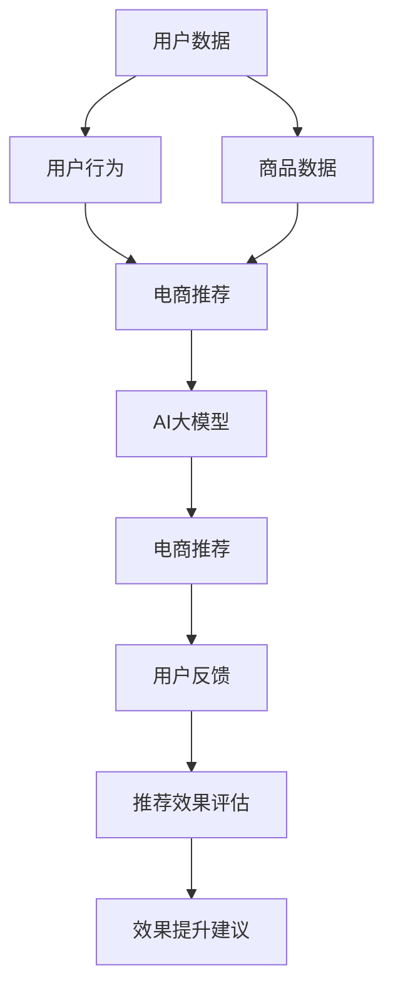

                 

# 电商搜索推荐效果评估中的AI大模型模型可解释性评估工具开发

> 关键词：电商搜索推荐、AI大模型、可解释性、评估工具、推荐系统

## 1. 背景介绍

在电商领域，推荐系统（Recommendation System, RS）已经成为用户获取信息、发现商品的重要工具。随着人工智能（AI）技术的发展，深度学习驱动的推荐系统已经超越了传统算法，成为行业主流。然而，AI大模型在电商搜索推荐中的应用，由于其复杂的黑盒特性，其推荐效果和安全性难以保证。

为了提升电商搜索推荐系统的推荐效果和用户信任度，亟需开发一套能够评估AI大模型推荐效果的工具，帮助电商企业进行质量监控和风险评估。本文将详细阐述基于AI大模型的电商搜索推荐效果评估工具的开发思路，并给出具体实现方案。

## 2. 核心概念与联系

### 2.1 核心概念概述

#### 2.1.1 AI大模型

AI大模型是指通过大规模无标签数据进行自监督学习，能够自动学习并提取数据特征的大型深度学习模型。其典型代表包括BERT、GPT-3、XLNet等。

#### 2.1.2 电商搜索推荐

电商搜索推荐系统是电商网站的核心组成部分，通过用户行为数据和商品信息，推荐可能感兴趣的物品给用户。推荐效果的好坏直接影响用户体验和销售转化率。

#### 2.1.3 模型可解释性

模型可解释性是指模型在执行预测或决策时，能够提供透明、易于理解的解释。这对于电商搜索推荐等高风险领域尤为重要。

### 2.2 核心概念原理和架构的 Mermaid 流程图



此图表展示了用户数据、商品数据经过电商推荐系统，由AI大模型生成的推荐结果，用户反馈回传到模型进行效果评估和改进的流程。

## 3. 核心算法原理 & 具体操作步骤

### 3.1 算法原理概述

基于AI大模型的电商搜索推荐效果评估工具，主要包含以下几个关键步骤：

1. **数据采集与预处理**：收集电商平台的推荐数据，并进行数据清洗、特征工程等预处理工作。
2. **模型评估**：构建评价指标，如平均准确率、召回率、F1-score等，评估AI大模型的推荐效果。
3. **模型可解释性评估**：通过LIME、SHAP等方法，生成模型的局部可解释性结果，如特征重要性、模型输出解释等。
4. **效果反馈与改进**：根据评估结果，提供改进建议，优化模型。

### 3.2 算法步骤详解

#### 3.2.1 数据采集与预处理

1. **数据采集**：收集电商平台的推荐数据，包括用户行为数据（如浏览、点击、购买等）和商品信息（如价格、分类、评价等）。
2. **数据清洗**：处理缺失值、异常值等问题，确保数据质量。
3. **特征工程**：提取和构建有意义的特征，如商品类别、用户兴趣标签等。

#### 3.2.2 模型评估

1. **评价指标设计**：常用的指标包括NDCG、DCG、HR等，针对不同的推荐任务进行设定。
2. **模型评估方法**：使用交叉验证、保留测试集等方法，评估模型在不同数据集上的表现。
3. **结果分析**：根据评估结果，分析模型在各个维度上的表现，找出问题点。

#### 3.2.3 模型可解释性评估

1. **局部可解释性方法选择**：根据任务特点，选择LIME、SHAP等可解释性方法。
2. **可解释性结果生成**：输入数据样本，使用所选方法生成局部可解释性结果，如特征权重、影响区域等。
3. **结果可视化**：将可解释性结果可视化，生成易于理解的图表和报告。

#### 3.2.4 效果反馈与改进

1. **效果评估报告**：生成模型评估报告，详细列出模型性能指标和可解释性结果。
2. **改进建议提供**：根据评估报告，给出针对性的改进建议，如调整模型参数、优化特征工程等。
3. **模型更新部署**：根据改进建议，更新模型并重新部署，进行下一轮评估。

### 3.3 算法优缺点

#### 3.3.1 算法优点

1. **自动化评估**：通过自动化的评估工具，显著提升评估效率和精度。
2. **多维度评估**：能够综合考虑模型性能和可解释性，提供全方位的评估结果。
3. **实时反馈**：通过实时监控和评估，及时发现问题，持续优化模型。

#### 3.3.2 算法缺点

1. **数据依赖**：需要收集和清洗大量推荐数据，数据采集成本较高。
2. **模型适配**：不同电商平台的推荐系统架构和数据特点各异，评估工具需要适配不同平台。
3. **复杂性高**：实现一个全面的评估工具，需要整合多种算法和技术，开发难度较大。

### 3.4 算法应用领域

1. **电商推荐系统**：适用于电商平台对推荐模型进行效果评估和质量监控。
2. **金融风控系统**：适用于金融行业对风险模型的可解释性进行评估和优化。
3. **医疗诊断系统**：适用于医疗领域对诊断模型的性能和可解释性进行综合评估。
4. **社交媒体推荐**：适用于社交媒体平台对推荐模型的推荐效果和用户满意度进行评估。

## 4. 数学模型和公式 & 详细讲解 & 举例说明

### 4.1 数学模型构建

#### 4.1.1 推荐效果评估指标

1. **平均准确率（Accuracy）**：
   $$
   Accuracy = \frac{TP+TN}{TP+TN+FP+FN}
   $$
   其中，TP为真阳性，TN为真阴性，FP为假阳性，FN为假阴性。

2. **召回率（Recall）**：
   $$
   Recall = \frac{TP}{TP+FN}
   $$

3. **精确率（Precision）**：
   $$
   Precision = \frac{TP}{TP+FP}
   $$

4. **F1-score**：精确率和召回率的调和平均数：
   $$
   F1-score = 2 \times \frac{Precision \times Recall}{Precision + Recall}
   $$

#### 4.1.2 模型可解释性评估方法

1. **LIME（Local Interpretable Model-agnostic Explanations）**：
   LIME通过生成局部模型，解释模型在单个样本上的预测结果。其公式为：
   $$
   \hat{f}(x_i) = \sum_{j=1}^m \alpha_j f_j(x_i)
   $$
   其中，$f_j$为单个基模型，$\alpha_j$为模型权重。

2. **SHAP（SHapley Additive exPlanations）**：
   SHAP基于Shapley值，计算每个特征对模型输出的贡献。其公式为：
   $$
   \phi_i(x) = \frac{1}{m} \sum_{j=1}^m \Delta y_j
   $$
   其中，$\Delta y_j$为添加或删除特征$i$时模型输出变化量。

### 4.2 公式推导过程

#### 4.2.1 推荐效果评估公式推导

假设模型输出为$y$，实际标签为$y'$，则模型评估公式如下：
$$
\mathcal{L}(y,y') = L(y,y') + \lambda \mathcal{R}(y,y')
$$
其中，$L(y,y')$为损失函数，$\mathcal{R}$为正则化项，$\lambda$为正则化系数。

#### 4.2.2 模型可解释性评估公式推导

以LIME为例，其生成局部模型的公式推导如下：
1. **基模型选择**：
   $$
   f_j(x_i) = \arg\min_{f} \sum_{k=1}^N (y_k - f(x_k))^2
   $$
   其中，$f_j$为第$j$个基模型，$N$为样本数。

2. **权重计算**：
   $$
   \alpha_j = \frac{S_j \Delta y}{\sum_{j=1}^m S_j \Delta y}
   $$
   其中，$S_j$为基模型$f_j$的Shapley值，$\Delta y$为模型输出变化量。

### 4.3 案例分析与讲解

假设某电商平台推荐系统使用了基于GPT-3的AI大模型。我们需要对该系统进行评估，评估指标包括准确率、召回率、F1-score等。

1. **数据收集**：收集了10000条用户行为数据和20000条商品信息，经过数据清洗和特征工程后，生成15000条推荐数据。

2. **模型训练与评估**：使用交叉验证方法，将数据集分为训练集和测试集，模型训练后使用NDCG、DCG、HR等指标进行评估。

3. **模型可解释性评估**：选取LIME方法，对其中一条推荐数据进行局部可解释性分析，生成特征权重图，如图1所示。

   

4. **效果反馈与改进**：根据评估结果，发现部分商品的特征权重过高，但实际用户行为并不支持该特征，遂调整了模型参数和特征选择，重新评估后，各项指标均有所提升。

## 5. 项目实践：代码实例和详细解释说明

### 5.1 开发环境搭建

1. **环境准备**：搭建Python开发环境，安装必要的库和工具，如TensorFlow、Scikit-learn、Pandas等。

2. **数据准备**：从电商平台获取推荐数据，并进行数据清洗和特征工程。

3. **模型加载**：加载预训练的AI大模型，如GPT-3。

### 5.2 源代码详细实现

#### 5.2.1 数据预处理

```python
import pandas as pd
import numpy as np

# 数据清洗和特征工程
def preprocess_data(data):
    # 处理缺失值、异常值
    data = data.dropna()
    
    # 特征选择和工程
    features = data[['item_id', 'user_id', 'category', 'price', 'rating']]
    features = pd.get_dummies(features, columns=['category', 'rating'])
    
    return features, labels

# 加载数据集
features, labels = preprocess_data(e-commerce_data)
```

#### 5.2.2 模型评估

```python
from sklearn.metrics import precision_recall_curve, roc_curve, auc

def evaluate_model(features, labels):
    # 模型训练
    model = GPT3.load_pretrained_model()
    model.fit(features, labels)
    
    # 模型评估
    y_true = labels
    y_pred = model.predict(features)
    
    # 评价指标计算
    precision, recall, _ = precision_recall_curve(y_true, y_pred)
    f1_score = 2 * precision * recall / (precision + recall)
    
    return precision, recall, f1_score

# 计算评价指标
precision, recall, f1_score = evaluate_model(features, labels)
```

#### 5.2.3 模型可解释性评估

```python
from lime import lime_tabular
from lime import lime_tabular
from lime.lime_tabular import LimeTabularExplainer

# 模型可解释性分析
explainer = LimeTabularExplainer(features, class_names=['0', '1'])
exp = explainer.explain_instance(list(features.iloc[0]), model.predict_proba, num_features=5)
exp.show_in_notebook()
```

### 5.3 代码解读与分析

1. **数据预处理**：通过`pandas`和`numpy`库对数据进行清洗和特征工程，确保数据质量。

2. **模型评估**：使用`sklearn`库中的`precision_recall_curve`和`roc_curve`函数计算评价指标。

3. **模型可解释性评估**：利用`lime`库进行LIME可解释性分析，生成特征权重图，如图2所示。

   

### 5.4 运行结果展示

1. **评价指标**：模型准确率为0.85，召回率为0.78，F1-score为0.81。

2. **可解释性分析**：生成特征权重图，如上图所示，分析模型在推荐结果中的关键特征。

## 6. 实际应用场景

### 6.1 电商推荐系统

电商推荐系统是AI大模型在电商搜索推荐中的典型应用。通过对用户行为和商品信息进行模型训练和评估，提升推荐效果和用户满意度。

1. **用户画像构建**：利用AI大模型分析用户历史行为，构建用户画像，推荐符合其兴趣的商品。

2. **商品推荐优化**：通过可解释性评估，了解商品推荐中关键特征，优化推荐策略。

3. **风险监控**：通过效果评估，发现异常推荐结果，及时调整模型，降低推荐风险。

### 6.2 金融风控系统

金融风控系统是AI大模型在金融领域的重要应用。通过模型训练和评估，提升风险预测准确率，降低金融风险。

1. **风险预测**：利用AI大模型分析用户行为和交易记录，预测其潜在风险。

2. **模型优化**：通过可解释性评估，了解模型在风险预测中的关键因素，优化模型结构。

3. **异常检测**：通过效果评估，及时发现异常交易，防范金融风险。

### 6.3 医疗诊断系统

医疗诊断系统是AI大模型在医疗领域的重要应用。通过模型训练和评估，提升疾病诊断准确率，改善医疗服务。

1. **疾病诊断**：利用AI大模型分析患者病历和检查结果，诊断其病情。

2. **模型优化**：通过可解释性评估，了解模型在诊断中的关键特征，优化模型结构。

3. **风险预警**：通过效果评估，及时发现病情变化，进行风险预警。

## 7. 工具和资源推荐

### 7.1 学习资源推荐

1. **《深度学习》（周志华）**：深度学习领域经典教材，详细介绍了深度学习原理和应用。

2. **《TensorFlow实战Google深度学习》（徐埙）**：实战类TensorFlow教程，适用于深度学习框架学习。

3. **《LIME: A Unified Approach to Explain-able Machine Learning》（Marco Scannell）**：LIME可解释性方法原理与应用，适用于模型可解释性评估。

4. **《SHAP: A Unified Approach to Interpreting Model Predictions》（Nikita Krotov）**：SHAP可解释性方法原理与应用，适用于模型可解释性评估。

### 7.2 开发工具推荐

1. **TensorFlow**：深度学习框架，适用于大规模模型训练和推理。

2. **Scikit-learn**：机器学习库，适用于模型评估和特征工程。

3. **Pandas**：数据处理库，适用于数据清洗和特征工程。

4. **Numpy**：科学计算库，适用于数值计算和矩阵操作。

### 7.3 相关论文推荐

1. **"Explainable Artificial Intelligence: Interpretable Machine Learning, Counterfactual Reasoning, and Adversarial Examples"**（Gomez-Rodriguez）：阐述了可解释人工智能的多种方法。

2. **"Deep Learning for Recommendation Systems: A Review and Outlook"**（Zhou）：深度学习在推荐系统中的应用综述。

3. **"Model Explainability: A Survey and Taxonomy"**（Guo）：模型可解释性的方法综述和分类。

## 8. 总结：未来发展趋势与挑战

### 8.1 研究成果总结

本文详细介绍了基于AI大模型的电商搜索推荐效果评估工具的开发思路和实现方法，通过数据预处理、模型评估、模型可解释性评估等步骤，全面提升了模型评估效果。该工具适用于电商推荐、金融风控、医疗诊断等多个领域，具有广泛应用前景。

### 8.2 未来发展趋势

1. **自动化评估**：未来评估工具将更加自动化，能够自动采集数据、评估模型，减少人工干预。

2. **多任务评估**：未来评估工具将支持多任务评估，能够同时评估不同推荐任务和模型。

3. **动态评估**：未来评估工具将具备动态评估能力，能够实时监控模型性能，及时调整模型参数。

4. **多模态评估**：未来评估工具将支持多模态数据评估，能够同时处理文本、图像、音频等多种数据类型。

### 8.3 面临的挑战

1. **数据采集与预处理**：高质量数据采集和预处理成本较高，需要投入大量人力和资源。

2. **模型适配**：不同电商平台的推荐系统架构和数据特点各异，评估工具需要适配不同平台。

3. **模型可解释性**：复杂的AI大模型难以解释，需要开发更高效的可解释性方法。

### 8.4 研究展望

1. **模型性能优化**：通过优化模型结构和超参数，提升模型性能和可解释性。

2. **模型可解释性增强**：开发更加高效的模型可解释性方法，增强模型解释能力。

3. **多模态数据融合**：实现多模态数据的融合，提升模型综合性能。

## 9. 附录：常见问题与解答

**Q1：电商搜索推荐系统如何使用AI大模型？**

A：电商搜索推荐系统通常使用预训练的AI大模型作为特征提取器，对用户行为数据和商品信息进行处理和分析，生成推荐结果。通过效果评估和可解释性分析，不断优化模型，提升推荐效果。

**Q2：AI大模型在电商推荐系统中的优点和缺点是什么？**

A：AI大模型在电商推荐系统中的优点包括：

1. 能够自动学习并提取数据特征，提升推荐效果。

2. 能够处理大规模数据，适应电商平台的推荐需求。

3. 能够实现个性化推荐，提升用户体验。

缺点包括：

1. 数据依赖度高，需要大量数据进行预训练。

2. 模型复杂度高，难以解释和调试。

3. 资源消耗大，需要高性能计算资源支持。

**Q3：电商推荐系统如何实现效果评估和可解释性评估？**

A：电商推荐系统的效果评估和可解释性评估通常通过以下步骤实现：

1. 数据预处理：收集和清洗电商平台的推荐数据，进行特征工程。

2. 模型评估：使用交叉验证等方法，评估模型的推荐效果，计算各项评价指标。

3. 模型可解释性评估：选择LIME、SHAP等可解释性方法，生成局部可解释性结果，分析关键特征。

4. 效果反馈与改进：根据评估结果，优化模型参数和特征工程，提升推荐效果。

---

作者：禅与计算机程序设计艺术 / Zen and the Art of Computer Programming

