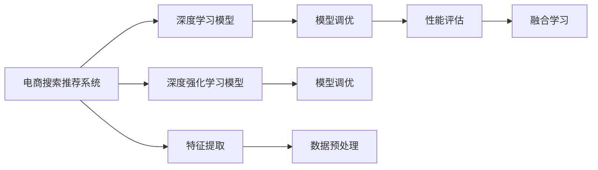

                 

# 电商搜索推荐系统的AI大模型优化策略

## 1. 背景介绍

### 1.1 问题由来

随着人工智能(AI)和大数据技术的迅猛发展，电商平台的数据驱动决策变得越来越智能。在搜索推荐系统(Search & Recommendation System, SRS)中，AI大模型的应用显著提升了用户满意度，增强了平台的用户粘性，并有效提高了转化率。然而，如何在大模型基础上进行高效、精准的优化，提升搜索推荐的精度和体验，仍然是一个亟需解决的问题。

### 1.2 问题核心关键点

电商搜索推荐系统中的大模型优化涉及多方面的内容，主要包括但不限于：

1. **数据预处理与特征工程**：如何对用户行为数据进行高效清洗、归一化和特征提取，提升模型的输入质量。
2. **模型训练与参数调优**：在已有的大模型基础上，如何调整模型结构、优化超参数，得到更加准确和高效的表现。
3. **算法设计与融合**：如何设计算法流程，将不同类型的模型（如深度学习模型、深度强化学习模型等）进行融合，提升整体系统的决策能力。
4. **性能评估与反馈**：如何构建高效的评估指标体系，实时监测模型表现，实现用户反馈的闭环优化。

这些核心问题对于电商搜索推荐系统的优化至关重要。解决这些问题，不仅能够提升系统的性能，还能确保模型的稳定性和可解释性，为电商平台提供可靠的用户体验。

### 1.3 问题研究意义

优化电商搜索推荐系统中的AI大模型，具有以下几个重要意义：

1. **提升用户体验**：通过高效的算法设计和模型优化，提升搜索结果的相关性和个性化推荐的效果，使用户更快地找到所需商品，提升购物体验。
2. **增加用户粘性**：通过精准的推荐，提升用户对平台的依赖度，增加用户留存率。
3. **提高转化率**：通过优化模型，提升推荐的转化率，提高电商平台的收入和盈利能力。
4. **优化成本结构**：通过自动化模型优化和智能决策，减少人工干预，降低运营成本。

## 2. 核心概念与联系

### 2.1 核心概念概述

为更好地理解电商搜索推荐系统中的大模型优化方法，本节将介绍几个关键概念：

1. **电商搜索推荐系统(SRS)**：使用AI技术为用户推荐商品，并为用户提供搜索结果的系统。典型的SRS系统包括电商平台、视频流媒体、新闻网站等。

2. **深度学习模型(Deep Learning Model)**：以多层神经网络为代表的学习模型，通过反向传播算法进行训练，可以从大量数据中学习到复杂的非线性关系。

3. **深度强化学习模型(Deep Reinforcement Learning Model)**：结合强化学习的机制，通过与环境交互，逐步提升模型的决策能力。

4. **特征提取(Feature Extraction)**：将原始数据转化为模型可以使用的特征向量的过程。

5. **模型调优(Model Tuning)**：在已有模型基础上，通过调整模型参数和超参数，提升模型性能的过程。

6. **性能评估(Performance Evaluation)**：通过设置合理的评估指标，测量模型的表现，并对模型进行迭代优化。

7. **数据预处理(Data Preprocessing)**：对原始数据进行清洗、归一化、特征工程等处理，提高数据质量。

8. **融合学习(Fusion Learning)**：将多种不同类型的模型进行融合，提升整体系统的表现。

这些概念之间有着紧密的联系，通过它们之间的交互和协同工作，可以实现电商搜索推荐系统的深度优化。

### 2.2 核心概念原理和架构的 Mermaid 流程图



## 3. 核心算法原理 & 具体操作步骤

### 3.1 算法原理概述

电商搜索推荐系统中的大模型优化，本质上是基于数据驱动的智能决策优化过程。其核心思想是通过对大量用户行为数据的学习，构建用户画像，预测用户行为，最终生成个性化的搜索结果和推荐。优化算法主要包括以下几个关键步骤：

1. **数据预处理**：对用户行为数据进行清洗、归一化和特征提取，提升输入数据质量。
2. **模型训练**：在已有的大模型基础上，调整模型参数和超参数，提升模型性能。
3. **模型调优**：通过自动调优或人工调优，进一步提升模型在特定任务上的表现。
4. **融合学习**：将不同类型的模型进行融合，提升整体系统的决策能力。
5. **性能评估**：通过设置合理的评估指标，测量模型的表现，并进行迭代优化。

### 3.2 算法步骤详解

电商搜索推荐系统中的大模型优化流程如下：

**Step 1: 数据预处理与特征工程**

- **数据清洗**：去除异常值、缺失值、重复值，确保数据质量。
- **归一化处理**：将数据转化为标准格式，便于模型处理。
- **特征提取**：使用TF-IDF、Word2Vec、Glove等方法，提取文本特征，或使用人工特征工程生成更有效的特征向量。

**Step 2: 模型训练**

- **选择合适的深度学习模型**：如CNN、RNN、LSTM、Transformer等。
- **调整模型参数和超参数**：如学习率、批大小、迭代次数等。
- **使用预训练模型**：如BERT、GPT等，通过微调或复用现有模型，减少计算成本。

**Step 3: 模型调优**

- **自动调优**：使用遗传算法、贝叶斯优化等自动调参方法，寻找最优参数组合。
- **人工调优**：根据模型表现，手动调整参数，进行迭代优化。

**Step 4: 融合学习**

- **模型融合**：将不同类型的模型进行集成，如将深度学习模型与深度强化学习模型结合，提升整体性能。
- **算法融合**：将不同算法进行融合，如将协同过滤算法与基于深度学习的方法结合，提升推荐精度。

**Step 5: 性能评估**

- **设置评估指标**：如精确率、召回率、F1分数、ROC曲线等。
- **实时监测**：使用监控工具，实时评估模型表现。
- **闭环优化**：根据用户反馈，进行模型迭代优化，提升用户体验。

### 3.3 算法优缺点

电商搜索推荐系统中的大模型优化算法具有以下优点：

1. **提升推荐精度**：通过高效的数据预处理和模型调优，显著提升推荐系统的准确性和个性化程度。
2. **降低计算成本**：使用预训练模型和自动调优，减少重复计算，提高计算效率。
3. **提高用户体验**：通过优化算法，提升搜索结果的相关性和推荐效果，使用户更快地找到所需商品，提升购物体验。
4. **减少人工干预**：通过自动化调优，减少人工干预，降低运营成本。

同时，该算法也存在一些局限性：

1. **对数据依赖度高**：需要高质量、多样化的数据，数据质量直接影响模型性能。
2. **计算资源消耗大**：优化过程需要大量计算资源，对硬件要求较高。
3. **算法复杂度高**：算法流程复杂，需要多种技术进行协同工作。
4. **可解释性不足**：部分优化算法如自动调优，难以解释其内部工作机制，可能导致模型决策的透明性不足。

### 3.4 算法应用领域

电商搜索推荐系统中的大模型优化方法，主要应用于以下几个领域：

1. **电商平台的搜索推荐**：通过优化算法，提升搜索结果的相关性和推荐效果，提高用户满意度。
2. **视频流媒体的推荐系统**：通过优化算法，提升推荐精度，提高用户粘性和满意度。
3. **新闻网站的个性化推荐**：通过优化算法，提高推荐的相关性，提升用户体验。

## 4. 数学模型和公式 & 详细讲解 & 举例说明

### 4.1 数学模型构建

假设电商搜索推荐系统中的用户行为数据为 $\mathcal{D}$，模型的输入特征为 $\mathbf{x}$，输出为 $\mathbf{y}$，模型的参数为 $\theta$。则模型可以表示为：

$$
\mathbf{y} = f_\theta(\mathbf{x})
$$

其中 $f_\theta$ 为模型函数，通常为深度学习模型。

### 4.2 公式推导过程

电商搜索推荐系统中，常用的模型包括基于深度学习的推荐模型和基于深度强化学习的推荐模型。以下以基于深度学习的协同过滤模型为例，进行公式推导。

**协同过滤模型**：

假设用户对物品的评分表示为 $R_{ui}$，用户 $u$ 的评分向量为 $\mathbf{r}_u$，物品 $i$ 的评分向量为 $\mathbf{r}_i$。则协同过滤模型的预测评分可以表示为：

$$
\hat{R}_{ui} = \mathbf{r}_u^\top \mathbf{r}_i
$$

其中 $\mathbf{r}_u$ 和 $\mathbf{r}_i$ 可以通过用户行为数据进行学习。

### 4.3 案例分析与讲解

以下以电商搜索推荐系统中的商品推荐为例，进行具体案例分析。

**问题描述**：
电商平台上某用户对多种商品进行了评分，如何根据用户评分历史，预测用户可能感兴趣的未评分商品。

**数据集**：
- 用户评分数据 $\mathcal{D} = \{(u_i, r_{ij})\}_{i=1}^{N_u}$
- 用户评分向量 $\mathbf{r}_u$
- 物品评分向量 $\mathbf{r}_i$

**优化流程**：
1. **数据预处理**：对用户评分数据进行清洗、归一化和特征提取，生成用户评分向量 $\mathbf{r}_u$ 和物品评分向量 $\mathbf{r}_i$。
2. **模型训练**：选择深度学习模型（如协同过滤模型），对评分向量进行训练，得到预测评分 $\hat{R}_{ui}$。
3. **模型调优**：通过自动调优或人工调优，优化模型参数，提高预测准确性。
4. **融合学习**：将推荐结果与用户行为数据进行融合，提升推荐效果。
5. **性能评估**：使用精确率、召回率、F1分数等指标评估模型表现。

## 5. 项目实践：代码实例和详细解释说明

### 5.1 开发环境搭建

在进行电商搜索推荐系统的大模型优化实践前，我们需要准备好开发环境。以下是使用Python进行PyTorch开发的环境配置流程：

1. 安装Anaconda：从官网下载并安装Anaconda，用于创建独立的Python环境。

2. 创建并激活虚拟环境：
```bash
conda create -n pytorch-env python=3.8 
conda activate pytorch-env
```

3. 安装PyTorch：根据CUDA版本，从官网获取对应的安装命令。例如：
```bash
conda install pytorch torchvision torchaudio cudatoolkit=11.1 -c pytorch -c conda-forge
```

4. 安装Transformers库：
```bash
pip install transformers
```

5. 安装各类工具包：
```bash
pip install numpy pandas scikit-learn matplotlib tqdm jupyter notebook ipython
```

完成上述步骤后，即可在`pytorch-env`环境中开始大模型优化实践。

### 5.2 源代码详细实现

这里我们以电商平台的商品推荐为例，给出使用Transformers库对预训练模型进行微调的PyTorch代码实现。

首先，定义推荐任务的数据处理函数：

```python
from transformers import BertTokenizer
from torch.utils.data import Dataset
import torch

class RecommendationDataset(Dataset):
    def __init__(self, user_ratings, item_ratings, tokenizer, max_len=128):
        self.user_ratings = user_ratings
        self.item_ratings = item_ratings
        self.tokenizer = tokenizer
        self.max_len = max_len
        
    def __len__(self):
        return len(self.user_ratings)
    
    def __getitem__(self, item):
        user_ratings = self.user_ratings[item]
        item_ratings = self.item_ratings[item]
        
        # 对用户评分向量进行编码
        user_vector = torch.tensor(user_ratings, dtype=torch.float)
        item_vector = torch.tensor(item_ratings, dtype=torch.float)
        
        # 对评分向量进行归一化处理
        user_vector /= user_vector.norm(dim=0)
        item_vector /= item_vector.norm(dim=0)
        
        # 对评分向量进行padding
        user_vector = user_vector.unsqueeze(0).unsqueeze(0)
        item_vector = item_vector.unsqueeze(0).unsqueeze(0)
        return {'user_vector': user_vector, 
                'item_vector': item_vector}
```

然后，定义模型和优化器：

```python
from transformers import BertForRegression, AdamW

model = BertForRegression.from_pretrained('bert-base-cased')
optimizer = AdamW(model.parameters(), lr=2e-5)
```

接着，定义训练和评估函数：

```python
from torch.utils.data import DataLoader
from tqdm import tqdm
from sklearn.metrics import mean_squared_error

device = torch.device('cuda') if torch.cuda.is_available() else torch.device('cpu')
model.to(device)

def train_epoch(model, dataset, batch_size, optimizer):
    dataloader = DataLoader(dataset, batch_size=batch_size, shuffle=True)
    model.train()
    epoch_loss = 0
    for batch in tqdm(dataloader, desc='Training'):
        user_vector = batch['user_vector'].to(device)
        item_vector = batch['item_vector'].to(device)
        model.zero_grad()
        outputs = model(user_vector, item_vector)
        loss = outputs.loss
        epoch_loss += loss.item()
        loss.backward()
        optimizer.step()
    return epoch_loss / len(dataloader)

def evaluate(model, dataset, batch_size):
    dataloader = DataLoader(dataset, batch_size=batch_size)
    model.eval()
    mse = 0
    with torch.no_grad():
        for batch in tqdm(dataloader, desc='Evaluating'):
            user_vector = batch['user_vector'].to(device)
            item_vector = batch['item_vector'].to(device)
            outputs = model(user_vector, item_vector)
            predictions = outputs.predictions
            target = batch['item_vector'].to('cpu').numpy()
            mse += mean_squared_error(predictions.cpu().numpy(), target)
        mse /= len(dataloader)
    return mse
```

最后，启动训练流程并在测试集上评估：

```python
epochs = 5
batch_size = 16

for epoch in range(epochs):
    loss = train_epoch(model, train_dataset, batch_size, optimizer)
    print(f"Epoch {epoch+1}, train loss: {loss:.3f}")
    
    print(f"Epoch {epoch+1}, test MSE:")
    mse = evaluate(model, test_dataset, batch_size)
    print(f"MSE: {mse:.3f}")
    
print("Training complete.")
```

以上就是使用PyTorch对电商搜索推荐系统进行优化的大模型微调代码实现。可以看到，使用预训练模型和Transformers库，我们可以较为简洁地实现商品推荐系统的优化。

### 5.3 代码解读与分析

让我们再详细解读一下关键代码的实现细节：

**RecommendationDataset类**：
- `__init__`方法：初始化评分数据、评分向量、分词器等关键组件。
- `__len__`方法：返回数据集的样本数量。
- `__getitem__`方法：对单个样本进行处理，将用户评分和物品评分转化为模型所需的输入。

**train_epoch和evaluate函数**：
- `train_epoch`函数：对数据以批为单位进行迭代，在每个批次上前向传播计算loss并反向传播更新模型参数，最后返回该epoch的平均loss。
- `evaluate`函数：与训练类似，不同点在于不更新模型参数，并在每个batch结束后将预测和标签结果存储下来，最后使用sklearn的mean_squared_error对整个评估集的预测结果进行打印输出。

**训练流程**：
- 定义总的epoch数和batch size，开始循环迭代
- 每个epoch内，先在训练集上训练，输出平均loss
- 在验证集上评估，输出均方误差
- 重复上述步骤直至满足预设的迭代轮数或均方误差收敛。

可以看到，代码实现相对简洁高效，通过使用预训练模型和Transformers库，我们能够较快地进行大模型优化实践。

当然，工业级的系统实现还需考虑更多因素，如模型的保存和部署、超参数的自动搜索、更灵活的任务适配层等。但核心的优化范式基本与此类似。

## 6. 实际应用场景

### 6.1 电商平台的个性化推荐

在电商平台上，基于大模型优化的推荐系统已经成为标配。通过优化算法，能够精准地为用户推荐商品，提升用户购物体验，增加平台收入。

具体而言，可以收集用户的历史行为数据（如浏览、点击、购买等），并使用优化算法训练推荐模型。优化后的模型能够从用户的行为中学习到其兴趣偏好，通过精准的推荐，提升用户的购物体验。

### 6.2 视频流媒体的个性化推荐

视频流媒体平台也广泛应用了大模型优化的推荐系统。通过优化算法，能够根据用户的历史观看记录，推荐用户感兴趣的视频内容。

具体实现中，可以使用协同过滤算法对用户评分数据进行处理，生成用户评分向量，并使用优化算法进行模型训练和调优。优化后的模型能够更好地捕捉用户的观看偏好，提升推荐的准确性和个性化程度。

### 6.3 新闻网站的个性化推荐

新闻网站通过优化算法，能够为用户推荐相关的新闻文章，提高用户粘性，增加平台访问量。

具体实现中，可以使用深度学习模型对用户的历史行为数据进行处理，生成用户兴趣向量，并使用优化算法进行模型训练和调优。优化后的模型能够更好地捕捉用户的阅读兴趣，推荐相关的新闻内容，提升用户停留时间和平台粘性。

### 6.4 未来应用展望

随着大模型和优化算法的不断发展，基于大模型优化的电商搜索推荐系统将呈现出更广阔的应用前景。

未来，电商搜索推荐系统可能进一步拓展到更多领域，如智能家居、智能医疗等。通过优化算法，能够根据用户的实时行为数据，进行动态推荐，提升用户体验，增加平台收入。

同时，随着技术的演进，优化算法也将更加高效、智能。如使用强化学习算法进行推荐，能够根据用户的实时反馈，动态调整推荐策略，提升推荐的精度和个性化程度。

## 7. 工具和资源推荐

### 7.1 学习资源推荐

为了帮助开发者系统掌握电商搜索推荐系统中的大模型优化理论基础和实践技巧，这里推荐一些优质的学习资源：

1. 《深度学习与推荐系统》系列书籍：详细介绍了深度学习在推荐系统中的应用，包括协同过滤、深度学习、强化学习等方法。

2. CS286《推荐系统》课程：斯坦福大学开设的推荐系统经典课程，提供了Lecture视频和配套作业，深入浅出地讲解推荐系统的原理和算法。

3. 《Python推荐系统》书籍：介绍了使用Python进行推荐系统开发的实战技巧，涵盖协同过滤、深度学习等方法。

4. Kaggle竞赛平台：提供了丰富的推荐系统竞赛，通过实际竞赛数据进行训练和优化，提升实战能力。

5. Weights & Biases：模型训练的实验跟踪工具，可以记录和可视化模型训练过程中的各项指标，方便对比和调优。

通过对这些资源的学习实践，相信你一定能够快速掌握电商搜索推荐系统中大模型优化的精髓，并用于解决实际的推荐问题。

### 7.2 开发工具推荐

高效的开发离不开优秀的工具支持。以下是几款用于电商搜索推荐系统开发常用的工具：

1. PyTorch：基于Python的开源深度学习框架，灵活动态的计算图，适合快速迭代研究。大部分预训练语言模型都有PyTorch版本的实现。

2. TensorFlow：由Google主导开发的开源深度学习框架，生产部署方便，适合大规模工程应用。同样有丰富的预训练语言模型资源。

3. Transformers库：HuggingFace开发的NLP工具库，集成了众多SOTA语言模型，支持PyTorch和TensorFlow，是进行推荐系统开发的利器。

4. Weights & Biases：模型训练的实验跟踪工具，可以记录和可视化模型训练过程中的各项指标，方便对比和调优。

5. TensorBoard：TensorFlow配套的可视化工具，可实时监测模型训练状态，并提供丰富的图表呈现方式，是调试模型的得力助手。

合理利用这些工具，可以显著提升电商搜索推荐系统的开发效率，加快创新迭代的步伐。

### 7.3 相关论文推荐

大模型优化和大推荐系统的发展源于学界的持续研究。以下是几篇奠基性的相关论文，推荐阅读：

1. Collaborative Filtering for Implicit Feedback Datasets（Cinema Dataset）：介绍协同过滤算法在推荐系统中的应用，是推荐系统研究的基础。

2. The BellKor Ad Challenge: A System-Level Comparison of Collaborative Filtering Algorithms（Cinema Dataset）：比较了多种推荐算法在推荐系统中的表现，为算法选择提供了参考。

3. Factorization Machines for Learning to Rank：提出FM算法，将用户行为数据转化为隐式特征进行排名，提升了推荐精度。

4. Deep Implicit Feedback Modeling Using Matrix Factorization：使用深度学习模型对用户行为数据进行处理，提升了推荐系统的精度和多样性。

5. Deep Matrix Factorization Using Tensor Decomposition：介绍Tensor Decomposition方法，将用户行为数据转化为低秩矩阵，提升了推荐系统的效果。

这些论文代表了大模型优化和大推荐系统的研究进展，通过学习这些前沿成果，可以帮助研究者把握学科前进方向，激发更多的创新灵感。

## 8. 总结：未来发展趋势与挑战

### 8.1 总结

本文对电商搜索推荐系统中的大模型优化方法进行了全面系统的介绍。首先阐述了电商搜索推荐系统的优化背景和重要性，明确了优化算法在大模型应用中的核心作用。其次，从原理到实践，详细讲解了电商搜索推荐系统中大模型优化的数学模型、算法流程和具体实现。同时，本文还广泛探讨了优化算法在电商推荐、视频推荐、新闻推荐等多个领域的应用前景，展示了优化的巨大潜力。此外，本文精选了优化算法的各类学习资源，力求为读者提供全方位的技术指引。

通过本文的系统梳理，可以看到，基于大模型优化的电商搜索推荐系统正在成为推荐技术的重要范式，极大地拓展了推荐系统的应用边界，催生了更多的落地场景。受益于大数据技术的发展，优化算法能够从海量用户行为数据中学习到更准确的推荐模型，为电商平台提供可靠的推荐服务。未来，随着大模型和优化算法的持续演进，基于大模型优化的推荐系统必将在大数据驱动下，进一步提升推荐精度和个性化程度，为电商行业带来新的增长动力。

### 8.2 未来发展趋势

展望未来，大模型优化在大推荐系统中的应用将呈现以下几个发展趋势：

1. **算法复杂度提升**：随着算法的演进，复杂度将不断提升，能够处理更多维度和更复杂的用户行为数据，提供更精准的推荐。

2. **自动化调参**：自动调参方法（如贝叶斯优化、遗传算法等）将进一步优化调参流程，降低人工干预，提升调参效率。

3. **深度强化学习**：结合深度强化学习的推荐系统将具备更强的决策能力和实时调整能力，能够根据用户反馈动态调整推荐策略。

4. **多模态融合**：融合用户行为数据、社交网络数据、物联网数据等多种数据源，提供更全面的推荐信息，提升推荐效果。

5. **跨领域应用拓展**：优化算法将在更多领域得到应用，如智能家居、智能医疗、智能交通等，推动各行各业智能化进程。

以上趋势凸显了大模型优化在大推荐系统中的广阔前景。这些方向的探索发展，必将进一步提升推荐系统的精度和个性化程度，为用户带来更好的体验，同时也为各行业的数字化转型提供新的技术支撑。

### 8.3 面临的挑战

尽管大模型优化算法在推荐系统中取得了显著进展，但在迈向更加智能化、普适化应用的过程中，仍面临诸多挑战：

1. **数据隐私和安全**：用户行为数据涉及隐私问题，需要确保数据安全和隐私保护。
2. **计算资源需求高**：优化算法需要大量计算资源，如何高效利用计算资源，降低成本，仍是重要课题。
3. **算法透明性和可解释性**：部分优化算法难以解释其内部工作机制，导致模型决策透明性不足。
4. **模型鲁棒性不足**：模型对异常数据和噪声的鲁棒性仍需提升，避免因数据噪声导致推荐结果偏差。
5. **模型泛化能力不足**：模型对新数据和未知场景的泛化能力有待提升，避免过度拟合。

这些挑战需要在技术、工程、伦理等多个层面进行全面应对。唯有技术进步和制度完善协同发力，才能真正实现基于大模型优化的推荐系统的高效、可靠和透明。

### 8.4 研究展望

面对大模型优化在大推荐系统中的挑战，未来的研究需要在以下几个方面寻求新的突破：

1. **隐私保护技术**：引入隐私保护技术，如差分隐私、联邦学习等，确保用户数据的安全性和隐私性。

2. **资源优化技术**：开发高效计算图和模型压缩方法，降低计算成本，提升系统响应速度。

3. **模型透明性提升**：引入可解释性技术，如决策树、解释模型等，提升模型决策透明性和可解释性。

4. **鲁棒性提升**：引入鲁棒性优化方法，如对抗训练、数据增强等，提升模型对异常数据的鲁棒性。

5. **泛化能力提升**：引入泛化优化方法，如迁移学习、自适应学习等，提升模型的泛化能力。

这些研究方向的探索，必将引领大模型优化在大推荐系统中的技术进步，为推荐系统带来新的发展机遇。面向未来，大模型优化和大推荐系统将不断演进，推动各行各业的智能化进程，为人类社会带来新的变革。

## 9. 附录：常见问题与解答

**Q1：电商搜索推荐系统中的大模型优化与传统推荐系统有何不同？**

A: 电商搜索推荐系统中的大模型优化，相较于传统的协同过滤和基于内容的推荐系统，具有以下几个不同点：

1. **数据驱动**：大模型优化主要基于用户行为数据进行推荐，能够捕捉用户实时行为和兴趣变化，提升推荐的时效性和个性化程度。
2. **模型复杂度**：大模型优化使用的深度学习模型和深度强化学习模型结构复杂，能够处理更多维度和更复杂的用户行为数据，提供更精准的推荐。
3. **实时调整**：大模型优化具备实时调整能力，能够根据用户反馈动态调整推荐策略，提升推荐精度和效果。

**Q2：电商搜索推荐系统中的大模型优化需要哪些计算资源？**

A: 电商搜索推荐系统中的大模型优化需要大量的计算资源，主要包括以下几个方面：

1. **计算资源**：大模型优化涉及深度学习模型的训练和优化，需要GPU/TPU等高性能设备，计算资源需求较高。
2. **存储空间**：模型和数据存储需要大量的存储空间，存储成本也需要考虑。
3. **网络带宽**：数据传输和模型迁移需要较高的网络带宽，网络带宽也是计算资源的一部分。

**Q3：电商搜索推荐系统中的大模型优化如何进行模型调优？**

A: 电商搜索推荐系统中的大模型优化进行模型调优，主要通过以下几种方法：

1. **超参数调优**：使用贝叶斯优化、遗传算法等自动调参方法，寻找最优参数组合。
2. **模型微调**：使用微调方法，将预训练模型进行适配，提升模型性能。
3. **特征工程**：通过特征工程，提升模型输入质量，增强模型效果。

**Q4：电商搜索推荐系统中的大模型优化如何进行融合学习？**

A: 电商搜索推荐系统中的大模型优化进行融合学习，主要通过以下几种方法：

1. **模型融合**：将不同类型的模型进行集成，如将深度学习模型与深度强化学习模型结合，提升整体性能。
2. **算法融合**：将不同算法进行融合，如将协同过滤算法与基于深度学习的方法结合，提升推荐精度。

**Q5：电商搜索推荐系统中的大模型优化如何提高模型可解释性？**

A: 电商搜索推荐系统中的大模型优化提高模型可解释性，主要通过以下几种方法：

1. **解释模型**：引入解释模型，如决策树、线性回归等，提供模型决策的透明性。
2. **可解释性算法**：引入可解释性算法，如LIME、SHAP等，提供模型决策的解释和可视化。
3. **用户反馈**：引入用户反馈机制，通过用户反馈进行模型优化，提升模型可解释性。

这些方法能够提高电商搜索推荐系统中大模型的透明性和可解释性，帮助开发者更好地理解模型决策机制，提升模型可靠性。

---

作者：禅与计算机程序设计艺术 / Zen and the Art of Computer Programming

