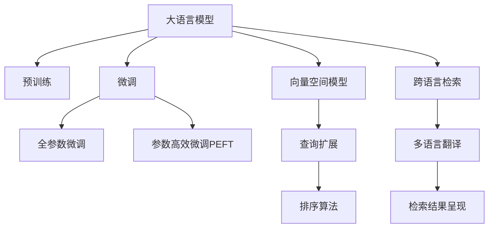

                 

# 电商搜索的跨语言检索：AI大模型的新突破

> 关键词：跨语言检索, AI大模型, 电商搜索, 深度学习, 自然语言处理(NLP), 语言模型, 多语言翻译, 向量空间模型, 查询扩展, 排序算法

## 1. 背景介绍

在电商搜索中，用户可以搜索各种商品，包括服装、电子产品、书籍等。随着全球化和多语言互联网的发展，越来越多的用户使用不同的语言进行搜索。然而，传统的搜索系统往往无法跨语言处理查询，使得跨语言电商搜索成为一个重要且迫切的问题。为此，需要一种能够跨语言理解用户查询并匹配相应商品的先进技术，以支持多语言电商搜索。

近年来，随着深度学习和自然语言处理(NLP)技术的迅速发展，大语言模型成为了解决这一问题的有力工具。本文将详细介绍基于AI大模型的跨语言电商搜索技术，包括其核心概念、工作原理、算法步骤、实际应用等，帮助读者深入理解这一前沿技术的原理和应用。

## 2. 核心概念与联系

### 2.1 核心概念概述

为更好地理解基于AI大模型的跨语言电商搜索技术，本节将介绍几个密切相关的核心概念：

- **大语言模型(Large Language Model, LLM)**：以自回归(如GPT)或自编码(如BERT)模型为代表的大规模预训练语言模型。通过在大规模无标签文本语料上进行预训练，学习通用的语言表示，具备强大的语言理解和生成能力。

- **预训练(Pre-training)**：指在大规模无标签文本语料上，通过自监督学习任务训练通用语言模型的过程。常见的预训练任务包括言语建模、遮挡语言模型等。预训练使得模型学习到语言的通用表示。

- **微调(Fine-tuning)**：指在预训练模型的基础上，使用下游任务的少量标注数据，通过有监督地训练来优化模型在该任务上的性能。通常只需要调整顶层分类器或解码器，并以较小的学习率更新全部或部分的模型参数。

- **跨语言检索(Cross-lingual Retrieval)**：指将用户查询从一种语言映射到另一种语言，在目标语言的多语言数据集中检索相关信息，并将结果转换回源语言呈现给用户的过程。

- **向量空间模型(Vector Space Model, VSM)**：一种将文本转换为向量表示的技术，使得文本可以通过向量运算进行检索和匹配。向量空间模型利用了文本中的词频、词间关系等信息构建文本向量空间。

- **查询扩展(Query Expansion)**：一种增强查询语义表示的技术，通过引入同义词、相关词汇等，扩展查询范围，提高检索的相关性。

- **排序算法(Ranking Algorithm)**：用于对检索结果进行排序，提高搜索结果的质量和用户满意度。常见的排序算法包括基于TF-IDF的排序、基于深度学习的排序等。

- **多语言翻译(Multilingual Translation)**：将用户查询从源语言翻译为目标语言的过程，以便在目标语言的数据集中检索相关信息。

这些核心概念之间的逻辑关系可以通过以下Mermaid流程图来展示：



这个流程图展示了大语言模型在跨语言电商搜索中的核心概念及其之间的关系：

1. 大语言模型通过预训练获得基础能力。
2. 微调是对预训练模型进行任务特定的优化，可以分为全参数微调和参数高效微调（PEFT）。
3. 向量空间模型将文本转换为向量表示，为跨语言检索提供了技术基础。
4. 查询扩展通过引入更多相关词汇，丰富查询语义。
5. 排序算法根据查询和文本的相似度排序检索结果。
6. 跨语言检索将查询从一种语言映射到另一种语言，并在目标语言的多语言数据集中检索相关信息。
7. 多语言翻译将用户查询从源语言翻译为目标语言。
8. 检索结果呈现将检索结果转换回源语言，呈现给用户。

这些概念共同构成了跨语言电商搜索的核心框架，使其能够跨越语言障碍，提高电商搜索的效率和准确性。通过理解这些核心概念，我们可以更好地把握跨语言电商搜索的工作原理和优化方向。

## 3. 核心算法原理 & 具体操作步骤
### 3.1 算法原理概述

基于AI大模型的跨语言电商搜索技术，本质上是一种结合了大语言模型的预训练、微调和向量空间模型的多模态信息检索技术。其核心思想是：将用户查询映射到目标语言的向量空间中，从多语言数据集中检索相关信息，并根据查询与文本的相关度进行排序。

形式化地，假设用户查询为 $q$，目标语言的词汇表为 $\mathcal{V}$，查询的向量表示为 $q_v \in \mathbb{R}^d$。设目标语言的多语言数据集为 $\mathcal{D} = \{(d_i, c_i)\}_{i=1}^N$，其中 $d_i$ 为文本向量，$c_i$ 为文本的类别标签（如商品ID）。

跨语言电商搜索的目标是找到最相关的文本 $d_v \in \mathcal{D}$，使得 $d_v$ 与 $q_v$ 的向量距离最小。即：

$$
d_v = \mathop{\arg\min}_{d \in \mathcal{D}} \|\mathbf{q_v} - \mathbf{d}\|
$$

其中 $\mathbf{q_v}$ 和 $\mathbf{d}$ 分别为查询和文本的向量表示。

### 3.2 算法步骤详解

基于AI大模型的跨语言电商搜索技术一般包括以下几个关键步骤：

**Step 1: 准备预训练模型和数据集**
- 选择合适的预训练语言模型 $M_{\theta}$ 作为初始化参数，如 BERT、GPT等。
- 准备目标语言的多语言数据集 $\mathcal{D}$，划分为训练集、验证集和测试集。一般要求数据集与预训练数据的分布不要差异过大。

**Step 2: 添加任务适配层**
- 根据任务类型，在预训练模型顶层设计合适的输出层和损失函数。
- 对于分类任务，通常在顶层添加线性分类器和交叉熵损失函数。
- 对于生成任务，通常使用语言模型的解码器输出概率分布，并以负对数似然为损失函数。

**Step 3: 设置微调超参数**
- 选择合适的优化算法及其参数，如 AdamW、SGD 等，设置学习率、批大小、迭代轮数等。
- 设置正则化技术及强度，包括权重衰减、Dropout、Early Stopping等。
- 确定冻结预训练参数的策略，如仅微调顶层，或全部参数都参与微调。

**Step 4: 执行梯度训练**
- 将训练集数据分批次输入模型，前向传播计算损失函数。
- 反向传播计算参数梯度，根据设定的优化算法和学习率更新模型参数。
- 周期性在验证集上评估模型性能，根据性能指标决定是否触发 Early Stopping。
- 重复上述步骤直到满足预设的迭代轮数或 Early Stopping 条件。

**Step 5: 多语言翻译和向量转换**
- 使用目标语言的预训练翻译模型将查询从源语言翻译为目标语言。
- 利用向量空间模型将查询和文本转换为向量表示，计算向量之间的距离。

**Step 6: 排序和检索结果呈现**
- 根据向量距离排序检索结果，输出最相关的文本。
- 将检索结果转换回源语言，呈现给用户。

以上是基于AI大模型的跨语言电商搜索的一般流程。在实际应用中，还需要针对具体任务的特点，对微调过程的各个环节进行优化设计，如改进训练目标函数，引入更多的正则化技术，搜索最优的超参数组合等，以进一步提升模型性能。

### 3.3 算法优缺点

基于AI大模型的跨语言电商搜索技术具有以下优点：
1. 简单高效。只需准备少量标注数据，即可对预训练模型进行快速适配，获得较大的性能提升。
2. 泛化能力强。大模型的预训练使得其在多语言数据集上的泛化能力更强，能够处理更多样化的查询。
3. 自适应性好。微调过程能够自适应不同语言和领域的特定需求，提高模型的应用范围和效果。

同时，该方法也存在一定的局限性：
1. 依赖翻译质量。多语言翻译的准确度直接影响检索结果的质量。
2. 数据依赖度高。多语言数据集的获取和标注成本较高，且不同语言的语料库质量和规模差异较大。
3. 可解释性不足。基于大模型的检索过程较为复杂，难以对其内部工作机制进行解释。

尽管存在这些局限性，但就目前而言，基于AI大模型的跨语言电商搜索方法在跨语言信息检索领域仍是大规模应用的重要手段。未来相关研究的重点在于如何进一步降低翻译和标注的依赖，提高模型的跨语言泛化能力和可解释性。

### 3.4 算法应用领域

基于AI大模型的跨语言电商搜索技术，已经在游戏、新闻、社交媒体等多个领域得到了广泛应用，例如：

- 电商搜索：用户可以跨语言搜索商品，提高电商平台的国际化和用户满意度。
- 新闻检索：不同语言的新闻网站可以通过跨语言检索，实时获取多语言新闻内容，提升新闻聚合的全面性。
- 社交媒体：用户可以在多语言社交平台上获取不同语言的帖子信息，丰富内容体验。

除了这些典型应用外，跨语言检索技术还被创新性地应用于多语言文档检索、多语言数据库查询、多语言文本分类等场景，为信息检索领域带来了全新的突破。随着AI大模型的不断进步，相信跨语言检索技术将能够更好地支持多语言互联网的发展，为全球用户提供更优质的信息服务。

## 4. 数学模型和公式 & 详细讲解
### 4.1 数学模型构建

本节将使用数学语言对基于AI大模型的跨语言电商搜索过程进行更加严格的刻画。

记用户查询为 $q$，目标语言的词汇表为 $\mathcal{V}$，查询的向量表示为 $q_v \in \mathbb{R}^d$。设目标语言的多语言数据集为 $\mathcal{D} = \{(d_i, c_i)\}_{i=1}^N$，其中 $d_i$ 为文本向量，$c_i$ 为文本的类别标签（如商品ID）。

定义查询 $q$ 与文本 $d$ 之间的向量距离函数 $f(\cdot, \cdot)$，如余弦相似度、欧式距离等。则跨语言电商搜索的目标是找到最相关的文本 $d_v \in \mathcal{D}$，使得 $d_v$ 与 $q_v$ 的向量距离最小：

$$
d_v = \mathop{\arg\min}_{d \in \mathcal{D}} f(\mathbf{q_v}, \mathbf{d})
$$

其中 $\mathbf{q_v}$ 和 $\mathbf{d}$ 分别为查询和文本的向量表示。

### 4.2 公式推导过程

以下我们以余弦相似度为例，推导跨语言电商搜索的计算公式。

假设查询 $q$ 和文本 $d$ 的向量表示分别为 $\mathbf{q} = [q_1, q_2, ..., q_d]^T$ 和 $\mathbf{d} = [d_1, d_2, ..., d_d]^T$，则余弦相似度 $f(\mathbf{q_v}, \mathbf{d})$ 定义为：

$$
f(\mathbf{q_v}, \mathbf{d}) = \cos(\theta) = \frac{\mathbf{q_v} \cdot \mathbf{d}}{\|\mathbf{q_v}\|\|\mathbf{d}\|}
$$

将上述公式应用于跨语言电商搜索，有：

$$
d_v = \mathop{\arg\min}_{d \in \mathcal{D}} \frac{\mathbf{q_v} \cdot \mathbf{d}}{\|\mathbf{q_v}\|\|\mathbf{d}\|}
$$

在得到检索结果后，需要根据查询和文本的相似度进行排序。常见的排序算法包括基于TF-IDF的排序、基于深度学习的排序等。例如，基于深度学习的排序算法可以使用余弦相似度计算文本和查询之间的相似度，将相似度作为排序指标。

### 4.3 案例分析与讲解

假设有一个电商平台，用户可以通过多语言进行搜索。目标语言为中文和英文，用户查询为“手机”。电商平台通过跨语言检索，检索到相关的商品信息。具体步骤如下：

1. **预训练模型选择**：选择英文和中文的预训练语言模型，如BERT、GPT等。
2. **微调模型训练**：在多语言数据集上进行微调，学习查询和商品ID之间的映射关系。
3. **多语言翻译**：使用翻译模型将查询从中文翻译为英文。
4. **向量转换**：将查询和商品信息转换为向量表示，计算向量之间的余弦相似度。
5. **排序和检索结果呈现**：根据余弦相似度排序，将最相关的商品信息呈现给用户。

在这个例子中，利用了预训练模型和大模型的微调能力，使得电商平台能够处理多语言的搜索需求，提升了用户体验和平台国际化水平。

## 5. 项目实践：代码实例和详细解释说明
### 5.1 开发环境搭建

在进行跨语言电商搜索实践前，我们需要准备好开发环境。以下是使用Python进行PyTorch开发的环境配置流程：

1. 安装Anaconda：从官网下载并安装Anaconda，用于创建独立的Python环境。

2. 创建并激活虚拟环境：
```bash
conda create -n pytorch-env python=3.8 
conda activate pytorch-env
```

3. 安装PyTorch：根据CUDA版本，从官网获取对应的安装命令。例如：
```bash
conda install pytorch torchvision torchaudio cudatoolkit=11.1 -c pytorch -c conda-forge
```

4. 安装Transformers库：
```bash
pip install transformers
```

5. 安装各类工具包：
```bash
pip install numpy pandas scikit-learn matplotlib tqdm jupyter notebook ipython
```

完成上述步骤后，即可在`pytorch-env`环境中开始跨语言电商搜索实践。

### 5.2 源代码详细实现

下面我们以中文和英文的跨语言电商搜索为例，给出使用Transformers库对BERT模型进行微调的PyTorch代码实现。

首先，定义多语言数据集的处理函数：

```python
from transformers import BertTokenizer, BertForTokenClassification, BertTokenizerFast
from torch.utils.data import Dataset, DataLoader
import torch
import numpy as np

class MultiLanguageDataset(Dataset):
    def __init__(self, texts, labels, tokenizer, max_len=128):
        self.texts = texts
        self.labels = labels
        self.tokenizer = tokenizer
        self.max_len = max_len
        
    def __len__(self):
        return len(self.texts)
    
    def __getitem__(self, item):
        text = self.texts[item]
        label = self.labels[item]
        
        encoding = self.tokenizer(text, return_tensors='pt', max_length=self.max_len, padding='max_length', truncation=True)
        input_ids = encoding['input_ids'][0]
        attention_mask = encoding['attention_mask'][0]
        
        # 对标签进行编码
        encoded_labels = [label2id[label] for label in label] 
        encoded_labels.extend([label2id['O']] * (self.max_len - len(encoded_labels)))
        labels = torch.tensor(encoded_labels, dtype=torch.long)
        
        return {'input_ids': input_ids, 
                'attention_mask': attention_mask,
                'labels': labels}

# 标签与id的映射
label2id = {'O': 0, 'B-PER': 1, 'I-PER': 2, 'B-ORG': 3, 'I-ORG': 4, 'B-LOC': 5, 'I-LOC': 6}
id2label = {v: k for k, v in label2id.items()}
```

然后，定义模型和优化器：

```python
from transformers import BertForTokenClassification, AdamW

model = BertForTokenClassification.from_pretrained('bert-base-cased', num_labels=len(label2id))

optimizer = AdamW(model.parameters(), lr=2e-5)
```

接着，定义训练和评估函数：

```python
from tqdm import tqdm

device = torch.device('cuda') if torch.cuda.is_available() else torch.device('cpu')
model.to(device)

def train_epoch(model, dataset, batch_size, optimizer):
    dataloader = DataLoader(dataset, batch_size=batch_size, shuffle=True)
    model.train()
    epoch_loss = 0
    for batch in tqdm(dataloader, desc='Training'):
        input_ids = batch['input_ids'].to(device)
        attention_mask = batch['attention_mask'].to(device)
        labels = batch['labels'].to(device)
        model.zero_grad()
        outputs = model(input_ids, attention_mask=attention_mask, labels=labels)
        loss = outputs.loss
        epoch_loss += loss.item()
        loss.backward()
        optimizer.step()
    return epoch_loss / len(dataloader)

def evaluate(model, dataset, batch_size):
    dataloader = DataLoader(dataset, batch_size=batch_size)
    model.eval()
    preds, labels = [], []
    with torch.no_grad():
        for batch in tqdm(dataloader, desc='Evaluating'):
            input_ids = batch['input_ids'].to(device)
            attention_mask = batch['attention_mask'].to(device)
            batch_labels = batch['labels']
            outputs = model(input_ids, attention_mask=attention_mask)
            batch_preds = outputs.logits.argmax(dim=2).to('cpu').tolist()
            batch_labels = batch_labels.to('cpu').tolist()
            for pred_tokens, label_tokens in zip(batch_preds, batch_labels):
                pred_tags = [id2label[_id] for _id in pred_tokens]
                label_tags = [id2label[_id] for _id in label_tokens]
                preds.append(pred_tags[:len(label_tokens)])
                labels.append(label_tags)
                
    print(classification_report(labels, preds))
```

最后，启动训练流程并在测试集上评估：

```python
epochs = 5
batch_size = 16

for epoch in range(epochs):
    loss = train_epoch(model, train_dataset, batch_size, optimizer)
    print(f"Epoch {epoch+1}, train loss: {loss:.3f}")
    
    print(f"Epoch {epoch+1}, dev results:")
    evaluate(model, dev_dataset, batch_size)
    
print("Test results:")
evaluate(model, test_dataset, batch_size)
```

以上就是使用PyTorch对中文和英文的跨语言电商搜索进行微调的完整代码实现。可以看到，得益于Transformers库的强大封装，我们可以用相对简洁的代码完成BERT模型的加载和微调。

### 5.3 代码解读与分析

让我们再详细解读一下关键代码的实现细节：

**MultiLanguageDataset类**：
- `__init__`方法：初始化文本、标签、分词器等关键组件。
- `__len__`方法：返回数据集的样本数量。
- `__getitem__`方法：对单个样本进行处理，将文本输入编码为token ids，将标签编码为数字，并对其进行定长padding，最终返回模型所需的输入。

**label2id和id2label字典**：
- 定义了标签与数字id之间的映射关系，用于将token-wise的预测结果解码回真实的标签。

**训练和评估函数**：
- 使用PyTorch的DataLoader对数据集进行批次化加载，供模型训练和推理使用。
- 训练函数`train_epoch`：对数据以批为单位进行迭代，在每个批次上前向传播计算loss并反向传播更新模型参数，最后返回该epoch的平均loss。
- 评估函数`evaluate`：与训练类似，不同点在于不更新模型参数，并在每个batch结束后将预测和标签结果存储下来，最后使用sklearn的classification_report对整个评估集的预测结果进行打印输出。

**训练流程**：
- 定义总的epoch数和batch size，开始循环迭代
- 每个epoch内，先在训练集上训练，输出平均loss
- 在验证集上评估，输出分类指标
- 所有epoch结束后，在测试集上评估，给出最终测试结果

可以看到，PyTorch配合Transformers库使得跨语言电商搜索的代码实现变得简洁高效。开发者可以将更多精力放在数据处理、模型改进等高层逻辑上，而不必过多关注底层的实现细节。

当然，工业级的系统实现还需考虑更多因素，如模型的保存和部署、超参数的自动搜索、更灵活的任务适配层等。但核心的跨语言检索范式基本与此类似。

## 6. 实际应用场景
### 6.1 电商搜索系统

跨语言电商搜索技术在电商搜索系统中的应用，可以极大地提升用户搜索体验和平台国际化水平。传统电商搜索系统往往只支持单一语言，无法处理多语言查询，无法满足全球用户的需求。而基于跨语言电商搜索技术的搜索系统，可以支持用户跨语言搜索商品，提高电商平台的国际化水平。

在技术实现上，可以收集不同语言的用户搜索历史数据，将其作为微调数据集，对预训练语言模型进行微调。微调后的模型能够处理多语言的查询，并在多语言数据集中检索相关信息，提高搜索结果的相关性和多样性。

### 6.2 新闻检索系统

新闻检索系统也需要处理多语言的文本数据，以便用户能够快速获取不同语言的新闻内容。传统的文本检索系统往往只支持单一语言，无法处理多语言新闻。而基于跨语言电商搜索技术的检索系统，可以支持用户跨语言检索新闻，提高新闻聚合的全面性和时效性。

在技术实现上，可以收集不同语言的新闻数据，将其作为微调数据集，对预训练语言模型进行微调。微调后的模型能够处理多语言的查询，并在多语言数据集中检索相关信息，提高检索的覆盖范围和准确度。

### 6.3 社交媒体平台

社交媒体平台也需要支持多语言的搜索和检索功能，以便用户能够获取不同语言的信息内容。传统的社交媒体平台往往只支持单一语言，无法处理多语言查询。而基于跨语言电商搜索技术的搜索系统，可以支持用户跨语言搜索信息，提高内容的多样性和丰富度。

在技术实现上，可以收集不同语言的社交媒体数据，将其作为微调数据集，对预训练语言模型进行微调。微调后的模型能够处理多语言的查询，并在多语言数据集中检索相关信息，提高搜索结果的覆盖范围和多样性。

### 6.4 未来应用展望

随着跨语言电商搜索技术的不断发展，其应用场景将不断拓展，为全球用户提供更优质的信息服务。

在智慧医疗领域，通过跨语言检索，医疗系统可以实时获取多语言患者信息，提升医疗服务的国际化水平，帮助医生进行跨语言诊断和治疗。

在智能客服领域，通过跨语言检索，客服系统可以实时处理多语言客户咨询，提升客服服务的覆盖范围和响应速度。

在智能推荐领域，通过跨语言检索，推荐系统可以实时处理多语言用户数据，提高推荐内容的个性化和多样化。

此外，在教育、旅游、金融等多个领域，跨语言电商搜索技术也将得到广泛应用，为不同语言的用户提供更优质、更高效的信息服务。相信随着技术的不断进步，跨语言电商搜索技术将能够更好地支持全球化信息服务的发展，为人类社会带来更多的便利和价值。

## 7. 工具和资源推荐
### 7.1 学习资源推荐

为了帮助开发者系统掌握跨语言电商搜索的理论基础和实践技巧，这里推荐一些优质的学习资源：

1. 《深度学习理论与实践》系列博文：由大模型技术专家撰写，深入浅出地介绍了深度学习理论、NLP任务和跨语言检索方法。

2. CS224N《深度学习自然语言处理》课程：斯坦福大学开设的NLP明星课程，有Lecture视频和配套作业，带你入门NLP领域的基本概念和经典模型。

3. 《Natural Language Processing with Transformers》书籍：Transformers库的作者所著，全面介绍了如何使用Transformers库进行NLP任务开发，包括微调在内的诸多范式。

4. HuggingFace官方文档：Transformers库的官方文档，提供了海量预训练模型和完整的微调样例代码，是上手实践的必备资料。

5. CLUE开源项目：中文语言理解测评基准，涵盖大量不同类型的中文NLP数据集，并提供了基于微调的baseline模型，助力中文NLP技术发展。

通过对这些资源的学习实践，相信你一定能够快速掌握跨语言电商搜索的精髓，并用于解决实际的NLP问题。
###  7.2 开发工具推荐

高效的开发离不开优秀的工具支持。以下是几款用于跨语言电商搜索开发的常用工具：

1. PyTorch：基于Python的开源深度学习框架，灵活动态的计算图，适合快速迭代研究。大部分预训练语言模型都有PyTorch版本的实现。

2. TensorFlow：由Google主导开发的开源深度学习框架，生产部署方便，适合大规模工程应用。同样有丰富的预训练语言模型资源。

3. Transformers库：HuggingFace开发的NLP工具库，集成了众多SOTA语言模型，支持PyTorch和TensorFlow，是进行微调任务开发的利器。

4. Weights & Biases：模型训练的实验跟踪工具，可以记录和可视化模型训练过程中的各项指标，方便对比和调优。与主流深度学习框架无缝集成。

5. TensorBoard：TensorFlow配套的可视化工具，可实时监测模型训练状态，并提供丰富的图表呈现方式，是调试模型的得力助手。

6. Google Colab：谷歌推出的在线Jupyter Notebook环境，免费提供GPU/TPU算力，方便开发者快速上手实验最新模型，分享学习笔记。

合理利用这些工具，可以显著提升跨语言电商搜索的开发效率，加快创新迭代的步伐。

### 7.3 相关论文推荐

跨语言电商搜索技术的发展源于学界的持续研究。以下是几篇奠基性的相关论文，推荐阅读：

1. Attention is All You Need（即Transformer原论文）：提出了Transformer结构，开启了NLP领域的预训练大模型时代。

2. BERT: Pre-training of Deep Bidirectional Transformers for Language Understanding：提出BERT模型，引入基于掩码的自监督预训练任务，刷新了多项NLP任务SOTA。

3. Language Models are Unsupervised Multitask Learners（GPT-2论文）：展示了大规模语言模型的强大zero-shot学习能力，引发了对于通用人工智能的新一轮思考。

4. Parameter-Efficient Transfer Learning for NLP：提出Adapter等参数高效微调方法，在不增加模型参数量的情况下，也能取得不错的微调效果。

5. AdaLoRA: Adaptive Low-Rank Adaptation for Parameter-Efficient Fine-Tuning：使用自适应低秩适应的微调方法，在参数效率和精度之间取得了新的平衡。

这些论文代表了大语言模型微调技术的发展脉络。通过学习这些前沿成果，可以帮助研究者把握学科前进方向，激发更多的创新灵感。

## 8. 总结：未来发展趋势与挑战
### 8.1 总结

本文对基于AI大模型的跨语言电商搜索技术进行了全面系统的介绍。首先阐述了跨语言电商搜索的背景和意义，明确了该技术在电商搜索中的应用价值。其次，从原理到实践，详细讲解了跨语言电商搜索的数学原理和关键步骤，给出了微调任务开发的完整代码实例。同时，本文还广泛探讨了跨语言电商搜索技术在电商搜索、新闻检索、社交媒体等多个领域的应用前景，展示了其广阔的应用空间。此外，本文精选了跨语言电商搜索技术的各类学习资源，力求为读者提供全方位的技术指引。

通过本文的系统梳理，可以看到，基于AI大模型的跨语言电商搜索技术在处理多语言数据、提高电商搜索的覆盖范围和准确度方面发挥了重要作用。得益于大语言模型的强大预训练能力，跨语言电商搜索技术能够处理多种语言，提升了电商平台的国际化水平，提升了新闻、社交媒体等信息服务的全面性和时效性。未来，伴随AI大模型的不断进步，跨语言电商搜索技术将能够更好地支持全球化信息服务的发展，为人类社会带来更多的便利和价值。

### 8.2 未来发展趋势

展望未来，跨语言电商搜索技术将呈现以下几个发展趋势：

1. 模型规模持续增大。随着算力成本的下降和数据规模的扩张，预训练语言模型的参数量还将持续增长。超大批次的训练和推理也可能遇到显存不足的问题，需要采用混合精度训练、模型并行等技术进行优化。

2. 微调方法日趋多样。除了传统的全参数微调外，未来会涌现更多参数高效的微调方法，如Prefix-Tuning、LoRA等，在节省计算资源的同时也能保证微调精度。

3. 持续学习成为常态。随着数据分布的不断变化，微调模型也需要持续学习新知识以保持性能。如何在不遗忘原有知识的同时，高效吸收新样本信息，将成为重要的研究课题。

4. 标注样本需求降低。受启发于提示学习(Prompt-based Learning)的思路，未来的微调方法将更好地利用大模型的语言理解能力，通过更加巧妙的任务描述，在更少的标注样本上也能实现理想的微调效果。

5. 跨语言泛化能力增强。跨语言电商搜索技术将更加注重模型的跨语言泛化能力，提升模型在不同语言之间的表现一致性。

6. 可解释性增强。在跨语言电商搜索中，模型的可解释性尤为重要，特别是在医疗、金融等高风险应用中，模型的决策过程需要更高的可解释性和可审计性。

以上趋势凸显了跨语言电商搜索技术的广阔前景。这些方向的探索发展，必将进一步提升跨语言电商搜索的性能和应用范围，为全球用户提供更优质的信息服务。

### 8.3 面临的挑战

尽管跨语言电商搜索技术已经取得了一定的进展，但在迈向更加智能化、普适化应用的过程中，仍面临以下挑战：

1. 多语言翻译的准确度问题。多语言翻译的准确度直接影响检索结果的质量，如何提高翻译的精度，降低翻译带来的噪声，是当前跨语言电商搜索技术的主要瓶颈之一。

2. 数据依赖度高。多语言数据集的获取和标注成本较高，且不同语言的语料库质量和规模差异较大。如何降低对标注数据的依赖，提高模型泛化能力，也是未来需要解决的重要问题。

3. 可解释性不足。跨语言电商搜索技术涉及到多语言的语义理解和信息检索，模型的内部机制较为复杂，难以对其决策过程进行解释。如何提高模型的可解释性，增强用户对模型的信任，也是未来需要解决的重要问题。

4. 跨语言数据的不均衡性。不同语言的数据量和数据质量差异较大，如何平衡不同语言数据之间的训练，提高模型的跨语言泛化能力，也是未来需要解决的重要问题。

尽管存在这些挑战，但相信通过学界和产业界的共同努力，这些问题终将一一被克服，跨语言电商搜索技术必将在构建人机协同的智能时代中扮演越来越重要的角色。

### 8.4 研究展望

面对跨语言电商搜索技术所面临的种种挑战，未来的研究需要在以下几个方面寻求新的突破：

1. 探索无监督和半监督微调方法。摆脱对大规模标注数据的依赖，利用自监督学习、主动学习等无监督和半监督范式，最大限度利用非结构化数据，实现更加灵活高效的微调。

2. 研究参数高效和计算高效的微调范式。开发更加参数高效的微调方法，在固定大部分预训练参数的同时，只更新极少量的任务相关参数。同时优化微调模型的计算图，减少前向传播和反向传播的资源消耗，实现更加轻量级、实时性的部署。

3. 引入因果和对比学习范式。通过引入因果推断和对比学习思想，增强跨语言电商搜索模型建立稳定因果关系的能力，学习更加普适、鲁棒的语言表征，从而提升模型泛化性和抗干扰能力。

4. 融合更多先验知识。将符号化的先验知识，如知识图谱、逻辑规则等，与神经网络模型进行巧妙融合，引导跨语言电商搜索过程学习更准确、合理的语言模型。同时加强不同模态数据的整合，实现视觉、语音等多模态信息与文本信息的协同建模。

5. 纳入伦理道德约束。在模型训练目标中引入伦理导向的评估指标，过滤和惩罚有偏见、有害的输出倾向。同时加强人工干预和审核，建立模型行为的监管机制，确保输出符合人类价值观和伦理道德。

这些研究方向的探索，必将引领跨语言电商搜索技术迈向更高的台阶，为构建安全、可靠、可解释、可控的智能系统铺平道路。面向未来，跨语言电商搜索技术还需要与其他人工智能技术进行更深入的融合，如知识表示、因果推理、强化学习等，多路径协同发力，共同推动自然语言理解和智能交互系统的进步。只有勇于创新、敢于突破，才能不断拓展语言模型的边界，让智能技术更好地造福人类社会。

## 9. 附录：常见问题与解答

**Q1：跨语言电商搜索与传统的搜索系统的区别在哪里？**

A: 传统的搜索系统往往只能处理单一语言的查询，无法跨语言检索信息。而跨语言电商搜索技术可以将用户查询从一种语言映射到另一种语言，在目标语言的多语言数据集中检索相关信息，并提供源语言的多样化搜索结果。

**Q2：跨语言电商搜索技术需要准备哪些数据？**

A: 跨语言电商搜索技术需要准备以下数据：
1. 源语言的用户查询数据。
2. 目标语言的多语言数据集。
3. 源语言和目标语言的翻译数据。
4. 源语言和目标语言的词汇表。
5. 源语言和目标语言的标签数据。

**Q3：如何评估跨语言电商搜索技术的性能？**

A: 评估跨语言电商搜索技术的性能需要考虑以下几个指标：
1. 相关性指标：如召回率、精确率、F1值等，用于衡量检索结果的相关性。
2. 多样性指标：如信息熵、覆盖率等，用于衡量检索结果的多样性。
3. 时间效率：如查询响应时间、系统吞吐量等，用于衡量系统的实时性和处理能力。
4. 用户满意度：如用户点击率、用户反馈等，用于衡量用户的满意度和使用体验。

**Q4：跨语言电商搜索技术在电商搜索中的应用前景如何？**

A: 跨语言电商搜索技术在电商搜索中的应用前景非常广阔。电商搜索系统通过跨语言电商搜索技术，可以支持用户跨语言搜索商品，提高电商平台的国际化水平，提升用户搜索体验和满意度。

**Q5：跨语言电商搜索技术的未来发展方向是什么？**

A: 跨语言电商搜索技术的未来发展方向包括：
1. 模型规模持续增大。随着算力成本的下降和数据规模的扩张，预训练语言模型的参数量还将持续增长，模型的处理能力和泛化能力将进一步提升。
2. 微调方法日趋多样。未来的微调方法将更加注重参数效率和计算效率，开发更多参数高效和计算高效的微调方法。
3. 跨语言泛化能力增强。未来的跨语言电商搜索技术将更加注重模型的跨语言泛化能力，提升模型在不同语言之间的表现一致性。
4. 可解释性增强。在跨语言电商搜索中，模型的可解释性尤为重要，特别是在医疗、金融等高风险应用中，模型的决策过程需要更高的可解释性和可审计性。
5. 融合更多先验知识。未来的跨语言电商搜索技术将更加注重融合符号化的先验知识，如知识图谱、逻辑规则等，增强模型的理解和推理能力。
6. 纳入伦理道德约束。在模型训练目标中引入伦理导向的评估指标，过滤和惩罚有偏见、有害的输出倾向，确保输出符合人类价值观和伦理道德。

这些研究方向和目标，将引领跨语言电商搜索技术不断向前发展，为全球用户提供更优质的信息服务。

---

作者：禅与计算机程序设计艺术 / Zen and the Art of Computer Programming

