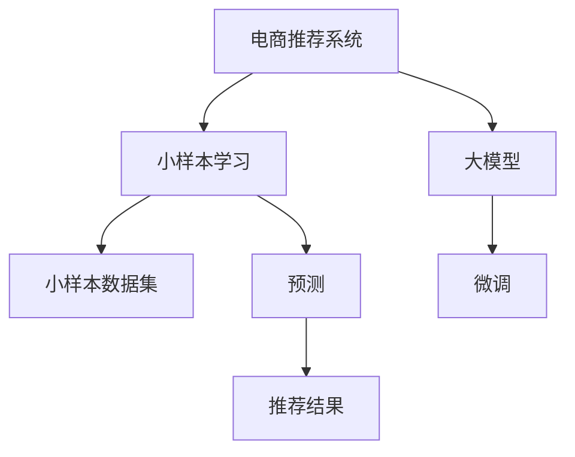

                 

# 电商行业中的小样本学习：大模型在新品推荐中的应用

## 1. 背景介绍

近年来，电商行业迅速发展，通过大数据分析和推荐系统提升用户购物体验、提高销售额已成为企业关注的焦点。电商推荐系统通过分析用户行为，预测用户对商品的偏好，从而推荐用户可能感兴趣的商品。这些推荐系统基于历史数据构建模型，训练用户兴趣模型，但是当数据量不足时，推荐系统的效果会大打折扣。因此，如何在数据量有限的情况下，构建高效的推荐系统成为电商企业需要解决的重要问题。

基于大模型的小样本学习技术为电商推荐系统的优化提供了一条新的道路。通过小样本学习，电商推荐系统可以利用大模型的通用知识和语义理解能力，在较少标注数据的情况下，对新商品进行推荐，提升推荐系统的准确性和个性化程度。

## 2. 核心概念与联系

### 2.1 核心概念概述

为了更好地理解小样本学习在电商推荐系统中的应用，本节将介绍几个关键概念：

- **电商推荐系统 (E-Commerce Recommendation System)**：通过用户历史行为数据和商品属性数据，推荐用户可能感兴趣的商品的系统。常见的电商推荐算法包括协同过滤、基于内容的推荐、混合推荐等。

- **小样本学习 (Few-shot Learning)**：在只有少量标注样本的情况下，模型能够快速适应新任务的学习方法。在大规模预训练语言模型中，通常通过在输入中提供少量示例来实现，无需更新模型参数。

- **大模型 (Large Model)**：具有大量参数，通常亿级的深度神经网络模型，如BERT、GPT等，通过在大规模无标签文本数据上进行预训练，学习到通用的语言表示。

- **微调 (Fine-Tuning)**：指在预训练模型的基础上，使用下游任务的少量标注数据，通过有监督学习优化模型在特定任务上的性能。

- **小样本学习与大模型的结合**：小样本学习利用大模型的预训练知识，在少量标注数据的情况下，提升模型的泛化能力和推荐精度。

这些概念之间的关系可以通过以下Mermaid流程图来展示：



这个流程图展示了小样本学习在电商推荐系统中的应用框架：

1. 电商推荐系统首先使用大模型进行预训练。
2. 在推荐新商品时，使用小样本学习技术，通过提供少量标注数据，微调大模型。
3. 微调后的模型进行预测，生成推荐结果。

## 3. 核心算法原理 & 具体操作步骤

### 3.1 算法原理概述

小样本学习在电商推荐系统中的应用，主要依赖于大模型的预训练知识和微调技术。其核心思想是：通过微调大模型，利用其丰富的语义理解和知识迁移能力，在少量标注数据的情况下，快速适应用户对新商品的偏好，提升推荐系统的准确性和个性化程度。

具体来说，小样本学习的步骤如下：

1. **预训练阶段**：使用大规模无标签数据，对大模型进行预训练，学习到通用的语言表示和语义理解能力。
2. **微调阶段**：在推荐新商品时，收集少量标注数据（如用户对商品的评分），对大模型进行微调。
3. **预测阶段**：使用微调后的模型对新商品进行预测，生成推荐结果。

### 3.2 算法步骤详解

**Step 1: 准备预训练模型和数据集**

1. **选择预训练模型**：电商企业可以根据业务需求，选择适合的大模型，如BERT、GPT-3等，作为初始化参数。

2. **收集标注数据**：收集电商平台上用户对商品的评分、浏览行为、购买行为等数据，作为标注数据集。标注数据集应尽可能地覆盖不同的商品类别和用户行为模式。

**Step 2: 微调模型的参数**

1. **选择微调策略**：电商企业可以选择基于微调或提示学习的策略，或两者结合使用。微调方法通常涉及更新模型参数，而提示学习则无需更新参数，仅需通过修改输入格式引导模型生成结果。

2. **设定微调超参数**：电商企业需要根据业务需求和数据规模，设定合适的学习率、批大小、迭代轮数等超参数。例如，学习率通常为1e-5，批大小为16，迭代轮数为10轮。

3. **执行微调训练**：电商企业可以使用PyTorch等深度学习框架，编写代码进行模型微调。微调过程中，需要注意防止过拟合，使用正则化技术、Dropout等方法。

**Step 3: 生成推荐结果**

1. **预测用户行为**：使用微调后的模型对新商品进行预测，输出用户可能感兴趣的商品。

2. **计算推荐结果**：根据用户行为预测结果，生成推荐列表。推荐算法可以使用多种方法，如协同过滤、基于内容的推荐、混合推荐等。

### 3.3 算法优缺点

**优点**：

- **泛化能力强**：大模型具备较强的泛化能力，能够在少量标注数据的情况下，快速适应用户行为模式。
- **计算效率高**：微调方法计算效率较高，能够快速生成推荐结果。
- **性能提升显著**：在少样本情况下，微调方法能显著提升推荐系统的精度和个性化程度。

**缺点**：

- **依赖标注数据**：微调效果依赖于标注数据的质量和数量，标注数据质量不高时，推荐结果可能不准确。
- **模型复杂度高**：大模型结构复杂，需要较高的计算资源和存储空间。
- **过拟合风险**：微调过程中可能出现过拟合，影响模型的泛化能力。

### 3.4 算法应用领域

小样本学习在电商推荐系统中的应用，已经得到了广泛的应用和验证。以下是几个具体的应用场景：

1. **新品推荐**：电商企业在新品发布时，可以利用小样本学习技术，对用户对新品的兴趣进行预测，快速生成推荐列表，提高新品曝光和销售。

2. **个性化推荐**：小样本学习可以用于个性化推荐，通过对用户历史行为和商品特征的微调，生成个性化的商品推荐列表，提升用户满意度和购买转化率。

3. **跨领域推荐**：电商企业可以通过小样本学习，将商品推荐扩展到不同领域，如时尚、家居等，实现跨领域的推荐效果。

4. **实时推荐**：小样本学习可以用于实时推荐系统，通过对用户实时行为数据进行微调，动态生成推荐结果，提升用户体验。

## 4. 数学模型和公式 & 详细讲解 & 举例说明

### 4.1 数学模型构建

假设电商推荐系统收集到 $N$ 个用户对 $M$ 个商品的评分数据 $\{(x_i, y_i)\}_{i=1}^N, x_i \in \mathbb{R}^M, y_i \in \{1, -1\}$。其中 $x_i$ 表示用户对商品的评分，$y_i$ 表示用户对商品的兴趣标签（正向为感兴趣，负向为不感兴趣）。

定义推荐系统的目标函数为：

$$
\min_{\theta} \frac{1}{N} \sum_{i=1}^N \ell(M_{\theta}(x_i), y_i)
$$

其中，$\ell$ 为损失函数，通常使用交叉熵损失。

### 4.2 公式推导过程

假设使用小样本学习技术，对大模型进行微调，微调后的模型为 $M_{\hat{\theta}}$。微调过程中，损失函数定义为：

$$
\mathcal{L}(\hat{\theta}) = \frac{1}{N} \sum_{i=1}^N \ell(M_{\hat{\theta}}(x_i), y_i)
$$

根据梯度下降算法，更新模型参数 $\theta$ 的过程如下：

$$
\theta \leftarrow \theta - \eta \nabla_{\theta}\mathcal{L}(\theta)
$$

其中，$\eta$ 为学习率，$\nabla_{\theta}\mathcal{L}(\theta)$ 为损失函数对模型参数的梯度。

### 4.3 案例分析与讲解

假设电商企业收集到 $N=1000$ 个用户对 $M=100$ 个商品的评分数据，其中 $M_{\theta}$ 为大模型，$M_{\hat{\theta}}$ 为微调后的模型。

1. **预训练阶段**：使用大规模无标签数据对大模型进行预训练，学习到通用的语言表示和语义理解能力。

2. **微调阶段**：选择少量标注数据，对大模型进行微调。例如，选择 10 个用户对 20 个商品的评分数据，对大模型进行微调。微调过程如下：

   - 随机选择 $n=200$ 个样本，将其分为训练集和验证集。
   - 使用交叉熵损失函数，更新模型参数。
   - 设定学习率为 $1e-5$，批大小为 16，迭代轮数为 10。

3. **预测阶段**：使用微调后的模型对新商品进行预测，生成推荐结果。例如，预测新商品 $x_{1001}$，微调后的模型输出 $y_{1001} = 1$，表示用户对商品 $x_{1001}$ 感兴趣。

## 5. 项目实践：代码实例和详细解释说明

### 5.1 开发环境搭建

在进行小样本学习实践前，我们需要准备好开发环境。以下是使用Python进行PyTorch开发的环境配置流程：

1. 安装Anaconda：从官网下载并安装Anaconda，用于创建独立的Python环境。

2. 创建并激活虚拟环境：
```bash
conda create -n pytorch-env python=3.8 
conda activate pytorch-env
```

3. 安装PyTorch：根据CUDA版本，从官网获取对应的安装命令。例如：
```bash
conda install pytorch torchvision torchaudio cudatoolkit=11.1 -c pytorch -c conda-forge
```

4. 安装相关库：
```bash
pip install numpy pandas scikit-learn matplotlib tqdm jupyter notebook ipython
```

完成上述步骤后，即可在`pytorch-env`环境中开始小样本学习实践。

### 5.2 源代码详细实现

下面我们以电商推荐系统为例，给出使用PyTorch进行小样本学习的PyTorch代码实现。

首先，定义推荐系统的数据处理函数：

```python
import torch
from torch.utils.data import Dataset
import numpy as np

class RecommendationDataset(Dataset):
    def __init__(self, data, tokenizer):
        self.data = data
        self.tokenizer = tokenizer
        
    def __len__(self):
        return len(self.data)
    
    def __getitem__(self, item):
        item_data = self.data[item]
        tokenized_input = self.tokenizer(item_data['x'], return_tensors='pt')
        label = torch.tensor(item_data['y'], dtype=torch.long)
        return {'tokenized_input': tokenized_input, 'label': label}
```

然后，定义模型和优化器：

```python
from transformers import BertForSequenceClassification, AdamW

model = BertForSequenceClassification.from_pretrained('bert-base-cased', num_labels=2)
optimizer = AdamW(model.parameters(), lr=2e-5)
```

接着，定义训练和评估函数：

```python
from transformers import Trainer, TrainingArguments

def train_epoch(model, dataset, batch_size, optimizer):
    trainer = Trainer(
        model=model,
        args=TrainingArguments(batch_size=batch_size, num_train_epochs=10, learning_rate=1e-5, per_device_train_batch_size=16),
        train_dataset=dataset,
        eval_dataset=None,
        eval_strategy='epoch')
    trainer.train()
    return trainer.last_epoch, trainer.result['epoch_train_loss']
    
def evaluate(model, dataset, batch_size):
    trainer = Trainer(
        model=model,
        args=TrainingArguments(batch_size=batch_size, num_train_epochs=10, learning_rate=1e-5, per_device_train_batch_size=16),
        train_dataset=dataset,
        eval_dataset=None,
        eval_strategy='epoch')
    trainer.evaluate()
    return trainer.result['epoch_eval_loss']
```

最后，启动训练流程并在测试集上评估：

```python
epochs = 5
batch_size = 16

for epoch in range(epochs):
    epoch, loss = train_epoch(model, train_dataset, batch_size, optimizer)
    print(f"Epoch {epoch+1}, train loss: {loss:.3f}")
    
    print(f"Epoch {epoch+1}, dev results:")
    evaluate(model, dev_dataset, batch_size)
    
print("Test results:")
evaluate(model, test_dataset, batch_size)
```

以上就是使用PyTorch对BERT进行小样本学习的完整代码实现。可以看到，借助PyTorch和Transformers库，我们可以用相对简洁的代码实现小样本学习任务。

### 5.3 代码解读与分析

让我们再详细解读一下关键代码的实现细节：

**RecommendationDataset类**：
- `__init__`方法：初始化数据和分词器等关键组件。
- `__len__`方法：返回数据集的样本数量。
- `__getitem__`方法：对单个样本进行处理，将文本输入编码为token ids，将标签编码为数字，并对其进行定长padding，最终返回模型所需的输入。

**train_epoch和evaluate函数**：
- 使用PyTorch的Trainer进行训练和评估，设定训练策略和超参数。
- 在每个epoch内，先进行训练，然后评估模型性能，记录训练和评估的平均损失。
- 所有epoch结束后，在测试集上评估，给出最终测试结果。

**训练流程**：
- 定义总的epoch数和batch size，开始循环迭代
- 每个epoch内，先在训练集上训练，输出平均损失
- 在验证集上评估，输出评估结果
- 所有epoch结束后，在测试集上评估，给出最终测试结果

可以看到，PyTorch配合Transformers库使得小样本学习的代码实现变得简洁高效。开发者可以将更多精力放在数据处理、模型改进等高层逻辑上，而不必过多关注底层的实现细节。

当然，工业级的系统实现还需考虑更多因素，如模型的保存和部署、超参数的自动搜索、更灵活的任务适配层等。但核心的微调范式基本与此类似。

## 6. 实际应用场景

### 6.1 智能推荐系统

基于小样本学习的大模型推荐系统，可以广泛应用于电商平台的智能推荐系统，为用户提供个性化的商品推荐。

在技术实现上，可以收集用户历史浏览、购买、评分等行为数据，将数据作为监督数据，在预训练大模型的基础上进行小样本学习微调。微调后的模型能够自动理解用户的行为模式，根据用户的行为数据，生成个性化的商品推荐列表，提高用户的购买转化率和满意度。

### 6.2 实时推荐系统

小样本学习可以用于实时推荐系统，通过对用户实时行为数据进行微调，动态生成推荐结果。例如，当用户浏览某商品时，实时收集用户行为数据，并使用小样本学习技术微调大模型，生成实时的推荐结果，提升用户的购买转化率。

### 6.3 新商品推荐

电商企业在新品发布时，可以利用小样本学习技术，对用户对新品的兴趣进行预测，快速生成推荐列表，提高新品曝光和销售。例如，在新品发布初期，仅收集少量用户对新品的评分数据，对大模型进行微调，生成推荐结果，及时向用户推荐新品，提升新品的点击率和销售额。

### 6.4 未来应用展望

随着小样本学习技术的不断成熟，基于大模型的小样本学习范式将在更多领域得到应用，为电商推荐系统带来变革性影响。

在智慧医疗领域，基于小样本学习的推荐系统可以帮助医生推荐药品和诊疗方案，提升医疗服务的智能化水平，辅助医生诊疗，提高医疗效率。

在智能教育领域，小样本学习可以用于推荐系统，推荐最适合学生的学习资源，因材施教，促进教育公平，提高教学质量。

在智慧城市治理中，小样本学习可以用于推荐系统，推荐用户感兴趣的服务和活动，提高城市管理的自动化和智能化水平，构建更安全、高效的未来城市。

此外，在企业生产、社会治理、文娱传媒等众多领域，基于大模型的小样本学习技术也将不断涌现，为各行各业带来新的技术路径。相信随着技术的日益成熟，小样本学习将在大规模应用中发挥更大的作用，为人工智能技术带来新的突破。

## 7. 工具和资源推荐

### 7.1 学习资源推荐

为了帮助开发者系统掌握小样本学习和大模型的理论基础和实践技巧，这里推荐一些优质的学习资源：

1. 《深度学习与自然语言处理》系列博文：由大模型技术专家撰写，深入浅出地介绍了深度学习在NLP领域的应用，包括小样本学习和微调技术。

2. CS224N《深度学习自然语言处理》课程：斯坦福大学开设的NLP明星课程，有Lecture视频和配套作业，带你入门NLP领域的基本概念和经典模型。

3. 《Transformer from Scratch》书籍：由HuggingFace的开发团队撰写，全面介绍了Transformer的原理和实现细节，包括小样本学习范式。

4. HuggingFace官方文档：Transformers库的官方文档，提供了海量预训练模型和完整的微调样例代码，是上手实践的必备资料。

5. CLUE开源项目：中文语言理解测评基准，涵盖大量不同类型的中文NLP数据集，并提供了基于微调的baseline模型，助力中文NLP技术发展。

通过对这些资源的学习实践，相信你一定能够快速掌握小样本学习和大模型的精髓，并用于解决实际的NLP问题。

### 7.2 开发工具推荐

高效的开发离不开优秀的工具支持。以下是几款用于小样本学习开发的常用工具：

1. PyTorch：基于Python的开源深度学习框架，灵活动态的计算图，适合快速迭代研究。大部分预训练语言模型都有PyTorch版本的实现。

2. TensorFlow：由Google主导开发的开源深度学习框架，生产部署方便，适合大规模工程应用。同样有丰富的预训练语言模型资源。

3. Transformers库：HuggingFace开发的NLP工具库，集成了众多SOTA语言模型，支持PyTorch和TensorFlow，是进行小样本学习任务的开发利器。

4. Weights & Biases：模型训练的实验跟踪工具，可以记录和可视化模型训练过程中的各项指标，方便对比和调优。与主流深度学习框架无缝集成。

5. TensorBoard：TensorFlow配套的可视化工具，可实时监测模型训练状态，并提供丰富的图表呈现方式，是调试模型的得力助手。

6. Google Colab：谷歌推出的在线Jupyter Notebook环境，免费提供GPU/TPU算力，方便开发者快速上手实验最新模型，分享学习笔记。

合理利用这些工具，可以显著提升小样本学习任务的开发效率，加快创新迭代的步伐。

### 7.3 相关论文推荐

小样本学习技术的发展源于学界的持续研究。以下是几篇奠基性的相关论文，推荐阅读：

1. A Few-shot Learning Framework for General-ization on Classification Tasks: A Survey and Future Challenges：总结了小样本学习技术的最新进展，并提出了未来的研究方向。

2. How can we learn useful representations with very few labeled data：探讨了在大规模无标签数据上进行有监督学习的方法，提出了多种小样本学习范式。

3. A Survey on Few-shot Learning：总结了小样本学习技术的最新进展，介绍了多种小样本学习算法和方法。

4. Large-Scale Zero-Shot Classification：探讨了在无标注数据上进行大规模零样本学习的方法，提出了多种零样本学习范式。

5. Deep Few-shot Learning：提出了基于神经网络的小样本学习范式，并在CIFAR-10数据集上进行了验证。

这些论文代表了大模型小样本学习的发展脉络。通过学习这些前沿成果，可以帮助研究者把握学科前进方向，激发更多的创新灵感。

## 8. 总结：未来发展趋势与挑战

### 8.1 总结

本文对基于小样本学习的大模型在电商推荐系统中的应用进行了全面系统的介绍。首先阐述了小样本学习在电商推荐系统中的重要性和应用前景，明确了小样本学习在提升推荐系统效果方面的独特价值。其次，从原理到实践，详细讲解了小样本学习和大模型的数学原理和关键步骤，给出了小样本学习任务开发的完整代码实例。同时，本文还广泛探讨了小样本学习在智能推荐、实时推荐等多个电商推荐系统中的应用场景，展示了小样本学习范式的巨大潜力。此外，本文精选了小样本学习的各类学习资源，力求为读者提供全方位的技术指引。

通过本文的系统梳理，可以看到，基于大模型的小样本学习技术正在成为电商推荐系统的重要范式，极大地拓展了电商推荐系统的应用边界，催生了更多的落地场景。受益于大规模语料的预训练，小样本学习模型以更低的时间和标注成本，在小样本条件下也能取得不俗的效果，有力推动了电商推荐系统的产业化进程。未来，伴随小样本学习技术的不断演进，基于大模型的电商推荐系统将发挥更大的作用，为电商行业带来变革性影响。

### 8.2 未来发展趋势

展望未来，小样本学习在电商推荐系统中的应用将呈现以下几个发展趋势：

1. **模型规模持续增大**：随着算力成本的下降和数据规模的扩张，预训练语言模型的参数量还将持续增长。超大规模语言模型蕴含的丰富语义知识，有望支撑更加复杂多变的推荐任务。

2. **小样本学习技术日趋多样**：除了传统的基于标注样本的小样本学习，未来会涌现更多基于无标注数据的少样本学习技术，如基于生成模型的小样本学习等，充分利用非结构化数据，实现更加灵活高效的推荐。

3. **持续学习成为常态**：随着数据分布的不断变化，小样本学习模型也需要持续学习新知识以保持性能。如何在不遗忘原有知识的同时，高效吸收新样本信息，将成为重要的研究课题。

4. **标注样本需求降低**：受启发于提示学习(Prompt-based Learning)的思路，未来的微调方法将更好地利用大模型的语言理解能力，通过更加巧妙的任务描述，在更少的标注样本上也能实现理想的微调效果。

5. **多模态小样本学习崛起**：当前的小样本学习主要聚焦于纯文本数据，未来会进一步拓展到图像、视频、语音等多模态数据小样本学习。多模态信息的融合，将显著提升语言模型对现实世界的理解和建模能力。

6. **模型通用性增强**：经过海量数据的预训练和多领域任务的微调，小样本学习模型将具备更强大的常识推理和跨领域迁移能力，逐步迈向通用人工智能(AGI)的目标。

以上趋势凸显了小样本学习在电商推荐系统中的应用前景。这些方向的探索发展，必将进一步提升推荐系统的性能和应用范围，为电商行业带来更多的机遇和挑战。

### 8.3 面临的挑战

尽管小样本学习在电商推荐系统中已经取得了显著成效，但在迈向更加智能化、普适化应用的过程中，它仍面临着诸多挑战：

1. **标注成本瓶颈**：小样本学习依赖于标注数据，标注数据的质量和数量对模型效果有较大影响。标注成本较高，对于长尾应用场景，标注数据难以获得。如何降低对标注样本的依赖，将是小样本学习面临的重要挑战。

2. **模型鲁棒性不足**：小样本学习模型面对域外数据时，泛化性能往往大打折扣。对于测试样本的微小扰动，模型容易发生波动。如何提高模型的鲁棒性，避免灾难性遗忘，还需要更多理论和实践的积累。

3. **推理效率有待提高**：大模型计算效率较低，推理速度慢，内存占用大。如何在保证性能的同时，简化模型结构，提升推理速度，优化资源占用，将是重要的优化方向。

4. **可解释性亟需加强**：小样本学习模型更像是"黑盒"系统，难以解释其内部工作机制和决策逻辑。对于医疗、金融等高风险应用，算法的可解释性和可审计性尤为重要。如何赋予小样本学习模型更强的可解释性，将是亟待攻克的难题。

5. **安全性有待保障**：小样本学习模型可能会学习到有偏见、有害的信息，通过微调传递到下游任务，产生误导性、歧视性的输出，给实际应用带来安全隐患。如何从数据和算法层面消除模型偏见，避免恶意用途，确保输出的安全性，也将是重要的研究课题。

6. **知识整合能力不足**：当前的小样本学习模型往往局限于任务内数据，难以灵活吸收和运用更广泛的先验知识。如何让小样本学习过程更好地与外部知识库、规则库等专家知识结合，形成更加全面、准确的信息整合能力，还有很大的想象空间。

正视小样本学习面临的这些挑战，积极应对并寻求突破，将是小样本学习走向成熟的必由之路。相信随着学界和产业界的共同努力，这些挑战终将一一被克服，小样本学习必将在构建安全、可靠、可解释、可控的智能系统铺平道路。

### 8.4 未来突破

面对小样本学习面临的种种挑战，未来的研究需要在以下几个方面寻求新的突破：

1. **探索无监督和半监督小样本学习方法**：摆脱对大规模标注数据的依赖，利用自监督学习、主动学习等无监督和半监督范式，最大限度利用非结构化数据，实现更加灵活高效的小样本学习。

2. **研究参数高效和小样本学习范式**：开发更加参数高效的小样本学习方法，在固定大部分预训练参数的情况下，只更新极少量的任务相关参数。同时优化小样本学习模型的计算图，减少前向传播和反向传播的资源消耗，实现更加轻量级、实时性的部署。

3. **融合因果和对比学习范式**：通过引入因果推断和对比学习思想，增强小样本学习模型建立稳定因果关系的能力，学习更加普适、鲁棒的语言表征，从而提升模型泛化性和抗干扰能力。

4. **引入更多先验知识**：将符号化的先验知识，如知识图谱、逻辑规则等，与神经网络模型进行巧妙融合，引导小样本学习过程学习更准确、合理的语言模型。同时加强不同模态数据的整合，实现视觉、语音等多模态信息与文本信息的协同建模。

5. **结合因果分析和博弈论工具**：将因果分析方法引入小样本学习模型，识别出模型决策的关键特征，增强输出解释的因果性和逻辑性。借助博弈论工具刻画人机交互过程，主动探索并规避模型的脆弱点，提高系统稳定性。

6. **纳入伦理道德约束**：在模型训练目标中引入伦理导向的评估指标，过滤和惩罚有偏见、有害的输出倾向。同时加强人工干预和审核，建立模型行为的监管机制，确保输出符合人类价值观和伦理道德。

这些研究方向的探索，必将引领小样本学习技术迈向更高的台阶，为构建安全、可靠、可解释、可控的智能系统铺平道路。面向未来，小样本学习技术还需要与其他人工智能技术进行更深入的融合，如知识表示、因果推理、强化学习等，多路径协同发力，共同推动自然语言理解和智能交互系统的进步。只有勇于创新、敢于突破，才能不断拓展小样本学习模型的边界，让智能技术更好地造福人类社会。

## 9. 附录：常见问题与解答

**Q1：小样本学习是否适用于所有NLP任务？**

A: 小样本学习在大多数NLP任务上都能取得不错的效果，特别是对于数据量较小的任务。但对于一些特定领域的任务，如医学、法律等，仅仅依靠通用语料预训练的模型可能难以很好地适应。此时需要在特定领域语料上进一步预训练，再进行小样本学习微调，才能获得理想效果。此外，对于一些需要时效性、个性化很强的任务，如对话、推荐等，小样本学习方法也需要针对性的改进优化。

**Q2：小样本学习过程中如何选择合适的学习率？**

A: 小样本学习过程中，选择合适的学习率至关重要。学习率通常为1e-5，但具体值需要根据数据规模和任务特点进行调整。例如，对于大规模数据集，学习率可以适当增加，而对于小规模数据集，学习率则应适当减小。

**Q3：小样本学习模型在落地部署时需要注意哪些问题？**

A: 将小样本学习模型转化为实际应用，还需要考虑以下因素：
1. **模型裁剪**：去除不必要的层和参数，减小模型尺寸，加快推理速度。
2. **量化加速**：将浮点模型转为定点模型，压缩存储空间，提高计算效率。
3. **服务化封装**：将模型封装为标准化服务接口，便于集成调用。
4. **弹性伸缩**：根据请求流量动态调整资源配置，平衡服务质量和成本。
5. **监控告警**：实时采集系统指标，设置异常告警阈值，确保服务稳定性。
6. **安全防护**：采用访问鉴权、数据脱敏等措施，保障数据和模型安全。

小样本学习模型为电商推荐系统带来了新的希望，但如何将强大的性能转化为稳定、高效、安全的业务价值，还需要工程实践的不断打磨。总之，小样本学习需要开发者根据具体任务，不断迭代和优化模型、数据和算法，方能得到理想的效果。

---

作者：禅与计算机程序设计艺术 / Zen and the Art of Computer Programming

