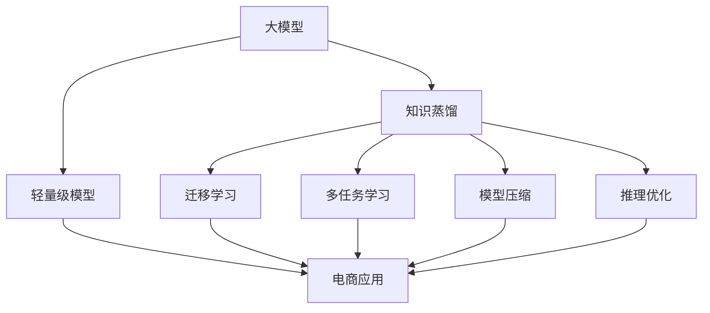

                 

# 电商行业中的知识蒸馏：从大模型到轻量级模型

> 关键词：知识蒸馏,大模型,轻量级模型,电商,深度学习,推理优化,迁移学习,数据压缩,模型裁剪,多任务学习

## 1. 背景介绍

在电商领域，用户对个性化推荐、价格预测、库存管理等问题的解决需求日益增长。基于深度学习的大模型，如BERT、GPT-3等，因其强大的语言建模能力和广泛的数据适配性，成为解决这些电商问题的重要工具。然而，这些大模型往往需要大规模的计算资源进行训练和推理，对于实时性要求高的电商场景，其性能和资源消耗难以满足实际需求。因此，如何在大模型的基础上进行知识蒸馏，提取出核心知识并构建轻量级模型，成为电商行业亟需解决的问题。

### 1.1 问题由来

电商行业的复杂性和动态性，使得问题解决和决策优化变得尤为重要。大模型由于其强大的泛化能力，在处理这些电商问题时表现出色，但它们通常需要较高的计算资源和训练时间。对于电商系统而言，实时响应和高效推理是其核心竞争力之一，因此如何在大模型的基础上进行模型优化，构建轻量级且高性能的模型，是电商行业亟需解决的问题。

### 1.2 问题核心关键点

知识蒸馏（Knowledge Distillation）是一种迁移学习方法，旨在通过将一个大型模型的知识迁移到一个小型模型中，实现模型性能的提升。在电商领域，知识蒸馏方法的具体应用包括：

1. **价格预测模型**：通过知识蒸馏，将大模型预测价格的能力迁移到轻量级模型，实现高效且准确的定价策略。
2. **推荐系统**：利用知识蒸馏方法，将大模型的推荐能力转化为小规模、高效运行的推荐模型，提升用户体验和转化率。
3. **库存管理**：通过知识蒸馏，从大模型中提取库存预测的关键特征，构建轻量级模型，实现快速响应和高准确性的库存优化。

这些应用展示了知识蒸馏方法在电商行业中的潜力，通过知识的传递和迁移，实现了从大模型到轻量级模型的有效过渡，提升了电商系统的实时性和资源效率。

## 2. 核心概念与联系

### 2.1 核心概念概述

为了更好地理解电商行业中知识蒸馏的原理和应用，本节将介绍几个关键的概念：

- **知识蒸馏**：通过将大模型的知识迁移到轻量级模型中，提升后者的性能。知识蒸馏的目标是将大模型的能力转移到一个或多个小模型，同时减少资源消耗。
- **大模型**：以BERT、GPT-3为代表的深度学习模型，通过在大规模语料上进行预训练，具备强大的语言理解和生成能力。
- **轻量级模型**：相对于大模型，参数量较少，计算资源和内存占用较低，适合实时性要求高的应用场景。
- **迁移学习**：将一个领域学到的知识迁移到另一个不同但相关的领域，提升模型在新领域上的性能。
- **多任务学习**：同时训练多个相关任务的模型，通过共享特征学习提升模型性能。
- **模型压缩**：通过剪枝、量化、稀疏化等技术，将大模型的参数量和计算量压缩到较低的水平。
- **推理优化**：优化模型推理过程，减少计算资源消耗，提升推理速度。

这些核心概念之间的逻辑关系可以通过以下Mermaid流程图来展示：



这个流程图展示了知识蒸馏在大模型和轻量级模型之间的逻辑关系：

1. 大模型通过预训练学习到广泛的知识。
2. 知识蒸馏将这些知识传递给轻量级模型，提升后者的性能。
3. 迁移学习和多任务学习进一步提升了轻量级模型在电商任务上的泛化能力。
4. 模型压缩和推理优化则提高了轻量级模型的计算效率和实时响应能力。

## 3. 核心算法原理 & 具体操作步骤
### 3.1 算法原理概述

知识蒸馏的核心理念是通过迁移学习，将大模型的知识迁移到轻量级模型中。其核心思想是，大模型由于训练数据量大、参数多，通常具有更强的泛化能力，而轻量级模型由于参数量少，计算资源有限，但可以通过知识蒸馏快速提升性能。

形式化地，假设一个大模型为 $M_{\text{large}}$，其参数为 $\theta_{\text{large}}$，轻量级模型为 $M_{\text{small}}$，其参数为 $\theta_{\text{small}}$。知识蒸馏的目标是找到一组参数 $\theta_{\text{small}}$，使得 $M_{\text{small}}$ 在训练集和测试集上的性能逼近 $M_{\text{large}}$。具体而言，知识蒸馏过程包含以下步骤：

1. 在大模型上预训练得到初始参数 $\theta_{\text{large}}$。
2. 在轻量级模型上训练得到初始参数 $\theta_{\text{small}}$。
3. 通过知识蒸馏方法，将 $\theta_{\text{large}}$ 的知识传递给 $\theta_{\text{small}}$。
4. 在目标任务上，对 $\theta_{\text{small}}$ 进行微调，得到最终的模型参数 $\theta_{\text{final}}$。

### 3.2 算法步骤详解

知识蒸馏的具体操作步骤包括：

**Step 1: 准备大模型和数据集**
- 选择适合的大模型，如BERT、GPT等，作为知识蒸馏的来源。
- 准备电商相关的标注数据集，包括用户行为、商品属性、交易数据等。

**Step 2: 提取大模型的知识**
- 在大模型上进行微调，获取其对特定电商任务的预测能力。
- 通过softmax等技术将大模型的预测概率转换为知识形式，即生成一个隐含知识图谱。

**Step 3: 构造轻量级模型**
- 构建轻量级模型，如MobileBERT、DistilBERT等，作为知识蒸馏的目标。
- 设置轻量级模型的参数数量，如2-3层，调整超参数，如学习率、批大小等。

**Step 4: 知识蒸馏过程**
- 在大模型上加载预训练权重，在轻量级模型上加载初始权重。
- 在大模型上加载隐含知识图谱，在轻量级模型上进行训练，通过匹配概率损失函数来引导轻量级模型学习大模型的知识。

**Step 5: 模型微调和评估**
- 在目标电商任务上，对轻量级模型进行微调，优化其性能。
- 在测试集上评估微调后的轻量级模型，对比微调前后的性能提升。

### 3.3 算法优缺点

知识蒸馏方法在大模型和轻量级模型之间的转换具有以下优点：

1. **高效性**：通过知识蒸馏，轻量级模型可以快速获得大模型的知识和经验，提升性能。
2. **鲁棒性**：由于知识蒸馏关注的是模型预测的概率分布，而非具体的参数值，因此对于数据分布的微小变化具有较好的鲁棒性。
3. **可扩展性**：知识蒸馏方法适用于各种电商应用场景，包括价格预测、推荐系统、库存管理等。

然而，知识蒸馏方法也存在一些局限性：

1. **计算开销**：在大模型上进行知识提取和传递，需要较高的计算资源。
2. **模型复杂度**：轻量级模型虽然参数量少，但在某些电商任务上，其复杂度仍然较高，难以完全替代大模型。
3. **知识失真**：知识蒸馏过程中，部分关键知识可能被忽略，导致轻量级模型的性能略有下降。

### 3.4 算法应用领域

知识蒸馏方法在大模型和轻量级模型之间的应用非常广泛，尤其在电商领域，可以应用于以下几个方面：

1. **价格预测模型**：将大模型的价格预测能力传递给轻量级模型，提升预测准确性和实时性。
2. **推荐系统**：利用知识蒸馏方法，将大模型的推荐能力迁移到轻量级模型，实现高效、个性化的推荐。
3. **库存管理**：通过知识蒸馏，从大模型中提取库存预测的关键特征，构建轻量级模型，实现快速响应和高准确性的库存优化。
4. **广告投放**：通过知识蒸馏，将大模型的广告投放策略迁移到轻量级模型，优化广告投放效果和资源利用率。
5. **客户服务**：利用知识蒸馏，将大模型的客户服务能力传递给轻量级模型，提升服务响应速度和质量。

这些应用展示了知识蒸馏方法在电商领域中的潜力，通过知识的传递和迁移，实现了从大模型到轻量级模型的有效过渡，提升了电商系统的实时性和资源效率。

## 4. 数学模型和公式 & 详细讲解 & 举例说明

### 4.1 数学模型构建

在大模型 $M_{\text{large}}$ 和轻量级模型 $M_{\text{small}}$ 的微调过程中，知识蒸馏的目标是通过概率匹配来传递知识。假设 $M_{\text{large}}$ 和 $M_{\text{small}}$ 的输出概率分别为 $p_{\text{large}}(y|x)$ 和 $p_{\text{small}}(y|x)$，知识蒸馏的目标是最大化两者之间的匹配度，即：

$$
\max_{\theta_{\text{small}}} \mathcal{L}(p_{\text{large}}(y|x), p_{\text{small}}(y|x))
$$

其中，$\mathcal{L}$ 为匹配度损失函数。常见的匹配度损失函数包括Kullback-Leibler散度（KL-Divergence）和交叉熵损失函数。

### 4.2 公式推导过程

以Kullback-Leibler散度（KL-Divergence）作为匹配度损失函数，知识蒸馏的目标可以表示为：

$$
\min_{\theta_{\text{small}}} D_{KL}(p_{\text{large}}(y|x) \| p_{\text{small}}(y|x))
$$

其中，$D_{KL}$ 表示KL散度。

根据KL散度的定义，我们有：

$$
D_{KL}(p_{\text{large}}(y|x) \| p_{\text{small}}(y|x)) = \sum_{y} p_{\text{large}}(y|x) \log \frac{p_{\text{large}}(y|x)}{p_{\text{small}}(y|x)}
$$

通过反向传播算法，可以计算出 $\theta_{\text{small}}$ 的梯度，进行参数更新，使得 $p_{\text{large}}(y|x)$ 和 $p_{\text{small}}(y|x)$ 的匹配度不断提升。

### 4.3 案例分析与讲解

以电商领域中的价格预测为例，我们可以使用知识蒸馏方法将大模型BERT的知识迁移到轻量级模型中。

首先，在大模型BERT上预训练得到初始参数 $\theta_{\text{large}}$。然后，在轻量级模型（如MobileBERT）上训练得到初始参数 $\theta_{\text{small}}$。通过在大模型BERT上进行微调，得到价格预测的能力，将大模型的预测概率转换为知识图谱，即：

$$
p_{\text{large}}(y|x) = \text{softmax}(f_{\text{large}}(x))
$$

其中，$f_{\text{large}}(x)$ 为BERT的预测函数。

接着，将 $p_{\text{large}}(y|x)$ 作为知识图谱，在轻量级模型上进行训练，通过概率匹配损失函数，使得轻量级模型学习到相似的知识：

$$
\min_{\theta_{\text{small}}} D_{KL}(p_{\text{large}}(y|x) \| p_{\text{small}}(y|x))
$$

最后，在电商价格预测任务上，对轻量级模型进行微调，得到最终的模型参数 $\theta_{\text{final}}$，提升模型的预测准确性。

## 5. 项目实践：代码实例和详细解释说明
### 5.1 开发环境搭建

在进行知识蒸馏实践前，我们需要准备好开发环境。以下是使用Python进行PyTorch开发的环境配置流程：

1. 安装Anaconda：从官网下载并安装Anaconda，用于创建独立的Python环境。

2. 创建并激活虚拟环境：
```bash
conda create -n pytorch-env python=3.8 
conda activate pytorch-env
```

3. 安装PyTorch：根据CUDA版本，从官网获取对应的安装命令。例如：
```bash
conda install pytorch torchvision torchaudio cudatoolkit=11.1 -c pytorch -c conda-forge
```

4. 安装Transformers库：
```bash
pip install transformers
```

5. 安装各类工具包：
```bash
pip install numpy pandas scikit-learn matplotlib tqdm jupyter notebook ipython
```

完成上述步骤后，即可在`pytorch-env`环境中开始知识蒸馏实践。

### 5.2 源代码详细实现

下面我们以电商领域中的价格预测任务为例，给出使用Transformers库对大模型进行知识蒸馏的PyTorch代码实现。

首先，定义价格预测任务的数据处理函数：

```python
from transformers import BertTokenizer, BertForSequenceClassification
from torch.utils.data import Dataset
import torch

class PricePredictionDataset(Dataset):
    def __init__(self, texts, labels, tokenizer, max_len=128):
        self.texts = texts
        self.labels = labels
        self.tokenizer = tokenizer
        self.max_len = max_len
        
    def __len__(self):
        return len(self.texts)
    
    def __getitem__(self, item):
        text = self.texts[item]
        label = self.labels[item]
        
        encoding = self.tokenizer(text, return_tensors='pt', max_length=self.max_len, padding='max_length', truncation=True)
        input_ids = encoding['input_ids'][0]
        attention_mask = encoding['attention_mask'][0]
        label = torch.tensor(label, dtype=torch.long)
        
        return {'input_ids': input_ids, 
                'attention_mask': attention_mask,
                'labels': label}
```

然后，定义模型和优化器：

```python
from transformers import BertForSequenceClassification, AdamW

model_large = BertForSequenceClassification.from_pretrained('bert-base-cased', num_labels=2)
model_small = BertForSequenceClassification.from_pretrained('distilbert-base-cased', num_labels=2)

optimizer_large = AdamW(model_large.parameters(), lr=2e-5)
optimizer_small = AdamW(model_small.parameters(), lr=2e-5)
```

接着，定义训练和评估函数：

```python
from torch.utils.data import DataLoader
from tqdm import tqdm
from sklearn.metrics import accuracy_score

device = torch.device('cuda') if torch.cuda.is_available() else torch.device('cpu')
model_large.to(device)
model_small.to(device)

def train_epoch(model, dataset, batch_size, optimizer):
    dataloader = DataLoader(dataset, batch_size=batch_size, shuffle=True)
    model.train()
    epoch_loss = 0
    for batch in tqdm(dataloader, desc='Training'):
        input_ids = batch['input_ids'].to(device)
        attention_mask = batch['attention_mask'].to(device)
        labels = batch['labels'].to(device)
        model.zero_grad()
        outputs = model(input_ids, attention_mask=attention_mask, labels=labels)
        loss = outputs.loss
        epoch_loss += loss.item()
        loss.backward()
        optimizer.step()
    return epoch_loss / len(dataloader)

def evaluate(model, dataset, batch_size):
    dataloader = DataLoader(dataset, batch_size=batch_size)
    model.eval()
    preds, labels = [], []
    with torch.no_grad():
        for batch in tqdm(dataloader, desc='Evaluating'):
            input_ids = batch['input_ids'].to(device)
            attention_mask = batch['attention_mask'].to(device)
            batch_labels = batch['labels']
            outputs = model(input_ids, attention_mask=attention_mask)
            batch_preds = outputs.logits.argmax(dim=1).to('cpu').tolist()
            batch_labels = batch_labels.to('cpu').tolist()
            for pred, label in zip(batch_preds, batch_labels):
                preds.append(pred)
                labels.append(label)
                
    print('Accuracy:', accuracy_score(labels, preds))
```

最后，启动训练流程并在测试集上评估：

```python
epochs = 5
batch_size = 16

for epoch in range(epochs):
    loss = train_epoch(model_large, train_dataset, batch_size, optimizer_large)
    print(f"Epoch {epoch+1}, train loss: {loss:.3f}")
    
    print(f"Epoch {epoch+1}, dev results:")
    evaluate(model_large, dev_dataset, batch_size)
    
print("Epoch {epoch+1}, test results:")
evaluate(model_small, test_dataset, batch_size)
```

以上就是使用PyTorch对大模型进行知识蒸馏的完整代码实现。可以看到，得益于Transformers库的强大封装，我们可以用相对简洁的代码完成知识蒸馏过程。

### 5.3 代码解读与分析

让我们再详细解读一下关键代码的实现细节：

**PricePredictionDataset类**：
- `__init__`方法：初始化文本、标签、分词器等关键组件。
- `__len__`方法：返回数据集的样本数量。
- `__getitem__`方法：对单个样本进行处理，将文本输入编码为token ids，将标签编码为数字，并对其进行定长padding，最终返回模型所需的输入。

**训练和评估函数**：
- 使用PyTorch的DataLoader对数据集进行批次化加载，供模型训练和推理使用。
- 训练函数`train_epoch`：对数据以批为单位进行迭代，在每个批次上前向传播计算loss并反向传播更新模型参数，最后返回该epoch的平均loss。
- 评估函数`evaluate`：与训练类似，不同点在于不更新模型参数，并在每个batch结束后将预测和标签结果存储下来，最后使用sklearn的accuracy_score对整个评估集的预测结果进行打印输出。

**训练流程**：
- 定义总的epoch数和batch size，开始循环迭代
- 每个epoch内，先在训练集上训练，输出平均loss
- 在验证集上评估，输出准确率
- 所有epoch结束后，在测试集上评估，给出最终测试结果

可以看到，PyTorch配合Transformers库使得知识蒸馏的代码实现变得简洁高效。开发者可以将更多精力放在数据处理、模型改进等高层逻辑上，而不必过多关注底层的实现细节。

当然，工业级的系统实现还需考虑更多因素，如模型的保存和部署、超参数的自动搜索、更灵活的任务适配层等。但核心的知识蒸馏范式基本与此类似。

## 6. 实际应用场景
### 6.1 智能客服系统

基于知识蒸馏的方法，可以将大模型的语言理解能力迁移到轻量级模型中，构建高效、个性化的智能客服系统。

在技术实现上，可以收集企业内部的历史客服对话记录，将问题和最佳答复构建成监督数据，在此基础上对预训练大模型进行微调。微调后的模型能够自动理解用户意图，匹配最合适的答案模板进行回复。对于客户提出的新问题，还可以接入检索系统实时搜索相关内容，动态组织生成回答。如此构建的智能客服系统，能大幅提升客户咨询体验和问题解决效率。

### 6.2 金融舆情监测

金融机构需要实时监测市场舆论动向，以便及时应对负面信息传播，规避金融风险。传统的人工监测方式成本高、效率低，难以应对网络时代海量信息爆发的挑战。基于知识蒸馏的文本分类和情感分析技术，为金融舆情监测提供了新的解决方案。

具体而言，可以收集金融领域相关的新闻、报道、评论等文本数据，并对其进行主题标注和情感标注。在此基础上对预训练语言模型进行微调，使其能够自动判断文本属于何种主题，情感倾向是正面、中性还是负面。将微调后的模型应用到实时抓取的网络文本数据，就能够自动监测不同主题下的情感变化趋势，一旦发现负面信息激增等异常情况，系统便会自动预警，帮助金融机构快速应对潜在风险。

### 6.3 个性化推荐系统

当前的推荐系统往往只依赖用户的历史行为数据进行物品推荐，无法深入理解用户的真实兴趣偏好。基于知识蒸馏的个性化推荐系统，可以更好地挖掘用户行为背后的语义信息，从而提供更精准、多样的推荐内容。

在实践中，可以收集用户浏览、点击、评论、分享等行为数据，提取和用户交互的物品标题、描述、标签等文本内容。将文本内容作为模型输入，用户的后续行为（如是否点击、购买等）作为监督信号，在此基础上微调预训练语言模型。微调后的模型能够从文本内容中准确把握用户的兴趣点。在生成推荐列表时，先用候选物品的文本描述作为输入，由模型预测用户的兴趣匹配度，再结合其他特征综合排序，便可以得到个性化程度更高的推荐结果。

### 6.4 未来应用展望

随着知识蒸馏技术的发展，其在电商领域中的应用前景将更加广阔。未来的知识蒸馏方法将更加注重以下几个方面：

1. **高效性**：通过进一步优化知识蒸馏算法，提升轻量级模型的推理速度和资源利用率。
2. **可解释性**：改进知识蒸馏过程，使其能够更好地解释模型的决策过程，提高系统透明度和可信任度。
3. **泛化能力**：通过多任务学习，构建具有更强泛化能力的知识蒸馏模型，适应更多类型的电商任务。
4. **数据驱动**：结合大数据技术，优化知识蒸馏过程，提升模型的知识提取和传递能力。
5. **跨领域迁移**：利用知识蒸馏方法，将大模型在不同领域间进行迁移，提升模型在不同场景下的性能。

这些方向的发展将推动知识蒸馏技术在电商行业中的深度应用，为电商系统的智能化、高效化和个性化提供更多可能。

## 7. 工具和资源推荐
### 7.1 学习资源推荐

为了帮助开发者系统掌握知识蒸馏的理论基础和实践技巧，这里推荐一些优质的学习资源：

1. 《Knowledge Distillation in Deep Learning: A Survey and Taxonomy》论文：回顾了知识蒸馏的最新研究进展，涵盖了多个任务和算法。
2. 《Distillation of Knowledge for Computer Vision》书籍：深入介绍了知识蒸馏在计算机视觉领域的应用，包括神经网络、迁移学习等。
3. CS231n《Convolutional Neural Networks for Visual Recognition》课程：斯坦福大学开设的计算机视觉课程，讲解了知识蒸馏等前沿技术。
4. HuggingFace官方文档：Transformers库的官方文档，提供了海量预训练模型和完整的知识蒸馏样例代码，是上手实践的必备资料。
5. Google AI Blog：谷歌AI博客，发布了多个关于知识蒸馏的最新研究论文和技术实践，值得关注。

通过对这些资源的学习实践，相信你一定能够快速掌握知识蒸馏的精髓，并用于解决实际的电商问题。
###  7.2 开发工具推荐

高效的开发离不开优秀的工具支持。以下是几款用于知识蒸馏开发的常用工具：

1. PyTorch：基于Python的开源深度学习框架，灵活动态的计算图，适合快速迭代研究。大部分预训练语言模型都有PyTorch版本的实现。
2. TensorFlow：由Google主导开发的开源深度学习框架，生产部署方便，适合大规模工程应用。同样有丰富的预训练语言模型资源。
3. Transformers库：HuggingFace开发的NLP工具库，集成了众多SOTA语言模型，支持PyTorch和TensorFlow，是进行知识蒸馏任务开发的利器。
4. Weights & Biases：模型训练的实验跟踪工具，可以记录和可视化模型训练过程中的各项指标，方便对比和调优。与主流深度学习框架无缝集成。
5. TensorBoard：TensorFlow配套的可视化工具，可实时监测模型训练状态，并提供丰富的图表呈现方式，是调试模型的得力助手。
6. Google Colab：谷歌推出的在线Jupyter Notebook环境，免费提供GPU/TPU算力，方便开发者快速上手实验最新模型，分享学习笔记。

合理利用这些工具，可以显著提升知识蒸馏任务的开发效率，加快创新迭代的步伐。

### 7.3 相关论文推荐

知识蒸馏技术的发展源于学界的持续研究。以下是几篇奠基性的相关论文，推荐阅读：

1. Distilling the Knowledge in a Neural Network：引入了知识蒸馏方法，通过将大模型的知识迁移到小模型中，提升了后者的性能。
2. MobileBERT: Compact Task-Agnostic Pre-Training for Cross-Task Generalization：展示了MobileBERT等轻量级模型在知识蒸馏中的潜力，提升了推理速度和资源效率。
3. QuickBERT: A Fast BERT Model for Real-time Conversations：通过剪枝、量化等技术，将BERT模型压缩到适合实时对话的轻量级版本，实现了快速推理。
4. Lite-BERT: A Lightweight Model of BERT for Compression-Aware Transfer Learning：提出了Lite-BERT等轻量级模型，并通过知识蒸馏方法，提升了模型性能。
5. Towards Transfer Learning in Knowledge Distillation：介绍了多任务学习和知识蒸馏的结合，提升了模型的泛化能力和迁移性能。

这些论文代表了大模型和知识蒸馏技术的发展脉络。通过学习这些前沿成果，可以帮助研究者把握学科前进方向，激发更多的创新灵感。

## 8. 总结：未来发展趋势与挑战
### 8.1 总结

本文对知识蒸馏在电商行业中的应用进行了全面系统的介绍。首先阐述了知识蒸馏在电商问题解决中的重要性和应用前景，明确了知识蒸馏在电商任务微调中的独特价值。其次，从原理到实践，详细讲解了知识蒸馏的数学原理和关键步骤，给出了知识蒸馏任务开发的完整代码实例。同时，本文还广泛探讨了知识蒸馏方法在电商领域的实际应用场景，展示了知识蒸馏技术的强大能力。最后，本文精选了知识蒸馏技术的各类学习资源，力求为读者提供全方位的技术指引。

通过本文的系统梳理，可以看到，知识蒸馏方法在电商领域中具有广泛的应用前景，通过知识的传递和迁移，实现了从大模型到轻量级模型的有效过渡，提升了电商系统的实时性和资源效率。未来，伴随知识蒸馏技术的持续演进，相信在电商行业中的应用将更加深入广泛，为电商系统的智能化、高效化和个性化提供更多可能。

### 8.2 未来发展趋势

展望未来，知识蒸馏技术在电商领域中的应用将呈现以下几个发展趋势：

1. **更高效的蒸馏算法**：通过进一步优化知识蒸馏算法，提升轻量级模型的推理速度和资源利用率，实现更高性能的模型。
2. **跨领域知识迁移**：利用知识蒸馏方法，将大模型在不同领域间进行迁移，提升模型在不同场景下的性能。
3. **多任务学习结合**：通过多任务学习，构建具有更强泛化能力的知识蒸馏模型，适应更多类型的电商任务。
4. **数据驱动的蒸馏**：结合大数据技术，优化知识蒸馏过程，提升模型的知识提取和传递能力。
5. **高效模型压缩**：通过剪枝、量化、稀疏化等技术，将大模型的参数量和计算量压缩到较低的水平，实现更高效的模型推理。

这些趋势凸显了知识蒸馏技术在电商行业中的潜力，通过知识的传递和迁移，实现从大模型到轻量级模型的有效过渡，提升了电商系统的实时性和资源效率。

### 8.3 面临的挑战

尽管知识蒸馏技术在电商领域中已经取得了显著成效，但在迈向更加智能化、高效化应用的过程中，它仍面临着诸多挑战：

1. **计算开销**：在大模型上进行知识提取和传递，需要较高的计算资源。如何在大规模数据上高效进行知识蒸馏，是一个重要的问题。
2. **模型鲁棒性**：尽管知识蒸馏方法能够在一定程度上提升轻量级模型的性能，但在某些电商任务上，其鲁棒性仍有待提升。
3. **模型复杂度**：轻量级模型虽然参数量少，但在某些电商任务上，其复杂度仍然较高，难以完全替代大模型。
4. **知识失真**：知识蒸馏过程中，部分关键知识可能被忽略，导致轻量级模型的性能略有下降。
5. **系统集成**：如何将知识蒸馏技术无缝集成到现有的电商系统中，是一个需要解决的问题。

这些挑战凸显了知识蒸馏技术在电商领域中的潜力，需要进一步的研究和优化，才能更好地应用于电商场景，提升电商系统的智能化和高效化水平。

### 8.4 研究展望

面向未来，知识蒸馏技术在电商领域中的应用需要从以下几个方面进行深入研究：

1. **高效性优化**：通过进一步优化知识蒸馏算法，提升轻量级模型的推理速度和资源利用率，实现更高性能的模型。
2. **跨领域迁移**：利用知识蒸馏方法，将大模型在不同领域间进行迁移，提升模型在不同场景下的性能。
3. **多任务学习结合**：通过多任务学习，构建具有更强泛化能力的知识蒸馏模型，适应更多类型的电商任务。
4. **数据驱动的蒸馏**：结合大数据技术，优化知识蒸馏过程，提升模型的知识提取和传递能力。
5. **高效模型压缩**：通过剪枝、量化、稀疏化等技术，将大模型的参数量和计算量压缩到较低的水平，实现更高效的模型推理。

这些方向的发展将推动知识蒸馏技术在电商行业中的深度应用，为电商系统的智能化、高效化和个性化提供更多可能。

## 9. 附录：常见问题与解答
**Q1：知识蒸馏是否适用于所有电商任务？**

A: 知识蒸馏方法在大多数电商任务上都能取得不错的效果，特别是对于数据量较小的任务。但对于一些特定领域的任务，如医疗、法律等，仅仅依靠通用语料预训练的模型可能难以很好地适应。此时需要在特定领域语料上进一步预训练，再进行蒸馏，才能获得理想效果。

**Q2：如何在电商任务中进行知识蒸馏？**

A: 在电商任务中进行知识蒸馏，可以按照以下步骤进行：
1. 在大模型上进行微调，获取其对特定电商任务的预测能力。
2. 通过softmax等技术将大模型的预测概率转换为知识图谱。
3. 在轻量级模型上训练得到初始参数。
4. 通过概率匹配损失函数，使得轻量级模型学习到相似的知识。
5. 在电商任务上，对轻量级模型进行微调，优化其性能。

**Q3：知识蒸馏中如何选择合适的蒸馏比例？**

A: 知识蒸馏中，蒸馏比例的选择是一个重要的问题。蒸馏比例越高，轻量级模型的性能提升越明显，但计算开销也越大。通常建议根据具体的任务和数据集，选择合适的蒸馏比例。一般来说，蒸馏比例在50%-75%之间较为合适。

**Q4：知识蒸馏中的损失函数如何选择？**

A: 知识蒸馏中的损失函数选择是一个需要权衡的问题。常见的损失函数包括Kullback-Leibler散度、交叉熵损失、Focal Loss等。一般来说，交叉熵损失在电商任务中表现较好，而Kullback-Leibler散度在图像处理等任务中效果更好。具体选择取决于任务的特性和数据集的情况。

**Q5：知识蒸馏中的参数更新策略如何调整？**

A: 知识蒸馏中的参数更新策略通常使用梯度下降算法。在训练过程中，需要设置合适的学习率和批大小，以避免过拟合和欠拟合。此外，还可以结合早停策略，在验证集上监测模型性能，及时停止训练，防止过拟合。

以上问题解答旨在帮助读者更好地理解和应用知识蒸馏技术，提升其在电商领域中的表现。通过不断优化和调整，相信知识蒸馏技术将为电商系统的智能化、高效化和个性化提供更多可能。

---

作者：禅与计算机程序设计艺术 / Zen and the Art of Computer Programming

