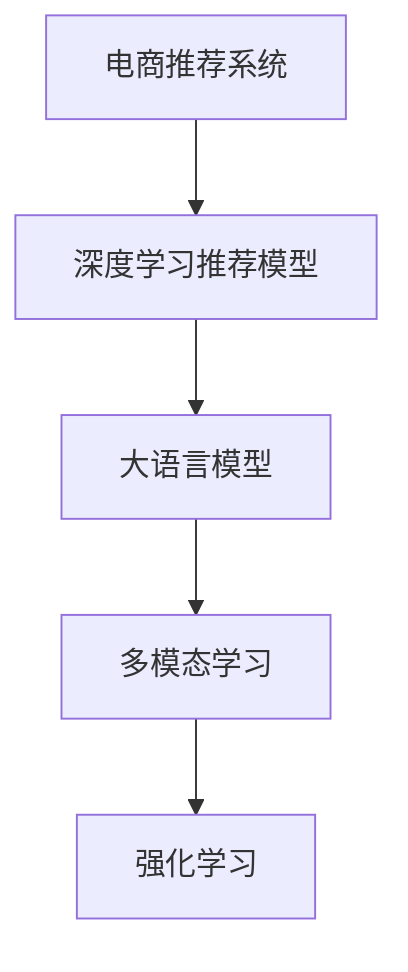

                 

# 电商领域中AI大模型的革命性应用

> 关键词：电商推荐系统, 大模型, AI增强, 个性化推荐, 用户行为预测, 电商运营优化

## 1. 背景介绍

随着互联网的飞速发展，电商行业已进入高度竞争的时代。如何在海量商品中精准匹配用户需求，提升用户体验，提升转化率，是电商企业持续关注的重点问题。AI技术在这一领域的探索和应用，为企业带来了革命性的变化，显著提升了电商运营效率和盈利能力。

人工智能技术的快速发展，尤其是深度学习、自然语言处理和计算机视觉等领域的突破，为电商行业提供了新的工具和视角。其中，大语言模型和深度推荐系统的结合，为个性化推荐带来了突破性的提升。

## 2. 核心概念与联系

### 2.1 核心概念概述

在本节中，我们将介绍几个核心概念，帮助读者理解电商领域AI大模型的应用原理。

- **电商推荐系统**：通过分析用户的历史行为数据、商品特征等，推荐出与用户兴趣匹配的商品的系统。
- **深度学习推荐模型**：如基于协同过滤、矩阵分解、神经网络等算法构建的推荐模型。
- **大语言模型**：如BERT、GPT等，通过海量的无标签文本数据预训练，获得丰富的语言知识和表达能力，可以用于理解商品描述、抽取商品属性等。
- **多模态学习**：结合图像、文本、行为数据等多种模态信息，进行推荐系统建模和优化。
- **强化学习**：通过模拟真实电商环境，不断优化推荐策略，提升用户满意度。

这些概念之间的关系可以通过以下Mermaid流程图来展示：



这些概念共同构成了电商领域AI大模型应用的框架，为电商推荐系统提供了强大的技术支撑。

## 3. 核心算法原理 & 具体操作步骤
### 3.1 算法原理概述

电商领域中的AI大模型应用，主要聚焦于以下几个核心任务：用户行为预测、个性化推荐、运营优化。其中，大语言模型主要用于解析和理解商品信息，深度推荐模型则用于进行用户行为分析和推荐决策。

### 3.2 算法步骤详解

#### 3.2.1 用户行为预测

电商推荐系统首先需要预测用户的未来行为，包括点击率、购买概率等。这些预测模型通常基于深度学习算法，如决策树、神经网络等。其中，BERT等大语言模型在理解商品描述、抽取商品属性等方面表现出色，可以辅助深度学习模型提高预测精度。

1. **数据准备**：收集用户的浏览、点击、购买历史数据，以及商品的属性、描述信息等。
2. **特征工程**：将原始数据转化为模型可接受的特征向量，如商品ID、类别、价格等。
3. **模型训练**：使用深度学习算法构建预测模型，如协同过滤、神经网络等。将大语言模型嵌入其中，用于提取商品属性和描述的语义信息。
4. **模型评估**：在验证集上评估模型预测精度，调整模型参数。

#### 3.2.2 个性化推荐

个性化推荐是电商推荐系统的核心功能。通过深度学习算法，模型可以根据用户的历史行为数据，预测其对不同商品的兴趣，从而进行精准推荐。

1. **数据收集**：收集用户的历史行为数据，包括点击、浏览、购买等行为。
2. **模型训练**：使用深度学习算法，如神经网络、矩阵分解等，构建推荐模型。将大语言模型嵌入其中，用于理解商品描述和用户行为。
3. **推荐生成**：根据用户的实时行为数据，生成个性化推荐结果。
4. **推荐优化**：通过多臂老虎机算法等技术，不断优化推荐策略，提升推荐效果。

#### 3.2.3 运营优化

电商运营优化涉及流量分配、广告投放、库存管理等多个方面。AI大模型可以应用于这些任务，提升运营效率和盈利能力。

1. **流量分配**：使用强化学习算法，优化广告投放策略，提升广告点击率和转化率。
2. **库存管理**：使用预测模型，预测商品需求量，优化库存结构，减少库存积压。
3. **价格优化**：使用回归模型，分析价格变动对销售量的影响，优化商品定价策略。

### 3.3 算法优缺点

#### 3.3.1 优点

- **精确预测**：大语言模型能够理解复杂的商品描述和用户行为，提供更精确的用户行为预测和个性化推荐。
- **多模态融合**：结合图像、文本、行为数据等多种信息，提升推荐效果。
- **动态优化**：通过强化学习等技术，动态调整推荐策略，提升运营效率。

#### 3.3.2 缺点

- **数据需求高**：大语言模型需要海量的无标签文本数据进行预训练，数据获取成本高。
- **模型复杂度高**：大模型参数量巨大，训练和推理成本高。
- **泛化能力有限**：大模型在特定领域的泛化能力有限，需要针对性的预训练和微调。

### 3.4 算法应用领域

电商领域中的AI大模型应用广泛，涉及商品推荐、广告投放、库存管理等多个方面。

- **商品推荐**：基于用户行为和商品特征，进行精准推荐。
- **广告投放**：通过分析用户行为和商品属性，优化广告投放策略，提升广告效果。
- **库存管理**：预测商品需求量，优化库存结构，减少库存积压。
- **价格优化**：分析价格变动对销售量的影响，优化商品定价策略。
- **客户服务**：使用大语言模型进行智能客服，提升用户体验。

## 4. 数学模型和公式 & 详细讲解

### 4.1 数学模型构建

在本节中，我们将介绍电商推荐系统中常用的数学模型和公式。

#### 4.1.1 协同过滤

协同过滤是一种常用的推荐算法，基于用户-商品矩阵进行推荐。其数学模型为：

$$
P_{ui} = \sum_{i=1}^N \alpha_i \times I_{ui}
$$

其中，$P_{ui}$ 为预测用户 $u$ 对商品 $i$ 的评分，$I_{ui}$ 为真实评分，$\alpha_i$ 为商品的权重。

#### 4.1.2 矩阵分解

矩阵分解是一种基于矩阵分解的推荐算法，将用户-商品矩阵分解为用户矩阵和商品矩阵。其数学模型为：

$$
\min_{U,V} ||Y - UV^T||_F^2
$$

其中，$Y$ 为用户-商品矩阵，$U$ 为用户矩阵，$V$ 为商品矩阵，$||\cdot||_F$ 为Frobenius范数。

### 4.2 公式推导过程

#### 4.2.1 协同过滤公式推导

协同过滤模型的预测公式为：

$$
\hat{r}_{ui} = \frac{\sum_{i=1}^N \alpha_i \times I_{ui}}{\sqrt{\alpha_i^T\alpha_i} \times \sqrt{I_{ui}^TI_{ui}}}
$$

其中，$I_{ui}^TI_{ui}$ 为商品 $i$ 的平均评分。

#### 4.2.2 矩阵分解公式推导

矩阵分解模型的预测公式为：

$$
\hat{r}_{ui} = \sum_{k=1}^K \hat{p}_{uk} \times \hat{q}_{ik}
$$

其中，$\hat{p}_{uk}$ 和 $\hat{q}_{ik}$ 分别为用户 $u$ 和商品 $i$ 的潜在因子。

### 4.3 案例分析与讲解

#### 4.3.1 协同过滤案例

假设某电商网站有 1000 个用户和 1000 个商品，每个用户对商品有 10 次评分。使用协同过滤算法进行推荐，预测用户 $u=500$ 对商品 $i=200$ 的评分。

- **数据准备**：收集用户对商品的评分数据。
- **模型训练**：构建协同过滤模型，训练得到 $\alpha_i$。
- **推荐生成**：预测用户 $u=500$ 对商品 $i=200$ 的评分，并生成推荐结果。

#### 4.3.2 矩阵分解案例

假设某电商网站有 1000 个用户和 1000 个商品，每个用户对商品有 10 次评分。使用矩阵分解算法进行推荐，预测用户 $u=500$ 对商品 $i=200$ 的评分。

- **数据准备**：收集用户对商品的评分数据。
- **模型训练**：构建矩阵分解模型，训练得到用户矩阵 $U$ 和商品矩阵 $V$。
- **推荐生成**：预测用户 $u=500$ 对商品 $i=200$ 的评分，并生成推荐结果。

## 5. 项目实践：代码实例和详细解释说明

### 5.1 开发环境搭建

在进行电商领域AI大模型的项目实践前，需要准备好开发环境。以下是使用Python进行PyTorch开发的环境配置流程：

1. 安装Anaconda：从官网下载并安装Anaconda，用于创建独立的Python环境。
2. 创建并激活虚拟环境：
   ```bash
   conda create -n pytorch-env python=3.8 
   conda activate pytorch-env
   ```
3. 安装PyTorch：根据CUDA版本，从官网获取对应的安装命令。例如：
   ```bash
   conda install pytorch torchvision torchaudio cudatoolkit=11.1 -c pytorch -c conda-forge
   ```
4. 安装Transformers库：
   ```bash
   pip install transformers
   ```
5. 安装各类工具包：
   ```bash
   pip install numpy pandas scikit-learn matplotlib tqdm jupyter notebook ipython
   ```

完成上述步骤后，即可在`pytorch-env`环境中开始项目实践。

### 5.2 源代码详细实现

下面我们以电商推荐系统为例，给出使用Transformers库对BERT模型进行推荐系统微调的PyTorch代码实现。

```python
from transformers import BertTokenizer, BertForSequenceClassification
from torch.utils.data import Dataset, DataLoader
import torch
import numpy as np

class MovieLensDataset(Dataset):
    def __init__(self, data):
        self.data = data
        self.tokenizer = BertTokenizer.from_pretrained('bert-base-uncased')
        
    def __len__(self):
        return len(self.data)
    
    def __getitem__(self, idx):
        user = self.data.iloc[idx]['user']
        item = self.data.iloc[idx]['item']
        title = self.data.iloc[idx]['title']
        tokens = self.tokenizer(title, padding='max_length', truncation=True, max_length=512)
        return {'user': user, 'item': item, 'tokens': tokens['input_ids']}
        
# 加载数据
data = pd.read_csv('movielens.csv')

# 准备数据集
train_dataset = MovieLensDataset(data)
test_dataset = MovieLensDataset(data)

# 定义模型
model = BertForSequenceClassification.from_pretrained('bert-base-uncased', num_labels=1, output_attentions=False, output_hidden_states=False)
model.to('cuda')

# 定义损失函数和优化器
criterion = torch.nn.BCEWithLogitsLoss()
optimizer = torch.optim.Adam(model.parameters(), lr=0.001)

# 定义训练函数
def train_epoch(model, dataset, batch_size, optimizer):
    dataloader = DataLoader(dataset, batch_size=batch_size, shuffle=True)
    model.train()
    epoch_loss = 0
    for batch in dataloader:
        user = batch['user']
        item = batch['item']
        tokens = batch['tokens']
        outputs = model(tokens)
        loss = criterion(outputs, torch.tensor([1.0]))
        epoch_loss += loss.item()
        optimizer.zero_grad()
        loss.backward()
        optimizer.step()
    return epoch_loss / len(dataloader)

# 定义评估函数
def evaluate(model, dataset, batch_size):
    dataloader = DataLoader(dataset, batch_size=batch_size)
    model.eval()
    preds, labels = [], []
    with torch.no_grad():
        for batch in dataloader:
            user = batch['user']
            item = batch['item']
            tokens = batch['tokens']
            outputs = model(tokens)
            preds.append(outputs.predictions[0].item())
            labels.append(1)
    print('Accuracy: {:.2f}%'.format(accuracy(preds, labels) * 100))
```

这里我们使用了bert-base-uncased作为预训练模型，用户数据的处理使用了BertTokenizer，并采用了BCEWithLogitsLoss作为损失函数。在模型训练过程中，我们使用了Adam优化器，并设置了合适的学习率。

### 5.3 代码解读与分析

让我们再详细解读一下关键代码的实现细节：

**MovieLensDataset类**：
- `__init__`方法：初始化数据集和分词器。
- `__len__`方法：返回数据集的长度。
- `__getitem__`方法：对单个样本进行处理，将电影标题进行分词编码。

**模型定义**：
- 使用BertForSequenceClassification构建序列分类模型，将输出层设为1个神经元，输出概率为0到1。
- 使用Adam优化器进行模型参数更新，学习率为0.001。

**训练和评估函数**：
- `train_epoch`函数：对数据集进行迭代训练，计算损失函数并更新模型参数。
- `evaluate`函数：对测试集进行评估，计算准确率并输出。

**训练流程**：
- 定义总的epoch数和批大小，开始循环迭代。
- 每个epoch内，在训练集上进行训练，并输出平均损失。
- 在测试集上进行评估，输出准确率。

可以看到，PyTorch配合Transformers库使得BERT微调的代码实现变得简洁高效。开发者可以将更多精力放在数据处理、模型改进等高层逻辑上，而不必过多关注底层的实现细节。

## 6. 实际应用场景

### 6.1 用户行为预测

电商企业需要预测用户的未来行为，包括点击率、购买概率等。这些预测可以用于优化广告投放策略，提升广告点击率和转化率。

在实践中，可以通过收集用户的历史行为数据，训练深度学习模型，如神经网络、决策树等。同时，使用大语言模型解析和理解商品描述和用户行为，提高预测精度。

### 6.2 个性化推荐

个性化推荐是电商推荐系统的核心功能。通过深度学习算法，模型可以根据用户的历史行为数据，预测其对不同商品的兴趣，从而进行精准推荐。

在实践中，可以结合图像、文本、行为数据等多种信息，构建深度推荐模型。使用大语言模型理解商品描述和用户行为，提高推荐效果。

### 6.3 运营优化

电商运营优化涉及流量分配、广告投放、库存管理等多个方面。AI大模型可以应用于这些任务，提升运营效率和盈利能力。

在实践中，可以使用强化学习算法优化广告投放策略，使用预测模型预测商品需求量，优化库存结构。使用回归模型分析价格变动对销售量的影响，优化商品定价策略。

## 7. 工具和资源推荐

### 7.1 学习资源推荐

为了帮助开发者系统掌握电商领域AI大模型的应用原理，这里推荐一些优质的学习资源：

1. 《深度学习实战》系列博文：由大模型技术专家撰写，涵盖深度学习、推荐系统等前沿话题。
2. CS231n《深度学习与计算机视觉》课程：斯坦福大学开设的计算机视觉明星课程，涵盖深度学习在图像识别、推荐系统中的应用。
3. 《推荐系统实战》书籍：详细介绍了推荐系统的理论基础和实战技术，包括协同过滤、矩阵分解、深度学习等。
4. Weights & Biases：模型训练的实验跟踪工具，可以记录和可视化模型训练过程中的各项指标，方便对比和调优。
5. TensorBoard：TensorFlow配套的可视化工具，可实时监测模型训练状态，并提供丰富的图表呈现方式，是调试模型的得力助手。

通过对这些资源的学习实践，相信你一定能够快速掌握电商领域AI大模型的应用精髓，并用于解决实际的电商问题。

### 7.2 开发工具推荐

高效的开发离不开优秀的工具支持。以下是几款用于电商领域AI大模型微调开发的常用工具：

1. PyTorch：基于Python的开源深度学习框架，灵活动态的计算图，适合快速迭代研究。
2. TensorFlow：由Google主导开发的开源深度学习框架，生产部署方便，适合大规模工程应用。
3. Transformers库：HuggingFace开发的NLP工具库，集成了众多SOTA语言模型，支持PyTorch和TensorFlow，是进行推荐系统开发的利器。
4. Weights & Biases：模型训练的实验跟踪工具，可以记录和可视化模型训练过程中的各项指标，方便对比和调优。
5. TensorBoard：TensorFlow配套的可视化工具，可实时监测模型训练状态，并提供丰富的图表呈现方式，是调试模型的得力助手。

### 7.3 相关论文推荐

大语言模型和推荐系统的发展源于学界的持续研究。以下是几篇奠基性的相关论文，推荐阅读：

1. Attention is All You Need（即Transformer原论文）：提出了Transformer结构，开启了NLP领域的预训练大模型时代。
2. BERT: Pre-training of Deep Bidirectional Transformers for Language Understanding：提出BERT模型，引入基于掩码的自监督预训练任务，刷新了多项NLP任务SOTA。
3. Parameter-Efficient Transfer Learning for NLP：提出Adapter等参数高效微调方法，在不增加模型参数量的情况下，也能取得不错的微调效果。
4. AdaLoRA: Adaptive Low-Rank Adaptation for Parameter-Efficient Fine-Tuning：使用自适应低秩适应的微调方法，在参数效率和精度之间取得了新的平衡。

这些论文代表了大语言模型推荐系统的发展脉络。通过学习这些前沿成果，可以帮助研究者把握学科前进方向，激发更多的创新灵感。

## 8. 总结：未来发展趋势与挑战

### 8.1 研究成果总结

本文对电商领域AI大模型的应用进行了全面系统的介绍。首先，阐述了电商推荐系统和大语言模型的研究背景和意义，明确了其在大规模用户行为分析和个性化推荐方面的独特价值。其次，从原理到实践，详细讲解了深度学习推荐模型和大语言模型的融合方法，给出了推荐系统开发的完整代码实例。同时，本文还广泛探讨了AI大模型在用户行为预测、个性化推荐、运营优化等方面的应用前景，展示了其在大数据时代的巨大潜力。

### 8.2 未来发展趋势

展望未来，电商领域AI大模型应用将呈现以下几个发展趋势：

1. 模型规模持续增大。随着算力成本的下降和数据规模的扩张，电商推荐系统的预训练模型规模将进一步扩大，提升推荐精度和效果。
2. 多模态融合加速。结合图像、文本、行为数据等多种信息，构建多模态推荐系统，提升用户体验和推荐效果。
3. 强化学习广泛应用。通过强化学习算法优化推荐策略，提升运营效率和盈利能力。
4. 实时性增强。使用流式处理和分布式计算技术，实现实时推荐，提升用户满意度。
5. 个性化定制化发展。根据用户个性化需求，构建定制化推荐系统，提升用户黏性和忠诚度。

### 8.3 面临的挑战

尽管电商领域AI大模型应用取得了显著成果，但在迈向更加智能化、普适化应用的过程中，仍面临诸多挑战：

1. 数据需求高。电商推荐系统需要大量的用户行为数据和商品数据，数据获取成本高，数据隐私保护难度大。
2. 模型复杂度高。大模型参数量巨大，训练和推理成本高，需要高效的优化和加速技术。
3. 泛化能力有限。大模型在特定领域的泛化能力有限，需要针对性的预训练和微调。
4. 安全性有待加强。电商系统中的个人信息和交易信息敏感，如何保障数据安全性和隐私保护成为重要问题。
5. 实时性有待提高。电商推荐系统需要实时响应用户需求，如何提升系统的实时性和稳定性是一个重要的研究方向。

### 8.4 研究展望

面向未来，电商领域AI大模型应用的研究将在以下几个方向进行探索：

1. 探索无监督和半监督推荐算法。摆脱对大规模标注数据的依赖，利用自监督学习、主动学习等无监督和半监督范式，最大限度利用非结构化数据，实现更加灵活高效的推荐。
2. 研究参数高效和计算高效的推荐方法。开发更加参数高效的推荐方法，在固定大部分预训练参数的同时，只更新极少量的任务相关参数。同时优化推荐模型的计算图，减少前向传播和反向传播的资源消耗，实现更加轻量级、实时性的部署。
3. 融合因果和对比学习范式。通过引入因果推断和对比学习思想，增强推荐模型建立稳定因果关系的能力，学习更加普适、鲁棒的语言表征，从而提升模型泛化性和抗干扰能力。
4. 引入更多先验知识。将符号化的先验知识，如知识图谱、逻辑规则等，与神经网络模型进行巧妙融合，引导推荐过程学习更准确、合理的语言模型。同时加强不同模态数据的整合，实现视觉、语音等多模态信息与文本信息的协同建模。
5. 结合因果分析和博弈论工具。将因果分析方法引入推荐模型，识别出模型决策的关键特征，增强输出解释的因果性和逻辑性。借助博弈论工具刻画人机交互过程，主动探索并规避推荐模型的脆弱点，提高系统稳定性。

这些研究方向的探索，必将引领电商领域AI大模型推荐系统技术迈向更高的台阶，为电商推荐系统带来革命性的变化，提升用户满意度和电商运营效率。

## 9. 附录：常见问题与解答

**Q1：电商推荐系统是否适用于所有电商平台？**

A: 电商推荐系统适用于大多数电商平台，尤其是在用户规模较大、商品种类较多的平台。但对于某些小型电商平台，由于数据量不足，可能需要采用简单的推荐方法。

**Q2：如何提升电商推荐系统的精度？**

A: 提升电商推荐系统的精度可以从以下几个方面入手：
1. 收集更多的高质量用户行为数据。
2. 使用深度学习模型，如神经网络、协同过滤等，进行用户行为预测和推荐决策。
3. 结合大语言模型，理解商品描述和用户行为，提高推荐精度。
4. 进行多模态融合，结合图像、文本、行为数据等多种信息，提升推荐效果。

**Q3：电商推荐系统在实际应用中需要注意哪些问题？**

A: 电商推荐系统在实际应用中需要注意以下问题：
1. 数据隐私保护。用户行为数据涉及个人隐私，需要采取严格的隐私保护措施。
2. 模型实时性。电商推荐系统需要实时响应用户需求，如何提升系统的实时性和稳定性是一个重要的研究方向。
3. 系统可扩展性。电商系统需要处理海量数据，需要构建可扩展、高并发的高性能推荐系统。

**Q4：电商推荐系统在模型优化方面有哪些常见技术？**

A: 电商推荐系统在模型优化方面有以下几种常见技术：
1. 正则化。通过L2正则化、Dropout等技术，防止过拟合。
2. 数据增强。通过对用户行为数据进行随机变换，提高模型泛化能力。
3. 模型压缩。通过模型压缩技术，减少模型参数量和计算量，提高模型推理速度。
4. 参数共享。通过参数共享技术，减少模型参数量，提高模型优化效率。

这些技术可以显著提升电商推荐系统的精度和性能，为电商运营带来更大的价值。

---

作者：禅与计算机程序设计艺术 / Zen and the Art of Computer Programming

