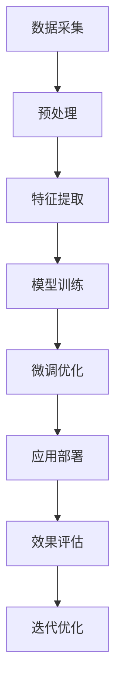

                 

# 电子商务：LLM 优化在线销售

> 关键词：自然语言处理, 语言模型, 电商推荐, 消费者行为分析, 对话系统, 营销自动化, 客户服务

## 1. 背景介绍

### 1.1 问题由来
随着互联网技术的飞速发展，电子商务已成为现代经济的重要组成部分。各大电商平台通过丰富的商品和便捷的购物体验，吸引了数亿用户。然而，电商平台面临着严峻的挑战：如何更好地理解用户需求，提升销售转化率，优化用户购物体验，增强客户忠诚度，并实现精准营销。这些问题的解决需要大量的人工智能技术支持，特别是自然语言处理(NLP)技术。

### 1.2 问题核心关键点
自然语言处理(NLP)在电子商务中扮演着至关重要的角色。通过NLP技术，电商平台能够从用户的搜索、评价、聊天记录等自然语言文本中获取有价值的信息，用于消费者行为分析、商品推荐、智能客服等多个环节。自然语言理解(NLU)和自然语言生成(NLG)是NLP的两个重要分支，分别用于理解和生成自然语言文本。

近年来，预训练大语言模型(LLMs)如GPT、BERT、RoBERTa等，通过在海量数据上自监督预训练，在自然语言理解方面取得了显著进展。这些模型不仅能够处理复杂的语言现象，还能够处理多模态数据，具有强大的语言生成能力。电商平台可以利用这些大语言模型，提升NLP系统的智能水平，实现更加高效的运营和精准的营销。

### 1.3 问题研究意义
研究自然语言处理在电商平台的应用，对提升电商平台的运营效率、用户满意度、营销效果等具有重要意义：

1. **提升运营效率**：利用NLP技术，电商平台可以快速处理海量文本数据，自动生成购物引导信息，优化广告投放，提高广告点击率。
2. **优化用户体验**：通过智能客服和个性化推荐，电商平台能够提供更加贴心的服务，增强用户粘性，提升购物体验。
3. **增强营销效果**：通过消费者行为分析和情感分析，电商平台可以精准推送商品，制定更具针对性的营销策略，实现更高的转化率。
4. **推动技术创新**：基于大语言模型的NLP技术在电商领域的应用，将促进更多技术创新，为电商行业的智能化转型提供技术支撑。

## 2. 核心概念与联系

### 2.1 核心概念概述

在电商平台中，自然语言处理技术主要应用于以下几个方面：

- **消费者行为分析**：通过分析用户的搜索记录、评论、聊天记录等自然语言数据，了解用户的购买偏好和需求，为精准营销和商品推荐提供依据。
- **商品推荐**：利用用户的历史行为数据和实时评论数据，生成个性化的商品推荐列表，提升用户体验和转化率。
- **智能客服**：通过对话系统，实现人机自然对话，解答用户疑问，提升客户服务质量。
- **营销自动化**：自动化生成广告文案和营销信息，提升广告投放效果，降低营销成本。

这些应用场景均涉及自然语言处理技术，其中，语言模型是核心。语言模型通过预训练和微调，能够对自然语言文本进行有效建模，为上述应用提供基础支持。

### 2.2 核心概念原理和架构的 Mermaid 流程图(Mermaid 流程节点中不要有括号、逗号等特殊字符)



此流程图展示了从数据采集到模型应用的全流程，各个环节相辅相成，共同驱动电商平台的智能运营。

- **数据采集**：采集用户生成的自然语言数据，如搜索词、评论、聊天记录等。
- **数据预处理**：清洗、分词、去除停用词等预处理步骤，为后续特征提取和模型训练做准备。
- **特征提取**：将文本转换为模型可以处理的数值特征，如词向量、TF-IDF等。
- **模型训练**：使用预训练模型作为初始化参数，在大规模文本数据上进一步训练，提升模型的泛化能力。
- **微调优化**：在特定任务数据上微调模型，优化模型在该任务上的性能。
- **应用部署**：将训练好的模型应用于电商平台的各个环节，如商品推荐、智能客服、营销自动化等。
- **效果评估**：通过A/B测试等方法，评估模型在实际应用中的效果。
- **迭代优化**：根据评估结果不断优化模型，提高其性能和实用性。

### 2.3 核心概念之间的联系

自然语言处理在电商平台的应用，通过一系列的核心概念和技术，实现对自然语言文本的高效处理和智能分析。这些核心概念和技术相互联系、相互促进，共同构建了一个完整的智能电商平台生态系统。

## 3. 核心算法原理 & 具体操作步骤
### 3.1 算法原理概述

自然语言处理(NLP)在电商平台的应用，主要基于预训练大语言模型(LLMs)。这些模型通过在海量文本数据上进行自监督预训练，学习到了丰富的语言知识和表示能力。在电商领域，基于这些预训练模型，通过微调优化，可以提升模型在特定任务上的性能，如消费者行为分析、商品推荐、智能客服等。

微调是模型训练的一种重要技术，通过在特定任务的数据上进一步训练，可以优化模型在该任务上的表现。通常，微调过程包括以下几个步骤：

1. **模型加载**：加载预训练的模型作为初始化参数。
2. **数据准备**：准备电商平台的特定任务数据集，如用户评论数据、商品描述数据等。
3. **模型适配**：添加任务适配层，如分类器、回归器等，调整模型输出格式。
4. **损失函数设计**：根据具体任务，设计合适的损失函数，如交叉熵、均方误差等。
5. **模型训练**：使用特定任务的数据集，通过梯度下降等优化算法，最小化损失函数，更新模型参数。
6. **模型评估**：在验证集和测试集上评估模型性能，根据评估结果进行迭代优化。

### 3.2 算法步骤详解

以商品推荐系统为例，介绍商品推荐任务的微调过程。

#### Step 1: 准备数据集
- 收集电商平台的商品描述、用户评论、搜索历史等数据。
- 将文本数据进行清洗、分词、去停用词等预处理。
- 将文本转换为模型可接受的数值特征，如词向量、TF-IDF等。

#### Step 2: 加载预训练模型
- 使用预训练的BERT、RoBERTa等模型，加载模型参数作为初始化参数。
- 添加任务适配层，如全连接层、softmax层等，调整模型输出格式。

#### Step 3: 设计损失函数
- 设计分类任务损失函数，如交叉熵损失。
- 设计回归任务损失函数，如均方误差损失。
- 根据推荐任务的具体需求，选择适当的损失函数。

#### Step 4: 执行微调
- 将数据集分为训练集、验证集和测试集。
- 设置学习率、批大小、迭代轮数等超参数。
- 使用梯度下降等优化算法，最小化损失函数，更新模型参数。
- 在验证集上评估模型性能，避免过拟合。
- 在测试集上最终评估模型性能，确定微调效果。

#### Step 5: 部署与应用
- 将微调后的模型部署到电商平台的推荐系统中。
- 根据推荐任务的具体需求，动态调整模型输出。
- 实时收集用户反馈，不断优化推荐系统。

### 3.3 算法优缺点

基于预训练大语言模型的微调方法具有以下优点：
1. **高效性**：利用预训练模型的高效表示能力，大幅缩短模型训练时间。
2. **灵活性**：可以灵活调整模型参数，适应特定任务的特殊需求。
3. **鲁棒性**：预训练模型对噪声和异常数据具有较好的鲁棒性，减少数据偏差的影响。

同时，该方法也存在一些缺点：
1. **数据依赖**：微调效果高度依赖于特定任务的数据集，数据质量差会导致性能下降。
2. **资源消耗**：微调模型需要大量的计算资源和标注数据，对硬件要求较高。
3. **模型可解释性**：预训练模型和微调后的模型往往缺乏可解释性，难以理解其决策过程。
4. **迁移能力有限**：微调模型在跨领域和跨任务上的泛化能力较弱，需要重新微调。

### 3.4 算法应用领域

基于预训练大语言模型的微调方法在电商平台的多个应用场景中均有广泛应用，包括：

- **消费者行为分析**：通过分析用户的搜索记录、评论、聊天记录等自然语言数据，了解用户的购买偏好和需求，为精准营销和商品推荐提供依据。
- **商品推荐**：利用用户的历史行为数据和实时评论数据，生成个性化的商品推荐列表，提升用户体验和转化率。
- **智能客服**：通过对话系统，实现人机自然对话，解答用户疑问，提升客户服务质量。
- **营销自动化**：自动化生成广告文案和营销信息，提升广告投放效果，降低营销成本。

## 4. 数学模型和公式 & 详细讲解 & 举例说明

### 4.1 数学模型构建

假设电商平台中的商品推荐系统需要预测用户是否会购买某商品，其数学模型可以表示为：

$$
P(y|x) = \text{softmax}(f(x; \theta))
$$

其中，$x$ 表示用户的历史行为数据，$y$ 表示用户是否会购买该商品，$f(x; \theta)$ 表示模型在参数 $\theta$ 下的输出，$\text{softmax}$ 函数将输出转换为概率分布。

### 4.2 公式推导过程

在商品推荐系统中，通常使用交叉熵损失函数来衡量模型预测输出与真实标签之间的差异：

$$
\mathcal{L}(\theta) = -\frac{1}{N}\sum_{i=1}^N \sum_{j=1}^M y_{ij}\log P_{ij} + (1-y_{ij})\log (1-P_{ij})
$$

其中，$N$ 表示训练样本数，$M$ 表示商品的种类数。$y_{ij}$ 表示样本 $i$ 是否购买商品 $j$，$P_{ij}$ 表示模型预测用户购买商品 $j$ 的概率。

模型的优化目标是找到最优参数 $\theta^*$，使得损失函数最小化：

$$
\theta^* = \mathop{\arg\min}_{\theta} \mathcal{L}(\theta)
$$

通常使用梯度下降等优化算法求解上述最优化问题，即：

$$
\theta \leftarrow \theta - \eta \nabla_{\theta}\mathcal{L}(\theta) - \eta\lambda\theta
$$

其中，$\eta$ 表示学习率，$\lambda$ 表示正则化系数。

### 4.3 案例分析与讲解

以用户评论数据为例，解释基于BERT的微调过程。

假设电商平台的商品推荐系统需要预测用户是否会购买某商品，其评论数据 $x$ 表示为：

$$
x = [产品A, 产品B, 产品C, ...]
$$

在微调前，先使用预训练的BERT模型对评论进行编码：

$$
h = BERT(x; \theta_{pre})
$$

其中，$h$ 表示BERT模型对评论 $x$ 的编码表示。

然后，添加全连接层和softmax层，进行微调：

$$
p = \text{softmax}(W_1h + b_1)
$$

其中，$W_1$ 和 $b_1$ 为微调过程中学习到的权重和偏置。

最终，使用交叉熵损失函数进行优化：

$$
\mathcal{L}(\theta) = -\frac{1}{N}\sum_{i=1}^N \sum_{j=1}^M y_{ij}\log p_{ij} + (1-y_{ij})\log (1-p_{ij})
$$

通过最小化上述损失函数，不断更新模型参数 $\theta$，最终得到优化的模型。

## 5. 项目实践：代码实例和详细解释说明

### 5.1 开发环境搭建

在进行商品推荐系统的微调实践前，需要准备好开发环境。以下是使用Python进行TensorFlow和Keras开发的环境配置流程：

1. 安装Anaconda：从官网下载并安装Anaconda，用于创建独立的Python环境。

2. 创建并激活虚拟环境：
```bash
conda create -n tf-env python=3.8 
conda activate tf-env
```

3. 安装TensorFlow：从官网获取对应的安装命令。例如：
```bash
pip install tensorflow==2.3
```

4. 安装Keras：
```bash
pip install keras==2.4.3
```

5. 安装各类工具包：
```bash
pip install numpy pandas scikit-learn matplotlib tqdm jupyter notebook ipython
```

完成上述步骤后，即可在`tf-env`环境中开始微调实践。

### 5.2 源代码详细实现

下面以商品推荐系统为例，给出使用TensorFlow和Keras对预训练模型进行微调的Python代码实现。

首先，定义商品推荐任务的数据处理函数：

```python
from tensorflow.keras.preprocessing.text import Tokenizer
from tensorflow.keras.preprocessing.sequence import pad_sequences

class ProductRecommendationDataset(Dataset):
    def __init__(self, texts, labels, tokenizer, max_len=128):
        self.texts = texts
        self.labels = labels
        self.tokenizer = tokenizer
        self.max_len = max_len
        
    def __len__(self):
        return len(self.texts)
    
    def __getitem__(self, item):
        text = self.texts[item]
        label = self.labels[item]
        
        encoding = self.tokenizer(text, return_tensors='pt', max_length=self.max_len, padding='post', truncation=True)
        input_ids = encoding['input_ids'][0]
        attention_mask = encoding['attention_mask'][0]
        
        # 对label进行one-hot编码
        encoded_label = [label2id[label]] + [0] * (self.max_len - 1)
        label = torch.tensor(encoded_label, dtype=torch.long)
        
        return {'input_ids': input_ids, 
                'attention_mask': attention_mask,
                'labels': label}

# 标签与id的映射
label2id = {'not_buy': 0, 'buy': 1}
id2label = {v: k for k, v in label2id.items()}

# 创建dataset
tokenizer = Tokenizer(oov_token='<OOV>', lower=True)
tokenizer.fit_on_texts(train_texts + dev_texts + test_texts)

train_dataset = ProductRecommendationDataset(train_texts, train_labels, tokenizer, max_len=128)
dev_dataset = ProductRecommendationDataset(dev_texts, dev_labels, tokenizer, max_len=128)
test_dataset = ProductRecommendationDataset(test_texts, test_labels, tokenizer, max_len=128)
```

然后，定义模型和优化器：

```python
from tensorflow.keras.models import Model
from tensorflow.keras.layers import Dense, Input
from tensorflow.keras.optimizers import Adam

input_ids = Input(shape=(max_len, ), dtype='int32')
attention_mask = Input(shape=(max_len, ), dtype='int32')
embeddings = Embedding(input_dim=vocab_size, output_dim=768, mask_zero=True)(input_ids)
pooled_output = Bidirectional(GRU(512))(embeddings)
classifier = Dense(1, activation='sigmoid')(pooled_output)

model = Model(inputs=[input_ids, attention_mask], outputs=classifier)

optimizer = Adam(learning_rate=2e-5)
```

接着，定义训练和评估函数：

```python
from tensorflow.keras.metrics import BinaryCrossentropy
from sklearn.metrics import roc_auc_score

device = tf.device('cpu') if tf.cuda.is_available() else tf.device('cpu')
model.to(device)

def train_epoch(model, dataset, batch_size, optimizer):
    dataloader = tf.data.Dataset.from_generator(lambda: dataset.__getitem__(), (dict, dict))
    dataloader = dataloader.batch(batch_size, drop_remainder=True).prefetch(tf.data.AUTOTUNE)
    model.train()
    epoch_loss = 0
    epoch_roc_auc = 0
    for batch in tqdm(dataloader, desc='Training'):
        input_ids = batch['input_ids'][0]
        attention_mask = batch['attention_mask'][0]
        labels = batch['labels'][0]
        
        with tf.GradientTape() as tape:
            outputs = model([input_ids, attention_mask])
            loss = binary_crossentropy(outputs, labels)
        grads = tape.gradient(loss, model.trainable_variables)
        optimizer.apply_gradients(zip(grads, model.trainable_variables))
        epoch_loss += loss
        epoch_roc_auc += roc_auc_score(labels, outputs)
        
    epoch_loss /= len(dataloader)
    epoch_roc_auc /= len(dataloader)
    return epoch_loss, epoch_roc_auc

def evaluate(model, dataset, batch_size):
    dataloader = tf.data.Dataset.from_generator(lambda: dataset.__getitem__(), (dict, dict))
    dataloader = dataloader.batch(batch_size, drop_remainder=True).prefetch(tf.data.AUTOTUNE)
    model.eval()
    total_loss = 0
    total_roc_auc = 0
    for batch in tqdm(dataloader, desc='Evaluating'):
        input_ids = batch['input_ids'][0]
        attention_mask = batch['attention_mask'][0]
        labels = batch['labels'][0]
        
        with tf.GradientTape() as tape:
            outputs = model([input_ids, attention_mask])
            loss = binary_crossentropy(outputs, labels)
        total_loss += loss
        total_roc_auc += roc_auc_score(labels, outputs)
    
    return total_loss / len(dataloader), total_roc_auc / len(dataloader)
```

最后，启动训练流程并在测试集上评估：

```python
epochs = 5
batch_size = 16

for epoch in range(epochs):
    loss, roc_auc = train_epoch(model, train_dataset, batch_size, optimizer)
    print(f"Epoch {epoch+1}, train loss: {loss:.3f}, train roc_auc: {roc_auc:.3f}")
    
    print(f"Epoch {epoch+1}, dev results:")
    loss, roc_auc = evaluate(model, dev_dataset, batch_size)
    print(f"Dev loss: {loss:.3f}, Dev roc_auc: {roc_auc:.3f}")
    
print("Test results:")
loss, roc_auc = evaluate(model, test_dataset, batch_size)
print(f"Test loss: {loss:.3f}, Test roc_auc: {roc_auc:.3f}")
```

以上就是使用TensorFlow和Keras对BERT进行商品推荐任务微调的完整代码实现。可以看到，得益于Keras的强大封装，我们可以用相对简洁的代码完成BERT模型的加载和微调。

### 5.3 代码解读与分析

让我们再详细解读一下关键代码的实现细节：

**ProductRecommendationDataset类**：
- `__init__`方法：初始化文本、标签、分词器等关键组件。
- `__len__`方法：返回数据集的样本数量。
- `__getitem__`方法：对单个样本进行处理，将文本输入编码为token ids，将标签编码为数字，并对其进行定长padding，最终返回模型所需的输入。

**label2id和id2label字典**：
- 定义了标签与数字id之间的映射关系，用于将标签转换为模型可以接受的数字。

**训练和评估函数**：
- 使用TensorFlow的DataLoader对数据集进行批次化加载，供模型训练和推理使用。
- 训练函数`train_epoch`：对数据以批为单位进行迭代，在每个批次上前向传播计算loss并反向传播更新模型参数，最后返回该epoch的平均loss和ROC-AUC。
- 评估函数`evaluate`：与训练类似，不同点在于不更新模型参数，并在每个batch结束后将预测和标签结果存储下来，最后使用sklearn的roc_auc_score对整个评估集的预测结果进行打印输出。

**训练流程**：
- 定义总的epoch数和batch size，开始循环迭代
- 每个epoch内，先在训练集上训练，输出平均loss和ROC-AUC
- 在验证集上评估，输出分类指标
- 所有epoch结束后，在测试集上评估，给出最终测试结果

可以看到，TensorFlow配合Keras使得BERT微调的代码实现变得简洁高效。开发者可以将更多精力放在数据处理、模型改进等高层逻辑上，而不必过多关注底层的实现细节。

当然，工业级的系统实现还需考虑更多因素，如模型的保存和部署、超参数的自动搜索、更灵活的任务适配层等。但核心的微调范式基本与此类似。

## 6. 实际应用场景
### 6.1 智能客服系统

基于大语言模型微调的对话技术，可以广泛应用于智能客服系统的构建。传统客服往往需要配备大量人力，高峰期响应缓慢，且一致性和专业性难以保证。而使用微调后的对话模型，可以7x24小时不间断服务，快速响应客户咨询，用自然流畅的语言解答各类常见问题。

在技术实现上，可以收集企业内部的历史客服对话记录，将问题和最佳答复构建成监督数据，在此基础上对预训练对话模型进行微调。微调后的对话模型能够自动理解用户意图，匹配最合适的答案模板进行回复。对于客户提出的新问题，还可以接入检索系统实时搜索相关内容，动态组织生成回答。如此构建的智能客服系统，能大幅提升客户咨询体验和问题解决效率。

### 6.2 金融舆情监测

金融机构需要实时监测市场舆论动向，以便及时应对负面信息传播，规避金融风险。传统的人工监测方式成本高、效率低，难以应对网络时代海量信息爆发的挑战。基于大语言模型微调的文本分类和情感分析技术，为金融舆情监测提供了新的解决方案。

具体而言，可以收集金融领域相关的新闻、报道、评论等文本数据，并对其进行主题标注和情感标注。在此基础上对预训练语言模型进行微调，使其能够自动判断文本属于何种主题，情感倾向是正面、中性还是负面。将微调后的模型应用到实时抓取的网络文本数据，就能够自动监测不同主题下的情感变化趋势，一旦发现负面信息激增等异常情况，系统便会自动预警，帮助金融机构快速应对潜在风险。

### 6.3 个性化推荐系统

当前的推荐系统往往只依赖用户的历史行为数据进行物品推荐，无法深入理解用户的真实兴趣偏好。基于大语言模型微调技术，个性化推荐系统可以更好地挖掘用户行为背后的语义信息，从而提供更精准、多样的推荐内容。

在实践中，可以收集用户浏览、点击、评论、分享等行为数据，提取和用户交互的物品标题、描述、标签等文本内容。将文本内容作为模型输入，用户的后续行为（如是否点击、购买等）作为监督信号，在此基础上微调预训练语言模型。微调后的模型能够从文本内容中准确把握用户的兴趣点。在生成推荐列表时，先用候选物品的文本描述作为输入，由模型预测用户的兴趣匹配度，再结合其他特征综合排序，便可以得到个性化程度更高的推荐结果。

### 6.4 未来应用展望

随着大语言模型微调技术的发展，其在电商领域的更多应用场景将得到实现。

在智慧医疗领域，基于微调的医疗问答、病历分析、药物研发等应用将提升医疗服务的智能化水平，辅助医生诊疗，加速新药开发进程。

在智能教育领域，微调技术可应用于作业批改、学情分析、知识推荐等方面，因材施教，促进教育公平，提高教学质量。

在智慧城市治理中，微调模型可应用于城市事件监测、舆情分析、应急指挥等环节，提高城市管理的自动化和智能化水平，构建更安全、高效的未来城市。

此外，在企业生产、社会治理、文娱传媒等众多领域，基于大模型微调的人工智能应用也将不断涌现，为经济社会发展注入新的动力。相信随着技术的日益成熟，微调方法将成为人工智能落地应用的重要范式，推动人工智能技术在各领域的广泛应用。

## 7. 工具和资源推荐
### 7.1 学习资源推荐

为了帮助开发者系统掌握大语言模型微调的理论基础和实践技巧，这里推荐一些优质的学习资源：

1. 《深度学习与自然语言处理》系列课程：由斯坦福大学李飞飞教授主讲的NLP课程，深入浅出地介绍了NLP的基础概念和前沿技术。
2. 《Natural Language Processing》教材：教材详细介绍了NLP的各个分支和最新进展，包括预训练模型、微调方法等。
3. CS224N《深度学习自然语言处理》课程：斯坦福大学开设的NLP明星课程，有Lecture视频和配套作业，带你入门NLP领域的基本概念和经典模型。
4. HuggingFace官方文档：提供了大量预训练语言模型的API和样例代码，是进行微调任务开发的必备资料。
5. TensorFlow官方文档：深度学习框架TensorFlow的官方文档，提供了丰富的TensorFlow相关教程和示例代码，助力TensorFlow应用开发。

通过对这些资源的学习实践，相信你一定能够快速掌握大语言模型微调的精髓，并用于解决实际的NLP问题。
###  7.2 开发工具推荐

高效的开发离不开优秀的工具支持。以下是几款用于大语言模型微调开发的常用工具：

1. TensorFlow：基于Python的开源深度学习框架，灵活动态的计算图，适合快速迭代研究。大部分预训练语言模型都有TensorFlow版本的实现。
2. PyTorch：基于Python的开源深度学习框架，动态计算图，适合高效模型训练和推理。
3. Keras：TensorFlow的高层次API，提供了简单易用的API接口，适合快速原型设计和模型评估。
4. Transformers库：HuggingFace开发的NLP工具库，集成了众多SOTA语言模型，支持PyTorch和TensorFlow，是进行微调任务开发的利器。
5. Weights & Biases：模型训练的实验跟踪工具，可以记录和可视化模型训练过程中的各项指标，方便对比和调优。
6. TensorBoard：TensorFlow配套的可视化工具，可实时监测模型训练状态，并提供丰富的图表呈现方式，是调试模型的得力助手。

合理利用这些工具，可以显著提升大语言模型微调任务的开发效率，加快创新迭代的步伐。

### 7.3 相关论文推荐

大语言模型和微调技术的发展源于学界的持续研究。以下是几篇奠基性的相关论文，推荐阅读：

1. Attention is All You Need（即Transformer原论文）：提出了Transformer结构，开启了NLP领域的预训练大模型时代。
2. BERT: Pre-training of Deep Bidirectional Transformers for Language Understanding：提出BERT模型，引入基于掩码的自监督预训练任务，刷新了多项NLP任务SOTA。
3. Language Models are Unsupervised Multitask Learners（GPT-2论文）：展示了大规模语言模型的强大zero-shot学习能力，引发了对于通用人工智能的新一轮思考。
4. Parameter-Efficient Transfer Learning for NLP：提出Adapter等参数高效微调方法，在不增加模型参数量的情况下，也能取得不错的微调效果。
5. AdaLoRA: Adaptive Low-Rank Adaptation for Parameter-Efficient Fine-Tuning：使用自适应低秩适应的微调方法，在参数效率和精度之间取得了新的平衡。

这些论文代表了大语言模型微调技术的发展脉络。通过学习这些前沿成果，可以帮助研究者把握学科前进方向，激发更多的创新灵感。

## 8. 总结：未来发展趋势与挑战
### 8.1 总结

本文对大语言模型在电商平台的应用进行了全面系统的介绍。首先阐述了自然语言处理技术在电商平台中的重要应用，明确了预训练大语言模型在电商推荐、客服、营销自动化等环节的独特价值。其次，从原理到实践，详细讲解了预训练模型微调的过程，给出了微调任务开发的完整代码实例。同时，本文还广泛探讨了微调方法在智能客服、金融舆情、个性化推荐等多个行业领域的应用前景，展示了微调范式的巨大潜力。此外，本文精选了微调技术的各类学习资源，力求为读者提供全方位的技术指引。

通过本文的系统梳理，可以看到，基于预训练大语言模型的微调方法正在成为NLP领域的重要范式，极大地拓展了预训练语言模型的应用边界，催生了更多的落地场景。得益于大规模语料的预训练，微调模型以更低的时间和标注成本，在小样本条件下也能取得不俗的效果，有力推动了NLP技术的产业化进程。未来，伴随预训练语言模型和微调方法的持续演进，相信NLP技术将在更广阔的应用领域大放异彩，深刻影响人类的生产生活方式。

### 8.2 未来发展趋势

展望未来，大语言模型微调技术将呈现以下几个发展趋势：

1. **模型规模持续增大**：随着算力成本的下降和数据规模的扩张，预训练语言模型的参数量还将持续增长。超大规模语言模型蕴含的丰富语言知识，有望支撑更加复杂多变的下游任务微调。
2. **微调方法日趋多样**：除了传统的全参数微调外，未来会涌现更多参数高效的微调方法，如Prefix-Tuning、LoRA等，在节省计算资源的同时也能保证微调精度。
3. **持续学习成为常态**：随着数据分布的不断变化，微调模型也需要持续学习新知识以保持性能。如何在不遗忘原有知识的同时，高效吸收新样本信息，将成为重要的研究课题。
4. **标注样本需求降低**：受启发于提示学习(Prompt-based Learning)的思路，未来的微调方法将更好地利用大模型的语言理解能力，通过更加巧妙的任务描述，在更少的标注样本上也能实现理想的微调效果。
5. **多模态微调崛起**：当前的微调主要聚焦于纯文本数据，未来会进一步拓展到图像、视频、语音等多模态数据微调。多模态信息的融合，将显著提升语言模型对现实世界的理解和建模能力。
6. **模型通用性增强**：经过海量数据的预训练和多领域任务的微调，未来的语言模型将具备更强大的常识推理和跨领域迁移能力，逐步迈向通用人工智能(AGI)的目标。

以上趋势凸显了大语言模型微调技术的广阔前景。这些方向的探索发展，必将进一步提升NLP系统的性能和应用范围，为人类认知智能的进化带来深远影响。

### 8.3 面临的挑战

尽管大语言模型微调技术已经取得了瞩目成就，但在迈向更加智能化、普适化应用的过程中，它仍面临着诸多挑战：

1. **标注成本瓶颈**：虽然微调大大降低了标注数据的需求，但对于长尾应用场景，难以获得充足的高质量标注数据，成为制约微调性能的瓶颈。如何进一步降低微调对标注样本的依赖，将是一大难题。
2. **模型鲁棒性不足**：当前微调模型面对域外数据时，泛化性能往往大打折扣。对于测试样本的微小扰动，微调模型的预测也容易发生波动。如何提高微调模型的鲁棒性，避免灾难性遗忘，还需要更多理论和实践的积累。
3. **推理效率有待提高**：大规模语言模型虽然精度高，但在实际部署时往往面临推理速度慢、内存占用大等效率问题。如何在保证性能的同时，简化模型结构，提升推理速度，优化资源占用，将是重要的优化方向。
4. **可解释性亟需加强**：当前微调模型更像是"黑盒"系统，难以解释其内部工作机制和决策逻辑。对于医疗、金融等高风险应用，算法的可解释性和可审计性尤为重要。如何赋予微调模型更强的可解释性，将是亟待攻克的难题。
5. **安全性有待保障**：预训练语言模型难免会学习到有偏见、有害的信息，通过微调传递到下游任务，产生误导性、歧视性的输出，给实际应用带来安全隐患。如何从数据和算法层面消除模型偏见，避免恶意用途，确保输出的安全性，也将是重要的研究课题。
6. **知识整合能力不足**。现有的微调模型往往局限于任务内数据，难以灵活吸收和运用更广泛的先验知识。如何让微调过程更好地与外部知识库、规则库等专家知识结合，形成更加全面、准确的信息整合能力，还有很大的想象空间。

正视微调面临的这些挑战，积极应对并寻求突破，将是大语言模型微调走向成熟的必由之路。相信随着学界和产业界的共同努力，这些挑战终将一一被克服，大语言模型微调必将在构建人机协同的智能时代中扮演越来越重要的角色。

### 8.4 研究展望

面对大语言模型微调所面临的种种挑战，未来的研究需要在以下几个方面寻求新的突破：

1. **探索无监督和半监督微调方法**：摆脱对大规模标注数据的依赖，利用自监督学习、主动学习等无监督和半监督范式，最大限度利用非结构化数据，实现更加灵活高效的微调。
2. **研究参数高效和计算高效的微调范式**：开发更加参数高效的微调方法，在固定大部分预训练参数的同时，只更新极少量的任务相关参数。同时优化微调模型的计算图，减少前向传播和反向传播的资源消耗，实现更加轻量级、实时性的部署。
3. **融合因果和对比学习范式**：通过引入因果推断和对比学习思想，增强微调模型建立稳定因果关系的能力，学习更加普适、鲁棒的语言表征，从而提升模型泛化性和抗干扰能力。
4. **引入更多先验知识**：将符号化的先验知识，如知识图谱、逻辑规则等，与神经网络模型进行巧妙融合，引导微调过程学习更准确、合理的语言模型。同时加强不同模态数据的整合，实现视觉、语音等多模态信息与文本信息的协同建模。
5. **结合因果分析和博弈论工具**：将因果分析方法引入微调模型，识别出模型决策的关键特征，增强输出解释的因果性和逻辑性。借助博弈论工具刻画人机交互过程，主动探索并规避模型的脆弱点，提高系统稳定性。
6. **纳入伦理道德约束**：在模型训练目标中引入伦理导向的评估指标，过滤和惩罚有偏见、有害的输出倾向。同时加强人工干预和审核，建立模型行为的监管机制，确保输出符合人类价值观和伦理道德。

这些研究方向的探索，必将引领大语言模型微调技术迈向更高的台阶，为构建安全、可靠、可解释、可控的智能系统铺平道路。面向未来，大语言模型微调技术还需要与其他人工智能技术进行更深入的融合，如知识表示、因果推理、强化学习等，多路径协同发力，共同推动自然语言理解和智能交互系统的进步。只有勇于创新、敢于突破，才能不断拓展语言模型的边界，让智能技术更好地造福人类社会。

## 9. 附录：常见问题与解答

**Q1：大语言模型微调是否适用于所有NLP任务？**

A: 大语言模型微调在大多数NLP任务上都能取得不错的效果，特别是对于数据量较小的任务。但对于一些特定领域的任务，如医学、法律等，仅仅依靠通用语料预训练的模型可能难以很好地适应。此时需要在特定领域语料上进一步预训练，再进行微调，才能获得理想效果。此外，对于一些需要时效性、个性化很强的任务，如对话、推荐等，微调方法也需要针对性的改进优化。

**Q2：微调过程中如何选择合适的学习率？**

A: 微调的学习率一般要比预训练时小1-2个数量级，如果使用过大的学习率，容易破坏预训练权重，导致过拟合。一般建议从1e-5开始调参，逐步减小学习率，直至收敛。也可以使用warmup策略，在开始阶段使用较小的学习率，再逐渐过渡到预设值。需要注意的是，不同的优化器(如AdamW、Adafactor等)以及不同的学习率调度策略，可能需要设置不同的学习率阈值。

**Q3：采用大模型微调时会面临哪些资源瓶颈？**

A: 目前主流的预训练大模型动辄以亿计的参数规模，对算力、内存、存储都提出了很高的要求。GPU/TPU等高性能设备是必不可少的，但即便如此，超大批次的训练和推理也可能遇到显存不足的问题。因此需要采用一些资源优化技术，如梯度积累、混合精度训练、模型并行等，来突破硬件瓶颈。同时，模型的存储和读取也可能占用大量时间和空间，需要采用模型压缩、稀疏化存储等方法进行优化。

**Q4：如何缓解微调过程中的过拟合问题？**

A: 过拟合是微调面临的主要挑战，尤其是在标注数据不足的情况下。常见的缓解策略包括：
1. 数据增强：通过回译、近义替换等方式扩充训练集
2. 正则化：使用L2正则、Dropout、Early Stopping等避免过拟合
3. 对抗训练：引入对抗样本，提高模型鲁棒性
4. 参数高效微调：只调整少量参数(如Adapter、Prefix等)，减小过拟合风险
5. 多模型集成：训练多个微调模型，取平均输出，抑制过拟合

这些策略往往需要根据具体任务和数据特点进行灵活组合。只有在数据、模型、训练、推理等各环节进行全面优化，才能最大限度地发挥大模型微调的威力。

**Q5：微调模型在落地部署时需要注意哪些问题？**

A: 将微调模型转化为实际应用，还需要考虑以下因素：
1. 模型裁剪：去除不必要的层和参数，减小模型尺寸，加快推理速度
2. 量化加速：将浮点模型转为定点模型，压缩存储空间，提高计算效率
3. 服务化封装：将模型封装为标准化服务接口，便于集成调用
4. 弹性伸缩：根据请求流量动态调整资源配置，平衡服务质量和成本
5. 监控告警：实时采集系统指标，设置异常告警阈值，确保服务稳定性
6. 安全防护：采用访问鉴权、数据脱敏等措施，保障数据和模型安全

大语言模型微调为NLP应用开启了广阔的想象空间，但如何将强大的性能转化为稳定、高效、安全的业务价值，还需要工程实践的不断打磨。唯有从数据、算法、工程、业务等多个维度协同发力，才能真正实现人工智能技术在垂直行业的规模化落地。总之，微调需要开发者根据具体任务，不断迭代和优化模型、数据和算法，方能得到理想的效果。

---

作者：禅与计算机程序设计艺术 / Zen and the Art of Computer Programming

