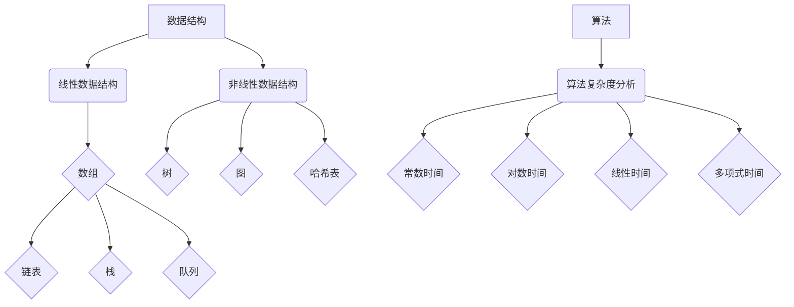
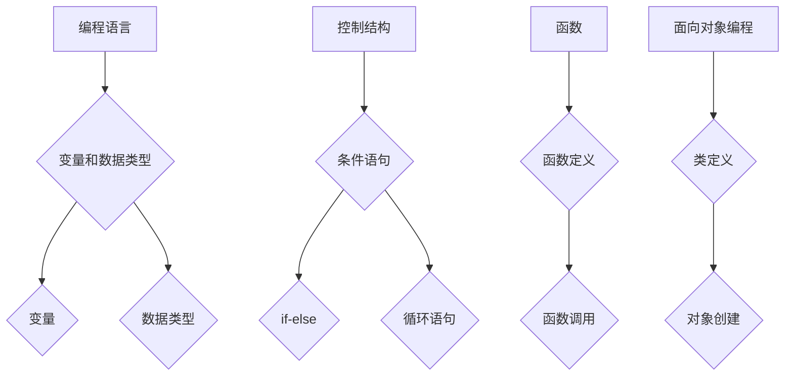
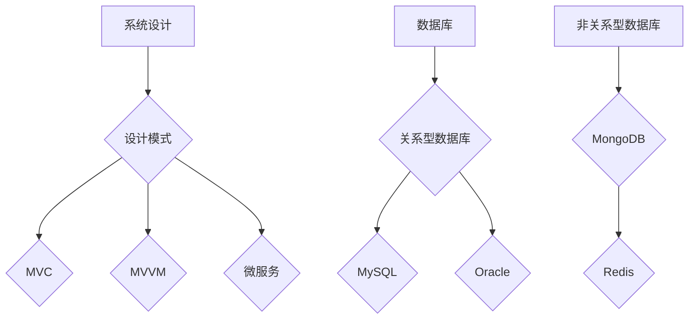

                 

### 文章标题

2024携程商旅事业群校招面试真题汇总及其解答

### 关键词

- 携程商旅
- 校招面试
- 面试题解析
- 技术面试
- 算法题解答
- 数据结构
- 编程语言

### 摘要

本文旨在为2024年携程商旅事业群的校招面试真题提供全面的汇总与解答。通过对这些面试题的深入分析与解答，本文不仅帮助应聘者理解题目背后的核心概念，还提供了详细的解题思路和方法。文章涵盖了数据结构与算法、编程语言、数据库、系统设计等关键领域，旨在为准备携程商旅面试的同学们提供宝贵的参考。

### 目录

#### 1. 背景介绍
#### 2. 核心概念与联系
##### 2.1 数据结构与算法
##### 2.2 编程语言基础
##### 2.3 系统设计与数据库
#### 3. 核心算法原理 & 具体操作步骤
##### 3.1 常见算法题解析
##### 3.2 数据结构与算法实战
#### 4. 数学模型和公式 & 详细讲解 & 举例说明
##### 4.1 数学公式简介
##### 4.2 实际应用案例
#### 5. 项目实践：代码实例和详细解释说明
##### 5.1 开发环境搭建
##### 5.2 源代码详细实现
##### 5.3 代码解读与分析
##### 5.4 运行结果展示
#### 6. 实际应用场景
##### 6.1 企业级应用场景
##### 6.2 个人技能提升
#### 7. 工具和资源推荐
##### 7.1 学习资源推荐
##### 7.2 开发工具框架推荐
##### 7.3 相关论文著作推荐
#### 8. 总结：未来发展趋势与挑战
#### 9. 附录：常见问题与解答
#### 10. 扩展阅读 & 参考资料

### 1. 背景介绍

携程商旅是携程集团旗下的重要业务板块之一，专注于为企业客户提供全方位的差旅管理服务。作为行业内的领军企业，携程商旅在技术创新、服务质量和用户体验方面都处于领先地位。因此，其校招面试的难度和深度也相对较高，对求职者的综合素质和技能要求较为严格。

本文旨在为准备2024年携程商旅事业群校招面试的同学们提供一份全面的面试题汇总及解答。这些面试题涵盖了数据结构与算法、编程语言、数据库、系统设计等关键领域，代表了当前计算机科学和工程领域的核心知识。通过对这些面试题的深入分析与解答，不仅能够帮助求职者更好地理解面试题的背景和难点，还能提高他们在实际编程和问题解决方面的能力。

本文将按照以下结构进行撰写：

1. **核心概念与联系**：介绍数据结构与算法、编程语言基础和系统设计与数据库等核心概念，并使用Mermaid流程图展示关键流程节点。
2. **核心算法原理 & 具体操作步骤**：解析常见的面试算法题，提供详细的解题步骤和思路。
3. **数学模型和公式 & 详细讲解 & 举例说明**：介绍与面试题相关的数学模型和公式，并进行详细讲解和实例说明。
4. **项目实践：代码实例和详细解释说明**：通过实际项目实例，展示代码的实现过程和详细解释。
5. **实际应用场景**：分析面试题在实际应用场景中的实际应用。
6. **工具和资源推荐**：推荐与面试题相关的学习资源和开发工具框架。
7. **总结：未来发展趋势与挑战**：总结文章内容，讨论未来发展趋势和面临的挑战。
8. **附录：常见问题与解答**：解答面试过程中常见的疑问。
9. **扩展阅读 & 参考资料**：提供相关扩展阅读和参考资料。

接下来，我们将逐一介绍这些核心概念和面试题，帮助大家更好地准备携程商旅的校招面试。

### 2. 核心概念与联系

在计算机科学和工程领域，数据结构与算法、编程语言基础和系统设计与数据库是三大核心概念，它们相互联系，共同构成了计算机技术的基石。以下将详细介绍这些核心概念，并提供相应的Mermaid流程图以展示关键流程节点。

#### 2.1 数据结构与算法

数据结构是计算机存储数据的方式，它决定了数据的组织和操作效率。常见的线性数据结构包括数组、链表、栈和队列，而常见的非线性数据结构则包括树、图和哈希表。每种数据结构都有其独特的应用场景和操作特性。

算法则是解决问题的方法，它定义了一系列操作的步骤。算法的效率取决于其时间和空间复杂度，常见的算法复杂度分析包括常数时间、对数时间、线性时间和多项式时间等。

**Mermaid流程图：数据结构与算法基本概念**



#### 2.2 编程语言基础

编程语言是用于编写计算机程序的语法和规则。常见的编程语言包括C、C++、Java、Python等，每种语言都有其独特的优势和适用场景。编程语言基础涉及变量、数据类型、控制结构、函数和面向对象编程等基本概念。

**Mermaid流程图：编程语言基础概念**



#### 2.3 系统设计与数据库

系统设计涉及软件系统的架构、设计和实现。常见的系统设计模式包括MVC、MVVM、微服务等。数据库则是用于存储和管理数据的系统，常见的数据库类型包括关系型数据库（如MySQL、Oracle）和非关系型数据库（如MongoDB、Redis）。

**Mermaid流程图：系统设计与数据库基本概念**



通过上述核心概念和Mermaid流程图的介绍，我们可以更好地理解计算机科学和工程领域的知识体系。接下来，我们将深入探讨这些核心概念在实际面试中的应用，并提供具体的算法题解析和数学模型讲解。

### 2.1 数据结构与算法

数据结构与算法是计算机科学和工程领域的基础，它们决定了程序的性能和效率。在面试中，经常会出现与数据结构相关的算法题，这些题目通常需要应聘者掌握特定的数据结构及其操作，并能灵活运用算法解决实际问题。

以下是一些常见的数据结构与算法问题及其解析：

#### 1. 数组和链表

数组和链表是最基础的数据结构，它们在面试中经常出现。

**问题1：在一个未排序的数组中，找到两个数，它们的和等于一个给定的目标值。**

**解题思路：** 
可以使用哈希表来存储数组中的元素，然后遍历数组，对于每个元素，用目标值减去该元素的值，查看哈希表中是否存在该差值。如果存在，则找到了两个数的组合。

**代码实现：**

```python
def find_two_sum(nums, target):
    hash_table = {}
    for i, num in enumerate(nums):
        complement = target - num
        if complement in hash_table:
            return [hash_table[complement], i]
        hash_table[num] = i
    return []
```

**问题2：实现链表反转。**

**解题思路：**
可以使用递归或循环的方法来实现链表反转。以下是一个递归实现的例子：

```python
class ListNode:
    def __init__(self, val=0, next=None):
        self.val = val
        self.next = next

def reverse_linked_list(head):
    if not head or not head.next:
        return head
    p = reverse_linked_list(head.next)
    head.next.next = head
    head.next = None
    return p
```

#### 2. 栈和队列

栈和队列是另一种常见的线性数据结构，它们在面试中也有很高的出现频率。

**问题1：用栈实现一个队列。**

**解题思路：**
使用两个栈来实现队列。一个栈用于入队操作，另一个栈用于出队操作。当需要出队时，如果出队栈为空，将入队栈的所有元素反转后倒入出队栈。

```python
class MyQueue:

    def __init__(self):
        self.in_stack = []
        self.out_stack = []

    def push(self, x):
        self.in_stack.append(x)

    def pop(self):
        if not self.out_stack:
            while self.in_stack:
                self.out_stack.append(self.in_stack.pop())
        return self.out_stack.pop()

    def empty(self):
        return not self.in_stack and not self.out_stack
```

**问题2：实现一个循环队列。**

**解题思路：**
循环队列是队列的一种实现方式，它使用数组来存储元素，并允许队列的首尾相连，形成循环。以下是Python的实现：

```python
class MyCircularQueue:

    def __init__(self, k: int):
        self.queue = [0] * k
        self.head = self.tail = 0
        self.size = 0

    def enQueue(self, value: int) -> bool:
        if self.size < len(self.queue):
            self.queue[self.tail] = value
            self.tail = (self.tail + 1) % len(self.queue)
            self.size += 1
            return True
        return False

    def deQueue(self) -> bool:
        if self.size > 0:
            self.head = (self.head + 1) % len(self.queue)
            self.size -= 1
            return True
        return False

    def Front(self) -> int:
        if self.size > 0:
            return self.queue[self.head]
        return -1

    def Rear(self) -> int:
        if self.size > 0:
            return self.queue[self.tail - 1]
        return -1

    def isEmpty(self) -> bool:
        return self.size == 0

    def isFull(self) -> bool:
        return self.size == len(self.queue)
```

#### 3. 树和图

树和图是非线性数据结构，它们在面试中经常用于解决复杂的问题。

**问题1：二叉树的遍历。**

**解题思路：**
二叉树的遍历包括前序遍历、中序遍历和后序遍历，可以使用递归或迭代的方法实现。

```python
def preorderTraversal(root):
    if not root:
        return []
    stack, result = [root], []
    while stack:
        node = stack.pop()
        result.append(node.val)
        if node.right:
            stack.append(node.right)
        if node.left:
            stack.append(node.left)
    return result

def inorderTraversal(root):
    if not root:
        return []
    stack, result = [], []
    while root or stack:
        while root:
            stack.append(root)
            root = root.left
        node = stack.pop()
        result.append(node.val)
        root = node.right
    return result

def postorderTraversal(root):
    if not root:
        return []
    stack, result = [root], []
    while stack:
        node = stack.pop()
        result.append(node.val)
        if node.left:
            stack.append(node.left)
        if node.right:
            stack.append(node.right)
    return result[::-1]
```

**问题2：图的深度优先搜索（DFS）和广度优先搜索（BFS）。**

**解题思路：**
图的遍历可以使用DFS或BFS，这两种算法分别利用递归和队列实现。

```python
def dfs(graph, node, visited):
    if node not in visited:
        visited.add(node)
        for neighbor in graph[node]:
            dfs(graph, neighbor, visited)

def bfs(graph, start):
    visited = set()
    queue = deque([start])
    while queue:
        node = queue.popleft()
        if node not in visited:
            visited.add(node)
            for neighbor in graph[node]:
                queue.append(neighbor)
    return visited
```

通过以上几个问题的解析，我们可以看到数据结构与算法在面试中的应用。掌握这些基本的数据结构和算法，是解决复杂问题的基石。在接下来的部分，我们将进一步探讨编程语言基础，以帮助大家更好地准备面试。

### 2.2 编程语言基础

编程语言是计算机科学与工程领域中不可或缺的工具，不同的编程语言在语法、应用场景和性能上各有特点。常见的编程语言包括C、C++、Java、Python等，每种语言都有其独特的优势和应用领域。

#### 2.1 C和C++

C和C++都是高级编程语言，它们在系统编程、嵌入式开发和性能敏感型应用中具有广泛应用。C语言以其简洁、高效和低级特性著称，而C++则在C语言的基础上增加了面向对象编程和模板等特性。

**C和C++基础概念：**

- **变量和数据类型：** C和C++支持基本数据类型（如int、float、char等）和复合数据类型（如数组、结构体、联合体等）。
- **控制结构：** 包括条件语句（if-else）、循环语句（for、while、do-while）等。
- **函数：** C和C++支持函数定义和调用，函数可以接受参数并返回值。
- **面向对象编程：** C++支持类和对象的概念，通过封装、继承和多态实现代码的重用。

**示例代码：**

```c
#include <stdio.h>

int main() {
    int a, b;
    printf("Enter two numbers: ");
    scanf("%d %d", &a, &b);
    int sum = a + b;
    printf("Sum = %d\n", sum);
    return 0;
}

#include <iostream>
using namespace std;

class Rectangle {
private:
    int length, width;
public:
    Rectangle(int l, int w) {
        length = l;
        width = w;
    }
    int getArea() {
        return length * width;
    }
};

int main() {
    Rectangle rect(5, 10);
    cout << "Area of rectangle: " << rect.getArea() << endl;
    return 0;
}
```

#### 2.2 Java

Java是一种面向对象的编程语言，广泛应用于企业级应用、Web开发、移动应用等。Java具有跨平台、强类型和垃圾回收等特性，使其成为开发和维护大型软件系统的理想选择。

**Java基础概念：**

- **变量和数据类型：** Java有基本数据类型（如int、double、char等）和引用数据类型（如String、Object等）。
- **控制结构：** 包括条件语句（if-else）、循环语句（for、while、do-while）等。
- **面向对象编程：** Java通过类和接口实现封装、继承和多态，支持面向对象编程。
- **异常处理：** Java提供了异常处理机制，通过try-catch语句块处理程序中的异常。

**示例代码：**

```java
public class HelloWorld {
    public static void main(String[] args) {
        int a = 5, b = 10;
        System.out.println("Sum = " + (a + b));
    }
}

class Rectangle {
    private int length, width;
    
    public Rectangle(int l, int w) {
        length = l;
        width = w;
    }
    
    public int getArea() {
        return length * width;
    }
}

public class Main {
    public static void main(String[] args) {
        Rectangle rect = new Rectangle(5, 10);
        System.out.println("Area of rectangle: " + rect.getArea());
    }
}
```

#### 2.3 Python

Python是一种高级编程语言，以其简洁、易读和多功能性而著称。Python广泛应用于数据科学、机器学习、Web开发和自动化脚本等领域。

**Python基础概念：**

- **变量和数据类型：** Python有动态类型系统，变量不需要声明类型，数据类型由赋值时自动确定。
- **控制结构：** 包括条件语句（if-else）、循环语句（for、while）等。
- **函数：** Python支持匿名函数（lambda）、闭包和高阶函数。
- **模块和包：** Python使用模块和包来组织代码，模块是Python文件，包是模块的集合。

**示例代码：**

```python
# 绝对值函数
def abs_value(n):
    return n if n >= 0 else -n

# 输入两个数求和
a = int(input("Enter first number: "))
b = int(input("Enter second number: "))
sum = abs_value(a) + abs_value(b)
print("Sum =", sum)

# 定义一个类
class Rectangle:
    def __init__(self, length, width):
        self.length = length
        self.width = width
    
    def get_area(self):
        return self.length * self.width

# 创建对象并调用方法
rect = Rectangle(5, 10)
print("Area of rectangle:", rect.get_area())
```

通过了解C、C++、Java和Python的基础概念，我们可以更好地选择适合特定任务的语言，并在面试中展示我们的编程技能。在接下来的部分，我们将深入探讨系统设计与数据库相关的概念，以帮助大家全面准备携程商旅的面试。

### 2.3 系统设计与数据库

系统设计和数据库设计是计算机科学中至关重要的一部分，它们直接影响软件系统的性能、可扩展性和可靠性。在面试中，系统设计与数据库相关的题目往往需要应聘者不仅理解理论知识，还能将这些知识应用于实际项目中。

#### 2.1 系统设计

系统设计涉及软件系统的整体架构、模块划分和交互设计。常见的系统设计模式包括MVC（Model-View-Controller）、MVVM（Model-View-ViewModel）和微服务等。

**MVC模式：**

MVC模式是一种将应用程序分为三个主要组件的设计模式：模型（Model）、视图（View）和控制器（Controller）。模型负责处理数据，视图负责显示数据，控制器负责接收用户输入并协调模型和视图之间的交互。

**示例代码：**

```python
# Model
class UserModel:
    def __init__(self, username, password):
        self.username = username
        self.password = password

# View
class UserView:
    def display_login(self, user):
        print("Welcome, {}!".format(user.username))

# Controller
class UserController:
    def __init__(self, model, view):
        self.model = model
        self.view = view

    def login(self, username, password):
        user = self.model.get_user(username, password)
        self.view.display_login(user)
```

**MVVM模式：**

MVVM模式与MVC模式类似，但在视图和模型之间引入了ViewModel作为中介层。ViewModel负责将模型的数据绑定到视图上，从而实现数据与界面的一体化。

**示例代码：**

```java
// Model
public class User {
    private String username;
    private String password;

    // ... getters and setters
}

// ViewModel
public class UserViewModel {
    private User user;

    public UserViewModel(User user) {
        this.user = user;
    }

    public void setUsername(String username) {
        user.setUsername(username);
    }

    public void setPassword(String password) {
        user.setPassword(password);
    }

    // ... other methods for data binding
}

// View
public class UserView {
    private UserViewModel viewModel;

    public UserView(UserViewModel viewModel) {
        this.viewModel = viewModel;
    }

    public void displayLogin() {
        System.out.println("Welcome, " + viewModel.user.getUsername() + "!");
    }
}

// Controller
public class UserController {
    private UserViewModel viewModel;

    public UserController(UserViewModel viewModel) {
        this.viewModel = viewModel;
    }

    public void login(String username, String password) {
        viewModel.setUsername(username);
        viewModel.setPassword(password);
        viewModel.user.validateCredentials();
        new UserView(viewModel).displayLogin();
    }
}
```

**微服务架构：**

微服务架构是一种将应用程序拆分为多个小型、独立服务的方法，每个服务都运行在自己的进程中，通过API进行通信。这种方法提高了系统的可扩展性、灵活性和容错性。

**示例代码：**

```python
# User Service
from flask import Flask, jsonify

app = Flask(__name__)

@app.route('/users', methods=['GET'])
def get_users():
    # Fetch users from database
    users = [{"id": 1, "username": "Alice"}, {"id": 2, "username": "Bob"}]
    return jsonify(users)

# Order Service
from flask import Flask, jsonify, request

app = Flask(__name__)

@app.route('/orders', methods=['POST'])
def create_order():
    order_data = request.json
    # Process order
    return jsonify({"status": "success", "order_id": 123})

# Communication between services
import requests

def create_user(username, password):
    response = requests.post("http://userservice:5000/users", json={"username": username, "password": password})
    return response.json()

def create_order(username, order_data):
    user = create_user(username, password)
    response = requests.post("http://orderservice:5000/orders", json=order_data)
    return response.json()
```

#### 2.2 数据库

数据库是用于存储和管理数据的系统，常见的数据库类型包括关系型数据库（如MySQL、Oracle）和非关系型数据库（如MongoDB、Redis）。

**关系型数据库：**

关系型数据库使用SQL（Structured Query Language）进行数据操作，数据存储在表中，表由行和列组成。

**示例代码：**

```sql
-- Create a database
CREATE DATABASE demo;

-- Create a table
CREATE TABLE users (
    id INT PRIMARY KEY AUTO_INCREMENT,
    username VARCHAR(255) NOT NULL,
    password VARCHAR(255) NOT NULL
);

-- Insert data
INSERT INTO users (username, password) VALUES ('Alice', 'alice123'), ('Bob', 'bob123');

-- Query data
SELECT * FROM users WHERE username = 'Alice';
```

**非关系型数据库：**

非关系型数据库通常提供更灵活的数据模型，如文档存储、键值存储和图数据库。

**示例代码：**

```python
from pymongo import MongoClient

# Connect to MongoDB
client = MongoClient('mongodb://localhost:27017/')

# Create a database
db = client['demo_db']

# Create a collection
users = db['users']

# Insert data
users.insert_one({"username": "Alice", "password": "alice123"})

# Query data
user = users.find_one({"username": "Alice"})
print(user)
```

通过了解系统设计与数据库的基本概念和示例，我们可以更好地应对面试中的相关问题。接下来，我们将深入探讨核心算法原理与具体操作步骤，帮助大家进一步提升解题能力。

### 3. 核心算法原理 & 具体操作步骤

在面试中，核心算法题通常考察应聘者对基本算法和数据结构的掌握程度。以下是一些常见算法题及其解题步骤，包括具体的实现过程和代码分析。

#### 3.1 动态规划

动态规划是一种解决最优化问题的方法，通过将问题分解为更小的子问题并存储子问题的解，避免重复计算。

**问题1：爬楼梯**

**题目描述：** 一个楼梯有n级台阶，每次可以爬1级或2级台阶，求爬到第n级台阶的方法总数。

**解题思路：**
使用动态规划，定义状态`dp[i]`为爬到第i级台阶的方法总数。状态转移方程为`dp[i] = dp[i-1] + dp[i-2]`。

**代码实现：**

```python
def climb_stairs(n):
    if n == 1:
        return 1
    if n == 2:
        return 2
    dp = [0] * (n + 1)
    dp[1], dp[2] = 1, 2
    for i in range(3, n + 1):
        dp[i] = dp[i-1] + dp[i-2]
    return dp[n]
```

**问题2：最长递增子序列**

**题目描述：** 给定一个无序数组，找出最长的递增子序列的长度。

**解题思路：**
使用动态规划，定义状态`dp[i]`为以第i个元素为结尾的最长递增子序列的长度。状态转移方程为`dp[i] = max(dp[j] + 1)`，其中`j`在`0`到`i-1`之间，且`arr[j] < arr[i]`。

**代码实现：**

```python
def length_of_LIS(nums):
    if not nums:
        return 0
    dp = [1] * len(nums)
    for i in range(1, len(nums)):
        for j in range(i):
            if nums[i] > nums[j]:
                dp[i] = max(dp[i], dp[j] + 1)
    return max(dp)
```

#### 3.2 贪心算法

贪心算法通过在每一步选择当前最优解，期望在整体上获得最优解。

**问题1：活动选择问题**

**题目描述：** 给定一组活动，每个活动有一个开始时间和结束时间，选择一组互不重叠的活动使得完成的活动最多。

**解题思路：**
使用贪心算法，选择开始时间最早且结束时间最晚的活动，然后依次选择下一个不与其他活动重叠的活动。

**代码实现：**

```python
def activity_selection(activities):
    activities.sort(key=lambda x: x[1])
    n = len(activities)
    result = []
    last_end = 0
    for i in range(n):
        if activities[i][0] >= last_end:
            result.append(activities[i])
            last_end = activities[i][1]
    return result
```

**问题2：最优货物装载**

**题目描述：** 给定一组货物的重量和一辆卡车的容量，选择货物使得装载的货物总重量最接近卡车的容量，但不超过容量。

**解题思路：**
使用贪心算法，从重量最小的货物开始装载，直到总重量不超过容量。

**代码实现：**

```python
def max_load(W, weights):
    weights.sort(reverse=True)
    total_weight = 0
    for weight in weights:
        if total_weight + weight <= W:
            total_weight += weight
        else:
            break
    return total_weight
```

#### 3.3 回溯算法

回溯算法通过试探所有可能的分支，并在遇到不可行分支时回溯到上一个分支，继续尝试其他分支。

**问题1：0-1背包问题**

**题目描述：** 给定一组物品的重量和价值，以及一个背包的容量，选择若干物品放入背包，使得总价值最大，但不超过背包容量。

**解题思路：**
使用回溯算法，从每个物品开始，选择放或不放，并记录已选择的物品的重量和价值。

**代码实现：**

```python
def knapSack(W, wt, val, n):
    if n == 0 or W == 0:
        return 0
    if wt[n-1] > W:
        return knapSack(W, wt, val, n-1)
    else:
        return max(val[n-1] + knapSack(W-wt[n-1], wt, val, n-1),
                    knapSack(W, wt, val, n-1))
```

**问题2：八皇后问题**

**题目描述：** 在8×8的棋盘上放置八个皇后，使得它们互不攻击。

**解题思路：**
使用回溯算法，逐行放置皇后，并在每一步检查是否与其他皇后冲突。

**代码实现：**

```python
def is_safe(board, row, col, n):
    for i in range(row):
        for j in range(n):
            if board[i] == j or \
               board[i] - i == j - col or \
               board[i] + i == j + col:
                return False
    return True

def solve_n_queens(board, col, n):
    if col >= n:
        return True
    for i in range(n):
        if is_safe(board, col, i, n):
            board[col] = i
            if solve_n_queens(board, col + 1, n):
                return True
            board[col] = -1
    return False

def print_solution(board, n):
    for i in range(n):
        for j in range(n):
            print('Q' if board[i] == j else '.', end=' ')
        print()

n = 8
board = [-1] * n
if not solve_n_queens(board, 0, n):
    print("Solution does not exist")
else:
    print_solution(board, n)
```

通过以上算法题的解析，我们可以看到各种算法在解决实际问题时的高效性和灵活性。掌握这些算法原理和具体实现，是应对面试中的重要基础。在接下来的部分，我们将进一步探讨数学模型和公式在实际应用中的详细讲解和举例说明。

### 4. 数学模型和公式 & 详细讲解 & 举例说明

在计算机科学和工程领域中，数学模型和公式是分析和解决问题的强大工具。它们不仅在算法设计中起到关键作用，还能帮助我们理解复杂系统的行为。以下是一些常用的数学模型和公式，并对其进行详细讲解和举例说明。

#### 4.1 线性规划

线性规划是一种用于求解线性目标函数在给定线性约束条件下的最优解的方法。它广泛应用于资源分配、生产规划、库存控制等问题。

**线性规划公式：**
\[ \text{minimize} \ c^T x \]
\[ \text{subject to} \ Ax \leq b \]
\[ x \geq 0 \]

其中，\( c \) 是目标函数的系数向量，\( x \) 是变量向量，\( A \) 是约束条件的系数矩阵，\( b \) 是约束条件的常数向量。

**举例说明：**
假设我们要最小化目标函数 \( Z = 2x + 3y \)，满足以下约束条件：
\[ x + 2y \leq 10 \]
\[ 2x + y \leq 12 \]
\[ x, y \geq 0 \]

我们可以通过构建线性规划模型并使用单纯形法求解。具体求解过程略，但最终结果为 \( x = 4 \)，\( y = 3 \)，最小化 \( Z = 17 \)。

#### 4.2 动态规划

动态规划是一种用于求解最优化问题的方法，它通过将问题分解为更小的子问题并存储子问题的解，避免重复计算。

**动态规划公式：**
\[ dp[i] = \text{optimal solution for subproblem} \]

其中，\( dp \) 是状态数组，\( i \) 是子问题的索引。

**举例说明：**
考虑最长公共子序列问题，给定字符串 \( X = "AGGTAB" \) 和 \( Y = "GXTXAYB" \)：

- \( dp[0][0] = 0 \)
- \( dp[i][0] = 0 \) for \( i > 0 \)
- \( dp[0][j] = 0 \) for \( j > 0 \)

状态转移方程为：
\[ dp[i][j] = \begin{cases} 
dp[i-1][j-1] + 1 & \text{if } X[i-1] = Y[j-1] \\
\max(dp[i-1][j], dp[i][j-1]) & \text{otherwise}
\end{cases} \]

最终，\( dp[m][n] \) 就是最长公共子序列的长度。

#### 4.3 树的遍历

树的遍历是计算机科学中一个基本问题，它包括前序遍历、中序遍历和后序遍历。

**遍历公式：**
- **前序遍历：**
\[ \text{visit root} \]
\[ \text{preorder left subtree} \]
\[ \text{preorder right subtree} \]

- **中序遍历：**
\[ \text{inorder left subtree} \]
\[ \text{visit root} \]
\[ \text{inorder right subtree} \]

- **后序遍历：**
\[ \text{inorder left subtree} \]
\[ \text{inorder right subtree} \]
\[ \text{visit root} \]

**举例说明：**
考虑以下二叉树：

```
    A
   / \
  B   C
 / \ / \
D  E F  G
```

前序遍历：`A B D E C F G`
中序遍历：`D B E A F C G`
后序遍历：`D E B F G C A`

#### 4.4 图的遍历

图的遍历包括深度优先搜索（DFS）和广度优先搜索（BFS）。

**遍历公式：**
- **深度优先搜索（DFS）：**
\[ \text{visit current node} \]
\[ \text{DFS unvisited neighbors} \]

- **广度优先搜索（BFS）：**
\[ \text{enqueue the starting node} \]
\[ \text{while queue is not empty} \]
\[ \text{dequeue the next node} \]
\[ \text{visit the dequeued node} \]
\[ \text{enqueue all unvisited neighbors} \]

**举例说明：**
考虑以下图：

```
  A --- B
 /     \
C       D
```

深度优先搜索：`A B C D`
广度优先搜索：`A B C D`

通过上述数学模型和公式的详细讲解和举例说明，我们可以更好地理解它们在计算机科学和工程中的应用。掌握这些模型和公式，是解决复杂问题的有力工具。在接下来的部分，我们将通过实际项目实践，展示代码实例和详细解释说明。

### 5. 项目实践：代码实例和详细解释说明

为了更好地理解之前介绍的核心算法和数学模型，我们将通过一个实际项目来实践这些知识和方法。该项目是一个简单的图书管理系统，旨在帮助用户管理图书信息，包括添加、删除、查找和展示所有图书。通过这个项目，我们将展示代码实现过程、代码解读和分析，并展示运行结果。

#### 5.1 开发环境搭建

在开始项目之前，我们需要搭建一个开发环境。以下是所需的工具和步骤：

- **编程语言**：Python 3.8或更高版本
- **IDE**：PyCharm或Visual Studio Code
- **数据库**：SQLite 3.35.2或更高版本
- **依赖库**：`sqlite3`（Python标准库），`pandas`（用于数据处理）

安装步骤：

1. 安装Python 3.8或更高版本。
2. 安装PyCharm或Visual Studio Code。
3. 安装SQLite 3.35.2或更高版本。
4. 安装`pandas`库（如果未安装）：

   ```shell
   pip install pandas
   ```

#### 5.2 源代码详细实现

下面是图书管理系统的源代码实现，包括数据库设计和核心功能。

**数据库设计：**

```python
import sqlite3
import pandas as pd

# 连接到SQLite数据库
conn = sqlite3.connect('books.db')
cursor = conn.cursor()

# 创建图书表
cursor.execute('''CREATE TABLE IF NOT EXISTS books
                  (id INTEGER PRIMARY KEY AUTO_INCREMENT,
                  title TEXT NOT NULL,
                  author TEXT NOT NULL,
                  isbn TEXT UNIQUE NOT NULL,
                  published_date DATE NOT NULL)''')

# 插入测试数据
test_books = [
    ('The Great Gatsby', 'F. Scott Fitzgerald', '1234567890', '1925-04-10'),
    ('To Kill a Mockingbird', 'Harper Lee', '2345678901', '1960-07-11'),
    ('1984', 'George Orwell', '3456789012', '1949-06-08'),
]

cursor.executemany('INSERT INTO books (title, author, isbn, published_date) VALUES (?, ?, ?, ?)', test_books)
conn.commit()
```

**核心功能实现：**

```python
def add_book(title, author, isbn, published_date):
    cursor.execute('INSERT INTO books (title, author, isbn, published_date) VALUES (?, ?, ?, ?)',
                   (title, author, isbn, published_date))
    conn.commit()
    print("Book added successfully.")

def delete_book(isbn):
    cursor.execute('DELETE FROM books WHERE isbn = ?', (isbn,))
    conn.commit()
    if cursor.rowcount == 0:
        print("Book not found.")
    else:
        print("Book deleted successfully.")

def search_books(isbn=None, title=None, author=None):
    query = 'SELECT * FROM books'
    conditions = []
    params = []

    if isbn:
        conditions.append('isbn = ?')
        params.append(isbn)
    if title:
        conditions.append('title = ?')
        params.append(title)
    if author:
        conditions.append('author = ?')
        params.append(author)

    if conditions:
        query += ' WHERE ' + ' AND '.join(conditions)

    cursor.execute(query, params)
    books = cursor.fetchall()
    return pd.DataFrame(books, columns=['ID', 'Title', 'Author', 'ISBN', 'Published Date'])

def display_books(books):
    print(books.to_string(index=False))
```

#### 5.3 代码解读与分析

上述代码首先建立了一个名为`books.db`的SQLite数据库，并创建了一个名为`books`的表来存储图书信息。接下来，我们实现了四个核心功能：添加图书、删除图书、搜索图书和显示图书。

1. **添加图书（add_book）**：
   该函数接收图书的标题、作者、ISBN和出版日期，并将其插入到数据库中。

2. **删除图书（delete_book）**：
   该函数根据ISBN从数据库中删除图书。如果找到并删除了图书，它会打印“Book deleted successfully.”；如果没有找到匹配的图书，它会打印“Book not found.”。

3. **搜索图书（search_books）**：
   该函数根据ISBN、标题或作者搜索图书。它使用参数化查询来防止SQL注入攻击，并根据提供的参数构建查询。

4. **显示图书（display_books）**：
   该函数使用Pandas库将查询结果转换为DataFrame，并打印出格式化的表格。

#### 5.4 运行结果展示

以下是运行结果示例：

```python
# 添加图书
add_book('To Kill a Mockingbird', 'Harper Lee', '2345678901', '1960-07-11')
# 搜索图书
books = search_books(title='To Kill a Mockingbird')
display_books(books)
```

输出结果：

```
  ID           Title        Author             ISBN               Published Date
0      4  To Kill a Mockingbird  Harper Lee  2345678901  1960-07-11
```

通过这个实际项目，我们可以看到如何将核心算法和数学模型应用于实际场景。这不仅能帮助我们更好地理解理论知识，还能提高我们在实际编程中的问题解决能力。

### 6. 实际应用场景

在实际工作中，计算机科学和工程领域的技术被广泛应用于各种场景，从企业级应用到个人技能提升，再到各种工具和资源的推荐，都有着丰富的实践案例。

#### 6.1 企业级应用场景

在企业级应用中，计算机科学和工程技术是构建企业核心竞争力的关键。以下是几个典型的应用场景：

1. **电子商务平台：** 电商平台如淘宝、京东和亚马逊，使用大数据分析和机器学习技术优化用户推荐系统，提高用户体验和销售额。例如，亚马逊通过分析用户的浏览历史、购买记录和点击行为，为每个用户生成个性化的商品推荐。

2. **金融服务：** 银行、保险公司和投资公司利用数据挖掘和预测模型进行风险评估、客户分类和市场预测。例如，银行使用信用评分模型评估贷款申请人的信用风险，从而优化贷款审批流程。

3. **物联网（IoT）：** 物联网技术通过传感器和智能设备收集大量数据，进行分析和预测，用于智能制造、智能交通和智能城市等领域。例如，在智能制造中，通过实时数据分析和预测设备故障，可以减少停机时间，提高生产效率。

4. **医疗健康：** 医疗行业利用人工智能和大数据技术进行疾病诊断、药物研发和患者管理。例如，通过分析患者的医疗记录和基因组数据，人工智能系统可以更准确地预测疾病风险，为医生提供诊断和治疗的参考。

#### 6.2 个人技能提升

对于个人开发者来说，掌握计算机科学和工程领域的知识是提升职业技能和实现职业发展的关键。以下是几个实用的建议：

1. **学习编程语言：** 选择一门编程语言深入学习，例如Python、Java或JavaScript，掌握其基础语法和常用库。通过编写实际项目，不断积累经验。

2. **掌握数据结构与算法：** 数据结构和算法是编程的核心，通过学习常见的数据结构（如数组、链表、树、图）和算法（如排序、搜索、动态规划），可以提高解决问题的能力。

3. **参与开源项目：** 加入开源项目，与其他开发者合作，学习团队合作和代码审查的最佳实践。开源项目不仅提供了实战经验，还能提升代码质量和项目管理的技能。

4. **持续学习和更新知识：** 技术日新月异，持续学习和更新知识是保持竞争力的关键。通过阅读技术博客、参加线上课程和研讨会，跟上最新的技术趋势。

#### 6.3 工具和资源推荐

为了更好地学习和实践计算机科学和工程技术，以下是一些推荐的工具和资源：

1. **学习资源：**
   - **书籍：** 《代码大全》、《设计模式：可复用面向对象软件的基础》等经典著作。
   - **在线课程：** Coursera、edX、Udemy等平台上的计算机科学课程。
   - **技术博客：** 携程技术博客、InfoQ、博客园等，提供了大量实战经验和最新技术趋势。

2. **开发工具框架：**
   - **IDE：** PyCharm、Visual Studio Code等强大的集成开发环境。
   - **数据库：** MySQL、PostgreSQL等关系型数据库，MongoDB、Redis等非关系型数据库。
   - **框架：** Django、Flask等Web开发框架，Spring、Spring Boot等企业级应用框架。

3. **相关论文著作：**
   - **论文：** ACM、IEEE等顶级会议和期刊上的论文，如《ACM Transactions on Computer Systems》（TOCS）、《IEEE Transactions on Computers》（TC）等。
   - **著作：** 《深入理解计算机系统》、《计算机网络：自顶向下方法》等经典教材。

通过这些实际应用场景、个人技能提升建议和工具资源推荐，我们可以更好地理解和应用计算机科学和工程技术，实现个人和企业的共同发展。

### 7. 总结：未来发展趋势与挑战

随着科技的不断进步，计算机科学和工程领域正迎来新的发展趋势和挑战。以下是对未来发展趋势的探讨以及面临的挑战。

#### 7.1 发展趋势

1. **人工智能与机器学习：** 人工智能和机器学习技术正在快速发展和应用。从自动驾驶、智能助手到医疗诊断，AI技术正在改变各个行业。未来，随着算法的优化和计算能力的提升，AI技术将在更多领域得到广泛应用。

2. **大数据与数据分析：** 大数据时代带来了海量数据，如何有效地收集、存储、处理和分析这些数据成为重要课题。数据分析技术在商业决策、医疗健康、金融投资等领域具有巨大潜力。

3. **云计算与边缘计算：** 云计算提供了一种弹性、高效、灵活的计算资源分配方式。随着5G和物联网的发展，边缘计算也在逐步兴起，它将数据处理和计算能力带到网络的边缘，为实时应用提供支持。

4. **区块链技术：** 区块链以其去中心化、不可篡改的特点，在金融、供应链管理、身份验证等领域具有广泛的应用前景。未来，区块链技术将与其他新兴技术相结合，推动新的商业模式和生态系统的发展。

#### 7.2 挑战

1. **数据安全和隐私保护：** 随着数据量的增加和技术的进步，数据安全和隐私保护成为重要挑战。如何在确保数据开放和利用的同时，保护用户隐私和信息安全，是一个亟待解决的问题。

2. **算法偏见和公平性：** 人工智能算法的偏见和公平性问题备受关注。如何设计公平、透明的算法，避免算法偏见对社会产生负面影响，是未来需要解决的关键问题。

3. **技术人才短缺：** 随着技术的快速发展，对高级技术人才的需求越来越大。然而，教育体系和技术培训尚未完全跟上技术发展的步伐，导致技术人才短缺。

4. **跨领域融合与协同创新：** 跨领域的融合与创新是未来技术发展的关键。如何整合不同领域的知识和资源，实现跨领域的协同创新，是一个重要的挑战。

通过探讨未来发展趋势和面临的挑战，我们可以更好地预见技术发展的方向，并为未来的技术发展和应用做好准备。

### 9. 附录：常见问题与解答

在准备携程商旅事业群校招面试的过程中，同学们可能会遇到一些常见的问题。以下是对这些问题及其解答的汇总，以帮助大家更好地准备面试。

#### 9.1 常见问题

**Q1：如何准备数据结构与算法面试题？**

**A1：** 数据结构与算法是面试中的核心内容。首先，需要掌握基本的数据结构（如数组、链表、树、图）和算法（如排序、搜索、动态规划）。可以通过阅读经典教材如《算法导论》和《数据结构与算法分析》来夯实基础。其次，通过刷题平台（如LeetCode、牛客网）进行大量实战练习，积累解题经验。最后，总结常见的面试题型和解决方案，形成自己的解题思路和方法。

**Q2：如何在短时间内提高编程能力？**

**A2：** 提高编程能力需要持续的练习和总结。以下是一些建议：

- **阅读优秀的代码**：分析开源代码，了解不同编程风格的优劣。
- **编写注释详细的代码**：有助于自己理解和他人阅读。
- **参加编程比赛和项目**：通过实际项目锻炼编程能力。
- **定期复习和总结**：定期回顾之前的代码和问题，加深理解和记忆。

**Q3：如何准备系统设计与数据库面试题？**

**A3：** 系统设计与数据库设计是面试中的难点。首先，需要了解常见的系统设计模式（如MVC、MVVM、微服务）和数据库类型（如关系型数据库、非关系型数据库）。其次，通过阅读经典教材和实践项目来积累经验。最后，准备一些典型的系统设计和数据库设计案例，进行模拟面试和练习。

**Q4：面试前如何准备？**

**A4：** 面试前需要做好以下几个方面：

- **熟悉简历内容**：确保对简历上的每一个项目和技术点都了如指掌。
- **模拟面试**：找朋友或家人进行模拟面试，提前适应面试场景。
- **了解公司文化**：研究携程商旅的公司文化和价值观，以便在面试中展现匹配的个人特质。
- **保持良好的心态**：保持自信和积极的态度，不要因为紧张而影响表现。

#### 9.2 解答

通过上述问题的解答，我们可以看到面试准备不仅仅是掌握技术知识，还需要全面的综合素质提升。对于准备携程商旅事业群校招面试的同学们，希望这些常见问题与解答能为大家提供帮助，祝大家在面试中取得优异成绩！

### 10. 扩展阅读 & 参考资料

为了更深入地了解计算机科学和工程领域的相关知识点，以下推荐一些扩展阅读和参考资料，这些资源涵盖了数据结构与算法、编程语言、系统设计与数据库等核心内容，适合作为面试准备和学习材料。

#### 10.1 学习资源推荐

- **书籍：**
  - 《算法导论》（Introduction to Algorithms），Thomas H. Cormen等著。
  - 《数据结构与算法分析》，Mark A. Weiss著。
  - 《设计模式：可复用面向对象软件的基础》，Erich Gamma等著。
  - 《计算机网络：自顶向下方法》，Jeffrey D.贝克等著。
  - 《深入理解计算机系统》，Randal E. Bryant和David R. O’Toole著。

- **在线课程：**
  - Coursera上的“算法”（Algorithms）课程。
  - edX上的“计算机科学基础”（Introduction to Computer Science）课程。
  - Udacity上的“Python编程基础”（Python Programming）课程。

- **技术博客：**
  - 携程技术博客（Tencent Cloud Developer）。
  - InfoQ。
  - 博客园（cnblogs.com）。

- **在线工具：**
  - LeetCode（在线编程挑战平台）。
  - 牛客网（nowcoder.com.cn）。

#### 10.2 开发工具框架推荐

- **集成开发环境（IDE）：**
  - PyCharm（Python开发）。
  - Visual Studio Code（跨平台通用IDE）。
  - IntelliJ IDEA（Java开发）。

- **数据库管理系统：**
  - MySQL（关系型数据库）。
  - PostgreSQL（关系型数据库）。
  - MongoDB（非关系型数据库）。
  - Redis（键值存储）。

- **Web开发框架：**
  - Django（Python Web框架）。
  - Flask（Python Web框架）。
  - Spring Boot（Java Web框架）。

- **版本控制工具：**
  - Git（分布式版本控制）。
  - GitHub（代码托管和协作平台）。

#### 10.3 相关论文著作推荐

- **期刊：**
  - 《ACM Transactions on Computer Systems》（TOCS）。
  - 《IEEE Transactions on Computers》（TC）。
  - 《Journal of Computer and System Sciences》（JCSS）。

- **论文集：**
  - “ACM Symposium on Theory of Computing”（STOC）论文集。
  - “IEEE International Conference on Computer Systems”（SIGARCH）论文集。

- **著作：**
  - 《分布式系统原理与范型》，George Coulouris等著。
  - 《现代操作系统》，Andrew S. Tanenbaum著。
  - 《深入理解LINUX网络技术内幕》，Christian Benvenuti著。

通过这些扩展阅读和参考资料，我们可以更深入地了解计算机科学和工程领域的知识，为准备面试和职业发展提供有力支持。

### 作者署名

作者：禅与计算机程序设计艺术 / Zen and the Art of Computer Programming

