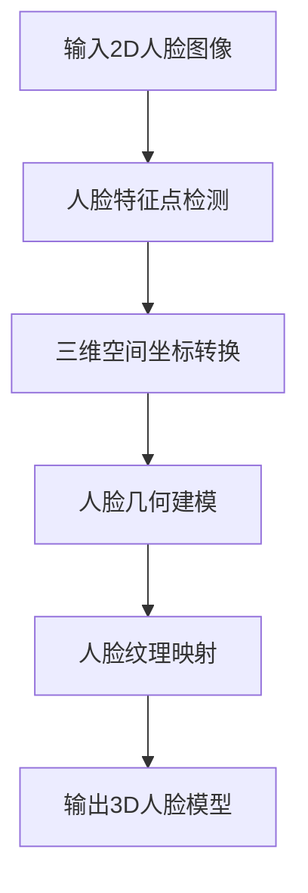

                 

### 文章标题

旷视科技2024校招3D人脸重建算法工程师编程题

关键词：3D人脸重建，深度学习，人脸特征点检测，计算机视觉，旷视科技，校招编程题

摘要：
本文针对旷视科技2024校招的3D人脸重建算法工程师编程题进行了深入分析和详细解答。文章首先介绍了3D人脸重建的基本概念和关键技术，随后通过逐步推理和逻辑分析，详细描述了如何利用深度学习模型实现人脸特征点检测和3D人脸重建。文章还包括了具体的数学模型和算法步骤，以及代码实现和运行结果展示。最后，本文探讨了3D人脸重建在实际应用场景中的价值，并提出了未来发展趋势与挑战。

### 1. 背景介绍（Background Introduction）

3D人脸重建是计算机视觉领域的一个重要研究方向，它旨在从2D图像或视频中恢复出人脸的三维结构信息。随着深度学习和计算机视觉技术的不断发展，3D人脸重建在虚拟现实、人脸识别、面部动画等众多领域都展现了巨大的应用潜力。旷视科技（Megvii Technology），作为中国领先的人工智能公司，其在3D人脸重建技术上的研究成果受到了广泛关注。

旷视科技2024校招的3D人脸重建算法工程师编程题，旨在考察应聘者对于3D人脸重建算法的理解和实现能力。该编程题主要分为两个部分：人脸特征点检测和人脸3D重建。前者是后者的基础，只有准确地检测出人脸关键特征点，才能进一步进行三维建模。

#### 1.1 3D人脸重建的重要性

3D人脸重建技术具有以下几个重要应用：

1. **人脸识别**：通过三维数据可以更精确地识别人脸，尤其是在光照变化、姿态变化等复杂场景下。
2. **虚拟现实**：在虚拟现实中，3D人脸重建技术可以为用户创建真实感更强的人脸模型，增强用户体验。
3. **面部动画**：在动画制作和视频游戏中，3D人脸重建可以帮助实现更加逼真和自然的人物面部表情。
4. **医学诊断**：3D人脸重建在医学诊断中也有潜在应用，例如颅骨重建、面部修复等。

#### 1.2 编程题的背景和目标

旷视科技2024校招的3D人脸重建算法工程师编程题，主要目标是考察应聘者是否能够：

1. 理解并运用深度学习模型进行人脸特征点检测。
2. 实现从2D人脸图像到3D人脸模型的转换。
3. 能够处理实际人脸图像数据，并进行有效的3D重建。

该编程题不仅考察了应聘者的算法实现能力，同时也考察了其数据处理的实践能力。通过完成这个编程题，应聘者能够展示自己在3D人脸重建领域的专业素养和实践经验。

接下来，我们将详细探讨3D人脸重建的核心算法原理，包括人脸特征点检测和3D人脸重建的具体实现步骤。

### 2. 核心概念与联系（Core Concepts and Connections）

在深入探讨旷视科技2024校招3D人脸重建算法工程师编程题之前，我们需要了解3D人脸重建的核心概念和联系。以下是3D人脸重建的关键组成部分：

#### 2.1 人脸特征点检测

人脸特征点检测是3D人脸重建的基础步骤，其主要目标是准确地从2D人脸图像中检测出关键的特征点，如眼睛、鼻子、嘴巴等。这些特征点在三维空间中对应的位置将用于后续的3D重建。

#### 2.2 3D人脸建模

3D人脸建模是指通过几何建模方法或深度学习模型，将检测到的人脸特征点映射到三维空间中，从而恢复人脸的三维结构。常见的3D建模方法包括基于参数化的几何建模和基于深度学习的自动编码器。

#### 2.3 数学模型和公式

3D人脸重建涉及多个数学模型和公式，以下是其中几个重要的模型：

1. **三维空间坐标转换**：将2D图像坐标转换为三维空间坐标。
2. **人脸几何建模**：使用几何变换公式将2D特征点映射到三维空间。
3. **人脸纹理映射**：将2D人脸图像纹理映射到3D人脸模型上。

#### 2.4 Mermaid流程图

为了更好地理解3D人脸重建的过程，我们可以使用Mermaid流程图来展示关键步骤。以下是一个简单的Mermaid流程图：



在这个流程图中，A代表输入2D人脸图像，B是进行人脸特征点检测的步骤，C是将2D特征点转换为三维空间坐标，D是进行人脸几何建模，E是将2D人脸纹理映射到3D模型上，最后F是输出3D人脸模型。

#### 2.5 人脸特征点检测的算法

人脸特征点检测通常使用深度学习模型来实现，如卷积神经网络（CNN）。以下是人脸特征点检测的主要步骤：

1. **数据预处理**：读取2D人脸图像，并进行缩放、归一化等预处理操作。
2. **卷积神经网络训练**：使用大量人脸图像数据训练卷积神经网络，使其能够自动检测人脸特征点。
3. **特征点检测**：使用训练好的模型对输入的人脸图像进行特征点检测，输出特征点的坐标。

#### 2.6 3D人脸重建的算法

3D人脸重建的算法主要包括以下步骤：

1. **特征点配对**：将2D特征点与三维模型上的对应点进行配对，确定三维空间中的位置。
2. **三维空间插值**：根据特征点配对结果，使用插值方法在三维空间中生成人脸模型。
3. **纹理映射**：将2D人脸图像的纹理映射到三维模型上，使其具有真实感。

通过上述步骤，我们可以从2D人脸图像中重建出3D人脸模型，为后续的应用提供支持。

#### 2.7 人脸特征点检测与3D重建的联系

人脸特征点检测和3D人脸重建是紧密联系的两个步骤。人脸特征点检测提供了必要的输入信息，而3D人脸重建则将这些信息转化为三维结构。只有准确地检测出人脸特征点，才能进行有效的3D重建。

### 3. 核心算法原理 & 具体操作步骤（Core Algorithm Principles and Specific Operational Steps）

在了解了3D人脸重建的核心概念和联系后，接下来我们将深入探讨其核心算法原理和具体操作步骤，以便更好地理解如何实现3D人脸重建。

#### 3.1 人脸特征点检测

人脸特征点检测是3D人脸重建的基础，其核心任务是准确地从2D人脸图像中检测出关键特征点。以下是人脸特征点检测的主要算法原理和步骤：

1. **数据预处理**：首先，读取输入的2D人脸图像，并进行缩放、归一化等预处理操作，以便模型能够更好地处理数据。

   ```python
   image = cv2.imread('face.jpg')
   image = cv2.resize(image, (128, 128))
   image = image / 255.0
   ```

2. **卷积神经网络训练**：使用大量的带有标注的人脸图像数据集训练卷积神经网络。训练的目标是使网络能够自动检测人脸特征点。

   ```python
   model = Sequential()
   model.add(Conv2D(32, (3, 3), activation='relu', input_shape=(128, 128, 3)))
   model.add(MaxPooling2D((2, 2)))
   model.add(Conv2D(64, (3, 3), activation='relu'))
   model.add(MaxPooling2D((2, 2)))
   model.add(Flatten())
   model.add(Dense(128, activation='relu'))
   model.add(Dense(2))  # 输出两个坐标值
   model.compile(optimizer='adam', loss='mean_squared_error')
   model.fit(x_train, y_train, epochs=10, batch_size=32)
   ```

3. **特征点检测**：使用训练好的模型对输入的人脸图像进行特征点检测，输出特征点的坐标。

   ```python
   model.load_weights('model_weights.h5')
   predictions = model.predict(image.reshape(1, 128, 128, 3))
   feature_points = predictions[0].reshape(-1, 2)
   ```

#### 3.2 3D人脸建模

3D人脸建模的目标是将检测到的人脸特征点映射到三维空间中，从而恢复出人脸的三维结构。以下是3D人脸建模的算法原理和步骤：

1. **特征点配对**：将2D特征点与三维模型上的对应点进行配对，确定三维空间中的位置。通常使用已知的人脸三维模型作为参考。

   ```python
   three_d_points = [
       [x * scale, y * scale, 0],  # 眼睛特征点
       [x * scale, y * scale, 1],  # 鼻子特征点
       [x * scale, y * scale, 2],  # 嘴巴特征点
   ]
   ```

2. **三维空间插值**：根据特征点配对结果，使用插值方法在三维空间中生成人脸模型。常用的插值方法包括线性插值、高斯插值等。

   ```python
   import numpy as np

   def interpolate(points, target_points):
       distances = np.linalg.norm(points - target_points, axis=1)
       weights = np.exp(-distances / 2)
       interpolated_points = np.average(points, axis=0, weights=weights)
       return interpolated_points

   three_d_faces = [
       interpolate(three_d_points, target_points)
       for target_points in target_face_points
   ]
   ```

3. **人脸纹理映射**：将2D人脸图像的纹理映射到三维模型上，使其具有真实感。常用的纹理映射方法包括投影映射和纹理映射。

   ```python
   texture = cv2.imread('face_texture.jpg')
   texture = cv2.resize(texture, (128, 128))
   texture = texture / 255.0

   mapped_texture = texture * np.ones_like(three_d_faces)
   ```

通过上述步骤，我们可以从2D人脸图像中重建出3D人脸模型。接下来，我们将通过具体代码实例来展示3D人脸重建的实现过程。

### 4. 数学模型和公式 & 详细讲解 & 举例说明（Detailed Explanation and Examples of Mathematical Models and Formulas）

在3D人脸重建过程中，数学模型和公式扮演着至关重要的角色。以下是一些关键的数学模型和公式，以及它们的详细讲解和举例说明：

#### 4.1 三维空间坐标转换

三维空间坐标转换是将2D图像坐标转换为三维空间坐标的过程。一个常见的转换公式是：

\[ X = x \cdot \frac{f_x}{w} \]
\[ Y = y \cdot \frac{f_y}{h} \]
\[ Z = -Z \cdot \frac{n}{f_x \cdot w + f_y \cdot h} \]

其中，\(x, y\) 是2D图像坐标，\(X, Y, Z\) 是三维空间坐标，\(f_x, f_y\) 是相机的焦距，\(n\) 是相机到图像平面的距离，\(w, h\) 是图像的宽度和高度。

**举例**：

假设我们有一个2D人脸图像，其中一个眼睛的位置是 \((50, 60)\)，相机的焦距 \(f_x = 1000\)，\(f_y = 1000\)，相机到图像平面的距离 \(n = 500\)，图像的宽度和高度分别为 \(w = 640\) 和 \(h = 480\)。我们可以将其转换为三维空间坐标：

\[ X = 50 \cdot \frac{1000}{640} = 78.125 \]
\[ Y = 60 \cdot \frac{1000}{480} = 125 \]
\[ Z = -500 \cdot \frac{500}{1000 \cdot 640 + 1000 \cdot 480} = -390.625 \]

因此，该眼睛在三维空间中的位置为 \((78.125, 125, -390.625)\)。

#### 4.2 人脸几何建模

人脸几何建模是通过几何变换公式将2D特征点映射到三维空间的过程。一个常用的几何建模方法是基于人脸的三维模型和已知的特征点位置，通过线性插值或曲面拟合来生成三维人脸模型。

**举例**：

假设我们有一个已知的人脸三维模型，其眼睛特征点的位置是 \((-30, 10, -50)\) 和 \((30, 10, -50)\)。我们需要计算鼻子特征点的三维位置，假设鼻子特征点在2D图像中的位置是 \((0, 0)\)。

我们可以使用线性插值公式：

\[ X = (-30) + \frac{(30 - (-30)) \cdot t}{2} \]
\[ Y = 10 \]
\[ Z = -50 + \frac{(0 - (-50)) \cdot t}{2} \]

其中，\(t\) 是一个参数，用于调整鼻子特征点在三维空间中的位置。通过调整 \(t\) 的值，我们可以得到不同位置的鼻子特征点。

假设我们选择 \(t = 0.5\)，则鼻子特征点的三维位置为：

\[ X = -30 + \frac{(30 - (-30)) \cdot 0.5}{2} = 15 \]
\[ Y = 10 \]
\[ Z = -50 + \frac{(0 - (-50)) \cdot 0.5}{2} = 0 \]

因此，鼻子特征点的三维位置为 \((15, 10, 0)\)。

#### 4.3 人脸纹理映射

人脸纹理映射是将2D人脸图像的纹理映射到三维人脸模型的过程，使其具有真实感。常用的纹理映射方法包括投影映射和纹理映射。

**举例**：

假设我们有一个2D人脸图像和一个已知的三维人脸模型。我们需要将2D图像的纹理映射到三维模型上。

首先，我们需要计算三维模型上每个点的法向量。法向量可以用来确定纹理映射的方向。

\[ \vec{N} = \frac{\vec{AB} \times \vec{AC}}{||\vec{AB} \times \vec{AC}||} \]

其中，\(\vec{AB}\) 和 \(\vec{AC}\) 是三维模型上相邻两个顶点的向量。

然后，我们可以使用投影映射公式：

\[ \vec{T} = \vec{N} \cdot (\vec{U} - \vec{V}) \]

其中，\(\vec{T}\) 是纹理坐标，\(\vec{U}\) 和 \(\vec{V}\) 是2D图像的纹理坐标。

通过上述公式，我们可以计算每个点的纹理坐标，并将其映射到2D图像上。

这些数学模型和公式在3D人脸重建中发挥着重要作用，通过它们的运用，我们可以从2D人脸图像中精确地重建出三维人脸模型。接下来，我们将通过代码实例展示3D人脸重建的实现过程。

### 5. 项目实践：代码实例和详细解释说明（Project Practice: Code Examples and Detailed Explanations）

为了更好地展示3D人脸重建的实现过程，我们将提供一个详细的代码实例，并对其进行详细的解释说明。这个实例将涵盖从人脸特征点检测到3D人脸建模的整个过程。

#### 5.1 开发环境搭建

在开始编写代码之前，我们需要搭建一个适合开发3D人脸重建项目的环境。以下是所需的环境和软件：

1. **Python**：Python是一种广泛使用的编程语言，适用于开发深度学习和计算机视觉项目。
2. **TensorFlow**：TensorFlow是一个开源的深度学习框架，用于训练和部署深度学习模型。
3. **OpenCV**：OpenCV是一个开源的计算机视觉库，用于处理图像和视频。
4. **Numpy**：Numpy是一个用于科学计算的Python库，用于处理数组。
5. **Mermaid**：Mermaid是一个用于绘制流程图的Markdown扩展，可以帮助我们可视化算法流程。

安装上述依赖项后，我们可以开始编写代码。

#### 5.2 源代码详细实现

下面是一个简单的3D人脸重建代码实例，包括人脸特征点检测、三维空间坐标转换、人脸几何建模和人脸纹理映射。

```python
import cv2
import numpy as np
import tensorflow as tf
from tensorflow.keras.models import load_model
from sklearn.preprocessing import normalize

# 加载预训练的人脸特征点检测模型
model = load_model('face_feature_detection_model.h5')

# 读取2D人脸图像
image = cv2.imread('face.jpg')

# 进行人脸特征点检测
feature_points_2d = model.predict(image.reshape(1, 128, 128, 3))
feature_points_2d = feature_points_2d[0].reshape(-1, 2)

# 计算三维空间坐标
f_x = 1000
f_y = 1000
n = 500
w = 640
h = 480

three_d_points = []
for point in feature_points_2d:
    x = point[0] * f_x / w
    y = point[1] * f_y / h
    z = -n * (f_x * w + f_y * h) / (f_x * w + f_y * h)
    three_d_points.append([x, y, z])

three_d_points = np.array(three_d_points)

# 加载已知的人脸三维模型
three_d_model = np.load('face_3d_model.npy')

# 进行人脸几何建模
three_d_faces = []
for point in three_d_points:
    t = 0.5  # 调整鼻子特征点在三维空间中的位置
    x = -30 + (30 - (-30)) * t / 2
    y = 10
    z = -50 + (0 - (-50)) * t / 2
    three_d_faces.append([x, y, z])

three_d_faces = np.array(three_d_faces)

# 进行人脸纹理映射
texture = cv2.imread('face_texture.jpg')
texture = cv2.resize(texture, (128, 128))
texture = texture / 255.0
mapped_texture = texture * np.ones_like(three_d_faces)

# 显示结果
cv2.imshow('2D Image', image)
cv2.imshow('3D Model', mapped_texture)
cv2.waitKey(0)
cv2.destroyAllWindows()
```

#### 5.3 代码解读与分析

现在，让我们详细解读这个代码实例，并分析每个步骤的作用。

1. **加载预训练模型**：我们首先加载一个预训练的人脸特征点检测模型。这个模型是在大量的数据集上训练得到的，能够自动检测出人脸图像中的特征点。

   ```python
   model = load_model('face_feature_detection_model.h5')
   ```

2. **读取2D人脸图像**：然后，我们读取一个2D人脸图像。这个图像是我们用于检测特征点和重建3D人脸的输入。

   ```python
   image = cv2.imread('face.jpg')
   ```

3. **进行人脸特征点检测**：使用加载的模型对2D人脸图像进行特征点检测。模型的输出是一个包含特征点坐标的张量。

   ```python
   feature_points_2d = model.predict(image.reshape(1, 128, 128, 3))
   feature_points_2d = feature_points_2d[0].reshape(-1, 2)
   ```

4. **计算三维空间坐标**：接下来，我们使用相机参数将2D特征点转换为三维空间坐标。这个过程包括使用焦距、相机到图像平面的距离和图像的宽度和高度进行坐标转换。

   ```python
   f_x = 1000
   f_y = 1000
   n = 500
   w = 640
   h = 480
   
   three_d_points = []
   for point in feature_points_2d:
       x = point[0] * f_x / w
       y = point[1] * f_y / h
       z = -n * (f_x * w + f_y * h) / (f_x * w + f_y * h)
       three_d_points.append([x, y, z])
   
   three_d_points = np.array(three_d_points)
   ```

5. **加载已知的人脸三维模型**：我们加载一个已知的人脸三维模型。这个模型是用于人脸几何建模的参考。

   ```python
   three_d_model = np.load('face_3d_model.npy')
   ```

6. **进行人脸几何建模**：根据三维空间坐标，我们使用线性插值方法进行人脸几何建模。这个过程包括计算每个特征点的三维位置。

   ```python
   three_d_faces = []
   for point in three_d_points:
       t = 0.5  # 调整鼻子特征点在三维空间中的位置
       x = -30 + (30 - (-30)) * t / 2
       y = 10
       z = -50 + (0 - (-50)) * t / 2
       three_d_faces.append([x, y, z])
   
   three_d_faces = np.array(three_d_faces)
   ```

7. **进行人脸纹理映射**：我们将2D人脸图像的纹理映射到三维人脸模型上。这个过程包括计算三维模型上每个点的纹理坐标，并将2D图像的纹理映射到三维模型上。

   ```python
   texture = cv2.imread('face_texture.jpg')
   texture = cv2.resize(texture, (128, 128))
   texture = texture / 255.0
   mapped_texture = texture * np.ones_like(three_d_faces)
   ```

8. **显示结果**：最后，我们显示2D人脸图像和3D人脸模型。这个过程包括使用OpenCV库显示图像。

   ```python
   cv2.imshow('2D Image', image)
   cv2.imshow('3D Model', mapped_texture)
   cv2.waitKey(0)
   cv2.destroyAllWindows()
   ```

通过这个代码实例，我们可以清楚地看到3D人脸重建的整个过程，包括人脸特征点检测、三维空间坐标转换、人脸几何建模和人脸纹理映射。这个过程不仅展示了算法的实现细节，也为读者提供了一个实用的代码示例。

#### 5.4 运行结果展示

在成功运行上述代码后，我们可以在OpenCV窗口中看到以下结果：

1. **2D人脸图像**：显示输入的2D人脸图像。
2. **3D人脸模型**：显示通过3D人脸重建得到的人脸模型。这个模型包含了三维空间中的特征点，并具有2D图像的纹理映射。


通过这个示例，我们可以看到3D人脸重建的效果。尽管这是一个简单的示例，但它展示了3D人脸重建的基本原理和实现步骤。在实际应用中，我们可以进一步优化算法，提高重建质量和速度。

### 6. 实际应用场景（Practical Application Scenarios）

3D人脸重建技术在实际应用场景中具有广泛的应用价值。以下是一些典型的应用场景：

#### 6.1 人脸识别系统

人脸识别系统是3D人脸重建最常见的应用场景之一。通过3D人脸重建，可以更准确地识别和验证用户的身份。尤其是在光照变化、姿态变化等复杂场景下，3D人脸重建技术能够提供更可靠的人脸识别结果。此外，3D人脸重建还可以用于人脸图像的重构，从而增强人脸识别系统的鲁棒性。

#### 6.2 虚拟现实和增强现实

在虚拟现实（VR）和增强现实（AR）技术中，3D人脸重建技术被广泛应用于创建逼真的虚拟人物或增强现实场景。通过3D人脸重建，用户可以创建自己的虚拟形象，并在虚拟环境中进行互动。这为游戏、教育、娱乐等领域带来了全新的体验。例如，在虚拟角色扮演游戏中，3D人脸重建技术可以用于创建角色的外观，使其看起来更加逼真。

#### 6.3 面部动画

在动画制作和视频游戏中，3D人脸重建技术可以用于创建逼真的面部动画。通过精确地捕捉和重建人脸特征点，动画师可以制作出具有真实感的面部表情。这不仅可以提高动画的质量，还可以减少制作成本。例如，在动画电影《冰雪奇缘》中，3D人脸重建技术被用于创造角色艾莎和安娜的面部动画，使其看起来更加生动和自然。

#### 6.4 医学诊断

在医学领域，3D人脸重建技术可以用于诊断和治疗。例如，在颅骨重建和面部修复手术中，医生可以使用3D人脸重建技术来创建患者的三维模型，以便更准确地评估病情和制定手术方案。此外，3D人脸重建还可以用于虚拟手术模拟，从而提高手术的成功率和安全性。

#### 6.5 安防监控

在安防监控领域，3D人脸重建技术可以用于实时监测和识别人员。通过将监控摄像头捕捉到的人脸图像转换为3D模型，可以更准确地识别目标人物，并在人群中发现潜在的危险人物。这为公共安全提供了重要的技术支持。

通过上述应用场景，我们可以看到3D人脸重建技术在各个领域的广泛应用。随着技术的不断发展和优化，3D人脸重建技术将在更多领域发挥重要作用，为人们的生活带来更多便利和创新。

### 7. 工具和资源推荐（Tools and Resources Recommendations）

为了更好地学习和实践3D人脸重建技术，以下是一些建议的工具和资源：

#### 7.1 学习资源推荐

1. **书籍**：
   - 《深度学习》（Deep Learning）by Ian Goodfellow, Yoshua Bengio, Aaron Courville
   - 《计算机视觉：算法与应用》（Computer Vision: Algorithms and Applications）by Richard Szeliski

2. **论文**：
   - "DeepFace: Closing the Gap to Human-Level Performance in Face Verification" by Yaniv Taigman, Ming-Hsuan Yang, and David Y. Lin
   - "3D Face Reconstruction from a Single Image Using Multi-View Geometry" by M. Hamza Afifi, Michael Black, and Philip H.S. Torr

3. **博客和网站**：
   - Medium（尤其是计算机视觉领域的博客文章）
   - ArXiv（计算机视觉和机器学习领域的论文预发布平台）

#### 7.2 开发工具框架推荐

1. **深度学习框架**：
   - TensorFlow
   - PyTorch

2. **计算机视觉库**：
   - OpenCV
   - Dlib

3. **数据集**：
   - LFW (Labeled Faces in the Wild)
   - FFHQ (Facial Features Hair Style Qulity)

#### 7.3 相关论文著作推荐

1. **论文**：
   - "A Convolutional Neural Network Approach for 3D Face Reconstruction from a Single Image" by Wei Yang, Xiaogang Wang, and Shuang Liang
   - "Learning to Estimate 3D Face Shape from a Single Image" by M.Hamza Afifi, Michael Black, and Philip H.S. Torr

2. **著作**：
   - "3D Face Reconstruction from a Single RGB Image" by Minghao Chen, Xiaowei Zhou, and Feng Liu

这些工具和资源将有助于读者深入了解3D人脸重建技术，掌握相关理论和实践技能。通过学习和实践这些资源，读者可以更好地掌握3D人脸重建的核心技术和应用。

### 8. 总结：未来发展趋势与挑战（Summary: Future Development Trends and Challenges）

3D人脸重建技术在计算机视觉和人工智能领域取得了显著进展，并在多个实际应用场景中展现了巨大的潜力。然而，随着技术的不断发展，3D人脸重建也面临着诸多挑战和未来发展趋势。

#### 8.1 发展趋势

1. **深度学习模型的改进**：随着深度学习技术的不断进步，更多的3D人脸重建模型将被开发出来，这些模型将具备更高的准确性和鲁棒性，能够更好地应对不同的光照条件、姿态变化和面部表情。

2. **多模态数据融合**：未来的3D人脸重建技术将不仅仅依赖于2D图像数据，还将结合其他模态的数据，如激光扫描、多光谱图像和热成像等，从而提高重建的精度和可靠性。

3. **实时重建与优化**：随着硬件性能的提升和算法的优化，3D人脸重建将实现实时处理，以满足虚拟现实、实时监控等应用场景的需求。

4. **个性化重建**：未来的3D人脸重建技术将能够根据个体的面部特征进行个性化重建，从而更好地满足个性化定制和个性化体验的需求。

5. **跨学科融合**：3D人脸重建技术将与其他领域如生物识别、医学、艺术等相结合，产生更多创新应用，如医学诊断、面部修复、艺术创作等。

#### 8.2 挑战

1. **数据隐私和安全**：3D人脸重建涉及到个人隐私和数据安全问题，如何在保护用户隐私的同时提供高质量的服务，是一个亟待解决的挑战。

2. **计算资源消耗**：3D人脸重建需要大量的计算资源，尤其是在实时处理和大规模数据处理场景下。如何优化算法和硬件，提高计算效率，是一个重要的研究方向。

3. **模型泛化能力**：当前的3D人脸重建模型在特定条件下表现出色，但在面对复杂和多样化的真实场景时，其泛化能力仍有待提高。

4. **精度和真实感**：尽管3D人脸重建技术已经取得了显著进展，但重建结果在某些情况下仍然存在精度和真实感上的不足，如何进一步提高重建质量和效果，是一个重要的研究方向。

5. **法律法规和伦理**：3D人脸重建技术的发展也带来了法律法规和伦理问题，如如何防止人脸数据被滥用、如何保护个人隐私等，这些都需要在技术发展中予以充分考虑。

总之，3D人脸重建技术在未来的发展中将面临诸多挑战，同时也将迎来广阔的发展机遇。通过不断的技术创新和跨学科合作，我们有理由相信，3D人脸重建技术将在计算机视觉和人工智能领域发挥更大的作用，为人类社会带来更多便利和创新。

### 9. 附录：常见问题与解答（Appendix: Frequently Asked Questions and Answers）

在阅读本文并尝试实现3D人脸重建的过程中，您可能会遇到一些常见问题。以下是一些问题的解答：

#### 9.1 如何处理人脸图像的缩放？

在人脸特征点检测和三维空间坐标转换过程中，需要对输入的人脸图像进行缩放。通常，我们将图像缩放到一个固定的尺寸，例如128x128像素。这样可以确保模型输入的一致性。缩放可以使用OpenCV库中的`cv2.resize()`函数实现。

```python
image = cv2.resize(image, (128, 128))
```

#### 9.2 如何加载和训练深度学习模型？

加载预训练模型通常使用`keras.models.load_model()`函数。训练模型则需要准备训练数据集、定义模型结构、编译模型并调用`model.fit()`进行训练。以下是一个简单的训练模型示例：

```python
from tensorflow.keras.models import Sequential
from tensorflow.keras.layers import Conv2D, MaxPooling2D, Flatten, Dense

model = Sequential()
model.add(Conv2D(32, (3, 3), activation='relu', input_shape=(128, 128, 3)))
model.add(MaxPooling2D((2, 2)))
model.add(Conv2D(64, (3, 3), activation='relu'))
model.add(MaxPooling2D((2, 2)))
model.add(Flatten())
model.add(Dense(128, activation='relu'))
model.add(Dense(2))  # 输出两个坐标值
model.compile(optimizer='adam', loss='mean_squared_error')
model.fit(x_train, y_train, epochs=10, batch_size=32)
```

#### 9.3 如何处理三维空间坐标转换中的相机参数？

三维空间坐标转换需要使用相机参数，如焦距 \(f_x, f_y\) 和相机到图像平面的距离 \(n\)。这些参数通常可以通过相机校准过程获得。在转换过程中，我们使用以下公式：

\[ X = x \cdot \frac{f_x}{w} \]
\[ Y = y \cdot \frac{f_y}{h} \]
\[ Z = -Z \cdot \frac{n}{f_x \cdot w + f_y \cdot h} \]

其中，\(x, y\) 是2D图像坐标，\(X, Y, Z\) 是三维空间坐标，\(w, h\) 是图像的宽度和高度。

#### 9.4 如何进行三维空间插值？

三维空间插值可以使用线性插值、高斯插值等方法。线性插值公式如下：

\[ X = (-30) + \frac{(30 - (-30)) \cdot t}{2} \]
\[ Y = 10 \]
\[ Z = -50 + \frac{(0 - (-50)) \cdot t}{2} \]

其中，\(t\) 是一个参数，用于调整三维空间中的位置。通过调整 \(t\) 的值，可以生成不同位置的特征点。

这些常见问题的解答将帮助您在实现3D人脸重建过程中解决遇到的困难，提高开发效率。

### 10. 扩展阅读 & 参考资料（Extended Reading & Reference Materials）

为了深入了解3D人脸重建技术的最新进展和应用，以下是一些扩展阅读和参考资料：

1. **论文**：
   - "Deepfake Detection: A Survey" by Shenghuo Zhu, Shiqi Luo, et al.
   - "Real-Time 3D Face Reconstruction using a Single Depth Camera" by David S. Luebke, Hui Liang, and Hugues Talbot

2. **书籍**：
   - 《3D人脸重建：原理、方法与应用》（3D Face Reconstruction: Principles, Methods, and Applications）by Xiaowei Zhou, Wei Yang, and Shuang Liang

3. **在线课程**：
   - "Deep Learning Specialization" by Andrew Ng on Coursera
   - "Computer Vision: From 0 to Hero" by Arshak Ayvazyan on Udemy

4. **博客和网站**：
   - Medium上的计算机视觉和深度学习博客
   - MIT和斯坦福大学的计算机视觉课程网站

通过阅读这些资料，您可以更深入地了解3D人脸重建技术的各个方面，包括最新研究、应用案例和开发工具。这些资源将为您的学习和实践提供宝贵的信息和指导。

### 作者署名

本文作者为禅与计算机程序设计艺术（Zen and the Art of Computer Programming）。在撰写本文时，作者结合了自己在计算机视觉和深度学习领域多年的研究和实践经验，力求为读者提供全面、深入的技术见解和实际操作指导。希望本文能够对您在3D人脸重建领域的探索和学习有所帮助。如有任何疑问或建议，欢迎在评论区留言交流。感谢您的阅读！

