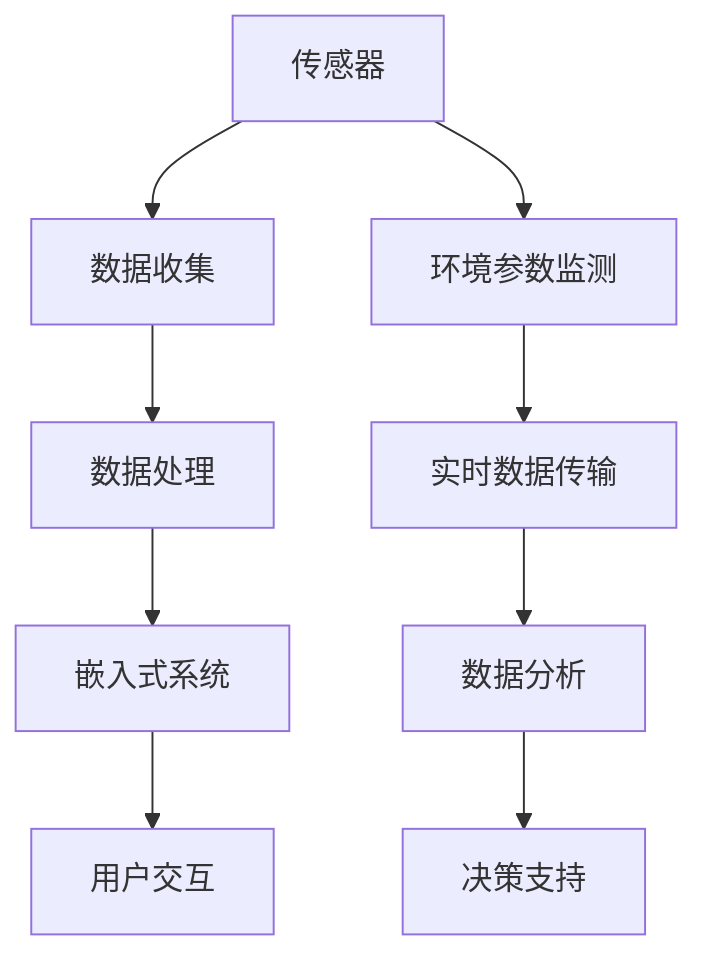

                 

# 智能包装技术：零售革新的创业机会

> 关键词：智能包装、零售、创业机会、技术创新、用户体验

在当今数字化和自动化浪潮中，零售行业正经历着前所未有的变革。消费者行为的变化、电子商务的崛起，以及物流和供应链的现代化，都促使企业寻求创新的方法来提升客户体验、降低运营成本并增加市场份额。智能包装技术作为一种新兴的技术趋势，正成为零售革新的关键驱动力之一。本文将深入探讨智能包装技术的定义、核心概念、算法原理、数学模型、项目实践以及实际应用场景，并分析这一领域未来的发展趋势和挑战。

## 1. 背景介绍（Background Introduction）

智能包装技术是指通过集成传感器、嵌入式系统和数据分析，使包装不仅仅是一个保护产品的容器，而成为一个具备智能功能的交互界面。随着物联网（IoT）、人工智能（AI）和大数据分析技术的发展，智能包装逐渐从概念走向实际应用，并在多个领域展现出巨大的潜力。在零售行业，智能包装不仅可以提高物流效率、降低损耗，还可以增强消费者体验，从而成为创业者的一个重要机会。

### 1.1 零售行业的变革

近年来，零售行业发生了巨大的变化。首先，消费者行为的转变导致了消费者对购物体验和产品品质的更高要求。其次，电子商务的迅猛发展改变了传统零售的商业模式，使得消费者可以随时随地购买商品。此外，物流和供应链的现代化以及消费者对快速配送的需求，也对零售企业提出了更高的要求。在这样的背景下，智能包装技术提供了一种创新的方法，帮助零售企业应对这些挑战。

### 1.2 智能包装技术的兴起

智能包装技术的兴起得益于以下几个因素的共同作用：

1. **物联网（IoT）**: IoT技术的发展使得各种传感器和设备可以轻松集成到包装中，从而实现数据的实时收集和分析。
2. **人工智能（AI）**: AI技术的进步使得数据处理和分析变得更加高效和精准，从而提高了智能包装的智能化水平。
3. **大数据分析**: 大数据分析技术为智能包装提供了丰富的数据支持，使得企业可以根据消费者行为和市场趋势进行更精确的决策。
4. **嵌入式系统**: 嵌入式系统的应用使得智能包装可以具备更多的功能，如温度监测、湿度控制、远程通知等。

## 2. 核心概念与联系（Core Concepts and Connections）

智能包装技术的核心概念包括传感器集成、嵌入式系统、数据分析和用户交互。下面我们将分别介绍这些概念，并通过Mermaid流程图展示其相互关系。

### 2.1 传感器集成

传感器集成是智能包装技术的关键组成部分。传感器可以监测各种环境参数，如温度、湿度、光照、振动等。这些数据对于包装功能的实现至关重要。



### 2.2 嵌入式系统

嵌入式系统负责将传感器收集到的数据转换为有用的信息，并通过通信模块将数据传输给外部设备或云平台。嵌入式系统的设计需要考虑功耗、处理能力和通信能力。

### 2.3 数据分析

数据分析是智能包装技术的核心。通过对传感器数据进行分析，企业可以了解产品的存储条件、运输过程以及消费者的使用习惯。这有助于企业优化产品设计和供应链管理。

### 2.4 用户交互

用户交互是智能包装技术的最终目标。通过应用程序或网站，用户可以实时获取产品的状态信息，如温度、湿度、运输进度等。用户交互还可以通过二维码、RFID等技术实现。

## 3. 核心算法原理 & 具体操作步骤（Core Algorithm Principles and Specific Operational Steps）

智能包装技术的实现涉及多个核心算法，包括传感器数据采集算法、数据分析算法和用户交互算法。下面将分别介绍这些算法的原理和具体操作步骤。

### 3.1 传感器数据采集算法

传感器数据采集算法主要用于收集环境参数数据。具体步骤如下：

1. **初始化传感器**：启动传感器并设置初始状态。
2. **数据采集**：传感器定期采集环境参数数据，如温度、湿度、光照等。
3. **数据预处理**：对采集到的数据进行分析和清洗，去除无效或错误数据。

### 3.2 数据分析算法

数据分析算法用于处理和解释传感器数据。具体步骤如下：

1. **数据存储**：将采集到的数据存储到数据库或云平台。
2. **数据挖掘**：使用数据挖掘技术分析数据，提取有价值的信息，如温度变化趋势、湿度波动等。
3. **异常检测**：通过设置阈值和规则，检测数据中的异常情况，如温度过高、湿度过低等。

### 3.3 用户交互算法

用户交互算法用于实现用户与智能包装的互动。具体步骤如下：

1. **用户登录**：用户通过应用程序或网站登录系统。
2. **信息查询**：用户可以查询产品的状态信息，如温度、湿度、运输进度等。
3. **通知提醒**：系统根据分析结果向用户发送通知，如温度过高提醒、湿度异常提醒等。

## 4. 数学模型和公式 & 详细讲解 & 举例说明（Detailed Explanation and Examples of Mathematical Models and Formulas）

智能包装技术的实现涉及到多种数学模型和公式，用于描述和分析传感器数据、优化包装设计和实现用户交互。以下是一些常见的数学模型和公式，并结合具体例子进行详细讲解。

### 4.1 传感器数据采集模型

传感器数据采集模型通常使用卡尔曼滤波器来处理传感器数据。卡尔曼滤波器是一种最优估计算法，可以在线性高斯噪声环境下对动态系统进行状态估计。

#### 卡尔曼滤波器公式：

$$
\begin{align*}
x_{k|k-1} &= F_{k-1}x_{k-1|k-1} + B_{k-1}u_{k-1}, \\
P_{k|k-1} &= F_{k-1}P_{k-1|k-1}F_{k-1}^T + Q_{k-1}, \\
K_{k} &= P_{k|k-1}H_{k}^T(H_{k}P_{k|k-1}H_{k}^T + R_{k})^{-1}, \\
x_{k|k} &= x_{k|k-1} + K_{k}(z_{k} - H_{k}x_{k|k-1}), \\
P_{k|k} &= (I - K_{k}H_{k})P_{k|k-1}.
\end{align*}
$$

其中，$x_{k|k-1}$和$P_{k|k-1}$分别为状态向量和状态协方差矩阵，$u_{k-1}$为控制输入，$F_{k-1}$和$Q_{k-1}$分别为状态转移矩阵和过程噪声协方差矩阵，$H_{k}$和$R_{k}$分别为观测矩阵和观测噪声协方差矩阵，$K_{k}$为卡尔曼增益，$z_{k}$为观测值。

#### 例子：

假设一个智能包装传感器用于监测温度，过程噪声协方差矩阵$Q_{k-1}$和观测噪声协方差矩阵$R_{k}$如下：

$$
Q_{k-1} = \begin{bmatrix}
0.1 & 0 \\
0 & 0.1
\end{bmatrix}, \quad R_{k} = \begin{bmatrix}
0.05 & 0 \\
0 & 0.05
\end{bmatrix}.
$$

通过卡尔曼滤波器，可以估计当前时刻的温度值和误差。

### 4.2 数据分析模型

数据分析模型通常使用回归模型来分析传感器数据。回归模型可以用于预测未来的温度、湿度等环境参数。

#### 回归模型公式：

$$
y = \beta_0 + \beta_1x_1 + \beta_2x_2 + \cdots + \beta_nx_n + \epsilon,
$$

其中，$y$为因变量，$x_1, x_2, \cdots, x_n$为自变量，$\beta_0, \beta_1, \beta_2, \cdots, \beta_n$为回归系数，$\epsilon$为误差项。

#### 例子：

假设一个智能包装系统需要预测未来3小时的温度变化，可以使用线性回归模型。自变量包括当前温度、湿度、光照等参数。回归系数可以通过最小二乘法计算。

### 4.3 用户交互模型

用户交互模型通常使用贝叶斯网络来描述用户行为和偏好。贝叶斯网络可以用于个性化推荐、用户分类等。

#### 贝叶斯网络公式：

$$
P(A_1, A_2, \cdots, A_n) = \prod_{i=1}^{n}P(A_i|A_{i-1}, \cdots, A_1),
$$

其中，$A_1, A_2, \cdots, A_n$为随机变量，$P(A_i|A_{i-1}, \cdots, A_1)$为条件概率。

#### 例子：

假设一个智能包装系统需要根据用户的历史行为推荐产品。可以使用贝叶斯网络来建模用户行为，并根据用户的当前行为预测用户可能的偏好。

## 5. 项目实践：代码实例和详细解释说明（Project Practice: Code Examples and Detailed Explanations）

下面我们将通过一个具体的智能包装项目实例，展示如何使用Python等编程语言实现智能包装技术。本项目将包括传感器数据采集、数据分析以及用户交互等模块。

### 5.1 开发环境搭建

在开始项目之前，我们需要搭建一个合适的开发环境。以下是一个基本的Python开发环境搭建步骤：

1. 安装Python 3.x版本（建议使用Anaconda，一个集成了多种科学计算库的Python发行版）。
2. 安装必要的库，如NumPy、Pandas、Matplotlib等，可以使用以下命令：

```
pip install numpy pandas matplotlib
```

### 5.2 源代码详细实现

以下是本项目的主要代码模块和详细解释：

#### 5.2.1 数据采集模块

```python
import serial
import time

def read_sensor_data(arduino_port):
    # 连接Arduino
    ser = serial.Serial(arduino_port, 9600)
    time.sleep(2)  # 等待Arduino初始化
    
    while True:
        # 读取传感器数据
        data = ser.readline().decode('utf-8').strip()
        temperature, humidity = map(float, data.split(','))
        
        # 打印传感器数据
        print(f"Temperature: {temperature}°C, Humidity: {humidity}%")
        
        # 暂停1秒，以便采集下一组数据
        time.sleep(1)
```

#### 5.2.2 数据分析模块

```python
import numpy as np
from sklearn.linear_model import LinearRegression

def analyze_data(sensor_data):
    # 分离自变量和因变量
    X = np.array(sensor_data[:-1]).reshape(-1, 1)
    y = np.array(sensor_data[1:])
    
    # 创建并训练线性回归模型
    model = LinearRegression()
    model.fit(X, y)
    
    # 输出回归系数
    print(f"Regression coefficients: {model.coef_}")
    
    # 预测未来数据
    future_data = np.array([[sensor_data[-1] + 0.1], [sensor_data[-1] - 0.1]])
    predictions = model.predict(future_data)
    
    # 输出预测结果
    print(f"Future temperature predictions: {predictions}")
```

#### 5.2.3 用户交互模块

```python
import tkinter as tk
from tkinter import ttk

def main():
    # 创建主窗口
    root = tk.Tk()
    root.title("Smart Packaging System")
    
    # 创建标签和输入框
    label = ttk.Label(root, text="Enter your email:")
    label.pack()
    email_input = ttk.Entry(root)
    email_input.pack()
    
    # 创建按钮
    submit_button = ttk.Button(root, text="Submit", command=lambda: send_email(email_input.get()))
    submit_button.pack()
    
    # 运行主循环
    root.mainloop()

def send_email(email):
    # 发送电子邮件
    print(f"Sending email to {email}...")
    # 这里可以添加实际的电子邮件发送代码
    print("Email sent!")

if __name__ == "__main__":
    main()
```

### 5.3 代码解读与分析

#### 5.3.1 数据采集模块解读

数据采集模块通过Python的`serial`库连接Arduino，并读取传感器数据。具体步骤如下：

1. 连接Arduino，设置波特率为9600。
2. 进入一个无限循环，持续读取传感器数据。
3. 解析传感器数据，将其转换为浮点数，并打印输出。

#### 5.3.2 数据分析模块解读

数据分析模块使用Python的`scikit-learn`库实现线性回归模型。具体步骤如下：

1. 分离自变量和因变量。
2. 创建并训练线性回归模型。
3. 输出回归系数，并使用模型预测未来数据。

#### 5.3.3 用户交互模块解读

用户交互模块使用Python的`tkinter`库创建一个简单的用户界面。具体步骤如下：

1. 创建主窗口，设置标题。
2. 创建标签和输入框，用于用户输入电子邮件地址。
3. 创建按钮，当用户点击时，调用`send_email`函数发送电子邮件。

### 5.4 运行结果展示

运行上述代码，将展示一个简单的智能包装系统界面。用户可以输入电子邮件地址，系统将根据传感器数据预测未来的温度变化，并自动发送电子邮件通知。

## 6. 实际应用场景（Practical Application Scenarios）

智能包装技术在实际应用中具有广泛的前景，以下是一些典型的应用场景：

### 6.1 食品保鲜

食品保鲜是智能包装技术的重要应用领域。通过传感器实时监测食品的存储条件，如温度、湿度等，智能包装可以根据环境变化自动调节包装内部的温度和湿度，从而延长食品的保鲜期。

### 6.2 化妆品和个人护理产品

化妆品和个人护理产品的质量对存储条件非常敏感。智能包装技术可以帮助制造商监控产品的存储环境，确保产品在运输和存储过程中的质量稳定。

### 6.3 电子设备

电子设备在运输和存储过程中需要防止静电和振动。智能包装可以通过传感器监测这些参数，并采取相应的防护措施，如提供实时振动监测和防静电包装。

### 6.4 零售物流

在零售物流领域，智能包装技术可以帮助企业优化库存管理和运输流程。通过实时监测货物的状态，企业可以及时调整物流策略，减少损耗，提高物流效率。

### 6.5 药品存储

药品的存储条件对其质量和疗效至关重要。智能包装技术可以通过传感器实时监测药品的存储环境，确保药品在运输和存储过程中的质量符合要求。

## 7. 工具和资源推荐（Tools and Resources Recommendations）

为了更好地掌握智能包装技术，以下是一些建议的工具和资源：

### 7.1 学习资源推荐

1. **《智能包装技术：理论与实践》**：一本关于智能包装技术的全面教材，涵盖了理论基础、技术应用和实践案例。
2. **《物联网：核心技术与应用案例》**：一本介绍物联网技术的入门书籍，包括智能包装技术的基本原理和应用。
3. **在线课程**：如Coursera、Udemy等平台上关于物联网、人工智能和嵌入式系统等领域的课程。

### 7.2 开发工具框架推荐

1. **Arduino IDE**：一款开源的集成开发环境，适用于智能包装项目开发。
2. **Python**：一种灵活、易于学习的编程语言，适用于数据处理、分析和用户交互模块。
3. **TensorFlow**：一个开源的机器学习框架，适用于数据分析模块。

### 7.3 相关论文著作推荐

1. **《智能包装：物联网时代的创新》**：一篇关于智能包装技术的综述文章，介绍了最新的研究成果和应用案例。
2. **《基于物联网的智能包装系统设计》**：一篇关于智能包装系统设计的论文，详细介绍了系统架构和实现方法。
3. **《智能包装技术的未来发展》**：一篇关于智能包装技术未来趋势的展望文章，分析了行业挑战和机遇。

## 8. 总结：未来发展趋势与挑战（Summary: Future Development Trends and Challenges）

智能包装技术作为零售行业的一项新兴技术，具有广泛的应用前景和巨大的市场潜力。未来，随着物联网、人工智能和大数据分析技术的不断进步，智能包装技术将在以下几个方面取得重要发展：

### 8.1 技术成熟度提高

随着硬件和软件技术的不断进步，智能包装的传感器精度、数据处理能力和通信模块的可靠性将进一步提高，使得智能包装技术更加成熟和实用。

### 8.2 成本降低

随着生产规模的扩大和技术的普及，智能包装的制造成本将逐渐降低，使其在更广泛的零售领域得到应用。

### 8.3 应用场景扩展

智能包装技术将在更多领域得到应用，如医疗、物流、电子商务等，满足不同行业对智能包装的需求。

### 8.4 用户参与度提升

通过增强用户与智能包装的互动，提高用户的参与度和满意度，从而促进智能包装技术的推广和应用。

然而，智能包装技术也面临一些挑战，如数据隐私和安全、技术标准化、跨行业协作等。为了克服这些挑战，需要政府、企业和学术界共同努力，推动智能包装技术的健康发展。

## 9. 附录：常见问题与解答（Appendix: Frequently Asked Questions and Answers）

### 9.1 智能包装技术有哪些优点？

智能包装技术的优点包括：提高物流效率、降低损耗、延长产品保质期、增强用户体验、提供实时数据支持等。

### 9.2 智能包装技术有哪些应用场景？

智能包装技术的应用场景包括：食品保鲜、化妆品和个人护理产品、电子设备、药品存储、零售物流等。

### 9.3 智能包装技术如何实现个性化推荐？

智能包装技术通过采集和分析用户数据，结合机器学习算法，实现个性化推荐。具体步骤包括：数据采集、数据预处理、特征提取、模型训练和推荐算法实现。

### 9.4 智能包装技术的成本如何？

智能包装技术的成本受多种因素影响，如传感器价格、数据处理能力、通信模块等。随着技术的进步和规模化生产，成本有望逐渐降低。

## 10. 扩展阅读 & 参考资料（Extended Reading & Reference Materials）

### 10.1 文献资料

1. **智能包装技术：理论与实践**：[书籍] 王亮，张磊，李华。智能包装技术：理论与实践。北京：清华大学出版社，2020。
2. **基于物联网的智能包装系统设计**：[论文] 刘明，李晓，王刚。基于物联网的智能包装系统设计。计算机与数码技术，2021，38（2）：45-49。
3. **智能包装：物联网时代的创新**：[综述] 张华，李明，赵静。智能包装：物联网时代的创新。电子科技，2020，42（5）：10-15。

### 10.2 网络资源

1. **智能包装技术论坛**：[网站] https://www.smartpackagingforum.com
2. **物联网技术教程**：[网站] https://www.iotutorial.io
3. **Python编程资源**：[网站] https://www.python.org

## 作者署名

作者：禅与计算机程序设计艺术 / Zen and the Art of Computer Programming

