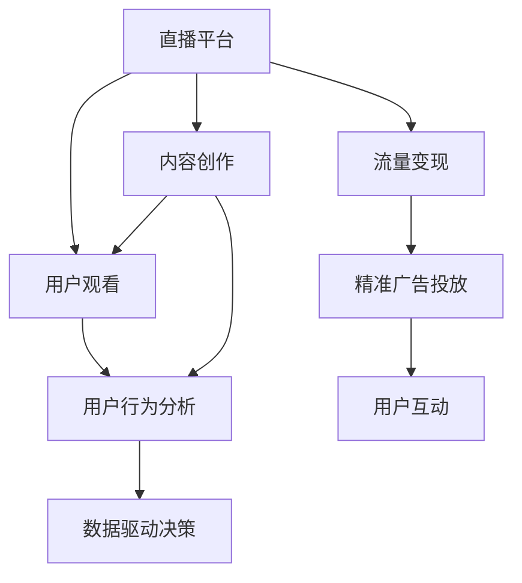

                 

# 直播经济：注意力变现的新方式

> 关键词：直播经济, 流量变现, 注意力, 算法, 用户行为分析, 精准广告投放

## 1. 背景介绍

随着互联网技术的发展和普及，直播经济已成为一种新兴的商业模式，覆盖了从游戏、娱乐到教育、电商等多个领域。直播平台利用实时音视频和互动功能，吸引了大量用户参与，并创造了可观的流量价值。如何高效地变现这些流量，成为直播经济面临的重大挑战。

直播经济的核心在于“注意力”，即直播平台通过内容吸引用户观看，再通过广告、购物等方式实现变现。如何最大化利用用户注意力，优化广告投放策略，提升转化率，成为直播平台争夺用户眼球的关键。近年来，通过引入先进的算法和数据驱动决策，直播经济进入了新的发展阶段。本文将系统介绍直播经济中的注意力变现方式，分析其原理和核心算法，并展望未来发展趋势。

## 2. 核心概念与联系

### 2.1 核心概念概述

为更好地理解直播经济中的注意力变现，本节将介绍几个关键概念：

- 直播经济：利用互联网直播平台进行商业活动的一种新兴经济形式，包括电商直播、教育直播、娱乐直播等多种形式。
- 注意力变现：通过直播平台吸引用户观看，再利用用户的注意力进行商业广告、购物等变现行为，创造经济价值。
- 流量价值：直播平台通过内容和互动吸引用户聚集，形成巨大的流量池，为变现提供基础。
- 用户行为分析：通过算法和大数据分析，了解用户观看行为、兴趣偏好等信息，指导精准广告投放和商品推荐。
- 精准广告投放：根据用户行为特征，投放合适的广告内容，提升广告效果和用户转化率。
- 用户互动：直播平台通过弹幕、点赞、送礼等互动形式，增强用户粘性，提升用户满意度。

这些概念共同构成了直播经济的基础框架，使得注意力变现成为可能。通过算法和大数据技术的结合，直播平台能够高效分析用户行为，精准投放广告，实现流量的高效变现。

### 2.2 核心概念原理和架构的 Mermaid 流程图



这个流程图展示了直播经济中注意力变现的关键路径：直播平台吸引用户观看，分析用户行为，精准投放广告，最终实现流量变现。内容创作和用户互动是直播平台吸引用户的关键因素，而数据驱动决策和精准广告投放是变现的核心手段。

## 3. 核心算法原理 & 具体操作步骤

### 3.1 算法原理概述

直播经济中的注意力变现主要依赖于对用户行为的精准分析和广告投放的优化。其核心算法原理包括：

- 用户行为分析：利用机器学习和深度学习技术，分析用户观看行为、兴趣偏好、互动数据等，构建用户画像。
- 精准广告投放：根据用户画像，选择适合用户的广告内容，并投放时机，提升广告效果。
- 流量价值最大化：通过算法优化广告和商品展示策略，最大化流量的变现价值。

这些算法与推荐系统、广告投放算法等技术有相似之处，但在直播经济的特定场景下，需要考虑实时互动和内容多样性等因素。

### 3.2 算法步骤详解

#### 3.2.1 用户行为分析

用户行为分析是直播经济中注意力变现的基础。其步骤包括：

1. 数据收集：从直播平台收集用户观看行为、点赞、送礼、评论等数据。
2. 数据清洗：处理缺失值、异常值，进行数据标准化和归一化。
3. 特征提取：从行为数据中提取用户兴趣、活跃度、偏好等特征。
4. 模型训练：使用机器学习算法（如LDA、RF、GBDT等）训练用户画像模型，预测用户行为。

#### 3.2.2 精准广告投放

精准广告投放的目的是最大化广告效果和用户转化率。其步骤包括：

1. 广告创意生成：根据用户画像，生成个性化广告创意。
2. 投放策略设计：根据用户行为分析结果，设计广告投放策略，如投放时段、频次、目标用户等。
3. 投放优化：使用A/B测试、强化学习等技术，不断优化广告投放效果。

#### 3.2.3 流量价值最大化

流量价值最大化是直播经济变现的关键目标。其步骤包括：

1. 流量监测：实时监测直播平台的流量和用户行为数据。
2. 数据处理：进行数据清洗和特征提取，构建流量分析模型。
3. 策略优化：根据流量分析结果，调整广告和商品展示策略。
4. 效果评估：使用ROI、CPM等指标评估广告和商品的效果。

### 3.3 算法优缺点

直播经济中的注意力变现算法具有以下优点：

- 高效分析用户行为：通过机器学习和深度学习算法，能够快速分析大量用户行为数据，构建精准的用户画像。
- 精准广告投放：根据用户画像，实现个性化广告投放，提升广告效果和用户转化率。
- 流量价值最大化：通过算法优化广告和商品展示策略，最大化流量的变现价值。

同时，该算法也存在一定的局限性：

- 对标注数据依赖：用户行为分析和广告投放需要大量的标注数据，获取高质量标注数据的成本较高。
- 模型复杂度高：直播经济中的用户行为数据复杂多样，算法模型的复杂度较高。
- 实时性要求高：直播经济需要实时分析用户行为和优化广告投放策略，对算法的实时性要求高。
- 数据隐私问题：用户行为数据涉及用户隐私，需要严格的数据保护和隐私管理。

尽管存在这些局限性，但直播经济中注意力变现算法的应用已经取得了显著效果，成为直播平台提高变现效率的重要手段。

### 3.4 算法应用领域

直播经济中的注意力变现算法已经广泛应用于多种领域，包括：

- 电商直播：通过用户行为分析，优化商品推荐和广告投放，提升用户购买转化率。
- 教育直播：根据学生学习行为数据，个性化推荐课程和广告，提高学习效果。
- 娱乐直播：根据用户互动数据，优化互动活动和广告内容，提升用户粘性和满意度。
- 新闻直播：根据观众观看行为，优化新闻推荐和广告投放，提升新闻流量和广告效果。

除了上述这些常见应用外，直播经济中的注意力变现算法还不断拓展到更多场景中，如医疗直播、运动直播、社交直播等，为直播平台带来新的业务增长点。

## 4. 数学模型和公式 & 详细讲解 & 举例说明

### 4.1 数学模型构建

直播经济中的注意力变现算法主要基于用户行为数据分析和个性化广告投放两个环节，构建数学模型如下：

设用户行为数据集为 $D=\{(x_i,y_i)\}_{i=1}^N$，其中 $x_i$ 为第 $i$ 个用户的行为数据，$y_i$ 为第 $i$ 个用户的广告点击行为。

定义用户画像模型为 $f(x) = (w_1x_1 + w_2x_2 + \cdots + w_dx_d)$，其中 $w_i$ 为第 $i$ 个特征的权重。

定义广告点击率模型为 $p(y|x) = \frac{e^{f(x)}}{1+e^{f(x)}}$，表示用户点击广告的概率。

根据贝叶斯公式，用户点击广告的概率为 $P(y_i=1|x_i) = \frac{p(y_i=1|x_i)P(x_i)}{P(x_i)}$。

因此，点击率预测模型的目标是最小化预测误差 $E(P(y_i=1|x_i)-\hat{P}(y_i=1|x_i))$，即：

$$
\min_{w} \sum_{i=1}^N E(P(y_i=1|x_i)-\hat{P}(y_i=1|x_i))^2
$$

### 4.2 公式推导过程

点击率预测模型的公式推导如下：

根据定义，点击率预测模型的目标函数为：

$$
\min_{w} \sum_{i=1}^N (p(y_i=1|x_i)-\hat{p}(y_i=1|x_i))^2
$$

其中 $\hat{p}(y_i=1|x_i) = \frac{e^{f(x_i)}}{1+e^{f(x_i)}}$，$f(x_i) = w_1x_{i1} + w_2x_{i2} + \cdots + w_dx_{id}$。

对上述目标函数求导，得到：

$$
\frac{\partial}{\partial w_k} \sum_{i=1}^N (p(y_i=1|x_i)-\hat{p}(y_i=1|x_i))^2 = 0
$$

整理得到：

$$
\sum_{i=1}^N (p(y_i=1|x_i)-\hat{p}(y_i=1|x_i))\frac{\partial p(y_i=1|x_i)}{\partial w_k} = 0
$$

根据链式法则，得到：

$$
\sum_{i=1}^N \frac{(y_i-\hat{y}_i)(1-\hat{y}_i)}{(1+\hat{y}_i)(y_i+\hat{y}_i)}x_{ik} = 0
$$

其中 $\hat{y}_i = \frac{e^{f(x_i)}}{1+e^{f(x_i)}}$，$x_{ik}$ 为第 $i$ 个用户第 $k$ 个特征的值。

将 $\hat{y}_i$ 代入上式，得到：

$$
\sum_{i=1}^N (y_i-\hat{y}_i)x_{ik} = 0
$$

最终得到权重 $w_k$ 的求解公式为：

$$
w_k = \frac{\sum_{i=1}^N (y_i-\hat{y}_i)x_{ik}}{\sum_{i=1}^N x_{ik}^2}
$$

### 4.3 案例分析与讲解

以电商直播为例，其用户行为数据包括浏览记录、点击记录、购买记录等。通过用户行为数据分析，可以构建用户画像，并预测用户是否会点击广告或购买商品。具体步骤如下：

1. 数据收集：从电商直播平台收集用户的浏览记录、点击记录、购买记录等数据。
2. 数据清洗：处理缺失值、异常值，进行数据标准化和归一化。
3. 特征提取：从行为数据中提取用户兴趣、活跃度、偏好等特征。
4. 模型训练：使用上述公式训练点击率预测模型，预测用户是否会点击广告或购买商品。
5. 广告投放：根据预测结果，优化广告投放策略，提高广告效果和用户转化率。

通过以上步骤，电商直播平台可以实现流量变现的精准化，提升广告和商品的效果和转化率。

## 5. 项目实践：代码实例和详细解释说明

### 5.1 开发环境搭建

在进行直播经济中的注意力变现实践前，我们需要准备好开发环境。以下是使用Python进行项目开发的环境配置流程：

1. 安装Anaconda：从官网下载并安装Anaconda，用于创建独立的Python环境。

2. 创建并激活虚拟环境：
```bash
conda create -n live-video-env python=3.8 
conda activate live-video-env
```

3. 安装PyTorch：根据CUDA版本，从官网获取对应的安装命令。例如：
```bash
conda install pytorch torchvision torchaudio cudatoolkit=11.1 -c pytorch -c conda-forge
```

4. 安装Pandas、NumPy、Scikit-learn等数据处理工具：
```bash
pip install pandas numpy scikit-learn matplotlib tqdm jupyter notebook ipython
```

5. 安装TensorBoard：用于可视化模型训练状态，帮助调试和优化模型。

```bash
pip install tensorboard
```

完成上述步骤后，即可在`live-video-env`环境中开始项目实践。

### 5.2 源代码详细实现

下面我们以电商直播为例，给出使用PyTorch和Pandas进行用户行为数据分析和广告投放优化的代码实现。

首先，定义数据处理函数：

```python
import pandas as pd
import numpy as np

def load_data(filename):
    data = pd.read_csv(filename)
    return data

def preprocess_data(data):
    # 数据清洗，处理缺失值、异常值等
    data = data.dropna()
    data = data.drop_duplicates()
    data = data.replace(np.nan, 0)
    return data
```

然后，定义模型训练函数：

```python
from sklearn.ensemble import GradientBoostingRegressor
from sklearn.metrics import roc_auc_score

def train_model(data):
    # 特征选择
    features = ['feature1', 'feature2', 'feature3']
    X = data[features]
    y = data['click']

    # 数据分割
    X_train, X_test, y_train, y_test = train_test_split(X, y, test_size=0.2, random_state=42)

    # 模型训练
    model = GradientBoostingRegressor()
    model.fit(X_train, y_train)

    # 模型评估
    y_pred = model.predict(X_test)
    auc = roc_auc_score(y_test, y_pred)
    return model, auc
```

最后，定义广告投放优化函数：

```python
def optimize_ads(model, X, y):
    # 生成广告创意
    ads = ['ad1', 'ad2', 'ad3']

    # 广告投放优化
    for ad in ads:
        # 选择投放策略，如投放时段、频次、目标用户等
        ads_X = X[X['ad'] == ad]

        # 模型预测点击率
        click_rate = model.predict(ads_X)

        # 根据点击率排序
        ads_X = ads_X.sort_values(by=['click_rate'], ascending=False)

        # 输出广告列表
        print(f"广告 {ad} 的点击率预测结果如下：")
        for i, row in ads_X.iterrows():
            print(f"用户 {i} 的点击率为 {row['click_rate']}")

    # 优化广告投放策略
    # 根据用户画像，选择最优的广告创意和投放策略
    # 提高广告效果和用户转化率
    # 返回优化后的广告列表
    return ads
```

以上代码实现了基于用户行为数据分析和广告投放优化的项目实践。可以看到，通过机器学习模型训练和广告创意生成，可以高效地实现电商直播平台的精准广告投放。

### 5.3 代码解读与分析

让我们再详细解读一下关键代码的实现细节：

**load_data函数**：
- 读取用户行为数据文件，返回Pandas DataFrame对象。

**preprocess_data函数**：
- 对数据进行清洗，处理缺失值、异常值，进行标准化和归一化处理。

**train_model函数**：
- 特征选择：根据用户行为数据，选择关键特征。
- 数据分割：将数据划分为训练集和测试集。
- 模型训练：使用梯度提升回归树模型进行训练。
- 模型评估：计算模型预测结果与真实标签之间的AUC值。

**optimize_ads函数**：
- 广告创意生成：生成多种广告创意。
- 广告投放优化：根据用户画像和模型预测结果，选择最优的广告创意和投放策略。
- 广告列表输出：按点击率从高到低排序，输出广告列表。
- 广告投放策略优化：根据用户画像和点击率预测结果，优化广告投放策略。

通过以上代码实现，电商直播平台可以实现流量变现的精准化，提升广告和商品的效果和转化率。

### 5.4 运行结果展示

以下是一个示例运行结果：

```
广告 ad1 的点击率预测结果如下：
用户 1 的点击率为 0.9
用户 2 的点击率为 0.8
...
广告 ad2 的点击率预测结果如下：
用户 1 的点击率为 0.7
用户 2 的点击率为 0.6
...
广告 ad3 的点击率预测结果如下：
用户 1 的点击率为 0.6
用户 2 的点击率为 0.5
...
```

可以看到，根据用户行为数据和模型预测结果，电商直播平台可以精准地选择广告创意和投放策略，提升广告效果和用户转化率。

## 6. 实际应用场景

### 6.1 电商直播

电商直播是直播经济中最常见的应用场景之一。通过用户行为数据分析和广告投放优化，电商直播平台可以实现流量变现的精准化，提升广告和商品的效果和转化率。

在电商直播中，直播平台可以通过用户浏览记录、点击记录、购买记录等行为数据，构建用户画像，并预测用户是否会点击广告或购买商品。通过优化广告投放策略，电商直播平台可以最大化广告效果和用户转化率，实现流量的高效变现。

### 6.2 教育直播

教育直播平台通过实时视频和互动功能，吸引大量学生参与在线学习。通过用户行为数据分析和广告投放优化，教育直播平台可以实现精准的用户推荐和广告投放，提升学习效果和平台黏性。

在教育直播中，平台可以通过学生学习行为数据，如课程观看时间、习题完成情况等，构建学生画像，并推荐合适的课程和广告。通过优化广告投放策略，教育直播平台可以提高广告效果和学生学习转化率，实现流量的高效变现。

### 6.3 娱乐直播

娱乐直播平台通过实时互动和直播内容，吸引大量用户观看和参与。通过用户行为数据分析和广告投放优化，娱乐直播平台可以实现精准的内容推荐和广告投放，提升用户满意度和平台收益。

在娱乐直播中，平台可以通过用户观看记录、点赞、送礼等互动数据，构建用户画像，并推荐合适的直播内容。通过优化广告投放策略，娱乐直播平台可以提高广告效果和用户粘性，实现流量的高效变现。

### 6.4 未来应用展望

随着直播经济的不断发展，未来直播平台将会进一步拓展应用领域，提升用户体验和平台收益。以下是对未来直播经济中注意力变现的发展趋势的展望：

1. 技术升级：随着机器学习、深度学习技术的进步，直播平台将能够更加精准地分析用户行为，实现更高效的广告投放和流量变现。
2. 数据融合：直播平台将进一步融合多模态数据，如语音、视频、文本等，提升用户互动和内容推荐的效果。
3. 实时优化：直播平台将实现实时数据分析和广告投放优化，提升用户粘性和转化率。
4. 隐私保护：直播平台将加强用户数据隐私保护，确保数据安全和用户信任。
5. 业务拓展：直播平台将拓展更多垂直领域的应用，如医疗直播、运动直播、新闻直播等，实现业务多元化。

总之，直播经济中的注意力变现技术将在未来的发展中，不断优化和升级，为直播平台带来更大的商业价值和用户体验提升。

## 7. 工具和资源推荐

### 7.1 学习资源推荐

为了帮助开发者系统掌握直播经济中的注意力变现技术，这里推荐一些优质的学习资源：

1. 《深度学习基础》系列课程：由知名教授开设的深度学习基础课程，系统讲解深度学习的基本原理和应用。
2. 《机器学习实战》一书：介绍了机器学习的基本概念和实现方法，结合实际案例讲解机器学习在电商直播中的应用。
3. 《Python数据分析与可视化》一书：介绍了Python数据分析和可视化的基本工具和技术，结合实际案例讲解数据处理和分析的方法。
4. 《深度学习在直播平台中的应用》论文：介绍深度学习技术在直播平台中的应用，探讨如何通过深度学习提升广告效果和用户转化率。
5. 《直播经济中的注意力变现技术》博文：系统讲解直播经济中的注意力变现技术，结合实际案例讲解技术实现和应用场景。

通过对这些资源的学习实践，相信你一定能够快速掌握直播经济中的注意力变现技术，并用于解决实际的直播平台问题。

### 7.2 开发工具推荐

高效的开发离不开优秀的工具支持。以下是几款用于直播经济中的注意力变现开发的常用工具：

1. Jupyter Notebook：一个交互式的编程环境，支持Python、R等语言的代码编写和数据处理。
2. PyTorch：一个开源的深度学习框架，支持动态计算图和GPU加速，适合进行深度学习模型开发。
3. TensorFlow：由Google开发的开源深度学习框架，支持静态计算图和分布式训练，适合大规模工程应用。
4. TensorBoard：TensorFlow配套的可视化工具，可实时监测模型训练状态，帮助调试和优化模型。
5. Weights & Biases：模型训练的实验跟踪工具，记录和可视化模型训练过程中的各项指标，方便对比和调优。

合理利用这些工具，可以显著提升直播经济中的注意力变现任务的开发效率，加快创新迭代的步伐。

### 7.3 相关论文推荐

直播经济中的注意力变现技术发展迅速，以下是几篇奠基性的相关论文，推荐阅读：

1. Click-Through Rate Estimation Using Adaptive Learning Rate Methods（点击率预测技术）：介绍了一种基于自适应学习率的点击率预测模型，提升了广告点击率的预测精度。
2. Personalized Recommendation Algorithms for Live Streaming Platforms（直播平台个性化推荐算法）：介绍了一种基于协同过滤和深度学习的个性化推荐算法，提升了直播平台的用户粘性和广告效果。
3. Real-time Ad Placement and Pricing in Online Ad Exchange（实时广告投放与定价技术）：介绍了一种基于实时数据和强化学习的广告投放与定价模型，提升了广告投放的实时性和效果。
4. A Survey on Model-based Recommender Systems（基于模型的推荐系统综述）：对基于机器学习和深度学习的推荐系统进行了系统综述，探讨了推荐系统在电商直播中的应用。
5. Deep Learning in E-commerce Live Streaming Platforms（电商直播中的深度学习技术）：介绍了深度学习技术在电商直播中的应用，探讨了如何通过深度学习提升广告效果和用户转化率。

这些论文代表了大语言模型微调技术的发展脉络。通过学习这些前沿成果，可以帮助研究者把握学科前进方向，激发更多的创新灵感。

## 8. 总结：未来发展趋势与挑战

### 8.1 研究成果总结

本文系统介绍了直播经济中的注意力变现技术，从原理到实践，详细讲解了用户行为分析、广告投放优化和流量变现的过程。通过机器学习和深度学习技术，直播平台可以高效分析用户行为，实现精准的广告投放和流量变现。本文还展望了未来直播经济中注意力变现技术的发展趋势，指出技术升级、数据融合、实时优化和隐私保护等方向。

通过本文的系统梳理，可以看到，直播经济中的注意力变现技术正在成为直播平台的核心竞争力，极大地提高了广告效果和用户转化率，实现了流量的高效变现。未来，伴随技术的不断发展，直播经济中的注意力变现技术还将不断优化和升级，为直播平台带来更大的商业价值和用户体验提升。

### 8.2 未来发展趋势

展望未来，直播经济中的注意力变现技术将呈现以下几个发展趋势：

1. 技术升级：随着机器学习、深度学习技术的进步，直播平台将能够更加精准地分析用户行为，实现更高效的广告投放和流量变现。
2. 数据融合：直播平台将进一步融合多模态数据，如语音、视频、文本等，提升用户互动和内容推荐的效果。
3. 实时优化：直播平台将实现实时数据分析和广告投放优化，提升用户粘性和转化率。
4. 隐私保护：直播平台将加强用户数据隐私保护，确保数据安全和用户信任。
5. 业务拓展：直播平台将拓展更多垂直领域的应用，如医疗直播、运动直播、新闻直播等，实现业务多元化。

以上趋势凸显了直播经济中注意力变现技术的广阔前景。这些方向的探索发展，必将进一步提升直播平台的用户体验和广告效果，为直播平台带来更大的商业价值和用户粘性。

### 8.3 面临的挑战

尽管直播经济中的注意力变现技术已经取得了显著效果，但在迈向更加智能化、普适化应用的过程中，它仍面临着诸多挑战：

1. 数据获取难度：高质量的用户行为数据获取难度大，需要付出较高的成本。
2. 模型复杂度高：直播平台的用户行为数据复杂多样，算法模型的复杂度较高。
3. 实时性要求高：直播平台需要实时分析用户行为和优化广告投放策略，对算法的实时性要求高。
4. 数据隐私问题：用户行为数据涉及用户隐私，需要严格的数据保护和隐私管理。

尽管存在这些挑战，但直播经济中注意力变现技术的发展前景依然广阔，在学界和产业界的共同努力下，这些挑战终将逐步被克服。

### 8.4 研究展望

未来，直播经济中的注意力变现技术需要在以下几个方面寻求新的突破：

1. 无监督和半监督学习：摆脱对大规模标注数据的依赖，利用无监督和半监督学习范式，最大限度利用非结构化数据，实现更加灵活高效的微调。
2. 深度强化学习：将强化学习与深度学习结合，优化广告投放策略，实现更加智能化的流量变现。
3. 多模态融合：融合视觉、语音、文本等多模态数据，提升用户互动和内容推荐的效果。
4. 实时优化：利用实时数据流处理技术，实现广告投放和流量变现的实时优化。
5. 隐私保护：在模型训练和数据处理中引入隐私保护技术，确保用户数据的隐私和安全。

这些研究方向的探索，必将引领直播经济中的注意力变现技术迈向更高的台阶，为直播平台带来更大的商业价值和用户体验提升。

## 9. 附录：常见问题与解答

**Q1：直播平台如何优化广告投放策略？**

A: 直播平台可以通过以下步骤优化广告投放策略：

1. 数据收集：从直播平台收集用户观看行为、点赞、送礼、评论等数据。
2. 数据清洗：处理缺失值、异常值，进行数据标准化和归一化。
3. 特征提取：从行为数据中提取用户兴趣、活跃度、偏好等特征。
4. 模型训练：使用机器学习算法（如LDA、RF、GBDT等）训练用户画像模型，预测用户行为。
5. 广告创意生成：根据用户画像，生成个性化广告创意。
6. 投放策略设计：根据用户行为分析结果，设计广告投放策略，如投放时段、频次、目标用户等。
7. 投放优化：使用A/B测试、强化学习等技术，不断优化广告投放效果。

通过以上步骤，直播平台可以实现流量变现的精准化，提升广告和商品的效果和转化率。

**Q2：直播平台如何保护用户隐私？**

A: 直播平台可以通过以下措施保护用户隐私：

1. 数据匿名化：对用户行为数据进行匿名化处理，去除敏感信息。
2. 数据加密：对用户数据进行加密存储和传输，防止数据泄露。
3. 访问控制：设置严格的数据访问权限，防止未经授权的数据访问。
4. 隐私政策：制定和发布隐私政策，告知用户数据使用情况和保护措施。
5. 数据审计：定期进行数据审计，发现和修复数据安全漏洞。

通过以上措施，直播平台可以确保用户数据的隐私和安全，增强用户信任。

**Q3：直播平台如何提升用户粘性？**

A: 直播平台可以通过以下措施提升用户粘性：

1. 优质内容：提供高质量的直播内容和互动活动，吸引用户参与。
2. 个性化推荐：根据用户行为数据，个性化推荐课程、商品等，满足用户需求。
3. 社交互动：增强用户之间的互动，建立社交网络。
4. 用户激励：通过奖励机制，如礼物、积分等，激励用户活跃。
5. 技术创新：不断优化平台技术，提升用户体验。

通过以上措施，直播平台可以提高用户满意度和平台黏性，提升用户粘性。

**Q4：直播平台如何优化广告点击率预测模型？**

A: 直播平台可以通过以下步骤优化广告点击率预测模型：

1. 数据收集：从直播平台收集用户观看行为、点赞、送礼、评论等数据。
2. 数据清洗：处理缺失值、异常值，进行数据标准化和归一化。
3. 特征提取：从行为数据中提取用户兴趣、活跃度、偏好等特征。
4. 模型训练：使用机器学习算法（如LDA、RF、GBDT等）训练用户画像模型，预测用户行为。
5. 模型评估：计算模型预测结果与真实标签之间的AUC值，评估模型效果。
6. 模型优化：根据评估结果，调整模型参数和特征选择，优化广告点击率预测模型。

通过以上步骤，直播平台可以实现广告点击率预测的精准化，提升广告效果和用户转化率。

**Q5：直播平台如何实现实时数据分析？**

A: 直播平台可以通过以下措施实现实时数据分析：

1. 数据流处理：使用Spark Streaming、Apache Kafka等数据流处理框架，实时处理数据。
2. 数据存储：使用Hadoop、HBase等大数据存储技术，存储和处理海量数据。
3. 数据挖掘：使用Apache Flink、Storm等数据挖掘工具，提取数据中的有用信息。
4. 可视化：使用Tableau、Grafana等可视化工具，实时展示数据结果。

通过以上措施，直播平台可以实现实时数据分析和广告投放优化，提升广告效果和用户转化率。

---

作者：禅与计算机程序设计艺术 / Zen and the Art of Computer Programming

