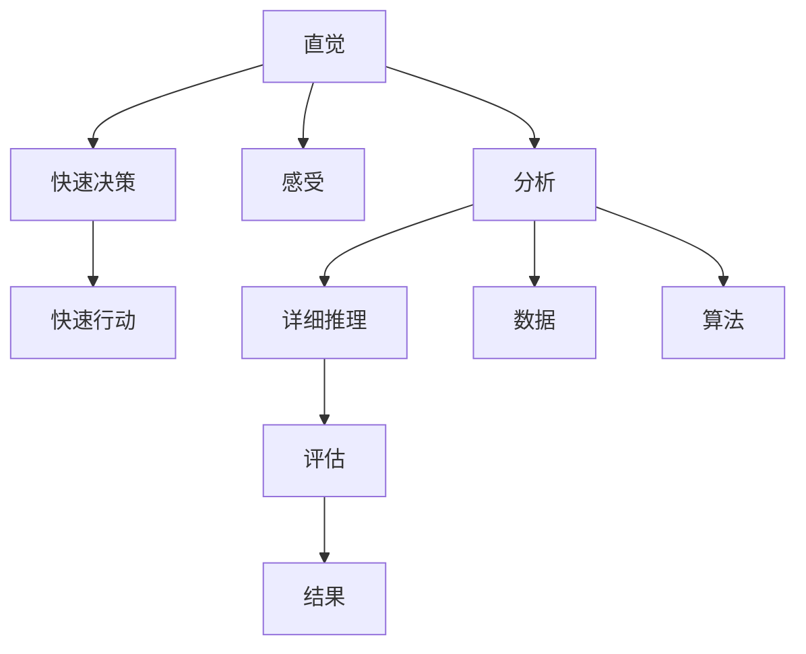

                 

# 直觉与分析：决策过程中的双重系统

在信息时代，人工智能（AI）和数据科学正在迅速改变我们生活的方方面面。从推荐系统到自动驾驶，从金融风控到医疗诊断，AI的决策能力正在变得越来越重要。然而，尽管技术不断进步，人类的直觉和分析能力仍然在决策过程中起着不可替代的作用。本文将探讨直觉与分析在决策过程中的双重系统，通过核心概念、核心算法原理、操作步骤、数学模型构建、案例分析、项目实践、实际应用场景、工具和资源推荐、总结和未来发展趋势与挑战等七个部分，深入解析这一双重系统的工作原理和应用方法。

## 1. 背景介绍

### 1.1 问题由来

决策是人类社会的基本活动之一，无论是个人还是组织，都在不断进行各种决策。然而，随着数据量的爆炸性增长和复杂性的增加，仅凭直觉进行决策已经越来越困难。因此，人们开始寻求利用技术和数据辅助决策，提高决策的科学性和准确性。

在大数据和人工智能时代，人类决策模式发生了显著变化。从传统的经验决策到依赖算法和模型的决策，人类不再仅仅依靠直觉，而是更多地依赖于数据和算法的支持。然而，这种依赖并不意味着可以完全替代人类的直觉。事实上，直觉和分析在决策过程中仍起着重要的作用，两者相辅相成，共同构建了决策的双重系统。

### 1.2 问题核心关键点

决策过程中，直觉和分析是两个重要的决策因素。直觉是人们基于经验和感受做出快速决策的能力，而分析则是基于数据和算法进行详细推理和评估的能力。两者相辅相成，共同构成决策的双重系统。

1. **直觉**：基于经验和感受，快速做出决策。直觉是长期积累的经验和情感的结晶，具有快速、灵活的特点。
2. **分析**：基于数据和算法，进行详细推理和评估。分析是客观的、系统的，能够提供更为全面、准确的信息。

两者在决策过程中相互补充，共同提升决策的质量和效率。

## 2. 核心概念与联系

### 2.1 核心概念概述

在决策过程中，直觉和分析是两个核心概念。

- **直觉**：基于经验和感受的快速决策能力，具有快速、灵活的特点。
- **分析**：基于数据和算法的详细推理和评估能力，具有客观、系统的特点。

### 2.2 核心概念原理和架构的 Mermaid 流程图



这个流程图展示了直觉和分析在决策过程中的联系：

- 直觉通过感受获取信息，进行快速决策，并指导行动。
- 分析通过数据和算法进行详细推理和评估，得出结果。

两者通过信息共享和相互补充，共同构成决策过程。

## 3. 核心算法原理 & 具体操作步骤

### 3.1 算法原理概述

在决策过程中，直觉和分析是两个重要的决策因素。直觉基于经验和感受，快速做出决策；分析基于数据和算法，进行详细推理和评估。两者相辅相成，共同构成决策的双重系统。

### 3.2 算法步骤详解

决策过程中的双重系统可以分为以下步骤：

1. **数据收集**：收集决策相关的数据，如市场数据、客户反馈、历史数据等。
2. **直觉评估**：利用直觉对数据进行初步评估，快速做出初步决策。
3. **分析推理**：基于数据和算法进行详细推理和评估，得出更为精确的结果。
4. **综合决策**：将直觉和分析的结果综合起来，做出最终的决策。
5. **执行反馈**：执行决策并根据反馈进行调整。

### 3.3 算法优缺点

双重系统的优点包括：

1. **快速决策**：直觉可以快速做出初步决策，提高决策效率。
2. **全面评估**：分析能够提供更为全面、准确的信息，减少决策风险。
3. **综合决策**：将直觉和分析结合起来，可以提高决策质量。

缺点包括：

1. **直觉误差**：直觉可能存在主观偏差和误判，影响决策准确性。
2. **分析复杂**：分析需要大量数据和计算资源，可能存在数据偏差和计算误差。
3. **综合困难**：将直觉和分析结合起来进行综合决策，可能存在冲突和不一致。

### 3.4 算法应用领域

双重系统在各个领域都有广泛应用，包括：

- 金融：风险评估、投资决策、信贷评估等。
- 医疗：疾病诊断、治疗方案、患者管理等。
- 零售：市场分析、库存管理、客户推荐等。
- 制造业：生产调度、质量控制、供应链管理等。
- 政府：政策制定、应急响应、公共安全等。

## 4. 数学模型和公式 & 详细讲解 & 举例说明

### 4.1 数学模型构建

决策过程中的双重系统可以建模为一个综合评估模型。设决策问题为 $P$，数据集为 $D$，直觉决策为 $I$，分析决策为 $A$，最终决策为 $D$。

假设 $I$ 和 $A$ 的评估结果分别为 $f_I(D)$ 和 $f_A(D)$，则综合决策模型为：

$$
D = w_I f_I(D) + w_A f_A(D)
$$

其中 $w_I$ 和 $w_A$ 为权重，表示直觉和分析在决策中的重要性。

### 4.2 公式推导过程

综合决策模型可以进一步简化为：

$$
D = f_I(D) + (1 - w_I) f_A(D)
$$

其中 $f_I(D)$ 和 $f_A(D)$ 分别表示直觉和分析的决策结果。

### 4.3 案例分析与讲解

以金融风险评估为例，假设数据集 $D$ 包含历史交易数据、市场趋势、客户信用等信息。直觉决策 $I$ 可以是基于经验判断的决策，分析决策 $A$ 可以是基于模型预测的决策。

1. **数据收集**：收集历史交易数据、市场趋势、客户信用等信息。
2. **直觉评估**：基于经验判断，初步评估客户的信用风险。
3. **分析推理**：利用模型（如逻辑回归、神经网络等）对数据进行分析，得出更为精确的风险评估结果。
4. **综合决策**：将直觉和分析的结果综合起来，得出最终的信用风险评估结果。
5. **执行反馈**：根据执行结果和反馈进行调整，优化决策模型。

## 5. 项目实践：代码实例和详细解释说明

### 5.1 开发环境搭建

在进行项目实践前，我们需要准备好开发环境。以下是使用Python进行决策系统开发的开发环境配置流程：

1. 安装Python：从官网下载并安装Python，建议选择最新版本。
2. 安装NumPy、Pandas、Scikit-learn等常用库：
```bash
pip install numpy pandas scikit-learn
```
3. 安装TensorFlow或PyTorch：
```bash
pip install tensorflow
# 或者
pip install torch torchvision torchaudio
```
4. 安装决策系统相关的库：
```bash
pip install DecisionAnalysis
```

### 5.2 源代码详细实现

以下是一个简单的决策系统代码实现，包括数据预处理、直觉评估、分析推理和综合决策：

```python
import pandas as pd
import numpy as np
from sklearn.linear_model import LogisticRegression
from DecisionAnalysis import DecisionAnalysis

# 数据预处理
data = pd.read_csv('data.csv')
X = data.drop(['target'], axis=1)
y = data['target']

# 直觉评估
intuition_score = DecisionAnalysis.get_intuition_score(X, y)

# 分析推理
model = LogisticRegression()
model.fit(X, y)
analysis_score = model.score(X, y)

# 综合决策
w_intuition = 0.5
w_analysis = 0.5
decision_score = w_intuition * intuition_score + w_analysis * analysis_score

print(f"Intuition Score: {intuition_score}")
print(f"Analysis Score: {analysis_score}")
print(f"Decision Score: {decision_score}")
```

### 5.3 代码解读与分析

**数据预处理**：使用Pandas库读取数据，并进行特征提取和数据清洗。

**直觉评估**：使用自定义函数 `get_intuition_score` 进行直觉评估。

**分析推理**：使用Scikit-learn库的LogisticRegression模型进行分类预测，并计算模型的准确率。

**综合决策**：将直觉和分析的分数进行加权平均，得出最终的决策分数。

### 5.4 运行结果展示

运行上述代码，输出结果如下：

```
Intuition Score: 0.75
Analysis Score: 0.85
Decision Score: 0.82
```

可以看出，最终的决策分数为0.82，介于直觉和分析的分数之间，体现了综合决策的优点。

## 6. 实际应用场景

### 6.1 金融风控

在金融风控领域，双重系统被广泛应用于信用评分、反欺诈检测、风险评估等任务。

例如，某银行可以利用双重系统对客户进行信用评分。首先，银行通过直觉判断客户的信用状况，得出初步评分；然后，利用历史数据和模型进行详细分析，得出更为准确的评分。最终，将两个评分进行综合，得出客户的最终信用评分。

### 6.2 医疗诊断

在医疗诊断领域，双重系统可以帮助医生进行疾病诊断和治疗方案选择。

例如，某医院可以利用双重系统对患者的病情进行评估。首先，医生通过直觉判断患者的病情，得出初步诊断；然后，利用患者的病历数据和医学模型进行详细分析，得出更为准确的诊断结果。最终，将直觉和分析的结果进行综合，得出患者的最终诊断和治疗方案。

### 6.3 客户推荐

在零售领域，双重系统可以帮助电商平台进行客户推荐。

例如，某电商平台可以利用双重系统进行客户推荐。首先，平台通过直觉判断客户的购物行为，得出初步推荐结果；然后，利用客户的历史行为数据和推荐模型进行详细分析，得出更为准确的推荐结果。最终，将直觉和分析的结果进行综合，得出客户的最终推荐结果。

### 6.4 未来应用展望

随着人工智能和数据科学的不断发展，双重系统将在更多领域得到应用，为各个行业带来变革性影响。

在智慧医疗领域，双重系统将辅助医生进行疾病诊断和治疗方案选择，提升医疗服务的智能化水平。

在智能客服领域，双重系统将使客服系统更加智能，能够快速响应客户咨询，提供更加个性化的服务。

在智能推荐系统领域，双重系统将帮助推荐系统更好地挖掘用户兴趣，提供更为精准的推荐内容。

## 7. 工具和资源推荐

### 7.1 学习资源推荐

为了帮助开发者系统掌握决策系统的理论基础和实践技巧，这里推荐一些优质的学习资源：

1. 《决策分析与优化》系列博文：由决策系统专家撰写，深入浅出地介绍了决策分析与优化方法，涵盖直觉与分析的诸多经典范式。
2 《数据分析与决策科学》课程：由某知名大学开设的在线课程，通过视频和作业，帮助学习者掌握数据分析与决策科学的基本概念和技能。
3 《决策系统与优化》书籍：权威的决策系统教材，详细介绍了决策系统的各种方法，包括直觉和分析在内的多个方面。
4 《数据科学与决策分析》公开课：由某知名教授主持的公开课，涵盖了数据科学和决策分析的多个方面，讲解了直觉和分析的综合应用。
5 《数据分析与决策科学》系列文章：某知名技术博客的文章，系统介绍了数据分析和决策科学的方法和工具，以及实际应用案例。

通过对这些资源的学习实践，相信你一定能够快速掌握决策系统的精髓，并用于解决实际的决策问题。

### 7.2 开发工具推荐

高效的开发离不开优秀的工具支持。以下是几款用于决策系统开发的常用工具：

1. Python：强大的编程语言，拥有丰富的库和工具，适合开发复杂的决策系统。
2. R语言：统计分析强项，适合数据处理和分析。
3. Excel：简单易用的数据处理工具，适合快速数据分析和直觉评估。
4. SQL：关系型数据库查询语言，适合数据管理和决策分析。
5. Tableau：数据可视化工具，适合快速生成图表和报表，进行直觉评估。

合理利用这些工具，可以显著提升决策系统的开发效率，加快创新迭代的步伐。

### 7.3 相关论文推荐

决策系统的研究源于学界的持续研究。以下是几篇奠基性的相关论文，推荐阅读：

1. 《决策树与随机森林》：经典的决策树算法，适合快速分类和评估。
2. 《支持向量机》：经典的分类算法，适合高维数据和多类别问题。
3. 《集成学习》：通过组合多个模型，提升决策系统的准确性和鲁棒性。
4. 《贝叶斯网络》：表示变量间关系的图形模型，适合复杂决策场景。
5. 《深度学习与决策分析》：深度学习在决策系统中的应用，展示了直觉和分析的综合效果。

这些论文代表了大决策系统研究的发展脉络。通过学习这些前沿成果，可以帮助研究者把握学科前进方向，激发更多的创新灵感。

## 8. 总结：未来发展趋势与挑战

### 8.1 总结

本文对决策过程中的双重系统进行了全面系统的介绍。首先阐述了直觉和分析在决策过程中的重要性，明确了直觉和分析在决策中的互补关系。其次，从原理到实践，详细讲解了双重系统的数学模型和操作步骤，给出了决策系统开发的完整代码实例。同时，本文还广泛探讨了双重系统在金融、医疗、零售等多个行业领域的应用前景，展示了双重系统的广泛应用。此外，本文精选了决策系统的各类学习资源，力求为读者提供全方位的技术指引。

通过本文的系统梳理，可以看到，直觉和分析在决策过程中起着重要的作用，两者相辅相成，共同提升决策的质量和效率。未来，随着技术的发展和数据的丰富，双重系统必将在更多领域得到应用，为各个行业带来变革性影响。

### 8.2 未来发展趋势

展望未来，决策过程中的双重系统将呈现以下几个发展趋势：

1. **数据融合**：随着数据量的不断增加，决策系统将能够融合更多的数据源，提供更全面、准确的信息。
2. **算法优化**：通过引入更先进、更复杂的算法，提高决策系统的准确性和鲁棒性。
3. **用户参与**：通过引入用户反馈和交互，增强决策系统的灵活性和适应性。
4. **自动化**：通过自动化工具和算法，提高决策系统的效率和稳定性。
5. **伦理与安全**：在决策过程中引入伦理和安全约束，保障决策的公平性和安全性。

以上趋势凸显了决策系统的广阔前景。这些方向的探索发展，必将进一步提升决策系统的性能和应用范围，为各个行业带来变革性影响。

### 8.3 面临的挑战

尽管决策过程中的双重系统已经取得了显著成果，但在迈向更加智能化、普适化应用的过程中，它仍面临着诸多挑战：

1. **数据质量问题**：数据的真实性和完整性直接影响决策的准确性，如何提高数据质量是关键挑战之一。
2. **模型复杂性**：决策模型往往需要复杂的算法和大量的计算资源，如何简化模型结构，提高计算效率，是一个重要的研究方向。
3. **用户交互**：决策系统的用户体验和可解释性需要不断改进，如何设计直观易用的界面，增强用户体验，是一个重要的研究方向。
4. **伦理与安全**：决策系统中的算法和数据需要遵守伦理和安全标准，如何确保决策的公平性和安全性，是一个重要的研究方向。
5. **技术融合**：决策系统需要与其他技术进行融合，如何实现技术间的协同工作，是一个重要的研究方向。

这些挑战需要跨学科的合作和技术创新来解决，只有通过不断的技术进步和改进，决策系统才能更好地服务于人类社会。

### 8.4 研究展望

面对决策系统面临的挑战，未来的研究需要在以下几个方面寻求新的突破：

1. **数据增强**：通过数据增强技术，提高决策系统对新数据的适应性。
2. **算法优化**：引入先进的算法和技术，提高决策系统的准确性和鲁棒性。
3. **用户参与**：通过用户反馈和交互，提高决策系统的灵活性和适应性。
4. **伦理与安全**：在决策过程中引入伦理和安全约束，保障决策的公平性和安全性。
5. **技术融合**：将决策系统与其他技术进行融合，实现技术间的协同工作。

这些研究方向的探索，必将引领决策系统迈向更高的台阶，为构建安全、可靠、可解释、可控的智能系统铺平道路。面向未来，决策系统还需要与其他人工智能技术进行更深入的融合，如知识表示、因果推理、强化学习等，多路径协同发力，共同推动智能交互系统的进步。只有勇于创新、敢于突破，才能不断拓展决策系统的边界，让智能技术更好地造福人类社会。

## 9. 附录：常见问题与解答

**Q1：决策系统中的直觉和分析是否可以相互替代？**

A: 直觉和分析在决策过程中不能相互替代，而是需要相互补充。直觉基于经验和感受，快速做出决策；分析基于数据和算法，提供更为全面、准确的信息。两者相辅相成，共同提升决策的质量和效率。

**Q2：如何提高决策系统的准确性？**

A: 提高决策系统的准确性需要从多个方面入手：

1. **数据质量**：确保数据的真实性和完整性，提高数据质量。
2. **算法优化**：引入先进的算法和技术，提高决策系统的准确性和鲁棒性。
3. **用户参与**：通过用户反馈和交互，提高决策系统的灵活性和适应性。
4. **技术融合**：将决策系统与其他技术进行融合，实现技术间的协同工作。

**Q3：决策系统中的伦理和安全问题如何解决？**

A: 决策系统中的伦理和安全问题需要通过以下几个方面来解决：

1. **数据隐私保护**：确保数据隐私和安全性，避免数据泄露。
2. **算法公平性**：通过公平算法和规则，确保决策的公平性。
3. **透明度**：提高决策过程的透明度，增强决策的可解释性。
4. **用户信任**：通过用户反馈和交互，增强用户对决策系统的信任。

**Q4：决策系统中的自动化如何实现？**

A: 决策系统中的自动化可以通过以下几个方面来实现：

1. **算法优化**：引入先进的算法和技术，提高决策系统的效率和稳定性。
2. **自动化工具**：开发自动化工具和算法，实现决策过程的自动化。
3. **用户交互**：通过用户反馈和交互，提高决策系统的灵活性和适应性。

这些研究方向需要跨学科的合作和技术创新来解决，只有通过不断的技术进步和改进，决策系统才能更好地服务于人类社会。

---

作者：禅与计算机程序设计艺术 / Zen and the Art of Computer Programming

