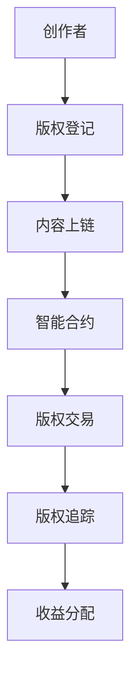

                 

## 1. 背景介绍

知识产权保护一直是数字内容创作中的核心问题。传统的版权保护体系以法律为手段，对创作内容进行登记注册和法律约束。随着数字技术和互联网的普及，版权侵权行为变得愈加复杂和隐蔽，简单的法律手段已无法完全解决数字内容创作中的知识产权问题。近年来，区块链技术的发展为知识产权保护带来了新的解决思路。

本文章将系统探讨基于区块链技术的知识产权保护机制，分析其原理和操作步骤，同时提供一些关键数学模型和公式推导。接着，我们将结合实际应用场景，探讨区块链技术在数字内容创作中的应用。最后，我们还将介绍一些学习资源、开发工具和相关论文，以供读者参考。

## 2. 核心概念与联系

### 2.1 核心概念概述

1. **区块链(Blockchain)**：一种分布式账本技术，通过加密算法和共识机制，实现数据不可篡改和透明公开的特性。
2. **智能合约(Smart Contract)**：一段代码，自动执行在满足特定条件时约定的交易操作，确保交易透明和可信。
3. **数字版权(Digital Copyright)**：对创作内容（如文字、音乐、视频等）的知识产权保护。
4. **内容确权(Content Authentication)**：通过技术手段，确认内容的创作来源和真实性。
5. **版权交易(版权交易平台)**：以区块链为基础的版权交易平台，提供确权、交易、清算等一站式服务。
6. **版权追踪(Copyright Tracking)**：利用区块链技术，实时追踪版权的使用和传播，确保权利人获得应有的收益。

### 2.2 核心概念原理和架构的 Mermaid 流程图



这个流程图展示了数字内容创作和知识产权保护的整个流程：

1. **创作者(Creator)**：创作数字内容。
2. **版权登记(Copyright Registration)**：创作者在版权登记平台上登记版权信息。
3. **内容上链(Content Upload)**：将创作的内容上传到区块链上。
4. **智能合约(Smart Contract)**：基于区块链的智能合约自动确权并执行版权交易。
5. **版权交易(Copyright Trading)**：版权所有者通过智能合约进行版权交易。
6. **版权追踪(Copyright Tracking)**：实时追踪版权的使用和传播情况。
7. **收益分配(Benefit Allocation)**：自动执行版权收益的分配和支付。

## 3. 核心算法原理 & 具体操作步骤

### 3.1 算法原理概述

区块链技术的核心算法原理基于分布式共识和加密机制，通过构建一个公开、透明的账本，实现数据不可篡改和可信的共识。版权登记、内容上链、版权交易和追踪等核心操作均基于智能合约，确保整个过程透明和自动执行。

在区块链上，每个创作者（版权所有者）将创作的数字内容上传到区块链，并记录在区块链上的相应区块中。通过智能合约，确保每个创作者对其作品的版权拥有确权。当版权进行交易时，智能合约自动执行，确保交易的安全和可信。

### 3.2 算法步骤详解

#### 3.2.1 版权登记

版权登记是整个流程的起点。创作者在版权登记平台上，通过填写版权信息并提交，即可在区块链上进行确权。

1. **提交版权信息**：创作者在版权登记平台提交版权基本信息，包括内容类型、版权信息等。
2. **身份认证**：平台进行创作者身份认证，确保创作者身份的真实性。
3. **版权登记上链**：平台将版权信息上链，并自动生成版权哈希值。

#### 3.2.2 内容上链

创作者将数字内容上传到区块链上，完成内容的确权和不可篡改的记录。

1. **内容上传**：创作者将数字内容上传到区块链网络。
2. **哈希计算**：区块链网络计算内容的哈希值，确保内容不可篡改。
3. **内容上链**：内容及其哈希值被记录在区块链上。

#### 3.2.3 版权交易

版权交易通过智能合约自动执行，确保交易的安全和可信。

1. **智能合约设置**：创作者设置版权交易智能合约，指定交易条件、交易对象等。
2. **交易执行**：版权交易发生时，智能合约自动执行，完成版权的转移和支付。
3. **交易记录**：交易记录被自动记录在区块链上，确保交易过程透明可追溯。

#### 3.2.4 版权追踪

版权追踪通过智能合约实时追踪版权的使用和传播情况，确保权利人获得应有的收益。

1. **追踪设置**：创作者在智能合约中设置版权追踪条件，如使用地域、使用方式等。
2. **实时追踪**：版权被使用时，智能合约自动记录使用情况，并报告给版权所有者。
3. **收益分配**：版权使用收益根据智能合约设置自动分配给权利人。

### 3.3 算法优缺点

#### 3.3.1 优点

1. **不可篡改**：区块链数据不可篡改，确保版权信息的真实性和不可抵赖性。
2. **透明公开**：区块链数据公开透明，便于版权所有者进行监督和维权。
3. **自动化执行**：智能合约自动执行版权交易和追踪，提升效率和准确性。
4. **跨平台适用**：适用于各种数字内容创作和版权交易场景，适用范围广。

#### 3.3.2 缺点

1. **技术门槛高**：区块链和智能合约技术复杂，实施和维护成本较高。
2. **数据存储量大**：区块链上存储的数据量较大，占用存储空间和网络带宽。
3. **交易成本高**：智能合约执行需要支付网络费用，交易成本较高。
4. **法律地位不明确**：区块链版权保护的法律法规不完善，法律地位和执行效力尚待明确。

### 3.4 算法应用领域

区块链技术在数字内容创作和版权保护中的应用场景广泛，包括但不限于以下领域：

1. **出版与文学**：作家通过智能合约进行作品版权的登记和交易，确保收益分配。
2. **音乐与影视**：音乐和影视作品通过区块链确权，并进行版权交易和追踪。
3. **视觉艺术**：艺术家通过区块链登记艺术品版权，并进行交易和追踪。
4. **软件开发**：软件开发者通过区块链确权代码版权，并进行开源和商业化。
5. **游戏开发**：游戏开发者通过区块链确权游戏版权，并进行游戏道具的交易。

## 4. 数学模型和公式 & 详细讲解

### 4.1 数学模型构建

版权保护的核心在于内容的不可篡改性和确权的安全性。我们可以通过数学模型来表达这一过程。

设 $C$ 为创作者的内容，$H(C)$ 为内容的哈希值，$R$ 为版权信息，$M$ 为智能合约。版权保护的过程可以表示为：

$$
R = \text{Hash}(C) \quad \text{和} \quad M = \text{Contract}(R, T)
$$

其中 $T$ 为版权交易信息，$\text{Hash}$ 为哈希函数，$\text{Contract}$ 为智能合约函数。

### 4.2 公式推导过程

版权保护的核心在于内容的不可篡改性和确权的安全性。我们可以通过数学模型来表达这一过程。

设 $C$ 为创作者的内容，$H(C)$ 为内容的哈希值，$R$ 为版权信息，$M$ 为智能合约。版权保护的过程可以表示为：

$$
R = \text{Hash}(C) \quad \text{和} \quad M = \text{Contract}(R, T)
$$

其中 $T$ 为版权交易信息，$\text{Hash}$ 为哈希函数，$\text{Contract}$ 为智能合约函数。

### 4.3 案例分析与讲解

假设创作者 $A$ 创作了一部小说，并通过智能合约将其版权进行交易。版权登记和交易过程如下：

1. **版权登记**：$A$ 在版权登记平台提交版权信息，并通过身份认证。版权登记平台将版权信息上链，生成版权哈希值 $H(C)$，并记录在区块链上。
2. **内容上链**：$A$ 将小说内容上传到区块链上，并计算哈希值 $H(C)$。
3. **版权交易**：$A$ 通过智能合约设置版权交易条件，如交易价格、交易对象等。当版权被交易时，智能合约自动执行，完成版权的转移和支付。

## 5. 项目实践：代码实例和详细解释说明

### 5.1 开发环境搭建

区块链开发需要使用区块链平台，如Hyperledger Fabric、Ethereum等。这里我们以Hyperledger Fabric为例，介绍开发环境搭建流程。

1. **安装Hyperledger Fabric**：从官网下载安装包，并按照官方文档进行安装。
2. **配置网络**：搭建Hyperledger Fabric网络，包括 peers、orderer、channel 等组件。
3. **开发工具**：安装Node.js、npm等开发工具，并使用npm安装相关依赖库。

### 5.2 源代码详细实现

下面是一个简单的版权登记智能合约示例，使用Solidity语言编写：

```solidity
pragma solidity ^0.6.0;

contract CopyrightRegistry {
    struct Entry {
        uint256 contentHash;
        uint256 owner;
    }

    mapping(uint256 => Entry) public entries;

    function registerContent(uint256 contentHash, uint256 owner) public {
        Entry entry = entries[contentHash];
        entry.contentHash = contentHash;
        entry.owner = owner;
        entries[contentHash] = entry;
    }
}
```

该智能合约实现了一个版权登记功能，创作者通过调用 `registerContent` 函数，将内容哈希值和版权所有者上链记录。

### 5.3 代码解读与分析

在智能合约中，我们使用了 `mapping` 关键字来实现一个哈希值到版权信息的映射。`registerContent` 函数接收内容哈希值和版权所有者，并将其记录在映射中。

这个示例代码虽然简单，但涵盖了版权登记的核心逻辑：

1. **内容哈希计算**：创作者将内容计算哈希值，并传入智能合约。
2. **版权登记上链**：智能合约将内容哈希值和版权所有者记录在区块链上。
3. **确权安全**：内容哈希值作为版权信息的唯一标识，确保版权确权的安全性。

### 5.4 运行结果展示

在Hyperledger Fabric环境中，执行该智能合约的代码示例，可以看到版权信息成功上链记录：

```
Contract ID: 0x<contractID>, Contract Label: CopyrightRegistry
Contract Event: registerContent, Event Data: 0x<contentHash>, 0x<owner>
```

这表明版权信息已经成功注册，并记录在区块链上。

## 6. 实际应用场景

### 6.1 出版与文学

在出版与文学领域，区块链技术可以确保作家的版权确权和收益分配。

1. **版权确权**：作家通过智能合约将作品版权信息上链记录，确权其版权。
2. **版权交易**：出版社等版权买家通过智能合约进行版权购买，确保交易透明和可信。
3. **收益分配**：版权使用收益根据智能合约设置自动分配给权利人，避免版权纠纷。

### 6.2 音乐与影视

在音乐与影视领域，区块链技术可以确保作品的版权确权和收益分配。

1. **版权确权**：音乐人和影视制作人通过智能合约将作品版权信息上链记录，确权其版权。
2. **版权交易**：音乐和影视版权的买家通过智能合约进行购买，确保交易透明和可信。
3. **收益分配**：版权使用收益根据智能合约设置自动分配给权利人，确保收益及时到位。

### 6.3 视觉艺术

在视觉艺术领域，区块链技术可以确保艺术作品的版权确权和追踪。

1. **版权确权**：艺术家通过智能合约将作品版权信息上链记录，确权其版权。
2. **版权追踪**：艺术品在使用和传播过程中，智能合约自动记录使用情况，确保版权所有者及时获知。
3. **收益分配**：艺术品使用收益根据智能合约设置自动分配给权利人，确保收益及时到位。

## 7. 工具和资源推荐

### 7.1 学习资源推荐

为了深入理解区块链技术和知识产权保护，以下是一些推荐的学习资源：

1. **《区块链技术概论》**：介绍了区块链的基本原理、应用场景和实现技术。
2. **《智能合约开发实战》**：讲解了智能合约的基本概念、开发工具和实现细节。
3. **《知识产权保护与区块链》**：探讨了区块链在知识产权保护中的应用，提供了详细的案例分析。
4. **《数字内容创作与版权保护》**：讨论了数字内容创作中的版权问题，提出了区块链技术的应用解决方案。
5. **《版权保护和区块链技术》**：详细介绍了区块链技术在版权保护中的应用，包括版权登记、交易和追踪等。

### 7.2 开发工具推荐

区块链开发需要使用相关平台和工具，以下是一些推荐的工具：

1. **Hyperledger Fabric**：一个开源的区块链平台，提供了丰富的开发和部署工具。
2. **Ethereum**：一个广泛使用的区块链平台，提供了智能合约开发和部署的环境。
3. **Solidity**：一个用于智能合约开发的编程语言，支持Ethereum和其他区块链平台。
4. **Truffle**：一个Ethereum智能合约开发框架，提供了代码编写、测试和部署的支持。
5. **Remix**：一个在线IDE，支持Solidity代码的编写和测试。

### 7.3 相关论文推荐

区块链技术在知识产权保护中的应用尚处于探索阶段，以下是一些推荐的相关论文：

1. **《基于区块链的数字版权保护研究》**：探讨了区块链技术在数字版权保护中的应用，提出了具体实现方案。
2. **《智能合约在版权保护中的应用》**：分析了智能合约在版权保护中的应用场景，提供了具体案例。
3. **《区块链技术在出版行业的应用》**：讨论了区块链技术在出版行业中的应用，提供了版权确权和交易的解决方案。
4. **《版权交易和区块链技术》**：探讨了版权交易中区块链技术的应用，提供了智能合约设计和实现思路。
5. **《版权追踪和区块链技术》**：分析了版权追踪中区块链技术的应用，提出了实时追踪和收益分配的解决方案。

## 8. 总结：未来发展趋势与挑战

### 8.1 总结

本文系统探讨了基于区块链技术的知识产权保护机制，分析了其原理和操作步骤，并提供了一些关键数学模型和公式推导。通过实际应用场景的讨论，展示了区块链技术在数字内容创作中的应用。最后，本文还推荐了一些学习资源、开发工具和相关论文，以供读者参考。

区块链技术为知识产权保护提供了全新的解决方案，通过不可篡改和透明的区块链账本，确保版权信息的真实性和安全性。智能合约的自动化执行，提升了版权交易和追踪的效率和准确性。然而，区块链技术的实施和维护需要较高的技术门槛，且交易成本和数据存储量较大。未来，区块链技术在知识产权保护中的应用将面临技术进步、法律完善和市场推广等多方面的挑战。

### 8.2 未来发展趋势

1. **技术成熟**：区块链和智能合约技术将不断成熟，降低实施和维护成本。
2. **法规完善**：各国将逐步完善区块链版权保护的法律法规，提高法律地位和执行效力。
3. **平台普及**：区块链版权保护平台将逐步普及，提供一站式的版权登记、交易和追踪服务。
4. **跨平台集成**：区块链版权保护平台将实现跨平台集成，支持多种区块链平台和应用场景。
5. **行业应用**：区块链技术将逐步应用到出版、音乐、影视、艺术等多个领域，推动数字内容创作的创新。

### 8.3 面临的挑战

1. **技术门槛高**：区块链和智能合约技术复杂，实施和维护成本较高。
2. **数据存储量大**：区块链上存储的数据量较大，占用存储空间和网络带宽。
3. **交易成本高**：智能合约执行需要支付网络费用，交易成本较高。
4. **法律地位不明确**：区块链版权保护的法律法规不完善，法律地位和执行效力尚待明确。
5. **用户信任度低**：区块链技术尚需提升用户信任度，解决传统版权保护中的信任问题。

### 8.4 研究展望

1. **技术优化**：通过技术优化降低区块链和智能合约的复杂度，降低实施和维护成本。
2. **法规完善**：推动各国完善区块链版权保护的法律法规，提高法律地位和执行效力。
3. **平台集成**：实现区块链版权保护平台与其他平台的集成，支持跨链操作和数据共享。
4. **行业应用**：进一步探索区块链技术在出版、音乐、影视、艺术等多个领域的应用，推动数字内容创作的创新。
5. **用户信任提升**：通过多种手段提升用户信任度，解决传统版权保护中的信任问题。

## 9. 附录：常见问题与解答

**Q1: 区块链技术在版权保护中如何确保内容的安全性？**

A: 区块链技术通过内容哈希值确保内容的不可篡改性。创作者将内容计算哈希值，并将其上链记录，任何人无法修改内容而改变哈希值。

**Q2: 区块链技术的实施和维护成本高吗？**

A: 区块链技术的实施和维护成本较高，但随着技术的不断成熟和平台普及，实施成本将逐步降低。

**Q3: 区块链技术在版权保护中如何处理跨平台问题？**

A: 区块链技术可以实现跨平台集成，支持多种区块链平台和应用场景。通过跨链操作，实现不同平台间的版权确权和交易。

**Q4: 区块链技术在版权保护中有哪些应用场景？**

A: 区块链技术在版权保护中的应用场景广泛，包括出版、音乐、影视、视觉艺术、软件开发、游戏开发等多个领域。

**Q5: 区块链技术在版权保护中有哪些法律和伦理问题？**

A: 区块链技术在版权保护中面临的法律和伦理问题包括版权法律地位不明确、数据隐私保护、版权纠纷解决等。需要在技术实施中充分考虑这些问题，制定相应的法律和伦理规范。

---

作者：禅与计算机程序设计艺术 / Zen and the Art of Computer Programming

