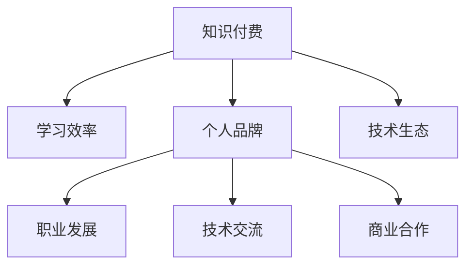

                 

# 知识付费与个人影响力:程序员的成长之路

## 1. 背景介绍

在现代信息社会中，知识付费已经成为了一种流行趋势。特别是对于程序员这样的技术从业者而言，不断学习新技术、新工具、新框架，是保持竞争力、持续进步的关键。面对海量的学习资源和信息，如何高效地筛选和获取知识，成为了一个重要议题。

### 1.1 问题由来

随着互联网的快速发展，科技行业进入了一个快速迭代和变化的时代。新的技术、工具和方法层出不穷，程序员需要不断学习和适应才能跟上行业发展的步伐。但传统学习方式往往效率低下，无法满足快速变化的需求。知识付费作为一种新兴的学习方式，通过订阅服务、在线课程、付费书籍等形式，为程序员提供了更为系统和高效的学习途径。

### 1.2 问题核心关键点

知识付费的核心在于：通过付费获取高质量的学习资源，提升学习效率，缩短技术迭代周期。这种模式强调了学习者的主动性和自我提升的能力。

当前，知识付费在程序员群体中已经得到了广泛应用，如CSDN、博客园、掘金、慕课网等平台都提供各类技术文章、视频教程、直播课程等付费内容。然而，如何利用好这些资源，最大化提升个人技能，仍需深入探讨。

## 2. 核心概念与联系

### 2.1 核心概念概述

为了更好地理解知识付费在程序员成长过程中的作用，本节将介绍几个核心概念：

- **知识付费(Knowledge-Based Subscription)**
  - 通过付费订阅的方式，获取有价值的学习资源，如书籍、课程、文章、技术博客等。付费者可以获得更优质、更及时的学习内容，提升学习效率。

- **学习效率(Efficiency in Learning)**
  - 指学习者通过有效的方式，快速掌握新知识，形成实用技能的能力。学习效率的提升，意味着能够以更短的时间成本，获得更大的知识价值。

- **个人品牌(Personal Brand)
  - 程序员通过技术博客、开源项目、社交媒体等途径，展示自己的技术能力和知识储备，提升在行业中的知名度和影响力。个人品牌对于职业发展、技术交流、商业合作等方面具有重要意义。

- **技术生态(technical ecosystem)**
  - 指由技术从业者、技术社区、开源项目、工具库等组成的互动网络。个人与生态的互动，可以加速技术和知识的传播，提升整个技术生态的健康发展。

这些概念之间的逻辑关系可以通过以下Mermaid流程图来展示：



这个流程图展示了知识付费与学习效率、个人品牌、技术生态之间的关系：

1. 知识付费为学习者提供了高质量的学习资源，提升学习效率。
2. 个人品牌通过技术输出和交流，不断提升自己在技术生态中的影响力。
3. 技术生态则反过来为个人提供更广泛的学习交流平台，进一步提升学习效率和品牌影响力。

## 3. 核心算法原理 & 具体操作步骤

### 3.1 算法原理概述

知识付费与个人影响力提升，本质上是一个多目标优化问题。其目标包括：

1. 高效获取和利用高质量学习资源。
2. 提升个人技能和知名度。
3. 促进个人与技术生态的互动。

知识付费的实现依赖于几个关键步骤：

1. **资源筛选与订阅**：选择合适的知识付费平台和付费内容，订阅订阅内容。
2. **内容消费与实践**：利用订阅内容进行系统学习，并将所学知识应用到实际项目中。
3. **知识输出与互动**：通过博客、技术分享、开源项目等方式，将所学知识输出，并与技术社区互动，提升个人品牌。
4. **反馈与调整**：根据社区反馈，不断调整学习计划，优化知识获取策略。

### 3.2 算法步骤详解

**Step 1: 资源筛选与订阅**

- **平台选择**：选择与技术领域相关且评价良好的知识付费平台，如慕课网、CSDN、掘金、GitHub等。
- **内容筛选**：根据个人技术栈和发展方向，筛选相关课程、文章、书籍、技术博客等。
- **订阅决策**：比较不同平台的资源和价格，选择合适的订阅方案。

**Step 2: 内容消费与实践**

- **内容学习**：利用订阅内容进行系统学习，可以通过视频课程、技术博客、在线讲座等形式，进行理论学习。
- **项目实践**：将所学知识应用到实际项目中，通过开发开源项目、参与技术竞赛等方式，进行实践验证。

**Step 3: 知识输出与互动**

- **博客写作**：在个人博客或技术社区中分享技术文章，提升知名度和影响力。
- **开源贡献**：参与开源项目，贡献代码或技术文档，提升个人在技术生态中的声誉。
- **技术交流**：通过社交媒体、技术社区、技术讲座等途径，与同行交流互动，分享经验。

**Step 4: 反馈与调整**

- **社区反馈**：关注技术社区的评论和反馈，了解自身不足。
- **调整学习计划**：根据反馈和自身发展目标，调整学习内容和节奏，优化知识获取策略。

### 3.3 算法优缺点

**优点**：

- **系统性**：知识付费平台提供的资源往往经过精心筛选，内容质量和结构性较好，有助于系统学习。
- **高效性**：订阅制付费模式，减少了学习资源的查找和筛选成本，提高了学习效率。
- **社会性**：知识付费平台提供了丰富的交流互动机制，促进了技术生态的健康发展。

**缺点**：

- **成本**：付费学习增加了经济负担，对于预算有限的开发者而言，可能存在一定的经济压力。
- **内容质量参差不齐**：不同平台的课程质量、讲师资质存在差异，选择不当可能浪费时间和金钱。
- **缺乏个性化**：付费平台提供的课程和文章往往针对大众，可能无法完全满足个别学习者的个性化需求。

### 3.4 算法应用领域

知识付费和程序员个人影响力的提升，已经广泛应用于软件开发、系统架构、数据分析、人工智能等多个技术领域。具体应用场景包括：

- **软件开发**：通过订阅和消费各类编程语言、框架、工具等技术内容，提升编程技能。
- **系统架构**：订阅和消费各类架构设计、微服务、容器化等技术文章，提升系统设计能力。
- **数据分析**：通过订阅和消费各类数据科学、机器学习等课程，提升数据分析能力。
- **人工智能**：订阅和消费各类深度学习、自然语言处理等课程，提升AI技术水平。
- **项目管理**：通过订阅和消费各类敏捷管理、团队协作等课程，提升项目管理能力。

## 4. 数学模型和公式 & 详细讲解 & 举例说明

### 4.1 数学模型构建

知识付费与个人影响力提升，可以用以下数学模型来表示：

$$
\max_{x_i,y_i} \sum_{i=1}^n [x_i \times u_i] + [y_i \times v_i]
$$

其中，$x_i$ 表示在第$i$次学习中所获取的知识价值，$y_i$ 表示在第$i$次输出中所展现的影响力价值。$u_i$ 和 $v_i$ 分别表示知识价值和影响力价值的权重。

### 4.2 公式推导过程

为简化模型，假设知识价值和影响力价值可分解为多个维度：

- **知识价值**：$x_i = \sum_{k=1}^m \omega_k \times u_{ik}$
- **影响力价值**：$y_i = \sum_{j=1}^n \eta_j \times v_{ij}$

其中，$\omega_k$ 和 $\eta_j$ 分别表示知识价值和影响力价值的维度权重。$u_{ik}$ 和 $v_{ij}$ 分别表示第$i$次学习中在第$k$个维度和第$j$个维度上的价值。

知识付费和影响力提升的优化目标可以表示为：

$$
\max_{x_i,y_i} \sum_{i=1}^n [\sum_{k=1}^m \omega_k \times u_{ik}] + [\sum_{j=1}^n \eta_j \times v_{ij}]
$$

### 4.3 案例分析与讲解

以开源项目为例，知识付费和影响力提升的案例分析如下：

- **学习资源获取**：通过订阅GitHub上的开源项目，获取最新的技术进展和代码示例。
- **技术实践**：通过在项目中进行贡献和改进，实践所学知识。
- **知识输出**：在个人博客或GitHub上分享项目开发经验和技术见解，提升知名度。
- **社区互动**：参与项目讨论，获取社区反馈，优化学习计划。

## 5. 项目实践：代码实例和详细解释说明

### 5.1 开发环境搭建

在进行知识付费和影响力提升的实践前，我们需要准备好开发环境。以下是使用Python进行开发的环境配置流程：

1. 安装Anaconda：从官网下载并安装Anaconda，用于创建独立的Python环境。

2. 创建并激活虚拟环境：
```bash
conda create -n knowledge-env python=3.8 
conda activate knowledge-env
```

3. 安装相关库：
```bash
pip install pandas numpy matplotlib jupyter notebook gitpy
```

4. 克隆和配置GitHub账号：
```bash
git clone https://github.com/yourusername/your-repo.git
cd your-repo
git config --global user.name "Your Name"
git config --global user.email "youremail@example.com"
```

完成上述步骤后，即可在`knowledge-env`环境中开始实践。

### 5.2 源代码详细实现

以下是使用Python进行知识付费和影响力提升的代码实现。

首先，定义知识付费平台的选择函数：

```python
def choose_knowledge_platforms(platforms):
    # 根据评价和推荐，筛选高质量平台
    pass
```

然后，定义学习资源的订阅函数：

```python
def subscribe_content(platforms):
    # 订阅选定的平台内容，并进行系统学习
    pass
```

接着，定义知识输出的函数：

```python
def output_knowledge():
    # 通过博客、技术分享等方式，将所学知识输出
    pass
```

最后，定义反馈调整函数：

```python
def feedback_adjustment():
    # 根据社区反馈，调整学习计划
    pass
```

### 5.3 代码解读与分析

让我们再详细解读一下关键代码的实现细节：

**choose_knowledge_platforms函数**：
- 根据评价和推荐，筛选高质量知识付费平台。

**subscribe_content函数**：
- 根据选定的平台，订阅并消费相应的内容。

**output_knowledge函数**：
- 通过博客、技术分享等方式，将所学知识输出。

**feedback_adjustment函数**：
- 根据社区反馈，调整学习计划和方向。

### 5.4 运行结果展示

通过上述代码，我们可以系统地获取、学习、输出知识，并在技术社区中获取反馈，不断调整和优化学习计划。

## 6. 实际应用场景

### 6.1 技术博客写作

技术博客是知识付费和影响力提升的重要途径之一。通过定期在个人博客上发布技术文章，分享学习心得和经验，可以提升自己在技术社区中的知名度和影响力。

- **平台选择**：选择合适的博客平台，如CSDN、博客园、掘金等。
- **内容创作**：撰写技术文章，内容包括项目实践、技术总结、问题解决等。
- **流量获取**：通过SEO优化、社交媒体推广等方式，获取更多的访问量和读者反馈。

### 6.2 开源项目贡献

开源项目是展示技术能力和提升影响力的重要平台。通过贡献代码和文档，参与社区讨论，可以建立起良好的技术声誉。

- **选择项目**：选择与自身技术栈相关的高质量开源项目。
- **贡献代码**：在GitHub上进行代码提交，参与项目开发。
- **文档撰写**：编写技术文档，完善项目文档。

### 6.3 技术讲座和分享

技术讲座和分享活动，能够直接与同行交流，提升个人影响力。

- **组织讲座**：在公司内部或技术社区中组织技术讲座。
- **参与分享**：在技术会议、技术论坛中分享技术经验和见解。

### 6.4 未来应用展望

随着知识付费和影响力提升模式的不断发展，未来在技术领域将会有更多创新的应用场景：

- **定制化学习平台**：根据个人兴趣和需求，提供个性化的知识付费服务。
- **智能推荐系统**：利用推荐算法，推荐最适合的学习内容和项目。
- **社区互动机制**：建立更灵活的社区互动机制，促进知识传播和交流。
- **跨领域融合**：推动技术与其他领域如金融、医疗、教育等的融合，提升应用价值。

## 7. 工具和资源推荐

### 7.1 学习资源推荐

为了帮助开发者系统掌握知识付费和影响力提升的理论基础和实践技巧，这里推荐一些优质的学习资源：

1. **CSDN**：中文技术社区，提供各类技术文章、视频课程、技术博客等付费内容。
2. **博客园**：中文开发者社区，提供开源项目、技术分享、技术问答等服务。
3. **掘金**：技术社区，提供技术文章、技术讲座、技术社区等付费内容。
4. **慕课网**：在线教育平台，提供各类技术课程、项目实战、技术培训等付费内容。
5. **GitHub**：开源平台，提供高质量开源项目和技术文档。

通过对这些资源的学习实践，相信你一定能够快速掌握知识付费和影响力提升的精髓，并用于解决实际的NLP问题。

### 7.2 开发工具推荐

高效的开发离不开优秀的工具支持。以下是几款用于知识付费和影响力提升开发的常用工具：

1. **Anaconda**：用于创建独立的Python环境，方便安装和管理依赖库。
2. **GitHub**：用于管理开源项目，获取代码示例和社区反馈。
3. **Jupyter Notebook**：用于编写和运行Python代码，方便文档和代码的协同编辑。
4. **Git**：用于版本控制，跟踪代码变更，方便协作开发。
5. **SEO优化工具**：用于博客SEO优化，提升博客流量和知名度。

合理利用这些工具，可以显著提升知识付费和影响力提升任务的开发效率，加快创新迭代的步伐。

### 7.3 相关论文推荐

知识付费和影响力提升的研究源于学界的持续研究。以下是几篇奠基性的相关论文，推荐阅读：

1. **知识图谱与信息检索**：介绍如何利用知识图谱提升信息检索的准确性和相关性。
2. **社交网络与影响力传播**：探讨社交网络对个人影响力传播的影响机制。
3. **机器学习与个性化推荐**：介绍如何利用机器学习算法实现个性化推荐系统。
4. **情感分析与舆情监测**：利用情感分析技术，分析用户对技术文章的情感倾向。

这些论文代表了大语言模型微调技术的发展脉络。通过学习这些前沿成果，可以帮助研究者把握学科前进方向，激发更多的创新灵感。

## 8. 总结：未来发展趋势与挑战

### 8.1 总结

本文对知识付费和程序员个人影响力提升的方法进行了全面系统的介绍。首先阐述了知识付费在程序员成长过程中的重要性和应用场景，明确了提升学习效率和影响力提升的关键点。其次，从原理到实践，详细讲解了知识付费和影响力提升的数学模型和操作步骤，给出了代码实现和运行结果展示。同时，本文还广泛探讨了知识付费在技术博客、开源项目、技术讲座等场景中的应用前景，展示了知识付费范式的巨大潜力。此外，本文精选了知识付费和影响力提升的学习资源和开发工具，力求为读者提供全方位的技术指引。

通过本文的系统梳理，可以看到，知识付费和影响力提升为程序员提供了一条高效、系统的学习路径，大幅提升了学习效率和影响力。未来，伴随知识付费模式的不断发展，知识付费技术必将在更多行业领域得到应用，为各行各业数字化转型升级提供新的技术路径。

### 8.2 未来发展趋势

展望未来，知识付费和影响力提升技术将呈现以下几个发展趋势：

1. **智能化推荐系统**：通过智能算法，推荐最适合的知识内容和项目，提升学习效率。
2. **社交化学习平台**：利用社交网络，促进知识传播和交流，提升学习效果。
3. **跨领域融合**：推动技术与其他领域如金融、医疗、教育等的融合，拓展知识付费的应用场景。
4. **开源社区建设**：加强开源社区的建设和管理，提升开源项目的质量和活跃度。
5. **自动化工具**：开发自动化工具，简化知识付费的流程，提高效率。

这些趋势凸显了知识付费和影响力提升技术的广阔前景。这些方向的探索发展，必将进一步提升知识付费的效能，为人类知识传播和智能系统的构建带来深远影响。

### 8.3 面临的挑战

尽管知识付费和影响力提升技术已经取得了显著进展，但在迈向更加智能化、普适化应用的过程中，它仍面临诸多挑战：

1. **质量控制**：知识付费平台的内容质量参差不齐，如何选择高质量内容，如何保证内容的时效性和相关性，仍然是一个重要问题。
2. **个性化推荐**：如何利用机器学习算法，实现更精准、更个性化的推荐，提升学习效率。
3. **社交网络互动**：如何在社交网络中有效互动，获取高质量的反馈和建议，优化学习计划。
4. **知识传播**：如何通过多种渠道，广泛传播知识，提升个人品牌的影响力。
5. **技术生态融合**：如何与其他技术生态进行深度融合，形成更加完整、系统化的技术生态。

这些挑战需要在技术、运营、社区等方面进行全面优化，才能充分发挥知识付费和影响力提升技术的作用。

### 8.4 研究展望

面向未来，知识付费和影响力提升技术的研究将在以下几个方面取得突破：

1. **智能推荐算法**：开发更加智能、高效的知识推荐算法，提升推荐系统的准确性和个性化程度。
2. **社交网络优化**：利用社交网络优化学习资源和互动机制，提升学习效率和效果。
3. **跨领域融合**：推动技术与其他领域如金融、医疗、教育等的深度融合，拓展知识付费的应用场景。
4. **自动化工具**：开发自动化工具，简化知识付费的流程，提高效率。
5. **知识生态建设**：加强开源社区的建设和管理，提升开源项目的质量和活跃度。

这些研究方向的探索，必将引领知识付费和影响力提升技术迈向更高的台阶，为构建安全、可靠、可解释、可控的智能系统铺平道路。面向未来，知识付费和影响力提升技术还需要与其他人工智能技术进行更深入的融合，如知识表示、因果推理、强化学习等，多路径协同发力，共同推动自然语言理解和智能交互系统的进步。只有勇于创新、敢于突破，才能不断拓展知识付费和影响力提升技术的边界，让知识付费和影响力提升技术更好地造福人类社会。

## 9. 附录：常见问题与解答

**Q1: 知识付费平台如何选择？**

A: 选择知识付费平台时，可以考虑以下几个方面：
- **平台评价**：选择评价高、口碑好的平台。
- **内容质量**：选择课程、文章、书籍等资源质量较高的平台。
- **社区互动**：选择有活跃社区、易于交流的平台。
- **价格合理**：选择性价比高的平台，避免经济负担。

**Q2: 如何提升学习效率？**

A: 提升学习效率可以从以下几个方面入手：
- **制定学习计划**：根据自身目标和需求，制定系统的学习计划。
- **利用智能推荐**：利用智能推荐系统，获取最适合自己的学习资源。
- **实践项目**：通过实际项目进行实践，将所学知识应用到实际问题中。
- **社区互动**：通过技术社区互动，获取反馈和建议，优化学习计划。

**Q3: 如何提升个人影响力？**

A: 提升个人影响力可以通过以下几个方面：
- **技术博客**：定期在个人博客上发布技术文章，分享学习心得和经验。
- **开源项目**：通过开源项目贡献代码和文档，参与社区讨论。
- **技术讲座**：在公司内部或技术社区中组织技术讲座，分享技术经验和见解。
- **社交媒体**：通过社交媒体推广技术文章和项目，提升知名度。

**Q4: 如何利用知识付费提升技术能力？**

A: 利用知识付费提升技术能力可以通过以下几个步骤：
- **平台选择**：选择与技术领域相关的高质量知识付费平台。
- **资源筛选**：根据自身技术栈和发展方向，筛选相关课程、文章、书籍等。
- **订阅决策**：比较不同平台的资源和价格，选择合适的订阅方案。
- **系统学习**：利用订阅内容进行系统学习，并将所学知识应用到实际项目中。
- **知识输出**：通过博客、技术分享等方式，将所学知识输出，并与技术社区互动。
- **反馈调整**：根据社区反馈，不断调整学习计划和方向。

这些策略可以帮助学习者充分利用知识付费资源，高效提升技术能力，同时提升个人影响力。

---

作者：禅与计算机程序设计艺术 / Zen and the Art of Computer Programming

