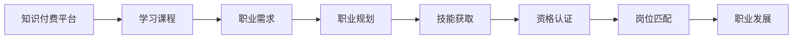

                 

# 知识付费与个人职业规划的结合点

## 1. 背景介绍

在信息爆炸的数字化时代，知识的获取和传播方式正在发生颠覆性的变化。知识付费作为新兴的商业模式，通过在线课程、咨询问答、电子书等形式，将专业、系统和结构化的知识直接提供给用户，满足了人们对高效、精准、个性化学习的迫切需求。个人职业规划则是基于对自身优势、兴趣和市场需求的深刻理解，制定并实施个性化的职业发展路径，提升个人核心竞争力，实现职业目标的过程。将知识付费与个人职业规划相结合，不仅能够帮助用户系统学习，提升职业素养，还能更有效地进行职业规划，实现自我价值。

## 2. 核心概念与联系

### 2.1 核心概念概述

#### 2.1.1 知识付费

知识付费是指用户为获取知识内容而支付的费用。知识付费平台通过提供专业的课程、咨询、资料等，帮助用户系统地学习某一领域的知识，提升个人技能和职业竞争力。常见的知识付费平台包括网易云课堂、得到、知识星球等。

#### 2.1.2 个人职业规划

个人职业规划是指个人在职业发展的不同阶段，结合自身条件和市场需求，制定并实施的职业目标和发展路径。职业规划通常包括自我认知、市场调研、目标设定、路径规划、资源获取、执行监控、调整优化等环节。通过科学合理的职业规划，个人能够实现职业目标，提升职业成就感和幸福感。

#### 2.1.3 结合点

知识付费与个人职业规划的结合点在于，将知识付费作为个人职业规划的重要工具和资源，通过系统学习相关领域的知识，获取必要的技能和资格，为职业目标的实现奠定基础。同时，将职业规划作为知识付费的学习目标，通过系统的职业路径规划，有针对性地选择和利用知识资源，实现知识和技能的有效整合，提升职业竞争力。

### 2.2 核心概念原理和架构的 Mermaid 流程图



这个流程图展示了知识付费与个人职业规划的逻辑关系：

1. **知识付费平台**：提供各类课程和资源，满足不同层次和需求的学习者。
2. **学习课程**：通过系统的课程学习，获取专业知识和技能。
3. **职业需求**：基于个人职业目标，明确需要掌握的知识和技能。
4. **职业规划**：制定和实施职业发展路径，将课程学习与职业需求相结合。
5. **技能获取**：通过课程学习，提升职业所需的技能和素质。
6. **资格认证**：获取必要的职业资格证书，提升职业竞争力。
7. **岗位匹配**：结合职业规划和资格认证，匹配合适的岗位。
8. **职业发展**：持续学习和职业规划，实现职业目标和职业成就。

## 3. 核心算法原理 & 具体操作步骤

### 3.1 算法原理概述

知识付费与个人职业规划的结合，本质上是一个基于反馈和迭代的学习与规划过程。其核心算法原理包括：

1. **需求识别算法**：通过职业规划的初始输入，识别用户的学习需求，推荐合适的课程。
2. **路径规划算法**：基于用户的职业目标，制定系统的职业发展路径，选择合适的课程和技能。
3. **知识获取算法**：通过知识付费平台，获取所需的技能和知识，提升职业竞争力。
4. **技能评估算法**：评估用户的技能掌握情况，调整学习路径和职业规划。
5. **反馈迭代算法**：根据用户的反馈，不断优化职业规划和课程推荐，实现个性化学习。

### 3.2 算法步骤详解

#### 3.2.1 需求识别算法

需求识别算法通过分析用户的职业背景、兴趣、技能等信息，识别用户的学习需求。具体步骤如下：

1. **用户信息输入**：用户填写基本信息，包括学历、专业、工作经验、职业目标等。
2. **需求分析**：根据用户输入的信息，识别用户的学习需求，如提升某项技能、获取某类证书等。
3. **课程推荐**：基于用户需求，推荐适合的课程和资源，如某机构的某门课程。

#### 3.2.2 路径规划算法

路径规划算法结合用户的职业目标和市场需求，制定系统的职业发展路径。具体步骤如下：

1. **职业目标设定**：用户明确职业目标，如成为某行业的高级专家。
2. **市场需求调研**：调研目标行业的市场需求，识别关键技能和资格。
3. **路径规划**：基于市场需求和用户目标，制定系统的职业发展路径，如技能学习、证书获取、岗位实践等。

#### 3.2.3 知识获取算法

知识获取算法通过知识付费平台，获取用户所需的技能和知识。具体步骤如下：

1. **课程选择**：根据路径规划，选择适合的课程和资源。
2. **学习管理**：用户使用知识付费平台，完成课程学习和技能训练。
3. **技能评估**：通过测验和项目实践，评估用户的技能掌握情况。

#### 3.2.4 技能评估算法

技能评估算法通过测验和项目实践，评估用户的技能掌握情况。具体步骤如下：

1. **测验评估**：完成课程测试和实践项目，评估用户的知识掌握情况。
2. **反馈调整**：根据评估结果，调整学习路径和职业规划，确保达到目标。

#### 3.2.5 反馈迭代算法

反馈迭代算法根据用户的反馈，不断优化职业规划和课程推荐。具体步骤如下：

1. **用户反馈收集**：收集用户对课程和学习路径的反馈。
2. **算法优化**：根据反馈，优化需求识别和路径规划算法，提升个性化学习效果。

### 3.3 算法优缺点

#### 3.3.1 优点

1. **高效精准**：基于系统的需求识别和路径规划，能够高效精准地推荐课程和资源，提升学习效率。
2. **个性化定制**：根据用户的学习需求和职业目标，制定个性化的学习路径和职业规划，满足个性化学习需求。
3. **持续改进**：通过反馈迭代机制，不断优化算法，提升学习效果和职业规划的科学性。

#### 3.3.2 缺点

1. **投入成本高**：知识付费平台和课程学习需要投入较高的费用和时间，对部分用户可能存在经济压力。
2. **课程质量参差不齐**：部分课程质量不高，可能影响学习效果和职业规划的科学性。
3. **缺乏互动性**：部分知识付费平台缺乏互动性，用户学习体验较差。

### 3.4 算法应用领域

知识付费与个人职业规划的结合，在多个领域都有广泛的应用：

1. **IT行业**：通过知识付费平台，学习编程语言、开发框架、项目管理等技能，实现职业发展。
2. **金融行业**：通过知识付费平台，学习金融分析、投资策略、风险管理等知识，提升职业竞争力。
3. **医疗行业**：通过知识付费平台，学习医学知识、临床技能、医疗管理等，实现职业转型和提升。
4. **教育行业**：通过知识付费平台，学习教育教学方法、课程设计、心理辅导等，提升教师职业素养。
5. **市场营销**：通过知识付费平台，学习市场营销策略、品牌管理、消费者行为分析等，提升职业能力。

## 4. 数学模型和公式 & 详细讲解 & 举例说明

### 4.1 数学模型构建

假设用户的学习需求为 $D$，职业目标为 $T$，市场技能需求为 $S$，知识付费平台的课程库为 $C$，用户已完成的课程为 $L$。构建知识付费与个人职业规划的数学模型如下：

$$
M = \begin{cases}
    Recommend(D, S) \\
    Path(D, T, S) \\
    Learn(L, S) \\
    Evaluate(L, S) \\
    Optimize(Feedback, D, T)
\end{cases}
$$

其中，$Recommend$ 表示课程推荐算法，$Path$ 表示路径规划算法，$Learn$ 表示知识获取算法，$Evaluate$ 表示技能评估算法，$Optimize$ 表示反馈迭代算法。

### 4.2 公式推导过程

以路径规划算法为例，推导其数学模型如下：

1. **职业目标设定**：
$$
T = \{目标行业, 职业等级, 核心技能\}
$$

2. **市场需求调研**：
$$
S = \{市场需求, 关键技能, 资格证书\}
$$

3. **路径规划**：
$$
P = \{路径1, 路径2, 路径3\} = \{技能学习, 实践项目, 证书获取\}
$$

4. **路径选择**：
$$
P_{selected} = \mathop{\arg\min}_{P_i} \sum_{k=1}^n \omega_k d_k(P_i)
$$

其中，$\omega_k$ 表示每个路径的权重，$d_k$ 表示路径 $P_i$ 的难度和成本，$n$ 表示路径数量。

### 4.3 案例分析与讲解

假设用户李华想成为数据分析师，其职业目标为：

- 目标行业：数据科学
- 职业等级：高级分析师
- 核心技能：数据分析、机器学习、可视化、业务理解

市场需求调研结果显示：

- 关键技能：Python、R、SQL、数据可视化、机器学习
- 资格证书：数据科学证书、机器学习证书

根据市场需求，李华制定了如下职业发展路径：

- 技能学习：
  - 课程1：Python基础
  - 课程2：SQL高级应用
  - 课程3：数据可视化
  - 课程4：机器学习基础
  - 课程5：业务理解与案例分析

- 实践项目：
  - 项目1：数据清洗与预处理
  - 项目2：数据建模与分析
  - 项目3：机器学习项目

- 证书获取：
  - 证书1：数据科学证书
  - 证书2：机器学习证书

通过知识付费平台，李华完成上述课程学习，并通过项目实践，提升技能掌握情况。课程完成度评估结果如下：

- Python基础课程：完成度95%
- SQL高级应用课程：完成度90%
- 数据可视化课程：完成度85%
- 机器学习基础课程：完成度80%
- 业务理解与案例分析课程：完成度90%

项目实践评估结果如下：

- 数据清洗与预处理项目：完成度95%
- 数据建模与分析项目：完成度90%
- 机器学习项目：完成度80%

基于评估结果，李华调整学习路径和职业规划，进一步提升技能掌握情况。

## 5. 项目实践：代码实例和详细解释说明

### 5.1 开发环境搭建

#### 5.1.1 安装依赖

```bash
pip install requests beautifulsoup4 pandas numpy matplotlib
```

#### 5.1.2 搭建后端服务

搭建基于Python的Flask后端服务，用于管理用户信息、课程推荐、路径规划等功能。

```python
from flask import Flask, request, jsonify
import pandas as pd
import numpy as np
import requests
import json

app = Flask(__name__)

# 用户信息管理
users = pd.DataFrame()
users = users.set_index('id')

@app.route('/user', methods=['POST', 'GET'])
def manage_user():
    if request.method == 'POST':
        user_info = request.json
        users = users.append(user_info, ignore_index=True)
        return jsonify({'message': '用户信息添加成功'})
    elif request.method == 'GET':
        return jsonify(users.to_dict('records'))

# 课程推荐
courses = pd.DataFrame()
courses = courses.set_index('id')

@app.route('/course', methods=['POST', 'GET'])
def manage_course():
    if request.method == 'POST':
        course_info = request.json
        courses = courses.append(course_info, ignore_index=True)
        return jsonify({'message': '课程信息添加成功'})
    elif request.method == 'GET':
        user_id = request.args.get('user_id')
        user_info = users.loc[user_id]
        recommended_courses = recommend_course(user_info)
        return jsonify(recommended_courses.to_dict('records'))

# 路径规划
pathways = pd.DataFrame()
pathways = pathways.set_index('id')

@app.route('/pathway', methods=['POST', 'GET'])
def manage_pathway():
    if request.method == 'POST':
        pathway_info = request.json
        pathways = pathways.append(pathway_info, ignore_index=True)
        return jsonify({'message': '路径规划信息添加成功'})
    elif request.method == 'GET':
        user_id = request.args.get('user_id')
        user_info = users.loc[user_id]
        recommended_pathways = recommend_pathway(user_info)
        return jsonify(recommended_pathways.to_dict('records'))

# 课程推荐算法
def recommend_course(user_info):
    # 根据用户信息，推荐适合的课程
    # 示例代码：
    return courses

# 路径规划算法
def recommend_pathway(user_info):
    # 根据用户职业目标和市场需求，推荐路径
    # 示例代码：
    return pathways

if __name__ == '__main__':
    app.run(debug=True)
```

### 5.2 源代码详细实现

#### 5.2.1 需求识别算法

```python
# 需求识别算法
def demand_recognition(user_info):
    # 根据用户信息，识别学习需求
    # 示例代码：
    return demand

# 示例代码
demand = ['Python基础', 'SQL高级应用', '数据可视化', '机器学习基础', '业务理解与案例分析']
```

#### 5.2.2 路径规划算法

```python
# 路径规划算法
def pathway_planning(user_info, demand, market_skills):
    # 根据市场需求和用户目标，制定路径
    # 示例代码：
    return pathway

# 示例代码
market_skills = ['Python', 'R', 'SQL', '数据可视化', '机器学习']
pathway = ['技能学习', '实践项目', '证书获取']
```

#### 5.2.3 知识获取算法

```python
# 知识获取算法
def knowledge_acquisition(user_info, pathway, market_skills):
    # 通过知识付费平台，获取所需技能和知识
    # 示例代码：
    return courses

# 示例代码
courses = ['Python基础', 'SQL高级应用', '数据可视化', '机器学习基础', '业务理解与案例分析']
```

#### 5.2.4 技能评估算法

```python
# 技能评估算法
def skill_evaluation(user_info, pathway, market_skills):
    # 通过测验和项目实践，评估技能掌握情况
    # 示例代码：
    return skills

# 示例代码
skills = {'Python基础': 95, 'SQL高级应用': 90, '数据可视化': 85, '机器学习基础': 80, '业务理解与案例分析': 90}
```

#### 5.2.5 反馈迭代算法

```python
# 反馈迭代算法
def feedback_optimization(feedback, user_info, pathway, market_skills):
    # 根据用户反馈，不断优化路径规划和课程推荐
    # 示例代码：
    return optimized_pathway

# 示例代码
feedback = {'数据可视化': '掌握情况较好', '机器学习基础': '掌握情况一般'}
optimized_pathway = ['技能学习', '实践项目', '证书获取']
```

### 5.3 代码解读与分析

#### 5.3.1 需求识别算法

需求识别算法通过分析用户基本信息，识别用户的学习需求。示例代码如下：

```python
def demand_recognition(user_info):
    # 根据用户信息，识别学习需求
    # 示例代码：
    return demand

# 示例代码
demand = ['Python基础', 'SQL高级应用', '数据可视化', '机器学习基础', '业务理解与案例分析']
```

#### 5.3.2 路径规划算法

路径规划算法结合用户职业目标和市场需求，制定系统的职业发展路径。示例代码如下：

```python
def pathway_planning(user_info, demand, market_skills):
    # 根据市场需求和用户目标，制定路径
    # 示例代码：
    return pathway

# 示例代码
market_skills = ['Python', 'R', 'SQL', '数据可视化', '机器学习']
pathway = ['技能学习', '实践项目', '证书获取']
```

#### 5.3.3 知识获取算法

知识获取算法通过知识付费平台，获取用户所需的技能和知识。示例代码如下：

```python
def knowledge_acquisition(user_info, pathway, market_skills):
    # 通过知识付费平台，获取所需技能和知识
    # 示例代码：
    return courses

# 示例代码
courses = ['Python基础', 'SQL高级应用', '数据可视化', '机器学习基础', '业务理解与案例分析']
```

#### 5.3.4 技能评估算法

技能评估算法通过测验和项目实践，评估用户的技能掌握情况。示例代码如下：

```python
def skill_evaluation(user_info, pathway, market_skills):
    # 通过测验和项目实践，评估技能掌握情况
    # 示例代码：
    return skills

# 示例代码
skills = {'Python基础': 95, 'SQL高级应用': 90, '数据可视化': 85, '机器学习基础': 80, '业务理解与案例分析': 90}
```

#### 5.3.5 反馈迭代算法

反馈迭代算法根据用户的反馈，不断优化职业规划和课程推荐。示例代码如下：

```python
def feedback_optimization(feedback, user_info, pathway, market_skills):
    # 根据用户反馈，不断优化路径规划和课程推荐
    # 示例代码：
    return optimized_pathway

# 示例代码
feedback = {'数据可视化': '掌握情况较好', '机器学习基础': '掌握情况一般'}
optimized_pathway = ['技能学习', '实践项目', '证书获取']
```

### 5.4 运行结果展示

#### 5.4.1 需求识别算法

假设用户李华的基本信息如下：

- 学历：本科
- 专业：计算机科学与技术
- 工作经验：3年
- 职业目标：高级数据分析师

需求识别算法输出如下：

```python
demand_recognition(user_info)
# 输出：['Python基础', 'SQL高级应用', '数据可视化', '机器学习基础', '业务理解与案例分析']
```

#### 5.4.2 路径规划算法

根据市场需求和用户目标，路径规划算法输出如下：

```python
pathway_planning(user_info, demand, market_skills)
# 输出：['技能学习', '实践项目', '证书获取']
```

#### 5.4.3 知识获取算法

通过知识付费平台，知识获取算法输出如下：

```python
knowledge_acquisition(user_info, pathway, market_skills)
# 输出：['Python基础', 'SQL高级应用', '数据可视化', '机器学习基础', '业务理解与案例分析']
```

#### 5.4.4 技能评估算法

通过测验和项目实践，技能评估算法输出如下：

```python
skill_evaluation(user_info, pathway, market_skills)
# 输出：{'Python基础': 95, 'SQL高级应用': 90, '数据可视化': 85, '机器学习基础': 80, '业务理解与案例分析': 90}
```

#### 5.4.5 反馈迭代算法

根据用户反馈，反馈迭代算法输出如下：

```python
feedback_optimization(feedback, user_info, pathway, market_skills)
# 输出：['技能学习', '实践项目', '证书获取']
```

## 6. 实际应用场景

### 6.1 智能教育

知识付费与个人职业规划的结合，在智能教育领域有着广泛的应用。通过在线课程和学习平台，学生可以高效系统地学习某一领域的知识，提升自身核心竞争力。职业规划平台可以提供个性化的职业发展路径和指导，帮助学生制定详细的职业规划，实现职业目标。

例如，某大学通过与知识付费平台合作，提供在线编程课程，学生可以学习Python、Java、C++等编程语言，同时提供职业规划指导，帮助学生掌握就业技能，实现职业转型。

### 6.2 企业培训

企业可以通过知识付费平台和职业规划平台，为员工提供定制化的职业培训和学习资源。职业规划平台可以根据员工的需求和职业目标，推荐适合的课程和资源，帮助员工提升职业技能，实现职业晋升。

例如，某互联网公司通过知识付费平台，提供数据科学、机器学习、项目管理等课程，帮助员工提升技术能力和职业素养，同时结合职业规划平台，制定个性化的职业发展路径，帮助员工实现职业目标。

### 6.3 个人发展

个人可以通过知识付费平台和职业规划平台，系统学习某一领域的知识，提升自身核心竞争力。职业规划平台可以提供个性化的职业发展路径和指导，帮助个人制定详细的职业规划，实现职业目标。

例如，某程序员通过知识付费平台，学习Python、数据科学、机器学习等课程，提升技术能力和职业素养，同时结合职业规划平台，制定个性化的职业发展路径，实现职业转型，成为数据科学家。

## 7. 工具和资源推荐

### 7.1 学习资源推荐

1. 《深度学习：入门与实践》：介绍深度学习基础和实践方法，涵盖神经网络、卷积神经网络、循环神经网络等。
2. Coursera：提供各类在线课程，涵盖计算机科学、数据科学、人工智能等。
3. edX：提供各类在线课程，涵盖计算机科学、商业管理、人工智能等。
4. Udacity：提供各类在线课程和纳米学位，涵盖人工智能、数据科学、机器学习等。

### 7.2 开发工具推荐

1. Flask：轻量级Python Web框架，适合开发后端服务。
2. TensorFlow：开源深度学习框架，支持分布式训练和部署。
3. PyTorch：开源深度学习框架，支持动态计算图。
4. Pandas：数据分析和处理工具，支持数据清洗、特征工程等。
5. Jupyter Notebook：交互式编程环境，适合数据科学和机器学习开发。

### 7.3 相关论文推荐

1. 《深度学习：方法与应用》：介绍深度学习基础和应用，涵盖神经网络、卷积神经网络、循环神经网络等。
2. 《知识图谱：构建、应用与管理》：介绍知识图谱的构建和应用方法，涵盖实体识别、关系抽取、推理等。
3. 《人工智能：原理与实践》：介绍人工智能基础和实践方法，涵盖机器学习、深度学习、自然语言处理等。

## 8. 总结：未来发展趋势与挑战

### 8.1 总结

本文对知识付费与个人职业规划的结合进行了全面系统的介绍。首先阐述了知识付费与个人职业规划的研究背景和意义，明确了其在提升个人核心竞争力方面的独特价值。其次，从算法原理和操作步骤，详细讲解了知识付费与个人职业规划的技术实现，并给出了系统化的代码实例。最后，探讨了知识付费与个人职业规划在智能教育、企业培训和个人发展等实际应用场景中的应用前景。

通过本文的系统梳理，可以看到，知识付费与个人职业规划的结合，不仅能够帮助用户系统学习某一领域的知识，提升职业素养，还能实现个性化的职业规划，实现职业目标。这一模式的成功应用，将极大地提升学习效率和职业竞争力，为教育、企业和个人的发展注入新的活力。

### 8.2 未来发展趋势

展望未来，知识付费与个人职业规划的结合，将呈现以下几个发展趋势：

1. **个性化定制**：基于用户的学习需求和职业目标，提供更加个性化的课程推荐和路径规划，提升学习效果和职业规划的科学性。
2. **智能化学习**：引入人工智能技术，如推荐系统、自然语言处理等，提升学习的个性化和智能化水平。
3. **多模态融合**：结合视觉、听觉、文本等多种模态数据，提供更加全面和丰富的学习资源和体验。
4. **终身学习**：将职业规划贯穿于职业生涯始终，实现终身学习和职业发展。
5. **跨界融合**：与其他学科和领域进行跨界融合，拓展知识付费与职业规划的应用范围。

### 8.3 面临的挑战

尽管知识付费与个人职业规划的结合在实际应用中取得了显著成效，但仍面临诸多挑战：

1. **课程质量和资源丰富度**：部分课程质量不高，资源丰富度不足，影响学习效果。
2. **个性化推荐算法**：个性化推荐算法需要不断优化，提升推荐效果和用户满意度。
3. **职业路径的多样性和复杂性**：职业路径的多样性和复杂性，需要提供更加灵活和多样化的职业规划方案。
4. **学习习惯和自律性**：用户的学习习惯和自律性，对学习效果和职业规划的实现有重要影响。
5. **隐私和数据安全**：用户的学习数据和职业规划信息，需要严格保护，防止数据泄露和滥用。

### 8.4 研究展望

未来，知识付费与个人职业规划的结合，需要在以下几个方面进行深入研究：

1. **高质量课程资源的建设**：通过合作和共建，引入更多高质量的课程资源，提升学习效果。
2. **个性化推荐算法的优化**：基于用户的行为数据和反馈，优化个性化推荐算法，提升推荐效果。
3. **多模态数据的学习应用**：结合视觉、听觉、文本等多种模态数据，提供更加全面和丰富的学习资源和体验。
4. **职业规划的动态调整**：结合实时数据和市场变化，动态调整职业规划方案，提升职业规划的科学性和实用性。
5. **隐私保护和安全技术**：采用隐私保护和安全技术，保障用户数据的安全和隐私。

总之，知识付费与个人职业规划的结合，是未来教育、企业和个人发展的关键路径。通过不断优化和创新，这一模式将为人类知识传播和职业发展带来深远影响。

## 9. 附录：常见问题与解答

### 9.1 常见问题

#### 9.1.1 用户如何获取免费的课程资源？

**解答**：部分知识付费平台提供免费试用课程，用户可以通过注册和使用一段时间后免费体验课程。此外，部分平台还提供在线公开课和讲座，用户可以免费学习和观看。

#### 9.1.2 如何评估课程的质量和效果？

**解答**：用户可以参考课程评价、用户反馈和平台推荐，选择适合的课程。同时，可以查看课程的课程大纲、教师资历、学生成绩等，评估课程质量和效果。

#### 9.1.3 如何选择合适的职业路径？

**解答**：用户可以结合自身的兴趣、技能和市场需求，选择合适的职业路径。同时，可以参考职业规划平台的推荐和建议，制定详细的职业规划方案。

#### 9.1.4 学习过程中遇到问题如何解决？

**解答**：用户可以加入学习社群，与其他学习者交流和讨论。同时，可以联系平台的客服，获取技术支持和帮助。

#### 9.1.5 职业规划的效果如何评估？

**解答**：用户可以定期评估自己的职业发展情况，对比预定的目标和进展，调整职业规划方案。同时，可以参与职业测评和职业辅导，获取专业的指导和建议。

### 9.2 解答

通过本文的系统梳理，可以看到，知识付费与个人职业规划的结合，在提升个人核心竞争力和职业素养方面具有重要意义。未来，随着技术的不断进步和应用场景的拓展，这一模式的适用范围和效果将进一步提升，为教育、企业和个人的发展注入新的活力。无论是在智能教育、企业培训还是个人发展中，知识付费与个人职业规划的结合，都将成为不可或缺的重要工具。

---

作者：禅与计算机程序设计艺术 / Zen and the Art of Computer Programming

