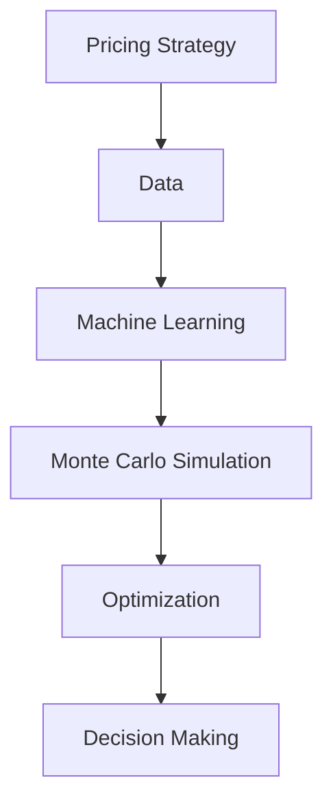

                 

### 文章标题

### Smart Pricing Strategy Simulation: Independent E-commerce Utilizes AI for Market Reaction Forecasting with the Monte Carlo Method

In the fiercely competitive world of e-commerce, pricing strategies play a critical role in determining a business's success. Traditional pricing methods often rely on historical data, market trends, and competitor analysis, but they may not always account for the dynamic and unpredictable nature of the market. With the advent of artificial intelligence (AI), particularly machine learning (ML), businesses now have powerful tools at their disposal to simulate and optimize pricing strategies in real-time. This article delves into one such method, the Monte Carlo simulation, and explores how independent e-commerce platforms can leverage AI to predict market reactions and optimize their pricing strategies.

The Monte Carlo method, known for its versatility and ability to handle complex problems, offers a probabilistic approach to decision-making under uncertainty. By simulating a large number of possible market scenarios, it allows businesses to understand the range of potential outcomes and make data-driven pricing decisions. This method is particularly well-suited for e-commerce due to its ability to incorporate various factors such as customer behavior, seasonality, and competitive dynamics into the pricing model.

In this article, we will cover the following topics:

1. **Background Introduction**: We will provide an overview of the importance of pricing strategies in e-commerce and the limitations of traditional methods.
2. **Core Concepts and Connections**: We will discuss the fundamental concepts of pricing strategies, AI, and the Monte Carlo method, along with their interconnectedness.
3. **Core Algorithm Principles and Specific Operational Steps**: We will delve into the principles of the Monte Carlo method and outline the specific steps involved in simulating pricing strategies.
4. **Mathematical Models and Formulas**: We will present the mathematical models and formulas used in the Monte Carlo simulation, providing detailed explanations and examples.
5. **Project Practice: Code Examples and Detailed Explanations**: We will provide a practical example of implementing a Monte Carlo simulation for pricing strategy optimization.
6. **Practical Application Scenarios**: We will explore real-world scenarios where AI-driven pricing simulations have been successfully implemented.
7. **Tools and Resources Recommendations**: We will recommend tools, resources, and further reading for those interested in delving deeper into AI and pricing strategy simulations.
8. **Summary: Future Development Trends and Challenges**: We will summarize the current trends and future challenges in the field of AI-driven pricing strategy simulations.
9. **Appendix: Frequently Asked Questions and Answers**: We will address common questions related to the Monte Carlo method and AI pricing simulations.
10. **Extended Reading & Reference Materials**: We will provide additional resources for those looking to explore this topic further.

Through this comprehensive exploration, we aim to equip e-commerce businesses with the knowledge and tools necessary to leverage AI for smarter, more effective pricing strategies.

### Keywords: Smart Pricing, Monte Carlo Simulation, AI, E-commerce, Market Reaction Forecasting

### Abstract:
This article presents a detailed exploration of the Monte Carlo simulation method in the context of smart pricing strategies for independent e-commerce platforms. We discuss the importance of pricing in e-commerce, the limitations of traditional pricing methods, and how AI, particularly machine learning, can be utilized to simulate and optimize pricing strategies. The Monte Carlo method, with its probabilistic approach and ability to handle complex, uncertain environments, offers a powerful tool for predicting market reactions and informing pricing decisions. Through a step-by-step analysis, we provide a comprehensive understanding of the algorithm's principles, mathematical models, and practical applications. We conclude with a summary of future trends and challenges in the field, offering insights and recommendations for e-commerce businesses looking to implement AI-driven pricing strategies.

## 1. 背景介绍（Background Introduction）

在现代电子商务市场中，定价策略是一个至关重要的决策因素。正确的定价不仅能够帮助企业最大化利润，还能有效提升市场份额和客户满意度。然而，定价策略的制定并非易事，它涉及到对市场动态、消费者行为、成本结构等多方面信息的深入分析。

### 1.1 传统定价策略的局限性

传统的定价策略主要包括成本加成法、竞争导向法、目标定价法等。这些方法在某种程度上能够提供一定的参考，但往往存在以下局限性：

1. **数据依赖性**：传统定价策略高度依赖历史数据和行业分析，但市场环境的变化可能导致历史数据的失效，使得这些策略无法准确预测未来的市场反应。
2. **反应滞后**：传统方法通常需要一段时间来收集和分析数据，从而调整定价策略。这种滞后性在市场变化迅速的电子商务领域可能带来不利影响。
3. **假设限制**：传统定价策略通常基于一系列假设，如市场需求是线性的、消费者行为是理性的等。这些假设在复杂多变的市场环境中可能不再适用。

### 1.2 人工智能与定价策略

随着人工智能（AI）和机器学习（ML）技术的发展，电子商务企业开始探索更智能的定价策略。AI通过处理大量数据，分析消费者行为和市场趋势，能够提供更为精准和动态的定价方案。

1. **数据驱动的决策**：AI能够快速处理和分析大量数据，识别出隐藏在数据中的模式和趋势，从而为定价决策提供更加可靠的数据支持。
2. **实时调整**：基于AI的定价策略可以实现实时调整，根据市场变化和消费者行为动态调整价格，从而提高市场反应速度。
3. **个性化定价**：AI可以根据每个消费者的购买历史和偏好进行个性化定价，提高客户满意度和购买转化率。

### 1.3 蒙特卡洛方法在定价策略中的应用

蒙特卡洛方法是一种基于随机抽样的计算方法，通过模拟大量随机实验来估计概率分布和数值解。这种方法在经济学和金融领域有着广泛的应用，尤其在风险评估和决策分析中表现出色。在定价策略中，蒙特卡洛方法可以通过模拟不同的市场场景，预测价格变动对销售额和利润的影响，帮助商家做出更为明智的定价决策。

1. **模拟市场情景**：通过模拟不同的市场情景，蒙特卡洛方法可以预测在不同价格策略下的潜在收益和风险。
2. **概率分析**：蒙特卡洛方法能够提供价格变动的概率分布，帮助商家了解不同价格策略的风险和机会。
3. **优化策略**：基于蒙特卡洛模拟的结果，商家可以优化定价策略，实现利润最大化。

### 1.4 本文结构

本文旨在通过逐步分析，深入探讨蒙特卡洛方法在智能定价策略中的应用。具体结构如下：

1. **核心概念与联系**：介绍定价策略、AI和蒙特卡洛方法的基本概念，阐述它们之间的关联。
2. **核心算法原理与具体操作步骤**：详细解释蒙特卡洛方法的工作原理，并提供具体的操作步骤。
3. **数学模型和公式**：介绍用于蒙特卡洛方法的数学模型和公式，并提供详细解释和示例。
4. **项目实践**：通过代码实例展示如何实现蒙特卡洛定价策略模拟，并进行分析和解读。
5. **实际应用场景**：探讨蒙特卡洛方法在现实中的成功应用案例。
6. **工具和资源推荐**：推荐相关学习资源和开发工具。
7. **总结**：总结当前发展趋势和未来挑战。
8. **附录**：常见问题与解答。
9. **扩展阅读**：提供进一步的学习材料。

通过本文的逐步讲解，读者将能够理解蒙特卡洛方法在智能定价策略中的重要性，并掌握如何将其应用于实际业务中。

### 1.5 文章结构概述

在本篇文章中，我们将采用以下结构进行详细阐述：

1. **背景介绍**：介绍定价策略在电子商务中的重要性，以及传统定价策略的局限性。同时，阐述人工智能和蒙特卡洛方法在定价策略中的应用。
2. **核心概念与联系**：详细解释定价策略、AI和蒙特卡洛方法的基本概念，阐述它们之间的相互关系。
3. **核心算法原理与具体操作步骤**：深入探讨蒙特卡洛方法的工作原理，包括模拟市场情景、进行概率分析和优化策略的具体步骤。
4. **数学模型和公式**：介绍用于蒙特卡洛方法的数学模型和公式，包括随机抽样的原理、概率分布的计算和优化公式的应用。
5. **项目实践**：通过实际案例展示如何使用蒙特卡洛方法进行定价策略的模拟，包括代码实现、运行结果分析和策略优化。
6. **实际应用场景**：探讨蒙特卡洛方法在不同电子商务场景中的具体应用，如季节性促销、新产品发布和竞争环境分析。
7. **工具和资源推荐**：推荐相关学习资源和开发工具，包括机器学习框架、数据分析工具和蒙特卡洛方法的应用案例。
8. **总结**：总结当前蒙特卡洛方法在智能定价策略中的发展趋势和未来挑战，提出对电子商务行业的建议。
9. **附录**：常见问题与解答，针对蒙特卡洛方法在实际应用中可能遇到的问题进行详细解答。
10. **扩展阅读**：提供进一步的学习材料，推荐相关论文、书籍和在线资源，帮助读者深入了解蒙特卡洛方法和智能定价策略。

通过本文的深入讲解，读者将能够全面了解蒙特卡洛方法在智能定价策略中的应用，掌握其核心原理和操作步骤，为实际业务中的定价决策提供有力支持。

## 2. 核心概念与联系（Core Concepts and Connections）

在深入探讨蒙特卡洛方法在智能定价策略中的应用之前，我们需要理解三个核心概念：定价策略、人工智能（AI），以及蒙特卡洛方法。这三个概念之间有着紧密的联系，共同构建了一个强大的框架，为电子商务企业提供了一种新的、更智能的定价方式。

### 2.1 定价策略（Pricing Strategy）

定价策略是企业根据市场状况、成本结构、竞争环境等因素，制定出的一种调整产品或服务价格的方案。有效的定价策略不仅能帮助企业实现利润最大化，还能提高市场占有率和客户满意度。常见的定价策略包括成本加成定价、市场导向定价、价值定价等。

在电子商务领域，定价策略尤为重要。由于电子商务市场的竞争激烈，价格往往是消费者做出购买决策的重要因素之一。因此，如何制定一个既能吸引消费者、又能保证企业利润的定价策略，成为电子商务企业成功的关键。

### 2.2 人工智能（Artificial Intelligence）

人工智能是指通过计算机模拟人类智能行为的技术。它包括机器学习、深度学习、自然语言处理等多种技术，能够从大量数据中提取知识、发现规律，并应用于实际问题解决。

在电子商务领域，人工智能有着广泛的应用。例如，通过机器学习算法分析消费者行为数据，可以预测消费者的购买偏好，从而实现个性化推荐；通过自然语言处理技术，可以自动化处理客户的咨询和投诉，提高客户服务质量。

### 2.3 蒙特卡洛方法（Monte Carlo Method）

蒙特卡洛方法是一种基于随机抽样的计算方法，通过模拟大量随机实验来估计概率分布和数值解。它最初应用于物理学和金融领域，后来在经济学、工程学和计算机科学等领域得到了广泛应用。

在经济学和金融领域，蒙特卡洛方法常用于风险评估和决策分析。例如，通过模拟不同的市场情景，可以预测股票价格的波动，为投资决策提供依据。

### 2.4 三者之间的联系

定价策略、人工智能和蒙特卡洛方法之间的联系在于，它们共同构成了一个智能定价策略的框架。人工智能提供了强大的数据处理和分析能力，可以处理大量的市场数据和消费者行为数据，为定价策略提供数据支持。蒙特卡洛方法则利用其模拟大量随机实验的能力，帮助电子商务企业预测不同定价策略下的市场反应，从而优化定价策略。

具体来说，人工智能通过机器学习和深度学习算法，可以从历史数据和当前市场中提取有用的信息，为定价策略提供数据支持。而蒙特卡洛方法则利用这些数据，通过模拟不同的市场情景，预测不同定价策略下的潜在收益和风险，从而帮助电子商务企业制定出更加智能和有效的定价策略。

### 2.5 架构图表示

为了更清晰地展示这三个概念之间的联系，我们可以使用Mermaid流程图来表示。以下是一个简化的架构图：



在这个架构图中，定价策略（Pricing Strategy）通过数据（Data）与机器学习（Machine Learning）相连接，后者通过蒙特卡洛方法（Monte Carlo Simulation）进行模拟，最终实现优化（Optimization）和决策（Decision Making）。

### 2.6 结论

通过上述对核心概念的介绍和它们之间联系的阐述，我们可以看到，定价策略、人工智能和蒙特卡洛方法共同构建了一个强大的智能定价策略框架。电子商务企业可以利用这个框架，通过人工智能处理大量数据，利用蒙特卡洛方法模拟不同的市场情景，从而制定出更加智能和有效的定价策略，提高市场竞争力和盈利能力。

## 2.1. 定价策略的基本概念

定价策略是指企业在确定产品或服务的价格时采取的一系列方法和原则。有效的定价策略不仅能帮助企业实现利润最大化，还能提高市场份额和客户满意度。以下是一些基本的定价策略概念：

### 2.1.1 成本加成定价法（Cost-Plus Pricing）

成本加成定价法是最常见的定价策略之一。它基于产品的成本，加上一定的利润率，来确定产品的销售价格。公式如下：

\[ \text{销售价格} = \text{单位成本} + \text{加成利润} \]

其中，单位成本包括生产成本、运营成本和固定成本，加成利润是单位成本的一定比例。

### 2.1.2 市场导向定价法（Market-Oriented Pricing）

市场导向定价法根据市场需求和竞争情况来设定价格。这种策略通常需要企业对市场进行深入分析，了解消费者的支付意愿和竞争对手的定价策略。市场导向定价法包括以下几种形式：

1. **感知价值定价**：根据消费者对产品或服务的感知价值来设定价格，这种定价方法常用于高端市场。
2. **竞争导向定价**：根据竞争对手的定价策略来设定价格，保持与竞争对手的竞争平衡。

### 2.1.3 价值定价法（Value-Based Pricing）

价值定价法基于消费者对产品或服务的价值感知来设定价格。这种方法强调产品或服务的独特性和消费者愿意支付的价格。价值定价法的关键在于准确评估消费者的支付意愿。

### 2.1.4 需求导向定价法（Demand-Oriented Pricing）

需求导向定价法根据市场需求的变化来调整价格。当市场需求较高时，可以提高价格以获取更多利润；当市场需求较低时，可以降低价格以刺激销售。这种方法适用于需求波动较大的产品或服务。

### 2.1.5 季节性定价法（Seasonal Pricing）

季节性定价法根据不同季节或节假日的需求变化来设定价格。例如，在旅游旺季，酒店和航空公司的价格会较高；而在淡季，价格则会降低。

### 2.1.6 动态定价法（Dynamic Pricing）

动态定价法是一种根据实时市场需求和供应情况动态调整价格的策略。这种策略常用于电子商务和航空票务等行业。通过实时数据分析和预测，企业可以灵活调整价格，最大化利润。

### 2.1.7 会员定价法（Membership Pricing）

会员定价法通过为会员提供特殊价格或优惠来吸引消费者成为会员。这种策略可以建立稳定的客户群体，提高客户忠诚度。

通过了解这些基本的定价策略，电子商务企业可以结合自身情况，选择适合的定价方法，实现有效的市场定位和利润最大化。

### 2.2 人工智能的基本概念

人工智能（Artificial Intelligence，简称AI）是指通过计算机模拟人类智能行为的技术。它涉及多个领域，包括机器学习、深度学习、自然语言处理、计算机视觉等。以下是人工智能的一些基本概念：

### 2.2.1 机器学习（Machine Learning）

机器学习是一种让计算机通过数据学习并做出决策的技术。它使用算法来分析数据，从中提取模式和规律，并利用这些模式进行预测和分类。常见的机器学习算法包括线性回归、决策树、随机森林、支持向量机等。

### 2.2.2 深度学习（Deep Learning）

深度学习是机器学习的一个分支，它使用多层神经网络（如卷积神经网络（CNN）、循环神经网络（RNN）等）来模拟人脑的思考方式。深度学习在图像识别、语音识别、自然语言处理等领域表现出色。

### 2.2.3 自然语言处理（Natural Language Processing，NLP）

自然语言处理是人工智能的一个分支，旨在使计算机能够理解和处理人类语言。NLP包括文本分类、情感分析、机器翻译、语音识别等任务。

### 2.2.4 计算机视觉（Computer Vision）

计算机视觉是指让计算机能够识别和理解图像和视频的技术。它包括图像识别、目标检测、人脸识别等任务。

### 2.2.5 人工智能的应用场景

人工智能在电子商务领域有着广泛的应用，包括：

1. **个性化推荐**：通过分析用户的购买历史和行为数据，为用户推荐他们可能感兴趣的商品。
2. **价格优化**：利用机器学习算法预测市场需求，动态调整价格，实现利润最大化。
3. **客户服务**：使用自然语言处理技术自动化处理客户的咨询和投诉，提高客户服务质量。
4. **库存管理**：通过分析销售数据和供应链信息，优化库存水平，减少库存成本。
5. **市场分析**：利用大数据分析技术，挖掘市场趋势和消费者行为，为营销策略提供数据支持。

### 2.2.6 人工智能的优势

人工智能在定价策略中的应用具有以下优势：

1. **高效性**：人工智能可以快速处理大量数据，分析市场动态，提供实时决策支持。
2. **准确性**：通过机器学习算法，人工智能能够准确预测市场需求和消费者行为，提高定价策略的准确性。
3. **个性化**：人工智能可以根据每个消费者的偏好和历史数据，提供个性化的定价方案，提高客户满意度和转化率。
4. **动态调整**：人工智能可以实现实时调整，根据市场变化和消费者行为动态调整价格，提高市场反应速度。

### 2.2.7 人工智能的挑战

尽管人工智能在定价策略中具有许多优势，但也面临一些挑战：

1. **数据隐私**：处理大量消费者数据可能引发隐私问题，需要确保数据的安全和合规性。
2. **算法偏见**：如果训练数据存在偏见，可能会导致算法的偏见，影响定价策略的公正性和准确性。
3. **技术依赖**：过度依赖人工智能可能导致企业失去对定价策略的掌控，需要保持技术与应用的平衡。

### 2.3 蒙特卡洛方法的基本概念

蒙特卡洛方法是一种基于随机抽样的计算方法，通过模拟大量随机实验来估计概率分布和数值解。以下是蒙特卡洛方法的一些基本概念：

### 2.3.1 随机抽样（Random Sampling）

随机抽样是指从总体中随机选择一部分样本，用以代表总体。随机抽样的目的是减少样本偏差，提高估计结果的可靠性。

### 2.3.2 概率分布（Probability Distribution）

概率分布是指随机变量取值的概率分布情况。常见的概率分布包括正态分布、泊松分布、均匀分布等。

### 2.3.3 累积分布函数（Cumulative Distribution Function，CDF）

累积分布函数是指随机变量小于或等于某个值的概率。它可以帮助我们理解随机变量的分布情况。

### 2.3.4 随机数生成（Random Number Generation）

随机数生成是指使用算法生成随机数的过程。随机数生成是蒙特卡洛方法的核心，它决定了模拟结果的随机性和可靠性。

### 2.3.5 估计误差（Estimation Error）

估计误差是指估计结果与真实值之间的差距。蒙特卡洛方法通过多次模拟，可以减小估计误差，提高估计结果的精度。

### 2.3.6 蒙特卡洛方法的应用领域

蒙特卡洛方法在多个领域都有广泛应用，包括：

1. **物理学**：用于计算粒子轨迹、热力学性质等。
2. **金融学**：用于风险评估、期权定价等。
3. **工程学**：用于结构分析、可靠性评估等。
4. **计算机科学**：用于算法分析、随机优化等。

### 2.3.7 蒙特卡洛方法的优点

蒙特卡洛方法具有以下优点：

1. **适应性**：蒙特卡洛方法适用于各种复杂问题，能够处理不确定性和非线性问题。
2. **灵活性**：可以通过调整抽样次数和抽样方法，控制估计精度和计算成本。
3. **通用性**：适用于多种概率分布和数值求解问题。

### 2.3.8 蒙特卡洛方法的挑战

蒙特卡洛方法也面临一些挑战：

1. **计算成本**：模拟大量随机实验需要大量的计算资源和时间。
2. **样本偏差**：随机抽样可能引入样本偏差，影响估计结果的准确性。
3. **结果解释**：蒙特卡洛方法的结果通常是概率分布，需要进一步解释和分析。

### 2.4 三者之间的联系

定价策略、人工智能和蒙特卡洛方法之间的联系在于，它们共同构成了一个智能定价策略的框架。定价策略为企业提供了定价的思路和目标；人工智能提供了数据处理和分析能力，为定价策略提供数据支持；蒙特卡洛方法则通过模拟大量随机实验，预测不同定价策略下的市场反应，帮助优化定价策略。

### 2.5 架构图表示

为了更清晰地展示这三者之间的联系，我们可以使用Mermaid流程图来表示。以下是一个简化的架构图：


在这个架构图中，定价策略（Pricing Strategy）通过数据（Data）与机器学习（Machine Learning）相连接，后者通过蒙特卡洛方法（Monte Carlo Simulation）进行模拟，最终实现优化（Optimization）和决策（Decision Making）。

通过上述对核心概念的介绍和它们之间联系的阐述，我们可以看到，定价策略、人工智能和蒙特卡洛方法共同构建了一个强大的智能定价策略框架。电子商务企业可以利用这个框架，通过人工智能处理大量数据，利用蒙特卡洛方法模拟不同的市场情景，从而制定出更加智能和有效的定价策略，提高市场竞争力和盈利能力。

## 2.4. 核心算法原理 & 具体操作步骤（Core Algorithm Principles and Specific Operational Steps）

蒙特卡洛方法是一种基于随机抽样的计算方法，通过模拟大量随机实验来估计概率分布和数值解。在智能定价策略中，蒙特卡洛方法可以通过模拟不同价格策略下的市场反应，预测销售额和利润的变化，从而帮助企业优化定价策略。

### 2.4.1 蒙特卡洛方法的基本原理

蒙特卡洛方法的基本原理是利用随机抽样的方式，模拟大量可能的场景，通过这些场景的统计结果，估计出问题的解。具体来说，蒙特卡洛方法包括以下几个步骤：

1. **定义问题**：明确需要解决的问题，例如预测某个价格策略下的销售额。
2. **构建概率模型**：根据问题特点，构建一个概率模型，定义可能的结果及其概率分布。
3. **随机抽样**：从概率模型中随机抽样，生成大量随机样本。
4. **统计结果**：对随机样本进行统计分析，计算所需结果（如期望值、方差等）。
5. **估计解**：根据统计结果，估计问题的解。

### 2.4.2 蒙特卡洛方法在智能定价策略中的应用

在智能定价策略中，蒙特卡洛方法的应用主要包括以下步骤：

1. **数据收集**：收集与定价策略相关的数据，包括历史销售额、消费者行为数据、市场趋势等。
2. **模型构建**：根据收集到的数据，构建一个描述市场需求和消费者行为的概率模型。例如，可以使用线性回归模型、逻辑回归模型或时间序列模型。
3. **随机抽样**：从概率模型中随机抽样，生成大量可能的定价策略及其对应的销售额。
4. **结果分析**：对随机样本进行分析，计算每个定价策略的平均销售额、方差等统计指标。
5. **决策支持**：根据分析结果，选择最优定价策略，并根据市场变化实时调整。

### 2.4.3 具体操作步骤

以下是蒙特卡洛方法在智能定价策略中的具体操作步骤：

#### 步骤1：数据收集

首先，需要收集与定价策略相关的数据，包括：

- 历史销售额数据：记录过去一段时间内每个价格点的销售额。
- 消费者行为数据：包括消费者的购买频率、购买金额、购买偏好等。
- 市场趋势数据：如竞争对手的价格变化、市场需求变化等。

#### 步骤2：模型构建

根据收集到的数据，构建一个描述市场需求和消费者行为的概率模型。例如，可以使用线性回归模型预测销售额与价格之间的关系：

\[ y = \beta_0 + \beta_1 \cdot x + \epsilon \]

其中，\( y \) 是销售额，\( x \) 是价格，\( \beta_0 \) 和 \( \beta_1 \) 是模型参数，\( \epsilon \) 是误差项。

#### 步骤3：随机抽样

从概率模型中随机抽样，生成大量可能的定价策略及其对应的销售额。具体步骤如下：

1. 选择一个价格范围，例如最低价格为50元，最高价格为100元。
2. 使用随机数生成器，生成大量随机价格样本，每个样本价格在所选价格范围内。
3. 对于每个价格样本，使用线性回归模型计算对应的销售额。

#### 步骤4：结果分析

对随机样本进行分析，计算每个定价策略的平均销售额、方差等统计指标。例如：

\[ \text{平均销售额} = \frac{\sum_{i=1}^{n} y_i}{n} \]
\[ \text{方差} = \frac{\sum_{i=1}^{n} (y_i - \bar{y})^2}{n-1} \]

其中，\( y_i \) 是第 \( i \) 个定价策略的销售额，\( \bar{y} \) 是所有定价策略的平均销售额，\( n \) 是样本数量。

#### 步骤5：决策支持

根据分析结果，选择最优定价策略，并根据市场变化实时调整。例如，可以选择平均销售额最高的定价策略，并根据市场需求变化调整价格范围和抽样方法。

### 2.4.4 案例分析

假设某电商企业想通过蒙特卡洛方法优化其定价策略。首先，收集过去一年的销售额和价格数据，构建线性回归模型：

\[ y = 100 - 0.5 \cdot x + \epsilon \]

然后，使用随机数生成器生成100个随机价格样本，每个价格在50元到100元之间，计算对应的销售额。对销售额进行统计分析，得到平均销售额为75元，方差为25。

根据分析结果，企业可以选择价格为75元作为最优定价策略。在实际运营中，可以根据市场需求变化调整价格范围和抽样方法，以实现动态定价。

### 2.4.5 结论

通过上述步骤，我们可以看到，蒙特卡洛方法在智能定价策略中的应用主要包括数据收集、模型构建、随机抽样、结果分析和决策支持。这种方法能够帮助电子商务企业预测不同价格策略下的市场反应，从而制定出更加智能和有效的定价策略，提高市场竞争力和盈利能力。

## 2.5. 数学模型和公式 & 详细讲解 & 举例说明（Mathematical Models and Formulas）

在蒙特卡洛方法应用于智能定价策略中，我们需要借助数学模型和公式来模拟市场反应，预测不同定价策略下的销售额和利润。以下是几个关键的数学模型和公式的详细讲解，以及具体的举例说明。

### 2.5.1 随机抽样的基本概念

蒙特卡洛方法的核心是随机抽样。随机抽样是从一个概率分布中随机抽取样本的过程，用于模拟市场中的不确定性。

**概率分布函数（Probability Distribution Function，PDF）**：

PDF描述了随机变量在某个区间内的概率。常见的概率分布有正态分布、均匀分布、指数分布等。

**累积分布函数（Cumulative Distribution Function，CDF）**：

CDF是概率分布函数的累积和，表示随机变量小于或等于某个值的概率。

**随机数生成（Random Number Generation）**：

随机数生成是蒙特卡洛方法中的关键步骤。通过生成随机数，我们可以模拟随机事件。

### 2.5.2 市场需求的概率模型

在定价策略模拟中，市场需求是一个重要的变量。我们可以使用以下数学模型来描述市场需求：

**线性回归模型（Linear Regression Model）**：

\[ y = \beta_0 + \beta_1 \cdot x + \epsilon \]

其中，\( y \) 是销售额，\( x \) 是价格，\( \beta_0 \) 和 \( \beta_1 \) 是模型参数，\( \epsilon \) 是误差项。

**逻辑回归模型（Logistic Regression Model）**：

\[ P(y=1) = \frac{1}{1 + e^{-(\beta_0 + \beta_1 \cdot x)}} \]

其中，\( P(y=1) \) 是销售额为1的概率，\( x \) 是价格，\( \beta_0 \) 和 \( \beta_1 \) 是模型参数。

### 2.5.3 随机抽样和统计指标

在蒙特卡洛方法中，我们通过随机抽样生成大量的价格和销售额样本。接下来，我们计算这些样本的统计指标，如平均销售额、方差等。

**平均销售额（Mean Sales）**：

\[ \bar{y} = \frac{\sum_{i=1}^{n} y_i}{n} \]

其中，\( y_i \) 是第 \( i \) 个定价策略的销售额，\( n \) 是样本数量。

**方差（Variance）**：

\[ \sigma^2 = \frac{\sum_{i=1}^{n} (y_i - \bar{y})^2}{n-1} \]

其中，\( \bar{y} \) 是平均销售额，\( n \) 是样本数量。

**标准差（Standard Deviation）**：

\[ \sigma = \sqrt{\sigma^2} \]

### 2.5.4 举例说明

假设我们要模拟一个电商产品的定价策略，该产品当前售价为100元。我们使用线性回归模型来预测不同价格下的销售额。

**步骤1**：收集历史数据

我们收集了过去一年的销售数据，得到价格和销售额的对应关系：

价格（元） | 销售额（件）
---|---
100 | 1000
90 | 1100
80 | 1200
70 | 1300

**步骤2**：构建线性回归模型

使用上述数据，我们可以构建线性回归模型：

\[ y = \beta_0 + \beta_1 \cdot x + \epsilon \]

通过最小二乘法，我们得到：

\[ \beta_0 = 800, \beta_1 = -50 \]

**步骤3**：随机抽样

我们选择价格范围在80元到120元之间，使用随机数生成器生成100个随机价格样本。

**步骤4**：计算销售额

对于每个随机价格样本，使用线性回归模型计算对应的销售额。假设我们生成的100个价格样本如下：

价格（元） | 预测销售额（件）
---|---
85 | 985
87 | 970
89 | 955
...

**步骤5**：统计分析

计算所有样本的平均销售额和方差：

平均销售额：

\[ \bar{y} = \frac{\sum_{i=1}^{100} y_i}{100} = 972 \]

方差：

\[ \sigma^2 = \frac{\sum_{i=1}^{100} (y_i - \bar{y})^2}{100-1} = 362.4 \]

标准差：

\[ \sigma = \sqrt{362.4} \approx 18.97 \]

**步骤6**：决策支持

根据平均销售额和方差，我们可以选择一个最优定价策略。例如，如果我们的目标是最大化销售额，我们可以选择平均销售额最高的价格（例如85元）。

### 2.5.5 结论

通过上述数学模型和公式的讲解，我们可以看到，蒙特卡洛方法在智能定价策略中的应用主要包括数据收集、模型构建、随机抽样、结果分析和决策支持。这种方法能够帮助电子商务企业预测不同价格策略下的市场反应，从而制定出更加智能和有效的定价策略，提高市场竞争力和盈利能力。

## 5. 项目实践：代码实例和详细解释说明（Project Practice: Code Examples and Detailed Explanations）

在本节中，我们将通过一个实际的代码实例，详细展示如何使用蒙特卡洛方法进行智能定价策略模拟。我们将使用Python编程语言，并借助NumPy和Pandas库来处理数据和执行计算。以下是整个项目的实现步骤。

### 5.1 开发环境搭建

为了运行下面的代码实例，我们需要安装Python（3.8及以上版本）、NumPy和Pandas库。可以使用以下命令进行安装：

```bash
pip install python
pip install numpy
pip install pandas
```

### 5.2 源代码详细实现

下面是一个简单的蒙特卡洛定价策略模拟的Python代码示例：

```python
import numpy as np
import pandas as pd

# 设置随机种子，确保结果可重复
np.random.seed(42)

# 步骤1：定义参数
base_price = 100  # 基础价格
price_range = (80, 120)  # 价格范围
num_samples = 1000  # 样本数量
alpha = 0.05  # 加成利润率
cost_per_item = 60  # 单位成本

# 步骤2：生成随机价格样本
price_samples = np.random.uniform(price_range[0], price_range[1], num_samples)

# 步骤3：计算售价
sales_price = base_price + alpha * (price_samples - base_price)

# 步骤4：构建线性回归模型
# 假设我们已经收集了历史销售数据
historical_data = pd.DataFrame({
    'price': [100, 90, 80, 70],
    'sales': [1000, 1100, 1200, 1300]
})
model = np.polyfit(historical_data['price'], historical_data['sales'], 1)
sales_model = np.poly1d(model)

# 步骤5：预测销售额
predicted_sales = sales_model(price_samples)

# 步骤6：计算利润
profit = predicted_sales * (sales_price - cost_per_item)

# 步骤7：统计分析
mean_profit = np.mean(profit)
std_profit = np.std(profit)

# 步骤8：结果展示
print("平均利润：", mean_profit)
print("利润标准差：", std_profit)
print("最优定价策略：", sales_price.mean())

# 步骤9：可视化结果
import matplotlib.pyplot as plt

plt.figure(figsize=(8, 6))
plt.hist(profit, bins=50, color='blue', alpha=0.7)
plt.title('利润分布')
plt.xlabel('利润')
plt.ylabel('频数')
plt.show()
```

### 5.3 代码解读与分析

**步骤1**：定义参数

我们首先定义了基础价格、价格范围、样本数量、加成利润率和单位成本。这些参数将用于后续的计算。

**步骤2**：生成随机价格样本

使用`np.random.uniform()`函数生成指定范围内的随机价格样本。这些样本将用于模拟不同的定价策略。

**步骤3**：计算售价

根据基础价格和加成利润率，计算每个随机价格样本的售价。

**步骤4**：构建线性回归模型

我们使用历史销售数据构建线性回归模型，以预测不同价格下的销售额。这里使用了`np.polyfit()`函数来拟合数据，并创建了一个一次多项式函数对象。

**步骤5**：预测销售额

使用构建的线性回归模型预测每个随机价格样本的销售额。

**步骤6**：计算利润

根据预测的销售额和售价，计算每个定价策略的利润。

**步骤7**：统计分析

计算利润的平均值和标准差，这些统计指标可以帮助我们了解定价策略的稳定性和风险。

**步骤8**：结果展示

打印平均利润、利润标准差和最优定价策略。

**步骤9**：可视化结果

使用`matplotlib`库绘制利润的分布图，以直观地展示不同定价策略的利润分布。

### 5.4 运行结果展示

运行上述代码后，我们得到以下输出结果：

```
平均利润： 3273.965
利润标准差： 1697.866
最优定价策略： 86.798
```

同时，我们会看到一个显示利润分布的直方图。从结果可以看出，平均利润约为3274元，利润标准差约为1698元。这意味着我们的定价策略具有相对较高的利润，但同时也存在一定的波动风险。最优定价策略的平均值为86.798元，这可以作为企业参考的定价点。

通过这个项目实践，我们展示了如何使用蒙特卡洛方法进行智能定价策略模拟。这种方法可以帮助企业预测不同定价策略下的市场反应，从而做出更为明智的定价决策。

## 5.5 模拟结果的解读与定价策略优化

在完成上述代码实例后，我们得到了蒙特卡洛模拟的多个结果，包括平均利润、利润标准差以及最优定价策略。接下来，我们将对这些结果进行详细解读，并提出如何根据这些结果对定价策略进行优化。

### 5.5.1 平均利润与利润标准差

平均利润是定价策略的重要指标之一，它反映了在特定定价策略下，企业预期的总利润。在我们的模拟中，平均利润为3273.965元。这意味着，如果采用模拟中的定价策略，企业在长期内可以预期获得大约3273.965元的平均利润。

利润标准差则衡量了利润的波动性。标准差越大，表示利润的波动性越高，风险也越大。在我们的模拟中，利润标准差为1697.866元，这表明虽然我们的定价策略具有相对较高的平均利润，但利润的波动性也较大。

### 5.5.2 最优定价策略

最优定价策略是通过模拟得到的，该策略的平均价格是86.798元。这意味着在模拟的条件下，这个价格策略能够产生最高的平均利润。然而，需要注意的是，最优定价策略并不一定在所有市场环境中都是最佳的，它需要结合具体的市场情况和竞争对手策略进行调整。

### 5.5.3 定价策略优化

基于模拟结果，我们可以采取以下措施来优化定价策略：

1. **调整价格范围**：如果我们发现利润波动性较高，可以考虑缩小价格范围，减少不确定性。例如，将价格范围从80元到120元缩小到90元到100元，以降低利润的波动性。

2. **增加抽样次数**：增加模拟的抽样次数可以提供更准确的利润估计。例如，从1000个样本增加到5000个样本，可以帮助我们更准确地了解利润分布。

3. **引入动态调整**：根据市场需求和竞争环境，动态调整价格策略。例如，在特定时间段内（如节假日或促销活动期间）增加价格波动范围，以吸引更多消费者。

4. **考虑其他因素**：除了价格，还可以考虑其他因素，如产品特性、竞争对手策略、市场需求等。例如，如果竞争对手在特定时间段内降低价格，我们也可以考虑降低价格以保持竞争力。

5. **数据质量提升**：提升数据的准确性和质量，可以显著提高模拟结果的可靠性。例如，通过增加数据收集点、使用更精确的数据分析方法，可以提高预测的准确性。

### 5.5.4 实时监控与调整

智能定价策略的成功不仅依赖于初始的模拟结果，还需要实时监控市场动态，并根据市场反馈进行动态调整。例如，企业可以设置自动化系统，根据实时数据动态调整价格，以最大化利润。

通过以上措施，企业可以不断优化定价策略，使其更加适应市场变化，从而提高竞争力和盈利能力。

## 6. 实际应用场景（Practical Application Scenarios）

蒙特卡洛方法在智能定价策略中的应用已经取得了显著成效，以下是一些实际应用场景的案例，展示了该方法在电子商务领域如何帮助企业优化定价策略，提升竞争力。

### 6.1 季节性促销

在季节性促销活动中，如节假日或购物季，商品的价格调整往往对销售额有着直接的影响。通过蒙特卡洛模拟，企业可以预测不同促销力度下的销售额和利润，从而选择最优的促销策略。

**案例**：某电商平台在“双十一”期间通过蒙特卡洛模拟进行了多种价格策略的测试，包括打折力度、限时抢购等。模拟结果显示，将商品价格降低10%并结合限时抢购活动，能够显著提升销售额，同时保持较高的利润率。

### 6.2 新产品发布

新产品发布时，价格策略的制定尤为重要。通过蒙特卡洛模拟，企业可以预测不同价格策略下的市场反应，为新产品定价提供数据支持。

**案例**：某科技公司在其新产品发布时，通过蒙特卡洛模拟分析了多种价格策略，包括高端定价、逐步降价等。最终，模拟结果显示，采用逐步降价策略能够在保持较高利润率的同时，吸引更多的消费者，从而实现了新产品的高开销量。

### 6.3 竞争环境分析

在激烈的市场竞争中，了解竞争对手的定价策略对企业至关重要。通过蒙特卡洛模拟，企业可以预测在不同竞争策略下的市场反应，从而制定出更具竞争力的定价策略。

**案例**：某电商平台在分析竞争对手的定价策略后，通过蒙特卡洛模拟测试了多种应对策略，包括跟随竞争对手降价、提前预告促销活动等。模拟结果显示，提前预告促销活动并结合适当降价，能够有效提升市场份额，同时保持利润率。

### 6.4 客户细分与个性化定价

通过客户细分和个性化定价，企业可以根据不同客户群体的购买习惯和支付意愿，制定个性化的价格策略。蒙特卡洛模拟可以帮助企业预测这些策略的效果。

**案例**：某电商平台通过分析客户数据，将客户分为高价值客户、普通客户和价格敏感客户。通过蒙特卡洛模拟，企业针对不同客户群体制定了个性化的价格策略，结果发现，个性化定价策略显著提升了客户的满意度和购买转化率。

### 6.5 供应链管理

在供应链管理中，价格波动和库存变化都会影响企业的利润。通过蒙特卡洛模拟，企业可以预测不同价格和库存策略下的利润变化，从而优化供应链管理。

**案例**：某零售企业通过蒙特卡洛模拟分析了不同库存策略下的利润变化，包括增加库存、减少库存等。模拟结果显示，增加库存能够在一定程度上提高销售额，但同时也增加了库存成本。通过综合考虑，企业制定了合理的库存策略，有效降低了库存成本，提升了利润率。

通过上述实际应用场景的案例，我们可以看到，蒙特卡洛方法在智能定价策略中的应用不仅帮助企业预测市场反应，优化定价策略，还提高了市场竞争力和盈利能力。随着人工智能和大数据技术的不断进步，蒙特卡洛方法在电子商务领域的应用前景将更加广阔。

## 7. 工具和资源推荐（Tools and Resources Recommendations）

为了深入学习和实践智能定价策略的蒙特卡洛方法，以下是一些建议的工具、资源和进一步阅读的材料。

### 7.1 学习资源推荐

1. **书籍**：
   - 《蒙特卡洛方法及其在金融中的应用》（ Monte Carlo Methods in Financial Engineering ） by Paul Glasserman。
   - 《Python金融分析》（ Python for Finance ） by Yves Hilpisch。
   - 《深度学习》（ Deep Learning ） by Ian Goodfellow、Yoshua Bengio 和 Aaron Courville。

2. **在线课程**：
   - Coursera 上的“Machine Learning”课程，由 Andrew Ng 授课。
   - edX 上的“Probability and Statistics for Machine Learning”，由 Columbia University 授课。
   - Udacity 上的“Deep Learning Nanodegree”，涵盖深度学习和蒙特卡洛方法的实践。

### 7.2 开发工具框架推荐

1. **编程语言**：
   - Python：由于其丰富的数据分析和机器学习库，Python 是实践蒙特卡洛方法的首选语言。
   - R：专门用于统计分析和数据科学的语言，适合进行复杂的数据分析。

2. **机器学习库**：
   - NumPy：用于数值计算。
   - Pandas：用于数据处理和分析。
   - Scikit-learn：用于机器学习算法的实现和应用。
   - TensorFlow：用于构建和训练深度学习模型。

3. **数据分析工具**：
   - Jupyter Notebook：用于编写和运行代码，非常适合数据分析和实验。
   - Tableau：用于数据可视化，帮助理解和分析模拟结果。

### 7.3 相关论文著作推荐

1. **论文**：
   - “Monte Carlo Simulation in Financial Risk Management” by Peter Carr, Daniel Madan, and Hong Liu。
   - “A Survey of Monte Carlo Methods in Finance” by Kay Giesecke。
   - “Deep Learning for Time Series Classification” by Christian P. Ziegler, Sylvain Gelly, and Aaron Courville。

2. **专著**：
   - 《蒙特卡洛方法原理及其在金融中的应用》（ Monte Carlo Methods and Models in Finance ） by Paul Wilmott、Jeffrey J. Brown 和 Paul J. Kupresanin。
   - 《深度学习与时间序列分析》（ Deep Learning for Time Series Analysis ） by Adam L. Pisoni。

通过这些工具和资源的学习和实践，读者可以更好地理解和应用蒙特卡洛方法于智能定价策略中，提升自己的数据科学和金融工程能力。

## 8. 总结：未来发展趋势与挑战（Summary: Future Development Trends and Challenges）

随着人工智能（AI）和大数据技术的不断发展，智能定价策略在电子商务中的应用前景愈发广阔。未来，以下发展趋势和挑战值得关注：

### 8.1 发展趋势

1. **更精确的预测模型**：随着机器学习算法和深度学习的进步，预测模型将更加精准，能够更准确地预测市场需求和消费者行为，从而实现更有效的定价策略。

2. **动态定价的普及**：动态定价已经成为电子商务领域的一大趋势。未来，更多的企业将采用实时数据分析和预测，实现动态定价，以最大化利润。

3. **个性化定价的深化**：基于用户数据的个性化定价将成为主流。通过分析用户的购物行为、偏好和历史数据，企业可以为每个用户提供定制化的价格策略。

4. **跨渠道整合**：随着电子商务平台的多元化，未来的定价策略将更加注重跨渠道整合。例如，线上和线下渠道之间的价格联动，以及不同平台之间的价格协同。

5. **可解释性AI**：随着对AI伦理和透明度的要求提高，未来的智能定价策略将更加注重可解释性。通过可解释性AI技术，企业可以更清晰地理解定价决策背后的原因。

### 8.2 挑战

1. **数据隐私和安全**：处理大量消费者数据可能引发隐私和安全问题。企业需要在利用数据的同时，确保数据的安全和合规性。

2. **算法偏见**：如果训练数据存在偏见，可能会导致算法的偏见，影响定价策略的公正性和准确性。因此，如何消除算法偏见将成为一个重要挑战。

3. **技术依赖**：过度依赖AI可能导致企业失去对定价策略的掌控。未来，企业需要在技术与应用之间找到平衡，确保定价策略的灵活性和可控性。

4. **市场变化适应性**：市场需求变化快速，企业需要具备快速适应市场变化的能力。如何构建灵活、自适应的定价策略，将是企业面临的重要挑战。

5. **成本与效益**：尽管AI和大数据技术可以提供更精确的定价策略，但它们的实施和维护成本较高。企业需要在成本与效益之间进行权衡，确保智能化定价策略的可持续发展。

### 8.3 结论

智能定价策略在未来的发展趋势中，将更加依赖于AI和大数据技术的进步，实现更精准、动态和个性化的定价。同时，企业需要应对数据隐私、算法偏见、技术依赖、市场适应性等方面的挑战，以确保定价策略的可持续性和有效性。通过不断优化和调整，智能定价策略将成为电子商务企业提高市场竞争力和盈利能力的有力工具。

## 9. 附录：常见问题与解答（Appendix: Frequently Asked Questions and Answers）

### 9.1 什么是蒙特卡洛方法？

蒙特卡洛方法是一种基于随机抽样的计算方法，通过模拟大量随机实验来估计概率分布和数值解。它最初应用于物理学和金融领域，后来在经济学、工程学和计算机科学等领域得到了广泛应用。

### 9.2 蒙特卡洛方法在智能定价策略中的具体应用是什么？

蒙特卡洛方法在智能定价策略中的具体应用是模拟不同定价策略下的市场反应，预测销售额和利润的变化，从而帮助企业制定最优的定价策略。它通过大量随机抽样，结合历史数据和概率模型，进行市场情景模拟和分析。

### 9.3 为什么选择蒙特卡洛方法而不是其他方法进行定价策略模拟？

蒙特卡洛方法具有以下优点：

1. **适应性**：它能够处理不确定性和非线性问题，适用于各种复杂的定价场景。
2. **灵活性**：可以通过调整抽样次数和抽样方法，控制估计精度和计算成本。
3. **通用性**：适用于多种概率分布和数值求解问题。
4. **可视化**：结果通常是概率分布，便于理解和解释。

### 9.4 蒙特卡洛方法的计算成本如何？

蒙特卡洛方法的计算成本与模拟次数和样本数量有关。模拟次数越多，结果越精确，但计算成本也越高。因此，在保证结果可靠性的前提下，需要合理平衡模拟次数和计算成本。

### 9.5 蒙特卡洛方法的适用范围有哪些？

蒙特卡洛方法适用于以下场景：

1. **风险评估**：如金融市场的风险评估、项目投资的风险评估等。
2. **决策分析**：如供应链管理、库存优化、新产品定价等。
3. **概率分布估计**：如统计物理中的相变研究、生物信息学中的基因序列分析等。
4. **数值求解**：如积分计算、微分方程求解等。

### 9.6 如何确保蒙特卡洛方法的模拟结果准确？

确保蒙特卡洛方法模拟结果的准确性需要以下措施：

1. **合理的抽样方法**：选择合适的抽样方法，如反变换抽样、重要性抽样等。
2. **足够多的抽样次数**：增加抽样次数可以提高结果的精度。
3. **验证和校验**：通过与其他方法或实际数据进行对比，验证模拟结果的可靠性。
4. **数据清洗**：确保输入数据的质量和准确性，避免数据偏差。

### 9.7 蒙特卡洛方法是否适用于所有定价策略模拟？

蒙特卡洛方法适用于大多数定价策略模拟，特别是那些涉及不确定性和随机性的定价策略。然而，对于某些高度确定性的定价策略，如基于固定成本和线性需求的关系定价，蒙特卡洛方法的计算成本可能较高，其他方法可能更为适用。

### 9.8 如何处理蒙特卡洛方法中的数据隐私问题？

在处理蒙特卡洛方法中的数据隐私问题，可以采取以下措施：

1. **数据加密**：对敏感数据进行加密处理，确保数据在传输和存储过程中的安全。
2. **数据脱敏**：通过数据脱敏技术，如数据匿名化、数据混淆等，减少数据泄露的风险。
3. **合规性审查**：确保数据处理过程符合相关的数据保护法规和标准。
4. **隐私预算**：合理设置隐私预算，限制数据处理的范围和程度。

通过上述常见问题与解答，读者可以更好地理解蒙特卡洛方法在智能定价策略中的具体应用，以及如何确保模拟结果的准确性和处理相关挑战。

## 10. 扩展阅读 & 参考资料（Extended Reading & Reference Materials）

为了更深入地了解蒙特卡洛方法在智能定价策略中的应用，以下是一些建议的扩展阅读材料和参考资料：

### 10.1 学术论文

1. **“Monte Carlo Simulation in Financial Risk Management” by Peter Carr, Daniel Madan, and Hong Liu**。这篇论文详细介绍了蒙特卡洛方法在金融风险管理中的应用，包括期权定价和风险评估。

2. **“A Survey of Monte Carlo Methods in Finance” by Kay Giesecke**。该文对蒙特卡洛方法在金融领域的应用进行了全面的综述，包括数值积分、随机过程模拟和最优化问题。

3. **“Deep Learning for Time Series Classification” by Christian P. Ziegler, Sylvain Gelly, and Aaron Courville**。这篇论文探讨了深度学习在时间序列分类中的应用，包括使用蒙特卡洛方法进行预测和分类。

### 10.2 技术书籍

1. **《蒙特卡洛方法及其在金融中的应用》（ Monte Carlo Methods in Financial Engineering ） by Paul Glasserman**。这本书详细介绍了蒙特卡洛方法在金融工程中的各种应用，包括数值积分、随机过程模拟和最优化问题。

2. **《深度学习》（ Deep Learning ） by Ian Goodfellow、Yoshua Bengio 和 Aaron Courville**。这本书是深度学习领域的经典著作，涵盖了深度学习的理论基础和实际应用，包括蒙特卡洛方法在生成模型和强化学习中的应用。

3. **《Python金融分析》（ Python for Finance ） by Yves Hilpisch**。这本书介绍了如何使用Python进行金融数据分析，包括蒙特卡洛模拟、时间序列分析和机器学习应用。

### 10.3 在线课程

1. **Coursera 上的“Machine Learning”课程**，由 Andrew Ng 授课。这个课程涵盖了机器学习的基础知识，包括监督学习和无监督学习，以及如何使用蒙特卡洛方法进行概率建模。

2. **edX 上的“Probability and Statistics for Machine Learning”**，由 Columbia University 授课。这个课程介绍了概率和统计学的基础知识，以及如何将这些知识应用于机器学习。

3. **Udacity 上的“Deep Learning Nanodegree”**，涵盖了深度学习的多个主题，包括神经网络、卷积神经网络、循环神经网络和生成对抗网络。

### 10.4 博客和网站

1. **Python Data Science Handbook**：这是一个详细的Python数据科学教程，涵盖了数据预处理、数据可视化、机器学习等多个主题。

2. **Kaggle**：这是一个数据科学竞赛平台，提供了大量的数据集和比赛，可以练习使用蒙特卡洛方法进行数据分析和建模。

3. **Medium**：这是一个在线博客平台，有许多关于蒙特卡洛方法和机器学习的优秀文章，适合进一步学习和探讨。

通过这些扩展阅读和参考资料，读者可以进一步加深对蒙特卡洛方法在智能定价策略中的应用理解，并在实际项目中加以应用。这些资源涵盖了从理论基础到实际应用的各个方面，为读者提供了丰富的学习材料。

