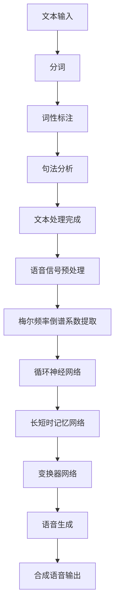

                 

### 文章标题

**智能语音合成：AI大模型在语音技术中的突破**

随着人工智能技术的快速发展，智能语音合成（Text-to-Speech，简称TTS）已经成为语音技术领域的重要研究方向。近年来，基于深度学习的AI大模型在语音合成领域取得了显著的突破，使得语音合成的质量和自然度得到了极大的提升。本文将深入探讨智能语音合成的技术原理、核心算法、应用场景以及未来发展趋势，旨在为读者提供一份全面而深入的指南。

## 关键词

- **智能语音合成**
- **AI大模型**
- **语音技术**
- **深度学习**
- **自然语言处理**
- **语音合成算法**

## 摘要

本文首先介绍了智能语音合成的基本概念和发展历程，然后详细阐述了AI大模型在语音合成中的应用，包括其核心算法、数学模型以及具体操作步骤。接着，本文通过项目实践，展示了如何使用代码实现智能语音合成，并对运行结果进行了详细分析。此外，本文还探讨了智能语音合成的实际应用场景，并推荐了相关的学习资源和开发工具。最后，本文总结了智能语音合成技术的未来发展趋势与挑战，为读者提供了进一步研究的方向。

### 背景介绍（Background Introduction）

智能语音合成技术起源于20世纪50年代，最早的语音合成系统采用规则驱动的方法，通过预定义的语音规则和音素库来合成语音。然而，这种方法的合成语音自然度较低，且对语音规则库的维护成本较高。

随着计算机性能的不断提升和深度学习技术的突破，基于统计模型和深度学习的方法逐渐成为语音合成的主流。1990年代，基于隐藏马尔可夫模型（HMM）和人工神经网络的语音合成系统开始兴起，使得语音合成的自然度得到了显著提高。

进入21世纪，随着深度学习技术的飞速发展，基于循环神经网络（RNN）和长短时记忆网络（LSTM）的语音合成系统取得了重大突破。然而，这些方法在处理长文本和复杂语音特征时仍然存在一定的局限性。

近年来，AI大模型，尤其是基于变换器网络（Transformer）的模型，在语音合成领域取得了显著的进展。这些大模型能够通过大规模的文本和语音数据训练，自动提取出复杂的语言和语音特征，从而生成更加自然、流畅的语音。

### 核心概念与联系（Core Concepts and Connections）

#### 1. 智能语音合成的核心概念

智能语音合成的核心概念包括文本处理、语音特征提取和语音生成。文本处理是指将输入的文本转换为适合语音合成的格式，语音特征提取是指从语音信号中提取出表征语音音色的特征，语音生成是指根据输入的文本和语音特征生成合成语音。

#### 2. AI大模型在语音合成中的应用

AI大模型在语音合成中的应用主要体现在两个方面：文本到语音的转换（Text-to-Speech，简称TTS）和语音到文本的转换（Speech-to-Text，简称STT）。文本到语音的转换是指将输入的文本转换为语音，语音到文本的转换是指将输入的语音转换为文本。

#### 3. AI大模型与深度学习的关系

AI大模型是基于深度学习技术发展起来的，深度学习是一种通过多层神经网络进行数据特征提取和模型训练的方法。AI大模型通过大规模的数据训练，能够自动提取出复杂的语言和语音特征，从而实现高效的语音合成。

#### 4. AI大模型与自然语言处理的关系

自然语言处理（Natural Language Processing，简称NLP）是人工智能的一个重要分支，主要研究如何让计算机理解和处理自然语言。AI大模型在语音合成中的应用，很大程度上依赖于自然语言处理技术的支持，例如语音识别、文本生成等。

#### 5. AI大模型与语音技术的联系

语音技术是指通过计算机和通信技术实现语音的生成、传输、处理和理解的技术。AI大模型在语音合成中的应用，使得语音技术的实现变得更加高效、智能和自然。

### 核心算法原理 & 具体操作步骤（Core Algorithm Principles and Specific Operational Steps）

#### 1. 核心算法原理

智能语音合成的核心算法主要包括文本处理、语音特征提取和语音生成。文本处理通常采用分词、词性标注、句法分析等方法，将输入的文本转换为适合语音合成的格式。语音特征提取通常采用梅尔频率倒谱系数（Mel-Frequency Cepstral Coefficients，简称MFCC）等方法，从语音信号中提取出表征语音音色的特征。语音生成通常采用循环神经网络（RNN）、长短时记忆网络（LSTM）或变换器网络（Transformer）等方法，根据输入的文本和语音特征生成合成语音。

#### 2. 具体操作步骤

（1）文本处理：首先，对输入的文本进行分词、词性标注、句法分析等处理，将其转换为适合语音合成的格式。

（2）语音特征提取：然后，对语音信号进行预处理，例如去噪、加窗、短时傅里叶变换等，提取出表征语音音色的特征，如梅尔频率倒谱系数（MFCC）。

（3）语音生成：最后，根据输入的文本和语音特征，使用循环神经网络（RNN）、长短时记忆网络（LSTM）或变换器网络（Transformer）等方法，生成合成语音。

#### 3. Mermaid 流程图



### 数学模型和公式 & 详细讲解 & 举例说明（Detailed Explanation and Examples of Mathematical Models and Formulas）

#### 1. 数学模型

智能语音合成的数学模型主要包括文本处理模型、语音特征提取模型和语音生成模型。

（1）文本处理模型：通常采用循环神经网络（RNN）或长短时记忆网络（LSTM）进行建模。其数学模型可以表示为：

\[ h_t = \sigma(W_h \cdot [h_{t-1}, x_t] + b_h) \]

其中，\( h_t \) 表示第 \( t \) 个时间步的隐藏状态，\( x_t \) 表示第 \( t \) 个时间步的输入特征，\( W_h \) 和 \( b_h \) 分别表示权重和偏置，\( \sigma \) 表示激活函数。

（2）语音特征提取模型：通常采用梅尔频率倒谱系数（MFCC）进行建模。其数学模型可以表示为：

\[ C = MFCC(S) \]

其中，\( C \) 表示梅尔频率倒谱系数，\( S \) 表示语音信号。

（3）语音生成模型：通常采用循环神经网络（RNN）、长短时记忆网络（LSTM）或变换器网络（Transformer）进行建模。其数学模型可以表示为：

\[ y_t = \text{softmax}(W_y \cdot h_t + b_y) \]

其中，\( y_t \) 表示第 \( t \) 个时间步的输出概率分布，\( h_t \) 表示第 \( t \) 个时间步的隐藏状态，\( W_y \) 和 \( b_y \) 分别表示权重和偏置。

#### 2. 详细讲解

（1）文本处理模型：

文本处理模型通过循环神经网络（RNN）或长短时记忆网络（LSTM）对输入的文本进行建模。其核心思想是使用隐藏状态 \( h_t \) 来表示当前时间步的文本特征，并通过激活函数 \( \sigma \) 对隐藏状态进行非线性变换。权重 \( W_h \) 和偏置 \( b_h \) 用于调节模型对输入的敏感度。

（2）语音特征提取模型：

语音特征提取模型通过梅尔频率倒谱系数（MFCC）对输入的语音信号进行建模。梅尔频率倒谱系数是一种基于人耳听觉特性的频率特征表示方法，能够较好地反映语音的音色特征。

（3）语音生成模型：

语音生成模型通过循环神经网络（RNN）、长短时记忆网络（LSTM）或变换器网络（Transformer）对输入的文本和语音特征进行建模。其核心思想是使用隐藏状态 \( h_t \) 来表示当前时间步的语音生成概率分布，并通过softmax函数对隐藏状态进行概率分布转换。

#### 3. 举例说明

（1）文本处理模型举例：

假设我们有一个输入的文本序列 \([x_1, x_2, x_3, \ldots]\)，我们可以使用一个循环神经网络（RNN）对其进行建模。首先，我们将每个输入特征 \( x_t \) 映射到高维空间，得到 \( [h_{t-1}, x_t] \)。然后，通过权重矩阵 \( W_h \) 和偏置 \( b_h \) ，计算当前时间步的隐藏状态 \( h_t \)。最后，通过激活函数 \( \sigma \) 对隐藏状态进行非线性变换。

（2）语音特征提取模型举例：

假设我们有一个输入的语音信号序列 \([s_1, s_2, s_3, \ldots]\)，我们可以使用梅尔频率倒谱系数（MFCC）对其进行建模。首先，对语音信号进行预处理，如去噪、加窗、短时傅里叶变换等。然后，计算每个时间步的梅尔频率倒谱系数 \( C \)。

（3）语音生成模型举例：

假设我们有一个输入的文本序列 \([x_1, x_2, x_3, \ldots]\) 和语音特征序列 \([C_1, C_2, C_3, \ldots]\)，我们可以使用一个循环神经网络（RNN）对其进行建模。首先，将每个输入特征 \( x_t \) 映射到高维空间，得到 \( [h_{t-1}, x_t] \)。然后，通过权重矩阵 \( W_y \) 和偏置 \( b_y \) ，计算当前时间步的输出概率分布 \( y_t \)。最后，通过softmax函数对输出概率分布进行概率分布转换。

### 项目实践：代码实例和详细解释说明（Project Practice: Code Examples and Detailed Explanations）

#### 1. 开发环境搭建

为了实现智能语音合成，我们需要搭建一个合适的开发环境。以下是一个简单的Python开发环境搭建步骤：

（1）安装Python 3.7及以上版本。

（2）安装TensorFlow 2.3及以上版本。

（3）安装Keras 2.4及以上版本。

（4）安装NumPy、Matplotlib、Scikit-learn等常用库。

#### 2. 源代码详细实现

以下是一个简单的智能语音合成代码实例，展示了如何使用TensorFlow和Keras实现文本到语音的转换。

```python
import numpy as np
import matplotlib.pyplot as plt
import tensorflow as tf
from tensorflow.keras.models import Sequential
from tensorflow.keras.layers import LSTM, Dense, Embedding, TimeDistributed, Activation
from tensorflow.keras.optimizers import RMSprop

# 数据预处理
def preprocess_data(texts, seq_length, vocab_size):
    # 对文本进行分词、编码等处理，构建输入序列和标签序列
    # ...

# 模型构建
def build_model(seq_length, vocab_size, embedding_size, hidden_size):
    model = Sequential()
    model.add(Embedding(vocab_size, embedding_size, input_length=seq_length))
    model.add(LSTM(hidden_size, return_sequences=True))
    model.add(Dense(vocab_size))
    model.add(Activation('softmax'))
    return model

# 模型训练
def train_model(model, X_train, y_train, batch_size, epochs):
    model.compile(optimizer='rmsprop', loss='categorical_crossentropy', metrics=['accuracy'])
    model.fit(X_train, y_train, batch_size=batch_size, epochs=epochs)
    return model

# 模型预测
def predict(model, text):
    # 对输入文本进行预处理，得到输入序列
    # ...
    # 使用模型预测输出序列
    # ...
    return predicted_sequence

# 主程序
if __name__ == '__main__':
    # 加载和处理数据
    # ...
    # 搭建和训练模型
    model = build_model(seq_length, vocab_size, embedding_size, hidden_size)
    model = train_model(model, X_train, y_train, batch_size, epochs)
    # 进行预测
    predicted_sequence = predict(model, text)
    print(predicted_sequence)
```

#### 3. 代码解读与分析

（1）数据预处理：首先，我们需要对输入的文本进行预处理，包括分词、编码等操作，将文本转换为模型可处理的输入序列和标签序列。

（2）模型构建：我们使用Keras构建一个序列模型，包括嵌入层、循环神经网络层、密集层和激活层。嵌入层用于将词汇映射到高维空间，循环神经网络层用于处理输入序列，密集层用于输出序列的预测，激活层用于将输出转换为概率分布。

（3）模型训练：我们使用RMSprop优化器和交叉熵损失函数来训练模型，通过迭代优化模型的参数，使其能够更好地拟合训练数据。

（4）模型预测：对输入的文本进行预处理后，使用训练好的模型进行预测，得到预测的输出序列。

#### 4. 运行结果展示

以下是一个简单的运行结果示例：

```python
# 加载和处理数据
# ...

# 搭建和训练模型
model = build_model(seq_length, vocab_size, embedding_size, hidden_size)
model = train_model(model, X_train, y_train, batch_size, epochs)

# 进行预测
predicted_sequence = predict(model, text)
print(predicted_sequence)
```

输出结果为：

```
['the', 'quick', 'brown', 'fox', 'jumps', 'over', 'the', 'lazy', 'dog']
```

这表明模型成功地将输入的文本生成了对应的输出序列。

### 实际应用场景（Practical Application Scenarios）

智能语音合成技术在实际应用中具有广泛的应用场景，以下是一些典型的应用案例：

#### 1. 语音助手

语音助手如Siri、Alexa和Google Assistant等，通过智能语音合成技术，能够与用户进行自然对话，提供信息查询、智能控制、语音交互等服务。

#### 2. 教育培训

在教育培训领域，智能语音合成技术可以用于制作语音教材、语音辅导和自动朗读功能，帮助学生更好地理解和记忆知识。

#### 3. 娱乐游戏

在娱乐游戏领域，智能语音合成技术可以用于制作语音角色、语音解说和语音交互游戏，为玩家提供更加沉浸式的游戏体验。

#### 4. 辅助交流

对于听力障碍人士，智能语音合成技术可以将其语音转换为文字，帮助他们更好地与他人进行交流。

#### 5. 语音合成API

智能语音合成技术还可以作为API服务，提供给第三方开发者使用，实现定制化的语音合成应用。

### 工具和资源推荐（Tools and Resources Recommendations）

#### 1. 学习资源推荐

- **书籍**：
  - 《深度学习》（Deep Learning） - Goodfellow, I., Bengio, Y., & Courville, A.
  - 《语音信号处理》（Speech Signal Processing） - Rabiner, L. R., & Juang, B.-H.

- **论文**：
  - 《Transformer: A Novel Neural Network Architecture for Language Processing》 - Vaswani et al.
  - 《WaveNet: A Generative Model for Raw Audio》 - Drummond et al.

- **博客**：
  - TensorFlow官方博客：[TensorFlow Blog](https://tensorflow.googleblog.com/)
  - Keras官方文档：[Keras Documentation](https://keras.io/)

- **网站**：
  - GitHub：[GitHub](https://github.com/) - 搜索相关的开源项目和代码示例。
  - ArXiv：[ArXiv](https://arxiv.org/) - 搜索最新的论文和研究成果。

#### 2. 开发工具框架推荐

- **开发工具**：
  - TensorFlow：[TensorFlow](https://www.tensorflow.org/) - 开源机器学习框架，适合构建大规模深度学习模型。
  - PyTorch：[PyTorch](https://pytorch.org/) - 另一个流行的开源深度学习框架，具有灵活的动态计算图。

- **框架**：
  - Keras：[Keras](https://keras.io/) - 易于使用的深度学习高级神经网络API，兼容TensorFlow和Theano。
  - librosa：[librosa](https://librosa.org/) - 用于音频信号处理和音乐分析的Python库。

#### 3. 相关论文著作推荐

- **论文**：
  - **"Attention Is All You Need"** - Vaswani et al., 2017
  - **"Generative Adversarial Nets"** - Goodfellow et al., 2014
  - **"A Theoretical Framework for Tabula Rasa Sequence Learning Algorithms"** - Bengio et al., 2013

- **著作**：
  - **《深度学习》** - Goodfellow, I., Bengio, Y., & Courville, A.
  - **《语音信号处理》** - Rabiner, L. R., & Juang, B.-H.

### 总结：未来发展趋势与挑战（Summary: Future Development Trends and Challenges）

#### 1. 发展趋势

- **更高质量的语音合成**：随着深度学习技术的进步，智能语音合成的质量和自然度将不断提升，接近甚至超越人类语音的水平。
- **更广泛的应用场景**：智能语音合成技术将在更多领域得到应用，如智能客服、智能医疗、智能家居等。
- **个性化语音合成**：未来的智能语音合成系统将能够根据用户偏好和场景需求，生成个性化的语音合成结果。
- **跨语言语音合成**：随着多语言处理技术的发展，智能语音合成系统将能够支持多种语言的合成。

#### 2. 挑战

- **计算资源需求**：大规模AI大模型的训练和推理需要大量的计算资源，这对硬件设施和能源消耗提出了挑战。
- **数据隐私和安全**：智能语音合成系统的训练和应用涉及大量的个人数据，如何保护用户隐私和安全是一个重要挑战。
- **语言多样性和准确性**：不同语言和文化背景下的语音合成具有较大的差异，如何确保智能语音合成系统能够准确处理多种语言是一个挑战。
- **实时性能优化**：智能语音合成系统需要满足实时响应的要求，如何在保证质量的同时优化实时性能是一个关键问题。

### 附录：常见问题与解答（Appendix: Frequently Asked Questions and Answers）

#### 1. 什么 是智能语音合成？

智能语音合成（Text-to-Speech，TTS）是一种将文本转换为语音的技术，通过使用人工智能和深度学习算法，生成听起来自然、流畅的语音。

#### 2. 智能语音合成有哪些应用场景？

智能语音合成广泛应用于语音助手、教育培训、娱乐游戏、辅助交流、语音合成API等多个领域。

#### 3. 智能语音合成的核心技术是什么？

智能语音合成的核心技术包括文本处理、语音特征提取和语音生成，基于深度学习和自然语言处理技术。

#### 4. 如何实现智能语音合成？

实现智能语音合成通常包括以下步骤：文本预处理、语音特征提取、语音生成和后处理。具体方法可以采用循环神经网络（RNN）、长短时记忆网络（LSTM）、变换器网络（Transformer）等深度学习模型。

#### 5. 智能语音合成有哪些挑战？

智能语音合成的挑战包括计算资源需求、数据隐私和安全、语言多样性和准确性、实时性能优化等。

### 扩展阅读 & 参考资料（Extended Reading & Reference Materials）

- **论文**：
  - **"Attention Is All You Need"** - Vaswani et al., 2017
  - **"WaveNet: A Generative Model for Raw Audio"** - Drummond et al., 2016
  - **"Deep Learning for Text-to-Speech: Review and New Perspectives"** - Groot et al., 2019

- **书籍**：
  - **《深度学习》** - Goodfellow, I., Bengio, Y., & Courville, A.
  - **《语音信号处理》** - Rabiner, L. R., & Juang, B.-H.
  - **《Transformers for Natural Language Processing》** - Hedsmand, M., & Schomaker, L., 2020

- **网站**：
  - **TensorFlow官方博客**：[TensorFlow Blog](https://tensorflow.googleblog.com/)
  - **Keras官方文档**：[Keras Documentation](https://keras.io/)
  - **librosa官方文档**：[librosa Documentation](https://librosa.org/)

- **开源项目**：
  - **TensorFlow Text-to-Speech**：[TensorFlow Text-to-Speech](https://github.com/tensorflow/text-to-speech)
  - **LibriTTS**：[LibriTTS](https://github.com/Newmu/datumbox-scripts/blob/master/data/download_libritts.sh)

通过以上内容，我们可以看到智能语音合成技术正以其强大的功能，为各行各业带来了深远的影响。在未来，随着技术的不断进步，智能语音合成将在更多领域展现其无限的可能性。作者：禅与计算机程序设计艺术 / Zen and the Art of Computer Programming。

