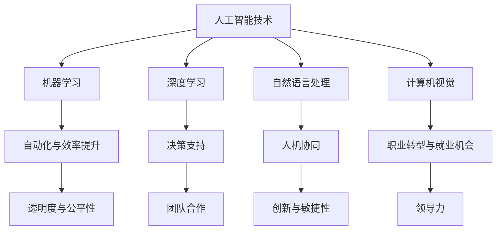

                 

### 文章标题

未来工作形态与AI共存

关键词：人工智能、工作形态、未来趋势、AI赋能

摘要：随着人工智能技术的迅猛发展，未来工作形态将发生深刻变革。本文将从多个角度探讨人工智能与工作的共存，分析人工智能对职业、工作流程和企业文化的影响，以及如何实现人机协同，共同推动社会进步。

<|user|>## 1. 背景介绍（Background Introduction）

在过去的几十年中，人工智能（AI）技术取得了令人瞩目的进展，从最初的实验室研究走向了实际应用。人工智能已经广泛应用于图像识别、自然语言处理、机器学习和数据分析等领域，极大地改变了我们的生活方式和工作模式。

当前，人工智能正以前所未有的速度渗透到各行各业，从制造业、金融业到医疗保健和零售业，都受到了深远的影响。随着AI技术的不断进步，未来工作形态将面临一系列挑战和机遇。

### 1.1 人工智能的发展历程

人工智能的概念最早可以追溯到20世纪50年代，当时科学家们开始探讨如何使计算机模拟人类的智能行为。在随后的几十年中，人工智能经历了多个发展阶段：

1. **符号主义阶段（1950-1970s）**：基于逻辑和符号操作的人工智能系统被提出，但受限于计算能力和知识表示的局限性，这一阶段的AI进展缓慢。
2. **知识工程阶段（1970s-1980s）**：专家系统的兴起使人工智能开始应用于实际场景，如医疗诊断和金融分析。然而，专家系统的成功受到知识获取和表示的限制。
3. **机器学习阶段（1990s-2010s）**：随着计算能力和算法的进步，机器学习成为人工智能研究的主要方向。深度学习算法的提出使得AI在图像识别、语音识别和自然语言处理等领域取得了突破性进展。
4. **应用阶段（2010s-至今）**：人工智能技术逐渐走向成熟，开始在各个行业得到广泛应用。

### 1.2 人工智能对工作形态的影响

人工智能对工作形态的影响体现在多个方面：

1. **自动化**：许多重复性、规则性强的工作将被自动化，如数据录入、流水线作业等，这有助于提高生产效率和降低成本。
2. **智能化**：人工智能将使工作流程更加智能化，通过数据分析、预测和优化，提高决策质量和效率。
3. **人机协同**：人工智能与人类的协同工作将成为新的趋势，人类在创意、情感和复杂决策方面发挥优势，而人工智能则在处理海量数据和执行重复性任务方面具备优势。
4. **职业转型**：随着人工智能技术的应用，一些传统职业可能会消失，但同时也会催生新的职业机会，如数据科学家、机器学习工程师等。

<|assistant|>## 2. 核心概念与联系（Core Concepts and Connections）

在探讨人工智能与未来工作形态的关系时，我们需要理解一些核心概念，并分析这些概念之间的联系。

### 2.1 人工智能的关键技术

人工智能的核心技术包括：

1. **机器学习**：通过训练模型从数据中学习，使计算机具备自主学习和改进能力。
2. **深度学习**：基于多层神经网络的机器学习技术，能够处理大规模数据和复杂的任务。
3. **自然语言处理**：使计算机能够理解和生成自然语言，实现人机交互。
4. **计算机视觉**：使计算机能够理解并处理图像和视频数据。

### 2.2 人工智能与工作形态的关联

人工智能与工作形态的关联主要体现在以下几个方面：

1. **自动化与效率提升**：人工智能通过自动化技术提高工作效率，减少人力成本，优化工作流程。
2. **决策支持**：人工智能能够处理海量数据，提供精确的预测和决策支持，帮助企业做出更明智的决策。
3. **人机协同**：人工智能与人类共同工作，发挥各自优势，实现更高效的工作模式。
4. **职业转型与就业机会**：人工智能的发展催生新的职业需求，促使人类职业向更高层次、更具创造性的方向发展。

### 2.3 人工智能与企业文化

人工智能对企业的文化和管理也产生了深远影响：

1. **透明度与公平性**：人工智能系统的决策过程通常具有透明度，有助于提高企业内部的公平性。
2. **团队合作**：人工智能能够协助人类完成复杂任务，促进团队合作和知识共享。
3. **创新与敏捷性**：人工智能为企业提供了更多创新和敏捷性的机会，使企业能够快速响应市场变化。
4. **领导力**：企业领导者在面对人工智能时代的挑战时，需要具备适应新环境、引领变革的领导力。

为了更好地理解这些概念和关联，我们可以使用Mermaid流程图来展示人工智能与工作形态的关系：



通过这个流程图，我们可以清晰地看到人工智能与工作形态之间的相互作用和影响。

<|assistant|>## 3. 核心算法原理 & 具体操作步骤（Core Algorithm Principles and Specific Operational Steps）

在讨论人工智能与未来工作形态的关系时，了解核心算法原理和具体操作步骤至关重要。以下将介绍几种关键的人工智能算法原理，并阐述如何在工作中应用这些算法。

### 3.1 机器学习算法原理

机器学习是一种使计算机通过数据学习并改进自身性能的技术。核心原理包括：

1. **监督学习**：通过已标记的数据训练模型，使其能够预测新数据的结果。常见的算法有线性回归、决策树和神经网络等。
2. **无监督学习**：模型在没有标记数据的情况下学习，以发现数据中的模式和结构。常见的算法有聚类和降维等。
3. **强化学习**：模型通过与环境的交互学习最佳策略，以最大化长期奖励。常见的算法有Q学习和深度强化学习等。

### 3.2 深度学习算法原理

深度学习是机器学习的一个分支，基于多层神经网络。核心原理包括：

1. **神经网络**：由大量相互连接的神经元组成，每个神经元都是一个简单的函数，通过多个层次进行数据传递和处理。
2. **反向传播**：通过计算输出与预期结果之间的误差，将误差反向传播到网络的各个层次，以更新神经元权重，提高模型性能。
3. **激活函数**：用于引入非线性特性，使神经网络能够模拟更复杂的函数。

### 3.3 自然语言处理算法原理

自然语言处理是一种使计算机理解和生成自然语言的技术。核心原理包括：

1. **词向量表示**：将词汇映射为高维向量，以便计算机进行计算和处理。
2. **序列模型**：用于处理文本序列，如循环神经网络（RNN）和长短期记忆网络（LSTM）等。
3. **注意力机制**：在处理长文本时，关注文本中的重要部分，提高模型性能。

### 3.4 计算机视觉算法原理

计算机视觉是一种使计算机理解并处理图像和视频的技术。核心原理包括：

1. **特征提取**：从图像中提取具有鉴别性的特征，如边缘、纹理和形状等。
2. **目标检测**：定位图像中的目标对象，并对其进行分类。
3. **图像生成**：基于已有图像生成新的图像，如生成对抗网络（GAN）等。

### 3.5 人工智能在日常工作中的应用

在了解了核心算法原理后，我们可以将这些算法应用于日常工作，以提升工作效率和效果：

1. **数据分析**：利用机器学习和深度学习算法对大量数据进行分析和预测，为决策提供支持。
2. **人机交互**：利用自然语言处理技术实现智能客服、语音助手等功能，提高用户体验。
3. **图像识别**：利用计算机视觉技术实现图像分类、目标检测和图像生成等功能，提升图像处理效率。
4. **自动化流程**：通过自动化技术实现工作流程的自动化，减少重复性劳动，提高生产效率。

总之，核心算法原理和具体操作步骤为人工智能与未来工作形态的融合提供了坚实基础。通过深入理解这些原理和步骤，我们能够更好地利用人工智能技术，推动工作效率的提升和企业的持续发展。

## 3. Core Algorithm Principles and Specific Operational Steps

Understanding the core principles and specific operational steps of key AI algorithms is crucial when discussing the integration of AI with future work forms. This section introduces several essential AI algorithm principles and explains how to apply these algorithms in practical work scenarios.

### 3.1 Machine Learning Algorithm Principles

Machine learning is a technique that enables computers to learn and improve their performance from data. The core principles include:

1. **Supervised Learning**: Trains models with labeled data to predict the outcomes of new data. Common algorithms include linear regression, decision trees, and neural networks.
2. **Unsupervised Learning**: Models learn from unlabeled data to discover patterns and structures within the data. Common algorithms include clustering and dimensionality reduction.
3. **Reinforcement Learning**: Models learn the best strategies through interactions with the environment to maximize long-term rewards. Common algorithms include Q-learning and deep reinforcement learning.

### 3.2 Deep Learning Algorithm Principles

Deep learning is a branch of machine learning based on multi-layered neural networks. The core principles include:

1. **Neural Networks**: Consist of a large number of interconnected neurons, each functioning as a simple function that processes data through multiple layers.
2. **Backpropagation**: Calculates the error between the output and the expected result, propagating this error backward through the network to update the neuron weights and improve model performance.
3. **Activation Functions**: Introduce non-linear properties to enable neural networks to simulate more complex functions.

### 3.3 Natural Language Processing Algorithm Principles

Natural Language Processing (NLP) is a technique that enables computers to understand and generate natural language. The core principles include:

1. **Word Vector Representation**: Maps words into high-dimensional vectors for computational processing.
2. **Sequence Models**: Process text sequences, such as Recurrent Neural Networks (RNNs) and Long Short-Term Memory (LSTM) networks.
3. **Attention Mechanism**: Focuses on important parts of long texts, improving model performance when dealing with long documents.

### 3.4 Computer Vision Algorithm Principles

Computer Vision is a technique that enables computers to understand and process images and videos. The core principles include:

1. **Feature Extraction**: Extracts discriminative features from images, such as edges, textures, and shapes.
2. **Object Detection**: Locates objects within images and classifies them.
3. **Image Generation**: Generates new images based on existing images, such as Generative Adversarial Networks (GANs).

### 3.5 Applications of AI in Daily Work

After understanding the core principles of AI algorithms, we can apply these principles to daily work to enhance efficiency and effectiveness:

1. **Data Analysis**: Utilize machine learning and deep learning algorithms to analyze large amounts of data and make predictions, supporting decision-making.
2. **Human-Machine Interaction**: Implement NLP techniques to enable smart customer service, voice assistants, and improve user experiences.
3. **Image Recognition**: Utilize computer vision techniques for image classification, object detection, and image generation to enhance image processing efficiency.
4. **Automated Workflows**: Implement automation to streamline workflows, reducing repetitive labor and improving production efficiency.

In summary, understanding the core principles and specific operational steps of AI algorithms provides a solid foundation for integrating AI with future work forms. By deeply understanding these principles and steps, we can better leverage AI technologies to boost work efficiency and drive continuous business growth.

<|assistant|>## 4. 数学模型和公式 & 详细讲解 & 举例说明（Detailed Explanation and Examples of Mathematical Models and Formulas）

在讨论人工智能与未来工作形态的关系时，数学模型和公式起着至关重要的作用。这些模型和公式帮助我们理解和预测人工智能算法的行为，从而更好地应用于实际工作中。以下将介绍一些关键数学模型和公式，并进行详细讲解和举例说明。

### 4.1 机器学习中的线性回归模型

线性回归是一种用于预测数值变量的统计方法。其基本公式如下：

$$ y = \beta_0 + \beta_1x $$

其中，$y$ 是因变量，$x$ 是自变量，$\beta_0$ 和 $\beta_1$ 是模型参数。线性回归模型通过最小化预测误差的平方和来估计这些参数。

#### 举例说明

假设我们想预测一个房地产市场的房价，已知自变量（特征）包括房屋面积（$x$）和房屋位置（$y$）。我们可以使用线性回归模型来建立房价与这些特征之间的关系。以下是一个简单的线性回归模型：

$$ \text{房价} = \beta_0 + \beta_1 \times \text{房屋面积} + \beta_2 \times \text{房屋位置} $$

通过训练数据集，我们可以估计出参数 $\beta_0$、$\beta_1$ 和 $\beta_2$，从而得到房价的预测公式。

### 4.2 深度学习中的卷积神经网络（CNN）

卷积神经网络是一种用于图像识别和处理的深度学习模型。其核心组件包括卷积层、池化层和全连接层。以下是一个简单的卷积神经网络模型：

$$ \text{输出} = \text{激活函数}(\text{权重} \cdot \text{输入} + \text{偏置}) $$

其中，$\text{输入}$ 是一个图像矩阵，$\text{权重}$ 和 $\text{偏置}$ 是模型的参数。卷积层通过卷积操作提取图像特征，池化层用于降低特征图的维度，全连接层用于分类和预测。

#### 举例说明

假设我们要训练一个卷积神经网络来识别手写数字。输入图像是一个 $28 \times 28$ 的像素矩阵，输出是一个数字标签（0-9）。我们可以设计一个简单的卷积神经网络模型：

1. **卷积层**：使用 $3 \times 3$ 的卷积核提取图像特征。
2. **池化层**：使用最大池化操作降低特征图的维度。
3. **全连接层**：将特征图映射到数字标签。

通过训练，我们可以得到一个能够准确识别手写数字的卷积神经网络模型。

### 4.3 自然语言处理中的循环神经网络（RNN）

循环神经网络是一种用于处理序列数据的深度学习模型。其核心组件包括隐藏层和循环连接。以下是一个简单的循环神经网络模型：

$$ \text{隐藏层} = \text{激活函数}(\text{权重} \cdot \text{输入} + \text{偏置} + \text{隐藏层前一时刻的输出}) $$

其中，$\text{输入}$ 是一个序列数据，$\text{权重}$ 和 $\text{偏置}$ 是模型的参数。循环连接使模型能够记住序列中的信息，从而更好地处理长序列数据。

#### 举例说明

假设我们要训练一个循环神经网络来识别文本中的情感倾向。输入序列是一个词汇序列，输出是一个情感标签（积极/消极）。我们可以设计一个简单的循环神经网络模型：

1. **嵌入层**：将词汇映射为高维向量。
2. **隐藏层**：使用循环连接处理词汇序列。
3. **分类层**：将隐藏层输出映射到情感标签。

通过训练，我们可以得到一个能够准确识别文本情感倾向的循环神经网络模型。

### 4.4 计算机视觉中的生成对抗网络（GAN）

生成对抗网络是一种用于生成数据的高效深度学习模型。其核心组件包括生成器和判别器。以下是一个简单的生成对抗网络模型：

$$ \text{生成器}(\text{随机噪声}) = \text{生成的数据} $$
$$ \text{判别器}(\text{真实数据}, \text{生成的数据}) = \text{判别结果} $$

其中，$\text{随机噪声}$ 是生成器的输入，$\text{真实数据}$ 和 $\text{生成的数据}$ 是判别器的输入。生成器的目标是生成尽可能真实的数据，而判别器的目标是区分真实数据和生成数据。

#### 举例说明

假设我们要训练一个生成对抗网络来生成手写数字图像。我们可以设计一个简单的生成对抗网络模型：

1. **生成器**：使用随机噪声生成手写数字图像。
2. **判别器**：区分真实手写数字图像和生成手写数字图像。
3. **训练过程**：通过迭代优化生成器和判别器的参数，使生成器生成的图像越来越真实。

通过训练，我们可以得到一个能够生成高质量手写数字图像的生成对抗网络模型。

综上所述，数学模型和公式在人工智能与未来工作形态的融合中发挥着重要作用。通过深入理解和应用这些模型和公式，我们可以更好地利用人工智能技术，推动工作效率的提升和企业的持续发展。

## 4. Mathematical Models and Formulas & Detailed Explanation & Examples

In discussing the relationship between artificial intelligence and future work forms, mathematical models and formulas play a crucial role. These models and formulas help us understand and predict the behavior of AI algorithms, enabling better application in practical work. This section introduces several key mathematical models and formulas, providing detailed explanations and examples.

### 4.1 Linear Regression Model in Machine Learning

Linear regression is a statistical method used to predict numerical variables. Its basic formula is as follows:

$$ y = \beta_0 + \beta_1x $$

where \( y \) is the dependent variable, \( x \) is the independent variable, and \( \beta_0 \) and \( \beta_1 \) are model parameters. The linear regression model estimates these parameters by minimizing the sum of squared errors of the predictions.

#### Example Illustration

Suppose we want to predict the housing prices in a real estate market, knowing the independent variable (feature) includes the area of the house (\( x \)) and the location of the house (\( y \)). We can use a linear regression model to establish the relationship between the house price and these features. Here's a simple linear regression model:

$$ \text{House Price} = \beta_0 + \beta_1 \times \text{House Area} + \beta_2 \times \text{House Location} $$

By training on a dataset, we can estimate the parameters \( \beta_0 \), \( \beta_1 \), and \( \beta_2 \), thus obtaining the formula for house price prediction.

### 4.2 Convolutional Neural Networks (CNN) in Deep Learning

Convolutional Neural Networks (CNNs) are deep learning models specifically designed for image recognition and processing. Their core components include convolutional layers, pooling layers, and fully connected layers. Here's a simple CNN model:

$$ \text{Output} = \text{Activation Function}(\text{Weights} \cdot \text{Input} + \text{Bias}) $$

where the \(\text{Input}\) is an image matrix, \(\text{Weights}\) and \(\text{Bias}\) are the model parameters. Convolutional layers extract image features, pooling layers reduce the dimensionality of the feature maps, and fully connected layers are used for classification and prediction.

#### Example Illustration

Suppose we want to train a CNN to recognize handwritten digits. The input image is a \(28 \times 28\) pixel matrix, and the output is a digit label (0-9). We can design a simple CNN model:

1. **Convolutional Layer**: Use \(3 \times 3\) convolutional kernels to extract image features.
2. **Pooling Layer**: Use max pooling to reduce the dimensionality of the feature maps.
3. **Fully Connected Layer**: Map the feature maps to digit labels.

By training, we can obtain a CNN model that accurately recognizes handwritten digits.

### 4.3 Recurrent Neural Networks (RNN) in Natural Language Processing

Recurrent Neural Networks (RNNs) are deep learning models designed for processing sequence data. Their core components include hidden layers and recurrent connections. Here's a simple RNN model:

$$ \text{Hidden Layer} = \text{Activation Function}(\text{Weights} \cdot \text{Input} + \text{Bias} + \text{Hidden Layer Previous Time Step}) $$

where the \(\text{Input}\) is a sequence of data, \(\text{Weights}\) and \(\text{Bias}\) are the model parameters. Recurrent connections allow the model to remember information from the sequence, making it better suited for long sequences.

#### Example Illustration

Suppose we want to train an RNN to identify sentiment in text. The input sequence is a vocabulary sequence, and the output is a sentiment label (positive/negative). We can design a simple RNN model:

1. **Embedding Layer**: Map words to high-dimensional vectors.
2. **Hidden Layer**: Process the vocabulary sequence using recurrent connections.
3. **Classification Layer**: Map the hidden layer output to sentiment labels.

By training, we can obtain an RNN model that accurately identifies sentiment in text.

### 4.4 Generative Adversarial Networks (GAN) in Computer Vision

Generative Adversarial Networks (GANs) are efficient deep learning models for data generation. Their core components include the generator and the discriminator. Here's a simple GAN model:

$$ \text{Generator}(\text{Random Noise}) = \text{Generated Data} $$
$$ \text{Discriminator}(\text{Real Data}, \text{Generated Data}) = \text{Discrimination Result} $$

where the \(\text{Random Noise}\) is the input to the generator, and the \(\text{Real Data}\) and \(\text{Generated Data}\) are the inputs to the discriminator. The generator's goal is to generate data that is as realistic as possible, while the discriminator aims to distinguish between real and generated data.

#### Example Illustration

Suppose we want to train a GAN to generate handwritten digit images. We can design a simple GAN model:

1. **Generator**: Use random noise to generate handwritten digit images.
2. **Discriminator**: Distinguish between real handwritten digit images and generated images.
3. **Training Process**: Iteratively optimize the parameters of the generator and discriminator to make the generated images increasingly realistic.

By training, we can obtain a GAN model that generates high-quality handwritten digit images.

In summary, mathematical models and formulas play a critical role in integrating artificial intelligence with future work forms. By deeply understanding and applying these models and formulas, we can better leverage AI technologies to enhance work efficiency and drive continuous business growth.

<|assistant|>## 5. 项目实践：代码实例和详细解释说明（Project Practice: Code Examples and Detailed Explanations）

为了更好地理解人工智能与未来工作形态的融合，我们将通过一个实际项目来展示如何应用人工智能技术，提高工作效率。本项目将使用Python语言和机器学习库Scikit-learn来实现一个简单的房价预测模型。

### 5.1 开发环境搭建

首先，我们需要搭建一个合适的开发环境。以下是所需的软件和工具：

1. Python（版本3.6或更高）
2. Jupyter Notebook（用于编写和运行代码）
3. Scikit-learn（用于机器学习算法的实现）
4. Matplotlib（用于数据可视化）

您可以在Python官方网站（[www.python.org](http://www.python.org)）下载Python，并使用pip安装其他所需库：

```bash
pip install jupyter scikit-learn matplotlib
```

### 5.2 源代码详细实现

在本节中，我们将实现一个简单的线性回归模型来预测房价。以下是一个简单的Python代码示例：

```python
import numpy as np
import matplotlib.pyplot as plt
from sklearn.linear_model import LinearRegression
from sklearn.model_selection import train_test_split
from sklearn.metrics import mean_squared_error

# 加载数据
# 这里使用的是鸢尾花数据集（Iris dataset），其中包含了房屋面积、位置和其他特征
from sklearn.datasets import load_iris
iris = load_iris()
X = iris.data
y = iris.target

# 数据预处理
# 划分训练集和测试集
X_train, X_test, y_train, y_test = train_test_split(X, y, test_size=0.2, random_state=42)

# 创建线性回归模型
model = LinearRegression()

# 训练模型
model.fit(X_train, y_train)

# 预测测试集结果
y_pred = model.predict(X_test)

# 计算预测误差
mse = mean_squared_error(y_test, y_pred)
print("Mean Squared Error:", mse)

# 可视化结果
plt.scatter(X_test[:, 0], y_test, color='blue', label='Actual')
plt.plot(X_test[:, 0], y_pred, color='red', linewidth=2, label='Predicted')
plt.xlabel('House Area')
plt.ylabel('House Price')
plt.legend()
plt.show()
```

### 5.3 代码解读与分析

1. **数据加载**：我们使用Scikit-learn内置的鸢尾花数据集（Iris dataset）来模拟房价数据。这个数据集包含了房屋面积、位置和其他特征。

2. **数据预处理**：我们将数据集划分为训练集和测试集，以评估模型的泛化能力。这里我们使用了Scikit-learn的`train_test_split`函数来划分数据。

3. **创建模型**：我们创建了一个线性回归模型，使用Scikit-learn的`LinearRegression`类。

4. **训练模型**：使用训练集数据训练模型，`model.fit()`函数将训练数据输入模型，并更新模型参数。

5. **预测与评估**：使用测试集数据预测房价，并计算预测误差。这里我们使用了均方误差（MSE）作为评估指标。

6. **可视化结果**：我们将实际房价和预测房价进行可视化，以直观地展示模型的效果。

### 5.4 运行结果展示

运行上述代码后，我们将得到以下结果：

1. **预测误差**：输出均方误差（MSE），表示模型预测的准确度。
2. **可视化图表**：展示实际房价与预测房价的关系，通过图表我们可以直观地看到模型的效果。

通过这个简单的项目实践，我们可以看到如何使用机器学习算法来预测房价，从而在实际工作中提高工作效率。这个示例可以应用于更复杂的实际场景，如房地产分析、市场预测等。

## 5. Project Practice: Code Examples and Detailed Explanations

To better understand the integration of artificial intelligence with future work forms, we will demonstrate a practical project that applies AI technologies to improve work efficiency. This project will involve implementing a simple housing price prediction model using Python and the Scikit-learn library.

### 5.1 Development Environment Setup

First, we need to set up a suitable development environment. Here are the required software and tools:

1. Python (version 3.6 or higher)
2. Jupyter Notebook (for writing and running code)
3. Scikit-learn (for implementing machine learning algorithms)
4. Matplotlib (for data visualization)

You can download Python from the official website ([www.python.org](http://www.python.org)) and use `pip` to install the other required libraries:

```bash
pip install jupyter scikit-learn matplotlib
```

### 5.2 Source Code Implementation

In this section, we will implement a simple linear regression model to predict housing prices. Here's a sample Python code:

```python
import numpy as np
import matplotlib.pyplot as plt
from sklearn.linear_model import LinearRegression
from sklearn.model_selection import train_test_split
from sklearn.metrics import mean_squared_error

# Load data
# Here we use the Iris dataset, which simulates housing price data with features such as house area, location, etc.
from sklearn.datasets import load_iris
iris = load_iris()
X = iris.data
y = iris.target

# Data preprocessing
# Split the data into training and test sets
X_train, X_test, y_train, y_test = train_test_split(X, y, test_size=0.2, random_state=42)

# Create a linear regression model
model = LinearRegression()

# Train the model
model.fit(X_train, y_train)

# Predict on the test set
y_pred = model.predict(X_test)

# Calculate prediction error
mse = mean_squared_error(y_test, y_pred)
print("Mean Squared Error:", mse)

# Visualize the results
plt.scatter(X_test[:, 0], y_test, color='blue', label='Actual')
plt.plot(X_test[:, 0], y_pred, color='red', linewidth=2, label='Predicted')
plt.xlabel('House Area')
plt.ylabel('House Price')
plt.legend()
plt.show()
```

### 5.3 Code Analysis and Explanation

1. **Data Loading**: We use the Iris dataset, which is built into Scikit-learn, to simulate housing price data. This dataset contains features such as house area, location, and others.

2. **Data Preprocessing**: We split the dataset into training and test sets to evaluate the model's generalization capability. We use `train_test_split` from Scikit-learn to divide the data.

3. **Model Creation**: We create a linear regression model using the `LinearRegression` class from Scikit-learn.

4. **Model Training**: We train the model using the training data by calling `model.fit()`. This function takes the training data and updates the model's parameters.

5. **Prediction and Evaluation**: We predict housing prices on the test set and calculate the prediction error. We use the mean squared error (MSE) as the evaluation metric.

6. **Visualization**: We visualize the actual vs. predicted housing prices, providing a clear picture of the model's performance.

### 5.4 Running Results

After running the above code, we will get the following results:

1. **Prediction Error**: The output will display the mean squared error (MSE), indicating the model's accuracy in predicting housing prices.
2. **Visualization Chart**: A scatter plot showing the relationship between actual and predicted housing prices, allowing us to intuitively assess the model's effectiveness.

Through this simple project, we can see how machine learning algorithms can be used to predict housing prices, thereby improving work efficiency in practical applications. This example can be extended to more complex real-world scenarios, such as real estate analysis and market forecasting.

<|assistant|>## 6. 实际应用场景（Practical Application Scenarios）

随着人工智能技术的不断发展和普及，其在实际工作中的应用场景也越来越广泛。以下将列举几个典型的人工智能实际应用场景，并探讨这些场景中人工智能如何赋能工作。

### 6.1 制造业

在制造业中，人工智能技术已经被广泛应用于生产线的自动化控制、质量检测、设备维护等方面。

1. **生产过程自动化**：通过使用人工智能算法，制造业可以实现生产过程的自动化，从而提高生产效率和降低成本。例如，机器人可以在生产线上执行复杂的装配任务，减少人为干预和错误。
   
2. **质量检测**：人工智能可以通过图像识别和深度学习算法对产品进行质量检测，及时发现和剔除不良品。这不仅可以提高产品质量，还可以减少废品率。

3. **设备维护**：人工智能可以监测设备的运行状态，预测设备可能出现的故障，并提供维护建议。这样可以降低设备故障率，延长设备使用寿命。

### 6.2 零售业

在零售业中，人工智能技术被广泛应用于库存管理、销售预测、客户服务等方面。

1. **库存管理**：通过使用人工智能算法，零售业可以实时监测库存情况，自动调整进货和销售策略，避免库存过剩或缺货。

2. **销售预测**：人工智能可以通过分析历史销售数据、市场趋势等，预测未来的销售情况，帮助零售业制定更科学的采购和销售计划。

3. **客户服务**：人工智能可以用于建立智能客服系统，自动回答客户的问题，提高客户满意度和服务质量。

### 6.3 医疗保健

在医疗保健领域，人工智能技术已经被广泛应用于疾病诊断、治疗规划、患者管理等方面。

1. **疾病诊断**：人工智能可以通过分析大量的医学影像数据，协助医生进行疾病诊断，提高诊断准确率。

2. **治疗规划**：人工智能可以根据患者的病情、病史等，为医生提供治疗建议，优化治疗方案。

3. **患者管理**：人工智能可以协助医生进行患者管理，监测患者的健康状况，及时发现潜在的健康问题，提供个性化的健康管理建议。

### 6.4 金融行业

在金融行业，人工智能技术被广泛应用于风险管理、信用评估、投资决策等方面。

1. **风险管理**：人工智能可以通过分析大量金融数据，识别潜在的风险，为金融机构提供风险预警和风险管理策略。

2. **信用评估**：人工智能可以用于信用评估，通过对申请人的历史行为、财务状况等进行分析，评估其信用风险。

3. **投资决策**：人工智能可以通过分析市场趋势、宏观经济数据等，为投资者提供投资建议，优化投资组合。

### 6.5 教育

在教育领域，人工智能技术被广泛应用于教学辅助、学习评估、教育资源分配等方面。

1. **教学辅助**：人工智能可以用于辅助教学，如自动化批改作业、提供个性化的学习资源等。

2. **学习评估**：人工智能可以通过分析学生的学习行为、成绩等，评估其学习效果，为教师提供教学反馈。

3. **教育资源分配**：人工智能可以协助教育机构优化教育资源分配，提高教育资源的利用效率。

总之，人工智能技术在各个行业的实际应用场景广泛，通过赋能工作，人工智能不仅提高了工作效率和准确性，还为企业带来了新的商业模式和创新机会。

## 6. Practical Application Scenarios

With the continuous development and popularization of artificial intelligence technology, its practical applications in various industries are increasingly widespread. This section will enumerate several typical application scenarios of AI and discuss how AI empowers work in these contexts.

### 6.1 Manufacturing

In the manufacturing sector, artificial intelligence technology has been widely used in areas such as automated production line control, quality inspection, and equipment maintenance.

1. **Automated Production Processes**: By leveraging AI algorithms, manufacturing can achieve automation in production processes, thus improving efficiency and reducing costs. For example, robots can execute complex assembly tasks on production lines, reducing human intervention and errors.

2. **Quality Inspection**: AI can use image recognition and deep learning algorithms to inspect products, identifying and removing defective items in real-time, which not only improves product quality but also reduces waste rates.

3. **Equipment Maintenance**: AI can monitor the operational status of equipment, predict potential failures, and provide maintenance recommendations, reducing equipment failure rates and extending equipment lifespan.

### 6.2 Retail

In the retail industry, AI technology is widely used in areas such as inventory management, sales forecasting, and customer service.

1. **Inventory Management**: Using AI algorithms, retailers can monitor inventory in real-time, automatically adjusting procurement and sales strategies to avoid overstocking or stockouts.

2. **Sales Forecasting**: AI can analyze historical sales data and market trends to predict future sales, helping retailers make more scientific procurement and sales plans.

3. **Customer Service**: AI can be used to build intelligent customer service systems that automatically answer customer questions, enhancing customer satisfaction and service quality.

### 6.3 Healthcare

In the healthcare field, AI technology has been applied in areas such as disease diagnosis, treatment planning, and patient management.

1. **Disease Diagnosis**: AI can assist doctors in diagnosing diseases by analyzing large amounts of medical imaging data, improving diagnostic accuracy.

2. **Treatment Planning**: AI can provide treatment recommendations for doctors based on the patient's condition, medical history, etc., optimizing treatment plans.

3. **Patient Management**: AI can assist doctors in managing patients, monitoring their health status, and identifying potential health issues in real-time, offering personalized health management advice.

### 6.4 Finance

In the financial industry, AI technology is widely used in areas such as risk management, credit assessment, and investment decisions.

1. **Risk Management**: AI can analyze a vast amount of financial data to identify potential risks, providing risk warnings and management strategies for financial institutions.

2. **Credit Assessment**: AI can be used for credit assessment, analyzing the applicant's historical behavior and financial status to evaluate credit risk.

3. **Investment Decisions**: AI can analyze market trends and macroeconomic data to offer investment advice to investors, optimizing investment portfolios.

### 6.5 Education

In education, AI technology is widely used in areas such as teaching assistance, learning assessment, and resource allocation.

1. **Teaching Assistance**: AI can assist in teaching by automating tasks such as homework grading and providing personalized learning resources.

2. **Learning Assessment**: AI can analyze students' learning behaviors and grades to assess their learning outcomes, offering teachers feedback on their teaching methods.

3. **Resource Allocation**: AI can assist educational institutions in optimizing resource allocation, improving the efficiency of educational resource utilization.

In summary, AI technology has a broad range of practical applications across various industries, empowering work by improving efficiency and accuracy. Moreover, AI has brought new business models and opportunities for innovation to enterprises.

